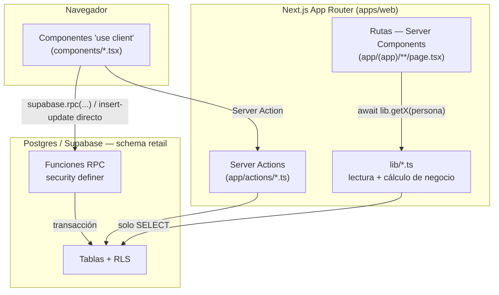

# Arquitectura de cayla-retail

> ⚠️ **Para el MODELO DE DATOS, este archivo ya no es la fuente.** Ve a
> **[`docs/datos/`](datos/README.md)**: ahí el diccionario se regenera desde la base real
> y no puede envejecer en silencio. Este documento sigue siendo el mapa del grafo
> rutas↔lib↔RPC del front, pero su foto del esquema quedó vieja — las afirmaciones que el
> SQL no respalda están listadas con archivo y línea en
> [`docs/datos/13-PROMESAS-INCUMPLIDAS.md`](datos/13-PROMESAS-INCUMPLIDAS.md).

> Mapa de referencia del sistema completo: negocio, stack, modelo de datos y
> el grafo de conexiones real entre rutas, componentes, `lib/` y la base de
> datos. Generado el 2026-09-04 leyendo el código fuente (no la visión de
> `CLAUDE.md`, que describe una arquitectura futura hipotética NestJS/Prisma —
> ver nota al final). Si el código cambia, este documento se desactualiza:
> no es la fuente de verdad, es un mapa para orientarse rápido.

---

## 1. Qué es CAYLA

CAYLA es retail de indumentaria y bisutería peruana con producción textil
propia: 3 tiendas (TRU-Trujillo, AQP-Arequipa, LIM-Lima) más un Taller en
Lima que corta, confecciona y termina prendas. Antes de este sistema, la
operación se llevaba en un Excel llamado "SINATRA" (ventas 2026 medidas ahí:
S/438k TRU, S/177k AQP, S/30k LIM). `cayla-retail` es el ERP que lo
reemplaza: inventario, ventas de tienda, producción del Taller y
contabilidad, todo sobre una misma base de datos.

CAYLA comparte dueño (Felipe) y algunas sedes con otro sistema, **cayla-
dynamic** (RR.HH. / personas), pero son dos repos y dos dominios de negocio
distintos que hoy conviven en el mismo proyecto de Supabase — ver §7.

---

## 2. Stack y decisión de arquitectura

| Capa | Tecnología |
|---|---|
| Monorepo | pnpm workspaces + Turborepo |
| Frontend/servidor | Next.js (App Router: Server Components + Server Actions) |
| Base de datos | Postgres vía Supabase, **Row Level Security** + funciones RPC `security definer` |
| Tipos/validación compartida | `packages/shared` (Zod, enums), `packages/database` (tipos generados del schema) |
| Idioma del esquema | Español, tablas en `snake_case`, sin `tenant_id` |

**Decisión ya tomada (2026-07-16, documentada en `CLAUDE.md`):** no se migra
a NestJS + Prisma + inglés + `tenant_id`, que era el diseño de referencia
original. Se construye sobre lo que ya existe y está verificado:
**Next.js + Supabase con RLS**, tablas en español, CAYLA como único tenant
(la sede reemplaza la dimensión de aislamiento que en un SaaS multi-tenant
resolvería `tenant_id`). Esa combinación NestJS/Prisma queda como visión de
referencia para el día que CAYLA venda el sistema a otra marca — no es una
tarea pendiente de hoy.

**Cómo se escriben las políticas (ADR-0176, 2026-09-22):** las funciones de permisos
(`fn_es_lider()`, `fn_puede_editar_catalogo()`, …) van envueltas en `(select …)` y
`fn_puede_operar_ubicacion(col)` se abre en `(select fn_es_lider()) or col = (select
fn_ubicacion_actual_persona())`. Así Postgres las evalúa una vez por consulta y no una vez
por fila: con 24 mil movimientos, eso es la diferencia entre 57 s y 14 ms. Toda migración
que cree políticas termina con `select retail.fn_rls_una_vez_por_consulta();`.

---

## 3. Cómo se conecta todo (el grafo real)

**Patrón consistente en todo el repo:**
- **Lectura** (armar una pantalla): la ruta (Server Component) llama a
  `lib/*.ts`, que hace `SELECT` puro contra Postgres. Ningún archivo de
  `lib/` escribe ni llama RPCs.
- **Escritura** (mutar dinero, stock o producción): el componente cliente
  llama **directo** `supabase.rpc('nombre_funcion', ...)`. Las mutaciones
  no pasan por `lib/`. La única excepción es `SedeSwitcher`, que usa la
  Server Action `cambiarSedeActiva` (cambia una cookie, no datos de negocio).
- Todos los imports de `lib/` usan el alias `@/lib` (0 imports relativos),
  y los tipos/enums compartidos vienen de `@cayla-retail/shared` y
  `@cayla-retail/database`.

### 3.1 Mapa por dominio (ruta → lib → componentes → RPC/tablas)

**Identidad y sede**
- `lib/persona.ts` (`requirePersonaActual`, cacheado) resuelve rol
  (`lider`/`integrante`) y sede activa desde `personas` + cookie
  `cayla_sede_activa`. Se usa en *todas* las rutas. El permiso real lo
  valida el servidor vía `fn_puede_operar_sede` — la cookie es solo UX.
- `(app)/layout.tsx` → `AppShell.tsx` (shell de navegación de todo el app) +
  `SedeSwitcher.tsx` → Server Action `cambiarSedeActiva`. Monta además `SedeActiva.tsx` (la sede activa como contexto
  de cliente, de donde sale `x-ubicacion`).
- **Quién firma vs. quién tiene permiso (ADR-0161/0162, rama `claude/responsable-y-roles-spike`, sin pegar en
  producción).** Son dos preguntas distintas y viven en funciones distintas:
  - **Quién FIRMA** (`usuario_id`, `creado_por`, `*_por`): `retail.fn_actor_persona_id(p_de_tienda)`. Con sesión de
    **terminal** devuelve la persona del encabezado `x-responsable`, siempre, y exige que esté activa, con acceso a retail
    y **presente ahora** en la tienda de la terminal (`fn_persona_presente`); si no, lanza 42501 con `hint`
    `responsable_requerido` | `responsable_sin_acceso` | `responsable_no_presente`. Con sesión de **persona** devuelve a la
    persona misma, salvo en una operación de tienda (`p_de_tienda = true`) donde llegue `x-responsable` (o donde
    `fn_exige_responsable()` esté encendido): entonces exige también `x-ubicacion` (`ubicacion_requerida`) y la misma
    presencia. `x-momento` (hora de la venta sin conexión, acotada a 7 días atrás y 5 min adelante) reemplaza a `now()`
    al validar la presencia. La F3 cambió en 65 funciones la búsqueda `select id into v_persona from personas where
    auth_user_id = auth.uid()` por esta llamada: 36 de tienda (`true`) y 29 que no (`false`: Compras, Producción,
    Colaboradores — firman siempre a nombre de quien inició sesión).
  - **Quién tiene PERMISO**: sigue siendo la **cuenta** (`auth.uid()`): `fn_es_lider`, las cinco `fn_puede_*`,
    `fn_tiene_acceso_retail`. Una terminal nunca es líder aunque la responsable elegida lo sea; si no, elegir a una líder
    en el combo (sin PIN) daría sus poderes a cualquiera. Excepciones decididas por Felipe: una terminal **descuenta sin
    tope** (`registrar_venta`: tope NULL) y **libera cualquier apartado** (`liberar_apartado` y `puede_liberar` de
    `listar_apartados`).
  - **`fn_exige_responsable()`**: interruptor, hoy `select false`. Mientras esté apagado, una persona que no manda
    `x-responsable` sigue firmando a su nombre; las terminales lo exigen siempre. Se enciende con un `create or replace`
    cuando la web publicada ya mande el encabezado en todas las pantallas de tienda.
  - **La web:** `lib/responsable-reglas.ts` (puro, con test: lista del combo desde `fn_asesoras_de_turno`, estado del
    combo, `firmar(consulta, firma)` que agrega los encabezados con `.setHeader`, `firmaDeEncabezados` para las rutas
    `/api/*`, traducción de los `hint`), `lib/useDeTurno.ts` (lee la asistencia), `lib/useResponsable.ts` (el estado:
    vacío siempre, vuelve a vacío al guardar) y `components/ComboResponsable.tsx` (el combo; botón apagado hasta
    elegir, bloqueo si no hay nadie presente). Pantallas conectadas: Punto de venta y ventas sin conexión, Caja,
    Cambios, Devoluciones, Facturación, Inventario (ajuste, apartados, piso, dañadas, conteo, traslados) y Catálogo. La
    lista completa y lo que queda fuera a propósito: ADR-0161, sección «F4b».
- `/colaboradores` (solo líder; ADR-0145, ADR-0148 y ADR-0157) → `lib/colaboradores.ts` (lecturas: `fn_colaboradores`,
  `fn_colaboradores_pendientes`, `fn_colaboradores_suspendidos`, `fn_colaboradores_inactivos`, `fn_colaboradores_actividad`,
  `fn_dynamic_disponibles`) → `ColaboradoresPanel.tsx` (dos secciones —Cuentas y Roles y accesos—, «Por atender», Actividad en modal; ADR-0172) + `ColaboradoresTablas.tsx` +
  `ColaboradoresModales.tsx` + `ui/MenuAcciones.tsx`. Escribe por `lib/colaboradores-acciones.ts` → RPC
  `agregar_colaboradores`, `fn_aprobar_alta_colaborador`, `suspender_colaborador`, `reactivar_colaborador`,
  `cambiar_ubicacion_colaborador`, `quitar_colaborador`. Reglas puras en `colaboradores-reglas.ts`.
  **Suspender mueve la fila** de `colaboradores` a `colaboradores_suspendidos`; el historial vive en
  `colaboradores_historial` (solo se agrega). `/vender/historial` también lee estas listas para el filtro «vendedor».
  **Terminales sin persona (ADR-0162, reemplaza la terminal-persona de ADR-0152/0160):** un aparato por fila en
  `retail.terminales` (tienda, tipo `ventas` | `administrativa`, cuenta de Auth propia, una activa de cada tipo por tienda).
  Cuentas ▸ Terminales lee `fn_terminales()` (`getTerminales` en `lib/colaboradores.ts`, tolerado) y hace
  `desactivar_terminal` / `reactivar_terminal` (`TablaTerminales`, `AlternarTerminalModal`). **Crear y cambiar la clave no
  es una RPC:** exige la llave de servicio y lo hace `pnpm terminales:crear` (`scripts/terminales/`). `colaboradores.terminal`
  quedó retirada (siempre null) y `agregar_terminal` lanza 0A000. Los poderes siguen siendo las cinco capacidades
  (`fn_puede_gestionar_caja`, `fn_puede_ajustar_inventario`, `fn_puede_editar_catalogo`, `fn_puede_editar_cuentas_proveedor` y, solo del
  líder, `fn_puede_dar_descuento_por_etiqueta`); `fn_es_terminal` / `fn_mi_terminal` ahora leen `retail.terminales`. La web
  pregunta por permiso (`puede`/`exigirPermiso` en `lib/persona-actual.ts`, `permisosDe(rol, terminal)` y `terminales` por nodo
  en `lib/menu.ts`); `persona.terminal` distinto de null = la sesión es un APARATO (pie del lateral con el aparato, sin «Mi perfil»).
  La sesión de una terminal entra por el mismo `requirePersonaActualV2` (su fila viene de `fn_persona_actual_resumen`,
  que ahora tiene rama de terminal); una terminal desactivada ve su propio aviso en `/login`. `desactivar_terminal` corta
  la sesión en el acto (`fn_terminal_actual` deja de devolverla). Alta y clave: `pnpm terminales:crear` (lo corre Felipe con
  la llave de servicio; muestra la clave una sola vez; partes puras probadas con `pnpm terminales:probar`).
  **D-70 (ADR-0157): el alta de un colaborador (persona) no queda operativa sola.** `colaboradores.estado`
  (`pendiente_aprobacion`/`activo`) gatea `fn_es_lider`, `fn_ubicacion_actual_persona`, `fn_tiene_acceso_retail`, `fn_mi_perfil`,
  `fn_persona_actual_resumen` (el gate de login) y `fn_stock_por_sede` — las seis funciones que leen
  `colaboradores`, no solo las tres obvias. `fn_aprobar_alta_colaborador` (solo líder) es el segundo paso.

**Catálogo / inventario**
- `/inventario` → `lib/inteligencia.ts` (`getCatalogoInteligente`, reusa
  `lib/catalogo.ts:getCatalogoConStock`) → `InventarioAgrupado.tsx` →
  `MovimientoModal.tsx` → RPC `registrar_movimiento` (excluye venta a
  propósito, para no romper la trazabilidad caja↔movimiento).
- `/inventario/almacen` → `AlmacenStockList.tsx` → `BajarATiendaModal.tsx`
  → RPC `bajar_a_piso` (mueve de `stock_almacen` a `stock` de piso).
- `/inventario/recibir` → `lib/catalogo.ts` → `RecibirLoteForm.tsx` → RPC
  `recibir_lote` (la función más inestable del sistema, ver §6).
- `/inventario/compras` → `ComprasManager.tsx` (escribe directo en
  `ordenes_compra`, sin RPC).
- `/inventario/proveedores` → `ProveedoresManager.tsx` (directo en
  `proveedores`).
- `/inventario/etiquetas` → `lib/catalogo.ts` → `EtiquetasGenerator.tsx`
  (solo lectura, genera Code128 e imprime).
- `/buscar` → `lib/catalogo.ts` + `lib/sedes.ts` → `BuscadorHero.tsx`.
- `/producto/[varianteId]` → `lib/inteligencia.ts` → `FotoProducto.tsx`,
  `MinimosPorSede.tsx` (RPC `fijar_stock_minimo`), `RecetaCosto.tsx`
  (BOM: `insert`/`delete` directo en `bom_items`).
- `/almacen` y `/almacen/recibir` → **redirects puros**, declarados en
  `redirects()` de `next.config.ts` (movidos desde página-stub el 2026-09-17,
  ver ✨ MEJORAR de BACKLOG) a `/inventario` y `/inventario/recibir`
  (compat de enlaces guardados tras el rediseño UX 2026-07-18; resuelven en
  el edge, sin sesión ni consulta a Supabase — no es código en `app/`).
  `/almacen` ya NO apunta a `/inventario/almacen` — esa ruta murió el
  2026-09-16 (ADR-0071 unificó piso+almacén dentro de `/inventario`) y el
  stub viejo quedó redirigiendo a un 404 sin que nadie lo notara; corregido
  de paso al mover esto a la config (ver nota en `next.config.ts`).
- `/inventario/movimientos` (V2, 2026-09-15, ADR-0050; mudada desde `/movimientos`
  el 2026-09-16, ADR-0071 — la ruta vieja es un `permanentRedirect` que conserva
  los filtros; simplificada el 2026-09-19, ADR-0127) → `lib/movimientos-v2.ts`
  (`listarMovimientos`, `getResumenMovimientos`) → RPC `fn_movimientos` /
  `fn_movimientos_resumen` (lectura pura, cursor, filtros en Postgres; la búsqueda
  por prenda **y por proceso** —«Traslado 24», «B001-000184»— la resuelve
  `fn_movimientos_busqueda`, una sola vez para la lista y las tarjetas; la parte de prenda es
  el Filtro de búsqueda especial escrito en SQL, `fn_movimientos_variantes`, migración `20260921153700`:
  ver su fila en la tabla de RPC y el ADR-0071) →
  `FiltrosMovimientos.tsx` (rediseño 2026-09-22: fila 1 buscador + Período; fila 2 Tipo con
  su cifra y Sububicación segmentada; debajo, los procesos del tipo elegido —
  `PROCESOS_POR_CATEGORIA`—; todo en la URL; la sede la decide solo el selector de la
  cabecera) + `MovimientosLista.tsx` (lista de la guía oficial agrupada por día: punto ·
  prenda con talla, color, hora y dónde · proceso con origen → destino · referencia ·
  cantidad; en celular, dos líneas; la referencia —`Traslado N`, `Conteo N`, `Boleta …`, `Factura …`—
  enlaza a `/inventario/traslados/[id]` y `/inventario/conteo/[id]`, y Traslados
  cuenta el proceso completo) + `MovimientoDetalle.tsx` (modal por proceso, sin
  segunda consulta; ahí sigue la persona). Sin filtro por persona ni columna
  «Responsable»: la autoría sigue en `movimientos.usuario_id`. Las reglas de pantalla
  (categoría, signo, nombre del proceso, referencia por proceso, período) viven en
  `lib/movimientos-reglas.ts`, sin servidor. Sin escritura: el ledger es inmutable.

**Inventario V2 — cuatro pantallas operativas + una de decisión (2026-09-16, ADR-0071;
quinta pestaña 2026-09-17, ADR-0101).** El lateral tiene un grupo "Inventario"
(`AppShell.tsx`, `grupoInventario`) —la única navegación entre ellas desde 2026-09-21:
`inventario/layout.tsx` ya no monta franja de pestañas— con Existencias · Movimientos · Traslados · Conteo · Análisis (esta
última solo líder). Todo `/inventario/*` va a ancho completo (`SIN_TOPE_DE_ANCHO`).
- `/inventario` (Existencias) → `lib/inventario-v2.ts:getExistencias` = `getStockPorUbicacion`
  (tabla `stock` agregada por variante) + RPC `fn_stock_por_sede` (dónde más hay, la misma
  de Vender, vía `lib/stock-por-sede.ts`) + `transferencia_items` en tránsito hacia acá →
  `InventarioPanel.tsx` (tres tarjetas, filtros en memoria —el buscador es el Filtro de búsqueda especial,
  `lib/filtro-busqueda-especial.ts`: términos en cualquier orden sobre nombre/SKU/código/color/talla—, semáforo de 4 estados con
  `calcularEstado` en `lib/inventario-reglas.ts`, leyenda; primera columna «Producto / variante» =
  `ProductoVarianteCelda` de `ui/PrendaCelda.tsx`, la misma que dibuja Conteo) → `ReponerPisoModal.tsx` (RPC
  `mover_interno`) y `AjustarInventarioModal.tsx` (RPC `registrar_movimiento`).
- `/inventario/traslados` → `lib/traslados.ts` (`getTrasladosDeLaSede`: en curso + últimos 30
  cerrados + miniaturas con UNA consulta de fotos, tolerante a fallo; `numero`; `colores` de `colores.hex`
  para la muestra sin foto; los traslados SIN prendas se apartan con `separarVacios` y se cuentan en
  `vacios`, ADR-0172) →
  `TrasladosPanel.tsx` (el único con estado: filtros, buscador, paginación, refresco cada minuto) →
  `TrasladosAtencion` / `TrasladosResumen` (las tarjetas SON el filtro de por recibir / en camino / con
  diferencia, ADR-0175) / `TrasladosFiltros` (chips Abiertos · Cerrados · Todos, dirección segmentada a la
  vista, otra sede en «Más filtros») / `TrasladosLista` (6 columnas desde 1280 px, tarjeta debajo) +
  `TrasladoEstado` / `TrasladoLlegada` / `TrasladoMiniaturas`. Todo lo que se decide (qué requiere
  acción, qué viene en camino, cuántas prendas están en tránsito, el orden por espera) vive en
  `lib/traslados-reglas.ts` (`situacionTraslado`, ADR-0105) y se comparte con el contador «por atender»
  del menú: `getTrasladosPorAtender` (total, nunca lanza; `transferencia_items!inner` deja fuera los vacíos) → `(app)/layout.tsx`
  → `AppShell` (`ui/Insignia`). Las fotos se eligen con `lib/producto-fotos-reglas.ts`
  (color exacto o general, nunca de otro color) →
  `/inventario/traslados/[id]` → `getTrasladoDetalle` (líneas por `fn_traslado_lineas`; quién envió, contó y
  cerró por `fn_nombres_personas`; color y foto por `getAparienciaVariantes`) → `TrasladoRecorrido.tsx` (4 pasos,
  `recorridoTraslado`) + `TrasladoDetallePanel.tsx` (conteo por borradores con `leerRecepcion`; al confirmar,
  cerrar o guardar el recuento manda cada línea cambiada a `registrar_recepcion_traslado` y después
  `confirmar_traslado` / `cerrar_traslado_con_diferencia`; confirma con `<Modal>`; ADR-0173).
- `/inventario/conteo` → `lib/conteos.ts` (`getConteoAbierto`, `getConteosResumen` → RPC
  `fn_conteos_resumen`, `getPrevisualizacionCierre`, `getPrioridadConteo` + su `apariencia`: foto principal y
  `colorHex` de `lib/apariencia-variantes.ts`, la regla de Existencias; si falla degrada, no tumba) →
  `ConteoVista.tsx` (dibuja; la página solo lee) → `ConteoPanel.tsx` (abrir en tres pasos; contar con «Suma por
  escaneo» o «Escribir cantidad», escrituras en fila; «Faltan por contar» sin la cifra del sistema; revisar en
  `<Modal>`; RPC `abrir_conteo`, `conteo_contar`, `cerrar_conteo`, `anular_conteo`) + `ConteosLista.tsx` (historial,
  «Vacío») → `/inventario/conteo/[id]` → `ConteoDetalleVista.tsx` (`getConteoDetalle`, que trae foto, `colorHex` y
  soles por línea en su misma consulta; solo lectura; `?ver=todas`). Reglas puras en `lib/conteo-reglas.ts`
  (ADR-0174); exactitud con `exactitudConteos` (`lib/conteo-varianza.ts`). `cerrar_conteo` rechaza un conteo sin
  prendas (hint `conteo_vacio`, `20260923120000`, en producción desde el 2026-09-22).
- `/inventario/resumen` (**Análisis de inventario**, solo líder; nació como «Resumen» en ADR-0101/0121 y se
  repartió y rediseñó en ADR-0138) → `page.tsx` lee de la URL `preset, desde, hasta, q, cat, st, orden, pag` (+
  `modo=comparar`, `comparar`, `cdesde`, `chasta`, `vista`, `cambio`). La sede es SIEMPRE la del selector global.
  Tres responsabilidades, una pantalla cada una: **Existencias** = qué hay AHORA (con su cobertura),
  **Análisis › Desempeño** = cómo se comportó el inventario en el período, **Análisis › Comparar períodos** =
  qué cambió entre dos períodos. El análisis NO mezcla el stock de hoy con métricas del período; Comparar
  tampoco responde qué stock hay ahora ni cuánto dura (por eso no tiene cobertura: es de Existencias).
  · **Desempeño** (por defecto) → `lib/resumen-inventario.ts:getDesempenoInventario` = RPC
  `fn_resumen_comparacion` con el período partido en dos mitades (A = 1.ª, B = 2.ª; paginada de a 1000) +
  `getConteosResumen`/`exactitudConteos` → `lib/resumen-desempeno.ts:armarDesempeno` (puro: suma las mitades,
  toma el stock al inicio de A y al cierre de B, y calcula vendido, ritmo, sell-through, rotación y tendencia con
  `metricasDePeriodo`, `calcularSellThrough` y `calcularTendencia`; desde el 2026-09-22 también las cifras y los
  gráficos del período: `calcularKpisDesempeno`, `contarTendencias`, `rankingRotacionDesempeno`,
  `distribucionDesempeno`, sobre el alcance) → `ResumenDesempenoPanel` con `ResumenControles` (una barra: período ·
  categoría, búsqueda debajo), `ResumenDesempenoGeneral` (4 cifras + dona de tendencia + top rotación + distribución
  de sell-through) y `ResumenComportamiento` (tabla «Comportamiento del inventario» con la banda de sell-through en
  su cabecera y la columna «Lectura del período», orden por defecto «Más vendidos», 15 filas). ADR-0171.
  · **Comparar períodos** (rediseño visual 2026-09-19) → `getComparacionInventario` = la misma RPC con A y B
  elegidos → `lib/resumen-comparacion.ts:armarComparacion` → `ResumenComparacionPanel`: contexto en dos
  píldoras «Período A: desde … hasta …» y «Período B: …» (`ResumenControles`, diseño de Figma 2026-09-21; cada una
  abre el MISMO selector de fechas —`PopoverRango`, el de «Personalizado» de Desempeño, con Desde/Hasta escritos a mano;
  los atajos de A y B van dentro—; la búsqueda vive solo en Detalle) + `…General` (4 KPI A → B — Ventas, Rotación, Sell-through, Capital —, dona «Evolución del
  ritmo» con `evolucionDelRitmo`/`evolucionRitmoTotal` sobre `calcularTendencia`, barras A/B «Top rotación» y
  «Distribución de sell-through», los tres en una fila) + `…Detalle` DEBAJO, en la misma pantalla (desde el 2026-09-22
  ya no hay «Vista general / Detalle»: la dona filtra la tabla con `?cambio=`). La columna «Cambio relevante» de las
  dos tablas sale de `lib/resumen-lectura.ts` (`lecturaDesempeno`, `lecturaComparacion`: 7 reglas en orden; en Comparar
  la regla 4 es `cambioMostrado` con su `PRIORIDAD_CAMBIO`). Sin datos o en el Taller: `ResumenVacio` (ampliar a 90
  días, ver otra tienda con `cambiarUbicacionActiva`, ir a Recibir). Exactitud: `ResumenBanner` como franja bajo el
  título. ADR-0171.
  · **Rotación** = `lib/rotacion.ts` (COGS ÷ inventario promedio a costo; fallback de dos puntos, punto de
  sustitución para un promedio diario): la ÚNICA fórmula de las filas, el ranking, los órdenes y los KPI de
  Desempeño y Comparar. Una variante es estricta (sin dato = N/D); un total es `rotacionAgregada` (Σ COGS ÷ Σ
  inventario promedio de las variantes válidas, con cuántas quedaron fuera y por qué) y A contra B es
  `rotacionComparada` (solo las variantes válidas en los dos períodos). Límites documentados en su encabezado:
  promedio de dos puntos e inventario valorado al costo vigente (el COGS es el histórico de cada venta).
  · Comunes: `ResumenCabecera` (pestañas Desempeño | Comparar períodos), `ResumenActualizado` («Actualizado
  hh:mm ⓘ»), `ResumenBanner` (exactitud), `ResumenBloques` (solo la tarjeta `Bloque`), `ui/BuscadorDebounced`
  (el campo de búsqueda con espera de 350 ms, antes duplicado entre Desempeño y Comparar), `resumen-periodo`,
  `resumen-filtros` (alcance + bandas de sell-through), `resumen-busqueda`.
  · Sin UI desde ADR-0138 (dependían del stock de hoy y salieron del análisis): las 5 tarjetas de señales, la
  tabla de prioridades con acciones, el detalle/capital en modal y los 3 bloques inferiores. Su LÓGICA sigue en
  `lib/` (`resumen-reglas` motor de reposición, curvas rotas y capital; `resumen-acciones`; `armarResumen`),
  con sus pruebas, para cuando esos flujos operativos tengan casa (Existencias).
  · **Miniatura + color** (`ui/PrendaCelda.tsx:SinFoto`, `ui/MuestraColor.tsx`, el mismo lenguaje que Existencias)
  en toda fila «Producto/variante» que sea una tabla real: Desempeño, Comparar (Detalle), Movimientos,
  Traslados › detalle y Conteo › detalle. Sin miniatura ni cápsula en Mover/Recibir (son `<select>` nativos: un
  `<option>` no admite marcado) ni donde el hex de color no viaja hasta la fila (Movimientos muestra el color como
  texto; Traslados › detalle ya usa `ProductoVarianteCelda` con color y foto desde ADR-0173; Desempeño, Comparar y Conteo › detalle tienen `colorHex` en sus datos, y el último
  usa la celda completa de Existencias, `ProductoVarianteCelda`, con la foto principal del producto).
  · **Existencias** (`/inventario`) gana la cobertura: `getCoberturaPorVariante` = `fn_resumen_variantes` con la
  ventana de `DIAS_RITMO_RECIENTE` (30 días) + `calcularCobertura`; segunda línea bajo «Disponible», dato
  secundario que degrada a «N/D» (nunca tumba la pantalla).
- `/inventario/recibir` (sin factura) y `/inventario/mover` (`MoverMercaderiaFormV2.tsx`
  → RPC `iniciar_traslado`; acepta prellenado por URL desde Resumen, validado en la
  página) siguen vivas como rutas, sin pestaña propia: se llega por
  «+ Nuevo traslado» / «+ Nuevo».
- `/etiquetas-de-precio?lotes=…|?produccion=…|?campana=…|?producto=…` (ADR-0180; sin módulo propio, la salida de otras
  pantallas) → `lib/etiquetas-precio.ts` (`getEtiquetasDePrecio`: las `movimientos` de entrada del ingreso por `lote_id` o
  `produccion_id`, o el `stock` de la tienda de la sesión para una campaña o un producto; el alcance de una campaña y la
  campaña de HOY de cada prenda con `fn_campanas_por_variante`; todo con `leerTodas`; SIN RPC ni tabla nueva) +
  `lib/etiqueta-precio-reglas.ts` (puro: sumar por prenda, tallas del modelo, respaldo de SKU, mejor campaña, fecha de
  alcance, textos de la pantalla, cantidades, URL) → `ImprimirEtiquetasPrecio.tsx` (cantidades, vista previa, `window.print()`; la
  hoja `#etiquetas-precio-print` va por portal a `<body>`) → `EtiquetaPrecio.tsx` (el diseño, en mm: `.etiqueta-precio` y
  `@page etiqueta-precio` 62 × 92 mm en `globals.css`; QR con `CodigoQR` a 25 mm). Se llega desde `EnvioRecibido.tsx`
  (Recibir: los `lotes` que devuelve `recibir_envio`), `RecepcionFormV2.tsx` (Ingreso sin comprobante: el id que devuelve
  `recibir_lote`), la sección «Siguiente paso» de `OrdenPanel.tsx` (orden del Taller cerrada, no muestra), la tarjeta de
  cada campaña en `EtiquetasLista.tsx` («Imprimir etiquetas de precio» / «Volver al precio normal») y Productos
  (`ProductosAgrupados.tsx`, menú «···»; `ProductosGrilla.tsx`, la ficha).

**Productos (catálogo V2, integración final 2026-09-15)**
- `/productos` → `lib/catalogo-v2.ts` (`listarProductos`/`getResumenProductos`,
  filtros en la URL + Postgres, RPC `fn_productos`/`fn_productos_resumen`,
  `20260915160000_productos_listado_filtros.sql`) → `FiltrosProductos.tsx` +
  `ProductosAgrupados.tsx` (una fila por producto, expandible a variantes;
  checkboxes de selección y menú "..." por fila viven acá, es Server
  Component el padre). El menú abre `AjustarInventarioModal.tsx` (RPC
  `registrar_movimiento`, tipo='ajuste', piso/almacén vía
  `lib/sububicaciones.ts`) como modal de `useState` normal, y "Ver
  historial" navega a `/productos/[id]/historial`.
- Historial de producto como modal (mismo mecanismo que el detalle de
  factura de Compras): `/productos/layout.tsx` tiene el slot `@modal/`, con
  la ruta interceptada `@modal/(.)[id]/historial`. Clic en "Ver historial"
  desde la lista → la URL pasa a `/productos/<id>/historial` pero la lista
  queda montada detrás y el panel se dibuja en `ui/ModalRuta.tsx`; recarga o
  enlace directo → página completa `[id]/historial/page.tsx`. Ambas
  reusan `HistorialProductoPanel.tsx`, que junta dos fuentes con historias
  distintas: `lib/movimientos-v2.ts:listarMovimientosProducto` (stock, cursor,
  por sede) y `lib/historial-producto.ts:getCambiosProducto` (RPC
  `fn_historial_producto_cambios`: precio/categoría/estado, ledger
  append-only `historial_producto_cambios`, trigger `fn_registrar_cambio_producto`
  sobre `productos`/`variantes` — ADR-0059, ampliado en
  `20260915223000_historial_producto_estado.sql` para no perder los cambios
  de `estado`).
- Acciones masivas (activar/desactivar sobre la selección): UPDATE directo
  de `productos.estado` desde el cliente — sin RPC propia, ya alcanza con la
  RLS `productos_write_lider` (0004_rls.sql, solo líderes) y el trigger de
  arriba lo audita solo.

**Producción (módulo propio, ADR-0133 — F1 aplicada 2026-09-19)**
- Producción y Compras son **dos módulos distintos** con su propio grupo en el lateral (Compras: sus 4
  pantallas, sin cambios). Producción arranca con `/produccion/ordenes` y suma pantallas con sus fases.
  Qué ve cada perfil: el menú es un ÁRBOL DE DATOS en `lib/menu.ts` (`menuPara`, puro, con la fotografía `menu-hoy.golden.json`; ADR-0144); `lib/produccion-menu.ts` (`hijosMenuProduccion` / `hijosMenuCompras`) es ahora una vista fina sobre él. Para agregar una fila se edita `menu.ts`, no `AppShell.tsx`. `/produccion` redirige a `/produccion/ordenes`
  hasta que exista el Resumen (F6). Plan por fases: `docs/PLAN-PRODUCCION.md`.

**Producción (Taller)**
- `/produccion/insumos` → `lib/insumos.ts:getInsumosDelTaller` (saldo derivado del ledger `movimientos_insumo`; costos recortados en el servidor si no es líder) +
  `lib/insumos-reglas.ts` (puro) → `InsumosPanel.tsx`, `InsumoModales.tsx` (INSERT en `insumos`; RPC `recibir_insumo`). Desde la orden,
  `OrdenInsumos.tsx` llama `registrar_consumo_insumo`. Devolver: RPC `devolver_insumo_de_produccion` (vuelve al último lote del que salió la orden, F3b); `anular_produccion` devuelve lo descontado; el costo de tela/avíos de la orden es neto (`fn_recalcular_costo_insumos_produccion`).
- `/produccion/proveedores` (solo líder) → `lib/proveedores-produccion.ts:getProveedoresProduccion` (RPC `fn_proveedores_produccion`) + `lib/proveedores-produccion-reglas.ts` (puro) →
  `ProveedoresProduccionPanel.tsx`, `ProveedorProduccionModal.tsx` (RPC `guardar_proveedor_produccion`, `cambiar_estado_proveedor_produccion`). Tabla `proveedores_produccion`
  (RLS solo-líder, sin grants de escritura); `insumos.proveedor_id` e `insumo_lotes.proveedor_id` apuntan a ella, no a `proveedores` de Compras.
- **Del Taller a las tiendas (F8):** `OrdenCierre.tsx` (aviso con botón) y `OrdenPanel.tsx` (orden terminada) → `lib/produccion-reglas.ts:urlLlevarATiendas` → `/inventario/mover?origen=<Taller>&lineas=…` →
  `app/(app)/inventario/mover/page.tsx` (`parsearLineasPrellenadas`, valida contra el stock movible) → `MoverMercaderiaFormV2.tsx` (`lineasIniciales`). El traslado sigue siendo `iniciar_traslado`, en dos fases.
- `/produccion/eficiencia` (solo líder; F7) → `app/(app)/produccion/eficiencia/page.tsx` junta órdenes cerradas (`getOrdenesProduccion`), la planilla del Taller (`lib/eficiencia.ts:getPlanillaDelTaller` → vista puente
  `retail.planilla_por_sede`, security_invoker sobre `public.v_planilla_pagada` de Dynamic: solo importes agregados, D-33) y los gastos del Taller (`gastos`, Finanzas ADR-0117) y calcula con `lib/eficiencia-reglas.ts`
  (puro: ventanas de período 29–28, costo por prenda, reparto del gasto) → `EficienciaTallerPanel.tsx`.
- `/produccion` (Resumen, solo líder; F6) → `app/(app)/produccion/page.tsx` junta órdenes, insumos, lo por recibir, comprobantes y la decisión de la red (`getDecisionProduccion`) y calcula con `lib/produccion-decisiones.ts`
  (puro: tarjetas, demanda de insumos de las órdenes abiertas, filas por modelo y por tela, cifras) → `ResumenProduccionPanel.tsx` (componente de servidor: enlaces a `?orden=` / `?nueva=` de Órdenes).
- **Nueva orden con decisión (F5, solo líder):** `app/(app)/produccion/ordenes/page.tsx` → `lib/decision-produccion.ts:getDecisionProduccion` (ritmo y stock de cada sede por `getFilasRecientesDeSede` →
  `fn_resumen_variantes`; consumo real de órdenes cerradas; saldo de Insumos; lo facturado por llegar) + `lib/produccion-decision-reglas.ts` (puro: demanda de la red, curva sugerida, rendimiento medido, ¿alcanza?) →
  `OrdenesTablero.tsx` → `NuevaOrdenProduccionForm.tsx`. Sin esquema nuevo.
- **Candado del dinero de Producción (F4e, D-G):** `authenticated` no tiene SELECT sobre `insumo_lotes.costo_unitario`, `movimientos_insumo.costo_unitario` ni `producciones.costo_*` (privilegio por columna).
  El líder los lee por `fn_costos_insumos_taller` y `fn_costos_producciones` (`lib/insumos.ts`, `lib/produccion.ts`); las RPC `security definer` los leen por su dueño. `v_insumo_saldos` cerrada.
- `/produccion/recibir` (Taller: líder y colaborador del Taller, SIN montos) → `lib/recibir-produccion.ts` (RPC `fn_lineas_comprobantes_produccion`: solo cantidades) +
  `lib/recibir-produccion-reglas.ts` (puro: agrupar, estado, armar la recepción) → `RecibirProduccionPanel.tsx`, `RecibirComprobanteModal.tsx` (RPC `recibir_comprobante_produccion`: un lote por línea,
  cierres con motivo, idempotente). Tablas `comprobantes_produccion_recepciones`, `comprobantes_produccion_cierres`; `insumo_lotes.comprobante_item_id/recepcion_id`.
- `/produccion/por-pagar` (solo líder) → `lib/comprobantes-produccion.ts` + `lib/por-pagar-produccion-reglas.ts` (tramos de vencimiento, resumen) + `lib/deuda-consolidada.ts` (D-I: RPC
  `fn_deuda_consolidada`, `fn_igv_credito_fiscal`, que LEEN `compras`/`compra_notas_credito` sin modificarlas) → `PorPagarProduccionPanel.tsx`, `PagarComprobanteProduccionModal.tsx`
  (RPC `registrar_pago_comprobante_produccion`), `MediosDePago.tsx` + `lib/medios-pago-reglas.ts` (uno o varios medios, reusable).
- `/produccion/comprobantes` (solo líder) → `lib/comprobantes-produccion.ts` (RPC `fn_comprobantes_produccion`, que DERIVA pagado/saldo/vencido; catálogo de insumos) +
  `lib/comprobantes-produccion-reglas.ts` (puro: vista previa de totales, filtros, estado) → `ComprobantesProduccionPanel.tsx`, `ComprobanteProduccionForm.tsx` (RPC
  `registrar_comprobante_produccion`), `ComprobanteProduccionDetalle.tsx` (lee líneas y pagos por RLS; RPC `anular_comprobante_produccion`). Tablas `comprobantes_produccion`,
  `comprobantes_produccion_items`, `comprobantes_produccion_pagos` (RLS solo-líder, sin grants de escritura, líneas y pagos inmutables). No toca `compras`.
- `/produccion/ordenes` → `lib/produccion.ts` (`getTaller`, `getOrdenesProduccion`,
  `getModelosProducibles`; lectura con `exigir()`) + `lib/produccion-reglas.ts`
  (puro: etapas, semáforo de margen, costo unitario) → `OrdenesTablero.tsx`
  (tablero por etapa + muestras + terminadas / anuladas; tarjeta `OrdenTarjeta`, panel `OrdenPanel`
  con `MatrizOrden` y `OrdenCierre`; RPC `set_etapa_produccion`,
  `cerrar_produccion`, `anular_produccion`, `revertir_produccion`) y
  `NuevaOrdenProduccionForm.tsx` (RPC `abrir_produccion` con `p_token`). Entra el
  cualquier persona —líder o integrante— parada en una ubicación con `ubicacionTipo === "taller"` (`puedeVerProduccion`, en `lib/menu.ts` y re-exportada por `lib/produccion-menu.ts`;
  un líder que llega desde otra ubicación ve un aviso, ADR-0133 nota 2026-09-20).

**Ventas / caja**
- `/vender` → `lib/catalogo-v2.ts:getCatalogo` + `lib/caja.ts:getCajaAbierta` +
  `stock` de todas las sedes que RLS deje ver (`lib/stock-por-sede.ts`: aquí + dónde más
  hay; la RPC `fn_stock_por_sede` para colaboradoras está escrita y sin aplicar; «Ventas
  de hoy» firma cada venta con la integrante vía `lib/nombre-integrante.ts`) →
  `PuntoDeVenta.tsx` (padre: TODO el estado, handlers, cabecera con atajos a /caja,
  /cambios y /devoluciones,
  cabecera y modales; ADR-0043) que reparte en `PuntoDeVentaCatalogo.tsx` (escaneo
  primero y dominante, chips, grilla de **una tarjeta por prenda + color** con las tallas
  adentro —`lib/catalogo-grupos.ts`, memo del padre— filtro «Solo con stock», y «Ventas
  de hoy», que llega ya renderizado desde `page.tsx` vía RPC `fn_ventas_del_dia`; el
  escáner recibe el foco al abrir caja, al cerrar cualquier modal —`Modal.alCerrarEnfocar`—
  y ante una tecla suelta, regla en `lib/escaner-tecla-suelta.ts`; shadcn `Tooltip`/
  `Toggle`/`Badge`, ADR-0045 — sin reveal al scroll, por decisión) y `PuntoDeVentaTicket.tsx`
  (tres momentos, ADR-0044: «armar» = líneas + total; «descuento» = % global o por
  prenda, que viaja como `descuento_unitario` por línea; «cobrar» = método de pago,
  boleta/factura con el documento adentro, Confirmar cobro → RPC `registrar_venta`,
  que emite el comprobante en la misma transacción y, desde ADR-0048, rechaza precios
  distintos a `variantes.precio` y descuentos de Colaboradora sin código válido —
  tabla `codigos_descuento`; guarda `ventas.nota`, que `fn_ventas_del_dia` devuelve).
  Desde ADR-0163 el ticket lleva la fila «Atendió» (`VendedorasFila.tsx`): la lee el navegador cada
  minuto (`lib/useVendedorasDeTurno.ts` → `fn_asesoras_de_turno`, la asistencia de Dynamic) y
  `vendedorasDeTurno` deja solo a las presentes (o a todas las de la sede si nadie marcó hoy). Con 2 o
  más hay que tocar quién atendió para cobrar (`motivoBloqueoCobro`, `vendedoraDeLaVenta` en
  `lib/vender-reglas.ts`) y `registrar_venta` recibe `p_asesora_id`.
  `/vender?proforma=<id>` (ADR-0167): `getProformaParaCobrar` + `lib/proforma-al-carrito.ts` arman el carrito
  inicial (precio de hoy + lo prometido como descuento; `precioAlCobrarDeLaProforma`), la franja «Cobrando la
  proforma» y, tras `registrar_venta`, RPC `marcar_proforma_cobrada`.
  Descuento de campaña (ADR-0108, redondeo ADR-0182): la caja lo calcula con `descuentoDeCampana` (`lib/vender-reglas.ts`:
  el precio rebajado baja al .90, en enteros) y la base lo verifica con `retail.fn_descuento_campana`, la misma regla al
  céntimo, que usan `registrar_venta` y `separar_prendas` (la separación la calcula en `ApartarVista.tsx`). También la
  usa el aviso «quedaría bajo costo» al configurar una campaña (`prendasBajoCosto`). Prueba cruzada: `pnpm pruebas:campana-redondeo`.
  «Prenda sin registrar» (ADR-0179; antes «Monto manual»): el modal del POS (`lib/prenda-sin-registrar-reglas.ts`,
  listas de `categorias`/`tallas`/`colores` que carga `vender/page.tsx`) agrega una línea de la variante centinela
  `ID_CARGO_ESPECIAL` con `descripcion_libre`/`categoria_id`/`talla_id`/`color_codigo` en su ítem de `p_items`;
  `registrar_venta` la exige completa y en cantidad 1, **no mueve stock** por ella y la deja en
  `prendas_por_regularizar` (estado `pendiente`). El comprobante electrónico la nombra con `descripcion_libre`
  (`itemsParaLucode`). `anular_venta` salta la línea pendiente; un trigger en `ventas` pasa la fila a `anulada`, y
  otro en `cambios`/`devolucion_items` rechaza una prenda aún pendiente (`prenda_sin_regularizar`).
  El ticket en espera (Park/Resume, ADR-0049) no toca la base: `lib/almacen-local.ts`
  → `localStorage` `cayla:vender:<ubicacionId>:en-espera`, cargado tras montar, vaciado
  al cerrar caja; la cola offline usará el mismo módulo con otro `nombre`. `lib/vender-reglas.ts`:
  `motivoBloqueoCobro` (por qué el botón está apagado, derivado una vez),
  `aplicarDescuento`/`descuentoUnitarioPorPorcentaje`/`porcentajeDeLinea`,
  `restanteDePagos`/`vueltoDe` (pago mixto: `p_pagos` viaja como lista de
  `{ metodo, monto, recibido? }`, una fila por medio en `venta_pagos`; `pagosParaRpc` decide
  qué viaja y el `recibido` del efectivo se guarda en `venta_pagos.recibido`, ADR-0137;
  `pagosTrasEditarMonto` reparte el restante con dos medios y `pasoDelCobro` marca el paso
  que toca), `CampoMonto`, `PasosCobro` y `BilleteRapido`. El reflujo de las líneas es `Flip` de GSAP (`lib/motion-gsap.ts`,
  ADR-0045). Modales del padre:
  `AbrirCajaFormV2` (RPC `abrir_caja`) y `CerrarCajaModalV2` (RPC `cerrar_caja`, con
  conteo ciego: el esperado sale de la respuesta del cierre, no antes).
- **Caja: «Ver todo», detalle de venta y reimpresión** (ADR-0137). `CajaAbiertaPanel` calcula
  todos los movimientos (`FilaMovimientoCaja`: las ventas son botón) y la tarjeta muestra 8;
  `MovimientosCajaModal` los lista todos con scroll propio. `DetalleVentaModal` lee la venta al
  abrir con `lib/venta-detalle.ts:leerVentaDetalle` (cliente del navegador, la RLS decide quién ve
  qué) y arma el `VentaDetalle` con `lib/venta-detalle-reglas.ts:armarDetalleVenta` (puro; el
  vuelto sale de `venta_pagos.recibido`, NULL en ventas anteriores a 2026-09-19). Imprime con
  `ReciboTermico` (`#comprobante-print`) o `BoletaA4` (`#boleta-a4-print`, `lib/boleta-a4-reglas.ts`,
  `@page a4` en `globals.css`): una sola raíz de impresión pegada a `<body>` a la vez, y solo si
  `puedeImprimir(estado)` lo permite. Los modales van FUERA del `@container` del panel.
- **Cambios y Devoluciones comparten lector y piezas** (ADR-0125/0122): `lib/ventas-v2.ts:
  getVentasRecientes` (actividad = ventas de la sede de los últimos 15 días; búsqueda por
  boleta, DNI/RUC o nombre de la clienta —de `comprobantes`—, nombre o etiqueta de la prenda,
  o `?item=` para una prenda exacta; trae también los cambios y devoluciones ya hechos por
  línea, el descuento y si el comprobante está aceptado), `BuscadorVentas.tsx`,
  `ComprasAgrupadas.tsx` (lista por día y compra) y `FlujoGuiado.tsx` (pasos, botones,
  validaciones, foco/Escape). Reglas puras compartidas —plazo R-38, `unidadesDisponibles`
  (descuenta lo cambiado y lo devuelto), validaciones— en `lib/cambios-reglas.ts`.
- `/cambios` → `getVentasRecientes` + `getCatalogo` + stock del piso + `fn_stock_por_sede` +
  `getCajaAbierta` + `lib/cambios-estadisticas.ts` (hoy / mes / valor cambiado; "tallas que no
  calzan" solo para líderes) → `CambiosPanel.tsx` (bloques "Iniciar un cambio" y "Actividad
  reciente", filas en `CambiosVentas.tsx`) → `CambiosFlujo.tsx` (Venta → Prenda → Reemplazo →
  Confirmación, sin modal; paso 3 en `CambioReemplazo.tsx`, piezas de lectura en
  `CambioResumen.tsx`) → RPC `registrar_cambio` (motivo + condición de la prenda que vuelve:
  vendible al piso, no vendible a cuarentena con fila en `prendas_danadas.cambio_id`; rechaza
  ventas anuladas; migración 20260919000100).
- `/devoluciones` (ADR-0122) → `getVentasRecientes` + `lib/devoluciones.ts`
  (`getDevolucionesPendientes`, `getEstadisticasDevoluciones`) + `getCajaAbierta` →
  `DevolucionesPanel.tsx` (bloques "Iniciar una devolución", "Por aprobar" y "Actividad
  reciente"; filas en `DevolucionesVentas.tsx`; "Anular venta" en el encabezado de cada compra,
  solo líder) → `DevolucionesFlujo.tsx` (Venta → Prendas → Detalle → Confirmación: VARIAS
  prendas en una sola devolución) → RPC `crear_devolucion` (queda `pendiente`; no mueve nada) →
  `DevolucionesPendientes.tsx` (solo un líder) → RPCs `aprobar_devolucion` (mueve el stock, emite
  la Nota de Crédito si el comprobante está aceptado —ADR-0100— y el reembolso opcional; lo
  dañado entra a cuarentena) y `rechazar_devolucion`. Reglas puras en
  `lib/devoluciones-reglas.ts`. `?item=` abre el flujo sobre una prenda (desde y hacia Cambios).
- `/clientas` (2026-09-22, ADR-0154, D-76/D-77; **pantalla mínima de verificación, sin
  engancharse a `lib/menu.ts`** — la captura real en el mostrador es de otra tanda de
  agentes) → `lib/clientas.ts:getClientas` (lectura server) → `ClientasPanel.tsx` (lista +
  buscador + alta) → `lib/clientas-acciones.ts` → RPC `buscar_clienta` / `registrar_clienta`.
  Reglas puras (tipo + mapeo de fila) en `lib/clientas-reglas.ts`, mismo criterio de
  separación server/cliente que `ventas-historial.ts`/`ventas-historial-reglas.ts`.

**Compras (V2, ADR-0035 — la factura del proveedor es el eje)**
- `/compras/proveedores` → `lib/proveedores.ts:getProveedores` (RPC
  `fn_proveedores`: directorio + facturas vigentes + saldo + última compra) →
  `ProveedoresPanel.tsx` → RPCs `registrar_proveedor`, `actualizar_proveedor`,
  `desactivar_proveedor`, `reactivar_proveedor`
  (`20260914150000_proveedores_administrables.sql`). Es la puerta del módulo:
  `compras.proveedor_id` es FK dura, sin proveedor no hay factura. El alta
  consulta `GET /api/padron?tipo=ruc` para traer la razón social de SUNAT;
  si el padrón no responde, se escribe a mano y se guarda igual. Nunca borra:
  `activo=false`. Candados: `proveedores_ruc_unico` y
  `proveedores_nombre_clave_unica` (sobre `fn_clave_texto`, el mismo
  normalizador de `colores`/`categorias`).
  ADR-0128: la lista abre una vista rápida (`ProveedorVistaRapida.tsx`), dibuja sus cifras en
  `ProveedoresIndicadores.tsx` y lee la serie mensual de `lib/proveedores.ts:getProveedoresSerie` (RPC
  `fn_proveedores_serie_12m`, `20260919150000_proveedores_serie_mensual.sql`; opcional: sin ella la lista
  se pinta sin tendencias). Reglas puras (siguiente paso, reparto de deuda, serie de 12 meses, resaltado)
  en `lib/proveedores-reglas.ts`; movimiento en `lib/useFlip.ts`, `lib/useContar.ts` y las clases
  `anim-cajon*`/`anim-destello-fila`/`anim-crece-*`/`trazo-*` de `globals.css`.
  ADR-0134 (datos de pago): `proveedores` suma `cci` (20 dígitos), `celular_billetera` (9 dígitos, empieza con 9,
  sin +51), `billeteras text[]` (`yape`/`plin`, 1–2; hay celular si y solo si hay app) y `titular_cuenta` (2–120), con 5
  CHECK (`proveedores_cci_formato`, `_celular_billetera_formato`, `_billeteras_validas`, `_billetera_coherente`,
  `_titular_largo`). Se escriben por **una** RPC solo-líder, `guardar_cuentas_proveedor(uuid,text,text,text[],text)`
  (reemplazo completo; `registrar_proveedor`/`actualizar_proveedor` no cambiaron de firma) y se leen por `fn_proveedores()`
  (28 columnas; las 4 al final) y `getProveedor` (ficha). `cuenta_bancaria` pasa a ser la «cuenta local»; `telefono` es el
  WhatsApp. Migración `20260919170000_proveedores_cci_y_billetera.sql` (en producción como `20260919173940`). Pantallas:
  la tarjeta compartida `CuentasProveedor.tsx` («Paga por», «Ver completos», «Copiar») la usan la ficha
  (`/compras/proveedores/[id]`, «Datos para pagar»), `PagoJuntosModal` y el pago individual; `ProveedorModal` («Cómo
  pagarle»), la lista (chip/filtro «Sin datos de pago»), `LineasPago` y `CompraFormV2` (avisos de destino). Reglas puras en
  `lib/proveedores-reglas.ts` (normalizar/enmascarar/validar, `bancoDeCci`, `sinDatosDePago`, `cuentaLocalVisible`).
  **Marcas del proveedor (ADR-0142):** `lib/proveedores.ts:getMarcasPorProveedor` lee las tablas `marcas` y `marca_proveedores`
  (sin RPC ni migración) para que la lista, el detalle rápido, la ficha y el combo de `/compras/nueva` busquen y muestren al
  proveedor por su marca; es una lectura **opcional** (si falla llega `null` y todo se pinta sin marcas). Reglas puras:
  `marcasPorProveedor`, `textoBuscableProveedor`, `detalleProveedorCombo`, `marcasParaMostrar`. **No cubre** los buscadores de
  Comprobantes y Recepciones, que filtran el proveedor dentro de sus RPC (`listar_compras_operativo` y la de recepciones).
- `/compras` (Facturas), `/compras/nueva`, `/compras/factura/[compraId]`,
  `/compras/recibir`, `/compras/por-pagar` → `lib/compras.ts` →
  `CompraFormV2`, `CompraDetalle` + `CompraDetallePanel`, `RecepcionCompraFormV2` → RPCs
  `registrar_compra`, `recibir_compras`, `registrar_pagos_compra` (varios medios, todo o nada; `registrar_pago_compra` es el atajo de un medio),
  `anular_compra`, `listar_compras`, `resumen_compras`. Sub-navegación en
  `ComprasNav.tsx` (layout de `/compras`).
- **Notas de crédito** (2026-09-19, ADR-0142): `/compras/notas-credito` (solo líder) → `lib/notas-credito.ts`
  (lectura) + `lib/notas-credito-reglas.ts` (puro: urgencia a 14 días, FIFO para deducir «Aplicada», las tres
  partes del dinero, filtros y buscador) → `NotasCreditoPanel` (+ `NotaCreditoVistaRapida`, `NotaCreditoDetalle`,
  `RegistrarNotaCreditoModal`) → RPC `notas_credito_tablero()` (notas + notas pendientes en una llamada),
  `fn_facturas_para_nota_credito()` (busca la factura de origen por documento, proveedor y **monto**; `listar_compras`
  no busca por monto) y `registrar_nota_credito_compra` con `p_destino`: `'a_favor'` (por defecto) o `'reembolso'`,
  que escribe la nota y la devolución del sobrante en UNA transacción. Tablas: `compra_notas_credito`,
  `compra_item_cierres`, `proveedor_creditos` (libro del saldo a favor, append-only) y `compra_adjuntos.nota_credito_id`.
  **Recepción ya no registra notas** (ADR-0142): solo avisa con un chip al módulo; `recibir_envio` sigue aceptando
  `p_notas_credito` pero la pantalla lo manda vacío.
- **Recibir mercadería por envío** (2026-09-18, ADR-0113): `/recibir` (NO bajo `/compras`, que es solo
  líder; `/compras/recibir` redirige) → `lib/envio.ts` (traslados en tránsito hacia la sede) +
  `lib/envio-reglas.ts` (reglas puras: bloques por comprobante, totales, escaneo, el pedido a la RPC) →
  `RecepcionEnvio` + `KpisRecibir` (+ `ResumenPrevioEnvio`, `EnvioRecibido`, `RecepcionesCompraLista` con
  `RecepcionVistaRapida`, y desde ADR-0129 el diseño por ancho del panel) → RPC atómica e idempotente `recibir_envio` (llama a `recibir_compras` una
  vez por proveedor, `registrar_recepcion_traslado`/`confirmar_traslado`, `cerrar_linea_compra` y
  `registrar_nota_credito_compra`, esto último ya sin uso desde ADR-0142).
  **Pestaña «Por regularizar»** (`/recibir?vista=por-regularizar`, ADR-0179) → `lib/por-regularizar.ts` (lectura de
  `prendas_por_regularizar` + `fn_nombres_personas`; el líder ve todas sus sedes) + `lib/por-regularizar-reglas.ts`
  (vencida a los `DIAS_PARA_VENCER` = 2 días, tipo de diferencia, cifras del mes) → `PorRegularizarLista.tsx` → RPC
  `regularizar_prenda(p_id, p_variante_id, p_forma)`: `ya_registrada` = salida 1 (piso, si no almacén);
  `llego_nueva` = entrada `ingreso_regularizado` + salida; la salida lleva motivo `venta` y el `venta_item_id`, la
  línea pasa a la variante real y a su costo, y guarda `diferencia` = cobrado − oficial. `contarVencidas` alimenta la
  cola «Prendas por regularizar» del inicio del líder (`colasInicio`). Tablas `envios` (una guía; agrupa un lote por proveedor vía
  `lotes.envio_id`), `envio_extras` (fuera de comprobante: proveedor + regalo) y `envio_traslados`. Cuenta
  cualquier colaborador de la sede. **Quien no es líder no recibe montos, y eso lo hace cumplir la base** (ADR-0126):
  `lib/compras.ts` le pide los comprobantes y las líneas a `listar_compras_operativo` / `lineas_compra_operativo`
  (`security definer`, candado de sede, lista de permitidos: ni una columna de dinero) y no a `listar_compras` ni a la
  vista `compra_items_resumen`; las tablas `compras`, `compra_items`, `compra_pagos`, `compra_adjuntos` y
  `compra_notas_credito`, y el bucket `retail-compras-adjuntos`, solo las lee `fn_puede_ver_dinero_de_compras()` (hoy: el
  líder); las cinco funciones de dinero (`resumen_compras`, `resumen_compras_extra`, `deuda_por_vencimiento`,
  `salidas_caja_30d`, `por_pagar_tramos`) abren con `fn_exige_dinero_de_compras` y fallan `42501` para un integrante.
  `fn_aplicar_candado_de_dinero()` se los pone (o se los devuelve tras otra migración). La página además tacha los
  montos en el servidor como segunda línea (`comprobanteSinMontos`). «Recibidas» (`?vista=recibidas`) agrupa las filas
  de un envío de 2+ proveedores bajo una cabecera (`agruparPorEnvio`, `getEnviosDeLotes` lee `lotes.envio_id`).
- **Compras por tienda** (ADR-0179, 2026-09-23; migraciones `20260923180000`–`180400`, **no en producción todavía**). QUIÉN usa Compras
  lo dice el rol (ADR-0161, `fn_capacidad_por_modulos`); DE QUÉ TIENDAS, `fn_compras_ubicaciones()` → `uuid[]`: el líder todas; con módulo,
  su tienda (`fn_ubicacion_actual_persona`) más las extra de `compradores_de_tienda` (R-10; la tabla sola no da acceso). Cada factura tiene
  **tienda gestora** (`compras.ubicacion_gestion_id`, candado diferido: tiene parte en el reparto). Se ve ENTERA si eres líder o la gestora
  es tuya: `fn_compras_visibles()` (arreglo, una vez por consulta) en las políticas de `compras`, `compra_items`, `compra_pagos`,
  `compra_adjuntos`, `compra_notas_credito` y el bucket; `fn_compra_es_de_mis_tiendas(compra)` en indicadores, proveedores, notas de
  crédito y en las escrituras sobre una factura (anular, adjuntar, reasignar, nota). La vista `compra_parte_por_tienda` parte la cabecera
  al centavo. `compra_pagos.ubicacion_id` + `fn_saldo_de_tienda` + candado diferido: cada tienda paga su parte; las tres RPC de pago ganan
  `p_ubicacion_id` (obligatorio para quien no es líder). **F3-b:** la tienda con parte en una factura ajena no ve la tabla: lee su parte con
  `fn_mis_partes_de_compras()` / `fn_mi_parte_de_compra(compra)` (`lib/compras-mi-parte.ts`, `components/MisPartesDeCompras.tsx`,
  ruta `/compras/parte/[compraId]`). `cambiar_tienda_gestora_compra`: solo líder.
- **Un comprobante se reparte entre tiendas y cada tienda recibe lo suyo** (2026-09-19, ADR-0139; migraciones `20260919172000`
  + `20260919173000`, **en producción desde el 2026-09-20**). La factura ya no tiene un destino (`compras.ubicacion_destino_id` se
  elimina): tiene un **reparto por línea y tienda**, `compra_item_destinos` (siempre existe, aunque sea de una sola tienda; su
  suma por línea = la cantidad lo exige un constraint trigger diferido). Lo recibido por tienda no se guarda: sale de
  `movimientos` (`compra_item_id` + `ubicacion_id`) y lo cruza la vista `compra_item_reparto_resumen`
  (`pendiente = asignado − recibido − cerrado`). `recibir_compras` topa **por tienda**; `cerrar_linea_compra` lleva
  `p_ubicacion_id`; `reasignar_reparto_compra` (solo líder) mueve lo que aún no llegó y deja rastro en `compra_reasignaciones`;
  `fn_puede_ver_compra` reemplaza al candado por el destino de la cabecera; `compras_resumen.ubicaciones_destino` trae las
  tiendas. Web: `lib/reparto-reglas.ts` (reglas puras: validar y explicar un reparto, «Te toca 12 de 24»), `lib/compras-reparto.ts`
  (lee el reparto y las reasignaciones de un comprobante, tolerante), `lib/compras.ts` (`listarCompras`/`getLineasCompra` reciben la
  tienda y usan las RPC operativas). Pantallas: **Registrar** `CompraFormV2` + `RepartoEnRegistro` («Una tienda | Repartir entre
  tiendas»; `requisitosDeCompra` dice qué línea no cuadra), **`/recibir`** por tienda (perspectiva = tienda activa; `recibir/page.tsx`,
  `RecepcionEnvio`), **detalle** `CompraDetalle` + `RepartoPorTienda` (matriz línea × tienda) + `ReasignarReparto` (modal) +
  `CerrarFaltanteModal` (pide la tienda si la línea está repartida) y la **lista** («Repartida: …»). Comprobantes y Por pagar
  **no** se parten por tienda (R-04, R-10, R-12): siguen mostrando todo, y solo dicen a qué tiendas va cada comprobante.
- Detalle de factura como modal (2026-09-14): el layout de `/compras` tiene
  un slot paralelo `@modal/` con la ruta interceptada
  `@modal/(.)factura/[compraId]`. Al hacer clic en una fila (Facturas, Por
  pagar) la URL pasa a `/compras/factura/<id>` pero la lista queda montada
  detrás y el detalle se dibuja en `ui/ModalRuta.tsx` (cierra con
  `router.back()`); recarga o enlace directo → página completa
  `factura/[compraId]/page.tsx`. Ambas usan `components/CompraDetalle.tsx`.
  `@modal/default.tsx` (vacío) y `@modal/[...catchAll]` (limpia el modal al
  cambiar de pestaña) son parte del mecanismo. El prefijo `factura/` es
  obligatorio: un `(.)[compraId]` directo bajo `/compras` interceptaba
  también `/compras/por-pagar`, `/compras/nueva`, etc.
- Avisos globales (ADR-0047): `components/ui/Avisos.tsx`, montado en
  `app/layout.tsx`. Toda validación/error/éxito/proceso pasa por `avisar.*`
  (arriba a la derecha) y `enfocar` lleva el cursor al campo. Sin `useState`
  de error en componentes.
- Adjuntos de factura (ADR-0046, `20260914180000_compras_adjuntos.sql`):
  tabla `compra_adjuntos` + bucket privado `retail-compras-adjuntos`.
  `AdjuntosCompra.tsx` (selector en `/compras/nueva`, lista en el detalle) →
  `lib/adjuntos-compra.ts` sube del navegador al bucket y registra la fila
  con `registrar_adjunto_compra`; `archivar_adjunto_compra` quita de la
  vista (nunca borra). URL firmada de 1 h en `lib/compras.ts`.

**Producción (Taller)**
- `/produccion` → `OrdenesProduccion.tsx` → RPCs `registrar_produccion`,
  `set_etapa_produccion`, `cerrar_produccion`, `revertir_produccion_inventario`,
  `eliminar_produccion`. Modelo unificado en tabla `producciones` (el par
  viejo `ordenes_produccion`/`bom_items` de Fase 1 es legado sin RPC activo).

**Finanzas / contabilidad** (todas Líder-only)
- `/finanzas` → `lib/finanzas-nucleo.ts:getEERRMensual`.
- `/finanzas/balances` → `lib/contabilidad.ts:getEstadosContables` (los 4
  estados financieros, derivados por lectura — no hay tabla de asientos
  detrás de este cálculo, Activo=Pasivo+Patrimonio "por construcción").
- `/finanzas/efectivo` → `lib/finanzas-nucleo.ts:getCuadreEfectivo` →
  `EfectivoPanel.tsx` → RPC `registrar_deposito`.
- `/finanzas/registrar` → `RegistroContableForm.tsx`, que arma las líneas
  con las funciones **puras** de `lib/registro-contable.ts`
  (`opcionesPrincipal`, `construirLineas`, `sumaDebe/Haber` — garantizan
  Σdebe=Σhaber antes de enviar) y envía a RPC `registrar_asiento`, el
  único camino de escritura al libro diario.
- `/finanzas/activos`, `/finanzas/patrimonio`, `/finanzas/comparativo` →
  lectura + edición directa (`PatrimonioEditor`, `HistoricosEditor`).
- `RegistrarGastoModal.tsx` (accesible desde varias pantallas) → RPC
  `registrar_gasto`.
- `/vender/comprobantes/**` (se llamó `/vender/facturacion` hasta 2026-09-22, que redirige; ADR-0124,
  ADR-0165 y ADR-0167): `layout.tsx` lee la cola de SUNAT (`fn_comprobantes_cola_reintento`) y los
  contadores, y los pasa a `FacturacionShell.tsx` (cabecera con la pastilla «Pruebas» si `LUCODE_ENTORNO` no
  es producción, aviso rojo si algo pasa 1 hora en cola, pestañas y buscador; ya no dibuja modales: «Emitir
  comprobante» se quitó el 2026-09-22). Monta `BarridoColaSunat`, que al abrir llama a
  `POST /api/lucode/reintentar`. Cada `page.tsx` pide `exigirPermiso("facturar")` primero (lo fija
  `lib/facturacion-puerta.test.ts`). Vistas: Series (`page.tsx`) → `SeriesPanel` ← `getSeriesComprobantes`
  (solo activas) + `getSeriesArchivadas` → RPCs `registrar_serie_comprobante` (ya no reemplaza: exige
  archivar antes y no reusa nombres) y `archivar_serie_comprobante`; `emitidos/` → `ComprobantesTarjetas`
  + `ComprobantesPanel` ← `getComprobantesMes` (anular, liberar y «Reintentar»; reglas
  `facturacion-comprobantes-reglas`); `por-reintentar/` → `ColaSunatPanel` ← `getColaReintento`
  («Reintentar ahora» con `useTransmitir`); `proformas/` (lee también `getCatalogo`) → `ProformasTarjetas` + `ProformasPanel`
  → `NuevaProformaModal` (RPC `crear_proforma` v2, la base calcula el total) y `ProformaA4` (hoja A4 con foto
  por prenda, raíz de impresión `#boleta-a4-print`); «Cobrar» lleva a `/vender?proforma=<id>`.
  `convertir_proforma_a_comprobante` queda sin permiso (ADR-0167).
  **Envío a SUNAT (D-60):** nadie lo dispara a mano. Vender (`PuntoDeVenta.tsx`, vía `lib/envio-sunat.ts`)
  llama a `POST /api/lucode/emitir { venta_id }` al cobrar y a `/api/lucode/reintentar` para su sede. Las
  dos rutas usan `lib/transmitir-comprobante.ts` (guardas de `lib/transmision-reglas.ts`, ítems de la venta
  con `itemsParaLucode`) → `lib/lucode.ts` → `actualizar_transmision_comprobante`, o
  `fn_marcar_reintento_transmision` si Lucode no responde. `/api/lucode/reintentar` toma lo vencido con
  `fn_tomar_comprobantes_para_reintento` (reserva de 5 min, `for update skip locked`). La numeración sale
  de `fn_reservar_numero_serie` (solo la serie activa), que llaman `emitir_comprobante`, `emitir_nota` y
  `aprobar_devolucion`. El modal de emisión usa `ConsultaDocumento.tsx` → `GET /api/padron` →
  `lib/padron.ts` → padrón externo (RENIEC/SUNAT); formato y dígito verificador en
  `packages/shared/src/documento.ts`. ADR-0008.
- `/vender/historial` → `lib/ventas-historial.ts` (lectura; reglas puras en
  `ventas-historial-reglas.ts`) → `HistorialVentasLista.tsx`, `FiltrosHistorialVentas.tsx`
  y `HistorialVentasPulso.tsx` (el trazo del período). Solo lectura, **sin RPC propia**: PostgREST sobre
  `ventas` + `venta_items` + `venta_pagos` + `comprobantes`, con la RLS
  `fn_puede_operar_ubicacion` acotando por tienda (líder: todas). El nombre de quien
  vendió sale de `fn_nombres_personas`; el filtro por vendedor, de `fn_colaboradores`. Quien «vendió» es
  `ventas.asesora_id` y, si no se eligió a nadie (ventas anteriores), `usuario_id` —la sesión que
  cobró—: `quienVendio` en `ventas-historial-reglas.ts` (ADR-0163).
  Filtros y cursor `(created_at, id)` viven en la URL. Al tocar una fila abre
  `DetalleVentaModal` (`leerVentaDetalle`, en el navegador). No usa `fn_ventas_del_dia`
  (fija a hoy y sin `ventas.estado`). ADR-0147.

- **Apartados** (2026-09-23, ADR-0166): `/vender/apartados` → `lib/separaciones.ts` (`fn_vencer_separaciones`, `buscar_separaciones`,
  `resumen_separaciones`) + `lib/separaciones-reglas.ts` → `components/apartados/*` (Apartar/Entregar/Todos) → RPC `separar_prendas`,
  `entregar_separacion`, `extender_separacion`, `liberar_separacion`, `registrar_devolucion_separacion`.
  Buscador de Apartar (ADR-0168): `resultadosDelBuscador` + `fn_stock_por_sede` (dónde más hay, secundario); `FotoPrenda`
  sale optimizada solo si `fotoOptimizable` (`lib/foto-prenda-reglas.ts`) y `next.config.ts` → `images.remotePatterns` lo permiten.

### 3.x Rutas de API (`app/api/**/route.ts`)

Son la excepción al patrón "Server Component lee, RPC escribe": existen solo
cuando hace falta hablar con algo que no es Postgres, o devolver un archivo.

- `/api/export/inventario` → CSV del catálogo (`lib/catalogo.ts`).
- `/api/lucode/emitir` → transmite a SUNAT, vía Lucode (PSE), un comprobante
  que `emitir_comprobante`/`emitir_nota` ya reservó. Traduce el formato propio
  a la forma del proveedor en `lib/lucode.ts` — cambiar de PSE es cambiar ese
  archivo, no el esquema. Si Lucode no responde, el comprobante se queda en su
  estado real (`pendiente`/`rechazado`) y el botón sigue a la vista: nunca se
  le inventa un estado ni se reintenta solo. ADR-0009.
- `/api/padron` → consulta de DNI/RUC contra el padrón externo. El token del
  proveedor nunca sale del servidor. Devuelve siempre 200 con `fuente`
  (`padron` | `historial` | `ninguna`) — "no pude averiguarlo" es una respuesta
  normal, no un error. Antes de gastar una consulta pagada busca el documento
  en `comprobantes` (memoria durable propia) y cachea en memoria por instancia.

Sin sesión, `middleware.ts` devuelve `401` JSON a `/api/*` en vez de redirigir
a `/login` — un `fetch()` seguiría el redirect y recibiría HTML.

**Responsable en las rutas que guardan (ADR-0161/0162):** el navegador manda `x-responsable`, `x-ubicacion` y, en la
venta sin conexión, `x-momento` en el `fetch`; la ruta los reenvía a Supabase con
`createClient({ firma: firmaDeEncabezados(request.headers) })`. `/api/lucode/emitir` valida al responsable con
`fn_actor_persona_id` **antes** de llamar a Lucode, para no transmitir a SUNAT algo que la base rechazaría.

---

## 4. Modelo de datos (schema `retail`)

### 4.1 Tablas por dominio

- **Catálogo**: `categorias` (familia fija + nombre editable),
  `productos` (SKU padre), `variantes` (SKU vendible: talla+color, `costo`,
  `precio`, `precio_taller`, `stock_minimo`).
- **Inventario**: `stock` (snapshot `variante_id+sede_id`, `cantidad >= 0`),
  `movimientos` (**append-only**, fuente de verdad — `stock` es un derivado
  que nunca se edita a mano), `contenedores` (ubicaciones fijas por sede),
  `lotes` (recepción/fardo), `stock_almacen` (bolsa de almacén interno,
  separada del piso de venta pero dentro de la misma sede).
- **Apartados** (2026-09-20, ADR-0141): `stock.cantidad_apartada` (segundo contador sobre la misma fila; `disponible = cantidad - cantidad_apartada`) y `apartados` (una fila por reserva: clienta, contacto, fecha límite, quién y qué movimientos la abrieron y cerraron). Sin policy de escritura: solo las RPC.
- **Separaciones** (2026-09-23, ADR-0166; **sin pegar en producción**): `separaciones` (el documento: clienta, total, adelanto, vence_el, cómo devolver, estado `abierta → entregada | liberada → devuelta`), `separacion_items` (precio congelado; cada fila apunta a su `apartado`), `separacion_pagos` (cómo dejó el adelanto; el efectivo lleva su ingreso en `caja_movimientos`) y `separacion_correlativos` (SEP-TRU-0001…). Columnas nuevas: `apartados.separacion_id`, `caja_movimientos.separacion_id`, `comprobantes.separacion_id`/`es_anticipo`/`anticipo_deducido`/`anticipo_comprobante_id`; `venta_pagos.metodo` acepta `anticipo`. Sin policy de escritura: solo las RPC.
- **Sedes/personas**: `sedes`, `personas` (`auth_user_id` único).
- **Terminales** (2026-09-22, ADR-0162; **migración `20260923010000`, sin pegar en producción**): `terminales` — un
  aparato compartido por fila, con cuenta de Auth propia y **sin persona** (`ubicacion_id` solo tiendas, `nombre`,
  `tipo` `ventas` | `administrativa`, `auth_user_id` único, `activo`, `creada_*`, `desactivada_*`). Nunca se borra: se
  desactiva. RLS: el líder lee todas, una terminal solo la suya; sin política de escritura (solo RPC y el script con la
  llave de servicio). Es propia de retail, **separada** de `public.terminales` de Dynamic (asistencia).
  **`terminal_id`** (admite vacío, referencia `terminales`) en 10 tablas: `ventas`, `movimientos`, `caja_movimientos`,
  `cajas`, `cambios`, `devoluciones`, `comprobantes`, `conteos`, `transferencias`, `transferencia_recepciones`. Lo sella
  el disparador `trg_sellar_terminal` (`fn_sellar_terminal`) al insertar, así ninguna función de escritura cambió para
  llenarlo. En lo que se abre y se cierra después (cajas, conteos, traslados) queda el aparato que lo ABRIÓ; quién lo
  cerró sigue en su columna `*_por`. Con terminales, `usuario_id` = el **responsable** (persona real) y `terminal_id` =
  el aparato: por eso no existe una columna `responsable_id`.
- **Ventas**: `cajas` (una sola caja abierta por sede — índice único
  parcial), `ventas` (1 fila por checkout; `usuario_id` = la sesión que cobró, `asesora_id` = quién atendió, ADR-0153/0161).
- **Clientas** (2026-09-22, ADR-0154, D-76/D-77; **migración `20260922140000`, sin
  pegar en producción**): `clientas` (DNI opcional en un solo campo, único cuando no
  es nulo; `whatsapp_consentimiento_en` — NULL = sin permiso, aparte del teléfono,
  Ley 29733; `cumple_dia`/`cumple_mes`; `tallas` jsonb libre). Sustituye a la tabla
  vieja `retail.clientes` (retirada en la misma migración — ver ADR-0154 «El
  hallazgo»). `ventas.cliente_id` (ya existía) ahora referencia `clientas` vía
  `ventas_clienta_fk`. RLS: cualquier colaborador con sesión, sin noción de «mi
  clienta»; sin política de DELETE.
- **Compras**: `proveedores`, `ordenes_compra` / `ordenes_compra_items`.
- **Producción** (V2 desde 2026-09-15, ADR-0052): `producciones` (por
  `ubicacion_id` del Taller —`ubicaciones.tipo = 'taller'`—; `cantidad_plan` vs
  `cantidad_buenas`; `costo_unitario` es **columna generada** sobre las buenas,
  no se puede desincronizar; `etapas` jsonb: patronaje → muestra → escalado
  (muestra) · corte → confección → acabado (producción); `inventariado_at`
  evita doble conteo; `token_cliente` unique = idempotencia), `produccion_lineas`
  (plan y buenas por variante), `movimientos.produccion_id`. Sin policy de
  escritura: solo RPC.
- **Finanzas**: `gastos`, `depositos_bancarios`, `ajustes_efectivo`,
  `patrimonio_items`, `activos_fijos`, `ventas_historicas_mensuales`,
  `comprobantes` / `series_comprobantes` (facturación electrónica, parte 1 —
  ver ADR-0005; `estado` nace en `pendiente`, el envío a SUNAT es aparte). Desde ADR-0164 hay
  `tipo = nota_venta` (serie NV01/NV02/NV03 por tienda, IGV 0): nace `interna` y el candado
  `comprobantes_nota_venta_es_interna` impide que llegue a `pendiente` — nunca se transmite;
  Facturación no la lista, Vender/Historial/Cambios/Devoluciones sí.
- **Contabilidad**: `cuentas_contables` (35 cuentas semilla, PCGE/NIIF),
  `asientos` / `asiento_lineas` (libro diario, **inmutable para clientes**:
  sin política INSERT/UPDATE/DELETE, solo entra vía RPC).

### 4.2 Funciones RPC (`security definer`)

| Función | Qué resuelve |
|---|---|
| `registrar_movimiento` → `fn_aplicar_movimiento` | Motor de stock: entrada/salida/ajuste/traslado (y, desde 2026-09-20, `apartado`/`liberacion_apartado`, que solo entran por las RPC de apartar — ADR-0141), con `for update` (lock de fila) contra condición de carrera; valida sede. `salida`/`traslado`/`ajuste` validan contra lo **disponible** (`cantidad - cantidad_apartada`) |
| `apartar_stock` / `liberar_apartado` / `listar_apartados` / `fn_verificar_apartados` (2026-09-20, ADR-0141; **sin pegar en producción**) | Apartar una prenda para una clienta sin restarla del conteo físico: `apartar_stock` crea la reserva (clienta, contacto, fecha límite) y sube `stock.cantidad_apartada` en una transacción; `liberar_apartado` la cierra (solo quien apartó o una líder); `listar_apartados` es la lectura de la pantalla, con `puede_liberar` ya calculado; `fn_verificar_apartados` (solo SQL Editor) devuelve las filas donde el contador no cuadra con la suma de sus apartados abiertos — debe dar 0 filas |
| `separar_prendas` / `entregar_separacion` / `extender_separacion` / `liberar_separacion` / `registrar_devolucion_separacion` / `fn_vencer_separaciones` / `buscar_separaciones` / `resumen_separaciones` / `fn_verificar_separaciones` (2026-09-23, ADR-0166; **sin pegar en producción**) | Separar con adelanto: `separar_prendas` aparta cada prenda (reusa `apartar_stock`), registra el adelanto (efectivo → ingreso de caja) y emite la boleta/factura de ANTICIPO; `entregar_separacion` cierra los apartados, crea la venta por el total con el precio congelado (pago `anticipo` + saldo) y emite el comprobante que DEDUCE el anticipo, todo en una transacción; `extender_separacion` (+7, una vez) y `liberar_separacion` solo líder/terminal de ventas; `fn_vencer_separaciones` libera sola lo vencido hace más de 2 días (se llama al abrir la pantalla, sin pg_cron); `registrar_devolucion_separacion` cierra devolviendo el 100% (efectivo → egreso) e intenta la nota de crédito; `fn_verificar_separaciones` (solo SQL Editor) debe dar 0 filas |
| `recibir_lote` | Recepción de mercadería: crea lote + producto/variante si faltan + N movimientos. Ver §6, es la función con historial de drift |
| `crear_proforma` | Proforma con prendas (ADR-0167): valida cada línea (prenda activa, cantidad entera, precio de catálogo, descuento ≤ 20 % con motivo), copia descripción y código, calcula subtotal/IGV/total. **Una sola firma** (la vieja con subtotal/igv/total se borró) |
| `marcar_proforma_cobrada` | Enlaza la proforma a la venta con que se cobró (`estado = convertida`, `venta_id`); idempotente; exige vigente, venta completada y misma tienda. La llama `PuntoDeVenta` después de `registrar_venta` |
| `registrar_venta` | Venta + N movimientos de salida; guarda `venta_pagos.recibido` (efectivo entregado) desde 2026-09-19 (ADR-0137); desde 2026-09-22 recibe `p_asesora_id` y 4 más (16 parámetros, **una sola firma**, ADR-0153) y guarda `ventas.asesora_id` sin validarla contra la sede (la llena la fila «Atendió», ADR-0163) |
| `fn_asesoras_de_turno` (2026-09-22, ADR-0153) | Quién está de turno hoy en una ubicación según la asistencia de Dynamic (`marcajes`/`jornadas`): `presente`, `en_pausa`, `salio` o `programada`, sin exponer el tipo de pausa. Vacío, nunca error, si la sede no está enlazada o Dynamic no responde. La lee la fila «Atendió» del Punto de venta (ADR-0163) |
| `reasignar_reparto_compra` / `cerrar_linea_compra` (con `p_ubicacion_id`) (2026-09-19, ADR-0139; **en producción desde el 2026-09-20**) | Reparto de un comprobante entre tiendas: solo un líder mueve, de una tienda a otra, lo que ésta aún no recibió ni cerró (con motivo y rastro en `compra_reasignaciones`); el faltante de una línea repartida se cierra en una tienda concreta. Ambas con `for update` sobre la línea, el mismo orden de candados que `recibir_compras` |
| `abrir_caja` / `cerrar_caja` | Apertura/cierre con conteo ciego |
| `registrar_gasto`, `registrar_deposito`, `fijar_stock_minimo`, `recalcular_stock` | Operación de caja y stock; `recalcular_stock` reconstruye `stock` completo desde `movimientos` como red de seguridad |
| `registrar_asiento` | Único camino de escritura al libro diario; valida cuadre antes de insertar |
| `emitir_comprobante` / `emitir_nota` / `registrar_serie_comprobante` | Reserva boleta/factura/nota con su correlativo oficial (`for update` por serie); factura sin RUC es imposible por constraint. No transmite a SUNAT: eso es `/api/lucode/emitir` — ADR-0005, ADR-0009 |
| `actualizar_transmision_comprobante` | Único camino para escribir el resultado real de SUNAT (`enviado`/`aceptado`/`rechazado` + respuesta cruda); nunca se edita `estado` a mano |
| `abrir_produccion`, `set_etapa_produccion`, `cerrar_produccion`, `anular_produccion`, `revertir_produccion` | Ciclo de una corrida del Taller (ADR-0052): abrir solo en `tipo='taller'`; cerrar mete la entrada (`motivo='produccion'`) y pega el costo real a `variantes.costo`; revertir registra la salida (`reversion_produccion`) — nunca se borra un hecho que ya movió stock |
| `bajar_a_piso` / `devolver_a_almacen` | Mueve entre `stock_almacen` y `stock` de la misma sede, atómico |
| `fn_conteos_resumen` (2026-09-16) | Lista de conteos de una ubicación con líneas, sistema/contado/diferencia y soles ya sumados en Postgres; `security invoker` (RLS de conteos decide). Alimenta la pestaña Conteo. ADR-0071 |
| `fn_resumen_variantes` (2026-09-17 en producción; **v2 aplicada en producción el 2026-09-19**, firma `(p_ubicacion_id, p_ventana_dias, p_desde, p_hasta, p_cmp_desde, p_cmp_hasta)`, la `(uuid, integer)` se elimina) | Agregados por variante para UNA ubicación: stock por sububicación **siempre actual** (cuarentena excluida), primer ingreso, **días con stock del período** (reconstruidos del ledger: saldo(t) = stock hoy − Σ movimientos posteriores, con las reglas de `fn_aplicar_movimiento`; `ledger_consistente = false` si el saldo da negativo), stock al inicio, demanda neta del período **y del período comparado** clasificada por FK (venta completada + cambio salida − devolución vendible − cambio entrada, atribuida a la sede de la venta; las salidas `venta` sin `venta_item_id` también cuentan), entradas/mermas, en camino hacia esa sede (enviado, `en_transito`/`recibido_con_diferencia`, atrasado, próxima llegada y su traslado), origen de abastecimiento, códigos de barras, categoría, precio, y `costo` + `estado_costo` (`oficial`/`declarado`/`alterado`/`sin_costo`) **solo si `fn_es_lider()`**; jsonb `en_red` con lo mismo (utilizable, piso, días con stock) de las otras sedes activas. `security definer` con baranda `fn_puede_operar_ubicacion` (0 filas si no puede), `revoke … from public, anon` y `grant execute … to authenticated`. NO decide nada: las reglas viven en `lib/resumen-reglas.ts`. ADR-0101, ADR-0113 |
| `fn_resumen_comparacion(p_ubicacion_id, p_a_desde, p_a_hasta, p_b_desde, p_b_hasta)` (2026-09-19, **solo local: no aplicada en producción**; la usan Desempeño —con el período partido en dos mitades— y Comparar períodos) | Por variante de UNA sede y para cada período A/B: unidades vendidas y devueltas (misma clasificación por FK que `fn_resumen_variantes`), importe cobrado, costo de lo vendido y de lo devuelto EN COMPONENTES (COGS: `venta_items.costo_unitario`, el costo de ese día) y unidades sin costo, entradas (lo que llegó de afuera), stock utilizable al inicio y al cierre reconstruido del ledger (saldo(t) = saldo de hoy − Σ movimientos posteriores) y días con stock; `ledger_consistente`. Solo `fn_es_lider()` con `fn_puede_operar_ubicacion` (0 filas para un colaborador). `security definer`, `revoke … from public, anon`. NO decide nada: las reglas viven en `lib/resumen-comparacion.ts`. ADR-0138 |
| `fn_movimientos_variantes` / `fn_busqueda_singulares` / `fn_busqueda_formas_color` (2026-09-21, ADR-0071; **en `main` y en local, pendiente en producción**) | El Filtro de búsqueda especial en SQL: `fn_movimientos_variantes(text) returns uuid[]` (misma firma y permisos que antes; NULL si no hay nada escrito) parte lo escrito en términos y exige todos, sobre nombre, SKU, códigos, color y talla; las dos ayudas llevan las reglas de plural, género y alias de color. Espejo de `lib/filtro-busqueda-especial.ts`, atado por `filtro-busqueda-especial.casos.json` y `pnpm pruebas:fn-movimientos-busqueda-especial`. La usa `fn_movimientos_busqueda`. |
| `fn_movimientos` / `fn_movimientos_resumen` (2026-09-15; **la búsqueda por proceso y los números de traslado/conteo, 2026-09-19, ADR-0127: en producción desde el 2026-09-19**) | Lectura del ledger para la pantalla de Movimientos: una fila plana por movimiento con su proceso resuelto (comprobante, guía, factura, conteo, devolución, cambio), categoría y signo calculados en SQL, filtros y cursor server-side. `p_ubicacion_id` obligatorio; excluye la variante centinela «Cargo especial». Desde ADR-0127 la fila trae además `transferencia_numero` y `conteo_numero` (las dos últimas columnas) y `p_busqueda` entiende «traslado 24», «conteo 12», «boleta 184», «B001-000184», guía y factura de compra (`fn_movimientos_busqueda` + `fn_movimientos_de_comprobante`; la lista y las tarjetas usan la misma). ADR-0050, ADR-0127 |

| `fn_terminal_actual` (2026-09-22, ADR-0162; **sin pegar en producción**) | La terminal activa de la sesión (id, tienda, tipo, nombre) o nada. Equivale a `fn_sede_actual_terminal()` de Dynamic. De ella leen ahora `fn_es_terminal`, `fn_mi_terminal`, `fn_ubicacion_actual_persona` y `fn_persona_actual_resumen` (cambian de fuente, no de firma; las cinco `fn_puede_*` no se tocan) |
| `fn_persona_presente(p_persona_id, p_ubicacion_id, p_momento)` (ADR-0162) | ¿Esa persona estaba `presente` en esa tienda a esa hora? Misma lectura de `marcajes`/`jornadas` que `fn_asesoras_de_turno`, para que el combo y el candado nunca discrepen. En pausa NO cuenta. SQL dinámico: en una base sin `marcajes` (el Postgres local) devuelve falso, falla cerrada |
| `fn_actor_persona_id(p_de_tienda)` (ADR-0162, F2; aplicada en 65 funciones por la F3 `20260923100000`) | **Quién firma.** Terminal: el `x-responsable` presente en su tienda, siempre. Persona: ella misma, o el responsable enviado en operaciones de tienda. No decide permisos. Detalle en §3.1 «Quién firma vs. quién tiene permiso» |
| `fn_exige_responsable()` (ADR-0161/0162) | Interruptor, hoy `false`: si una persona debe mandar `x-responsable` en toda operación de tienda. Se enciende con `create or replace` después de publicar la web |
| `fn_terminales` / `desactivar_terminal` / `reactivar_terminal` (ADR-0162, solo líder) | La pestaña Colaboradores ▸ Terminales: lista con tienda, tipo, estado y último acceso (`auth.users.last_sign_in_at`); desactivar (corta la sesión en el acto) y reactivar (respeta «una activa de cada tipo por tienda»). Crear no es RPC: `pnpm terminales:crear`. `agregar_terminal` (ADR-0160) queda retirada y explica el camino nuevo |
| `buscar_clienta` / `registrar_clienta` (2026-09-22, ADR-0154; **sin pegar en producción**) | Ficha de clienta v1: `buscar_clienta` por DNI/WhatsApp exactos o nombre ILIKE (término vacío no devuelve filas); `registrar_clienta` alta o upsert por DNI — el consentimiento de WhatsApp solo se marca con `p_acepta_whatsapp=true` en ESA llamada, y un upsert con `false` (el default) nunca revoca uno ya dado. `security definer`, `revoke … from public, anon` (Postgres da EXECUTE a PUBLIC por defecto — sin el revoke, `anon` podía llamarlas). Sin candado de rol: cualquier colaborador con sesión. |

### 4.3 RLS sin `tenant_id`

Helpers `security definer` (`fn_es_lider`, `fn_sede_actual_persona`,
`fn_persona_actual`) leen `personas` por `auth.uid()` **sin** pasar por
RLS — necesario desde la migración `0023` para romper una recursión
infinita (policy de `personas` → llama `fn_es_lider()` → vuelve a
consultar `personas` → evalúa la policy de nuevo → *stack depth limit
exceeded*). La sede reemplaza la dimensión de aislamiento: Líder ve todo,
Integrante solo su sede (o su almacén asociado).

### 4.4 Estados imposibles por diseño (no por código)

- `stock.cantidad >= 0` — nunca stock negativo.
- Índice único parcial en `cajas` (`where estado='abierta'`) — una sede no
  puede tener dos cajas abiertas a la vez.
- `asiento_lineas`: `check(debe>0 xor haber>0)` + trigger *deferred* que
  exige Σdebe=Σhaber al confirmar — un asiento descuadrado es literalmente
  imposible en la base de datos, no solo validado en el formulario.
- `personas.auth_user_id` único — una cuenta de auth = una sola persona
  (ver ADR-0002).
- `terminales` (ADR-0162): `check (not activo or auth_user_id is not null)` — una terminal activa sin cuenta es
  imposible (lección de la migración 0202 de Dynamic); índice único parcial — una sola terminal **activa** de cada tipo
  por tienda. Y una operación de tienda hecha desde una terminal no puede quedar firmada por nadie ni por el aparato:
  `fn_actor_persona_id` lanza antes de insertar si no llega un responsable presente.
- Índice único parcial en `contenedores` (`where tipo='almacen'`) — un solo
  almacén por sede.
- `produccion_lineas`: `unique(produccion_id, variante_id)` +
  `producciones.inventariado_at` — idempotencia contra doble conteo de
  stock si alguien hace doble clic en "cerrar producción".
- `compra_item_destinos` (ADR-0139): la suma de lo repartido a las tiendas de una línea es igual a su cantidad — constraint
  trigger *deferred* en la línea y en su reparto —; una tienda no recibe más de lo que le tocó (dentro de `recibir_compras`, con
  el `for update` sobre la línea) ni se le reasigna lo que ya recibió. Sin políticas de escritura: solo RPC.
- `comprobantes`: `check(tipo <> 'factura' or (cliente_tipo_doc = 'ruc' and
  cliente_num_doc is not null))` — una factura sin RUC no puede existir en la
  base, ni siquiera si alguien escribe directo saltándose la RPC. `unique(tipo,
  serie, numero)` — dos comprobantes del mismo tipo nunca comparten número.

---

## 5. Decisiones estructurales ya documentadas (ADRs)

- **ADR-0001** (jul-17) — los traslados no aparecían en el historial de la
  sede que *recibe* porque la policy RLS solo miraba `sede_id` (origen). Se
  agregó una policy nueva en vez de tocar la existente, para no arriesgar
  comportamiento ya verificado.
- **ADR-0002** (jul-17) — 5 filas duplicadas en `personas` para el mismo
  login rompían `.single()`. Se agregó `unique(auth_user_id)` para volver
  ese estado imposible.
- **ADR-0003** (sep-3) — 5 categorías nuevas agregadas *antes* de capturar
  el catálogo físico, basadas en historial real de compras — reclasificar
  después habría costado hacerlo prenda por prenda.
- **ADR-0052** (sep-15) — Producción vuelve sobre V2; el Taller es
  `ubicaciones.tipo = 'taller'`; la migración se reconstruyó desde la base
  local porque el archivo se había perdido.
- **ADR-0004** (sep-3, el más relevante hoy) — `retail.recibir_lote` en
  producción divergió de la versión local durante la unificación con
  Dynamic (jul-2026): el script copió una versión vieja de la función.
  Ver §6.

---

## 6. Hallazgo de seguridad y deuda técnica activa

- **`recibir_lote` sin validar sede** (hallazgo real, ya corregido en
  `0031_recibir_lote_completo.sql` / `14_recibir_lote_produccion.sql`):
  la copia que quedó viva en producción no validaba sede, no guardaba
  `categoria_id`, y no aceptaba `p_orden_compra_id`. Cualquier persona
  autenticada podía recibir mercadería en una sede que no era la suya.
- **Dos versiones de `recibir_lote` convivieron en producción** un tiempo
  corto: `CREATE OR REPLACE` con una firma de parámetros distinta no
  reemplaza la función vieja en Postgres, crea una función nueva. Se
  detectó al regenerar tipos TypeScript (unión de dos firmas) y se corrigió
  con `DROP FUNCTION` explícito de la firma vieja.
- **`packages/database/src/types.ts` desactualizado**: no incluye
  `recibir_lote` ni `recalcular_stock` — señal de que los tipos generados
  no están sincronizados con el schema real de producción.
- **Reconciliación pendiente**: `ordenes_produccion`/`bom_items` (Fase 1,
  legado) vs `producciones`/`produccion_lineas` (modelo actual) — decisión
  aparte, deliberadamente fuera de alcance de ADR-0004.
- **`retail.puede_operar_sede`** sigue sin la cláusula `tienda_asociada_id`
  que sí tenía la versión local.
- Cobertura de tests: tres archivos (`lib/registro-contable.test.ts`,
  `lib/documento.test.ts`, `lib/padron.test.ts`, 43 pruebas). Sigue sin haber
  ninguna sobre stock/movimientos, que es el núcleo con más consecuencia.
- El entorno local ya corre la app completa (ADR-0010, 2026-09-05):
  `supabase/seed.sql` renombra `public` → `retail` después de migrar, así el
  local tiene la misma forma que producción. Storage queda apagado en local
  (subir fotos no funciona ahí); el resto sí. Instrucciones en el README.
- `middleware.ts` usa convención deprecada de Next.js 16.

---

## 7. Dónde vive esto en producción (crítico para tocar SQL)

Producción **no** vive en su propio proyecto Supabase: vive dentro del
proyecto de **cayla-dynamic**, en un schema llamado `retail` (45 tablas y 2 vistas ahí
hoy). `NEXT_PUBLIC_SUPABASE_URL` de producción apunta al proyecto Dynamic,
no al proyecto original de retail. Toda migración pegada en el SQL Editor
de producción necesita el prefijo `retail.` en cada tabla (o
`set search_path to retail, public;` al inicio) — sin eso, el editor busca
en `public`, que en el proyecto Dynamic es el schema de *Dynamic*, no el de
retail. Las migraciones en `supabase/migrations/*.sql` se escriben **sin**
el prefijo (corren limpias contra Postgres local); el prefijo se agrega
solo al pegar en producción, nunca en el archivo del repo.

---

## 8. Estado del proyecto (2026-09-04)

**Construido y verificado en producción**: Vender (caja, conteo ciego),
Inventario (catálogo agrupado, recepción, almacén interno con ubicaciones,
etiquetas, compras, proveedores), Producción del Taller (6 etapas, costeo
por margen de contribución), Comercial (rotación, sugerencias de traslado),
Finanzas (4 estados financieros, motor de partida doble PCGE), identidad
visual CAYLA v3.

**En progreso**: captura del catálogo real (0 → ~900 SKUs físicos, recién
arrancado el 2026-09-03; era el bloqueador #1 y dependía de que el almacén
interno quedara cerrado, lo cual pasó el mismo día).

**Planeado, no empezado**: comprobante electrónico SUNAT (Nubefact),
inventario real de materia prima del Taller, fases avanzadas de
contabilidad (cuentas por pagar, IGV real, cumplimiento SUNAT — relevante
porque CAYLA proyecta ~72% del umbral de 300 UIT en 2026).

---

## 9. Vocabulario y convenciones del código

Español en tablas/dominio de negocio; inglés estándar en nombres de
variables/funciones. Nunca "empleado/jefe/sucursal": se usa
"colaborador/integrante", "líder de equipo/encargado de sede",
"sede/tienda/boutique", "clienta" (compradora final) — ya reflejado en
`personas.rol` (`lider`/`integrante`) y en la tabla `sedes`.

---

*Este documento es una fotografía del código al 2026-09-04. Para el estado
vivo día a día ver `docs/BACKLOG.md` y `docs/BITACORA.md`; para el porqué
de cada decisión estructural, `docs/adr/`.*
