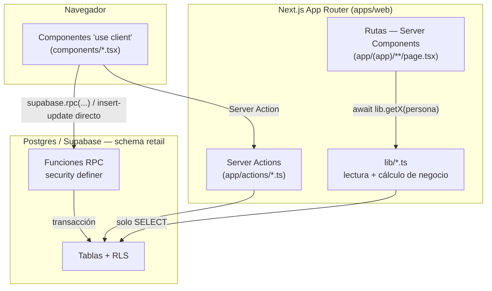

# Arquitectura de cayla-retail

> Mapa de referencia del sistema completo: negocio, stack, modelo de datos y
> el grafo de conexiones real entre rutas, componentes, `lib/` y la base de
> datos. Generado el 2026-09-04 leyendo el código fuente (no la visión de
> `CLAUDE.md`, que describe una arquitectura futura hipotética NestJS/Prisma —
> ver nota al final). Si el código cambia, este documento se desactualiza:
> no es la fuente de verdad, es un mapa para orientarse rápido.

---

## 1. Qué es CAYLA

CAYLA es retail de indumentaria y bisutería peruana con producción textil
propia: 3 tiendas (TRU-Trujillo, AQP-Arequipa, LIM-Lima) más un Taller en
Lima que corta, confecciona y termina prendas. Antes de este sistema, la
operación se llevaba en un Excel llamado "SINATRA" (ventas 2026 medidas ahí:
S/438k TRU, S/177k AQP, S/30k LIM). `cayla-retail` es el ERP que lo
reemplaza: inventario, ventas de tienda, producción del Taller y
contabilidad, todo sobre una misma base de datos.

CAYLA comparte dueño (Felipe) y algunas sedes con otro sistema, **cayla-
dynamic** (RR.HH. / personas), pero son dos repos y dos dominios de negocio
distintos que hoy conviven en el mismo proyecto de Supabase — ver §7.

---

## 2. Stack y decisión de arquitectura

| Capa | Tecnología |
|---|---|
| Monorepo | pnpm workspaces + Turborepo |
| Frontend/servidor | Next.js (App Router: Server Components + Server Actions) |
| Base de datos | Postgres vía Supabase, **Row Level Security** + funciones RPC `security definer` |
| Tipos/validación compartida | `packages/shared` (Zod, enums), `packages/database` (tipos generados del schema) |
| Idioma del esquema | Español, tablas en `snake_case`, sin `tenant_id` |

**Decisión ya tomada (2026-07-16, documentada en `CLAUDE.md`):** no se migra
a NestJS + Prisma + inglés + `tenant_id`, que era el diseño de referencia
original. Se construye sobre lo que ya existe y está verificado:
**Next.js + Supabase con RLS**, tablas en español, CAYLA como único tenant
(la sede reemplaza la dimensión de aislamiento que en un SaaS multi-tenant
resolvería `tenant_id`). Esa combinación NestJS/Prisma queda como visión de
referencia para el día que CAYLA venda el sistema a otra marca — no es una
tarea pendiente de hoy.

---

## 3. Cómo se conecta todo (el grafo real)

**Patrón consistente en todo el repo:**
- **Lectura** (armar una pantalla): la ruta (Server Component) llama a
  `lib/*.ts`, que hace `SELECT` puro contra Postgres. Ningún archivo de
  `lib/` escribe ni llama RPCs.
- **Escritura** (mutar dinero, stock o producción): el componente cliente
  llama **directo** `supabase.rpc('nombre_funcion', ...)`. Las mutaciones
  no pasan por `lib/`. La única excepción es `SedeSwitcher`, que usa la
  Server Action `cambiarSedeActiva` (cambia una cookie, no datos de negocio).
- Todos los imports de `lib/` usan el alias `@/lib` (0 imports relativos),
  y los tipos/enums compartidos vienen de `@cayla-retail/shared` y
  `@cayla-retail/database`.

### 3.1 Mapa por dominio (ruta → lib → componentes → RPC/tablas)

**Identidad y sede**
- `lib/persona.ts` (`requirePersonaActual`, cacheado) resuelve rol
  (`lider`/`integrante`) y sede activa desde `personas` + cookie
  `cayla_sede_activa`. Se usa en *todas* las rutas. El permiso real lo
  valida el servidor vía `fn_puede_operar_sede` — la cookie es solo UX.
- `(app)/layout.tsx` → `AppShell.tsx` (shell de navegación de todo el app) +
  `SedeSwitcher.tsx` → Server Action `cambiarSedeActiva`.

**Catálogo / inventario**
- `/inventario` → `lib/inteligencia.ts` (`getCatalogoInteligente`, reusa
  `lib/catalogo.ts:getCatalogoConStock`) → `InventarioAgrupado.tsx` →
  `MovimientoModal.tsx` → RPC `registrar_movimiento` (excluye venta a
  propósito, para no romper la trazabilidad caja↔movimiento).
- `/inventario/almacen` → `AlmacenStockList.tsx` → `BajarATiendaModal.tsx`
  → RPC `bajar_a_piso` (mueve de `stock_almacen` a `stock` de piso).
- `/inventario/recibir` → `lib/catalogo.ts` → `RecibirLoteForm.tsx` → RPC
  `recibir_lote` (la función más inestable del sistema, ver §6).
- `/inventario/compras` → `ComprasManager.tsx` (escribe directo en
  `ordenes_compra`, sin RPC).
- `/inventario/proveedores` → `ProveedoresManager.tsx` (directo en
  `proveedores`).
- `/inventario/etiquetas` → `lib/catalogo.ts` → `EtiquetasGenerator.tsx`
  (solo lectura, genera Code128 e imprime).
- `/buscar` → `lib/catalogo.ts` + `lib/sedes.ts` → `BuscadorHero.tsx`.
- `/producto/[varianteId]` → `lib/inteligencia.ts` → `FotoProducto.tsx`,
  `MinimosPorSede.tsx` (RPC `fijar_stock_minimo`), `RecetaCosto.tsx`
  (BOM: `insert`/`delete` directo en `bom_items`).
- `/almacen` y `/almacen/recibir` → **redirects puros** a
  `/inventario/almacen` y `/inventario/recibir` (compat de enlaces
  guardados tras el rediseño UX 2026-07-18; no es código duplicado).

**Ventas / caja**
- `/vender` → `lib/catalogo.ts` + `lib/finanzas.ts:getCajaAbierta` →
  `CajaPanel.tsx` → `AbrirCajaModal` (RPC `abrir_caja`),
  `RegistrarVentaModal` (RPC `registrar_venta`), `CerrarCajaModal` (RPC
  `cerrar_caja`, con conteo ciego: el monto esperado se calcula en el
  servidor).

**Producción (Taller)**
- `/produccion` → `OrdenesProduccion.tsx` → RPCs `registrar_produccion`,
  `set_etapa_produccion`, `cerrar_produccion`, `revertir_produccion_inventario`,
  `eliminar_produccion`. Modelo unificado en tabla `producciones` (el par
  viejo `ordenes_produccion`/`bom_items` de Fase 1 es legado sin RPC activo).

**Finanzas / contabilidad** (todas Líder-only)
- `/finanzas` → `lib/finanzas-nucleo.ts:getEERRMensual`.
- `/finanzas/balances` → `lib/contabilidad.ts:getEstadosContables` (los 4
  estados financieros, derivados por lectura — no hay tabla de asientos
  detrás de este cálculo, Activo=Pasivo+Patrimonio "por construcción").
- `/finanzas/efectivo` → `lib/finanzas-nucleo.ts:getCuadreEfectivo` →
  `EfectivoPanel.tsx` → RPC `registrar_deposito`.
- `/finanzas/registrar` → `RegistroContableForm.tsx`, que arma las líneas
  con las funciones **puras** de `lib/registro-contable.ts`
  (`opcionesPrincipal`, `construirLineas`, `sumaDebe/Haber` — garantizan
  Σdebe=Σhaber antes de enviar) y envía a RPC `registrar_asiento`, el
  único camino de escritura al libro diario.
- `/finanzas/activos`, `/finanzas/patrimonio`, `/finanzas/comparativo` →
  lectura + edición directa (`PatrimonioEditor`, `HistoricosEditor`).
- `RegistrarGastoModal.tsx` (accesible desde varias pantallas) → RPC
  `registrar_gasto`.
- `/vender/facturacion` → `lib/comprobantes.ts` → `ComprobantesPanel.tsx` →
  RPCs `emitir_comprobante` (reserva serie+correlativo, `for update`) y
  `registrar_serie_comprobante`. El envío real a SUNAT no está conectado
  todavía — ver ADR-0005. El modal de emisión usa `ConsultaDocumento.tsx`, el
  único componente que llama a una ruta de API propia en vez de a una RPC:
  `GET /api/padron?tipo=dni|ruc&numero=…` → `lib/padron.ts` → proveedor externo
  del padrón (RENIEC/SUNAT). Validación de formato y dígito verificador en
  `packages/shared/src/documento.ts` (pura, corre en los dos lados). ADR-0008.

### 3.x Rutas de API (`app/api/**/route.ts`)

Son la excepción al patrón "Server Component lee, RPC escribe": existen solo
cuando hace falta hablar con algo que no es Postgres, o devolver un archivo.

- `/api/export/inventario` → CSV del catálogo (`lib/catalogo.ts`).
- `/api/padron` → consulta de DNI/RUC contra el padrón externo. El token del
  proveedor nunca sale del servidor. Devuelve siempre 200 con `fuente`
  (`padron` | `historial` | `ninguna`) — "no pude averiguarlo" es una respuesta
  normal, no un error. Antes de gastar una consulta pagada busca el documento
  en `comprobantes` (memoria durable propia) y cachea en memoria por instancia.

Sin sesión, `middleware.ts` devuelve `401` JSON a `/api/*` en vez de redirigir
a `/login` — un `fetch()` seguiría el redirect y recibiría HTML.

---

## 4. Modelo de datos (schema `retail`)

### 4.1 Tablas por dominio

- **Catálogo**: `categorias` (familia fija + nombre editable),
  `productos` (SKU padre), `variantes` (SKU vendible: talla+color, `costo`,
  `precio`, `precio_taller`, `stock_minimo`).
- **Inventario**: `stock` (snapshot `variante_id+sede_id`, `cantidad >= 0`),
  `movimientos` (**append-only**, fuente de verdad — `stock` es un derivado
  que nunca se edita a mano), `contenedores` (ubicaciones fijas por sede),
  `lotes` (recepción/fardo), `stock_almacen` (bolsa de almacén interno,
  separada del piso de venta pero dentro de la misma sede).
- **Sedes/personas**: `sedes`, `personas` (`auth_user_id` único).
- **Ventas**: `cajas` (una sola caja abierta por sede — índice único
  parcial), `ventas` (1 fila por checkout).
- **Compras**: `proveedores`, `ordenes_compra` / `ordenes_compra_items`.
- **Producción**: `producciones` (`costo_unitario` es **columna generada**,
  no se puede desincronizar; `etapas` jsonb con 6 estados: patronaje →
  muestra → escalado → corte → confección → acabado; `inventariado_at`
  evita doble conteo), `produccion_lineas`.
- **Finanzas**: `gastos`, `depositos_bancarios`, `ajustes_efectivo`,
  `patrimonio_items`, `activos_fijos`, `ventas_historicas_mensuales`,
  `comprobantes` / `series_comprobantes` (facturación electrónica, parte 1 —
  ver ADR-0005; `estado` nace en `pendiente`, el envío a SUNAT es aparte).
- **Contabilidad**: `cuentas_contables` (35 cuentas semilla, PCGE/NIIF),
  `asientos` / `asiento_lineas` (libro diario, **inmutable para clientes**:
  sin política INSERT/UPDATE/DELETE, solo entra vía RPC).

### 4.2 Funciones RPC (`security definer`)

| Función | Qué resuelve |
|---|---|
| `registrar_movimiento` → `fn_aplicar_movimiento` | Motor de stock: entrada/salida/ajuste/traslado, con `for update` (lock de fila) contra condición de carrera; valida sede |
| `recibir_lote` | Recepción de mercadería: crea lote + producto/variante si faltan + N movimientos. Ver §6, es la función con historial de drift |
| `registrar_venta` | Venta + N movimientos de salida |
| `abrir_caja` / `cerrar_caja` | Apertura/cierre con conteo ciego |
| `registrar_gasto`, `registrar_deposito`, `fijar_stock_minimo`, `recalcular_stock` | Operación de caja y stock; `recalcular_stock` reconstruye `stock` completo desde `movimientos` como red de seguridad |
| `registrar_asiento` | Único camino de escritura al libro diario; valida cuadre antes de insertar |
| `emitir_comprobante` / `registrar_serie_comprobante` | Reserva boleta/factura con su correlativo oficial (`for update` por serie); factura sin RUC es imposible por constraint. No transmite a SUNAT — ver ADR-0005 |
| `registrar_produccion`, `set_etapa_produccion`, `cerrar_produccion`, `eliminar_produccion`, `revertir_produccion_inventario` | Ciclo de una corrida de producción; nunca se borra un hecho que ya movió stock, se revierte explícitamente |
| `bajar_a_piso` / `devolver_a_almacen` | Mueve entre `stock_almacen` y `stock` de la misma sede, atómico |

### 4.3 RLS sin `tenant_id`

Helpers `security definer` (`fn_es_lider`, `fn_sede_actual_persona`,
`fn_persona_actual`) leen `personas` por `auth.uid()` **sin** pasar por
RLS — necesario desde la migración `0023` para romper una recursión
infinita (policy de `personas` → llama `fn_es_lider()` → vuelve a
consultar `personas` → evalúa la policy de nuevo → *stack depth limit
exceeded*). La sede reemplaza la dimensión de aislamiento: Líder ve todo,
Integrante solo su sede (o su almacén asociado).

### 4.4 Estados imposibles por diseño (no por código)

- `stock.cantidad >= 0` — nunca stock negativo.
- Índice único parcial en `cajas` (`where estado='abierta'`) — una sede no
  puede tener dos cajas abiertas a la vez.
- `asiento_lineas`: `check(debe>0 xor haber>0)` + trigger *deferred* que
  exige Σdebe=Σhaber al confirmar — un asiento descuadrado es literalmente
  imposible en la base de datos, no solo validado en el formulario.
- `personas.auth_user_id` único — una cuenta de auth = una sola persona
  (ver ADR-0002).
- Índice único parcial en `contenedores` (`where tipo='almacen'`) — un solo
  almacén por sede.
- `produccion_lineas`: `unique(produccion_id, variante_id)` +
  `producciones.inventariado_at` — idempotencia contra doble conteo de
  stock si alguien hace doble clic en "cerrar producción".
- `comprobantes`: `check(tipo <> 'factura' or (cliente_tipo_doc = 'ruc' and
  cliente_num_doc is not null))` — una factura sin RUC no puede existir en la
  base, ni siquiera si alguien escribe directo saltándose la RPC. `unique(tipo,
  serie, numero)` — dos comprobantes del mismo tipo nunca comparten número.

---

## 5. Decisiones estructurales ya documentadas (ADRs)

- **ADR-0001** (jul-17) — los traslados no aparecían en el historial de la
  sede que *recibe* porque la policy RLS solo miraba `sede_id` (origen). Se
  agregó una policy nueva en vez de tocar la existente, para no arriesgar
  comportamiento ya verificado.
- **ADR-0002** (jul-17) — 5 filas duplicadas en `personas` para el mismo
  login rompían `.single()`. Se agregó `unique(auth_user_id)` para volver
  ese estado imposible.
- **ADR-0003** (sep-3) — 5 categorías nuevas agregadas *antes* de capturar
  el catálogo físico, basadas en historial real de compras — reclasificar
  después habría costado hacerlo prenda por prenda.
- **ADR-0004** (sep-3, el más relevante hoy) — `retail.recibir_lote` en
  producción divergió de la versión local durante la unificación con
  Dynamic (jul-2026): el script copió una versión vieja de la función.
  Ver §6.

---

## 6. Hallazgo de seguridad y deuda técnica activa

- **`recibir_lote` sin validar sede** (hallazgo real, ya corregido en
  `0031_recibir_lote_completo.sql` / `14_recibir_lote_produccion.sql`):
  la copia que quedó viva en producción no validaba sede, no guardaba
  `categoria_id`, y no aceptaba `p_orden_compra_id`. Cualquier persona
  autenticada podía recibir mercadería en una sede que no era la suya.
- **Dos versiones de `recibir_lote` convivieron en producción** un tiempo
  corto: `CREATE OR REPLACE` con una firma de parámetros distinta no
  reemplaza la función vieja en Postgres, crea una función nueva. Se
  detectó al regenerar tipos TypeScript (unión de dos firmas) y se corrigió
  con `DROP FUNCTION` explícito de la firma vieja.
- **`packages/database/src/types.ts` desactualizado**: no incluye
  `recibir_lote` ni `recalcular_stock` — señal de que los tipos generados
  no están sincronizados con el schema real de producción.
- **Reconciliación pendiente**: `ordenes_produccion`/`bom_items` (Fase 1,
  legado) vs `producciones`/`produccion_lineas` (modelo actual) — decisión
  aparte, deliberadamente fuera de alcance de ADR-0004.
- **`retail.puede_operar_sede`** sigue sin la cláusula `tienda_asociada_id`
  que sí tenía la versión local.
- Cobertura de tests: tres archivos (`lib/registro-contable.test.ts`,
  `lib/documento.test.ts`, `lib/padron.test.ts`, 43 pruebas). Sigue sin haber
  ninguna sobre stock/movimientos, que es el núcleo con más consecuencia.
- El stack local de Supabase de retail es **solo Postgres**: los demás
  servicios no levantan (choque de puertos con cayla-dynamic) y `retail` no
  está en `[api] schemas` de `config.toml`, mientras la app pide
  `db: { schema: "retail" }`. Consecuencia: la app nunca ha corrido de punta a
  punta contra local — lo local sirve para probar SQL, no pantallas.
- `middleware.ts` usa convención deprecada de Next.js 16.

---

## 7. Dónde vive esto en producción (crítico para tocar SQL)

Producción **no** vive en su propio proyecto Supabase: vive dentro del
proyecto de **cayla-dynamic**, en un schema llamado `retail` (28 tablas ahí
hoy). `NEXT_PUBLIC_SUPABASE_URL` de producción apunta al proyecto Dynamic,
no al proyecto original de retail. Toda migración pegada en el SQL Editor
de producción necesita el prefijo `retail.` en cada tabla (o
`set search_path to retail, public;` al inicio) — sin eso, el editor busca
en `public`, que en el proyecto Dynamic es el schema de *Dynamic*, no el de
retail. Las migraciones en `supabase/migrations/*.sql` se escriben **sin**
el prefijo (corren limpias contra Postgres local); el prefijo se agrega
solo al pegar en producción, nunca en el archivo del repo.

---

## 8. Estado del proyecto (2026-09-04)

**Construido y verificado en producción**: Vender (caja, conteo ciego),
Inventario (catálogo agrupado, recepción, almacén interno con ubicaciones,
etiquetas, compras, proveedores), Producción del Taller (6 etapas, costeo
por margen de contribución), Comercial (rotación, sugerencias de traslado),
Finanzas (4 estados financieros, motor de partida doble PCGE), identidad
visual CAYLA v3.

**En progreso**: captura del catálogo real (0 → ~900 SKUs físicos, recién
arrancado el 2026-09-03; era el bloqueador #1 y dependía de que el almacén
interno quedara cerrado, lo cual pasó el mismo día).

**Planeado, no empezado**: comprobante electrónico SUNAT (Nubefact),
inventario real de materia prima del Taller, fases avanzadas de
contabilidad (cuentas por pagar, IGV real, cumplimiento SUNAT — relevante
porque CAYLA proyecta ~72% del umbral de 300 UIT en 2026).

---

## 9. Vocabulario y convenciones del código

Español en tablas/dominio de negocio; inglés estándar en nombres de
variables/funciones. Nunca "empleado/jefe/sucursal": se usa
"colaborador/integrante", "líder de equipo/encargado de sede",
"sede/tienda/boutique", "clienta" (compradora final) — ya reflejado en
`personas.rol` (`lider`/`integrante`) y en la tabla `sedes`.

---

*Este documento es una fotografía del código al 2026-09-04. Para el estado
vivo día a día ver `docs/BACKLOG.md` y `docs/BITACORA.md`; para el porqué
de cada decisión estructural, `docs/adr/`.*
