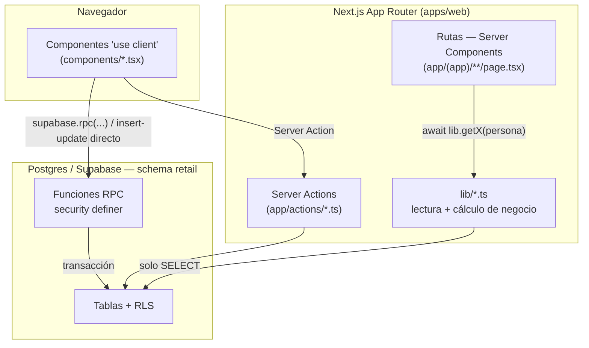

# Arquitectura de cayla-retail

> ⚠️ **Para el MODELO DE DATOS, este archivo ya no es la fuente.** Ve a
> **[`docs/datos/`](datos/README.md)**: ahí el diccionario se regenera desde la base real
> y no puede envejecer en silencio. Este documento sigue siendo el mapa del grafo
> rutas↔lib↔RPC del front, pero su foto del esquema quedó vieja — las afirmaciones que el
> SQL no respalda están listadas con archivo y línea en
> [`docs/datos/13-PROMESAS-INCUMPLIDAS.md`](datos/13-PROMESAS-INCUMPLIDAS.md).

> Mapa de referencia del sistema completo: negocio, stack, modelo de datos y
> el grafo de conexiones real entre rutas, componentes, `lib/` y la base de
> datos. Generado el 2026-09-04 leyendo el código fuente (no la visión de
> `CLAUDE.md`, que describe una arquitectura futura hipotética NestJS/Prisma —
> ver nota al final). Si el código cambia, este documento se desactualiza:
> no es la fuente de verdad, es un mapa para orientarse rápido.

---

## 1. Qué es CAYLA

CAYLA es retail de indumentaria y bisutería peruana con producción textil
propia: 3 tiendas (TRU-Trujillo, AQP-Arequipa, LIM-Lima) más un Taller en
Lima que corta, confecciona y termina prendas. Antes de este sistema, la
operación se llevaba en un Excel llamado "SINATRA" (ventas 2026 medidas ahí:
S/438k TRU, S/177k AQP, S/30k LIM). `cayla-retail` es el ERP que lo
reemplaza: inventario, ventas de tienda, producción del Taller y
contabilidad, todo sobre una misma base de datos.

CAYLA comparte dueño (Felipe) y algunas sedes con otro sistema, **cayla-
dynamic** (RR.HH. / personas), pero son dos repos y dos dominios de negocio
distintos que hoy conviven en el mismo proyecto de Supabase — ver §7.

---

## 2. Stack y decisión de arquitectura

| Capa | Tecnología |
|---|---|
| Monorepo | pnpm workspaces + Turborepo |
| Frontend/servidor | Next.js (App Router: Server Components + Server Actions) |
| Base de datos | Postgres vía Supabase, **Row Level Security** + funciones RPC `security definer` |
| Tipos/validación compartida | `packages/shared` (Zod, enums), `packages/database` (tipos generados del schema) |
| Idioma del esquema | Español, tablas en `snake_case`, sin `tenant_id` |

**Decisión ya tomada (2026-07-16, documentada en `CLAUDE.md`):** no se migra
a NestJS + Prisma + inglés + `tenant_id`, que era el diseño de referencia
original. Se construye sobre lo que ya existe y está verificado:
**Next.js + Supabase con RLS**, tablas en español, CAYLA como único tenant
(la sede reemplaza la dimensión de aislamiento que en un SaaS multi-tenant
resolvería `tenant_id`). Esa combinación NestJS/Prisma queda como visión de
referencia para el día que CAYLA venda el sistema a otra marca — no es una
tarea pendiente de hoy.

**Cómo se escriben las políticas (ADR-0176, 2026-09-22):** las funciones de permisos
(`fn_es_lider()`, `fn_puede_editar_catalogo()`, …) van envueltas en `(select …)` y
`fn_puede_operar_ubicacion(col)` se abre en `(select fn_es_lider()) or col = (select
fn_ubicacion_actual_persona())`. Así Postgres las evalúa una vez por consulta y no una vez
por fila: con 24 mil movimientos, eso es la diferencia entre 57 s y 14 ms. Toda migración
que cree políticas termina con `select retail.fn_rls_una_vez_por_consulta();`.

---

## 3. Cómo se conecta todo (el grafo real)

```mermaid
flowchart TB
    subgraph Cliente["Navegador"]
        UI["Componentes 'use client'\n(components/*.tsx)"]
    end

    subgraph Next["Next.js App Router (apps/web)"]
        Rutas["Rutas — Server Components\n(app/(app)/**/page.tsx)"]
        Actions["Server Actions\n(app/actions/*.ts)"]
        Lib["lib/*.ts\nlectura + cálculo de negocio"]
    end

    subgraph DB["Postgres / Supabase — schema retail"]
        RPC["Funciones RPC\nsecurity definer"]
        Tablas["Tablas + RLS"]
    end

    UI -- "supabase.rpc(...) / insert-update directo" --> RPC
    UI -- "Server Action" --> Actions
    Rutas -- "await lib.getX(persona)" --> Lib
    Lib -- "solo SELECT" --> Tablas
    RPC -- "transacción" --> Tablas
    Actions --> Tablas
```

**Patrón consistente en todo el repo:**
- **Lectura** (armar una pantalla): la ruta (Server Component) llama a
  `lib/*.ts`, que hace `SELECT` puro contra Postgres. Ningún archivo de
  `lib/` escribe ni llama RPCs.
- **Escritura** (mutar dinero, stock o producción): el componente cliente
  llama **directo** `supabase.rpc('nombre_funcion', ...)`. Las mutaciones
  no pasan por `lib/`. La única excepción es `SedeSwitcher`, que usa la
  Server Action `cambiarSedeActiva` (cambia una cookie, no datos de negocio).
- Todos los imports de `lib/` usan el alias `@/lib` (0 imports relativos),
  y los tipos/enums compartidos vienen de `@cayla-retail/shared` y
  `@cayla-retail/database`.

### 3.1 Mapa por dominio (ruta → lib → componentes → RPC/tablas)

**Inicio (`/`)**
- `app/(app)/page.tsx`: aterriza según el rol (`aterrizajeDe`) y, si se queda, arma «Hoy», «Te toca», accesos y «Equipo de hoy»
  (`lib/inicio.ts`, `lib/inicio-reglas.ts`, `lib/inicio-avisos.ts`; ADR-0225). **Una cuenta de almacén** (`esPerfilAlmacen`: no vende, ve Productos,
  puede crear productos y recibe) usa su propio cuerpo: `components/inicio-almacen/InicioAlmacen.tsx` (cabina «Nuevo producto», «Te toca», «Nuevo en el
  catálogo», pulso, en camino, por colgar y accesos; botón fijo de celular `DockAlmacen`). Lecturas: `lib/inicio-almacen.ts`
  (`getInicioAlmacen`: productos nuevos, fotos, por completar, por recibir, el piso de la sede —el bloque «Por colgar» y el aviso
  «Baja al piso N tallas por colgar» (o «Cuadrar el piso» con las tallas que esperan): UNA lectura del motor del piso
  (`fn_piso_plan_lectura` → `lib/piso-plan.ts`) pasada como filas (`filasDelPiso`) por `porColgarDeLaSede`, la MISMA cuenta de
  «Para hoy» y del filtro «Hoy» de Existencias (ADR-0331 act. b; lo vigila `lib/inicio-almacen-reglas.test.ts`)—, movimientos de
  hoy, en camino), cada una tolerante.
  Reglas puras con pruebas: `lib/inicio-almacen-reglas.ts`. La sigla de la sede donde se registró cada producto sale de `fn_producto_origen` (tabla `producto_origen` + disparador en `productos`, migración `20260930170000`; `components/inicio-almacen/ChipSede.tsx`). Estilos: `app/estilos/inicio-almacen.css` (clases `ia-*`, bloque «AMBIENTE» aislado). Ocupa todo el ancho del `<main>`: el marcador `data-ancho-completo` de `InicioAlmacen` le quita el tope de 64 rem que `AppShell` pone por defecto (`has-[[data-ancho-completo]]:max-w-none`; `lib/ancho-completo.test.ts`). ADR-0292.
  **Aviso del líder «Pérdidas que se repiten»** (ADR-0328 act. 14): `getFuentesAvisos` → `lib/perdidas.ts:getAvisoPerdidas` (los últimos 30 días
  de `fn_perdidas_resumen` por la regla `perdidasQueSeRepiten`) → clave `perdidas` de `avisosInicio`, que lleva a
  `/inventario/movimientos?vista=perdidas` filtrada si es un solo hallazgo.
- **Una cuenta Admin** (`persona.esAdmin`) tiene el **Observatorio** (ADR-0322): `components/observatorio/Observatorio.tsx` (raíz: estado, lectura cada
  30 s, teclado, «Repetir el día»), `Mapa.tsx` (zoom y transformación del contorno, cuadro a cuadro sobre el DOM), `PanelGlobal.tsx`, `PanelTienda.tsx`
  (Ritmo, Productos, Equipo, Stock), `Abajo.tsx` (Taller y «Por revisar»), `piezas.tsx` (odómetro, cifras, anillos, trazos, control segmentado) e
  `iconos.tsx`. Lecturas: `lib/observatorio.ts` (`getDatosObservatorio` → RPC `fn_observatorio`; `getAvisosObservatorio`, sobre las lecturas de caja,
  por regularizar, traslados, apartados, por pagar, fotos, SUNAT, devoluciones y «Pérdidas que se repiten» (ADR-0328 act. 14: `fn_perdidas_resumen`
  de los últimos 30 días de cada tienda por `perdidasQueSeRepiten`, armado en `avisoPerdidasObs`); `getTallerObservatorio`; `getDatosTienda` → RPC
  `fn_observatorio_tienda` + ritmo de Existencias + traslados). Cuentas puras: `lib/observatorio-reglas.ts`; geometría del mapa:
  `lib/observatorio-mapa.ts` y sus contornos generados `lib/observatorio-mapa-datos.ts` (INEI, MPL-2.0; `scripts/observatorio/contornos.py`).
  Estilos: `app/estilos/observatorio.css` (clases `o-*` bajo `.obs`, modo oscuro listo bajo `[data-tema="oscuro"]`). Es el único Inicio que se abre en
  CAYLA Global; si `fn_observatorio` falla, el Admin ve el Inicio de siempre. Todo el ancho, como el de almacén.

**Identidad y sede**
- `lib/persona.ts` (`requirePersonaActual`, cacheado) resuelve rol
  (`lider`/`integrante`) y sede activa desde `personas` + cookie
  `cayla_sede_activa`. Se usa en *todas* las rutas. El permiso real lo
  valida el servidor vía `fn_puede_operar_sede` — la cookie es solo UX.
- `(app)/layout.tsx` → `AppShell.tsx` (shell de navegación de todo el app) +
  `SedeSwitcher.tsx` → Server Action `cambiarSedeActiva`. Monta además `SedeActiva.tsx` (la sede activa como contexto
  de cliente, de donde sale `x-ubicacion`).
- **Modo oscuro (ADR-0336, 2026-10-05; sin base de datos).** Preferencia del aparato: `app/layout.tsx` pone en el `<head>` el script
  `SCRIPT_TEMA_ANTES_DE_PINTAR` (de `lib/tema-reglas.ts`) que lee `localStorage["cayla-tema"]` y fija `data-tema` en `<html>` antes de
  pintar; `components/ui/BotonTema.tsx` (en `AppShell`, entre «Actividad» y `SedeSwitcher`) lo alterna con una transición de vista
  (`lib/tema-cliente.ts`). Los tokens oscuros viven en `app/estilos/tema.css` (mismos nombres que `globals.css`, `tinta` y `crema`
  intercambiados, dentro de `@media screen`: imprimir sale en claro), junto con `.papel-fijo` (papel físico: tokens claros) y el
  piso de legibilidad del texto tenue. Candado de CI: `lib/tema-tokens.test.ts` (tokens sincronizados, contraste, toda
  `var(--color-…)` existe) y `lib/tema-colores.test.ts` + `lib/tema-colores-archivos.ts` (ningún color suelto en la interfaz; deuda 0).
  Herramienta de auditoría: `apps/web/tema/` (`pnpm --filter web tema:auditar`; cuentas de prueba con `pnpm --filter web tema:cuentas`;
  escenarios en `tema/escenarios/registro.mjs`). Páginas fuera del `(app)` que dibujan sin `globals.css` (`app/global-error.tsx`,
  `public/sin-conexion.html`) llevan su propia paleta y leen la misma preferencia. Las tres páginas públicas del club se quedan en claro.
- **Quién firma vs. quién tiene permiso (ADR-0161/0162, rama `claude/responsable-y-roles-spike`, sin pegar en
  producción).** Son dos preguntas distintas y viven en funciones distintas:
  - **Quién FIRMA** (`usuario_id`, `creado_por`, `*_por`): `retail.fn_actor_persona_id(p_de_tienda)`. Con sesión de
    **terminal** devuelve la persona del encabezado `x-responsable`, siempre, y exige que esté activa, con acceso a retail
    y **presente ahora** en la tienda de la terminal (`fn_persona_presente`); si no, lanza 42501 con `hint`
    `responsable_requerido` | `responsable_sin_acceso` | `responsable_no_presente`. Con sesión de **persona** devuelve a la
    persona misma, salvo en una operación de tienda (`p_de_tienda = true`) donde llegue `x-responsable` (o donde
    `fn_exige_responsable()` esté encendido): entonces exige también `x-ubicacion` (`ubicacion_requerida`) y la misma
    presencia. `x-momento` (hora de la venta sin conexión, acotada a 7 días atrás y 5 min adelante) reemplaza a `now()`
    al validar la presencia. La F3 cambió en 65 funciones la búsqueda `select id into v_persona from personas where
    auth_user_id = auth.uid()` por esta llamada: 36 de tienda (`true`) y 29 que no (`false`: Compras, Producción,
    Colaboradores — firman siempre a nombre de quien inició sesión).
  - **Quién tiene PERMISO**: sigue siendo la **cuenta** (`auth.uid()`): `fn_es_lider`, las cinco `fn_puede_*`,
    `fn_tiene_acceso_retail`. Una terminal nunca es líder aunque la responsable elegida lo sea; si no, elegir a una líder
    en el combo (sin PIN) daría sus poderes a cualquiera. Excepciones decididas por Felipe: una terminal **descuenta sin
    tope** (`registrar_venta`: tope NULL) y **libera cualquier apartado** (`liberar_apartado` y `puede_liberar` de
    `listar_apartados`).
  - **`fn_exige_responsable()`**: interruptor, hoy `select false`. Mientras esté apagado, una persona que no manda
    `x-responsable` sigue firmando a su nombre; las terminales lo exigen siempre. Se enciende con un `create or replace`
    cuando la web publicada ya mande el encabezado en todas las pantallas de tienda.
  - **La web:** `lib/responsable-reglas.ts` (puro, con test: lista del combo desde `fn_asesoras_de_turno`, estado del
    combo, `firmar(consulta, firma)` que agrega los encabezados con `.setHeader`, `firmaDeEncabezados` para las rutas
    `/api/*`, traducción de los `hint`), `lib/useDeTurno.ts` (lee la asistencia), `lib/useResponsable.ts` (el estado:
    vacío siempre, vuelve a vacío al guardar) y `components/ComboResponsable.tsx` (el combo; botón apagado hasta
    elegir, bloqueo si no hay nadie presente). Pantallas conectadas: Punto de venta y ventas sin conexión, Caja,
    Cambios, Devoluciones, Facturación, Inventario (ajuste, apartados, piso, dañadas, conteo, traslados) y Catálogo. La
    lista completa y lo que queda fuera a propósito: ADR-0161, sección «F4b».
- `/colaboradores` (solo líder; ADR-0145, ADR-0148 y ADR-0157) → `lib/colaboradores.ts` (lecturas: `fn_colaboradores`,
  `fn_colaboradores_pendientes`, `fn_colaboradores_suspendidos`, `fn_colaboradores_inactivos`, `fn_colaboradores_actividad`,
  `fn_dynamic_disponibles`, y `fn_asesoras_de_turno` por sede para el punto «de turno hoy») → `ColaboradoresPanel.tsx` (dos secciones —Equipo y Roles y
  accesos—, y «Actividad del equipo» en `colaboradores/ActividadEquipo.tsx`, que lee `fn_actividad` de los módulos colaboradores y roles; ADR-0172, ADR-0340 y ADR-0343) → `colaboradores/EquipoLista.tsx` (la lista por sede, con «Esperan tu ok») +
  `colaboradores/FichaColaborador.tsx` y `colaboradores/FichaTerminal.tsx` (las fichas al costado, sobre `colaboradores/CajonFicha.tsx`; ADR-0342) sobre las reglas
  puras de `lib/equipo-reglas.ts`; `colaboradores/DarAccesoModal.tsx` (dar acceso: quién, sede y rol, con su guía; reglas en `lib/dar-acceso-reglas.ts`; ADR-0341) +
  `ColaboradoresTablas.tsx` (aparatos y actividad) + `ColaboradoresModales.tsx` (desactivar aparato). Escribe por `lib/colaboradores-acciones.ts` → RPC
  `agregar_colaboradores` (con `p_rol_id` desde ADR-0341: lo que da un líder entra activo), `fn_aprobar_alta_colaborador`, `suspender_colaborador`, `reactivar_colaborador`,
  `cambiar_ubicacion_colaborador`, `quitar_colaborador`. Reglas puras en `colaboradores-reglas.ts`.
  **Roles y accesos** (`RolesPanel.tsx`: tarjetas de roles y baldosas por módulo con `colaboradores/IconoModulo.tsx`, ADR-0342; `lib/roles.ts`, `lib/roles-reglas.ts`): lee `roles` y `rol_modulos` por RLS y,
  para el Líder de equipo, `fn_lider_modulos_ocultos()` (ADR-0253: el Líder ve todo menos lo que un Admin le quitó);
  escribe por `lib/roles-acciones.ts` → `crear_rol`, `guardar_modulos_rol` (también los del Líder), `renombrar_rol`,
  `archivar_rol`, `restaurar_rol`, `asignar_rol`.
  **Suspender mueve la fila** de `colaboradores` a `colaboradores_suspendidos`; el historial vive en
  `colaboradores_historial` (solo se agrega). `/vender/historial` también lee estas listas para el filtro «vendedor».
  **Terminales sin persona (ADR-0162, reemplaza la terminal-persona de ADR-0152/0160):** un aparato por fila en
  `retail.terminales` (tienda, tipo `ventas` | `administrativa`, cuenta de Auth propia, una activa de cada tipo por tienda).
  Cuentas ▸ Terminales lee `fn_terminales()` (`getTerminales` en `lib/colaboradores.ts`, tolerado) y hace
  `desactivar_terminal` / `reactivar_terminal` (`colaboradores/FichaTerminal.tsx`, `AlternarTerminalModal`). **Crear y cambiar la clave no
  es una RPC:** exige la llave de servicio y lo hace `pnpm terminales:crear` (`scripts/terminales/`). `colaboradores.terminal`
  quedó retirada (siempre null) y `agregar_terminal` lanza 0A000. Los poderes siguen siendo las cinco capacidades
  (`fn_puede_gestionar_caja`, `fn_puede_ajustar_inventario`, `fn_puede_editar_catalogo`, `fn_puede_editar_cuentas_proveedor` y, del
  líder o de un rol con Etiquetas —ADR-0293, antes solo líder—, `fn_puede_dar_descuento_por_etiqueta`); `fn_es_terminal` / `fn_mi_terminal` ahora leen `retail.terminales`. La web
  pregunta por permiso (`puede`/`exigirPermiso` en `lib/persona-actual.ts`, `permisosDe(rol, terminal)` y `terminales` por nodo
  en `lib/menu.ts`); `persona.terminal` distinto de null = la sesión es un APARATO (pie del lateral con el aparato, sin «Mi perfil»).
  La sesión de una terminal entra por el mismo `requirePersonaActualV2` (su fila viene de `fn_persona_actual_resumen`,
  que ahora tiene rama de terminal); una terminal desactivada ve su propio aviso en `/login`. `desactivar_terminal` corta
  la sesión en el acto (`fn_terminal_actual` deja de devolverla). Alta y clave: `pnpm terminales:crear` (lo corre Felipe con
  la llave de servicio; muestra la clave una sola vez; partes puras probadas con `pnpm terminales:probar`).
  **D-70 (ADR-0157): el alta de un colaborador (persona) no queda operativa sola.** `colaboradores.estado`
  (`pendiente_aprobacion`/`activo`) gatea `fn_es_lider`, `fn_ubicacion_actual_persona`, `fn_tiene_acceso_retail`, `fn_mi_perfil`,
  `fn_persona_actual_resumen` (el gate de login) y `fn_stock_por_sede` — las seis funciones que leen
  `colaboradores`, no solo las tres obvias. (`fn_stock_por_sede` tenía su propia puerta y dejaba a las terminales con cero
  filas; desde `20261004110000` pasa por `fn_tiene_acceso_retail`, que sí conoce la terminal: ADR-0289, segunda tanda.) `fn_aprobar_alta_colaborador` (solo líder) es el segundo paso.
  **Fotos de perfil (20260925210000): son de Dynamic y retail no las copia.** `public.personas.foto_url` guarda la RUTA en
  el bucket público `fotos-perfil` (`perfil/<persona>/<archivo>.jpg`), nunca una URL; `lib/foto-perfil.ts` (`urlFotoPerfil`,
  pura) arma la URL. `retail.fn_fotos_personas(uuid[])` devuelve la ruta de cada colaborador pedido (solo colaboradores de
  retail; sin foto = sin fila) y `lib/useFotoPersona.ts` la pide por lotes y la recuerda por sesión. Toda cara de persona se
  pinta con `components/ui/AvatarPersona.tsx` (foto o iniciales, nunca imagen rota): pie del lateral, «Mi perfil», combo
  «Responsable» y las tablas de Colaboradores. «Mi perfil» sube la foto a `fotos-perfil` y guarda la RUTA con
  `actualizar_mi_foto_perfil` → `public.fn_actualizar_foto_perfil` (rechaza lo que no empiece por `perfil/`).

**Catálogo / inventario**
- `/inventario` (Existencias; rediseño 2026-10-04, ADR-0331) → `app/(app)/inventario/page.tsx` lee `lib/inventario-v2.ts`
  (`getExistencias`, RPC `fn_stock_por_sede_json`), `lib/por-regularizar-cuenta.ts` (`contarPorRegularizar`, tabla
  `prendas_por_regularizar`; su fila de «Para hoy» lleva a `/inventario/por-regularizar?ubicacion=`), `lib/capacidad-piso-servidor.ts`
  (`getCapacidadPiso`, RPC `fn_capacidad_piso`, tabla `capacidad_piso`, ADR-0329: la nota «de 600» de «Colgadas en el piso», con
  «por cuadrar» mientras la sede no tenga cuadre —`cuadrado_en`, leído de `cuadres_piso` si existe—; esa tarjeta cuenta solo la ropa
  del riel, por `categorias.familia`, y dice aparte «+ N accesorios» (`cifraColgadasEnElPiso`), reglas en
  `lib/capacidad-piso.ts`; la escritura `fijar_capacidad_piso` todavía no tiene pantalla: será el Plan del piso, actividad 12 de
  ADR-0328) y la cabecera con `ui/ResumenSede` → `InventarioPanel.tsx` →
  `existencias/ParaHoy.tsx` (`lib/existencias-para-hoy.ts`), `FiltrosExistencias.tsx` (con los atajos
  `existencias/FiltrosRapidos.tsx`, `lib/existencias-rapidos.ts`; en «Filtros ▸ Vista», «Ver como» —tarjetas, tabla o por talla—, el orden y
  el interruptor `BotonSonidoConfirmar.tsx`, `lib/sonido-confirmar.ts`; «Colgar primero» se quitó el 2026-10-06, ADR-0344),
  `ExistenciasTarjetas.tsx` (un icono por tarjeta y su ventana de acciones: `existencias/AccionesTarjeta.tsx`, `lib/existencias-acciones.ts`; el riel de
  tallas; qué junta cada tarjeta —el modelo, o la prenda con «Hoy»— y su conteo: `lib/existencias-tarjetas.ts`), el anillo «N de M hoy»
  (`existencias/AnilloMision.tsx`, `lib/existencias-mision.ts`), la pistola sin buscador (`lib/existencias-pistola.ts`), la tabla «Ver detalle» y el
  panel de la talla `existencias/PanelTalla.tsx` (ADR-0344 cuarta vuelta; reemplaza al cajón de la prenda; las tallas de arriba dicen lo que
  falta, «otra sede» y el filtro, y el ritmo lleva `existencias/AroSemanas.tsx`, quinta vuelta) con sus pasos `existencias/FlujoTalla.tsx`
  (`lib/existencias-panel-talla.ts`, `lib/existencias-flujos.ts`) → RPC `bajar_al_piso` (Colgar y Colgar varias), `retirar_del_piso` y
  `subir_para_enviar` (Subir), `pedir_a_otra_sede` y `pedir_prenda_para_apartar` (Pedir), `ajustar_inventario` (Ajustar; la ventana completa
  `AjustarInventarioModal.tsx` queda para enlazar con un conteo) y `reportar_danada` («Reportar dañada», en la Ficha del panel y desde Ajustar «Se dañó»:
  el paso «Reportar dañada» de `FlujoTalla`, con la validación de `lib/danadas-reglas.ts`; ADR-0328 act. 10; la ventana `ReportarDanadaModal.tsx` ya no existe). La lista de Dañadas
  (`ResolverDanadosModal.tsx`, «Para hoy» ▸ Decidir) lee `prendas_danadas` (`getPrendasDanadasPendientes`) y resuelve con
  `arreglar_prenda_danada` («Se arregló»: vuelve al almacén), `liquidar_prenda_danada` y `resolver_prenda_danada`. La regla de cada talla: `lib/existencias-hoy.ts` (`hoyDeTalla`) sobre
  `lib/existencias-recomendaciones.ts` y `lib/politica-operativa-inventario.ts`. (Hasta el 2026-09-12 esta línea describía V1:
  `lib/inteligencia.ts` e `InventarioAgrupado.tsx` ya no existen.)
- `/inventario/almacen` → `AlmacenStockList.tsx` → `BajarATiendaModal.tsx`
  → RPC `bajar_a_piso` (mueve de `stock_almacen` a `stock` de piso). (V1; hoy: esa ruta y `bajar_a_piso` no
  existen; se baja con `mover_interno` desde «Reponer» de Existencias o con `bajar_al_piso` desde
  `/inventario/bajar`, ver «Inventario V2».)
- `/inventario/recibir` → `lib/catalogo.ts` → `RecibirLoteForm.tsx` → RPC
  `recibir_lote` (la función más inestable del sistema, ver §6).
- `/inventario/compras` → `ComprasManager.tsx` (escribe directo en
  `ordenes_compra`, sin RPC).
- `/inventario/proveedores` → `ProveedoresManager.tsx` (directo en
  `proveedores`).
- `/inventario/etiquetas` → `lib/catalogo.ts` → `EtiquetasGenerator.tsx`
  (solo lectura, genera Code128 e imprime).
- `/buscar` → `lib/catalogo.ts` + `lib/sedes.ts` → `BuscadorHero.tsx`.
- `/producto/[varianteId]` → `lib/inteligencia.ts` → `FotoProducto.tsx`,
  `MinimosPorSede.tsx` (RPC `fijar_stock_minimo`), `RecetaCosto.tsx`
  (BOM: `insert`/`delete` directo en `bom_items`).
- `/almacen` y `/almacen/recibir` → **redirects puros**, declarados en
  `redirects()` de `next.config.ts` (movidos desde página-stub el 2026-09-17,
  ver ✨ MEJORAR de BACKLOG) a `/inventario` y `/recibir` (desde ADR-0330, 2026-10-04; antes `/inventario/recibir`, que
  hoy también es un redirect a `/recibir`)
  (compat de enlaces guardados tras el rediseño UX 2026-07-18; resuelven en
  el edge, sin sesión ni consulta a Supabase — no es código en `app/`).
  `/almacen` ya NO apunta a `/inventario/almacen` — esa ruta murió el
  2026-09-16 (ADR-0071 unificó piso+almacén dentro de `/inventario`) y el
  stub viejo quedó redirigiendo a un 404 sin que nadie lo notara; corregido
  de paso al mover esto a la config (ver nota en `next.config.ts`).
- `/inventario/movimientos` (V2, 2026-09-15, ADR-0050; mudada desde `/movimientos`
  el 2026-09-16, ADR-0071 — la ruta vieja es un `permanentRedirect` que conserva
  los filtros; simplificada el 2026-09-19, ADR-0127) → `lib/movimientos-v2.ts`
  (`listarMovimientos`, `getResumenMovimientos`) → RPC `fn_movimientos` /
  `fn_movimientos_resumen` (lectura pura, cursor, filtros en Postgres; la búsqueda
  por prenda **y por proceso** —«Traslado 24», «B001-000184»— la resuelve
  `fn_movimientos_busqueda`, una sola vez para la lista y las tarjetas; la parte de prenda es
  el Filtro de búsqueda especial escrito en SQL, `fn_movimientos_variantes`, migración `20260921153700`:
  ver su fila en la tabla de RPC y el ADR-0071) →
  `FiltrosMovimientos.tsx` (rediseño 2026-09-22: fila 1 buscador + Período; fila 2 Tipo con
  su cifra y Sububicación segmentada; debajo, los procesos del tipo elegido —
  `PROCESOS_POR_CATEGORIA`—; todo en la URL; la sede la decide solo el selector de la
  cabecera) + `MovimientosLista.tsx` (lista de la guía oficial agrupada por día: punto ·
  prenda con talla, color, hora y dónde · proceso con origen → destino · referencia ·
  cantidad; en celular, dos líneas; la referencia —`Traslado N`, `Conteo N`, `Boleta …`, `Factura …`—
  enlaza a `/inventario/traslados/[id]` y `/inventario/conteo/[id]`, y Traslados
  cuenta el proceso completo) + `MovimientoDetalle.tsx` (modal por proceso, sin
  segunda consulta; ahí sigue la persona). Sin filtro por persona ni columna
  «Responsable»: la autoría sigue en `movimientos.usuario_id`. Las reglas de pantalla
  (categoría, signo, nombre del proceso, referencia por proceso, período) viven en
  `lib/movimientos-reglas.ts`, sin servidor. Sin escritura: el ledger es inmutable.
  **2026-09-26 (ADR-0234):** las cifras salen de `getResumenTienda` → RPC `fn_movimientos_resumen_procesos` (por grupo de
  filtro y proceso: operaciones, entran, salen, movidas; `fn_movimientos_resumen` queda para la web vieja); la lista agrupa
  por operación (`agruparPorOperacion`, clave = hora de la transacción + persona + proceso + documento) con
  `FilaMovimiento.tsx` / `FilaOperacion`; cuántas quedaron después de cada movimiento con `getSaldosDeMovimientos` → RPC
  `fn_movimientos_saldos` (texto en `lib/movimientos-saldo.ts`); foto, producto y stock de hoy de cada prenda con `getPrendasDeMovimientos`
  (`variantes` + `producto_fotos` + `stock`, las reglas de Existencias); la boleta abre `DetalleVentaModal`; exportar es la
  ruta `inventario/movimientos/exportar/route.ts` (CSV, como la de Historial); Traslado y Conteo aceptan `?volver=`
  (`volverAMovimientos`).
  **2026-09-26 (ADR-0241, conectado):** atajos del detalle y de la operación en `lib/movimientos-atajos.ts`
  (`atajosDeMovimiento`, `atajosDeOperacion`) → `/cambios?q=`, `/devoluciones?q=`, `/inventario/bajar?lineas=`,
  `/etiquetas-de-precio?variantes=`, `/inventario/conteo?variantes=` (nuevo: `pendientesDeLista`),
  `/inventario?variante=` (nuevo: abre el detalle de la prenda) y `/vender/apartados?abrir=` (nuevo: Entregar o Todos con
  ese apartado); «Corregir» abre `AjustarInventarioModal`. El apartado de cada movimiento con `getApartadosDeMovimientos`
  (`apartados.movimiento_id`/`movimiento_cierre_id` → `separaciones`). Bajadas del día plegadas (`plegarBajadas`,
  `FilaBajadas`); «Hoy» por defecto en el celular (`userAgent` en la página); filtros en hoja y cámara en el celular;
  Exportar en el «⋯» (`MenuMovimientos.tsx`).
  **2026-10-03 (ADR-0327, cifras que dicen la verdad):** la tarjeta Ajustes va en bruto («−35 faltaron · +87 aparecieron») y por respaldo
  («a mano» / «en un conteo», `desgloseAjustes`, `respaldoDeAjuste`); la fila de un ajuste sin conteo dice «Sin documento» con su nota
  (`referenciaSinDocumento`); «30 vendidas (2 se anularon)» (`ventasAnuladas`); la banda del día no lleva cifra; toda frase de «Entró» y
  «Salió» la exige una prueba (`FRASE_PROCESO`). Sin migración.
  **2026-10-05 (ADR-0353, los tipos que se ven):** cada fila se dibuja con su **tipo** (`lib/movimientos-tipos.ts`: `tipoVisual`, `TIPOS_VISUALES`,
  `GRUPOS_TIPO`, `rotuloDeMovimiento`, `kindDeLugar`) con su sello (`components/movimientos/SelloTipo.tsx`) y su trayecto (`TrayectoMovimiento.tsx`); estilos en
  `app/estilos/movimientos-sellos.css` (`mv-*`). **Los siete botones de tipo en una columna a la derecha** (`TiposMovimiento.tsx`) son el filtro Y la cifra: reemplazan
  las píldoras de tipo de `FiltrosMovimientos` y las tres tarjetas de arriba. La base acepta `p_categoria` `venta | colgada | guardada | llegada | traslado | cliente`
  en `fn_movimientos` y suma esos grupos en `fn_movimientos_resumen_procesos` (migración `20261005160000`, solo lectura; prueba
  `pnpm pruebas:movimientos-colgada-y-guardada`). El día lleva su franja de operaciones (`EncabezadoDia.tsx`, sin cifra) y las colgadas y las guardadas del día van en
  mazos separados (`plegarBajadas`, `FilaBajadas`); el cajón trae sello, ruta y «Qué pasó» (`pasosDeOperacion`). «Colgada en piso» y «Guardada en almacén» reemplazan
  «Bajada al piso» y «Retiro del piso» solo dentro de Movimientos.
  **2026-10-04 (ADR-0328 act. 14, pestaña «Pérdidas»):** `?vista=perdidas` (`PaginaPerdidas` en `page.tsx`, pestañas `Pestanas`) →
  `lib/perdidas.ts` (`getResumenPerdidas`) → RPC `fn_perdidas_resumen(sede, desde, hasta, prenda?, zona?)` (jsonb: perdido, aparecido,
  por razón, categoría y talla, «más faltan», hechos; costo por prenda solo del líder) → `components/perdidas/PerdidasVista.tsx`. La
  definición única vive en la base: `fn_perdida_razon` / `fn_perdida_lado` / `fn_es_perdida` (movimientos),
  `fn_perdidas_de_traslados` (enviado − recibido de un traslado cerrado) y `fn_perdidas_hechos` (los tres orígenes, con la venta
  anulada no vendible); Finanzas la lee por `fn_es_merma` (alias) y `fn_asientos` (regla `merma_traslado`), el Balance retiró la
  causa `faltante_traslado` y `fn_resumen_variantes.mermas` usa la misma regla (migración `20261004220000`). Reglas puras con
  pruebas: `lib/perdidas-reglas.ts` (período, palabras, regla «se repite» `perdidasQueSeRepiten`, aviso `avisoPerdidas`); la vista
  se prueba con datos reales en `lib/perdidas-vista.test.ts` (`perdidas.fixture.json`). Parámetros: `p` (mes, mes_pasado, 30, 90),
  `variante`, `zona`.

**Inventario V2 — cuatro pantallas operativas + una de decisión (2026-09-16, ADR-0071;
quinta pestaña 2026-09-17, ADR-0101).** El lateral tiene un grupo "Inventario"
(`AppShell.tsx`, `grupoInventario`) —la única navegación entre ellas desde 2026-09-21:
`inventario/layout.tsx` ya no monta franja de pestañas— con Existencias · Movimientos · Traslados · Conteo · Análisis (esta
última, para quien tiene su módulo: ADR-0161, ADR-0357). Todo `/inventario/*` va a ancho completo (`SIN_TOPE_DE_ANCHO`).
- `/inventario` (Existencias) → `lib/inventario-v2.ts:getExistencias` = `getStockPorUbicacion`
  (tabla `stock` agregada por variante) + RPC `fn_stock_por_sede` (dónde más hay, la misma
  de Vender, vía `lib/stock-por-sede.ts`) + `transferencia_items` en tránsito hacia acá →
  + RPC `fn_piso_plan_lectura` (ADR-0328 act. 7, migración `20261004213000`: lo libre en piso y almacén, lo vendido
  escaneado y anotado «sin registrar» en 14 días por prenda y por categoría × talla × familia de color —lo que el cliente
  se llevó: un cambio cuenta como la prenda nueva, sin devoluciones aprobadas ni liquidaciones de dañadas—, lo anotado a mano
  hoy y ayer por categoría × talla × color (el reloj rápido de lo que no tiene prenda), las curvas de
  tallas y la fecha del último cuadre del piso —`cuadres_piso`, actividad 3; sin ella, lo que manda a bajar queda «En pausa»,
  ADR-0328 decisión 5—; solo para quien opera esa sede; vía `lib/piso-plan-servidor.ts`, que se la pasa al motor puro
  `lib/piso-plan.ts`: «Hoy» de cada talla —por colgar · sin stock atrás · mantener, más «En pausa»—, la lista del
  día y «se vendió rápido y falta»; la
  decisión viaja en `FilaExistencias.planPiso` y la leen la tabla, el filtro, la tarjeta, el cajón y «Subir prenda»; ningún
  umbral de piso vive fuera de ese archivo, `lib/piso-plan-umbral.test.ts`; cuántas tallas hay «por colgar» o «en pausa» lo
  cuenta solo `porColgarDeLaSede`, `lib/existencias-para-hoy.ts`, con el orden de la lista del día) →
  `InventarioPanel.tsx` (tres tarjetas, filtros en memoria —el buscador es el Filtro de búsqueda especial,
  `lib/filtro-busqueda-especial.ts`: términos en cualquier orden sobre nombre/SKU/código/color/talla—, «Hoy» de cada talla con las
  palabras de ADR-0326 en `lib/existencias-hoy.ts` (tres: «Por reponer» se fundió en «Por colgar»), leyenda; primera columna
  «Producto / variante» con
  `MiniaturaPrenda` de `ui/PrendaCelda.tsx`, la misma miniatura que dibuja Conteo) → «Colgar en el piso» y «Subir a almacén» se hacen dentro del panel de
  la talla (`PanelTalla` + `FlujoTalla`, 2026-10-06): las ventanas «Reponer prenda» y «Subir prenda» (y `MatrizMover.tsx`) ya no existen. Su lógica pura
  sigue en `lib/reponer-prenda-reglas.ts` y `lib/retiro-reglas.ts`, y los errores de la bajada en `lib/bajada-reglas.ts`. «Ver detalle»
  de la tarjeta es un icono con tooltip. Ambas solo si la sede que se mira es la activa, porque firman con su Responsable;
  `<Modal bloqueado>` no deja cerrar mientras guarda, y tras un corte de red las cifras quedan fijas hasta «Confirmar de nuevo»; y
  `AjustarInventarioModal.tsx` (filas por talla con `SelectorDeAjuste.tsx`, mismo lenguaje que Reponer y Subir a almacén, ADR-0300; RPC `ajustar_inventario` desde ADR-0240: todo el ajuste en una llamada, con marca, que por
  dentro usa `cargar_stock_inicial` y `registrar_movimiento`; «Apartar» va por `apartar_prenda`, que pide «Apartados»; «Pedir para una clienta» en «Dónde más hay» abre el
  `PedirOtraSedeModal` de Apartados (RPC `pedir_prenda_para_apartar`, ADR-0233; tarea #9 del análisis); lo que decide cada
  botón del detalle vive en `lib/existencias-permisos.ts`;
  desde 2026-09-25, ADR-0208, en una
  tienda que separa piso y almacén el Motivo no ofrece «Reposición» cuando la ubicación es Piso —`motivosAjusteDisponibles`
  y `NOTA_REPOSICION_CERRADA` de `lib/ajuste-reglas.ts`, con la nota que reserva su alto, ADR-0185— y la base lo
  rechaza igual con el hint `reposicion_piso_cerrada`, migración `20260926000400`, pegada en producción según Felipe).
  La cabecera de Existencias muestra además el botón «Bajar al piso» (→ `/inventario/bajar`, única entrada a esa
  pantalla; web publicada, y en producción su función, `0200`, pegada y su módulo, `0000`, sin confirmar) solo si el rol
  ve `bajada_piso` (`veModulo`), la sede que se mira es la activa y esa sede tiene piso y almacén.
  **Existencias conectada (ADR-0237, 2026-09-26):** la lista entra por prenda (`components/ExistenciasPorPrenda.tsx`,
  agrupación en `lib/existencias-prendas.ts`; «Por talla» es la tabla de siempre), tocar una prenda abre
  `DetallePrendaExistencias.tsx`, y lo marcado se lleva con la lista cargada a `/inventario/bajar?lineas=`,
  `/inventario/mover?lineas=` y `/etiquetas-de-precio?producto=|?variantes=`. Cabecera: accesos a `/recibir`,
  `/inventario/conteo` y `/vender/apartados` según módulo. Celular: «Escanear prenda» (`EscanerBusqueda`).
  El detalle termina con «Eliminar el producto» (ADR-0252, actualización): `permisosDelDetalle().eliminar` (quien edita el
  catálogo, en su sede; hasta el 2026-10-03, solo Admin) → `InventarioPanel` cierra el detalle y abre `EliminarProductoModal` (la de Productos, con `numVariantes` en `null` y el
  estado del producto que la página pega a cada fila con `conEstadoProducto`).
  **Existencias en tarjetas (2026-09-29, maqueta `docs/maquetas/existencias-tarjetas-2026-09/`):** la lista de ENTRADA son tarjetas
  (`components/ExistenciasTarjetas.tsx`: una por modelo, con sus colores adentro; la pastilla es `queHacerPrenda`); «Ver detalle»
  (junto a «Ordenar por») pasa a la tabla de siempre (`ExistenciasPorPrenda` / «Por talla»), que es donde vive el cajón de la
  prenda. Reponer y Ajustar de la tarjeta abren las mismas ventanas, con `permisosDelDetalle`. Solo web, sin RPC ni migración.
  **Barra de filtros con la estructura de Productos (2026-10-03, ADR-0326):** `components/FiltrosExistencias.tsx` (piezas de
  `ui/FiltrosPildora`; no es `FiltrosProductos`) lee y escribe la URL con `components/useFiltrosExistencias.ts` (`history.pushState`,
  sin navegar ni pedir la página). El filtro completo, los chips y los números de cada opción (disyuntivos, por producto) son puros en
  `lib/existencias-filtros.ts`; «Hoy» (Por colgar · Sin stock atrás · Mantener) en `lib/existencias-hoy.ts`, que también
  leen la pastilla de la tarjeta, `ExistenciasPorPrenda`, el cajón y la columna «Hoy» de la tabla. La familia de cada color llega de
  `lib/existencias-catalogo.ts:getColoresParaExistencias` (tolerante) + `conFamiliaDeColor`.
  **Prioridades de hoy (2026-09-29):** las cuatro tarjetas van en este orden —Resumen disponible, «Reponer a piso hoy»
  (`components/TarjetaReponerAPiso.tsx`: hasta tres prendas que piden piso, las de `ordenarPorUrgencia`; tocar una filtra la lista),
  En camino hacia acá e Incidencias—. «Resumen disponible» abre `ResumenStockOverlay.tsx` («Resumen del stock», ADR-0303, 2026-10-01: tabla de prendas por categoría en
  almacén y piso con lo vendido en el mes, lo que más se vende, de lo que más hay y lo que espera en el almacén; sin cobertura). Lo que hay sale
  del `stock` que el panel ya trae (cuentas puras en `lib/existencias-resumen.ts`); lo vendido se lee al abrir con
  `lib/useVentasDelMes.ts` → `GET /api/existencias/ventas-del-mes` (`getVentasDelMesDeSede`: del día 1 del mes a hoy, hora de Lima, así que
  vuelve a cero solo cada día 1). Solo web, sin RPC ni migración.
- `/inventario/traslados` = **billetera de pases** (ADR-0355, 2026-10-06; reemplaza la bandeja de ADR-0242 D-1). Grupo de rutas
  `traslados/(billetera)/`: el `layout.tsx` (cabecera + `BotonPedirAOtraSede` + «+ Nuevo traslado» + `Billetera.tsx`) y dos páginas
  (`page.tsx` abre `paseInicial`; `[id]/page.tsx` abre el pase de la URL, con «← Movimientos» si se llegó de ahí, ADR-0234) que pasan por
  `Escenario.tsx`: un `<uuid>` es una caja (`EscenarioPase.tsx`), `pedido-<id>` un pedido entre sedes y `enviar-<sede>` lo subido para
  enviar (`PasePedido.tsx`; `claseDelId`). `traslados/layout.tsx` (`exigirModulo`) y `nuevo/` no cambian.
  **Datos:** `lib/traslados-billetera.ts` → `getBilleteraDeLaSede` (`cache()`; `getTrasladosDeLaSede` de `lib/traslados.ts` —en curso + 30
  terminadas, fotos con UNA consulta, nombres por `fn_nombres_personas`, vacíos aparte (ADR-0172)—, `getPedidosPorAtender`,
  `getCodigosDeSede` (código TRU/LIM/AQP del nombre, el Taller entero; `getUbicaciones`) y `getEnviosDeLaSede` (`cache()`:
  `getPedidosEntreSedes` = RPC `fn_pedidos_entre_sedes`, `getPedidosConCliente` = RPC `fn_pedidos_con_cliente`, `juntarPedidos`,
  `getParaEnviar` = RPC `fn_para_enviar`, `agruparPorDestino`)). **Reglas puras:** `lib/traslados-pases-reglas.ts` (qué dice cada pase:
  tono, pestaña, nombre, campos a ciegas con `esCiego`, botón, sello, anillo `anilloDelDia`/`hechasHoy`, `paseInicial`, `vecinosEnPestana`;
  se apoya en `situacionTraslado`/`ordenarTraslados` de `lib/traslados-reglas.ts`), `lib/traslados-pedidos-pases-reglas.ts` (los pedidos y
  «Para enviar» como pases: `pestanaDelPedido`, `vistaDelPedido`, `vistaParaEnviar`, `pedidoPorHacer` = lo que cuenta `contarTePiden`) y
  `lib/traslados-reverso-reglas.ts` (`modoDelReverso`, `faltaQue`, `selloAlConfirmar`, la guía de foco del reverso).
  **Componentes** (`components/traslados-pases/`): `Billetera.tsx` (pestañas, anillo, buscador con `coincideBusqueda`, pila de
  `MiniPase.tsx`, ← →), `PaseTraslado.tsx` (el escenario que gira, `usePase()` = `girar`/`sellar`; «Lo siguiente» en el frente),
  `PaseFrente.tsx` (+ `LetrasQueGiran`, `LineaViaje`, `SelloPase`, `TrasladoMiniaturas`), `ReversoPase.tsx` + `useRecepcion.ts`.
  Estilos: `app/estilos/traslados-pases.css` (`tp-*`).
  **Guía impresa (ADR-0242 D-3, act. 2026-10-06):** `/inventario/traslados/guia/[id]` (fuera de `(billetera)`) → `getTrasladoDetalle` →
  `guiaDelTraslado` (`lib/traslados-guia-reglas.ts`: sin cantidades, sin la nota) → `components/traslados-guia/ImprimirGuiaTraslado.tsx`
  (térmica 80 mm o A4, `localStorage`) + `HojaGuia.tsx` (el papel, con el QR de `urlDelQrDeLaGuia`); impresión `#guia-traslado-print` en
  `app/estilos/traslados-guia.css`. El frente del pase que sale lleva `QrDeLaGuia.tsx` (`VistaPase.conGuia` = `llevaGuia`) y el reverso,
  «Guía». Sin RPC nueva.
  **Recibir (ADR-0239, sin cambios de regla):** `getTrasladoDetalle` (líneas por `fn_traslado_lineas`) → `ReversoPase` → `useRecepcion`:
  conteo a ciegas con `leerConteo`; cada casilla se guarda sola en `registrar_recepcion_traslado` con `x-espera: no` (`crearColaEnSerie`);
  escaneo `resolverEscaneo` (pistola o cámara: `EscanerConteo`), prenda de más; «Terminé de contar» compara; `confirmar_traslado(p_destino)`
  (piso o almacén, D-131); `cerrar_traslado_con_diferencia` (líder, con nota); `anular_traslado` (origen o líder, con motivo, responsable y
  token); «Avisar por WhatsApp» con `mensajeParaLaOtraSede`. **Quién recibe (ADR-0328):** en una terminal, `getFirmaRecepcion` → RPC
  `fn_traslado_firma_recepcion` y `firmaDelPaso`; si hace falta, el reverso pregunta «¿Quién recibe?» una vez y las prendas esperan (`inert`).
  **Lo siguiente (ADR-0242 D-6.1):** `EscenarioPase` calcula `loSiguienteDeLaRecepcion` (con `getStockPorUbicacion` + `aPrendasBajables`
  solo si iba a ofrecer bajar) y el frente del pase lo dibuja como su botón: «Bajar estas al piso» → `/inventario/bajar?lineas=`,
  «Imprimir etiquetas» → `/etiquetas-de-precio?unidades=…&traslado=<id>`.
  **Pedidos entre sedes como pases (ADR-0355, actividad 4):** Envías lleva «X te pide» (RPC `enviar_pedido_a_otra_sede` /
  `enviar_pedido_para_apartar` / `cancelar_pedido_a_otra_sede` / `cancelar_pedido_para_apartar` desde el reverso) y «Para enviar a X» («Armar
  el envío» → Nuevo traslado con `urlArmarEnvio`; «Ya no la envío» → `YaNoLaEnvioModal` de `ParaEnviar.tsx` → RPC `cancelar_para_enviar`);
  Te llegan, lo que pediste mientras esté abierto o pida «Avisar al cliente» / «¿Sigue en pie?» (`PedidoClienteModales.tsx`: RPC
  `subir_pedido_al_almacen`, `marcar_pedido_avisado`, `confirmar_pedido_sigue_en_pie`). El lado que envía nunca ve el nombre del cliente
  (`paraQuien`). **Pedir a otra sede (ADR-0242 D-7):** `BotonPedirAOtraSede.tsx` → `PedirAOtraSedeModal.tsx` → `GET
  /api/traslados/prendas-de-sede?sede=` (`fn_existencias` de esa sede; solo lo que puede enviar: `filasEnviables`) → RPC
  `pedir_a_otra_sede` con token atado al contenido.
  **El número del menú y el anillo** son lo mismo: `getNumeroDelMenuTraslados` = `getTrasladosPorAtender` (`contarRequierenAccion`,
  `transferencia_items!inner` deja fuera los vacíos) + `fn_pedidos_por_atender` (`numeroDelMenuTraslados`) → `(app)/layout.tsx` →
  `AppShell`; la billetera suma lo mismo (`anilloDelDia`, dos pruebas lo exigen). «Para enviar» no suma: lo que lleva más de 3 días se
  avisa en el Inicio de la sede (`paraEnviarAtrasadas`). Conteo y Caja usan solo lo que llega. Solo web, sin migración.
- `/inventario/conteo` (**Conteo rediseñado**, ADR-0282, 2026-09-29; **web construida y probada en local; SQL sin pegar en producción**, va junto con la web) →
  **Inicio** `page.tsx` (`await exigirModulo("conteos")` en el `layout.tsx`; 5 lecturas en paralelo: `getConteosResumen` → RPC `fn_conteos_resumen`, sububicaciones,
  categorías, `getAlcanceConteo` → RPC `fn_conteo_alcance` —dato de apoyo: cuántas variantes trae cada lugar y categoría; si no llega, la tarjeta sale sin cifras— y traslados por atender) → `ConteoVista.tsx` (servidor: subtítulo fijo, sin cifras; con conteo abierto la tarjeta «en curso» con `ResumenConteo` y
  `AccionesEnCurso`; sin abierto, `AbrirConteo.tsx`: dónde/qué/quién en tres preguntas + «Tu conteo» (variantes, resumen y botón; guía de foco `lib/conteo-inicio-guia.ts`), `rpc abrir_conteo`; «Qué» es Todo / Una categoría / **Por prenda** (2026-10-01): `conteo/ElegirPrendas.tsx` busca con el filtro de Existencias sobre `GET /api/conteo/prendas` —se lee al tocar la opción, vía `lib/usePrendasParaContar.ts`; lógica en `lib/conteo-por-prenda.ts`— y las prendas elegidas viajan como `?variantes=`: es una vista, el conteo que abre la base sigue siendo «todo»; ver backlog 2026-10-01) + `ConteosLista.tsx` («Conteos recientes»: Todo correcto /
  N diferencias corregidas / Conteo parcial / Cancelado / En curso). `?variantes=` con abierto redirige a `/inventario/conteo/<id>?variantes=`.
  → `/inventario/conteo/[id]` decide por estado (`getDetalleConteo` → RPC `fn_conteo_detalle`, un solo jsonb con cabecera, resumen y líneas): **abierto** →
  `ContarConteo.tsx` (`ListaConteo` = una tabla con un `tbody` por percha, `FilaConteo` memoizada + `CampoContaste`; el estado de las líneas vive fuera de React en
  `control-conteo.ts`, cada fila se suscribe solo a su variante; guarda agrupado ~600 ms por variante y en serie con `x-espera: no`; escáner y buscador en un campo,
  cámara en ráfaga `EscanerConteo.tsx`, `AltaAlVuelo.tsx` sin costo; RPC `conteo_contar` (jsonb, `p_cantidad_contada` NULL des-cuenta, `p_confirmo_fuera_de_alcance`),
  `anular_conteo` vía `CancelarConteoModal`); **cerrado** → `ResultadoConteo.tsx`; **anulado** (o cerrado sin verificadas) → `CanceladoConteo.tsx`.
  → `/inventario/conteo/[id]/revisar` → `RevisarConteo.tsx` (pendientes por percha, diferencias con «Volver a contar» = RPC `conteo_recontar` y «Confirmar N» = RPC
  `conteo_confirmar_diferencia`; lógica pura en `lib/conteo-revision.ts`) → `/inventario/conteo/[id]/confirmar` → `ConfirmarConteo.tsx` (RPC `cerrar_conteo(p_parcial)`;
  errores del cierre en la barra fija; ADR-0328: en una terminal firma quien abrió el conteo hoy —`firmaDelPaso` con `abierto_hoy` de `fn_conteo_detalle`— o pregunta
  «¿Quién cierra el conteo?» una vez, y `notaDeArranque` dice si el cierre será el de arranque). Reglas puras en `lib/conteo-reglas.ts` (estado de una línea = misma regla que `fn_conteo_lineas_json`, copy, agrupación producto →
  color → tallas por `productoId`, `cantidadEscrita`: vacío = pendiente, nunca 0); `lib/conteo-inicio-reglas.ts`; textos de los hints en `lib/error-escritura.ts`
  (`HINTS_CONTEO`); la exactitud la lee Análisis v4 del último conteo cerrado de `fn_conteos_resumen` (ADR-0357; la del Análisis viejo, `exactitudConteos` en `lib/conteo-varianza.ts`, se borró el 2026-10-06). Kit compartido en `components/conteo/` (`EstadoLinea`,
  `ResumenConteo`, `PasosConteo`). **Sin** prioridad por valor, sin conteo a ciegas y sin costos. `cerrar_conteo` exige, en este orden: permiso, `conteo_vacio` (nada
  verificado), `conteo_pendientes` (salvo cierre parcial) y `diferencias_sin_confirmar`.
  - **Conteo I (ADR-0328, actividad 15, `20261004230000`/`230100`, sin pegar):** «Abrir un conteo» lee `getArranqueConteo` → RPC `fn_conteo_arranque`
    (dato de apoyo) y `avisoDeArranque` (`lib/conteo-inicio-reglas.ts`) dice si lo elegido será el conteo de arranque de su tramo (el almacén entero; en
    el piso, cada categoría; el cuadre del piso los reinicia), y `notaDeArranque`/`tramoDeArranque` (`lib/conteo-reglas.ts`) lo nombran al contar y al cerrar; «Aplicar todos completos»
    (`AplicarTodosCompletos.tsx`) llama UNA vez a RPC `conteo_aplicar_completos` vía `ControlConteo.aplicarCompletos` (nada se pinta antes de la respuesta)
    y las líneas quedan «Sin contar» (`etiquetaDeLinea`); `textoTerminado`/`textoRevision` dicen «12 contadas · 40 sin contar».
    Movimientos nombra el motivo `conteo_arranque` («Conteo de arranque»).
  - **«Conteos recientes» por día** (ADR-0296, 2026-10-01): `?dia=aaaa-mm-dd` filtra por el día de apertura (Lima). `page.tsx` pide `LIMITE_CONTEOS_FILTRABLES` (300) conteos a `fn_conteos_resumen` (sin SQL nuevo), `vistaDeRecientes` (`lib/conteo-recientes-reglas.ts`) decide qué filas se dibujan, `ConteosLista` las agrupa por día y dibuja cada una con **la misma fila que Movimientos** (`components/ui/lista-actividad.tsx`: hora · punto del resultado · ficha «Conteo N» · resultado · quién · variantes · flecha; el día lo rotula `etiquetaDia`; ADR-0296 act. 2026-10-01 b) y `FiltroConteosRecientes` (Todos · Hoy · Ayer · `CampoFecha` con los días con conteos marcados) cambia la URL.
- `/inventario/frescura` (**Frescura del piso**, ADR-0208 paso 4, 2026-09-28; módulo `frescura`, que nace sin rol y
  `layout.tsx` con `exigirModulo("frescura")`; sexta fila de Inventario en `lib/menu.ts`) → `page.tsx` →
  `lib/frescura.ts:getFrescuraPantalla` (el líder: `armarFrescuraLider` = RPC `fn_frescura_sede` por cada tienda en
  paralelo + `fn_confianza_registro` una vez, y con eso la referencia de CAYLA y «Las N tiendas»; quien tiene el módulo
  sin ser líder: `armarFrescuraSede` = solo `fn_frescura_sede` de su sede; más `fn_temporadas` para los nombres, tolerante)
  → `analizarSede` (`lib/frescura-reglas.ts`, puro) → `components/frescura/FrescuraPanel.tsx` (cliente): lo que se DICE
  (colores A y frases C, elegidos por Felipe en `docs/maquetas/frescura-3c-2026-09/`), los filtros, el pie y la hoja de
  detalle salen de `lib/frescura-pantalla.ts` (puro, `frescura-pantalla.test.ts`). Filtros y prenda abierta en la URL
  (`?cat=&estado=&pordecidir=1&todas=1&q=&prenda=`) con `history.replaceState`: cambiar un filtro no vuelve al servidor.
  **Desde el 2026-10-05 (Formidable, ADR-0350 y la «Actualización 2026-10-05» de ADR-0208)** la pantalla se abre con lo por
  decidir primero (`vistaDeEntrada`), `getFrescuraPantalla` suma la miniatura de cada prenda con `getAparienciaVariantes` y la
  tabla `categorias` (tolerante, sin SQL nuevo) y la metodología vive en `FrescuraComoSeLee`. Piezas:
  `FrescuraFila` (fila en la computadora, tarjeta en el celular), `FrescuraDetalle` (`<Modal variante="hoja">` con la
  regla de la categoría), `piezas.tsx` (`FrescuraTiendas`, «Las N tiendas», se retiró el 2026-10-10 (c): comparar tiendas es CAYLA Global). Desde el paso 4b (2026-09-29,
  ADR-0208, migraciones `20261001100000`–`…200`, **sin pegar**) sí escribe, y solo una cosa: «Ya decidí» →
  `FrescuraDecidir.tsx` (hoja con guía de foco; `ComboResponsable`) → RPC `anotar_decision_frescura` /
  `anular_decision_frescura` sobre `retail.frescura_decisiones` (de solo agregar); `getFrescuraPantalla` suma en paralelo
  `fn_frescura_decisiones` (tolerada: si falla, la pantalla se pinta sin decisiones y lo avisa). Las cuentas —si sigue
  vigente, si sirvió, qué se sugiere después, y «Por decidir» como «quieta y sin decisión vigente»— son puras en
  `lib/frescura-decisiones-reglas.ts` (`aplicarDecisiones` es el único lugar que decide `porDecidir`) y las palabras en
  `lib/frescura-decisiones-pantalla.ts`; el filtro «Decididas» va en la URL (`?decididas=1`). Fuera de eso, los botones del
  detalle llevan a Existencias (`?variante=`), Historial (`?q=`), Traslados (`/inventario/mover?lineas=`) o Conteo, cada
  uno solo si el rol ve esa pantalla.
  **Desde el 2026-10-08 (ADR-0208, actualización 2026-10-07: cuatro decisiones de Felipe)** la pantalla tiene dos niveles y
  una segunda vara. (1) `rapidezParaDecidir` (`frescura-reglas.ts`, antes de `estaQuieta`) exige 2 ventas esperadas para
  condenar una prenda como lenta: con poca evidencia el índice protege (pilar) pero no condena. (2) **La vara de CAYLA de
  respaldo:** la ruta cron `GET /api/inventario/frescura-vara-cayla` (`lib/rutas-cron.ts`, `vercel.json` a las 8:20 UTC =
  3:20 de Lima; `cronAutorizado` + `crearClienteAdmin`) pide `fn_frescura_sede` por cada tienda activa con la llave de
  servicio (parche anclado del candado, migración `20261008120000`, pegada en producción el 2026-10-09), arma UNA curva por categoría con las
  unidades de todas las tiendas (`lib/frescura-vara-cayla.ts:calcularVaraCayla`, la receta de `referenciaCayla`) y la guarda
  en `retail.frescura_vara_cayla` por `guardar_frescura_vara_cayla` (solo `service_role`; se reemplaza entera: es un
  snapshot derivado del libro). `getFrescuraPantalla` la lee por `fn_frescura_vara_cayla` (`leerRespaldoCayla`, vigencia 3
  días, tolerada) y `analizarSede(lectura, respaldo)` decide por categoría contra qué juzgar: la tienda si tiene ≥ 10
  ventas; si no, CAYLA si CAYLA tiene ≥ 10 (`VENTAS_PARA_JUZGAR_SOLA`; la prenda se resta de la curva como la vio el cron);
  si no, la tienda y «aproximado». Cada prenda dice `juzgadaContra` y cada categoría lleva `respaldo` (con `enUso`). (3)
  **Nivel 1, el tablero «Cómo está el piso»** (`FrescuraTablero.tsx`; lógica pura `tableroVista` en `frescura-pantalla.ts`;
  la barra apilada por estado es `ui/BarraApilada.tsx`, la misma forma que «Deuda por vencimiento»): una fila por categoría,
  ordenada por lo que se queda o hay que mover; tocar una filtra la lista (`?cat=`). (4) **Nivel 2, la fila ejecuta:**
  `accionDeFila` vuelve la primera sugerencia un botón con su verbo («La cambié de lugar» anota a un toque; «Armar traslado»,
  «Retirar del piso» y «Ver sus ventas» abren la pantalla que lo hace con la prenda cargada; «Decidir» abre la hoja con la
  opción marcada), y hay UN solo camino para anotar, `components/frescura/useAnotarDecision.ts` (marca de reintento por
  prenda, firma, aviso con Deshacer 10 s), que usan la hoja y la fila. Sobre la tabla queda un solo aviso (pocas ventas); «sin
  temporada» y de cuándo es la vara de CAYLA viven en `FrescuraComoSeLee`. Pruebas: `frescura-vara-cayla.test.ts`,
  `frescura-respaldo-cayla.test.ts` y los 12 casos SQL de `scripts/pruebas/frescura_vara_cayla.mjs`
  (`pnpm pruebas:frescura-vara-cayla`, paso del CI). **Desde el 2026-10-10 (Formidable, 3 cambios con el OK de Felipe):** con algo por
  decidir el tablero se dibuja compacto (prop `compacto`; una línea por categoría, columnas de la grilla madre heredadas con `subgrid`) y
  completo si no hay nada por decidir; la vara solo habla en la excepción (`varaTablero` devuelve `null` para sólido y aceptable); el pie
  son dos frases plegadas (`resumenPie`); bajo el botón de la fila va `textoConsecuenciaFila` (qué pasa al tocarlo); la hoja dice «Anotar
  lo que hice» y la silueta de `loading.tsx` dibuja el tablero.
  **Desde el 2026-10-10 (b) (ADR-0208, «la tienda de un vistazo», 7 decisiones de Felipe; sin SQL nuevo):** la cabecera responde
  «¿Tu piso está fresco?» (`respuestaDelPiso`) y arriba va la barra por familia de categorías (`FrescuraPiso.tsx`; puro en
  `lib/frescura-piso.ts`: `pisoPorFamilia`, Fresca · Vigente · Envejeciendo · Aún no se sabe, en unidades y soles a precio de venta de la sede
  —`preciosDelPiso`, RPC `fn_precios_en_sede`—; «hace 4 semanas» con `pisoAnterior`, que reconstruye la sede del mismo libro con `lecturaAl`). La frase solo
  afirma si la tienda pasa la puerta de Análisis (`puertaDelPiso` = RPC `fn_motor_demanda_preparacion` + `preparacionDeSede`).
  Debajo, «Lo que mueve la aguja» (`FrescuraAguja.tsx`; puro en `lib/frescura-aguja.ts`: `loQueMueveLaAguja` con la acogida
  Gamma-Poisson por categoría, `ritmoPorCategoria` de `analizarSede`, la acción completa tallas → cambia de lugar → cuelga más; sin
  piso cuadrado, `loQueSeLlevan` con lo anotado en caja de `prendas_por_regularizar` —`anotadasDeLaSede`— y `sinEstrenar` con su enlace
  a Bajar al piso). En `analizarSede`: la vara del mes (`inicioDelMesLima`, 90 días congelados al día 1), dos relojes
  (`tramoDosRelojes`: Fresca por el modelo, Vigente y Envejeciendo por la unidad más vieja colgada) y la cola de la curva
  (`cortesConCola`). **En CAYLA Global** (`frescura` está en `MODULOS_DE_LA_VISTA_GLOBAL` y la ruta en `RUTAS_DE_LA_VISTA_GLOBAL`)
  `page.tsx` dibuja `FrescuraRed.tsx` con `lib/frescura.ts:getFrescuraRed` (`armarFrescuraLider` + las puertas de todas las tiendas +
  `familiasDeCategorias`) → `lib/frescura-red.ts` (puro: `resumenDeTienda`, `resumenCayla`, `cuadricula`); hoy solo para el líder
  (`fn_frescura_sede` exige operar la sede). El selector (`UbicacionSwitcher`) deja en su pantalla a quien elige CAYLA Global parado
  en una ruta de esa vista.
  **Desde el 2026-10-10 (c) (Formidable, ADR-0208):** toda la tienda arriba (`pisoDeLaTienda`, `conteoDeTodo`) y cada familia debajo; la
  puerta trae `falta` y `sinPrenda`, y su botón sale de `pasoParaHablar` (`lib/analisis-aviso.ts`, compartido con «Todavía no» de Análisis,
  `components/analisis/TodaviaNo.tsx`); «Aún no se sabe» con sus causas (`sinSaberPor`); `analizarSede(…, { dudas })` aparta la unidad que
  puede ser la vendida sin registrar (`cargarDudasCon` lee `prendas_por_regularizar` pendientes con `tallas ( valor )`); la aguja mide la
  edad contra su vara (`varaQueJuzgo`, `parteViejaEsperada`, `envejeceDeMas`) y suma lo anotado como venta. En CAYLA Global, cada tienda y
  cada celda llevan a `/inventario/frescura/tienda?tienda=&cat=` (`route.ts`: cambia la tienda con `cambiarUbicacionActiva` y vuelve a
  Frescura con la categoría elegida; enlazada con `<a>`, sin prefetch).
- `/inventario/resumen` (**Análisis**, ADR-0357, 2026-10-06: cinco pestañas —Hoy · Se está acabando · No se vende · Nunca salió al piso
  (2026-10-07, decisión 11) · Qué pedir—;
  reemplaza Desempeño y Comparar períodos de ADR-0138, ADR-0245 y ADR-0277). La ve quien tiene el módulo `analisis`, y la encargada ve lo mismo
  que el líder: el dinero y el costo por prenda (ADR-0328, enmienda del 2026-10-06). Todo es de la tienda elegida arriba: la comparación de
  las tres tiendas vive en CAYLA Global (ADR-0357, decisión 3, act.). → `page.tsx` (`exigirModulo("analisis")` y
  `puede("analizar")`; la sede es SIEMPRE la del selector global; arma `AccesoAnalisis` —qué pantallas ve la cuenta— para no dibujar un botón
  que termina en «Sin acceso»; `?vista=` elige la pestaña con `leerVista`; mientras la tienda no cumple ADR-0346 abre con los datos de hoy y un aviso fijo, y `?ver=falta`
  abre «Todavía no» (`leerQueFalta`, `modoAnalisis` en `lib/analisis-aviso.ts`)).
  · **Lectura** → `lib/analisis-datos.ts:getDatosAnalisis` (servidor, una vez por visita, todo en paralelo; cada parte que falla va a
  `fallas`, se dice en una línea y su sección se calla): RPC `fn_motor_demanda_preparacion()` sin sede (ADR-0346; con `20261006213000`, las
  tres tiendas para quien analiza) → `leerPreparacion` / `preparacionDeSede` (`lib/motor-demanda-reglas.ts`) → `puedeHablar` de mi tienda
  (`ANALISIS_SIN_CANDADO=1` lo salta fuera de producción); `lib/analisis-sede.ts:getPrendasPorSede` → RPC `fn_analisis_sede` una vez por
  tienda (las prendas de cada una, en un jsonb; pide Análisis, no operar la sede; migración `20261006214000`, y `20261007120000` le suma
  `salio_al_piso` y `llego` y cuenta los días desde el piso; se lee con `lib/analisis-sede-lectura.ts`, que marca `sabePiso` si la base ya
  trae los campos nuevos); `lib/analisis-por-llegar.ts:getPorLlegar` → RPC `fn_analisis_por_llegar` (lo que viene en camino, por
  prenda, `20261006215000`); `lib/analisis-liquidar.ts:getLiquidarDesde` → RPC `fn_liquidar_desde` («Liquidar desde», uno para todos: tabla
  `parametros_analisis`, `20261006216000`); `lib/analisis-rinde.ts:getRindePorCategoria` → RPC `fn_resumen_comparacion_json` con A = B = los
  últimos 90 días de mi tienda (lo que más rinde por tipo, sin migración; la cuenta es `rindePorCategoria`, `lib/analisis-pedir.ts`);
  `getConteosResumen` (`fn_conteos_resumen`: el último conteo cerrado) y `getPedidosNoAtendidos` («Te pidieron y no había»). Los días de
  ventas de la tienda en el ERP (`diasDeVentas`, desde la primera venta de `fn_motor_demanda_preparacion`, hasta 30) van en `DatosAnalisis` y en
  cada prenda: son el ritmo de todo Análisis. El cruce es puro: `lib/analisis-armado.ts` (`armarPrendas`: cada prenda de mi tienda con lo que tienen y venden las otras y lo
  que viene en camino).
  · **Contrato y reglas:** `lib/analisis-tipos.ts` (`DatosAnalisis`; `PrendaAnalisis` es una talla de un color) y `lib/analisis-reglas.ts`
  (puro: `grupoDe` decide comprar · enviar · liquidar · vigila, una prenda en un solo grupo; `diasQueQuedan` —al ritmo de los días de ventas,
  `diasDeVentas`—, `seEstaAcabando`, `nuncaSalio`, `porLlegar`, `otraSedeQueLaTiene`, `sedeQueMasVende`, `edadDelInventario`,
  `coincideBusqueda`; las cifras de la maqueta como constantes: 2 semanas para «se acaba», 30 días para vigilar, 90 en rojo, «Liquidar desde»
  de 1 a 999 con 60 de fábrica —sin tope desde el 2026-10-07, `20261007100000`—). «Nunca salió al piso»: `lib/analisis-piso.ts` (tipos, cifras,
  dónde está lo que tienes, eje); «¿Para cuánto te alcanza?» contra Navidad: `alcancePorTipo` en `lib/analisis-pedir.ts`. A dónde lleva cada
  botón: `lib/analisis-acciones.ts` (`hrefComprar` → `/produccion/ordenes?nueva=<producto>` o `/compras/nueva?prov=`; `hrefEnviar` →
  `/inventario/traslados/nuevo?lineas=&destino=&desde=analisis`; `hrefLiquidar` → `/etiquetas-de-precio?variantes=`; `hrefReponerPiso` →
  `/inventario/bajar?lineas=`; `hrefExistencias`, `hrefMovimientos`; `lineasParaPedir` → `PedirAOtraSedeModal` → RPC `pedir_a_otra_sede`,
  ADR-0242 D-7). Cada una devuelve null si la cuenta no ve el destino, y el botón no se dibuja. Análisis no escribe nada, salvo «Liquidar desde»:
  `HojaLiquidarDesde.tsx` (un `<Modal>` con `ComboResponsable`; reglas en `lib/analisis-liquidar-reglas.ts`) → RPC `guardar_liquidar_desde`.
  · **Pantalla** → `components/analisis/AnalisisPantalla.tsx` (cliente): `EncabezadoPagina` con el buscador (filtra en el navegador, sin URL ni
  loader) → las cuatro pestañas (estado del cliente: `?vista=` se cambia con `history.replaceState`, sin loader) con el chip «Datos confiables
  / incompletos» (`HojaConfianza.tsx`) → la pestaña: `PestanaHoy`, `PestanaAcaba`, `PestanaQuieta`, `PestanaPiso` o `PestanaPedir`; si la tienda no puede
  hablar, `TodaviaNo.tsx` (`HoyTodaviaNo`, `VistaTodaviaNo`, `AnillosCondiciones`). Todo les llega por `contexto.tsx` (`useAnalisis`: datos,
  acceso, prendas filtradas, `diasDeVentas`, «Liquidar desde» en vivo, filtros, `abrirFicha`, `irA(vista, { foco })`, `pedir`). Piezas:
  `Carril.tsx` (el carril de «Se está acabando», «No se vende» y «Nunca salió al piso»; un grupo puede llevar su dibujo, un detalle y un corte con
  «Ver N más»), `piezas.tsx` (chips, «?», anillo, racha, `TilePrenda` sobre `MosaicoPrenda`, ADR-0333) e
  `iconos.tsx`. La ficha de la prenda es `FichaPrenda.tsx` (un `<Modal>`). Un solo tooltip para toda la pantalla (`data-tip` o `TipRico`) y el
  resaltado de la misma prenda en todos los gráficos (`data-ps`).
  · **Estilos y movimiento:** `app/estilos/analisis.css` (las clases de la maqueta bajo `.analisis`, con consultas de ancho del contenedor: bajo
  760 px el flujo «Qué hacer hoy» se vuelve lista) + `analisis-hoy.css`, `analisis-acaba.css`, `analisis-quieta.css`, `analisis-piso.css`,
  `analisis-pedir.css` y
  `analisis-ficha.css`. Movimiento con excepción en ADR-0136 (act. 2026-10-06 (b)), vigilado por `lib/analisis-movimiento.test.ts`. Esqueleto:
  `loading.tsx`. Guía de foco: `no-aplica` (se lee, no se llena).
  · **Lo que quedó del Análisis viejo se borró** (2026-10-06, la limpieza aparte que anotaba ADR-0357; rama `claude/happy-zhukovsky-325b9f`):
  `lib/analisis-que-hacer.ts`, `resumen-desempeno.ts`, `resumen-comparacion.ts`, `resumen-lectura.ts`, `rotacion.ts`, `resumen-armado.ts`,
  `resumen-filtros.ts`, `resumen-busqueda.ts`, `resumen-acciones.ts`, `inventario-calidad.ts`, `conteo-varianza.ts` y `curva-variantes.ts`, con
  sus pruebas, y lo que solo ellos usaban de las libs compartidas: en `resumen-inventario.ts`, `getDesempenoInventario`, `getComparacionInventario` y sus ayudantes;
  en `resumen-reglas.ts`, el motor de reposición, las curvas rotas, el capital y la exactitud; en `resumen-formato.ts`, `resumen-periodo.ts`,
  `inventario-exposicion.ts` e `inventario-reglas.ts`, los textos, los períodos, el sell-through de exposición y los umbrales de esas
  pantallas; y `PrendaCelda`/`ProductoVarianteCelda` de `ui/PrendaCelda.tsx`. La RPC `fn_resumen_comparacion(_json)` se queda: la lee «Lo
  que más rinde». Siguen, porque los usan otras pantallas: `resumen-inventario.ts` (`getFilasRecientesDeSede`, `getFilasSemanaDeSede`,
  `getVentasDelMesDeSede`: Existencias, el Observatorio y Producción), `resumen-mapeo.ts`, `resumen-periodo.ts` (fechas de Lima),
  `resumen-reglas.ts` (velocidad y bandas de cobertura) y `resumen-formato.ts`. Qué borrar lo decidió un grafo de imports por declaración,
  sin contar pruebas (`docs/bitacora/2026-10-06-happy-zhukovsky-325b9f.md`).
  · **Miniatura + color** (`ui/PrendaCelda.tsx:SinFoto`, `ui/MuestraColor.tsx`, el mismo lenguaje que Existencias)
  en toda fila «Producto/variante» que sea una tabla real: Movimientos, Traslados › detalle y Conteo › detalle. Sin miniatura ni cápsula en
  Mover/Recibir (son `<select>` nativos: un `<option>` no admite marcado) ni donde el hex de color no viaja hasta la fila (Movimientos muestra el
  color como texto; Traslados › detalle (`ReversoPase`) y Conteo dibujan la prenda con `MiniaturaPrenda`, con la foto principal del producto). Análisis dibuja la suya con
  `TilePrenda` (`MosaicoPrenda` con el ícono de la categoría, ADR-0333).
  · **Existencias** (`/inventario`) tiene su propio ritmo y cobertura: `getRitmoRecientePorVariante`
  (`lib/existencias-ritmo-servidor.ts`, RPC `fn_ritmo_reciente_json`), dato secundario que degrada a «N/D» (nunca tumba la
  pantalla). El `getCoberturaPorVariante` de `resumen-inventario.ts` ya no lo llamaba nadie y se borró el 2026-10-06.
- `/inventario/recibir` (sin factura) **ya no existe como pantalla** (ADR-0330, 2026-10-04): se fundió en la puerta «Llegó
  mercadería» de `/recibir` y la ruta es un redirect de `next.config.ts`.
- **«Agregar proveedor» desde `/recibir`** (2026-10-10): `LlegoMercaderia.tsx` abre el mismo `ProveedorModal` de Compras ▸
  Proveedores (RPC `registrar_proveedor`, que la base ya exige a `fn_puede_gestionar_proveedores`) y deja elegido al recién
  guardado; la página pasa `puedeAgregarProveedor` (`puede(persona, "editarCuentasProveedor")`) y los rubros en uso
  (`getRubrosEnUso`, `lib/proveedores.ts`). Quien no tiene el módulo ve a quién pedírselo.
- **Ventas sin registrar = `/inventario/por-regularizar`** (ADR-0330, 2026-10-04; antes la pestaña `/recibir?vista=por-regularizar`,
  que redirige aquí) → `app/(app)/inventario/por-regularizar/page.tsx` (puerta del módulo `existencias` en su `layout.tsx`) →
  `lib/por-regularizar.ts` + `lib/por-regularizar-stock.ts` (`fn_existencias` por tienda) + `PorRegularizarLista.tsx` → la mesa **talones · puente · prendas** (ADR-0360, 2026-10-07; maqueta A2 «Puente»): `components/por-regularizar/` (`MesaRegularizar`, `TalonVenta`, `PuenteUnion`, `PanelPrendas`, `TarjetaCandidata`, `HilosMesa`, `FranjaAvance`), lógica pura en `lib/por-regularizar-mesa.ts`, estilos en `app/estilos/ventas-sin-registrar.css`; el modal «Regularizar» ya no existe (es el puente) → RPC `regularizar_prenda` (sin cambios; detalle en «Recibir mercadería»,
  más abajo). Existencias tiene el acceso con su número (`lib/por-regularizar-cuenta.ts`, `contarPorRegularizar`: solo cuenta,
  con el mismo alcance que la lista); los avisos del Inicio y del Observatorio apuntan aquí. **Corregir lo anotado (ADR-0369, 2026-10-09):** «Corregir lo anotado» en el puente (`PuenteUnion`) y en `ResumenResuelta` (cerradas) → `CorregirPrendaSinRegistrarModal` (la hoja de Vender, `PrendaSinRegistrarModal` en modo `corregir`; listas de `lib/prenda-sin-registrar-listas.ts`, reglas en `lib/corregir-prenda-sin-registrar-reglas.ts`) → RPC `corregir_prenda_sin_registrar`; la línea «Corregido por …» sale de `fn_correcciones_prenda_sin_registrar` (leída en `getPorRegularizar`). **Desde el detalle de una venta (2026-10-06):** Ventas ▸ Historial ofrece «Regularizar prenda» (`accionesDeVenta`, clave `regularizar`) si la línea tiene su fila de la cola `pendiente` (`FilaHistorial.itemsPorRegularizar`, embebida desde `venta_items`) y lleva a `/inventario/por-regularizar?ubicacion=&item=`, que abre la hoja de esa prenda (`PorRegularizarLista`, prop `abrirItemId`). **Cierre de arranque (ADR-0334, 2026-10-04):**
  un líder da por hechas, en bloque y dentro del plazo de su tienda, las ventas que ya no se pueden identificar → botón en la lista →
  `CerrarColaArranqueModal.tsx` (reglas puras en `lib/cola-arranque-reglas.ts`; plazos por `getPlazosColaArranque`) → RPC `cerrar_cola_arranque`
  (tablas `cierres_cola_arranque` y `cola_arranque_plazo`; estado `cerrada_sin_prenda`, sin prenda y sin movimiento de stock). Cambios y
  devoluciones de una prenda cerrada siguen bloqueados (`fn_exige_prenda_regularizada`); un líder la «reabre» (`ReabrirPrendaModal.tsx` →
  RPC `reabrir_prenda_cerrada`) para regularizarla y devolverla. Antes de cerrar, «Identificar con sugerencias» (`SugerenciasColaModal.tsx`
  → RPC de lectura `fn_cola_arranque_candidatas`, que se apoya en la base común `fn_candidatas_de_venta` (todas las parejas posibles de una tienda, para
  quien la opera), + `regularizar_prendas_sugeridas`, todo o nada) une las ventas que tienen UNA sola prenda posible; la base propone y un líder
  confirma fila por fila.
- **«Nuevo traslado» = `/inventario/traslados/nuevo`** (ADR-0242 D-4, 2026-10-03; antes `/inventario/mover`) →
  `app/(app)/inventario/traslados/nuevo/page.tsx` → `MoverMercaderiaFormV2.tsx` → RPC `iniciar_traslado`; acepta
  prellenado por URL (`origen`, `destino`, `variante`, `cantidad`, `lineas`), validado en la página. Cuelga de la
  carpeta de Traslados, así que el menú lo marca bajo Traslados y su layout pone la puerta del módulo. `?desde=existencias`
  hace que «← Existencias» sea la vuelta (`volverDeNuevoTraslado`). **`/inventario/mover` solo redirige** aquí con todos
  sus parámetros (`urlNuevoTrasladoDesdeMover`, `lib/traslados-reglas.ts`), para los enlaces de Producción, Cambios
  y Frescura, que no se tocaron (Análisis v4 ya abre `/inventario/traslados/nuevo` directo, ADR-0357).
  **Tras enviar (ADR-0242 D-3, 2026-10-03):** el formulario guarda el id que devuelve `iniciar_traslado`, lee el número
  (`transferencias.numero`, GET con tope de 2 s: si no llega, la pantalla sale sin número) y pinta `TrasladoEnviado.tsx`:
  «Traslado N», la lista de lo que va en la caja (con cantidades: quien envía las sabe) y un mensaje para la otra sede que
  **no dice cuántas prendas van** (`mensajeParaLaOtraSede`, `lib/traslados-reglas.ts`, solo recibe nombres). El WhatsApp de
  la sede destino sale de `getWhatsappDeSedes` (`lib/traslados.ts`, tolerante; es `ubicaciones.whatsapp_numero`, el de las
  tiendas, que nació para el QR del club); sin él, WhatsApp abre sin destinatario. El formulario sigue bloqueado hasta
  que sale esta pantalla (el token ya se renovó: un clic de más duplicaría el traslado).
- `/inventario/cuadrar` (**Cuadrar el piso**, ADR-0328 decisión técnica 4 / actividad 3, 2026-10-04; **web y SQL en la rama
  `claude/inventario-cuadrar-el-piso`, sin pegar en producción**: `20261004200000` tablas → `20261004200050` Frescura →
  `20261004200070` Eliminar con historia → `20261004200100` funciones, antes de publicar la web; las funciones van al final y
  su guarda exige lo anterior). Es una función de Existencias (ADR-0306), no un módulo: se llega por
  «Cuadrar el piso» en la segunda fila de la cabecera de Existencias, que ve quien ve Existencias en su sede activa si separa
  piso y almacén (escanea la cuenta Almacén; confirmar es solo de un líder, en el mismo equipo y con esa sede elegida) → `layout.tsx` y `page.tsx` con `exigirModulo("existencias")` → `lib/sububicaciones.ts` (sin piso y almacén, solo
  una nota) → en paralelo `lib/conteos.ts:getCatalogoConteo` (el catálogo ENTERO: lo guardado que la sede no tiene es una
  «no cargada»), `lib/inventario-v2.ts:getStockPorUbicacion` (lo libre, solo para el aviso «no cargada» al escanear) y
  `lib/cuadre-piso.ts:getCuadrePisoEstado` = RPC `fn_cuadre_piso_estado` (la fecha del último cuadre; la usará la portada de
  Existencias) → `components/cuadre-piso/CuadrarPisoForm.tsx` (pasos con `PasosConteo`: Escanear lo guardado → Revisar →
  Confirmar; pistola con búfer, cámara en ráfaga con `EscanerConteo`, sonido de `lib/sonido-conteo.ts`, borrador por SEDE en
  el aparato —escanea la cuenta Almacén y confirma un líder en el mismo navegador—, guía de foco, combo Responsable y
  `firmar`) → RPC `previsualizar_cuadre_piso` (lectura: resumen y líneas con la cuenta de la base, `RevisarCuadre.tsx`) y RPC
  `cuadrar_piso` (todo o nada, solo líder, marca de reintento; si el almacén se movió después del escaneo devuelve qué prendas
  volver a escanear) → `ResultadoCuadre.tsx`. Lógica pura y probada en `lib/cuadre-piso-reglas.ts`.
- `/inventario/bajar` (**Bajar prendas al piso**, 2026-09-25, ADR-0208 bloque 1; **web publicada; en producción,
  `bajar_al_piso` pegada y el módulo `bajada_piso` sin confirmar**; sin
  pestaña ni hoja en el lateral, que no cambia: se llega solo por el botón «Bajar al piso» de la cabecera de
  Existencias, porque «+ Nuevo» ya no existe, ADR-0204; quien tiene el módulo sin Existencias solo llega por la URL) →
  `layout.tsx` y `page.tsx` con `exigirModulo("bajada_piso")` (el layout de `/inventario` no protege nada; «← Volver a
  Existencias» solo si el rol ve `existencias`) → `lib/sububicaciones.ts` (`getSububicaciones` + `encontrarPorTipo`: si
  la tienda no separa piso y almacén, solo una nota) → `lib/inventario-v2.ts:getStockPorUbicacion` →
  `lib/bajada-reglas.ts` (puro y probado: lectura del código con `resolverCodigoV2`, topes por lo disponible en el
  almacén, textos, borrador por tienda versión 2 con `enviadoEn`, `interpretarErrorDeBajada` —todo error sin código de
  Postgres es «red»; en `bajada_token_reusado` lee del `details` las líneas ya guardadas—, `resolverTokenReusado`,
  `loQueFalta`, `conTopeDeLaBase` y el búfer de la pistola `teclaDeLaPistola`/`alBufer`) → `BajarAlPisoForm.tsx`
  (escaneo con pistola, lista en el navegador, combo Responsable, `firmar`; tras un corte de red la lista se congela y
  solo ofrece «Confirmar de nuevo», o «Comprobar» si el borrador ya se había enviado; mientras se guarda o el loader
  está a la vista, lo que manda la pistola va a un búfer, `esperaOcupada()` de `lib/espera-estado.ts`) → RPC
  `bajar_al_piso`. La base se toca una sola vez, al confirmar.
  **«La tengo en la mano»** (2026-10-04, ADR-0328 actividad 9; **SQL `20261004223000` + `20261004223100` sin pegar en
  producción**): cada lectura suena (`sonidoDeLecturaBajada` → `lib/sonido-conteo.ts:avisarLectura`, el bip de Conteo); si la
  etiqueta no se lee, el mismo campo busca por nombre (`buscarPorNombre`/`accionDelEnterBajada`, sobre `filtrarConteo` de
  `lib/conteo-reglas.ts`) y ella toca la prenda (`leerPrenda`); el botón «Cámara» abre la ráfaga de Conteo (`EscanerConteo.tsx`
  con `textos` propios). Si el sistema dice 0 en el almacén, la tarjeta de `lib/bajada-en-mano.ts` (`ofertaEnMano`) ofrece «Ya
  estaba colgada» (no escribe nada) o «Corregir y colgar» → `BajarEnManoModal.tsx` (guía de foco, mismo Responsable de la
  pantalla) → RPC `bajar_en_mano` (+1 «Encontré prendas» en el almacén y la MISMA bajada de `bajar_al_piso`, todo o nada,
  unidas en `retail.bajadas_en_mano`).
- `/productos/[id]/editar` también (ADR-0281, decisión 5): la matriz de stock de la ficha (`ficha-producto/MatrizStockFicha.tsx`, y
  el stepper de `PanelDelTaller.tsx`) pide el ajuste con `onAbrirModal` y `ProductoForm` abre `AjustarInventarioModal` → RPC
  `ajustar_inventario` (la de Existencias: motivo, responsable, piso o
  almacén; solo la sede activa y solo con `puede(persona, "ajustarStock")`). La página del editor pasa `ajusteStock`
  (sububicaciones de la sede) a `ProductoForm` → `ContextoFicha`. Es inmediato y aparte de «Revisar y guarda».
- `/rotulos?productos=…&origen=existencias|almacen` o `&desde=<vista de Productos>` (ADR-0366; sin módulo propio, como
  Etiquetas de precio: la salida de Productos —cabecera, lo marcado y la vista rápida—, Existencias e Inicio de Almacén) → `lib/rotulos.ts` (`getRotulos`: los modelos
  pedidos con sus colores y tallas activos, y el catálogo activo para el buscador; solo lectura, SIN RPC ni tabla nueva) +
  `lib/rotulos-reglas.ts` (uno por modelo o todos juntos, tamaño del nombre, enlaces de ida y vuelta) →
  `components/ImprimirRotulos.tsx` + `components/RotuloAnaquel.tsx` (62 × 40,1 mm acostado, el papel de la etiqueta; nombre
  —tamaño de `medidaNombre`—, «Marca: …» y tallas; CSS en `app/estilos/rotulo.css`). Imprime con
  `components/impresion/useImpresionBrother.tsx`, el mismo camino y la misma forma A/B (`cayla.etiquetas.modo`) que Etiquetas de precio.
- `/etiquetas-de-precio?lotes=…|?produccion=…|?campana=…|?producto=…|?variantes=…` (ADR-0180; `?producto=` también desde el éxito de Nuevo producto; `?variantes=` desde Existencias, ADR-0237; sin módulo propio, la salida de otras
  pantallas) → `lib/etiquetas-precio.ts` (`getEtiquetasDePrecio`: las `movimientos` de entrada del ingreso por `lote_id` o
  `produccion_id`, o el `stock` de la tienda de la sesión para una campaña o un producto; el alcance de una campaña y la
  campaña de HOY de cada prenda con `fn_campanas_por_variante`; todo con `leerTodas`; SIN RPC ni tabla nueva) +
  `lib/etiqueta-precio-reglas.ts` (puro: sumar por prenda, tallas del modelo, respaldo de SKU, mejor campaña, fecha de
  alcance, textos de la pantalla, cantidades, URL) → `ImprimirEtiquetasPrecio.tsx` (cantidades, vista previa, `window.print()`; la
  hoja `#etiquetas-precio-print` va por portal a `<body>`; en una Mac con el ayudante local, ADR-0304, la misma hoja va por `POST http://127.0.0.1:9631/imprimir` armada con `lib/mac-etiquetas.ts`, y el ayudante `public/mac-etiquetas/servidor.sh` la pasa a PDF con Chrome sin ventana y la imprime con `lp -o media=Custom.62x40.1mm`) → `EtiquetaPrecio.tsx` (el diseño, en mm: `.etiqueta-precio`,
  una etiqueta de 44 × 62 mm para el cartón de 5 × 8 cm, impresa girada en `@page etiqueta-precio` de 62 × 44 mm (`.etq-hoja`,
  con `contain`) en `globals.css`; QR con `CodigoQR` a 22 mm, 20 con campaña). Se llega desde `EnvioRecibido.tsx`
  (Recibir: los `lotes` que devuelve `recibir_envio`), `RecepcionFormV2.tsx` (Ingreso sin comprobante: el id que devuelve
  `recibir_lote`), la sección «Siguiente paso» de `OrdenPanel.tsx` (orden del Taller cerrada, no muestra), la tarjeta de
  cada campaña en `EtiquetasLista.tsx` («Imprimir etiquetas de precio» / «Volver al precio normal») y Productos
  (`ProductosTabla.tsx`, acciones de la fila y de la ficha; `ProductosGrilla.tsx`, la vista rápida; y lo marcado en la
  Tabla, con `?variantes=`).

**Productos (catálogo V2, integración final 2026-09-15)**
- `/productos` → `lib/catalogo-v2.ts` (`listarProductos`/`getFacetasProductos`,
  filtros en la URL + Postgres; desde ADR-0308 tanda 2, RPC `fn_productos_listado`/`fn_productos_facetas` sobre
  `fn_productos_filtro` (`20261002200000`, `20261002200100`); antes `fn_productos`/`fn_productos_resumen`,
  `20260915160000_productos_listado_filtros.sql`) → cabecera `EncabezadoPagina` + `ResumenSede` (ADR-0254) →
  `FiltrosProductos.tsx` (ADR-0308: buscador con atajo «/», panel abierto en la computadora —cookie `lib/panel-filtros.ts`— en
  filas «Prenda / Gestión» de `FiltrosPildora.tsx`, hoja `<Modal>` en el celular, cajas de precio con límites reales de
  `getPreciosExtremos` + `lib/productos-filtro-precio.ts`, chips, «N productos», un solo «Ordenar por» —`lib/productos-orden.ts`,
  «Más recientes» por defecto— y «Copiar enlace»; estado de la URL en `lib/productos-filtros.ts`, «Activos» por defecto) →
  `ProductosGrilla.tsx` (`?vista=grilla`, default; al tocar una tarjeta abre `components/vista-rapida/VistaRapidaProducto.tsx` —
  maqueta A «Matriz», 2026-10-05, ADR-0136 act. 2026-10-05—: matriz color × talla `MatrizUnidades.tsx` con las unidades de la sede por
  `useStockEnSede`, foto que sigue al color `FotoVistaRapida.tsx`, y pie fijo con Editar, Etiquetas —una celda, un color, una talla o toda la
  prenda, `lib/vista-rapida-producto-reglas.ts`—, Existencias y Eliminar; lo de las otras sedes sale de `existencias`, ADR-0270)
  o `ProductosTabla.tsx` (`?vista=tabla`, ADR-0254: una fila por modelo con foto, colores, tallas, precio, costo, margen,
  stock y estado; debajo de 768 px de tabla, una tarjeta por prenda; clic → ficha de variantes). Las dos usan
  `ProductoPiezas.tsx` y `lib/productos-vista.ts` (colores, tallas en curva, margen con `UMBRAL_MARGEN_BAJO`). La Tabla abre
  `AjustarInventarioModal.tsx` (RPC `registrar_movimiento`) y `EliminarProductoModal.tsx` desde su nivel (no desde la fila,
  ADR-0128); «Historial» navega a `/productos/[id]/historial`. Lo marcado se descontinúa o reactiva con la RPC
  `cambiar_estado_productos` (`20260928235000`: todo o nada, al reactivar revisa marca y proveedor) y cae al `update`
  directo si la migración no está en la base.
- Historial de la prenda (ADR-0354, maqueta A «Hilo del tiempo»): solo los CAMBIOS de la prenda y quién los hizo, sin ventas
  ni stock (esos viven en Movimientos, `?q=<código>`). Tres puertas, un mismo componente `components/historial-prenda/HistorialPrenda.tsx`
  (lógica pura en `lib/historial-prenda-reglas.ts`: filas → eventos, un guardado = una tarjeta): (1) el botón «Historial» de la
  vista rápida de la Grilla, que da vuelta la página dentro de la misma hoja y lee desde el navegador (`useHistorialPrenda`);
  (2) la ruta interceptada `@modal/(.)[id]/historial` desde la Tabla (`ui/ModalRuta.tsx`); (3) la página completa
  `[id]/historial/page.tsx`. Las dos rutas leen en el servidor con `lib/historial-prenda.ts`. RPC `fn_historial_prenda`
  (`20261006180000`): el ledger append-only `historial_producto_cambios` con nombres, color, quién y dónde ya resueltos, más el
  nacimiento de `producto_origen`; el costo solo a quien ve el dinero de compras. Lo llenan disparadores: `fn_registrar_cambio_producto`
  (precio, costo, categoría, estado, marca, proveedor, color/talla/código corregidos), `fn_historial_nombre_producto`, la temporada y,
  desde ADR-0354, etiquetas (`variante_etiquetas`), variantes nuevas, fotos (`producto_fotos`), tejido y patrón; cada fila lleva su
  sede (`ubicacion_id`). `fn_historial_producto_cambios` y `HistorialProductoPanel` quedaron sin uso (el panel se borró).
- Eliminar un producto (solo Admin y Líder, ADR-0218): la opción vive en la vista rápida de `ProductosGrilla.tsx` y en la ficha
  de la prenda en `ProductosTabla.tsx` (`page.tsx` la enciende con `persona.rol === "lider"`, un Admin es un Líder) y abre
  `EliminarProductoModal.tsx`, que PRIMERO pregunta a la RPC `fn_producto_se_puede_eliminar` (`20260926220000`) y solo
  entonces ofrece borrar (`eliminar_producto`, con el combo «Responsable»). La regla de qué es «historia» vive UNA vez, en la
  base; `lib/eliminar-producto-reglas.ts` solo redacta los textos. Se puede si el producto nunca se movió; con historia se
  rechaza y la salida es descontinuarlo desde Editar. La pieza «Monto manual» del POS no se elimina nunca.
  **Desde ADR-0252 (`20260928230000`)** la ventana pregunta a `fn_producto_como_eliminar` (nivel libre / con_historia /
  con_documentos / sistema, si esta cuenta puede, prendas, movimientos y quién lo cargó), que lee `fn_producto_historia` (la
  única definición, cada renglón `borrable` o no; `fn_producto_se_puede_eliminar` también la lee). Con historia SOLO de stock
  y cuenta Admin llama a `eliminar_producto_con_historia` (respaldo en `respaldo_purgas.filas`, que devuelve
  `scripts/purga/restaurar-purga.sql`).
- `/productos` (ADR-0281, 2026-09-29): 20 por página (`PRODUCTOS_POR_PAGINA`); `?orden=` acepta `recientes | antiguos |
  vendidos_desc | vendidos_asc | precio_asc | precio_desc` (`lib/productos-orden.ts`; las cuatro nuevas viven en `fn_productos`,
  `20260929180000`, parche por ancla; «vendidos» = unidades de `movimientos` salida/venta de 30 días, como `demanda`); el tamaño
  de las tarjetas (`grande | mediano | pequeno`) va en la cookie `cayla_grilla_tam` (`lib/tamano-grilla.ts`, la lee la página
  y la escribe `SelectorTamanoGrilla.tsx`; columnas `auto-fill` por ancho disponible); la cabecera lleva una frase y `<Ayuda>`.
- **Precio propio por sede (ADR-0370):** `/productos/[id]/editar` dibuja «Precio por tienda» (`ficha-producto/PreciosPorSede.tsx` + `PrecioSedeModal.tsx`; RPC `fn_precios_sede_producto`, `poner_precio_sede`, `quitar_precio_sede`; reglas `lib/precio-sede-reglas.ts`, ejemplo `lib/sugerencias-precio-sede.ts`). La regla del precio es `fn_precio_en_sede` y la usan `registrar_venta`, `separar_prendas`, `editar_separacion`, `registrar_cambio`, `crear_proforma` y `regularizar_prenda`. Las pantallas leen `fn_precios_en_sede`: Vender en su página y en `lib/usePreciosEnVivo.ts`; Apartados, Cambios, Proformas, Ventas sin registrar, Etiquetas (`lib/etiquetas-precio.ts`), Existencias (`getStockPorUbicacion`) y Traslados (`EscenarioPase.tsx`) con `lib/precios-sede-datos.ts`; Productos marca «2 precios» (`ficha-producto/InsigniaPrecios.tsx`).
- `/productos/[id]/editar` → `ProductoForm.tsx` guarda en dos tiempos (ADR-0257): un `useState(capturar)` guarda la foto de «al
  abrir» y `lib/producto-cambios-reglas.ts:resumenDeCambios` la compara contra el estado actual en cada render (función pura,
  `CAMPOS_CUBIERTOS` obliga a decidir cómo se compara cada campo nuevo de la ficha). Mientras `resumen.total > 0`, sube
  `BarraDeCambios.tsx` (sobre `ui/BarraFija.tsx`) — el ÚNICO camino para guardar, sin panel a la derecha — y cada variante o
  campo tocado se marca en ámbar con «↺ Deshacer». «Revisar y guardar» valida y abre `ConfirmarCambios.tsx`
  (`<Modal variante="hoja">`): lista lo que cambia agrupado y pide el «Responsable» (`useResponsable`/`ComboResponsable`,
  ADR-0161/0162) ahí mismo. Guarda con `catalogo_actualizar_producto` y, en el mismo gesto si corresponde,
  `actualizar_variantes_etiquetas` y `asignar_temporadas` (por color, ADR-0246); un `PT409` (versión vieja, ADR-0193) deja lo
  escrito a la vista y cambia la barra a «Recargar la prenda». Salir con cambios sin guardar pregunta
  (`components/ui/useSalidaSinGuardar.tsx`: enlaces del menú, «← Productos», Atrás, cerrar la pestaña) y al guardar, el aviso
  dice qué cambió y quién firmó (`avisar.exito` con `detalle`) antes de volver a `/productos`.
  **Fotos por color (ADR-0279, 2026-09-29):** la sección «Fotos» de la ficha es `components/ficha-producto/FotosPorColor.tsx`
  (reemplazó a `components/FotosProducto.tsx`, la galería suelta con un combo de los 71 colores): un rectángulo por cada color
  que la prenda vende (`coloresFicha`, las variantes activas), con su portada o «Agregar foto de Beige», más «Todos los colores»
  y un bloque para las fotos de un color sin variantes activas. Las reglas —qué ve cada color, la principal, el orden, pasar de
  color— son de `lib/fotos-por-color-reglas.ts` (pura, con `.test.ts`); elegir → revisar (`RevisarFotosModal`, ADR-0228) → subir
  es el hook `components/ficha-producto/useSubirFotos.tsx`, que también usa `AgregarColoresModal` (casilla «Foto de cada
  color»; sus fotos suben a la ficha por `ProductoForm.agregarColores` → `sumarFotosDeColores`). Recibe las
  fotos como se ven (`fotosComoSeVen`) y devuelve la lista; el anclaje al color de origen (`anclarFotos`) y `p_fotos` de
  `catalogo_actualizar_producto` siguen en `ProductoForm`. Sin migración.
  **Maqueta B (ADR-0313 y su actualización, 2026-10-02):** la ficha son cuatro secciones plegables (`ficha-producto/SeccionFicha.tsx`)
  y, en «Variantes y precios», la matriz color × talla (`ficha-producto/MatrizStockFicha.tsx`, reglas en `lib/matriz-ficha-reglas.ts`)
  con un stepper por celda. Cada toque es un ajuste de inventario por `ajustar_inventario` (`ficha-producto/useStockFicha.ts`: lotes de
  900 ms, `x-espera: no`, motivo/lugar/responsable de la visita), leyendo el stock con `leerVariantesParaAjuste` de
  `AjustarInventarioModal.tsx` (la única lectura de `stock` para ajustar, ADR-0270). A la derecha, `ficha-producto/PanelDelTaller.tsx`
  (foto por color con subida directa, colores, barras de stock con stepper, precio, «Falta …»). Desde el 2026-10-03 todo se hace en la
  matriz (pestañas Unidades · Precios · Costos con margen · Etiquetas; «⋯» por color para corregirlo o quitarlo; lápiz en cada talla;
  «+ Agregar talla»): `VariantesFicha` y «Más de cada variante» ya no existen (ADR-0313, act. 2026-10-03). Lo que subió de stock va al
  `RecordatorioEtiquetasProvider` (`app/(app)/productos/layout.tsx`) al salir de la ficha.
- Acciones masivas (activar/desactivar sobre la selección): UPDATE directo
  de `productos.estado` desde el cliente — sin RPC propia, ya alcanza con la
  RLS `productos_write_lider` (0004_rls.sql, solo líderes) y el trigger de
  arriba lo audita solo.
- `/productos/atributos?tipo=tejidos|patrones` → `page.tsx` lee `tejidos`/`patrones` (con `imagen_muestra_url`) y cuenta
  `productos` por `tejido_id`/`patron_id` → `TejidosLista`/`PatronesLista`; clic en la tarjeta → `DetalleMuestraModal`
  (lee `productos` + `producto_fotos` del tejido al abrir; sube la foto con `lib/muestra-atributo.ts` al bucket
  `retail-colores-muestras` y la guarda con PATCH `/api/productos/{tejidos,patrones}` → `imagenMuestraUrl`, validada por
  `lib/muestra-atributo-reglas.ts:leerUrlMuestra`). ADR-0256.
- Las seis pestañas de `/productos/atributos` (`AtributosHub`) se arman con las mismas piezas de
  `components/atributos/kit.tsx` (barra de píldoras + buscador + «+ Agregar», título de grupo, tarjeta, estados vacíos):
  cada `*Lista.tsx` conserva su lógica y solo comparte cómo se ve. Los filtros son puros: `lib/atributos-buscar.ts`
  (`filtrarColores`, `filtrarPorNombre`, `usoDe`) y, para Temporadas, `lib/temporadas-pantalla.ts` (`estacionesDe`,
  `grupoDeTemporada`, `tonoDeTemporada`; dibujo en `MuestraTemporada`, molde `MuestraIcono` de `MuestraEtiqueta`).
  Temporadas abre en `?vista=lista` (la grilla) desde el 2026-09-28. ADR-0261.
- `/productos/marcas` (Catálogo ▸ Marcas, módulo `atributos`) → `page.tsx` lee `marcas`, `proveedores`,
  `marca_proveedores` y `productos` (cuenta por pareja los activos y el TOTAL, también descontinuados) →
  `MarcasLista.tsx` (ADR-0373, 2026-10-10: cabecera de Productos con «!», resumen colapsado `components/marcas/ResumenMarcas.tsx` +
  píldoras `FiltrosMarcas.tsx`, tarjeta `TarjetaMarca.tsx` con el estado en el monograma y lo peligroso en `MenuAcciones`, 24 por
  página con `IndiceLetras.tsx` y `PaginacionLocal grande`, buscador con predicción: `<Buscador sombra>` + `lib/marcas.ts:ordenarPorPrediccion`
  y `prediccionDe`; estado y conteos `estadoDeMarca`/`resumenDeMarcas`; CSS `app/estilos/marcas.css`) + `EditarMarcaModal.tsx`
  (RPC `editar_marca`, `20260926150000`: nombre + sumar/quitar proveedores + registrar uno nuevo, todo o nada;
  reglas puras `problemaEdicionMarca`/`borradorCambia`). Crear: `NuevaMarcaForm` → `crear_marca`. Desactivar: UPDATE
  directo a `marcas` (policy + trigger `fn_marcas_desactivar_candado`). Eliminar: RPC `eliminar_marca`
  (`20260926213000`, ADR-0217; solo si ningún producto, de cualquier estado, la tiene; regla pura
  `sePuedeEliminarMarca` decide si `MarcasLista.tsx` ofrece el botón).

- `/productos/por-revisar` → `PorRevisarLista.tsx` + `RevisarProductoHoja.tsx` (ADR-0371, 2026-10-10; **la base ya está en producción**). La cola de las
  prendas `estado_alta = 'pendiente'` (alta al vuelo del conteo y «Modelo nuevo» del Taller): quién, desde qué sede (`producto_origen`), variantes, precio, stock
  y órdenes en proceso. Lee con `fn_productos_por_revisar` (`lib/revisar-productos-datos.ts`; solo quien edita el catálogo) y guarda con
  `revisar_producto_censo` firmada con el combo «Responsable». Rechazar se niega en la base con una orden `en_proceso` o con stock (`con_ordenes_abiertas`,
  `con_stock`); la web lo adelanta con `bloqueoDeRechazo` (`lib/revisar-productos-reglas.ts`, con una prueba que lee la migración). Se entra por el aviso
  «N prendas por revisar» de `/productos` y la insignia «Pendiente de revisión» de `/productos/[id]/editar`; no es un módulo (ADR-0306).

- `/productos/nuevo` → `NuevoProductoForm.tsx` en 5 pasos (reglas puras en `lib/alta-producto.ts`, contexto en
  `lib/alta-producto-datos.ts`; la tienda del stock sale de la sede activa y `lib/sububicaciones.ts`). Guarda con UNA
  RPC, `crear_producto_con_stock_inicial` (ADR-0212, `20260926130000`), que llama a `crear_producto_con_variantes` sin
  copiar su cuerpo y, si el paso 5 trae cantidades, a `fn_cargar_stock_inicial` (entradas `carga_inicial` al almacén) y
  a `bajar_al_piso` («colgadas en el piso»). El paso 5 es `components/alta-producto/MatrizCantidades.tsx`.
  Con `?desde=produccion&tipo=…` (ADR-0361) la persona viene de una orden: la flecha de vuelta lleva a `/produccion/ordenes` y la pantalla de éxito
  (`ProductoCreado.tsx`) ofrece «Abrir la orden» → `/produccion/ordenes?nueva=<producto>&tipo=…`. Los enlaces de ida y vuelta son puros: `lib/modelo-nuevo-orden-reglas.ts`.
  Es el camino de la **alta completa** (con fotos, tejido y patrón); el modelo que el Taller necesita de inmediato se crea dentro de «Nueva orden ▸ Modelo nuevo»
  (`abrir_produccion_con_modelo_nuevo`, ADR-0361 segunda parte) y nace `pendiente` si quien lo crea no edita el catálogo.
  **Quién firma (ADR-0285):** un solo combo «Responsable», el recuadro `QuienRegistra` arriba de los pasos
  (`components/alta-producto/IdentidadAlta.tsx`); esa identidad firma la prenda y los guardados de mitad de formulario (marca,
  talla, tejido, color, etiqueta, muestra, valor, categoría) vía `useFirmaDeMitad` (reglas puras en `lib/identidad-alta-reglas.ts`).
  Se acaba al salir de la pantalla; «Crear otro parecido» la conserva.
  **Prendas parecidas (ADR-0294, 2026-09-30; Fase 1, solo web y sin migración):** antes de crear, el resumen de la derecha avisa qué ya existe de la
  marca elegida (sin marca, de la categoría) y una hoja «Ver y comparar» deja mirar foto, colores, tallas, cantidades por sede y cuándo y dónde se cargó.
  En el paso 2 «Marca y proveedor» va ARRIBA del Nombre (sigue opcional y la guía no la señala: `camposDelAlta` en `lib/alta-producto-guia.ts`).
  Ruta ↔ lib ↔ base, de la base hacia la pantalla:
  (1) el candado que frena «Crear» sigue saliendo de la RPC `buscar_productos_parecidos(p_referencia, p_excluir_id)` ← `lib/use-parecidos.ts`
  (`useParecidos`; Editar producto, `ProductoForm.tsx`, lo sigue usando con `AvisoParecidos`);
  (2) la lectura de lo que ya existe: `lib/useCandidatasAlta.ts` → `lib/candidatas-alta-lector.ts` (`crearLectorDeLaBase` y el control de carrera, plazo
  y memoria) lee `fn_productos` (por marca o, sin marca, por categoría), la tabla `productos`, `fn_existencias_productos` (sin sede: cantidades de todas
  las tiendas), `fn_producto_origen` (ADR-0292), `fn_temporadas`, `ubicaciones` y, si hace falta, `variantes` y `producto_fotos`;
  `lib/candidatas-alta-datos.ts` (`construirCandidatas`) las junta en `CandidataAlta[]` (`lib/parecidas-alta-tipos.ts`) **sin precio ni costo**;
  (3) `lib/parecidas-alta-reglas.ts` (+ `lib/parecidas-lexico.ts`) las ordena y da el nivel (idéntico, una letra, parecida, contexto);
  (4) `lib/parecidas-alta-vista.ts` arma lo que se dibuja (`armarAlerta`, `armarTarjeta`, `armarHoja`, todos los textos en `TEXTO` y `FRASE`);
  (5) `lib/parecidas-alta-estado.ts` (`armarParecidasDelAlta`: qué frena, revisadas, respaldo) y `lib/useParecidasAlta.ts` (el hook que conecta; pausa de 0,6 s
  para la alerta) sustituyen a `useParecidos` dentro de `NuevoProductoForm.tsx` y devuelven sus mismos nombres más lo nuevo;
  (6) pantalla: `FichaPrevia.tsx` (prop opcional `parecidas`: `AlertaParecidas` entre la ficha y «Avance», `TiraParecidas` como primer hijo de la barra
  `data-barra-ficha` en celular y tablet, y `HojaParecidas` como portal) y `components/alta-producto/ParecidasDelAlta.tsx` en el paso 2 (avisos bajo
  Nombre —rojo para el idéntico o el nombre reservado «Prenda sin Registrar», ámbar para «casi igual»—, «Revisa: N parecidas · Ver» y, solo de respaldo, la casilla de siempre); estilos en `app/estilos/alta-parecidas.css`.
  «Es el mismo diseño» lleva a `/productos/<id>/editar` (no suma unidades; eso es una fase posterior). Solo frena el idéntico y, mientras la base lo exija,
  «una letra» hasta que se responda «No, es otro diseño» (`CASI_IGUAL_FRENA_EN_BASE`). Las lecturas son GET o RPC `fn_*` (el loader global no bloquea).
  Su pantalla de éxito (`components/alta-producto/ProductoCreado.tsx`) ofrece «Imprimir etiquetas» —en otra pestaña,
  `/etiquetas-de-precio?producto=`— solo si el producto entró con stock (`etiquetasDelAlta`, ADR-0180 act. 2026-09-29).
  Las **etiquetas** (ADR-0109, act. 2026-09-27 c) son una fila del paso 3 «Cómo se hace» (después de Colores, antes de
  Fotos — no del paso 2, que es puro texto): `components/alta-producto/ElegirEtiquetas.tsx`, con el mismo molde que
  Tejido, Patrón y Temporada (uniformidad 2026-09-29, `components/alta-producto/GrillaMuestras.tsx`): una grilla chica
  (lo marcado y lo que «ya aplica» nunca se esconden, `etiquetasALaVista`) + una tarjeta punteada «Ver todos», que abre
  una hoja con el buscador/crear y el vocabulario completo agrupado (`lib/etiqueta-grupos.ts`, `lib/etiquetas-alta-reglas.ts`).
  Cada tarjeta lleva su dibujo real (`MuestraEtiqueta`, el mismo ícono por concepto de Atributos ▸ Etiquetas) y un globo
  de ayuda (`lib/etiqueta-ayuda.ts`). **Tejido** y **Patrón**, en el mismo paso, usan la misma grilla con `MuestraTejido`/
  `MuestraPatron` (`components/alta-producto/ElegirMuestra.tsx`); **Temporada** la usa con `MuestraTemporada`
  (`components/alta-producto/ElegirTemporada.tsx`, reemplaza el `<select>` de antes) — a diferencia de las otras tres,
  es una lista plana de 9 sin «de la categoría» ni «proponer», así que su hoja no tiene buscador. Elegir etiquetas va en
  `p_etiqueta_ids` de la RPC del alta; **crear** una nueva es una escritura aparte, `POST /api/productos/etiquetas` vía
  `proponerEtiqueta` (`lib/alta-producto-ejes.ts`), con su combo «Responsable»: un líder (o un rol con el módulo
  Etiquetas) la deja aprobada, otro rol la deja pendiente. La página pasa `esLider` (qué etiquetas con descuento se
  ofrecen) y `puedeAprobarEtiquetas` (qué dice el panel de crear).

**Producción (módulo propio, ADR-0133 — F1 aplicada 2026-09-19)**
- Producción y Compras son **dos módulos distintos** con su propio grupo en el lateral (Compras: sus 4
  pantallas, sin cambios). Producción arranca con `/produccion/ordenes` y suma pantallas con sus fases.
  Qué ve cada perfil: el menú es un ÁRBOL DE DATOS en `lib/menu.ts` (`menuPara`, puro, con la fotografía `menu-hoy.golden.json`; ADR-0144); `lib/produccion-menu.ts` (`hijosMenuProduccion` / `hijosMenuCompras`) es ahora una vista fina sobre él. Para agregar una fila se edita `menu.ts`, no `AppShell.tsx`. `/produccion` redirige a `/produccion/ordenes`
  hasta que exista el Resumen (F6). Plan por fases: `docs/PLAN-PRODUCCION.md`.

**Producción (Taller)**
- `/produccion/insumos` → `lib/insumos.ts:getInsumosDelTaller` (saldo derivado del ledger `movimientos_insumo`; costos recortados en el servidor si no es líder) +
  `lib/insumos-reglas.ts` (puro) → `InsumosPanel.tsx`, `InsumoModales.tsx` (INSERT en `insumos`; RPC `recibir_insumo`). Desde la orden,
  `OrdenInsumos.tsx` llama `registrar_consumo_insumo`. Devolver: RPC `devolver_insumo_de_produccion` (vuelve al último lote del que salió la orden, F3b); `anular_produccion` devuelve lo descontado; el costo de tela/avíos de la orden es neto (`fn_recalcular_costo_insumos_produccion`).
- `/produccion/proveedores` (solo líder) → `lib/proveedores-produccion.ts:getProveedoresProduccion` (RPC `fn_proveedores_produccion`) + `lib/proveedores-produccion-reglas.ts` (puro) →
  `ProveedoresProduccionPanel.tsx`, `ProveedorProduccionModal.tsx` (RPC `guardar_proveedor_produccion`, `cambiar_estado_proveedor_produccion`). Tabla `proveedores_produccion`
  (RLS solo-líder, sin grants de escritura); `insumos.proveedor_id` e `insumo_lotes.proveedor_id` apuntan a ella, no a `proveedores` de Compras.
- **Del Taller a las tiendas (F8):** `OrdenCierre.tsx` (aviso con botón) y `OrdenPanel.tsx` (orden terminada) → `lib/produccion-reglas.ts:urlLlevarATiendas` → `/inventario/mover?origen=<Taller>&lineas=…` →
  (redirige a `/inventario/traslados/nuevo`, mismos parámetros) `app/(app)/inventario/traslados/nuevo/page.tsx` (`parsearLineasPrellenadas`, valida contra el stock movible) → `MoverMercaderiaFormV2.tsx` (`lineasIniciales`). El traslado sigue siendo `iniciar_traslado`, en dos fases.
- `/produccion/eficiencia` (solo líder; F7) → `app/(app)/produccion/eficiencia/page.tsx` junta órdenes cerradas (`getOrdenesProduccion`), la planilla del Taller (`lib/eficiencia.ts:getPlanillaDelTaller` → vista puente
  `retail.planilla_por_sede`, security_invoker sobre `public.v_planilla_pagada` de Dynamic: solo importes agregados, D-33) y los gastos del Taller (`gastos`, Finanzas ADR-0117) y calcula con `lib/eficiencia-reglas.ts`
  (puro: ventanas de período 29–28, costo por prenda, reparto del gasto) → `EficienciaTallerPanel.tsx`.
- `/produccion` (Resumen, solo líder; F6) → `app/(app)/produccion/page.tsx` junta órdenes, insumos, lo por recibir, comprobantes y la decisión de la red (`getDecisionProduccion`) y calcula con `lib/produccion-decisiones.ts`
  (puro: tarjetas, demanda de insumos de las órdenes abiertas, filas por modelo y por tela, cifras) → `ResumenProduccionPanel.tsx` (componente de servidor: enlaces a `?orden=` / `?nueva=` de Órdenes).
- **Nueva orden con decisión (F5, solo líder):** `app/(app)/produccion/ordenes/page.tsx` → `lib/decision-produccion.ts:getDecisionProduccion` (ritmo y stock de cada sede por `getFilasRecientesDeSede` →
  `fn_resumen_variantes`; consumo real de órdenes cerradas; saldo de Insumos; lo facturado por llegar) + `lib/produccion-decision-reglas.ts` (puro: demanda de la red, curva sugerida, rendimiento medido, ¿alcanza?) →
  `OrdenesTablero.tsx` → `NuevaOrdenProduccionForm.tsx`. Sin esquema nuevo.
- **Candado del dinero de Producción (F4e, D-G):** `authenticated` no tiene SELECT sobre `insumo_lotes.costo_unitario`, `movimientos_insumo.costo_unitario` ni `producciones.costo_*` (privilegio por columna).
  El líder los lee por `fn_costos_insumos_taller` y `fn_costos_producciones` (`lib/insumos.ts`, `lib/produccion.ts`); las RPC `security definer` los leen por su dueño. `v_insumo_saldos` cerrada.
- `/produccion/recibir` (Taller: líder y colaborador del Taller, SIN montos) → `lib/recibir-produccion.ts` (RPC `fn_lineas_comprobantes_produccion`: solo cantidades) +
  `lib/recibir-produccion-reglas.ts` (puro: agrupar, estado, armar la recepción) → `RecibirProduccionPanel.tsx`, `RecibirComprobanteModal.tsx` (RPC `recibir_comprobante_produccion`: un lote por línea,
  cierres con motivo, idempotente). Tablas `comprobantes_produccion_recepciones`, `comprobantes_produccion_cierres`; `insumo_lotes.comprobante_item_id/recepcion_id`.
- `/produccion/por-pagar` (solo líder) → `lib/comprobantes-produccion.ts` + `lib/por-pagar-produccion-reglas.ts` (tramos de vencimiento, resumen) + `lib/deuda-consolidada.ts` (D-I: RPC
  `fn_deuda_consolidada`, `fn_igv_credito_fiscal`, que LEEN `compras`/`compra_notas_credito` sin modificarlas) → `PorPagarProduccionPanel.tsx`, `PagarComprobanteProduccionModal.tsx`
  (RPC `registrar_pago_comprobante_produccion`), `MediosDePago.tsx` + `lib/medios-pago-reglas.ts` (uno o varios medios, reusable).
- `/produccion/comprobantes` (solo líder) → `lib/comprobantes-produccion.ts` (RPC `fn_comprobantes_produccion`, que DERIVA pagado/saldo/vencido; catálogo de insumos) +
  `lib/comprobantes-produccion-reglas.ts` (puro: vista previa de totales, filtros, estado) → `ComprobantesProduccionPanel.tsx`, `ComprobanteProduccionForm.tsx` (RPC
  `registrar_comprobante_produccion`), `ComprobanteProduccionDetalle.tsx` (lee líneas y pagos por RLS; RPC `anular_comprobante_produccion`). Tablas `comprobantes_produccion`,
  `comprobantes_produccion_items`, `comprobantes_produccion_pagos` (RLS solo-líder, sin grants de escritura, líneas y pagos inmutables). No toca `compras`.
- `/produccion/ordenes` → `lib/produccion.ts` (`getTaller`, `getOrdenesProduccion`,
  `getModelosProducibles`; lectura con `exigir()`) + `lib/produccion-reglas.ts`
  (puro: etapas, semáforo de margen, costo unitario) → `OrdenesTablero.tsx`
  (tablero por etapa + muestras + terminadas / anuladas; tarjeta `OrdenTarjeta`, panel `OrdenPanel`
  con `MatrizOrden` y `OrdenCierre`; RPC `set_etapa_produccion`,
  `cerrar_produccion`, `anular_produccion`, `revertir_produccion`) y
  `NuevaOrdenProduccionForm.tsx` (RPC `abrir_produccion` con `p_token`; con el selector «Ya existe / Modelo nuevo» y la opción «Modelo nuevo» llama en cambio a
  `abrir_produccion_con_modelo_nuevo`, que crea el modelo, sus variantes y la orden en una transacción con el mismo `p_token`, ADR-0361: reglas puras en
  `lib/modelo-nuevo-reglas.ts`, campos en `ModeloNuevoCampos.tsx`, tallas y colores desde `getVocabularioModeloNuevo` en `lib/produccion.ts`; el enlace a
  `/productos/nuevo?desde=produccion` queda como alta completa, y `?nueva=<producto>&tipo=muestra|produccion` abre la orden con ese modelo y ese tipo). Entra el
  cualquier persona —líder o integrante— parada en una ubicación con `ubicacionTipo === "taller"` (`puedeVerProduccion`, en `lib/menu.ts` y re-exportada por `lib/produccion-menu.ts`;
  un líder que llega desde otra ubicación ve un aviso, ADR-0133 nota 2026-09-20).

**Ventas / caja**
- `/vender` → `lib/catalogo-v2.ts:getCatalogo` + `lib/caja.ts:getCajaAbierta` +
  `stock` de todas las sedes que RLS deje ver (`lib/stock-por-sede.ts`: aquí + dónde más
  hay; la RPC `fn_stock_por_sede` para colaboradoras está escrita y sin aplicar; «Ventas
  de hoy» firma cada venta con la integrante vía `lib/nombre-integrante.ts`) →
  `PuntoDeVenta.tsx` (padre: TODO el estado, handlers, cabecera con atajos a /caja,
  /cambios y /devoluciones,
  cabecera y modales; ADR-0043) que reparte en `PuntoDeVentaCatalogo.tsx` (escaneo
  primero y dominante, chips, grilla de **una tarjeta por prenda + color** con las tallas
  adentro —`lib/catalogo-grupos.ts`, memo del padre— filtro «Solo con stock», y «Ventas
  de hoy», que llega ya renderizado desde `page.tsx` vía RPC `fn_ventas_del_dia`; el
  escáner recibe el foco al abrir caja, al cerrar cualquier modal —`Modal.alCerrarEnfocar`—
  y ante una tecla suelta, regla en `lib/escaner-tecla-suelta.ts`; shadcn `Tooltip`/
  `Toggle`/`Badge`, ADR-0045 — sin reveal al scroll, por decisión) y `PuntoDeVentaTicket.tsx`
  (tres momentos, ADR-0044: «armar» = líneas + total; «descuento» = % global o por
  prenda, que viaja como `descuento_unitario` por línea; «cobrar» = desde ADR-0307 la
  `punto-de-venta/HojaDeCobro.tsx` entra sobre el catálogo (en el celular, dentro de la hoja del
  ticket): seis medios con QR solo si `page.tsx` lee `fn_acepta_pago_qr` = true, billetes sugeridos
  (`montosSugeridos`), comprobante sin valor por defecto y el documento (`DocumentoDelComprobante`);
  su botón envía el formulario del ticket (`form="ticket-pos"`) y vive FUERA del cuerpo que scrollea (la hoja se compacta sola por su
  alto, ADR-0307 act. 2026-10-05), Confirmar cobro → RPC `registrar_venta`,
  que emite el comprobante en la misma transacción y, desde ADR-0048, rechaza precios
  distintos a `variantes.precio` y descuentos de Colaboradora sin código válido —
  tabla `codigos_descuento`; guarda `ventas.nota`, que `fn_ventas_del_dia` devuelve).
  **Redondeo del efectivo (ADR-0311):** si `page.tsx` lee `fn_acepta_redondeo_efectivo` = true (la base ya puede recibirlo),
  el efectivo se cobra al múltiplo de S/ 0.10, hacia abajo (la ley): `lib/redondeo-efectivo-reglas.ts` (la regla, en céntimos
  enteros, gemela de `retail.fn_redondeo_efectivo`) → `lib/vender-reglas.ts` (`pagosCobrados`, `cobroEnEfectivo`; `pagosParaRpc`,
  `vueltoDe`, `pasoDelCobro` y `motivoBloqueoCobro` reciben el flag) → `HojaDeCobro` («Cobra S/ 79.80 en efectivo · redondeo −S/ 0.08»,
  billetes y vuelto sobre eso). El estado de pantalla `pagos` sigue EXACTO; `registrar_venta` recibe el efectivo ya redondeado más una
  fila `metodo = 'redondeo'` y la VERIFICA (la de la ley, un efectivo, múltiplos de 0.10); una venta sin la fila (cola sin conexión
  vieja) se acepta como siempre. El comprobante y el QR siguen por el precio exacto; el papel lo dice (`ReciboVenta.redondeo`).
  Desde ADR-0163 el ticket lleva la fila «Atendió» (`VendedorasFila.tsx`): la lee el navegador cada
  minuto (`lib/useVendedorasDeTurno.ts` → `fn_asesoras_de_turno`, la asistencia de Dynamic) y
  `vendedorasDeTurno` deja solo a las presentes (o a todas las de la sede si nadie marcó hoy). Con 2 o
  más hay que tocar quién atendió para cobrar (`motivoBloqueoCobro`, `vendedoraDeLaVenta` en
  `lib/vender-reglas.ts`) y `registrar_venta` recibe `p_asesora_id`.
  **La bajada que se olvidó (ADR-0321):** una prenda que el sistema tiene en el almacén de la tienda (piso en 0, o las del piso ya
  en el ticket) no entra al ticket, pero el aviso (`avisoSinPiso`/`avisoTope`/`avisoQuedaronEnAlmacen` de `lib/vender-stock-local.ts`)
  trae el botón «Agregar y registrar la bajada» → `PuntoDeVenta.pedirBajada` (sin responsable elegido, primero la hoja
  `punto-de-venta/RegistrarBajadaModal.tsx` con el mismo combo) → RPC `bajar_al_piso_desde_vender` (pide Vender, firma el responsable;
  contrato en `lib/bajada-desde-vender.ts`: manda lo que el piso necesita y la base baja solo lo que falta) → la prenda entra con el
  piso y el almacén que devuelve la base. La fila es la de «Reponer» (`mover_interno`) con la nota «Bajada registrada desde Vender».
  `/vender?proforma=<id>` (ADR-0167): `getProformaParaCobrar` + `lib/proforma-al-carrito.ts` arman el carrito
  inicial (precio de hoy + lo prometido como descuento; `precioAlCobrarDeLaProforma`), la franja «Cobrando la
  proforma» y, tras `registrar_venta`, RPC `marcar_proforma_cobrada`.
  Descuento de campaña (ADR-0108; exacto desde ADR-0302, antes el .90 de ADR-0182): la caja lo calcula con
  `descuentoDeCampana` (`lib/vender-reglas.ts`: el % sobre el precio al céntimo, en enteros; es la misma cuenta que el %
  manual, `descuentoUnitarioPorPorcentaje`) y la base lo verifica con `retail.fn_descuento_campana`, la misma regla al
  céntimo, que usan `registrar_venta`, `separar_prendas` y `editar_separacion` (la separación la calcula en `ApartarVista.tsx`). También la
  usa el aviso «quedaría bajo costo» al configurar una campaña (`prendasBajoCosto`). Prueba cruzada: `pnpm pruebas:campana-redondeo`.
  «Prenda sin registrar» (ADR-0179; antes «Monto manual»): el modal del POS (`lib/prenda-sin-registrar-reglas.ts`,
  listas de `categorias`/`tallas`/`colores` que carga `vender/page.tsx`) agrega una línea de la variante centinela
  `ID_CARGO_ESPECIAL` con `descripcion_libre`/`categoria_id`/`talla_id`/`color_codigo` en su ítem de `p_items`;
  `registrar_venta` la exige completa y en cantidad 1, **no mueve stock** por ella y la deja en
  `prendas_por_regularizar` (estado `pendiente`). El comprobante electrónico la nombra con `descripcion_libre`
  (`itemsParaLucode`). `anular_venta` salta la línea pendiente; un trigger en `ventas` pasa la fila a `anulada`, y
  otro en `cambios`/`devolucion_items` rechaza una prenda aún pendiente (`prenda_sin_regularizar`).
  Cabecera y pantallas vecinas (ADR-0221, act. b «el ticket a lo alto»): `lib/vender-accesos.ts` (`accesosDeMas`) →
  `punto-de-venta/AccesosVenta` (`MasDeLaTienda` y `BotonApartados`, que se lleva el ticket), en la fila de arriba del catálogo;
  caja cerrada → `punto-de-venta/CajaCerrada` (persiana y cartel «Cerrado» sobre el área de trabajo, POS `inert` detrás; su único
  botón abre `AbrirCajaFormV2`; textos en `lib/caja-cerrada-reglas.ts` con el último cierre de `getUltimoCierre`, ADR-0301);
  píldora «Hoy» → `punto-de-venta/ResumenDeHoy` con `useVentasDeHoy` (`fn_ventas_del_dia`, leída en el `Promise.all` de la
  página); clienta → `punto-de-venta/ClientaDelTicket` (RPC `buscar_clienta`; si no está, la registra ahí mismo con `registrar_clienta`, tipo de documento y padrón; la venta la liga con `p_cliente_id` de `registrar_venta`, ADR-0288 tanda 1a); «no había» → `punto-de-venta/AnotarNoHabia`
  (`lib/pedidos-no-atendidos-acciones.ts` → RPC `registrar_pedido_no_atendido` con `p_motivo = 'no_habia_talla'`, firmada con el responsable; «¿se la probó y no la llevó?» al quitar una prenda → `punto-de-venta/SeProboNoLlevo` (misma RPC con `p_motivo = 'se_probo_no_llevo'` y `p_razon`; la prenda quitada la guarda `PuntoDeVenta` y la pone en el `arriba` del ticket; lógica en `lib/se-probo-reglas.ts`, ADR-0288 tanda 1d); Apartar → `/vender/apartados?prendas=` (`lib/apartar-desde-ticket.ts`);
  buscador → `lib/vender-buscador-reglas.ts`. Bajo `lg` el
  ticket vive en `<Modal variante="ticket">` y se abre con la barra fija de cobro.
  El ticket en espera (Park/Resume, ADR-0049) no toca la base: `lib/almacen-local.ts`
  → `localStorage` `cayla:vender:<ubicacionId>:en-espera`, cargado tras montar, vaciado
  al cerrar caja; la cola offline usará el mismo módulo con otro `nombre`. `lib/vender-reglas.ts`:
  `motivoBloqueoCobro` (por qué el botón está apagado, derivado una vez),
  `aplicarDescuento`/`descuentoUnitarioPorPorcentaje`/`porcentajeDeLinea`,
  `restanteDePagos`/`vueltoDe` (pago mixto: `p_pagos` viaja como lista de
  `{ metodo, monto, recibido? }`, una fila por medio en `venta_pagos`; `pagosParaRpc` decide
  qué viaja y el `recibido` del efectivo se guarda en `venta_pagos.recibido`, ADR-0137;
  `pagosTrasEditarMonto` reparte el restante con dos medios y `pasoDelCobro` marca el paso
  que toca), `CampoMonto`, `PasosCobro` y `BilleteRapido`. El reflujo de las líneas es `Flip` de GSAP (`lib/motion-gsap.ts`,
  ADR-0045). Modales del padre:
  `AbrirCajaFormV2` (RPC `abrir_caja`, pide contar el cajón contra el último cierre) y `CerrarCajaModalV2` (RPC
  `fn_esperado_caja` al abrir el modal y `cerrar_caja` con traslado; ADR-0186 retiró el conteo ciego).
- **Caja: «Ver todo», detalle de venta y reimpresión** (ADR-0137). `CajaAbiertaPanel` calcula
  todos los movimientos (`FilaMovimientoCaja`: las ventas son botón) y la tarjeta muestra 8;
  `MovimientosCajaModal` los lista todos con scroll propio. `DetalleVentaModal` lee la venta al
  abrir con `lib/venta-detalle.ts:leerVentaDetalle` (cliente del navegador, la RLS decide quién ve
  qué) y arma el `VentaDetalle` con `lib/venta-detalle-reglas.ts:armarDetalleVenta` (puro; el
  vuelto sale de `venta_pagos.recibido`, NULL en ventas anteriores a 2026-09-19). Imprime con
  `ReciboTermico` (`#comprobante-print`) o `BoletaA4` (`#boleta-a4-print`, `lib/boleta-a4-reglas.ts`,
  `@page a4` en `globals.css`): una sola raíz de impresión pegada a `<body>` a la vez, y solo si
  `puedeImprimir(estado)` lo permite. Los modales van FUERA del `@container` del panel.
- **Cambios y Devoluciones comparten lector y piezas** (ADR-0125/0122): `lib/ventas-v2.ts:
  getVentasRecientes` (actividad = ventas de la sede de los últimos 15 días; búsqueda por
  boleta, DNI/RUC o nombre de la clienta —de `comprobantes`—, nombre o etiqueta de la prenda,
  o `?item=` para una prenda exacta; trae también los cambios y devoluciones ya hechos por
  línea, el descuento y si el comprobante está aceptado), `BuscadorVentas.tsx`,
  `ComprasAgrupadas.tsx` (lista por día y compra) y `FlujoGuiado.tsx` (pasos, botones,
  validaciones, foco/Escape). Reglas puras compartidas —plazo R-38, `unidadesDisponibles`
  (descuenta lo cambiado y lo devuelto), validaciones— en `lib/cambios-reglas.ts`.
- `/cambios` → `getVentasRecientes` + `getCatalogo` + stock del piso + `fn_stock_por_sede` +
  `getCajaAbierta` + `lib/cambios-estadisticas.ts` (hoy / mes / valor cambiado; "tallas que no
  calzan" solo para líderes) → `CambiosPanel.tsx` (bloques "Iniciar un cambio" y "Actividad
  reciente", filas en `CambiosVentas.tsx`) → `CambiosFlujo.tsx` (Venta → Prenda → Reemplazo →
  Confirmación, sin modal; paso 3 en `CambioReemplazo.tsx`, piezas de lectura en
  `CambioResumen.tsx`) → RPC `registrar_cambio` (motivo + condición de la prenda que vuelve:
  vendible al piso, no vendible a cuarentena con fila en `prendas_danadas.cambio_id`; rechaza
  ventas anuladas; migración 20260919000100).
- `/devoluciones` (ADR-0122, ADR-0232) → `getVentasRecientes` + `lib/devoluciones.ts`
  (`getDevolucionesPendientes`, `getDevolucionesResueltas`, `getEstadisticasDevoluciones`,
  `contarPrendasEnCuarentena`) + `getCajaAbierta` → `DevolucionesPanel.tsx` (avisos de cuarentena →
  `/inventario?danados=1` y de caja cerrada → `/caja`; "Iniciar una devolución"; pestañas Compras /
  Por aprobar / Resueltas —`DevolucionesResueltas.tsx`, NC → Comprobantes ▸ Emitidos—; en celular,
  "Escanear prenda" fijo abajo; la cifra "Por aprobar" de `ResumenSede` es un enlace `#por-aprobar`;
  tarjetas en `DevolucionesVentas.tsx` con "Devolver", "Cambiar" → `/cambios?item=` y "Ver venta" →
  `DetalleVentaModal`; "Anular venta" en el encabezado de cada compra, solo líder) → `DevolucionesFlujo.tsx` (Venta → Prendas → Detalle → Confirmación: VARIAS
  prendas en una sola devolución) → RPC `crear_devolucion` (queda `pendiente`; no mueve nada) →
  `DevolucionesPendientes.tsx` (solo un líder) → RPCs `aprobar_devolucion` (mueve el stock, emite
  la Nota de Crédito si el comprobante está aceptado —ADR-0100— y el reembolso opcional; lo
  dañado entra a cuarentena) y `rechazar_devolucion`. Reglas puras en
  `lib/devoluciones-reglas.ts`. `?item=` abre el flujo sobre una prenda (desde y hacia Cambios).
- `/clientas` (2026-09-22, ADR-0154, D-76/D-77; paso 2 del acta CONSTRUIDO 2026-09-27,
  ADR-0249, **migraciones `20260928140000` a `180000` sin pegar en producción** — el nodo
  `clientas` del menú pasó de `futura` a `viva`) → `lib/clientas.ts:getClientas`/
  `getFichaClienta` (lectura server) → `ClientasPanel.tsx` (lista + buscador + alta) +
  `ClientaFichaModal.tsx` (ver/editar/archivar/unir, `<Modal variante="hoja">`) +
  `NuevaClientaModal.tsx` → `lib/clientas-acciones.ts` → RPC `buscar_clienta`,
  `registrar_clienta`, `editar_clienta` (documento con tipo: `p_documento_tipo` + `p_documento_numero`, ADR-0288; al fijar el documento ligan sus compras anteriores con `fn_ligar_ventas_por_documento`; candado optimista `version`, ADR-0193 reusado),
  `archivar_clienta`/`reactivar_clienta`, `unir_clientas` (D-99), `exportar_clientas`
  (solo Admin, D-109/G.4), `fn_clienta_compras/cambios/devoluciones/separaciones`
  (`security definer`, cruzan sede a propósito). Talla deducida (D-101) y «te falta N
  para frecuente» (D-103) calculadas al leer en `lib/clienta-actividad-reglas.ts`
  (nunca guardadas). Reglas puras en `lib/clientas-reglas.ts`, mismo criterio de
  separación server/cliente que `ventas-historial.ts`/`ventas-historial-reglas.ts`.
  **Club (ADR-0288, tanda 1b, migración `20260930200000`/`200100`):**
  - la ficha lee `club_desde`, `publicidad_desde` y `codigo_club`;
  - las acciones viven en `lib/club-acciones.ts`: `registrar_baja_whatsapp` («Registrar su BAJA», en la ficha) y
    `resumen_clienta_caja`. Desde la tanda 1g (ADR-0288 act. g) ella se une sola desde el cartel: la web ya no llama
    `unirse_al_club`, `registrar_mensaje_publicidad`, `registrar_desde_whatsapp` ni `crear_invitacion_club`, y se retiró
    «Llegó un mensaje de WhatsApp» (G-7). El alta (`NuevaClientaModal`) pide solo el documento (`camposDeRegistrar`,
    `lib/club-caja-reglas.ts`, la misma regla que Cobrar);
  - cartel imprimible → `/clientas/cartel` (`components/clientas/CartelClub.tsx`);
  - reglas puras en `lib/club-reglas.ts` y `lib/club-clientas-reglas.ts`.
  **Tanda 1f del club (ADR-0288 act. (f), `20260930210000`, sin pegar):** la lista ya no es
  `getClientas` (las últimas 50) sino `lib/clientas.ts:getListaClientas` → RPC `fn_clientas_lista`
  (filtro, término como `buscar_clienta`, 50 por página; su sede, última compra, frecuente con
  compra neta y `baja_en`) + `getCifrasClientas` → RPC `fn_cifras_clientas`; `?q=&filtro=&pagina=`
  en la URL (`lib/clientas-lista-reglas.ts`, puro; `components/clientas/BuscadorClientas.tsx` con
  `useBusquedaEnUrl`). «Más» de la cabecera = `MenuAcciones` con `texto`. La ficha suma su sede y
  frecuente de `fn_clienta_su_sede` (en `cargarFichaClienta`), `components/clientas/PreferenciasClienta.tsx`
  (RPC `fn_club_etiquetas`, `guardar_preferencias_clienta`; `lib/preferencias-clienta-reglas.ts`) y
  `components/clientas/HistoriaPermisos.tsx` (RPC `fn_clienta_permisos`; `lib/historia-permisos-reglas.ts`),
  vía `lib/club-ficha-acciones.ts`. Ayudantes internos: `fn_venta_devuelta_entera`,
  `fn_club_compras_netas`, `fn_club_resumen_compras`.
- `/club/[tienda]`, `/club/privacidad`, `/club/terminos` (PÚBLICAS, sin sesión; `proxy.ts` deja pasar solo `/club/<uuid>` y
  esos dos nombres, `lib/rutas-publicas.ts`; ADR-0288 act. g, reemplazan a `/club/[token]`) → la clienta se une sola desde
  el QR del cartel o del ticket: `lib/club-pagina.ts` → `fn_club_pagina` (como `anon`) → `components/clientas/RegistroClub.tsx`
  (guía de foco `lib/club-registro-guia.ts`) y `PaginaLegalClub.tsx`. Acciones de servidor `app/actions/club-registro.ts`
  (`consultarNombre`, `registrarme`) con la llave de servicio → `club_intento` (ip y documento en huella con sal,
  `lib/club-intentos.ts`), `consultarPadron` y `registrarse_en_el_club`. Reglas en `lib/club-registro-reglas.ts`.
- QR del club (ADR-0288 act. g, G-1): uno por tienda, a `/club/<uuid>`, solo en el cartel `/clientas/cartel` (`CartelClub.tsx`),
  que arma su enlace con `lib/club-qr-reglas.ts` (`cartelesDelClub`); el ticket impreso ya no lleva QR del club (act. j). El cartel es el
  diseño C «Invitación» (2026-10-01, `app/estilos/cartel-club.css`): sus cifras (% del cumpleaños, vale menor y mayor de la
  escala, compras y monto del año) salen de `lib/clientas.ts:getTextosDelCartel` → RPC `fn_club_textos_legales` (una lectura
  para todas las tiendas) → `lib/club-cartel-reglas.ts`; sin ellas no se dibuja.
- `/clientas/avisos` (ADR-0288 act. g, G-8; tanda 1g, módulo **`avisos_club`**, sin pegar): Clientas pasa a GRUPO del menú
  (Fichas · Avisos). `app/(app)/clientas/layout.tsx` es la puerta del grupo (`clientas` o `avisos_club`); las fichas
  (`page.tsx`) piden `clientas` y `avisos/layout.tsx` pide `avisos_club`. En CAYLA Global no se abre (manda desde UNA
  tienda: `RUTAS_DE_SEDE_DENTRO_DE_LA_VISTA_GLOBAL`). `lib/club-avisos.ts` (server) → RPC `fn_club_avisos_pendientes`
  (sede activa) y, solo al líder, `fn_club_pagina` como `anon` (beneficios vigentes) → `components/clientas/AvisosClubPanel.tsx`
  («Enviar» abre `web.whatsapp.com/send` y anota con `registrar_aviso_enviado`; «Deshacer» 10 min con
  `deshacer_aviso_enviado`; «Pidió BAJA» con `registrar_baja_whatsapp`) + `BeneficiosClubModal.tsx` (líder,
  `guardar_beneficios_club`), vía `lib/club-avisos-acciones.ts`. Reglas puras en `lib/club-avisos-reglas.ts`,
  `lib/club-beneficios-reglas.ts` y la guía en `lib/club-beneficios-guia.ts`.
- `GET /api/club/conservacion` (cron diario 08:00 UTC = 03:00 Lima, `vercel.json`; ADR-0288 G-15) → `crearClienteAdmin()` →
  `fn_club_anonimizar_inactivas()`. `CRON_SECRET` lo comprueban la ruta y `proxy.ts` (`lib/rutas-cron.ts`, que también
  sirve al cron de SUNAT).
- `/club/[token]` (PÚBLICA, sin sesión; `proxy.ts` deja pasar solo el prefijo `/club/`; ADR-0288 act. c) → la clienta
  confirma su publicidad desde su celular: `fn_invitacion_club` (lectura) y `confirmar_invitacion_club` (EXECUTE para
  `anon`, token de un uso que vence a los 7 días). Reglas en `lib/club-pagina-reglas.ts`.
- Cobrar ▸ club: `components/punto-de-venta/ClientaDelTicket.tsx` (caja de la clienta con el club adentro, plegada) +
  `InvitarAlClub.tsx` + `useClubDeLaClienta.ts` → `resumen_clienta_caja` (lectura, sin loader), `unirse_al_club`,
  `crear_invitacion_club`. La página de `/vender` lee `fn_club_textos_vigentes` y `ubicaciones.whatsapp_numero`. El
  ticket impreso lleva el QR del club (desde la tanda 1g, el registro de la tienda: `lib/club-qr-reglas.ts`). Reglas en
  `lib/club-caja-reglas.ts`.
- `/club/[token]` (PÚBLICA, sin sesión; `proxy.ts` deja pasar solo el prefijo `/club/`; ADR-0288 act. c) → la clienta
  confirma su publicidad desde su celular: `fn_invitacion_club` (lectura) y `confirmar_invitacion_club` (EXECUTE para
  `anon`, token de un uso que vence a los 7 días). Reglas en `lib/club-pagina-reglas.ts`.
- Cobrar ▸ club: `components/punto-de-venta/ClientaDelTicket.tsx` (caja de la clienta con el club adentro, plegada; alta
  solo con el documento) + `useClubDeLaClienta.ts` → `resumen_clienta_caja` (lectura, sin loader) + `useEsperaDelCartel.ts`
  (tanda 1g: si no es socia, «Pídele que escanee el cartel» y relee `resumen_clienta_caja` cada 3 s hasta 10 min). El
  cumpleaños (`lib/club-cumple-canje-reglas.ts`, `p_canjear_cumpleanos`) y el vale de aniversario
  (`lib/club-aniversario-canje-reglas.ts`, `p_canjear_aniversario`, tanda 1g) van a `registrar_venta`, uno por compra. La
  página de `/vender` lee `fn_club_textos_vigentes` y `ubicaciones.whatsapp_numero` para el QR del ticket impreso. Reglas
  en `lib/club-caja-reglas.ts`.
- Configuración ▸ Tiendas y caja ▸ «WhatsApp de cada tienda» → RPC `guardar_whatsapp_tienda`.

**Compras (V2, ADR-0035 — la factura del proveedor es el eje)**
- `/compras/proveedores` → `lib/proveedores.ts:getProveedores` (RPC
  `fn_proveedores`: directorio + facturas vigentes + saldo + última compra) →
  `ProveedoresPanel.tsx` → RPCs `registrar_proveedor`, `actualizar_proveedor`,
  `desactivar_proveedor`, `reactivar_proveedor`
  (`20260914150000_proveedores_administrables.sql`). Es la puerta del módulo:
  `compras.proveedor_id` es FK dura, sin proveedor no hay factura. El alta
  consulta `GET /api/padron?tipo=ruc` para traer la razón social de SUNAT;
  si el padrón no responde, se escribe a mano y se guarda igual. Nunca borra:
  `activo=false`. Candados: `proveedores_ruc_unico` y
  `proveedores_nombre_clave_unica` (sobre `fn_clave_texto`, el mismo
  normalizador de `colores`/`categorias`).
  ADR-0128: la lista abre una vista rápida (`ProveedorVistaRapida.tsx`), dibuja sus cifras en
  `ProveedoresIndicadores.tsx` y lee la serie mensual de `lib/proveedores.ts:getProveedoresSerie` (RPC
  `fn_proveedores_serie_12m`, `20260919150000_proveedores_serie_mensual.sql`; opcional: sin ella la lista
  se pinta sin tendencias). Reglas puras (siguiente paso, reparto de deuda, serie de 12 meses, resaltado)
  en `lib/proveedores-reglas.ts`; movimiento en `lib/useFlip.ts`, `lib/useContar.ts` y las clases
  `anim-cajon*`/`anim-destello-fila`/`anim-crece-*`/`trazo-*` de `globals.css`.
  ADR-0134 (datos de pago): `proveedores` suma `cci` (20 dígitos), `celular_billetera` (9 dígitos, empieza con 9,
  sin +51), `billeteras text[]` (`yape`/`plin`, 1–2; hay celular si y solo si hay app) y `titular_cuenta` (2–120), con 5
  CHECK (`proveedores_cci_formato`, `_celular_billetera_formato`, `_billeteras_validas`, `_billetera_coherente`,
  `_titular_largo`). Se escriben por **una** RPC solo-líder, `guardar_cuentas_proveedor(uuid,text,text,text[],text)`
  (reemplazo completo; `registrar_proveedor`/`actualizar_proveedor` no cambiaron de firma) y se leen por `fn_proveedores()`
  (28 columnas; las 4 al final) y `getProveedor` (ficha). `cuenta_bancaria` pasa a ser la «cuenta local»; `telefono` es el
  WhatsApp. Migración `20260919170000_proveedores_cci_y_billetera.sql` (en producción como `20260919173940`). Pantallas:
  la tarjeta compartida `CuentasProveedor.tsx` («Paga por», «Ver completos», «Copiar») la usan la ficha
  (`/compras/proveedores/[id]`, «Datos para pagar»), `PagoJuntosModal` y el pago individual; `ProveedorModal` («Cómo
  pagarle»), la lista (chip/filtro «Sin datos de pago»), `LineasPago` y `CompraFormV2` (avisos de destino). Reglas puras en
  `lib/proveedores-reglas.ts` (normalizar/enmascarar/validar, `bancoDeCci`, `sinDatosDePago`, `cuentaLocalVisible`).
  **Varios rubros por proveedor (ADR-0213, 2026-09-25; sin pegar en producción):** `proveedores.rubro text` pasa a
  `rubros text[] not null default '{}'` con el CHECK `proveedores_rubros_limpios` (= `fn_rubros_limpios(rubros)`: sin vacíos,
  recortado, uno por `fn_clave_texto`). `registrar_proveedor`/`actualizar_proveedor` cambian `p_rubro text` por
  `p_rubros text[]` (mismo lugar, una sola firma) y `fn_proveedores()` devuelve `rubros text[]`; `registrar_proveedor_de_gasto`
  escribe `{Gastos}`. Migración `20260926110000_proveedores_varios_rubros.sql` (parche sobre la definición viva). Reglas puras
  en `lib/proveedores-reglas.ts` (`limpiarRubros`, `alternarRubro`, `agregarRubro`, `opcionesDeRubro`, `tieneRubro`,
  `rubrosConConteo`); pruebas SQL en `scripts/pruebas/proveedores_rubros.mjs`.
  **Marcas del proveedor (ADR-0142):** `lib/proveedores.ts:getMarcasPorProveedor` lee las tablas `marcas` y `marca_proveedores`
  (sin RPC ni migración) para que la lista, el detalle rápido, la ficha y el combo de `/compras/nueva` busquen y muestren al
  proveedor por su marca; es una lectura **opcional** (si falla llega `null` y todo se pinta sin marcas). Reglas puras:
  `marcasPorProveedor`, `textoBuscableProveedor`, `detalleProveedorCombo`, `marcasParaMostrar`. **No cubre** los buscadores de
  Comprobantes y Recepciones, que filtran el proveedor dentro de sus RPC (`listar_compras_operativo` y la de recepciones).
- `/compras` (Facturas), `/compras/nueva`, `/compras/factura/[compraId]`,
  `/compras/recibir`, `/compras/por-pagar` → `lib/compras.ts` →
  `CompraFormV2`, `CompraDetalle` + `CompraDetallePanel`, `RecepcionCompraFormV2` → RPCs
  `registrar_compra`, `recibir_compras`, `registrar_pagos_compra` (varios medios, todo o nada; `registrar_pago_compra` es el atajo de un medio),
  `anular_compra`, `listar_compras`, `resumen_compras`. Sub-navegación en
  `ComprasNav.tsx` (layout de `/compras`).
- **Notas de crédito** (2026-09-19, ADR-0142): `/compras/notas-credito` (solo líder) → `lib/notas-credito.ts`
  (lectura) + `lib/notas-credito-reglas.ts` (puro: urgencia a 14 días, FIFO para deducir «Aplicada», las tres
  partes del dinero, filtros y buscador) → `NotasCreditoPanel` (+ `NotaCreditoVistaRapida`, `NotaCreditoDetalle`,
  `RegistrarNotaCreditoModal`) → RPC `notas_credito_tablero()` (notas + notas pendientes en una llamada),
  `fn_facturas_para_nota_credito()` (busca la factura de origen por documento, proveedor y **monto**; `listar_compras`
  no busca por monto) y `registrar_nota_credito_compra` con `p_destino`: `'a_favor'` (por defecto) o `'reembolso'`,
  que escribe la nota y la devolución del sobrante en UNA transacción. Tablas: `compra_notas_credito`,
  `compra_item_cierres`, `proveedor_creditos` (libro del saldo a favor, append-only) y `compra_adjuntos.nota_credito_id`.
  **Recepción ya no registra notas** (ADR-0142): solo avisa con un chip al módulo; `recibir_envio` sigue aceptando
  `p_notas_credito` pero la pantalla lo manda vacío.
- **Recibir mercadería: «Llegó mercadería» (ADR-0330, 2026-10-04)** — `/recibir` abre en la puerta única: `LlegoMercaderia.tsx`
  (lógica pura en `lib/llegada-reglas.ts`, con prueba) → RPC `recibir_lote` sin cambios (entra al almacén de la sede de la
  cabecera, token y cola sin conexión). Lee en el servidor el catálogo, los proveedores con sus marcas (`getMarcasPorProveedor`),
  las facturas que le faltan a la sede (`listarPorRecibir` con la sede: si el proveedor elegido tiene, pregunta «¿Viene con su
  factura?» y lleva a `?vista=factura&compra=`) y lo recibido los últimos 7 días (`getRecepcionesRecientes` con `ubicacionId` y
  `desde`: «Llegó esta semana» y el aviso de la misma caja dos veces). Sin pestañas: `?vista=factura` (también `?compra=` y
  `?prov=`) es la recepción contra factura de abajo, y `?vista=recibidas` el historial (sin factura + contra factura); las dos
  vuelven con «← Llegó mercadería». La sede es la de la cabecera (se quitó «Recibiendo en» / `?ubicacion=`).
- **Recibir contra factura** (2026-09-18, ADR-0113; desde ADR-0330 es `/recibir?vista=factura`): `/recibir` (NO bajo `/compras`, que es solo
  líder; `/compras/recibir` redirige) → `lib/envio.ts` (solo `getEnviosDeLotes`) +
  `lib/envio-reglas.ts` (reglas puras: bloques por comprobante, totales, escaneo, el pedido a la RPC, y `trasladosHaciaAca`) →
  `RecepcionEnvio` + `KpisRecibir` (+ `ResumenPrevioEnvio`, `EnvioRecibido`, `RecepcionesCompraLista` con
  `RecepcionVistaRapida`, y desde ADR-0129 el diseño por ancho del panel) → RPC atómica e idempotente `recibir_envio` (llama a `recibir_compras` una
  vez por proveedor, `cerrar_linea_compra` y `registrar_nota_credito_compra`, esto último ya sin uso desde ADR-0142).
  **Recibir mercadería es de proveedores; los traslados entre sedes se reciben en Traslados** (ADR-0299, 2026-10-01): `recibir_envio` rechaza
  `p_traslados` no vacío antes de escribir nada, y la pantalla solo avisa (`AvisoTrasladosEnCamino`, leyendo `getTrasladosEnCurso` de
  `lib/traslados.ts`, tolerante a fallo) que hay traslados en camino hacia la sede y lleva a `/inventario/traslados`. La tabla
  `envio_traslados` queda como historia (0 filas); nada nuevo escribe en ella.
  **«Por regularizar» / Ventas sin registrar** (ADR-0179; desde ADR-0330 en `/inventario/por-regularizar`, ver Inventario V2) → `lib/por-regularizar.ts` (lectura de
  `prendas_por_regularizar` + `fn_nombres_personas`; el líder ve todas sus sedes) + `lib/por-regularizar-reglas.ts`
  (vencida a los `DIAS_PARA_VENCER` = 2 días, tipo de diferencia, cifras del mes) → `PorRegularizarLista.tsx` → RPC
  `regularizar_prenda(p_id, p_variante_id, p_forma)`: `ya_registrada` = salida 1 (piso, si no almacén);
  `llego_nueva` = entrada `ingreso_regularizado` + salida; la salida lleva motivo `venta` y el `venta_item_id`, la
  línea pasa a la variante real y a su costo, y guarda `diferencia` = cobrado − oficial. `contarVencidas` alimenta la
  cola «Prendas por regularizar» del inicio del líder (`avisosInicio`, ADR-0225). Tablas `envios` (una guía; agrupa un lote por proveedor vía
  `lotes.envio_id`), `envio_extras` (fuera de comprobante: proveedor + regalo) y `envio_traslados`. Cuenta
  cualquier colaborador de la sede. **Quien no es líder no recibe montos, y eso lo hace cumplir la base** (ADR-0126):
  `lib/compras.ts` le pide los comprobantes y las líneas a `listar_compras_operativo` / `lineas_compra_operativo`
  (`security definer`, candado de sede, lista de permitidos: ni una columna de dinero) y no a `listar_compras` ni a la
  vista `compra_items_resumen`; las tablas `compras`, `compra_items`, `compra_pagos`, `compra_adjuntos` y
  `compra_notas_credito`, y el bucket `retail-compras-adjuntos`, solo las lee `fn_puede_ver_dinero_de_compras()` (hoy: el
  líder); las cinco funciones de dinero (`resumen_compras`, `resumen_compras_extra`, `deuda_por_vencimiento`,
  `salidas_caja_30d`, `por_pagar_tramos`) abren con `fn_exige_dinero_de_compras` y fallan `42501` para un integrante.
  `fn_aplicar_candado_de_dinero()` se los pone (o se los devuelve tras otra migración). La página además tacha los
  montos en el servidor como segunda línea (`comprobanteSinMontos`). «Recibidas» (`?vista=recibidas`) agrupa las filas
  de un envío de 2+ proveedores bajo una cabecera (`agruparPorEnvio`, `getEnviosDeLotes` lee `lotes.envio_id`).
- **Compras por tienda** (ADR-0184, 2026-09-23; migraciones `20260923180000`–`180400`, **no en producción todavía**). QUIÉN usa Compras
  lo dice el rol (ADR-0161, `fn_capacidad_por_modulos`); DE QUÉ TIENDAS, `fn_compras_ubicaciones()` → `uuid[]`: el líder todas; con módulo,
  su tienda (`fn_ubicacion_actual_persona`) más las extra de `compradores_de_tienda` (R-10; la tabla sola no da acceso). Cada factura tiene
  **tienda gestora** (`compras.ubicacion_gestion_id`, candado diferido: tiene parte en el reparto). Se ve ENTERA si eres líder o la gestora
  es tuya: `fn_compras_visibles()` (arreglo, una vez por consulta) en las políticas de `compras`, `compra_items`, `compra_pagos`,
  `compra_adjuntos`, `compra_notas_credito` y el bucket; `fn_compra_es_de_mis_tiendas(compra)` en indicadores, proveedores, notas de
  crédito y en las escrituras sobre una factura (anular, adjuntar, reasignar, nota). La vista `compra_parte_por_tienda` parte la cabecera
  al centavo. `compra_pagos.ubicacion_id` + `fn_saldo_de_tienda` + candado diferido: cada tienda paga su parte; las tres RPC de pago ganan
  `p_ubicacion_id` (obligatorio para quien no es líder). **F3-b:** la tienda con parte en una factura ajena no ve la tabla: lee su parte con
  `fn_mis_partes_de_compras()` / `fn_mi_parte_de_compra(compra)` (`lib/compras-mi-parte.ts`, `components/MisPartesDeCompras.tsx`,
  ruta `/compras/parte/[compraId]`). `cambiar_tienda_gestora_compra`: solo líder.
  **ADR-0187 (`20260924100000`):** «cuánto debo» sale de `fn_deuda_visible(p_ids)` (líder: saldo de la factura; tienda: suma de
  `fn_saldo_de_tienda` de sus tiendas, gestione quien gestione). La usan `resumen_compras`, `resumen_compras_extra`,
  `deuda_por_vencimiento`, `salidas_caja_30d`, `por_pagar_tramos` (solo `gestionada`) y el saldo de `fn_proveedores`; la página
  `/compras/por-pagar` reemplaza los montos de sus filas con `porPagarConMiParte` (`lib/compras-mi-parte.ts`).
- **Un comprobante se reparte entre tiendas y cada tienda recibe lo suyo** (2026-09-19, ADR-0139; migraciones `20260919172000`
  + `20260919173000`, **en producción desde el 2026-09-20**). La factura ya no tiene un destino (`compras.ubicacion_destino_id` se
  elimina): tiene un **reparto por línea y tienda**, `compra_item_destinos` (siempre existe, aunque sea de una sola tienda; su
  suma por línea = la cantidad lo exige un constraint trigger diferido). Lo recibido por tienda no se guarda: sale de
  `movimientos` (`compra_item_id` + `ubicacion_id`) y lo cruza la vista `compra_item_reparto_resumen`
  (`pendiente = asignado − recibido − cerrado`). `recibir_compras` topa **por tienda**; `cerrar_linea_compra` lleva
  `p_ubicacion_id`; `reasignar_reparto_compra` (solo líder) mueve lo que aún no llegó y deja rastro en `compra_reasignaciones`;
  `fn_puede_ver_compra` reemplaza al candado por el destino de la cabecera; `compras_resumen.ubicaciones_destino` trae las
  tiendas. Web: `lib/reparto-reglas.ts` (reglas puras: validar y explicar un reparto, «Te toca 12 de 24»), `lib/compras-reparto.ts`
  (lee el reparto y las reasignaciones de un comprobante, tolerante), `lib/compras.ts` (`listarCompras`/`getLineasCompra` reciben la
  tienda y usan las RPC operativas). Pantallas: **Registrar** `CompraFormV2` + `RepartoEnRegistro` («Una tienda | Repartir entre
  tiendas»; `requisitosDeCompra` dice qué línea no cuadra), **`/recibir`** por tienda (perspectiva = tienda activa; `recibir/page.tsx`,
  `RecepcionEnvio`), **detalle** `CompraDetalle` + `RepartoPorTienda` (matriz línea × tienda) + `ReasignarReparto` (modal) +
  `CerrarFaltanteModal` (pide la tienda si la línea está repartida) y la **lista** («Repartida: …»). Comprobantes y Por pagar
  **no** se parten por tienda (R-04, R-10, R-12): siguen mostrando todo, y solo dicen a qué tiendas va cada comprobante.
- Detalle de factura como modal (2026-09-14): el layout de `/compras` tiene
  un slot paralelo `@modal/` con la ruta interceptada
  `@modal/(.)factura/[compraId]`. Al hacer clic en una fila (Facturas, Por
  pagar) la URL pasa a `/compras/factura/<id>` pero la lista queda montada
  detrás y el detalle se dibuja en `ui/ModalRuta.tsx` (cierra con
  `router.back()`); recarga o enlace directo → página completa
  `factura/[compraId]/page.tsx`. Ambas usan `components/CompraDetalle.tsx`.
  `@modal/default.tsx` (vacío) y `@modal/[...catchAll]` (limpia el modal al
  cambiar de pestaña) son parte del mecanismo. El prefijo `factura/` es
  obligatorio: un `(.)[compraId]` directo bajo `/compras` interceptaba
  también `/compras/por-pagar`, `/compras/nueva`, etc.
- Avisos globales (ADR-0047): `components/ui/Avisos.tsx`, montado en
  `app/layout.tsx`. Toda validación/error/éxito/proceso pasa por `avisar.*`
  (arriba a la derecha) y `enfocar` lleva el cursor al campo. Sin `useState`
  de error en componentes.
- Adjuntos de factura (ADR-0046, `20260914180000_compras_adjuntos.sql`):
  tabla `compra_adjuntos` + bucket privado `retail-compras-adjuntos`.
  `AdjuntosCompra.tsx` (selector en `/compras/nueva`, lista en el detalle) →
  `lib/adjuntos-compra.ts` sube del navegador al bucket y registra la fila
  con `registrar_adjunto_compra`; `archivar_adjunto_compra` quita de la
  vista (nunca borra). URL firmada de 1 h en `lib/compras.ts`.

**Producción (Taller)**
- `/produccion` → `OrdenesProduccion.tsx` → RPCs `registrar_produccion`,
  `set_etapa_produccion`, `cerrar_produccion`, `revertir_produccion_inventario`,
  `eliminar_produccion`. Modelo unificado en tabla `producciones` (el par
  viejo `ordenes_produccion`/`bom_items` de Fase 1 es legado sin RPC activo).

**Finanzas / contabilidad** (todas Líder-only)
- `/finanzas` → `lib/finanzas-nucleo.ts:getEERRMensual`.
- `/finanzas/balances` → `lib/contabilidad.ts:getEstadosContables` (los 4
  estados financieros, derivados por lectura — no hay tabla de asientos
  detrás de este cálculo, Activo=Pasivo+Patrimonio "por construcción").
- `/finanzas/efectivo` → `lib/finanzas-nucleo.ts:getCuadreEfectivo` →
  `EfectivoPanel.tsx` → RPC `registrar_deposito`.
- `/finanzas/registrar` → `RegistroContableForm.tsx`, que arma las líneas
  con las funciones **puras** de `lib/registro-contable.ts`
  (`opcionesPrincipal`, `construirLineas`, `sumaDebe/Haber` — garantizan
  Σdebe=Σhaber antes de enviar) y envía a RPC `registrar_asiento`, el
  único camino de escritura al libro diario.
- `/finanzas/activos`, `/finanzas/patrimonio`, `/finanzas/comparativo` →
  lectura + edición directa (`PatrimonioEditor`, `HistoricosEditor`).
- `GastoRapidoModal.tsx` (Caja ▸ Registrar gasto, ADR-0368) → `lib/gasto-rapido-reglas.ts` (conceptos, orden por frecuencia; el orden lo calcula `caja/page.tsx` con `getGastosDeUbicacion`) → `validarGasto` → RPC `registrar_gasto`; su enlace «formulario completo» abre `RegistrarGastoModal`.
- `RegistrarGastoModal.tsx` (accesible desde varias pantallas) → RPC
  `registrar_gasto`.
- `/vender/comprobantes/**` (se llamó `/vender/facturacion` hasta 2026-09-22, que redirige; ADR-0124,
  ADR-0165 y ADR-0167): `layout.tsx` lee la cola de SUNAT (`fn_comprobantes_cola_reintento`) y los
  contadores, y los pasa a `FacturacionShell.tsx` (cabecera con la pastilla «Pruebas» si `LUCODE_ENTORNO` no
  es producción, aviso rojo si algo pasa 1 hora en cola, pestañas y buscador; ya no dibuja modales: «Emitir
  comprobante» se quitó el 2026-09-22). Monta `BarridoColaSunat`, que al abrir llama a
  `POST /api/lucode/reintentar`. Cada `page.tsx` pide `exigirPermiso("facturar")` primero (lo fija
  `lib/facturacion-puerta.test.ts`). **Desde 2026-09-26 (ADR-0238) las pestañas son Hoy · Series · Por enviar ·
  Proformas:** Hoy (`page.tsx`, el día; «Este mes» es `emitidos/`) → `PeriodoComprobantes` + `ComprobantesTarjetas`
  (gráficos de `ComprobantesGraficos` ← `lib/comprobantes-graficos-reglas`) + `ComprobantesPanel` ← `getComprobantesMes`
  + `getExtrasDeComprobantes` (WhatsApp de la clienta, NC ↔ devolución); cada fila abre `OpcionesComprobante` (Ver la
  venta = `DetalleVentaModal`, Cambio/Devolución = `/cambios?q=`, `/devoluciones?q=`). En celular las pestañas van abajo
  (`PestanasComprobantesMovil`). «Por enviar» (`por-reintentar/`) lee `getPorEnviar` = cola + `pendiente` + `rechazado`.
  Series vive en `series/page.tsx` → `SeriesPanel` ← `getSeriesComprobantes`
  (solo activas) + `getSeriesArchivadas` → RPCs `registrar_serie_comprobante` (ya no reemplaza: exige
  archivar antes y no reusa nombres) y `archivar_serie_comprobante`; `emitidos/` → `ComprobantesTarjetas`
  + `ComprobantesPanel` ← `getComprobantesMes` (anular, liberar y «Reintentar»; reglas
  `facturacion-comprobantes-reglas`); `por-reintentar/` → `ColaSunatPanel` ← `getColaReintento`
  («Reintentar ahora» con `useTransmitir`); `proformas/` (lee también `getCatalogo`) → `ProformasTarjetas` + `ProformasPanel`
  → `NuevaProformaModal` (RPC `crear_proforma` v2, la base calcula el total) y `ProformaA4` (hoja A4 con foto
  por prenda, raíz de impresión `#boleta-a4-print`); «Cobrar» lleva a `/vender?proforma=<id>`.
  `convertir_proforma_a_comprobante` queda sin permiso (ADR-0167).
  **Envío a SUNAT (D-60):** nadie lo dispara a mano. Vender (`PuntoDeVenta.tsx`, vía `lib/envio-sunat.ts`)
  llama a `POST /api/lucode/emitir { venta_id }` al cobrar y a `/api/lucode/reintentar` para su sede. Las
  dos rutas usan `lib/transmitir-comprobante.ts` (guardas de `lib/transmision-reglas.ts`, ítems de la venta
  con `itemsParaLucode`) → `lib/lucode.ts` (el tipo de documento sale del catálogo 06 de
  `lib/documento-comprobante-reglas.ts`, la misma tabla del QR, el papel y el registro de ventas) → `actualizar_transmision_comprobante`, o
  `fn_marcar_reintento_transmision` si Lucode no responde. `/api/lucode/reintentar` toma lo vencido con
  `fn_tomar_comprobantes_para_reintento` (reserva de 5 min, `for update skip locked`), y en la misma pasada
  pregunta por lo que quedó esperando a SUNAT —un envío que respondió PENDIENTE, una baja sin confirmar— con
  `fn_tomar_comprobantes_para_consultar` → `lib/consultar-comprobante.ts` (reglas en `lib/consulta-sunat-reglas.ts`)
  → `actualizar_transmision_comprobante` o `fn_confirmar_baja_sunat` (`20261007200000`). El trabajo programado
  consulta también en producción (solo lee de SUNAT); transmitir sigue siendo solo sandbox. La numeración sale
  de `fn_reservar_numero_serie` (solo la serie activa; en las notas, la de la letra del original: BC.. corrige
  boletas, FC.. facturas, ADR-0278), que llaman `emitir_comprobante` y `emitir_nota` (esta última desde
  `aprobar_devolucion`). El modal de emisión usa `ConsultaDocumento.tsx` → `GET /api/padron` →
  `lib/padron.ts` → padrón externo (RENIEC/SUNAT); formato y dígito verificador en
  `packages/shared/src/documento.ts`. ADR-0008.
- `/vender/historial` → `lib/ventas-historial.ts` (lectura; reglas puras en
  `ventas-historial-reglas.ts`) → `HistorialVentasLista.tsx`, `FiltrosHistorialVentas.tsx`
  y `HistorialVentasPulso.tsx` (el trazo del período). Solo lectura: la lista es PostgREST sobre
  `ventas` + `venta_items` + `venta_pagos` + `comprobantes`, con la RLS acotando por tienda (líder: todas);
  los totales del rango (cifras, trazo por día, reparto por pago) los suma `fn_totales_historial_ventas`
  con los mismos filtros y la misma regla, sin tope de filas (ADR-0191). El nombre de quien
  vendió sale de `fn_nombres_personas`; el filtro por vendedor, de `fn_colaboradores`. Quien «vendió» es
  `ventas.asesora_id` y, si no se eligió a nadie (ventas anteriores), `usuario_id` —la sesión que
  cobró—: `quienVendio` en `ventas-historial-reglas.ts` (ADR-0163).
  Filtros y cursor `(created_at, id)` viven en la URL. Al tocar una fila abre
  `DetalleVentaModal` (`leerVentaDetalle`, en el navegador). No usa `fn_ventas_del_dia`
  (fija a hoy y sin `ventas.estado`). ADR-0147.
  **Corregir el pago (ADR-0365):** con la caja de la venta abierta, el detalle ofrece «Corregir pago» →
  `CorregirPagoModal.tsx` (reglas en `lib/corregir-pago-reglas.ts`) → RPC `corregir_pagos_venta` (reemplaza las filas de
  `venta_pagos` sin el adelanto, con la misma suma; foto en `venta_pagos_correcciones`, solo se agrega; Actividad «Historial»).
  **Conectado (ADR-0230):** `?q=` busca con `idsDeVentasBuscadas` (`lib/ventas-v2.ts`, la de Cambios/Devoluciones, más
  `venta_pagos.referencia`) en todas las fechas; `idsDeHistorial` resuelve también «con cambio o devolución». Atajos y
  acciones: `lib/historial-acciones-reglas.ts` (puro) → `FiltrosHistorialVentas.tsx`, `BuscadorHistorial.tsx`,
  `AvisosHistorial.tsx` (`getResumenPorEnviar`, `resumen_separaciones`) y `AccionesVentaHistorial.tsx` (recorrido + «Qué
  hacer con esta venta», dentro de `DetalleVentaModal` por sus props `recorrido`/`pie`). Con filtros que
  `fn_totales_historial_ventas` no conoce, los totales van fila por fila (`totalesEnLaBase`). `GET
  /vender/historial/exportar` (route handler, solo líder) → `lib/historial-exportar-reglas.ts` (CSV). «Volver a vender»:
  `/vender?repetir=<id>` → `lib/repetir-venta.ts` → prop `repeticion` de `PuntoDeVenta`.

- **Apartados** (2026-09-23, ADR-0166; módulo propio `apartados` desde ADR-0196): `/vender/apartados` → `lib/separaciones.ts` (`fn_vencer_separaciones`, `buscar_separaciones`,
  `resumen_separaciones`) + `lib/separaciones-reglas.ts` → `components/apartados/*` (Apartar/Entregar/Todos) → RPC `separar_prendas`,
  `entregar_separacion`, `extender_separacion`, `liberar_separacion`, `registrar_devolucion_separacion`.
  Buscador de Apartar (ADR-0168): `resultadosDelBuscador` + `fn_stock_por_sede` (dónde más hay, secundario); `FotoPrenda`
  sale optimizada solo si `fotoOptimizable` (`lib/foto-prenda-reglas.ts`) y `next.config.ts` → `images.remotePatterns` lo permiten.
  **Redondeo del efectivo al entregar (ADR-0311, actividad 6):** `page.tsx` lee `fn_acepta_redondeo_efectivo` (la misma bandera de Vender) →
  `ApartadosPanel` → `EntregarVista`: con la bandera, el efectivo del SALDO se cobra al múltiplo de S/ 0.10, hacia abajo
  (`cobroDelSaldo(pagos, saldo, redondear)` y `pagosParaRpcApartado(pagos, redondear)` en `lib/separaciones-reglas.ts`, sobre
  `lib/redondeo-efectivo-reglas.ts`) y `entregar_separacion` recibe el efectivo en monedas más una fila `metodo = 'redondeo'` que VERIFICA
  (20261003135000). El adelanto y los abonos NO se redondean (`separar_prendas` y `abonar_separacion` rechazan la fila). La boleta final
  sale por el saldo exacto; el modal «Apartado entregado» y `ReciboApartado` dicen el redondeo.

- **Configuración** (2026-09-24, ADR-0195 F1; módulo `configuracion`, solo líder por ahora; se entra desde el perfil, como
  Colaboradores): `/configuracion` → `lib/configuracion.ts` (`fn_configuracion_tiendas`) + `lib/configuracion-reglas.ts` (lógica
  pura) → `ConfiguracionTiendas.tsx` → RPC `guardar_metas_tienda`, `guardar_efecto_campana` (firmadas con el responsable).
  Desde ADR-0328 (actividad 4) la pestaña «Tiendas y caja» trae además «Carga inicial de cada sede» (`ConfiguracionCargaInicial.tsx`
  ← `lib/carga-inicial.ts` → `fn_carga_inicial_sedes`; la hoja guarda con `fijar_cierre_carga_inicial`).
  **Caja y avisos** (`ConfiguracionCajaAvisos.tsx`) también fija «Desde cuándo cuenta Finanzas» (ADR-0332): RPC `guardar_inicio_finanzas` →
  `parametros_finanzas.inicio_finanzas`; lo leen `fn_asientos`/`fn_estado_resultados` (cortan lo anterior) y, vía `fn_parametros_finanzas`,
  el Resumen, el Cierre y Reportes (`lib/finanzas-arranque-reglas.ts` pone el corte en palabras). La proyección de caja y los impuestos no se cortan.
  La meta del día y el fondo de caja los decide `fn_parametros_caja` (lo normal de la tienda + las campañas de estilo
  «campaña»; si se cruzan, gana la mayor) y los leen Caja (`CajaAbiertaPanel`, `CerrarCajaModalV2`: «Deja S/ X», confirmación
  que no bloquea) e Inicio (`lib/inicio.ts`). El cierre anota `cajas.fondo_requerido` con un disparador, sin tocar `cerrar_caja`.
  Desde el ajuste al spike (2026-09-24) es UNA pantalla con pestañas por URL (`?tab=tiendas|fijos`): «Tiendas y caja» guarda
  cada casilla al salir de ella, y «Gastos fijos» (`TablaGastosFijos` en `GastosFijosYActivos.tsx`, `fn_gastos_fijos_mes` +
  `guardar_gasto_fijo` / `archivar_gasto_fijo`) es donde se editan los fijos. Caja suma «Al cerrar» con el `esperado` de
  `getTableroCaja` (`lib/caja.ts` → `fn_resumen_caja`, solo a quien puede gestionar la caja; desde ADR-0226 no llama aparte
  a `fn_esperado_caja`). Desde ADR-0226 Caja es pantalla de trabajo: `lib/caja-tablero.ts` (apartados, gastos del turno,
  posventa y pendientes, solo lectura) + `components/CajaTablero.tsx` + `lib/caja-tablero-reglas.ts`. Las pantallas de Finanzas se arman con
  `components/finanzas/kit.tsx` + `app/estilos/finanzas.css`.

- **Finanzas F3–F10** (2026-09-25, ADR-0195, PR #396; detalle por fase en `docs/finanzas/fases/`). Todas las pantallas se
  arman con `components/finanzas/kit.tsx` + `app/estilos/finanzas.css`; permisos en la base con `fn_es_lider()` o
  `fn_capacidad_por_modulos(array['<clave>'])` y la tienda de la cuenta.
  - `/finanzas/dinero` (Cuentas, `efectivo`, `por-pagar`, `conciliacion`; cabecera `CabeceraDinero`) → `lib/cuentas-dinero.ts`,
    `lib/por-pagar-consolidado.ts` → `fn_cuentas_dinero_saldos`, `registrar_movimiento_dinero`, `anular_movimiento_dinero`,
    `fn_por_pagar_consolidado`. Tablas `cuentas_dinero`, `medios_de_cobro`, `movimientos_dinero`, `conciliaciones`,
    `dinero_revisados`. La cuenta sellada (F3b): `cuenta_dinero_id` en los pagos de venta, separación, cambio,
    devolución, traslado de caja y compra, llenada por disparador (cobros) o elegida con la cuenta propuesta (pagos).
  - Configuración ▸ Cuentas y cobros ▸ «Editar» (`components/finanzas/EditarCuentaModal.tsx`, `lib/cuenta-editar-reglas.ts`;
    migración `20260925210100`) → `fn_cuenta_dinero_detalle` (qué se puede cambiar y quién la usa, leído de las llaves
    foráneas con `fn_usos_cuenta_dinero`), `editar_cuenta_dinero`, `eliminar_cuenta_dinero` (borra solo una cuenta que
    nada apunta) y `archivar_cuenta_dinero`. Solo el líder.
  - `/finanzas/reportes` (Estado de resultados; `presupuesto`, `campanas`, `escenarios`, `flujo`, `balance`; cabecera
    `CabeceraReportes`) → `lib/resultados.ts`, `lib/presupuesto.ts`, `lib/flujo-caja.ts`, `lib/balance.ts` →
    `fn_asientos` (diario derivado, ADR-0198/0120), `fn_estado_resultados`, `fn_campanas_reporte`, `fn_presupuesto_vs_real`,
    `fn_flujo_caja_real`, `fn_flujo_caja_proyeccion`, `fn_balance_general`, `fn_conciliacion_contable`. Tablas
    `presupuestos`, `saldos_iniciales`.
  - `/finanzas/impuestos` → `lib/impuestos.ts` → lecturas de IGV y registros (`parametros_tributarios` con vigencia y
    correcciones; se lee con `fn_tasa_igv`/`fn_parametro_tributario`, nunca directo).
  - `/finanzas/cierre` → `lib/cierre.ts` → cerrar/reabrir período, `fn_diario` (lo congelado si el mes está cerrado).
    Tablas `periodos`, `periodo_cierres`, `diario_cerrado` (con hash); disparadores de bloqueo por fecha en gastos, compras
    y sus pagos y notas, reembolsos, activos, movimientos de dinero, ventas de prueba y costo de lo vendido.
  - `/finanzas/resumen` → el tablero que junta lo anterior (F10).
  - `/configuracion` gana Empresa (solo lectura), Cuentas y cobros, Caja y avisos (`parametros_finanzas`), Presupuesto e
    Impuestos; Tiendas y caja suma la hora de cierre (`ubicaciones.hora_cierre`), que Caja usa para «al ritmo de hoy».
- **Rendimiento con meta por persona** (ADR-0219, ADR-0325; módulo `rendimiento`, sin módulo nuevo — D-157):
  - `/rendimiento` (`?vista=hoy|semana|mes`, `?sede=`) → `lib/rendimiento.ts` (`leerPantallaRendimiento`: `fn_rendimiento_equipo` para los rankings, y `fn_metas_equipo`, `fn_rendimiento_serie`,
    `fn_metas_historial` para el panel; el panel es una lectura secundaria: si la base no lo tiene la pantalla sigue con los rankings y lo dice) + `lib/rendimiento-meta-reglas.ts` (puro: ventanas Hoy/Semana/Mes,
    cifras, orden, asignado contra la meta de la sede, ritmo del turno, validación de un cambio) + `components/rendimiento/PanelRendimiento.tsx` (cliente: Hoy · Semana · Mes es estado local, sin navegar),
    `GraficoVentasMeta.tsx` (SVG de altura fija) y `EditarMetaModal.tsx` (→ RPC `fijar_meta_persona`, con la Guía de foco). El Admin abre en «Todas» (una tarjeta por tienda).
  - `/` (Inicio) de una integrante con meta → `lib/inicio.ts` (`getMiMeta`: `fn_mi_meta` + `fn_mis_ventas_por_dia`) + `lib/mi-meta-reglas.ts` (puro) + `components/inicio/MiMeta.tsx`
    («Tu meta de hoy», «Tu mes» y el gráfico con solo lo suyo). «Tus ventas» sale de `fn_mis_ventas_del_dia`. Sin meta el Inicio queda como estaba.

- **CAYLA Global** (ADR-0275, módulo `cayla_global`, «módulo del Admin»): la vista de toda la empresa. No es una ruta
  sino una PERSPECTIVA: la cookie `cayla_ubicacion_activa` vale `global` (la escribe `app/actions/ubicacion.ts` tras
  `fn_ve_modulo('cayla_global')`), `lib/persona-actual.ts` pone `vista = "global"` y filtra `modulos` con
  `lib/vista-global.ts` (`MODULOS_DE_LA_VISTA_GLOBAL`: Clientas, las seis de Finanzas —que abren en «todas» con
  `verDeLaVista`—, Configuración y Actividad), y `proxy.ts` manda cualquier otra ruta a `/global/elige-sede`.
  - `/global` («Salud del negocio») → `lib/cayla-global.ts` (`fn_global_cobertura`: con qué datos cuenta, por sede) y
    `lib/cayla-global-tablero.ts` (reglas puras). El tablero completo espera la maqueta `docs/maquetas/cayla-global-2026-09/`.
    Sección «¿El sistema ya puede recomendar?» (ADR-0346, motor de demanda etapa 0) → `lib/motor-demanda.ts`
    (`fn_motor_demanda_preparacion`) + `lib/motor-demanda-reglas.ts` (90 % sostenido 14 días, piso cuadrado, almacén contado) +
    `components/motor-demanda/PreparacionMotor.tsx`.
    Producción ▸ «Nueva orden», bloque «Lo que dice el motor de demanda» (ADR-0347, al lado de la curva de siempre) →
    `lib/decision-produccion.ts` → `getMotorDeLaRed` (`lib/motor-demanda.ts`: `fn_motor_demanda_preparacion` + `fn_demanda_sede` por
    tienda) + `lib/demanda-reglas.ts` (ritmo de cada prenda apoyado en su grupo, curva del motor, «se vendió rápido y falta») +
    `components/motor-demanda/MotorEnProduccion.tsx`.
    Venta perdida con la prenda exacta (ADR-0348): `AnotarNoHabia` (Vender) y `CambioSalidas` (Cambios) mandan `p_variante_id` a
    `registrar_pedido_no_atendido` (`lib/se-probo-reglas.ts` → `argsRegistrarPedido`); `fn_demanda_sede` la suma a su grupo.
  - `/compras/plan` («Plan de campaña», ADR-0349 y ADR-0372, módulo `plan_compra`, pide `verDineroCompras`) → `lib/plan-compra.ts`
    (`fn_plan_compra` + la tabla `familias` para el nombre del filtro + `getPreparacionMotor` para el aviso de stock; los tres leen en
    paralelo y solo el plan es obligatorio) + `lib/plan-compra-reglas.ts` (cuantil crítico, triangular, curva sugerida, validación;
    desde ADR-0372 también filas, las que más venden, filtros, plegado, momento de la campaña, escala de la barra, paso a paso,
    confianza del stock y lista de compra) + `lib/plan-compra-guia.ts`. Pantalla: `components/plan-compra/PlanCampana.tsx` arma
    `AvisoStock`, `CifrasPlan` y `ListaCategorias` (con `FilaCategoria` y `BarraRango`); la hoja de una categoría es
    `PlanCategoriaModal.tsx` y el paso a paso `PasoAPaso.tsx`, los dos con `FormularioCategoria.tsx` (`guardar_plan_compra_linea`);
    `ExportarPlan.tsx` baja la lista en CSV (`lib/exportar-csv.ts`) o la imprime (`app/estilos/lista-compra.css`). Tope de inversión (B2): `TopeModal.tsx` → `guardar_plan_compra_tope` (módulo y líder). Varias campañas (B3): `SelectorCampana.tsx` + `NuevaCampanaModal.tsx` → `fn_planes_compra` (lectura) y `crear_plan_compra` (módulo y líder), con `planes_compra.etiqueta_id` ligando el plan a su etiqueta de Catálogo ▸ Etiquetas. `fn_plan_compra` suma `catalogo`, `stock_sedes`, `vendido_30` y `plan.tope_inversion` (todo opcional para la web: `leerPlan` deja `null` lo que la base no manda). B4 (ADR-0372, act. 2026-10-10 b): cada línea trae su `version` y la lectura `con_version`; `guardar_plan_compra_linea` recibe `p_version_esperada` (0 = la hoja abrió sin plan) y rechaza con PT409 si otra persona guardó otra cosa entre medio. La vista «Paso a paso» vive en `?vista=paso`; una `?plan=` que no existe lee la más reciente (`planPedidoNoExiste`).
  - `/global/elige-sede` → `components/EligeSede.tsx` (la misma acción del selector). `/global/entrar` (route handler):
    entrar a la vista por un enlace.

### 3.x Rutas de API (`app/api/**/route.ts`)

Son la excepción al patrón "Server Component lee, RPC escribe": existen solo
cuando hace falta hablar con algo que no es Postgres, o devolver un archivo.

- `/api/export/inventario` → CSV del catálogo (`lib/catalogo.ts`).
- `/api/lucode/emitir` → transmite a SUNAT, vía Lucode (PSE), un comprobante
  que `emitir_comprobante`/`emitir_nota` ya reservó. Traduce el formato propio
  a la forma del proveedor en `lib/lucode.ts` — cambiar de PSE es cambiar ese
  archivo, no el esquema. Si Lucode no responde, el comprobante se queda en su
  estado real (`pendiente`/`rechazado`) y el botón sigue a la vista: nunca se
  le inventa un estado ni se reintenta solo. ADR-0009.
- `/api/conteo/prendas` → `GET`, solo lectura: las prendas con stock en la sede de quien pregunta (la sede sale de la
  sesión) para el buscador «Por prenda» de «Abrir un conteo». Una fila por variante con nombre, códigos, foto y *dónde*
  hay stock (piso/almacén/ubicación), **sin cantidades**. Se llama al tocar la opción, no al abrir el inicio. Si la base
  no responde devuelve 500 y el buscador ofrece «Reintentar»; «Todo» y «Una categoría» no dependen de ella.
- `/api/caja/recordatorio` → `GET`, solo lectura: la hora de cierre de la sede de quien pregunta (`ubicaciones.hora_cierre`) y
  su caja abierta; con `?cifras=1`, además el efectivo esperado (`fn_esperado_caja`) y las ventas del turno. La sondea cada
  minuto el «Marcador» —la cápsula del centro de la cabecera, ADR-0359; antes la «Isla»— (`components/RecordatorioCierreCaja.tsx`, montada una vez en `app/(app)/layout.tsx`; reglas puras en
  `lib/recordatorio-cierre-reglas.ts`, lecturas en `lib/recordatorio-cierre.ts`), porque el layout no se vuelve a pintar al
  navegar y una caja cerrada desde otra terminal no le llegaría. Si la base no responde devuelve 503 y la cápsula conserva lo
  que sabía: «no pude preguntar» nunca se lee como «ya cerraron». «Cerrar caja» lleva a `/caja?cerrar=1` (o, ya en Caja,
  dispara el evento `cayla:cerrar-caja`) y `CajaAbiertaPanel` abre `CerrarCajaModalV2`. ADR-0305.
- `/api/padron` → consulta de DNI/RUC. El token del proveedor nunca sale del
  servidor. Devuelve siempre 200 con `fuente` (`padron` | `historial` | `ninguna`)
  y, si vino del padrón, `via` (`sunat_publico` | `proveedor`) — "no pude
  averiguarlo" es una respuesta normal, no un error. Orden de fuentes (en
  `consultarPadron`, `lib/padron.ts`; ADR-0008 «Actualización 2026-09-29»):
  caché en memoria por instancia → **SUNAT público** (gratis, sin contrato, tope
  3 s, con interruptor de circuito) → proveedor de pago. Si las dos fallan, la
  ruta usa el nombre de un comprobante anterior de ese documento (`comprobantes`,
  memoria durable propia). Para RUC, SUNAT público no informa estado ni condición.

- `/api/observatorio` y `/api/observatorio/tienda?u=<id>` → `GET`, solo lectura y solo Admin (403 si no): lo que el Observatorio vuelve a leer
  cada 30 s (`getDatosObservatorio`) y el panel de una tienda (`getDatosTienda`; la tienda se valida contra `getUbicaciones`). Si la base no responde,
  500 y la pantalla conserva lo que tenía. ADR-0322.

Sin sesión, `middleware.ts` devuelve `401` JSON a `/api/*` en vez de redirigir
a `/login` — un `fetch()` seguiría el redirect y recibiría HTML.

**Responsable en las rutas que guardan (ADR-0161/0162):** el navegador manda `x-responsable`, `x-ubicacion` y, en la
venta sin conexión, `x-momento` en el `fetch`; la ruta los reenvía a Supabase con
`createClient({ firma: firmaDeEncabezados(request.headers) })`. `/api/lucode/emitir` valida al responsable con
`fn_actor_persona_id` **antes** de llamar a Lucode, para no transmitir a SUNAT algo que la base rechazaría.

---

## 4. Modelo de datos (schema `retail`)

### 4.1 Tablas por dominio

- **Catálogo**: `categorias` (familia fija + nombre editable),
  `productos` (SKU padre), `variantes` (SKU vendible: talla+color, `costo`,
  `precio`, `precio_taller`, `stock_minimo`).
- **Inventario**: `stock` (snapshot `variante_id+sede_id`, `cantidad >= 0`),
  `movimientos` (**append-only**, fuente de verdad — `stock` es un derivado
  que nunca se edita a mano), `contenedores` (ubicaciones fijas por sede),
  `lotes` (recepción/fardo), `stock_almacen` (bolsa de almacén interno,
  separada del piso de venta pero dentro de la misma sede). (V1; hoy: no hay `contenedores` ni `stock_almacen`;
  piso, almacén y cuarentena son `sububicaciones` de cada ubicación, con `tipo` `piso_venta`/`almacen_tienda`/
  `cuarentena`, y `stock` es una fila por variante, ubicación y sububicación.)
- **Bajadas al piso** (2026-09-25, ADR-0208 bloque 1; su migración, `0100`, no se confirmó aparte en producción, pero
  las tablas existen si `fn_verificar_bajadas()` respondió 0 filas, como dijo Felipe el 2026-09-25): `bajadas_piso` (el documento de
  una sesión de escaneo: `token_cliente` único, tienda, `persona_id` del responsable, `huella` md5 de la lista) y
  `bajada_piso_items` (una fila por prenda; su llave es el `movimiento_id` que escribió `mover_interno`, así que un
  movimiento pertenece a una sola bajada; única por bajada y prenda; nunca la «Prenda sin registrar»). No guardan
  líneas ni unidades en el encabezado: se cuentan desde los ítems. Cuatro disparadores, creados con `create or replace
  trigger`: uno por tabla impide editar o borrar (`fn_bajada_piso_es_inmutable`) y otro impide vaciarla con TRUNCATE
  (`fn_historial_sin_truncate`, el mismo de `movimientos`). RLS encendido sin políticas y `revoke` a todos: solo las
  leen las funciones. `movimientos` y `stock` no cambian.
- **Apartados** (2026-09-20, ADR-0141): `stock.cantidad_apartada` (segundo contador sobre la misma fila; `disponible = cantidad - cantidad_apartada`) y `apartados` (una fila por reserva: clienta, contacto, fecha límite, quién y qué movimientos la abrieron y cerraron). Sin policy de escritura: solo las RPC.
- **Separaciones** (2026-09-23, ADR-0166; **sin pegar en producción**): `separaciones` (el documento: clienta, total, adelanto, vence_el, cómo devolver, estado `abierta → entregada | liberada → devuelta`), `separacion_items` (precio congelado; cada fila apunta a su `apartado`), `separacion_pagos` (cómo dejó el adelanto; el efectivo lleva su ingreso en `caja_movimientos`) y `separacion_correlativos` (SEP-TRU-0001…). Columnas nuevas: `apartados.separacion_id`, `caja_movimientos.separacion_id`, `comprobantes.separacion_id`/`es_anticipo`/`anticipo_deducido`/`anticipo_comprobante_id`; `venta_pagos.metodo` acepta `anticipo`. Sin policy de escritura: solo las RPC.
- **Sedes/personas**: `sedes`, `personas` (`auth_user_id` único).
- **Terminales** (2026-09-22, ADR-0162; **migración `20260923010000`, sin pegar en producción**): `terminales` — un
  aparato compartido por fila, con cuenta de Auth propia y **sin persona** (`ubicacion_id` solo tiendas, `nombre`,
  `tipo` `ventas` | `administrativa`, `auth_user_id` único, `activo`, `creada_*`, `desactivada_*`). Nunca se borra: se
  desactiva. RLS: el líder lee todas, una terminal solo la suya; sin política de escritura (solo RPC y el script con la
  llave de servicio). Es propia de retail, **separada** de `public.terminales` de Dynamic (asistencia).
  **`terminal_id`** (admite vacío, referencia `terminales`) en 10 tablas: `ventas`, `movimientos`, `caja_movimientos`,
  `cajas`, `cambios`, `devoluciones`, `comprobantes`, `conteos`, `transferencias`, `transferencia_recepciones`. Lo sella
  el disparador `trg_sellar_terminal` (`fn_sellar_terminal`) al insertar, así ninguna función de escritura cambió para
  llenarlo. En lo que se abre y se cierra después (cajas, conteos, traslados) queda el aparato que lo ABRIÓ; quién lo
  cerró sigue en su columna `*_por`. Con terminales, `usuario_id` = el **responsable** (persona real) y `terminal_id` =
  el aparato: por eso no existe una columna `responsable_id`.
- **Ventas**: `cajas` (una sola caja abierta por sede — índice único
  parcial), `ventas` (1 fila por checkout; `usuario_id` = la sesión que cobró, `asesora_id` = quién atendió, ADR-0153/0161).
- **Clientas** (2026-09-22, ADR-0154, D-76/D-77; **migración `20260922140000`, sin
  pegar en producción**): `clientas` (DNI opcional en un solo campo, único cuando no
  es nulo; `whatsapp_consentimiento_en` — NULL = sin permiso, aparte del teléfono,
  Ley 29733; `cumple_dia`/`cumple_mes`; `tallas` jsonb libre). Sustituye a la tabla
  vieja `retail.clientes` (retirada en la misma migración — ver ADR-0154 «El
  hallazgo»). `ventas.cliente_id` (ya existía) ahora referencia `clientas` vía
  `ventas_clienta_fk`. RLS: cualquier colaborador con sesión, sin noción de «mi
  clienta»; sin política de DELETE.
  **Paso 2 del acta (2026-09-27, ADR-0249, migraciones `20260928140000` a `180000`,
  sin pegar):** `version` (candado optimista, reusa `fn_subir_version()` de
  ADR-0193 — no un `updated_at` nuevo), `archivada_en`/`archivada_por`/
  `motivo_archivo`/`anonimizada`/`fusionada_en_id` (archivar/anonimizar/fusionar,
  nunca `delete`), tabla nueva `clientas_fusiones` (append-only, snapshot completo
  de la ficha perdedora antes de anonimizarla). FK real
  `pedidos_no_atendidos.clienta_id → clientas.id` (la migración `20260922190000`
  ya había dejado el SQL exacto escrito, `not valid` + `validate`).
- **Compras**: `proveedores`, `ordenes_compra` / `ordenes_compra_items`.
- **Producción** (V2 desde 2026-09-15, ADR-0052): `producciones` (por
  `ubicacion_id` del Taller —`ubicaciones.tipo = 'taller'`—; `cantidad_plan` vs
  `cantidad_buenas`; `costo_unitario` es **columna generada** sobre las buenas,
  no se puede desincronizar; `etapas` jsonb: patronaje → muestra → escalado
  (muestra) · corte → confección → acabado (producción); `inventariado_at`
  evita doble conteo; `token_cliente` unique = idempotencia), `produccion_lineas`
  (plan y buenas por variante), `movimientos.produccion_id`. Sin policy de
  escritura: solo RPC.
- **Finanzas**: `gastos`, `depositos_bancarios`, `ajustes_efectivo`,
  `patrimonio_items`, `activos_fijos`, `ventas_historicas_mensuales`,
  `comprobantes` / `series_comprobantes` (facturación electrónica, parte 1 —
  ver ADR-0005; `estado` nace en `pendiente`, el envío a SUNAT es aparte). Desde ADR-0164 hay
  `tipo = nota_venta` (serie NV01/NV02/NV03 por tienda, IGV 0): nace `interna` y el candado
  `comprobantes_nota_venta_es_interna` impide que llegue a `pendiente` — nunca se transmite;
  Facturación no la lista, Vender/Historial/Cambios/Devoluciones sí.
- **Contabilidad**: `cuentas_contables` (35 cuentas semilla, PCGE/NIIF),
  `asientos` / `asiento_lineas` (libro diario, **inmutable para clientes**:
  sin política INSERT/UPDATE/DELETE, solo entra vía RPC).

### 4.2 Funciones RPC (`security definer`)

| Función | Qué resuelve |
|---|---|
| `fn_observatorio` / `fn_observatorio_tienda` / `fn_observatorio_turno` (2026-10-03, ADR-0322, `20261004020000`; **en producción** desde el 2026-10-03, versión registrada `20261003220357`) | Las lecturas del Observatorio, solo para el Admin (42501): ventas por tienda y día con su meta, las de hoy con su minuto y las del mismo día de la semana pasada, caja abierta y turno; el panel de una tienda (categorías, prendas y equipo en hoy/7/30 días, horas pico de 4 semanas, prendas quietas). Sin ventas de prueba ni no completadas. `fn_observatorio_turno` devuelve `null` si Dynamic no responde |
| `registrar_movimiento` → `fn_aplicar_movimiento` | Motor de stock: entrada/salida/ajuste/traslado (y, desde 2026-09-20, `apartado`/`liberacion_apartado`, que solo entran por las RPC de apartar — ADR-0141), con `for update` (lock de fila) contra condición de carrera; valida sede. `salida`/`traslado`/`ajuste` validan contra lo **disponible** (`cantidad - cantidad_apartada`). Desde `20260926000400` (ADR-0208, **pegada en producción** según Felipe, 2026-09-25) un `ajuste` con motivo «reposicion» sobre una sububicación `piso_venta` se rechaza, suba o baje (P0001, hint `reposicion_piso_cerrada`), después de los candados de permiso y de ubicación; el bloque se inserta en la definición viva, así que volver a pegar `20260921120000` lo borraría. En el almacén sigue permitido |
| `mover_entre_piso_y_almacen` / `apartar_prenda` / `ajustar_inventario` (2026-09-26, ADR-0240; **sin pegar en producción**) | Las puertas de Existencias con el candado de su módulo («Bajada al piso», «Apartados») sobre `mover_interno` y `apartar_stock`, que desde la parte 2 (`20260927180200`) ya no se llaman desde el navegador; y «Ajustar inventario» de una vez, todo o nada, con marca (`ajustes_inventario_intentos`). |
| `fn_faltantes_de_conteo` / `registrar_hallazgo_de_conteo` / `ajustar_inventario` con `conteo_item_id` (2026-10-01, ADR-0291; **sin pegar en producción**) | La prenda que faltó en un conteo cerrado y apareció: «Ajustar inventario» pregunta «¿es la que faltó en el Conteo N?» y, con «sí», el ajuste queda enlazado a esa línea (motivo `hallazgo_conteo`); el resultado del conteo lo muestra leyendo el libro. Solo `fn_faltantes_de_conteo` la llama la web; `registrar_hallazgo_de_conteo` solo la llama `ajustar_inventario`. |
| `apartar_stock` / `liberar_apartado` / `listar_apartados` / `fn_verificar_apartados` (2026-09-20, ADR-0141; **sin pegar en producción**) | Apartar una prenda para una clienta sin restarla del conteo físico: `apartar_stock` crea la reserva (clienta, contacto, fecha límite) y sube `stock.cantidad_apartada` en una transacción; `liberar_apartado` la cierra (solo quien apartó o una líder); `listar_apartados` es la lectura de la pantalla, con `puede_liberar` ya calculado; `fn_verificar_apartados` (solo SQL Editor) devuelve las filas donde el contador no cuadra con la suma de sus apartados abiertos — debe dar 0 filas |
| `separar_prendas` / `entregar_separacion` / `extender_separacion` / `liberar_separacion` / `registrar_devolucion_separacion` / `fn_vencer_separaciones` / `buscar_separaciones` / `resumen_separaciones` / `fn_verificar_separaciones` (2026-09-23, ADR-0166; **sin pegar en producción**) | Separar con adelanto: `separar_prendas` aparta cada prenda (reusa `apartar_stock`), registra el adelanto (efectivo → ingreso de caja) y emite la boleta/factura de ANTICIPO; `entregar_separacion` cierra los apartados, crea la venta por el total con el precio congelado (pago `anticipo` + saldo) y emite el comprobante que DEDUCE el anticipo, todo en una transacción; `extender_separacion` (+7, una vez) y `liberar_separacion` solo líder/terminal de ventas; `fn_vencer_separaciones` libera sola lo vencido hace más de 2 días (se llama al abrir la pantalla, sin pg_cron); `registrar_devolucion_separacion` cierra devolviendo el 100% (efectivo → egreso) e intenta la nota de crédito; `fn_verificar_separaciones` (solo SQL Editor) debe dar 0 filas |
| `registrar_aviso_separacion` / `fn_avisos_separaciones` (2026-09-26, ADR-0227; migración `20260926233000`) | Recordar en lote: `registrar_aviso_separacion` anota que se le escribió a la clienta por WhatsApp (tabla append-only `separacion_avisos`, firma el responsable, exige el módulo Apartados); `fn_avisos_separaciones` da por apartado abierto cuántos avisos, el último y quién. La lee `lib/separaciones.ts`; la escribe `RecordarModal` (`components/apartados/ModalesApartado.tsx`) desde «Todos» |
| `abonar_separacion` / `editar_separacion` / `guardar_opciones_apartados` / `fn_opciones_apartados` (2026-09-26, ADR-0236; migraciones `20260927100000`–`130000`) | Abonos (pago más del apartado, con su anticipo; `comprobante_anticipos` lista lo que descuenta la boleta final), editar prendas (todo o nada; lo quitado va a `separacion_items_retirados`), opciones de pantalla por tienda (solo el líder). `buscar_separaciones` suma `estante` y el id de cada prenda. Desde `20261010180000` (2026-10-10) recibe `p_desde`/`p_hasta` opcionales: acotan solo lo cerrado por el día en que se hizo; lo abierto o por devolver sale siempre (Historial: `lib/historial-apartados-reglas.ts`). Actividad: disparadores sobre `separaciones`, `separacion_abonos`, `separacion_avisos` y `separacion_ediciones`. Web: `AbonarModal`, `EditarApartadoModal`, `OpcionesApartadosModal` (`components/apartados/ModalesApartado.tsx`) |
| `pedir_prenda_para_apartar` / `enviar_pedido_para_apartar` / `cancelar_pedido_para_apartar` / `separar_pedido_para_apartar` / ~~`fn_pedidos_para_apartar`~~ (2026-09-26, ADR-0233; migración `20260927140000`; la lectura vieja se retira en `20261005170000`: la reemplazó `fn_pedidos_con_cliente`) | Apartar de otra sede: la tienda de la clienta pide, la otra envía con `iniciar_traslado`, el disparador `pedidos_para_apartar_al_llegar` (sobre `transferencias`, al cerrar) la guarda con `apartar_stock`, y con el adelanto se suelta, pasa al piso (`mover_interno`) y se aparta con `separar_prendas`, todo junto. Desde ADR-0328 act. 17 (anclas en `20261005130100`): pedir lo acepta también Vender y APARTA la prenda en la sede que la tiene (`fn_reservar_pedido_en_origen`), enviar suelta esa reserva (la vuelve a apartar si la liberaron a mano, y se niega si está colgada), cancelar también (y exige Traslados, Apartados o Vender), y `anular_traslado` la vuelve a apartar; la reserva se cierra con su propia nota (`fn_cerrar_reserva_de_pedido`). Apartados lee `fn_pedidos_con_cliente` (con `reserva_en`). Web: `PedirYApartarModal` (Vender ▸ «Dónde más hay» y Apartados), `EnviarPedidoModal`, `CancelarPedidoModal`; «Pedidos entre tiendas» en Todos |
| `subir_pedido_al_almacen` / `marcar_pedido_avisado` / `confirmar_pedido_sigue_en_pie` / `fn_pedidos_por_atender` / `fn_pedidos_con_cliente` (2026-10-05, ADR-0328 act. 17; migración `20261005130100`) | El primer paso para enviar un pedido colgado (suelta la reserva del piso, sube y la vuelve a apartar en el almacén, todo o nada; Traslados, Apartados o Existencias); la constancia de que se le avisó al cliente; el «Sí, sigue en pie» de la tienda que pidió (a los 7 días: la reserva allá no vence sola, `sigue_en_pie_en`); lo que espera respuesta entre sedes (el número de Traslados en el menú y el aviso de 48 h: en el Inicio de los líderes de las DOS sedes del pedido, cada uno en el de su sede de partida —`leAvisaSinRespuesta`, `PersonaActualV2.sedePropiaId`—, y en el Observatorio del Admin); y los pedidos para un cliente (sin nombre ni celular para la sede que envía) con dónde está apartada la prenda, de qué lado se cerró sin ella (`cancelado_desde`, que anotan `cancelar_pedido_para_apartar` con `fn_lado_del_pedido` y el disparador de llegada) y si se avisó (Traslados, la franja de Vender `PedidosParaClientes.tsx` —llegó / no llegó— y el aviso «Pedidos para clientes» del Inicio, `leerPedidosConCliente` + `resumenParaElInicio`) |
| `subir_para_enviar` / `cancelar_para_enviar` / `fn_para_enviar` + disparador `para_enviar_al_salir` (2026-10-05, ADR-0328 act. 17; migración `20261005130200`) | La lista «Para enviar»: subir del piso al almacén PARA mandarlo a otra sede (`retirar_del_piso` + la fila, todo o nada, con marca); sale de la lista cuando sale un traslado a ese destino (las salidas de un traslado anulado dejan de contar solas); «Ya no la envío» con motivo; la lectura por sede con lo libre hoy en el almacén. Eliminar un producto la conoce (`fn_producto_historia`, renglón 21) |
| `recibir_lote` | Recepción de mercadería: crea lote + producto/variante si faltan + N movimientos. Ver §6, es la función con historial de drift. Desde ADR-0298 pide confirmar un costo atípico (`"confirma_costo": true` en la línea; solo un líder) |
| `crear_proforma` | Proforma con prendas (ADR-0167): valida cada línea (prenda activa, cantidad entera, precio de catálogo, descuento ≤ 20 % con motivo), copia descripción y código, calcula subtotal/IGV/total. **Una sola firma** (la vieja con subtotal/igv/total se borró) |
| `marcar_proforma_cobrada` | Enlaza la proforma a la venta con que se cobró (`estado = convertida`, `venta_id`); idempotente; exige vigente, venta completada y misma tienda. La llama `PuntoDeVenta` después de `registrar_venta` |
| `registrar_venta` | Venta + N movimientos de salida; guarda `venta_pagos.recibido` (efectivo entregado) desde 2026-09-19 (ADR-0137); desde 2026-09-22 recibe `p_asesora_id` y 4 más (16 parámetros, **una sola firma**, ADR-0153) y guarda `ventas.asesora_id` sin validarla contra la sede (la llena la fila «Atendió», ADR-0163) |
| `fn_asesoras_de_turno` (2026-09-22, ADR-0153) | Quién está de turno hoy en una ubicación según la asistencia de Dynamic (`marcajes`/`jornadas`): `presente`, `en_pausa`, `salio` o `programada`, sin exponer el tipo de pausa. Vacío, nunca error, si la sede no está enlazada o Dynamic no responde. La lee la fila «Atendió» del Punto de venta (ADR-0163) |
| `reasignar_reparto_compra` / `cerrar_linea_compra` (con `p_ubicacion_id`) (2026-09-19, ADR-0139; **en producción desde el 2026-09-20**) | Reparto de un comprobante entre tiendas: solo un líder mueve, de una tienda a otra, lo que ésta aún no recibió ni cerró (con motivo y rastro en `compra_reasignaciones`); el faltante de una línea repartida se cierra en una tienda concreta. Ambas con `for update` sobre la línea, el mismo orden de candados que `recibir_compras` |
| `abrir_caja` / `cerrar_caja` | Apertura comparada con el fondo del último cierre (motivo si no coincide) / cierre con un traslado opcional a `caja_traslados` y `cajas.monto_fondo` (ADR-0186) |
| `fn_esperado_caja` / `revisar_apertura_caja` | Esperado del cuadre, mismo cálculo que `cerrar_caja` (`fn_calcular_esperado_caja`) / el líder da por revisada una apertura con diferencia (ADR-0186) |
| `fn_resumen_caja` / `fn_sello_caja` | Tablero de Caja en una fila (montos de `fn_calcular_esperado_caja` + reparto por método y serie por hora de Lima; esperado solo con `fn_puede_gestionar_caja`) / sello «ventas:anuladas:movimientos:devoluciones:cambios» que sondea la Caja en vivo (ADR-0191) |
| `registrar_activo` / `anular_activo` / `dar_de_baja_activo` / `fn_activos_lista` / `fn_depreciacion_mes` / `fn_tipos_activo` / `guardar_gasto_fijo` / `archivar_gasto_fijo` / `fn_gastos_fijos_mes` / `fn_gastos_fijos_sugeridos` (2026-09-24, ADR-0195 F2b; **sin pegar en producción**) | Finanzas ▸ Gastos, pestañas Activos fijos y Fijos del mes. `activos_fijos` (costo sin IGV, línea recta desde el mes siguiente, baja o anulación; con comprobante, `compras.naturaleza = 'activo'`) y `gastos_fijos` (día y monto de siempre; `gastos.gasto_fijo_id`, uno por mes). Gasto y activo pagan por `fn_comprobante_y_pago`; un egreso de caja respalda una sola cosa (`fn_egreso_ya_usado`). `registrar_gasto` gana `p_gasto_fijo_id` |
| `cargar_activo_inicial` + `fn_activos_carga_inicial_validar` (disparador) + `fn_activos_lista` con la columna `carga_inicial` (2026-10-04, ADR-0335; **en producción**) | Finanzas ▸ Gastos ▸ Activos fijos: lo que CAYLA ya tenía antes del sistema (marca «Ya lo teníamos»). Solo del líder; sin comprobante, medio de pago, egreso ni cuenta, así que no mueve plata (0 líneas en `fn_dinero_libro`); costo histórico y fecha real, se deprecia con `fn_meses_depreciados` y la propuesta de saldos de arranque lo toma (333 y 391). La fecha tiene que ser anterior al arranque del Balance. Corregir = `anular_activo` y volver a cargar con otro token. Con «Todas las tiendas», la pestaña muestra una tarjeta por sede y el total (`ResumenActivosPorSede` ← `resumenActivosPorSede`, en `lib/gastos-reglas.ts`). Prueba: `pnpm pruebas:activos-carga-inicial`. |
| `registrar_gasto` / `anular_gasto` / `marcar_egreso_no_gasto` / `revertir_egreso_no_gasto` / `registrar_proveedor_de_gasto` + lecturas `fn_gastos_panel` / `fn_gastos_lista` / `fn_egresos_sin_clasificar` / `fn_egresos_no_gasto_lista` / `fn_categorias_gasto` / `fn_gastos_ubicaciones` (2026-09-24, ADR-0195 F2a; **sin pegar en producción**) | Finanzas ▸ Gastos (`/finanzas/gastos`). `gastos` es la única fuente de los gastos: sin comprobante dice cómo se pagó (efectivo ⇔ su egreso de caja); con comprobante cuelga de `compras` (`naturaleza = 'gasto'`, misma cabecera que la mercadería: un solo IGV, un solo candado contra la factura doble, y la deuda en Por pagar). `egresos_no_gasto` marca depósitos, retiros y ajustes. Líder: todas y «la empresa»; con el módulo `gastos`: su tienda. `compra_parte_por_tienda` trata la factura de un gasto como entera de su tienda; `listar_compras(p_naturaleza)` separa la lista de mercadería de Por pagar |
| `fn_parametros_caja(sede, fecha)` / `fn_meta_mes(sede, mes)` / `fn_configuracion_tiendas()` / `guardar_metas_tienda` / `guardar_efecto_campana` (2026-09-24, ADR-0195 F1; **sin pegar en producción**) | La meta del día (con IGV) y el fondo de caja que rigen: meta del día de la semana (`ubicacion_metas_dia`, respaldo `ubicaciones.meta_venta_diaria`) y `ubicaciones.fondo_caja`, más las campañas (`campana_efecto_caja`); si dos campañas rigen el mismo día gana la mayor. La meta del mes es la suma de las del día. Las dos de guardar son solo del líder, firman con el responsable y dejan el antes/después en `configuracion_historial`. Un disparador en `cajas` anota `fondo_requerido` al cerrar |
| `fn_actividad` / `fn_actividad_personas` (2026-09-25, ADR-0207; **en producción desde el 2026-09-25**) | El historial de cada módulo: lee `retail.actividad` (solo agregar, la llenan disparadores en `ventas`, `cajas`, `caja_movimientos`, `caja_traslados` y `cambios`; cada evento lo arma una `fn_actividad_<evento>`). Líder: todas las sedes o la pedida; con el módulo `actividad`: solo su sede (también un traslado que llega a ella); terminal: nunca. Cursor por (`ocurrio_at`, `id`). La leen el botón «Actividad» de la cabecera y `/actividad` |
| `fn_totales_historial_ventas` | Totales del Historial de ventas con los filtros de la pantalla, sin tope de 1.000 filas (ADR-0191) |
| `registrar_gasto`, `registrar_deposito`, `fijar_stock_minimo`, `recalcular_stock` | Operación de caja y stock; `recalcular_stock` reconstruye `stock` completo desde `movimientos` como red de seguridad |
| `registrar_asiento` | Único camino de escritura al libro diario; valida cuadre antes de insertar |
| `emitir_comprobante` / `emitir_nota` / `registrar_serie_comprobante` | Reserva boleta/factura/nota con su correlativo oficial (`for update` por serie); factura sin RUC es imposible por constraint. Documento: DNI, RUC, carné de extranjería o pasaporte (estos dos, limpios y con su formato vía `fn_documento_clienta`, ADR-0288 D-3). No transmite a SUNAT: eso es `/api/lucode/emitir` — ADR-0005, ADR-0009 |
| `actualizar_transmision_comprobante` | Único camino para escribir el resultado real de SUNAT (`enviado`/`aceptado`/`rechazado` + respuesta cruda); nunca se edita `estado` a mano |
| `abrir_produccion_con_modelo_nuevo` | (ADR-0361, 2026-10-09; migración `20261010210000`, aditiva) Crea un modelo —producto + variantes con código y precio, costo 0— y abre su orden llamando a `abrir_produccion`, **en una transacción y con un token** (el mismo `p_token` va a `productos.token_cliente` y a `producciones.token_cliente`). Sin el candado del líder: lo puede llamar quien opera el Taller (`fn_puede_operar_ubicacion` + `tipo='taller'`); el producto nace `pendiente` o `aprobado` según `productos_estado_alta_biut`. Tallas habilitadas para la categoría y colores activos, validados por conjuntos (y una línea sin talla se rechaza en una categoría con tallas, `talla_obligatoria`); precio obligatorio en una producción, **redondeado a céntimos y desde S/ 0.01, hasta S/ 99,999.99, sin `NaN`**; costos de tela, avíos y maquila sin `NaN` ni negativos y hasta S/ 999,999.99 (`costo_invalido`); nombre ≤ 80 y nota ≤ 200 (`nombre_largo`, `nota_larga`); nombre idéntico → `nombre_duplicado` (con el id del existente), casi igual → `nombre_casi_igual` salvo `p_confirmo_distinto`. No toca ninguna función existente ni los CHECK de las tablas (admiten `NaN`: del núcleo) |
| `abrir_produccion`, `set_etapa_produccion`, `cerrar_produccion`, `anular_produccion`, `revertir_produccion` | Ciclo de una corrida del Taller (ADR-0052): abrir solo en `tipo='taller'`; cerrar mete la entrada (`motivo='produccion'`) y pega el costo real a `variantes.costo`; revertir registra la salida (`reversion_produccion`) — nunca se borra un hecho que ya movió stock (y **no** deshace el costo de la prenda). Desde ADR-0298 `cerrar_produccion` pide confirmar un costo atípico (`p_confirma_costo_atipico`; solo un líder) |
| `mover_interno(p_ubicacion_id, p_variante_id, p_cantidad, p_sububicacion_origen_id, p_sububicacion_destino_id, p_nota, p_token)` (`p_token` desde 2026-09-26, en producción; V1: `bajar_a_piso` / `devolver_a_almacen`, que ya no existen) | Mueve UNA prenda entre dos sububicaciones de la misma ubicación, en los dos sentidos (bajar = almacén → piso; retirar = al revés). Escribe una fila `traslado` con motivo `movimiento_interno` y `fn_aplicar_movimiento` mueve el saldo. Movimientos la nombra por el par de sububicaciones: «Bajada al piso» (almacén → piso) o «Retiro del piso» (piso → almacén); otro par, «Movimiento interno», que es también el nombre del filtro (`etiquetaMovimiento`, decidido por la categoría `interno`, no por el motivo; ADR-0208). Firma con `fn_actor_persona_id(true)`; solo pregunta `fn_puede_operar_ubicacion`, sin módulo. `p_token` opcional (ADR-0208, «la marca de `mover_interno`»): la misma marca con los mismos datos devuelve el mismo movimiento sin mover; con otros datos, `hint` `mover_interno_token_reusado`; se mira antes del responsable y se anota en `movimientos_internos_intentos`. La usan «Reponer» y «Retirar del piso» (`ReponerPisoModal.tsx`, con `sentido` y una marca por modal) y `bajar_al_piso` (sin marca: tiene la suya por bajada) |
| `bajar_al_piso(p_ubicacion_id, p_items jsonb, p_token uuid) → jsonb` (2026-09-25, ADR-0208 bloque 1; **`0200` pegada en producción** según Felipe, 2026-09-25) | La pantalla `/inventario/bajar`: baja del almacén al piso de ESA tienda una lista de 1 a 300 prendas, todo o nada. Token obligatorio + huella md5 de la lista (mismo token y misma lista = `ya_registrada`, sin mover; otra lista = error `bajada_token_reusado`, «Esa bajada ya se guardó a las HH:MM con N prendas…», con `detail` = arreglo JSON `[{cantidad, variante_id}]` de lo ya guardado, que la pantalla resta). Candado de módulo dentro (`fn_ve_modulo('bajada_piso')`, sin que Existencias lo implique), `fn_bloquear_en_orden`, valida todo con las prendas bloqueadas y llama a `mover_interno` por prenda (la misma fila que «Reponer»). Si una prenda no alcanza, no baja ninguna y las nombra todas (`hint` `bajada_sin_alcance`, `detail` JSON). Errores P0001 con `hint` estable. Escribe `bajadas_piso` y `bajada_piso_items` |
| `fn_variantes_con_historia(p_ids uuid[]) → uuid[]` y el disparador `variantes_identidad_sin_historia` (2026-09-28, ADR-0258, `20260928235500`; **pegada en producción**; **la supera ADR-0263**) | Historia: la ficha del 0258 preguntaba qué variantes tenían historia y solo a esas les negaba corregir color y talla (renombrando su código de barras). `20260929045000` (fila siguiente de `fn_corregir_identidad_variante`) borra `fn_variantes_con_historia` y `fn_identidad_variante_sin_historia`, renombra el disparador a `variantes_identidad_solo_por_funcion` con la regla nueva y reescribe `fn_corregir_identidad_variante` con la misma firma. La ficha ya no tiene combos de color y talla por fila ni `conHistoria`: corrige desde `components/ficha-producto/CorregirVarianteModal.tsx` |
| `fn_temporadas()`, `fn_calendario_estaciones()`, `fn_temporada_efectiva(p_producto_id?)`, `fn_ocurrencia_temporada(p_temporada, p_fecha)` (2026-09-26, ADR-0246; **por pegar**) | Lecturas `security definer` de las temporadas: la lista cerrada de 9, el calendario de SENAMHI (con el fin de cada estación y si el líder puede correrla), la temporada de cada modelo+color con su origen (color → producto → categoría; la única definición de la regla) y a qué aparición pertenece una prenda por su fecha de llegada (la más cercana). Las tablas (`temporadas`, `temporada_fechas`, `producto_color_temporadas`) no se leen directo. Las usan `app/(app)/productos/atributos` (pestaña «Temporadas», `components/TemporadasLista.tsx`, en cuatro vistas por `?vista=completar|categorias|calendario|lista` desde el 2026-09-28; abre en `lista`, la grilla, por ADR-0261), la ficha y el alta (`lib/catalogo-v2.ts` → `getTemporadasCatalogo`, `getProducto`) y el aviso de `/productos` |
| `fijar_fechas_temporada(p_fechas jsonb) → integer`, `asignar_temporadas(p_items jsonb, p_solo_sin_temporada?) → integer`, `asignar_temporada_categoria(p_categoria_id, p_temporada)` (2026-09-26, ADR-0246; **por pegar**) | Escrituras de temporadas, firmadas con el responsable. `fijar_fechas_temporada`: todo o nada, solo líder, solo este año o el siguiente, el orden se revisa con todas las fechas escritas. `asignar_temporadas`: todo o nada, permiso de catálogo; con `p_solo_sin_temporada` salta lo que ya tiene temporada. Las llama `PATCH /api/productos/temporadas` (acciones `fecha`, `categoria`, `asignar`); la ficha llama `asignar_temporadas` directo para la temporada por color. El alta manda `p_temporada` a `crear_producto_con_stock_inicial` y la ficha a `catalogo_actualizar_producto` |
| `fn_productos_por_revisar(p_limite = 50, p_desde = 0)` y `revisar_producto_censo(p_producto_id, p_aprobar)` (la de 20260918020000, misma firma, endurecida) (2026-10-10, ADR-0371, `20261010170000`; **en producción**) | La cola «Por revisar» (`/productos/por-revisar`): la primera lee las prendas pendientes con quién/dónde/variantes/precio/stock/órdenes (solo quien edita el catálogo, 42501 si no; sin costos; `total` para paginar); la segunda aprueba o rechaza: idempotente, con `sin_permiso`/`ya_revisada`/`no_existe`/`datos_incompletos`, y **rechazar se niega con una orden `en_proceso` (`con_ordenes_abiertas`) o con stock (`con_stock`)**, bloqueando antes el producto y sus variantes. Nada se borra: rechazar es `estado = 'descontinuado'`, permanente |
| `fn_corregir_identidad_variante(p_variante_id, p_producto_id, p_categoria_id, p_variante jsonb)` (la del ADR-0258, misma firma, reescrita y ahora `security definer`) y `fn_variantes_estado(p_producto_id) → jsonb` (2026-09-28, ADR-0263, `20260929045000`; **sin pegar en producción**; reemplaza la regla de la fila del ADR-0258 y borra `fn_variantes_con_historia`) | Corregir el color y/o la talla de una variante que ya existe desde su ficha: la llama `catalogo_actualizar_producto` cuando una variante existente trae `color_codigo` o `talla_id` en `p_variantes` (la ficha los manda SOLO en las corregidas; "" = sin color / sin talla), todo o nada con el guardado. Conserva id, stock e historia; recalcula el código (-2, -3… si otra lo usa) y deja el viejo en `codigos_barras`; mueve fotos y temporada si el color viejo se queda sin variantes; sube la versión. Vendida, separada o entregada en un cambio: solo líder (`correccion_solo_lider`); choque con otra variante (activa o no): `variante_ya_existe`. `fn_variantes_estado`: por variante, stock total y por sede, apartado y si ya se vendió; la lee `/productos/[id]/editar` (servidor) para la ficha (`lib/variantes-ficha-reglas.ts`, `components/ficha-producto/`). El candado `variantes_identidad_solo_por_funcion` (el del 0258, renombrado) frena el update directo de color, talla, código o prenda por la API. Y el disparador de restricción `variantes_sin_mezcla_de_color` (`fn_variantes_sin_mezcla_de_color`, diferible, inmediato de entrada; `catalogo_actualizar_producto` lo difiere a su final con `set constraints`) rechaza con `mezcla_sin_color` la variante que una escritura crea, recolorea o activa si queda activa junto a otra «del otro lado» (con color / «Sin color») en CUALQUIER camino: la ficha, el censo del Conteo (`censo_crear_variante`; `ConteoPanel` lo dice con `mensajeMezclaEnCenso`), el alta, una corrección suelta. «No empeora»: una prenda que ya venía mezclada se sigue guardando |
| `fn_bajadas_del_piso(p_ubicacion_id, p_desde, p_hasta, p_minutos = 10)` (2026-09-25, ADR-0208; `0300` en producción desde el 2026-09-26; **desde el paso 2 de Frescura 3c, `20260928120100` y `20260928120200`, pegadas en producción el 2026-09-27**; sin pantalla) | Solo lectura: es la PUERTA del cálculo (candado desde el paso 4, `20260929100000`, **sin pegar**: el líder, o el módulo `frescura` en su rol, en una sede que opera; `persona_id` sale solo para el líder; antes, `fn_es_lider()`), que vive en `fn_bajadas_del_piso_nucleo` (interno, sin `EXECUTE` para nadie; lo usarán `fn_frescura_sede` y `fn_confianza_registro` con su propio candado). Una fila por movimiento de bajada (almacén → piso de la tienda según `fn_es_traslado_interno`, venga de `bajar_al_piso` o de «Reponer»). Descansa en UNA llamada a `fn_ledger_puntos` (ADR-0202) con las prendas de las bajadas: `piso_antes` = el nivel justo antes + lo retirado del piso (piso → almacén de la misma tienda) en [t − ventana, t) (negativo justo antes = `dudosa`, sin sumar retiros); `vendidas_en_ventana` = puntos de piso con `es_venta` (`fn_es_venta_de_stock`) y delta negativo, sin `prendas_por_regularizar`, a la hora de la venta; `retiradas_en_ventana` = los retiros que le tocaron: cada retiro va a UNA sola bajada de la prenda (la más cercana a una ventana o menos; empate, la de antes del retiro; luego la de menor id); `cantidad_efectiva` = máx(0, cantidad − retiradas); `unidades_tardias = min(efectiva, max(0, vendidas − piso_antes))`, `cerrada`, `estado` (`normal`/`tardia`/`en_curso`/`dudosa`/`corregida`) y `es_carga_inicial`. Rango máximo 120 días; Taller y tienda inactiva, 0 filas. Depende de `20260924030000`. Unos 315 ms a 120 días con carga sintética (20.001 bajadas; 355 ms con 4.000 retiros). Desde el paso 3, `fn_frescura_sede` y `fn_confianza_registro` leen el núcleo |
| `fn_frescura_sede(p_ubicacion_id, p_dias = 120) → jsonb` (2026-09-27, ADR-0208 paso 3 del 3c, `20260928120300`, su corrección `20260928120310`, las decisiones de la revisión 7 `20260928120320` y los hallazgos de la revisión 9 `20260928120330` (se pegan en ese orden); **en producción desde el 2026-09-28**; pantalla `/inventario/frescura` desde el paso 4) | La lectura de una tienda para Frescura del piso, en un solo jsonb: `prendas` (stock ≠ 0 hoy fuera de la cuarentena o algún movimiento en la ventana; sin la «Prenda sin registrar» ni `es_prueba`) con temporada efectiva, si es clásica, fin de la estación de la llegada de su modelo+color A CAYLA que manda (`ultima_llegada_cayla`: la última por lote o producción —de una orden que sigue inventariada— en cualquier sede y, sin ninguna, la primera carga inicial; la recepción de un traslado no; decisiones de Felipe del 2026-09-27), primera exhibición de su modelo+color (lo que entra al piso y se aparta entero en el mismo instante —el pedido de otra sede— no cuenta; su liberación sin entrega sí) y última llegada en esa tienda, piso y almacén LIBRES de hoy (sin lo apartado para clientas) y `apartadas_hoy`; `eventos` del piso por prenda `[ts, delta, marcas, oid]` (1 venta, 2 interno, 4 edad desconocida; en un mismo instante, las entradas primero) para `historiaDeCohortes`; `apartados` del piso por prenda `[ts, delta]` (apartar resta, liberar suma; el saldo al empezar la ventana primero): el reloj de novedad los resta de lo libre, y la vara, la rapidez y las ventas recientes los leen como venta desde que se apartó o como pausa (`eventosConApartados`, revisión 8); `tardias`: las del núcleo de bajadas con lo apartado en el piso en los 10 minutos de la bajada contado como vendido contra el piso LIBRE de antes, sin restar lo liberado sin entrega de una separación de antes (revisión 9); **no son las de `fn_confianza_registro`**, que no cuenta lo apartado: no se muestran como «el registro del equipo»; `dudosas` del núcleo. Una llamada a `fn_ledger_puntos` y una a `fn_bajadas_del_piso_nucleo`. Candado: desde el paso 4 (`20260929100000`, **sin pegar**) el líder, o el módulo `frescura` en su rol, y en los dos casos `fn_puede_operar_ubicacion` (pista `frescura_sin_permiso`); antes, `fn_es_lider()` + operar la sede. Taller o tienda sin piso y almacén: `{"separa_piso": false}`. La lee `lib/frescura.ts` → `armarFrescuraLider` y `analizarSede` de `lib/frescura-reglas.ts` (puro); el contrato se vigila con la salida real en `apps/web/lib/__fixtures__/frescura-sede.json` (`frescura-contrato.test.ts` y el caso T13 de `pruebas:frescura-lectura`). ~850 ms a 120 días con carga sintética (2.000 prendas, 20.000 bajadas; medido el 2026-09-28 con `20260928120330`); la lógica de la web, ~150 ms por sede |
| `fn_confianza_registro(p_ubicacion_id = null, p_meses = 2)` (2026-09-27, ADR-0208 paso 3 del 3c, `20260928120300` y su corrección `20260928120310`; **en producción desde el 2026-09-28**) | El registro al colgar por tienda y mes de Lima: `filas`, `unidades` (Σ `cantidad_efectiva`), `tardias`, `confianza = 1 − tardías ÷ unidades` y `nivel` (`pocos_datos` 1-9, `aceptable` 10-19, `solido` 20+). Fuera: no cerradas, `dudosa`, `corregida`, carga inicial y las de hace menos de 20 minutos (la cifra no se mueve después de mostrarse). Sin `persona_id`. Candado: desde el paso 4 (`20260929100000`, **sin pegar**) el líder o el módulo `frescura` en su rol; con tienda, además operarla; sin tienda, solo las tiendas que opera (antes: `fn_es_lider()`). La lee `armarFrescuraLider` (una llamada para todas las tiendas; solo el líder). ~126 ms con carga sintética |
| `anotar_decision_frescura(token, sede, producto, color, anterior, acción, plazo, traslado?, nota?) → jsonb {id, creado_en, repetida}` (2026-09-29, ADR-0208 paso 4b, `20261001100100`; **sin pegar**; la escribe `FrescuraDecidir.tsx`) | Agrega un renglón a `retail.frescura_decisiones` (de solo agregar; `cambie_lugar`, `hasta_agotar`, `traslade`, `rebaje`; «la rebajé» solo del líder). Candado `fn_puede_decidir_frescura`; firma con `fn_actor_persona_id(true)` (el responsable del combo). Idempotente por `token`; si `anterior` ya no es la cabeza, `PT409 version_cambiada` (lo decide el índice único, no la función). Exige que la prenda tenga stock en el piso de esa sede |
| `anular_decision_frescura(token, decisión, nota?)` (ídem) | Agrega una `anulacion` sobre la cabeza de la libreta; no borra. Es el «Quitar lo anotado» y el «Deshacer» de 10 s. El permiso sale de la acción guardada (quitar una rebaja es solo del líder) |
| `fn_frescura_decisiones(p_ubicacion_id, p_dias = 120) → jsonb {ahora, decisiones[], traslados_recientes[]}` (ídem; solo lectura) | Las libretas de la sede con el traslado enlazado y las ventas desde una rebaja, más los traslados de 14 días elegibles para «La trasladé». La lee `leerDecisionesDeSede` (`lib/frescura-reglas.ts`); contrato vigilado con la salida real en `apps/web/lib/__fixtures__/frescura-decisiones.json` (`frescura-contrato.test.ts` y T7 de `pruebas:frescura-decisiones`) |
| `fn_es_llegada(tipo, motivo, lote, producción, recepción)` (2026-09-27, `20260928120300`; **sin pegar**; interna, sin `EXECUTE` para nadie) | El predicado de «llegada» de `fn_resumen_comparacion`, con nombre propio y la misma lógica (la prueba lo compara con el cuerpo vivo de esa función). Lo usa `fn_frescura_sede` para la última llegada a la tienda |
| `fn_es_llegada_a_cayla(tipo, motivo, lote, producción, recepción)` (2026-09-27, ADR-0208 revisión 5 del paso 3, `20260928120310`; **sin pegar**; interna, sin `EXECUTE` para nadie) | La llegada A CAYLA: `fn_es_llegada` sin la recepción de un traslado (lote, producción o carga inicial). De ella sale el fin de estación en `fn_frescura_sede` (la temporada cuenta desde que la prenda llegó a la empresa, no a la tienda) |
| `fn_verificar_bajadas()` (2026-09-25, ADR-0208; `0200`, en producción: 0 filas según Felipe, 2026-09-25; solo SQL Editor) | Bajadas sin ítems y ítems cuyo movimiento no sea almacén → piso de la misma tienda, misma prenda y cantidad. Debe dar 0 filas |
| `fn_prenda_corta(p_variante_id)` (2026-09-25, ADR-0208; `0200`, **pegada en producción** según Felipe) | El nombre legible de una prenda en los mensajes de `bajar_al_piso` («referencia · talla · color», omitiendo las partes vacías). Solo la usan otras funciones: `revoke` a `public`, `anon` y `authenticated` |
| `fn_conteos_resumen` (2026-09-16; **reescrita 2026-09-29, ADR-0282, `20260930010100`, sin pegar**) | Lista de conteos de una ubicación con `lineas`/`sistema`/`contado`/`diferencia` de las líneas VERIFICADAS (`cantidad_contada` no nula), más `pendientes` y `parcial`; ya no trae `soles_diferencia`; `security invoker` (RLS de conteos decide). Alimenta Inicio de Conteo y la exactitud de Análisis (lee `lineas`, `lineas_con_diferencia`, `estado`, `cerrado_en`, que no cambian de sentido). ADR-0071 |
| `abrir_conteo` / `conteo_contar` / `conteo_recontar` / `conteo_confirmar_diferencia` / `cerrar_conteo(p_conteo, p_parcial)` (2026-09-29, ADR-0282, `20260930010100`; **solo local: sin pegar**) | El ciclo del conteo. `abrir_conteo` congela la foto (una fila por variante con stock > 0 de la sububicación, `contada` NULL) y exige sububicación en tiendas con piso y almacén; `conteo_contar` lee el stock bajo `for share` y guarda el «debe haber» de ese instante (devuelve la línea como jsonb); `conteo_recontar` y `conteo_confirmar_diferencia` mueven una línea con diferencia; `cerrar_conteo` aplica cada diferencia como delta `ajuste/conteo` sobre el stock actual (todo o nada) y deja intactas las pendientes de un cierre parcial. `reabrir_conteo(p_conteo)` (2026-09-29, `20260930020100`, en producción desde el 2026-09-29) devuelve un conteo cerrado a abierto para editarlo (solo líder; el cierre siguiente ajusta solo lo re-contado). Firman con `fn_actor_persona_id(true)` (salvo `reabrir_conteo`, que no mueve stock) |
| `conteo_aplicar_completos(p_conteo, p_variantes uuid[]) → jsonb {aplicadas, lineas}` (2026-10-04, ADR-0328, `20261004230100`; **sin pegar**) | «Aplicar todos completos»: en UNA transacción anota en las pedidas que siguen sin cifra lo que hay ahora (stock bajo `for share`, mismo orden de candados que `conteo_contar`) y las marca `conteo_items.aplicada_sin_contar` (CHECK: cifra = lo esperado; un disparador la apaga al volver a contar). Idempotente por su estado. Firma con `fn_actor_persona_id(true)` |
| `fn_conteo_arranque(p_ubicacion_id) → (sububicacion_id, categoria_id, arranque_pendiente)` (ídem; lectura) | Por lugar de conteo de la sede (`categoria_id` NULL), si un conteo de todo el lugar sería de arranque; en el piso, además, por categoría activa. El tramo del arranque es el almacén entero y, en el piso, cada categoría (`fn_arranque_por_categoria`); el último cuadre del piso de la sede (`fn_ultimo_cuadre_piso`, lee `cuadres_piso` si existe) lo reinicia. Reglas únicas en los ayudantes internos `fn_conteo_puede_ser_arranque` → `fn_conteo_vale_como_arranque` → `fn_conteo_arranque_pendiente(lugar, categoría)` → `fn_conteo_variantes_de_arranque` (las usan `cerrar_conteo`, que decide el motivo línea por línea, y `fn_conteo_detalle.arranque_posible`/`arranque_por_categoria`) |
| `fn_traslado_firma_recepcion(p_transferencia_id) → jsonb` (ídem; lectura) | La firma vigente de la recepción (`persona_id`, `nombre`, `firmada_en`, `de_hoy`). NULL si no se opera ninguna de las dos sedes |
| `fn_firma_heredada(actor, heredable, heredable_en)` / `fn_firma_de_recepcion(traslado, actor)` (ídem; internas, sin `EXECUTE` para la web) | La firma una vez por operación: un paso sin nombre desde una terminal hereda la firma de la operación del mismo día (Lima) o corta con `responsable_requerido`. `cerrar_conteo` hereda de `abierto_por`; las tres funciones de recibir, de `transferencias.recepcion_firmada_*` (que renuevan). `cerrar_conteo` además marca `conteos.es_arranque` y ajusta con motivo `conteo_arranque` (no es merma: `fn_es_merma` no lo lista); `fn_conteos_resumen` suma `sin_contar` y `es_arranque` al final |
| `fn_conteo_detalle(p_conteo)` (2026-09-29, ADR-0282; **sin pegar**; lectura) | Un conteo completo en UN jsonb (`conteo`, `resumen`, `lineas[]` con `debe_haber`, `foto`, `contada`, `anterior`, `actual`, `estado`): un solo renglón, no lo alcanza el tope de 1.000 filas de PostgREST. La regla de estados vive en el ayudante interno `fn_conteo_lineas_json` |
| ~~`previsualizar_cierre_conteo`~~ / ~~`fn_prioridad_conteo`~~ / ~~`fn_soles_diferencia_conteo`~~ (**eliminadas** en `20260930010100`, sin pegar) | Retiradas con el rediseño (ADR-0282): ninguna otra función las llamaba |
| `fn_resumen_variantes` (2026-09-17 en producción; **v2 aplicada en producción el 2026-09-19**, firma `(p_ubicacion_id, p_ventana_dias, p_desde, p_hasta, p_cmp_desde, p_cmp_hasta)`, la `(uuid, integer)` se elimina) | Agregados por variante para UNA ubicación: stock por sububicación **siempre actual** (cuarentena excluida), primer ingreso, **días con stock del período** (reconstruidos del ledger: saldo(t) = stock hoy − Σ movimientos posteriores, con las reglas de `fn_aplicar_movimiento`; `ledger_consistente = false` si el saldo da negativo), stock al inicio, demanda neta del período **y del período comparado** clasificada por FK (venta completada + cambio salida − devolución vendible − cambio entrada, atribuida a la sede de la venta; las salidas `venta` sin `venta_item_id` también cuentan), entradas/mermas, en camino hacia esa sede (enviado, `en_transito`/`recibido_con_diferencia`, atrasado, próxima llegada y su traslado), origen de abastecimiento, códigos de barras, categoría, precio, y `costo` + `estado_costo` (`oficial`/`declarado`/`alterado`/`sin_costo`) **solo si `fn_es_lider()`**; jsonb `en_red` con lo mismo (utilizable, piso, días con stock) de las otras sedes activas. `security definer` con baranda `fn_puede_operar_ubicacion` (0 filas si no puede), `revoke … from public, anon` y `grant execute … to authenticated`. NO decide nada: las reglas viven en `lib/resumen-reglas.ts`. ADR-0101, ADR-0113 |
| `fn_resumen_comparacion(p_ubicacion_id, p_a_desde, p_a_hasta, p_b_desde, p_b_hasta)` (2026-09-19, **solo local: no aplicada en producción**; la usaban Desempeño —con el período partido en dos mitades— y Comparar períodos; desde Análisis v4 (ADR-0357) solo la lee «Lo que más rinde», con A = B = los últimos 90 días, `lib/analisis-rinde.ts`) | Por variante de UNA sede y para cada período A/B: unidades vendidas y devueltas (misma clasificación por FK que `fn_resumen_variantes`), importe cobrado, costo de lo vendido y de lo devuelto EN COMPONENTES (COGS: `venta_items.costo_unitario`, el costo de ese día) y unidades sin costo, entradas (lo que llegó de afuera), stock utilizable al inicio y al cierre reconstruido del ledger (saldo(t) = saldo de hoy − Σ movimientos posteriores) y días con stock; `ledger_consistente`. Solo `fn_es_lider()` con `fn_puede_operar_ubicacion` (0 filas para un colaborador). `security definer`, `revoke … from public, anon`. NO decide nada: la cuenta de «Lo que más rinde» vive en `lib/analisis-pedir.ts` (`rindePorCategoria`). ADR-0138, ADR-0357 |
| `fn_movimientos_variantes` / `fn_busqueda_singulares` / `fn_busqueda_formas_color` (2026-09-21, ADR-0071; **en `main` y en local, pendiente en producción**) | El Filtro de búsqueda especial en SQL: `fn_movimientos_variantes(text) returns uuid[]` (misma firma y permisos que antes; NULL si no hay nada escrito) parte lo escrito en términos y exige todos, sobre nombre, SKU, códigos, color y talla; las dos ayudas llevan las reglas de plural, género y alias de color. Espejo de `lib/filtro-busqueda-especial.ts`, atado por `filtro-busqueda-especial.casos.json` y `pnpm pruebas:fn-movimientos-busqueda-especial`. La usa `fn_movimientos_busqueda`. |
| `fn_movimientos` / `fn_movimientos_resumen` (2026-09-15; **la búsqueda por proceso y los números de traslado/conteo, 2026-09-19, ADR-0127: en producción desde el 2026-09-19**) | Lectura del ledger para la pantalla de Movimientos: una fila plana por movimiento con su proceso resuelto (comprobante, guía, factura, conteo, devolución, cambio), categoría y signo calculados en SQL, filtros y cursor server-side. `p_ubicacion_id` obligatorio; excluye la variante centinela «Cargo especial». Desde ADR-0127 la fila trae además `transferencia_numero` y `conteo_numero` (las dos últimas columnas) y `p_busqueda` entiende «traslado 24», «conteo 12», «boleta 184», «B001-000184», guía y factura de compra (`fn_movimientos_busqueda` + `fn_movimientos_de_comprobante`; la lista y las tarjetas usan la misma). ADR-0050, ADR-0127 |
| `fn_movimientos_resumen_procesos` (2026-09-26, ADR-0234; **en producción desde el 2026-09-26**) + parche «Entradas/Salidas desde la tienda» en `fn_movimientos` (`20260927153000`) | Las cifras de Movimientos por grupo de filtro (todos/entrada/salida/transferencia/ajuste/interno) y proceso: operaciones (misma transacción, persona, proceso y documento), filas, unidades que entraron, salieron o se movieron. Una fila cuenta en cada filtro que la muestra |
| `fn_movimientos_saldos` (2026-09-26, ADR-0234 «saldo»; **en producción desde el 2026-09-26**, `20260927173000`) | Por cada movimiento de la página, cuántas unidades de esa prenda quedaron en la sede (sin cuarentena) al terminar su operación. Lee `fn_ledger_puntos` (bucket `total`, ADR-0202); no calcula por su cuenta. La llama `getSaldosDeMovimientos`; sin la función, la lista sigue sin el saldo |
| `cargar_stock_inicial` (2026-09-26, ADR-0235; **en producción desde el 2026-09-26**, `20260927153100`) + candado `ajuste_sin_historia` en `registrar_movimiento` (`20260927153200`) | La primera carga de prendas que ya existen, en una tienda donde no tienen historia: entrada `carga_inicial` (vía `fn_cargar_stock_inicial`) y, colgadas, su bajada al piso. La llama Ajustar stock; la base ya no deja que un ajuste sea la primera carga |
| `fn_carga_inicial_sedes()` / `fijar_cierre_carga_inicial(p_ubicacion_id, p_fecha)` + candado `carga_inicial_cerrada` en `fn_cargar_stock_inicial` (2026-10-04, ADR-0328 actividad 4; **sin pegar en producción**: `20261004210000`, `…210100`, `…210200`, en ese orden) | La carga inicial se cierra POR SEDE en `ubicaciones.carga_inicial_hasta` (último día abierto; vacía = sin fecha; TRU, AQP y LIM sembradas al 15-oct, Felipe 2026-10-04; el Taller, sin fecha). `fn_cargar_stock_inicial` —la única que escribe `carga_inicial`; `registrar_movimiento` ya no lo acepta— rechaza pasada la fecha, así que se cierran a la vez Nuevo producto, `cargar_stock_inicial` y Ajustar. La lectura la usan Configuración (`lib/carga-inicial.ts`), Nuevo producto y, desde el navegador, Ajustar y la ficha (`lib/useCargaInicial.ts`); la lógica pura y las frases, `lib/carga-inicial-reglas.ts`. La fecha la cambia solo `fijar_cierre_carga_inicial` (Configuración ▸ Tiendas y caja, `ConfiguracionCargaInicial.tsx`): el líder aprieta, el Admin afloja; un disparador no deja escribirla desde la API. «Encontré prendas» (motivo `reposicion` de `registrar_movimiento`) pide nota, solo suma y, con la carga cerrada, es la entrada de una prenda que nunca estuvo en la sede |

| `fn_terminal_actual` (2026-09-22, ADR-0162; **sin pegar en producción**) | La terminal activa de la sesión (id, tienda, tipo, nombre) o nada. Equivale a `fn_sede_actual_terminal()` de Dynamic. De ella leen ahora `fn_es_terminal`, `fn_mi_terminal`, `fn_ubicacion_actual_persona` y `fn_persona_actual_resumen` (cambian de fuente, no de firma; las cinco `fn_puede_*` no se tocan) |
| `fn_persona_presente(p_persona_id, p_ubicacion_id, p_momento)` (ADR-0162) | ¿Esa persona estaba `presente` en esa tienda a esa hora? Misma lectura de `marcajes`/`jornadas` que `fn_asesoras_de_turno`, para que el combo y el candado nunca discrepen. En pausa NO cuenta. SQL dinámico: en una base sin `marcajes` (el Postgres local) devuelve falso, falla cerrada |
| `fn_actor_persona_id(p_de_tienda)` (ADR-0162, F2; aplicada en 65 funciones por la F3 `20260923100000`) | **Quién firma.** Terminal: el `x-responsable` presente en su tienda, siempre. Persona: ella misma, o el responsable enviado en operaciones de tienda. No decide permisos. Detalle en §3.1 «Quién firma vs. quién tiene permiso» |
| `fn_exige_responsable()` (ADR-0161/0162) | Interruptor, hoy `false`: si una persona debe mandar `x-responsable` en toda operación de tienda. Se enciende con `create or replace` después de publicar la web |
| `fn_terminales` / `desactivar_terminal` / `reactivar_terminal` (ADR-0162, solo líder) | La pestaña Colaboradores ▸ Terminales: lista con tienda, tipo, estado y último acceso (`auth.users.last_sign_in_at`); desactivar (corta la sesión en el acto) y reactivar (respeta «una activa de cada tipo por tienda»). Crear no es RPC: `pnpm terminales:crear`. `agregar_terminal` (ADR-0160) queda retirada y explica el camino nuevo |
| `buscar_clienta` / `registrar_clienta` (2026-09-22, ADR-0154; **sin pegar en producción**) | Ficha de clienta v1: `buscar_clienta` por DNI/WhatsApp exactos o nombre ILIKE (término vacío no devuelve filas); `registrar_clienta` alta o upsert por DNI — el consentimiento de WhatsApp solo se marca con `p_acepta_whatsapp=true` en ESA llamada, y un upsert con `false` (el default) nunca revoca uno ya dado. `security definer`, `revoke … from public, anon` (Postgres da EXECUTE a PUBLIC por defecto — sin el revoke, `anon` podía llamarlas). Sin candado de rol: cualquier colaborador con sesión. |
| `fn_mis_ventas_del_dia(p_ubicacion_id default null)` (2026-09-30, **en producción desde el 2026-10-03 (md5 verificado)**; `20260930040100`) | Las ventas de HOY (día de Lima) cuya asesora (`ventas.asesora_id`, quien atendió) es QUIEN PREGUNTA: completadas y no de prueba, como en Rendimiento (ADR-0219); una fila por venta con `total` y `prendas`. Nunca las de otra persona, tampoco para un líder: el total de la tienda sigue siendo `fn_ventas_del_dia`, que NO cambia (Caja, Vender y Comprobantes lo necesitan). Una terminal recibe 0 filas. `security definer`, `stable`, `revoke … from public, anon`. La lee el Inicio de una integrante (`lib/inicio.ts`, `fuenteVentasDeHoy` en `lib/inicio-reglas.ts`) para «Tus ventas» y «Tu ticket»; antes veía el día de toda su tienda. Prueba: `pnpm pruebas:mis-ventas` |
| `fn_reparto_meta` / `fn_horas_programadas` / `fn_asistencia_por_dia` / `fn_metas_por_dia` (2026-09-30, **en producción desde el 2026-10-03 (md5 verificado)**; `20260930050200`) | Las CUATRO internas de la meta por persona (ADR-0325, sin `grant`: nadie las llama desde la web). `fn_horas_programadas` es la única puerta a `public.horarios_asignados` (y `turnos` como excepción de un día) de Dynamic y degrada a «sin horarios» si la tabla falta o un horario es ilegible; `fn_reparto_meta` reparte la meta de la sede de cada día por horas (mayor resto, S/ 10 o S/ 1: **las partes suman EXACTO** la meta; sin horas, partes iguales entre quienes marcaron asistencia; sin meta de la sede, sin filas); `fn_metas_por_dia` le aplica el ajuste del mes de la líder en la misma proporción |
| `fn_metas_equipo(p_mes)` / `fn_mi_meta()` / `fn_mis_ventas_por_dia(desde, hasta)` / `fn_rendimiento_serie(ubicacion, desde, hasta)` / `fn_metas_historial(ubicacion, mes)` (2026-09-30, **en producción desde el 2026-10-03 (md5 verificado)**; `20260930050200`) | Las cinco lecturas de la meta por persona, `security definer`, `stable`. `fn_metas_equipo`: una fila por persona de las tiendas de `fn_rendimiento_ubicaciones()` (líder de la sede o Admin), aunque no haya vendido, con su turno de hoy, su meta automática, ajustada, del mes, de hoy y de 7 días, **y lo que vendió hoy, en 7 días y en el mes** (soles y nº de ventas: `asesora_id`, completadas, no de prueba, con IGV, en esa tienda). `fn_mi_meta`: SOLO mi meta (nunca lo de otra persona; terminal y sin meta: 0 filas). `fn_mis_ventas_por_dia` (mías) y `fn_rendimiento_serie` (de la tienda, **con la meta de la sede de cada día —`fn_parametros_caja`— y lo ya asignado a las personas**): un día por fila aunque sea 0. `fn_metas_historial`: los cambios de meta del mes (la tabla no se lee directo). Las lee `lib/rendimiento.ts`, `lib/inicio.ts` |
| `fn_rendimiento_detalle(p_ubicacion_id, p_desde, p_hasta)` (2026-10-03, **en producción desde el 2026-10-03 (md5 verificado)**; `20261003180000`) | Lo que vendió LA TIENDA por día y por hora de Lima: nº de ventas, soles con IGV y prendas (completadas y no de prueba, como `fn_rendimiento_serie`; una fila por día y hora con ventas). Solo tiendas de `fn_rendimiento_ubicaciones()` de quien pregunta (otra: 42501); rango de hasta 92 días. `security definer`, `stable`. La lee `lib/rendimiento.ts` para «ventas por hora» y «prendas por venta» del panel. Prueba: `pnpm pruebas:rendimiento-detalle` |
| `fijar_meta_persona(persona, tienda, mes, meta, motivo, detalle, meta_esperada)` + tabla `metas_persona_ajustes` (2026-09-30; **la tabla SÍ está en producción desde el 2026-09-29 (parte 1); la función NO**; `20260930050200`; ADR-0325, D-147/D-157/D-160) | La líder de la sede (quien ve el módulo `rendimiento`) o un Admin cambian la meta DEL MES de una persona con motivo obligatorio; nadie cambia la suya salvo un Admin; nunca mayor que la meta de la tienda, ni en meses pasados, ni de otra tienda. UNA transacción con candado por (persona, tienda, mes) y `p_meta_esperada` para no pisar a otra persona. Agrega una fila al historial (tabla solo-agregar, RLS sin políticas, `revoke` de escritura) y una línea a `retail.actividad` (si anotar falla, el cambio se guarda). `p_meta` null o igual a la automática = volver a la automática. Prueba: `pnpm pruebas:metas-persona` |

### 4.3 RLS sin `tenant_id`

Helpers `security definer` (`fn_es_lider`, `fn_sede_actual_persona`,
`fn_persona_actual`) leen `personas` por `auth.uid()` **sin** pasar por
RLS — necesario desde la migración `0023` para romper una recursión
infinita (policy de `personas` → llama `fn_es_lider()` → vuelve a
consultar `personas` → evalúa la policy de nuevo → *stack depth limit
exceeded*). La sede reemplaza la dimensión de aislamiento: Líder ve todo,
Integrante solo su sede (o su almacén asociado).

### 4.4 Estados imposibles por diseño (no por código)

- `stock.cantidad >= 0` — nunca stock negativo.
- Índice único parcial en `cajas` (`where estado='abierta'`) — una sede no
  puede tener dos cajas abiertas a la vez.
- `asiento_lineas`: `check(debe>0 xor haber>0)` + trigger *deferred* que
  exige Σdebe=Σhaber al confirmar — un asiento descuadrado es literalmente
  imposible en la base de datos, no solo validado en el formulario.
- `personas.auth_user_id` único — una cuenta de auth = una sola persona
  (ver ADR-0002).
- `terminales` (ADR-0162): `check (not activo or auth_user_id is not null)` — una terminal activa sin cuenta es
  imposible (lección de la migración 0202 de Dynamic); índice único parcial — una sola terminal **activa** de cada tipo
  por tienda. Y una operación de tienda hecha desde una terminal no puede quedar firmada por nadie ni por el aparato:
  `fn_actor_persona_id` lanza antes de insertar si no llega un responsable presente.
- Índice único parcial en `contenedores` (`where tipo='almacen'`) — un solo
  almacén por sede.
- `produccion_lineas`: `unique(produccion_id, variante_id)` +
  `producciones.inventariado_at` — idempotencia contra doble conteo de
  stock si alguien hace doble clic en "cerrar producción".
- Bajadas al piso (ADR-0208): `bajadas_piso.token_cliente` único — la misma bajada no se aplica dos veces;
  `bajada_piso_items` con llave = `movimiento_id` y `unique(bajada_id, variante_id)` — un movimiento no pertenece a dos
  bajadas y una prenda no se repite en una bajada; `check` contra la «Prenda sin registrar»; disparadores que impiden
  editar, borrar o vaciar con TRUNCATE. Lo que el esquema no puede impedir (un documento sin ítems) lo vigila
  `fn_verificar_bajadas()`. Y, con `20260926000400`, un ajuste «Reposición» ya no puede subir ni bajar el piso (candado
  dentro de `registrar_movimiento`).
- `compra_item_destinos` (ADR-0139): la suma de lo repartido a las tiendas de una línea es igual a su cantidad — constraint
  trigger *deferred* en la línea y en su reparto —; una tienda no recibe más de lo que le tocó (dentro de `recibir_compras`, con
  el `for update` sobre la línea) ni se le reasigna lo que ya recibió. Sin políticas de escritura: solo RPC.
- `comprobantes`: `check(tipo <> 'factura' or (cliente_tipo_doc = 'ruc' and
  cliente_num_doc is not null))` — una factura sin RUC no puede existir en la
  base, ni siquiera si alguien escribe directo saltándose la RPC. `unique(tipo,
  serie, numero)` — dos comprobantes del mismo tipo nunca comparten número.

---

## 5. Decisiones estructurales ya documentadas (ADRs)

- **ADR-0001** (jul-17) — los traslados no aparecían en el historial de la
  sede que *recibe* porque la policy RLS solo miraba `sede_id` (origen). Se
  agregó una policy nueva en vez de tocar la existente, para no arriesgar
  comportamiento ya verificado.
- **ADR-0002** (jul-17) — 5 filas duplicadas en `personas` para el mismo
  login rompían `.single()`. Se agregó `unique(auth_user_id)` para volver
  ese estado imposible.
- **ADR-0003** (sep-3) — 5 categorías nuevas agregadas *antes* de capturar
  el catálogo físico, basadas en historial real de compras — reclasificar
  después habría costado hacerlo prenda por prenda.
- **ADR-0052** (sep-15) — Producción vuelve sobre V2; el Taller es
  `ubicaciones.tipo = 'taller'`; la migración se reconstruyó desde la base
  local porque el archivo se había perdido.
- **ADR-0004** (sep-3, el más relevante hoy) — `retail.recibir_lote` en
  producción divergió de la versión local durante la unificación con
  Dynamic (jul-2026): el script copió una versión vieja de la función.
  Ver §6.

---

## 6. Hallazgo de seguridad y deuda técnica activa

- **`recibir_lote` sin validar sede** (hallazgo real, ya corregido en
  `0031_recibir_lote_completo.sql` / `14_recibir_lote_produccion.sql`):
  la copia que quedó viva en producción no validaba sede, no guardaba
  `categoria_id`, y no aceptaba `p_orden_compra_id`. Cualquier persona
  autenticada podía recibir mercadería en una sede que no era la suya.
- **Dos versiones de `recibir_lote` convivieron en producción** un tiempo
  corto: `CREATE OR REPLACE` con una firma de parámetros distinta no
  reemplaza la función vieja en Postgres, crea una función nueva. Se
  detectó al regenerar tipos TypeScript (unión de dos firmas) y se corrigió
  con `DROP FUNCTION` explícito de la firma vieja.
- **`packages/database/src/types.ts` desactualizado**: no incluye
  `recibir_lote` ni `recalcular_stock` — señal de que los tipos generados
  no están sincronizados con el schema real de producción.
- **Reconciliación pendiente**: `ordenes_produccion`/`bom_items` (Fase 1,
  legado) vs `producciones`/`produccion_lineas` (modelo actual) — decisión
  aparte, deliberadamente fuera de alcance de ADR-0004.
- **`retail.puede_operar_sede`** sigue sin la cláusula `tienda_asociada_id`
  que sí tenía la versión local.
- Cobertura de tests: tres archivos (`lib/registro-contable.test.ts`,
  `lib/documento.test.ts`, `lib/padron.test.ts`, 43 pruebas). Sigue sin haber
  ninguna sobre stock/movimientos, que es el núcleo con más consecuencia.
- El entorno local ya corre la app completa (ADR-0010, 2026-09-05):
  `supabase/seed.sql` renombra `public` → `retail` después de migrar, así el
  local tiene la misma forma que producción. Storage queda apagado en local
  (subir fotos no funciona ahí); el resto sí. Instrucciones en el README.
- `middleware.ts` usa convención deprecada de Next.js 16.

---

## 7. Dónde vive esto en producción (crítico para tocar SQL)

Producción **no** vive en su propio proyecto Supabase: vive dentro del
proyecto de **cayla-dynamic**, en un schema llamado `retail` (45 tablas y 2 vistas ahí
hoy). `NEXT_PUBLIC_SUPABASE_URL` de producción apunta al proyecto Dynamic,
no al proyecto original de retail. Toda migración pegada en el SQL Editor
de producción necesita el prefijo `retail.` en cada tabla (o
`set search_path to retail, public;` al inicio) — sin eso, el editor busca
en `public`, que en el proyecto Dynamic es el schema de *Dynamic*, no el de
retail. Las migraciones en `supabase/migrations/*.sql` se escriben **sin**
el prefijo (corren limpias contra Postgres local); el prefijo se agrega
solo al pegar en producción, nunca en el archivo del repo.

---

## 8. Estado del proyecto (2026-09-04)

**Construido y verificado en producción**: Vender (caja, conteo ciego),
Inventario (catálogo agrupado, recepción, almacén interno con ubicaciones,
etiquetas, compras, proveedores), Producción del Taller (6 etapas, costeo
por margen de contribución), Comercial (rotación, sugerencias de traslado),
Finanzas (4 estados financieros, motor de partida doble PCGE), identidad
visual CAYLA v3.

**En progreso**: captura del catálogo real (0 → ~900 SKUs físicos, recién
arrancado el 2026-09-03; era el bloqueador #1 y dependía de que el almacén
interno quedara cerrado, lo cual pasó el mismo día).

**Planeado, no empezado**: comprobante electrónico SUNAT (Nubefact),
inventario real de materia prima del Taller, fases avanzadas de
contabilidad (cuentas por pagar, IGV real, cumplimiento SUNAT — relevante
porque CAYLA proyecta ~72% del umbral de 300 UIT en 2026).

---

## 9. Vocabulario y convenciones del código

Español en tablas/dominio de negocio; inglés estándar en nombres de
variables/funciones. Nunca "empleado/jefe/sucursal": se usa
"colaborador/integrante", "líder de equipo/encargado de sede",
"sede/tienda/boutique", "clienta" (compradora final) — ya reflejado en
`personas.rol` (`lider`/`integrante`) y en la tabla `sedes`.

---

*Este documento es una fotografía del código al 2026-09-04. Para el estado
vivo día a día ver `docs/BACKLOG.md` y `docs/BITACORA.md`; para el porqué
de cada decisión estructural, `docs/adr/`.*
