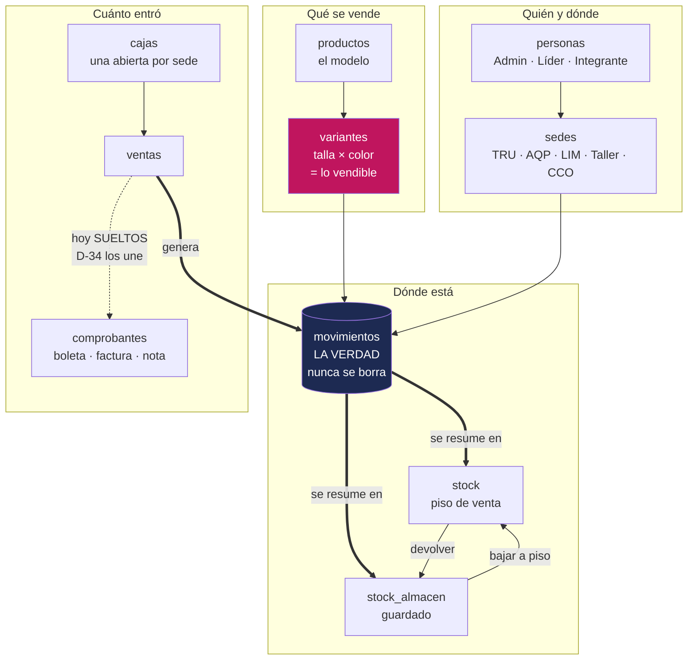
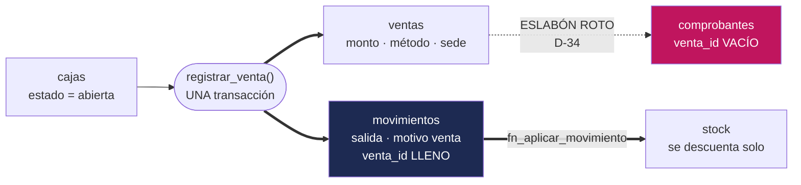
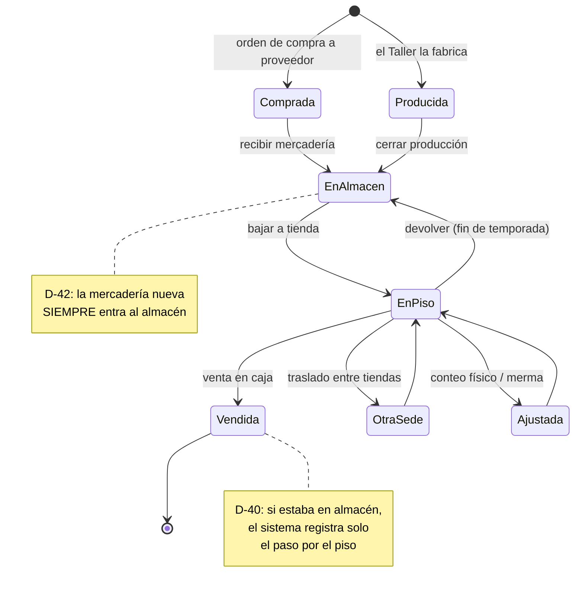

# El mapa — CAYLA en una página

> Si solo vas a leer un archivo de `docs/datos/`, que sea este. En 15 minutos
> entiendes cómo está armada la base de datos de CAYLA y por qué está armada así.
> Todo lo demás es detalle de este mapa.

---

## 1. Qué es CAYLA, en datos

Una marca peruana de indumentaria y bisutería con **producción propia**. Cuatro
lugares reales y uno administrativo:

> ⚠️ **Los códigos de sede engañan, y esto ya costó tiempo.** Léelos de esta tabla,
> no de la intuición: **`LIM` es el Taller**, y la tienda de Lima es **`003`**.

| Código | Qué es | Qué pasa ahí en el sistema |
|---|---|---|
| **TRU** | Tienda, Trujillo | Vende. Es la sede más grande (S/438k en 2026) |
| **AQP** | Tienda, Arequipa | Vende (S/177k) |
| **`003`** | Tienda, Lima | Vende (S/30k). ⚠️ En el sistema de personal figura como **inactiva**, pero retail la sigue ofreciendo: retail dejó de mirar ese campo a propósito (ADR-0029) |
| **`LIM`** | **Fábrica (el Taller), Lima** | Corta, confecciona, termina. No vende: produce y manda |
| **CCO** | Corporativo | No existe físicamente. Absorbe los gastos que no son de ninguna tienda: el contador, los servidores, el software |
| **`OTRU`** | Oficina Trujillo | ⚠️ **Existe y está activa en el sistema de personal, y retail NO la ve.** Le falta su fila en `sede_meta`, y nada avisa de eso |

**Por qué los códigos quedaron así:** vienen del sistema de personal, que los asignó con
su propio criterio antes de la unificación. Por eso el código **no** sirve para saber
qué es una sede. El Taller se busca siempre por `tipo = 'fabrica'`, nunca por su código
— y para eso existe `apps/web/lib/etiqueta-sede.ts`.

**Y por qué una sede puede ser invisible:** `retail.sedes` no es una tabla, es una vista
que cruza las sedes del sistema de personal contra `retail.sede_meta`. El cruce es
interno: **si a una sede le falta su fila en `sede_meta`, para CAYLA retail no existe**.
No hay error, no hay aviso — simplemente no aparece. Le pasa hoy a `OTRU`.

**"Online" no es una sede.** Es un canal de venta: despacha del stock real de alguna
de las tres tiendas.

⚠️ **Los códigos de sede no significan lo mismo en las dos bases.** Arriba está la vida real; el SQL no coincide consigo mismo:

| En la vida real | Tu máquina dice | Las tiendas dicen |
|---|---|---|
| Tienda Lima | `LIM` | `003` |
| El Taller | `TALLER` | **`LIM`** |
| Corporativo | `CORP` | **`CCO`** |

`LIM` es la tienda de Lima en tu máquina y **el Taller** en las tiendas
(`migrations/0001_init.sql:18-22` contra `unificacion/01_sedes.sql:32-40`). Manda
producción (D-20). De ahí la regla: **ningún código de sede se escribe a mano en la
app** — el Taller se busca por `tipo = 'fabrica'`.

---

## 2. Las seis frases que hay que entender sí o sí

Si entiendes estas seis, entiendes el 80% del sistema. Todo lo demás se deduce.

### 1. El historial es la verdad; el stock es un resumen

`movimientos` guarda **cada hecho que movió mercadería**: una venta, un traslado, una
corrección, una producción. Nunca se borra y nunca se edita. `stock` es solo la
suma de todo eso, guardada aparte para no tener que recalcularla cada vez que alguien
abre una pantalla.

*Por qué importa:* si `stock` se corrompe, se reconstruye entero desde `movimientos`
con una sola función (`recalcular_stock`). Si se corrompiera `movimientos`, no habría
de dónde reconstruir nada. **Por eso esa tabla es sagrada.**

*Cómo se corrige un error:* nunca borrando. Se escribe un movimiento de corrección
con signo contrario y su motivo. El stock queda bien y el historial muestra las dos
cosas: el error y quién lo corrigió. Igual que un contador, que no borra un asiento
sino que hace uno que lo revierte.

### 2. Una sede tiene dos bolsillos: lo exhibido y lo guardado

Dentro de **la misma sede**, la mercadería puede estar en el piso de venta
(`stock`, lo que la clienta puede tocar) o en el almacén de esa tienda
(`stock_almacen`, lo que está guardado). No son dos sedes: es una sede con dos
bolsillos, y hay operaciones para mover de un bolsillo al otro.

*Por qué importa:* "hay 10 blusas en Arequipa" no significa nada si 8 están en cajas
sin abrir. La tienda puede estar *con stock* y vacía por dentro.

### 3. Una prenda son dos cosas: el modelo y lo vendible

`productos` es el modelo ("Blusa Amanecer"). `variantes` es lo que se vende de
verdad: **esa blusa, en talla M, en color vino**. El stock, los movimientos, las
ventas y los códigos de barras cuelgan **siempre** de la variante, nunca del producto.

*Por qué importa:* una blusa en 5 tallas y 5 colores son **25 posiciones de stock
distintas**, no un producto. Los sistemas contables la tratan como un SKU plano y por
eso no pueden decirte que *la M vino se está quedando*. Ese es exactamente el hueco
de mercado donde CAYLA tiene ventaja.

### 4. La sede es el candado

No hay un concepto de "empresa" ni de "cliente del sistema" en la base. **La
separación es la sede.** Un Integrante de Arequipa ve Arequipa. Un Admin ve todo.
La base lo hace cumplir sola: no es una validación de formulario que se pueda saltar.

*Por qué importa:* el día que CAYLA le venda el sistema a otra marca, esa marca
recibe **su propia base entera** (D-50). No conviven en la misma.

### 5. El número del comprobante se reserva antes de enviarlo a SUNAT

Emitir una boleta y transmitirla a SUNAT son **dos pasos separados**. Primero el
sistema reserva el número correlativo oficial (bloqueando la serie para que dos cajas
no tomen el mismo), y después, en otro momento, se transmite.

*Por qué importa:* si SUNAT no responde, el comprobante se queda con su número real y
su estado real. Nunca se le inventa un estado ni se reintenta solo. Un correlativo
quemado no se recupera.

### 6. Escribir se hace por una sola puerta

Las pantallas **leen** directo de la base. Pero para **escribir** algo que mueva
stock, plata o producción, hay que pasar por una función de la base (una RPC) que
hace todo o no hace nada. No se puede "escribir a medias".

*Por qué importa:* es lo que garantiza que nunca haya una venta sin su movimiento de
stock, ni una producción contada dos veces.
⚠️ *Y es donde el sistema hoy tiene su lista de excepciones:* compras, proveedores,
patrimonio, comparativo y ajustes de efectivo escriben directo, sin esa puerta. Están
listadas módulo por módulo.

---

## 3. El mapa de las ocho entidades que importan

**Lo que hay que leer en ese dibujo:**
- Todo lo que mueve mercadería termina en `movimientos`. Sin excepción.
- `stock` y `stock_almacen` son **derivados**: se pueden borrar y reconstruir.
- La línea punteada entre `ventas` y `comprobantes` es **el acoplamiento roto más
  caro que tiene el sistema hoy**: no se puede cuadrar lo vendido contra lo
  facturado, y las devoluciones no tienen a qué boleta agarrarse (D-34).

---

## 4. El recorrido de una venta, de punta a punta

El camino más caliente del sistema — y casi todo ocurre en **una sola llamada**.

**Dónde está roto, y qué cuesta:**

- **Lo de la izquierda es sólido.** Venta, movimientos y stock entran juntos o no entra
  nada: un solo `registrar_venta` los escribe en la misma transacción, y antes valida
  caja abierta, sede y carrito no vacío
  (`unificacion/37_registrar_venta_p_nota.sql`, líneas 94, 111 y 115).
- **El comprobante se emite aparte y llega sin su venta.** `emitir_comprobante` acepta
  `p_venta_id`, pero opcional (`unificacion/17_facturacion_completa.sql:130`), y la
  pantalla no lo manda (`ComprobantesPanel.tsx:240`): `comprobantes.venta_id` existe y
  está **siempre vacía**.
- **La asimetría es el punto.** `movimientos.venta_id` sí está lleno — el inventario
  sabe qué venta lo movió; el papel legal, no. Por eso no se cuadra lo vendido contra
  lo facturado, la devolución no tiene boleta de dónde colgar (D-43) y el IGV que va al
  libro contable no sabe de qué venta salió. Detalle en `modulos/07` y `modulos/08`.

---

## 5. El ciclo de una prenda, de principio a fin

---

## 6. La frontera con Dynamic: lo que no es nuestro

CAYLA corre **dos negocios sobre una sola base física**: `cayla-retail` —vender ropa—
en el schema `retail`, y `cayla-dynamic` —pagar personas— en el schema `public`. Un solo
proyecto Supabase: `vovjyyiafkxteijimpuy`, que en el panel se llama "cayla-dynamic".

**`retail.personas` y `retail.sedes` no son tablas: son vistas** sobre las tablas
reales de Dynamic (`unificacion/03_candados.sql:15` y `:22`). No hay dos copias de
"quién trabaja acá": hay una sola, y retail la mira. Tres consecuencias que muerden:

- **La vista de sedes hace `join` con `retail.sede_meta`.** Una sede que exista en
  Dynamic y no tenga fila ahí **no existe para retail**. No da error: no aparece.
- **24 tablas de retail tienen llave foránea real** a `public.sedes`/`public.personas`,
  sin `on delete`: borrar a una persona que ya vendió **falla**. No se borra a nadie.
- **Cada lado usa otras palabras.** Allá `taller` y `central`, acá `fabrica` y
  `corporativo`. Nunca leas `public.sedes.tipo` directo: siempre por la vista.

⚠️ **El hallazgo que vale por todo el capítulo:** en producción `retail.es_lider()` no
pregunta si eres líder de una sede — pregunta `fn_rol_actual() = 'admin'`
(`unificacion/03_candados.sql:64`). La persona a cargo de una tienda
(`supervisor_sede` en Dynamic) **da falso**, y `es_lider()` es el candado de 21
políticas: **hoy solo Felipe puede dar de alta catálogo o registrar un gasto en las
tiendas**. El sistema tiene **dos** niveles donde D-12 decidió **cuatro** — Admin ·
Líder de equipo (nunca "encargada": hay hombres y mujeres) · Integrante · Solo lectura.
Detalle en `modulos/01-identidad-y-acceso.md` y `14-DYNAMIC.md`.

---

## 7. Los 14 módulos y su pájaro

Cada módulo tiene un dueño con apodo de pájaro (ver `07-GOBIERNO.md`). El archivo de
cada uno está en `modulos/`.

| # | Pájaro | Módulo | En una línea |
|---|---|---|---|
| 01 | 🦆 Ganso | Identidad y acceso | Quién es quién, y qué puede tocar |
| 02 | 🦜 Loro | Catálogo y vocabulario | Qué se vende y cómo se llama |
| 03 | 🪶 Tucán | Taxonomía universal | El diccionario mundial del que cuelga el nuestro |
| 04 | 🕊️ Golondrina | Importación de catálogo | Meter 900 prendas sin escribirlas una por una |
| 05 | 🦅 Halcón | **Inventario y movimientos** | **El núcleo. Dónde está cada prenda y por qué** |
| 06 | 🦉 Lechuza | Conteo y censo físico | Contar la tienda de verdad, incluso sin internet |
| 07 | 🐦 Colibrí | Ventas y caja | Cobrar rápido y cuadrar al cierre |
| 08 | 🖤 Cuervo | Facturación SUNAT | El papel legal de cada venta |
| 09 | 🦢 Pelícano | Compras y proveedores | A quién le compramos y cuánto debemos |
| 10 | 🐓 Gallito | Producción del Taller | Fabricar y saber cuánto costó |
| 11 | 🦩 Garza | Finanzas operativas | Gastos, depósitos, efectivo |
| 12 | 🐦‍⬛ Urraca | Contabilidad | El libro formal de partida doble |
| 13 | 🦅 Águila | Inteligencia y reportes | Qué se está quedando y cuánto ganamos |
| 14 | 🐦 Gorrión | Plataforma y esquema | Cómo se cambia la base sin romper la tienda |

---

## 8. Los números, hoy

Verificados el 2026-09-12 **preguntándole a la base de producción**, no a la documentación. Los que circulaban (36, 28, 44, 58) estaban desactualizados.

| Qué | Cuánto |
|---|---|
| Tablas de CAYLA Retail en producción | **45** + 2 vistas |
| Tablas del sistema de personas (Dynamic) en producción | **69** + 4 vistas |
| Tablas que crean las migraciones del repo | 44 — dos de ellas, `personas` y `sedes`, allá son **vistas** |
| Tablas que nacen solo del riel paralelo de producción | 3 — `sede_meta`, `sede_datos_fiscales`, `configuracion_empresa` |
| Migraciones locales | **57** archivos, 0001-0058 (el 0043 no existe) |
| Migraciones de producción | **37** archivos, en carpeta paralela (el "02" nunca se escribió) |
| Funciones del schema `retail` en producción | 56 — y **7 sin archivo** en el riel de producción |
| Decisiones estructurales documentadas (ADR) | 40 |
| Pantallas rotas en las tiendas ahora mismo | **2** — registrar gasto, recibir mercadería con producción |
| Pruebas automáticas sobre el núcleo de stock | **0** |

Las dos rotas: `RegistrarGastoModal.tsx:57` manda `p_metodo_pago` y allá
`registrar_gasto` acepta 6 parámetros; `RecibirLoteForm.tsx:431` manda
`p_orden_produccion_id` y allá `recibir_lote` acepta 7. Fallaban siempre (`generado/DRIFT.md` del 2026-09-12; ya corregido).

**La brecha entre las dos bases es el riesgo estructural número uno** — y va al revés
de lo que se suponía. No es que tu máquina vaya adelante: **producción tiene tablas y
funciones vivas que ningún archivo del repo crea.** El caso limpio es `sede_meta`:
`unificacion/01_sedes.sql:19` crea `retail_sede_meta` sin prefijo —o sea, en `public`—
mientras la tabla que la app usa es `retail.sede_meta`. Con eso, `sede_datos_fiscales` y
esas 7 funciones, **reconstruir producción desde este repo daría una base distinta a la
real** (`08-OPERACION.md`).

Al revés también el candado del NULL: `puede_operar_sede()` lleva `coalesce(…, false)`
en producción (`unificacion/03_candados.sql:76-79`) y **no en local**
(`migrations/0012_rpc_valida_sede.sql:15-26`) — sin sede devuelve NULL, y un
`if not … then raise` contra NULL no dispara. Abierto en tu máquina, cerrado en las
tiendas.

---

## 9. Por dónde seguir

| Si eres… | Lee después |
|---|---|
| Alguien que entra hoy | `12-ONBOARDING.md` — ruta de un día |
| Quien va a tocar el inventario | `01-INVARIANTES.md` y `modulos/05-inventario-y-movimientos.md` |
| Quien va a tocar plata | `modulos/07`, `modulos/08`, `modulos/12` |
| Quien busca un campo puntual | `generado/DICCIONARIO-RETAIL.md` (generado, siempre al día) |
| Quien va a desplegar a producción | `08-OPERACION.md` y `generado/DRIFT.md` |
| Un agente de IA | `01-INVARIANTES.md` primero, después el módulo que toque |
| Felipe, decidiendo | `10-ROADMAP-DATOS.md` y `13-PROMESAS-INCUMPLIDAS.md` |

---

*Escrito el 2026-09-12 leyendo el SQL y la base de producción, no la documentación
previa. Lo gobiernan D-01 y D-02 (para quién se escribe), D-05 y D-16 (los dos sistemas
y las dos bases, lado a lado), D-12 (los cuatro niveles), D-20 (`CCO`), D-34 (venta y
comprobante se unen), D-38/D-40/D-42 (los dos bolsillos), D-50 (una base por marca), D-51
(un dibujo por módulo). El acta: `DECISIONES-2026-09-12.md`.*
