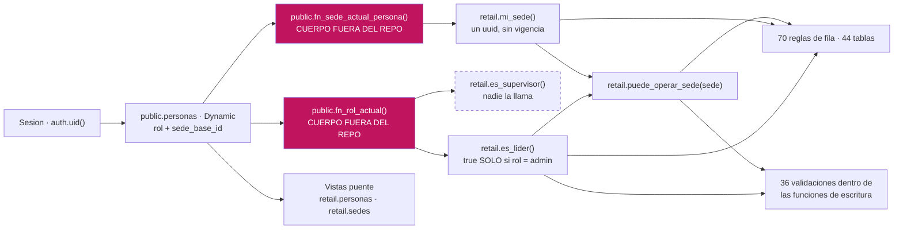

# Quién ve qué y quién puede escribir qué

> **Qué contesta este archivo:** dónde está el candado de CAYLA, dónde todos creen
> que está y no está, y qué puede hacer hoy una persona con sesión que no debería
> poder hacer.
>
> **Lo que no repite:** la escalera de cuatro niveles y los pájaros están en
> [`07-GOBIERNO.md`](07-GOBIERNO.md); quién es quién y cómo se resuelve la identidad,
> en [`modulos/01-identidad-y-acceso.md`](modulos/01-identidad-y-acceso.md); la regla
> de acceso exacta de cada tabla, en
> [`generado/DICCIONARIO-RETAIL.md`](generado/DICCIONARIO-RETAIL.md). Acá está lo
> transversal: los candados, sus huecos y la diferencia entre tu máquina y las
> tiendas.
>
> **Todo lo de abajo se verificó el 2026-09-12** contra la base de producción
> (el proyecto de Dynamic, schema `retail`) y contra el SQL del repo. Donde algo no
> se pudo verificar, está dicho con esas palabras.

---

## 1. La sede es el candado — y hoy tiene dos llaves, no cuatro

En CAYLA no existe "empresa" ni "cliente del sistema" dentro de la base. La
separación es **la sede**: de qué tienda eres decide qué ves y qué tocas
(`00-MAPA.md`, frase 4).

La escalera decidida son cuatro niveles — Admin · Líder de equipo · Integrante ·
Solo lectura (D-12). **La base conoce dos**, y con dos vocabularios distintos:

| Dónde | Valores reales de `rol` | Quién los define |
|---|---|---|
| Local (`supabase/migrations/`) | `lider` \| `integrante` — es un CHECK de la tabla (`0001_init.sql:30`) | este repo |
| Producción (schema `retail`) | `admin` \| `supervisor_sede` \| `integrante` — enum `rol_usuario` de Dynamic | el sistema de personal |

`personas` **no es una tabla de retail en producción: es una vista** sobre
`public.personas` de Dynamic (`unificacion/03_candados.sql:21-28`). El rol se cambia
en el sistema de personal, no acá. Lo mismo `sedes` (`:14-18`). Por eso hay llaves
foráneas reales cruzando de un schema al otro: `codigos_barras.creado_por` apunta a
`public.personas(id)` (`unificacion/29_codigos.sql:178`), no a nada de `retail`.

La única traducción de roles de toda la aplicación es `mapearRol`
(`apps/web/lib/persona.ts:49-51`): `admin` y `lider` → Líder; **todo lo demás,
incluido `supervisor_sede`, → Integrante**. El propio comentario del archivo lo
reconoce como decisión pendiente (`:47-48`). Esa decisión ya se tomó: es D-12.

---

## 2. Las cinco piezas que deciden todo

Todo el sistema de permisos de retail se apoya en cinco funciones. Vale la pena
saberlas de memoria, porque **cambiar una sola cambia el comportamiento de las 70
reglas de fila y de las 36 validaciones de las funciones de escritura a la vez**.

| Pieza (producción) | Qué contesta | Cómo corre | Gemela en local |
|---|---|---|---|
| `retail.es_lider()` | ¿el rol en Dynamic es **exactamente** `admin`? | **invoker** (como quien llama) | `fn_es_lider()` — compara contra `'lider'`, **definer** |
| `retail.es_supervisor()` | ¿el rol es `supervisor_sede`? | invoker | no existe |
| `retail.mi_sede()` | su `sede_base_id` — **un solo uuid**, sin vigencia | invoker | `fn_sede_actual_persona()` — definer |
| `retail.puede_operar_sede(uuid)` | ¿es admin, o esa sede es la suya? | invoker | `fn_puede_operar_sede()` — invoker, **con una rama más** |
| `retail.persona_actual()` | su propia fila, nada más | **definer** | `fn_persona_actual()` — definer |

*(evidencia: `unificacion/03_candados.sql:31-79` para producción;
`migrations/0023_rls_helpers_security_definer.sql` y `0012_rpc_valida_sede.sql:15-26`
para local; la columna «cómo corre» sale de `generado/funciones-produccion.txt`,
leído de la base real)*

**Correr como dueño no es descuido: es el arreglo de una recursión infinita.** La
regla que decide quién puede leer `personas` llama a `fn_es_lider()`; para contestar,
`fn_es_lider()` tiene que leer `personas`; leer `personas` vuelve a evaluar la
regla… hasta que Postgres corta con *"stack depth limit exceeded"*. Es pedirle a la
Líder de AQP la llave del almacén y que conteste "déjame preguntarle al que tiene la
llave del almacén". Apareció consultando `activos_fijos`, que cuelga de dos reglas
que dependen de estas funciones, y la pantalla simplemente reventaba. El arreglo
—`0023_rls_helpers_security_definer.sql:1-14`— es que las tres funciones de
identidad lean `personas` sin pasar por las reglas de fila. Es seguro porque cada
una filtra por `where auth_user_id = auth.uid()`: solo pueden devolver la fila de
quien pregunta.

En producción el ciclo no existe —`retail.personas` es una vista sobre otro schema—
y por eso allá solo `persona_actual()` es `definer`. Las otras cuatro corren como
quien llama y se apoyan en **dos funciones de Dynamic**: `public.fn_rol_actual()` y
`public.fn_sede_actual_persona()`.

> **Y ahí hay un dato que conviene mirar de frente:** el cuerpo de esas dos funciones
> **no está en ningún archivo de este repo.** Verificado: `grep -rn "function
> fn_rol_actual" supabase/` no devuelve nada. Todo el modelo de permisos de CAYLA
> Retail descansa sobre dos funciones que este repo no crea, no versiona y no puede
> revisar. No es el único caso —la brecha completa está en
> [`08-OPERACION.md`](08-OPERACION.md)— pero sí es el más caro: si alguien cambia
> `fn_rol_actual()` en Dynamic, cambia quién puede vender en las tres tiendas y en
> este repo no se ve ni un diff.



---

## 3. El hueco del NULL: abierto en tu máquina, cerrado en las tiendas

Este es el hallazgo que más veces se contó al revés, así que va con el mecanismo
completo.

**El problema.** Un candado tiene que contestar `false` cuando no sabe. Si contesta
`NULL`, pasa esto:

```sql
if not fn_puede_operar_sede(p_sede_id) then
  raise exception 'No tienes permiso …';
end if;
```

`not NULL` es `NULL`, y `NULL` **no es true**: el `raise` no se dispara y la función
sigue de largo. El candado se abre solo, justo para el caso que existía para cerrar.
Lo peor es que no se ve mirando las reglas de fila, porque **en una policy `NULL`
deniega**. El agujero vive únicamente dentro de las funciones de escritura.

**Dónde está abierto hoy: en local.** `fn_puede_operar_sede`
(`migrations/0012_rpc_valida_sede.sql:15-26`) no lleva `coalesce`:

```sql
select fn_es_lider()                                  -- false (sí tiene coalesce)
  or p_sede_id = fn_sede_actual_persona()             -- NULL si no hay fila en personas
  or exists (select 1 from sedes …);                  -- false
```

`false or NULL or false` = **NULL**. Una sesión sin fila en `personas` —un usuario de
auth que nunca se dio de alta, un token de servicio— pasa el candado.

**Dónde está cerrado: en producción.** `retail.puede_operar_sede` envuelve las dos
ramas en `coalesce(..., false)` (`unificacion/03_candados.sql:76-79`). Y lo mismo
`es_lider()` y `es_supervisor()`.

> Esto es **al revés de lo que se suponía**. La creencia de la casa era "local va
> adelante, producción arrastra". Acá producción está endurecida y local no. El
> arreglo vivió meses en producción **sin estar en ningún archivo** —alguien lo pegó
> a mano— hasta que el 2026-09-10 se corrigió el archivo fuente y se dejó escrito el
> porqué en `unificacion/36_candados_no_null.sql:1-41`. Volver a pegar la versión
> vieja de `03_candados.sql` deshacía el arreglo en silencio.

**Cuántos sitios usan el patrón frágil.** Contado sobre el SQL, no estimado:

| Dónde | `if not candado()` (frágil) | `if candado() is not true` (a prueba de NULL) |
|---|---|---|
| `supabase/migrations/` (local) | **50** — 35 con `fn_puede_operar_sede`, 15 con `fn_es_lider` | **1** |
| `supabase/unificacion/` (producción) | 36 — 27 con `puede_operar_sede`, 9 con `es_lider` | 6 |

**El único sitio de local que lo hace bien es
`migrations/0054_venta_idempotente.sql:115`** —`registrar_venta`— y lo dice en su
propio comentario dos líneas antes (`:113-114`). Los otros 49 dependen de que
`fn_puede_operar_sede` nunca devuelva NULL, cosa que hoy no es cierta.

**El arreglo, para que quede con nombre:** una línea en
`migrations/0012_rpc_valida_sede.sql:15` — envolver las tres ramas en
`coalesce(..., false)`, igual que producción. No hace falta tocar las 50 llamadas.
En producción, los 36 sitios frágiles ya están cubiertos por el `coalesce` del
candado; endurecerlos igual es defensa en profundidad, no urgencia.

---

## 4. En producción, `es_lider()` es `admin` — y eso tiene consecuencia en tienda

```sql
-- unificacion/03_candados.sql:62-64
create or replace function retail.es_lider()
returns boolean language sql stable set search_path = public
as $$ select coalesce(public.fn_rol_actual() = 'admin', false); $$;
```

**`retail.es_lider()` no pregunta por el líder de una sede: pregunta por `admin`.**
El rol `supervisor_sede` —el que en las tiendas lleva el equipo— **no pasa este
candado**. Y no lo compensa nadie:

- `retail.es_supervisor()` existe (`03_candados.sql:66-68`) y **ninguna de las 70
  reglas de fila de producción la usa**. Verificado leyendo
  `generado/retail_policies.json` entero: la cadena `es_supervisor` no aparece una
  sola vez. Tampoco la llama ninguna función de escritura.
- `mapearRol` manda `supervisor_sede` a Integrante (`lib/persona.ts:50`).
- En el otro lado del muro, Dynamic **sí** lo honra: 19 de sus reglas comparan
  `fn_rol_actual() = 'supervisor_sede'` (`generado/DICCIONARIO-DYNAMIC.md`). O sea
  que la misma persona es supervisora en el sistema de personal e integrante en
  retail.

**El hallazgo operativo, no técnico.** Todas las tablas de catálogo escriben con
`retail.es_lider()`. Entonces, hoy, en las tiendas:

> **Solo Felipe puede dar de alta o corregir catálogo, proveedores, patrimonio,
> recetas de costo, órdenes de compra o históricos.** Una Líder de equipo que abra
> esas pantallas ve el formulario, llena los campos, guarda… y la fila no entra. No
> hay error de permisos entendible: es una regla de fila que rechaza en silencio.

Son **15 puntos de escritura en 8 archivos**, todos contra tablas cuya única regla de
escritura es `retail.es_lider()` — el detalle está en la sección 7.

Y la vuelta de tuerca: la única función de escritura que **sí** exige rol,
`retail.registrar_gasto` (*"Solo un Líder puede registrar gastos"*,
`unificacion/07_funciones_operacion.sql:183`), **está rota en producción**. La
pantalla manda `p_metodo_pago` y allá la función acepta seis parámetros sin ese
(`RegistrarGastoModal.tsx:57`, ver `generado/DRIFT.md`). Encaja con lo que dice la
base: `retail.gastos` tiene **0 filas** (`generado/retail_filas.json`). El candado de
rol mejor puesto del sistema protege una puerta que nunca se abrió.

La segunda llamada rota, por si se lee esto buscando las dos:
`RecibirLoteForm.tsx:431` manda `p_orden_produccion_id` y producción acepta siete
parámetros sin ese.

---

## 5. Matriz rol × operación

Dos columnas, porque hoy no son lo mismo: **lo decidido** (D-12, D-13) y **lo que la
base de producción hace de verdad**. Donde discrepan, gana la primera como plan y la
segunda como realidad.

| Operación | Admin | Líder de equipo (decidido) | Líder de equipo (producción, hoy) | Integrante (producción, hoy) | Solo lectura |
|---|---|---|---|---|---|
| Vender / abrir caja | sí | sí | sí — `puede_operar_sede` | **sí** | no debería |
| **Cerrar la caja del día** | sí | sí | sí | **sí** — `cerrar_caja` valida sede, no rol (`07_funciones_operacion.sql:117`) | no |
| **Ajustar stock sin venta** | sí | sí | sí | **sí** — `registrar_movimiento` valida sede, no rol (`07_funciones_operacion.sql:65`) (además, desde `20260926000400`, sin pegar en producción: un ajuste «Reposición» sobre el piso se rechaza para cualquiera, líder incluido, hint `reposicion_piso_cerrada`, ADR-0208) | no |
| **Registrar depósito** | sí | sí | sí | **sí** — `registrar_deposito` valida sede (`08_funciones_finanzas.sql:77`) | no |
| **Registrar gasto** | sí | sí | **no** (`es_lider` = admin) · y además la pantalla está rota | no | no |
| Trasladar a otra sede | sí | sí | sí | **sí, a cualquier sede** — el destino no se valida (sección 8) | no |
| Recibir mercadería / mover piso ↔ almacén de su sede | sí | sí | sí | **sí** — `bajar_a_piso` y `devolver_a_almacen` validan sede (`12_almacen_interno.sql:260,301`) (V1; hoy: las dos son `mover_interno`, que solo valida la tienda con `fn_puede_operar_ubicacion`, sin módulo ni token; y `bajar_al_piso`, que además exige el módulo «Bajada al piso» dentro de la función, ADR-0208) | no |
| Contar (conteo físico) | sí | sí | sí | **sí** — `conteo_contar` valida sede | no |
| **Cerrar un conteo** (la aprobación) | sí | sí | **no** — `cerrar_conteo` exige `es_lider()` = admin (`30_conteos.sql:400`) | no | no |
| **Ver costo y margen** | sí | sí (D-13) | **sí** | **sí** — decisión consciente, D-27 (sección 9) | sí |
| Ver las ventas y cajas de su sede | sí | sí | sí | **sí** por API — el menú lo esconde, la base no (sección 6) | sí |
| Ver los gastos de su sede | sí | sí | **no** — `gastos_all_lider` cubre también el SELECT | no | **no** |
| Ver la contabilidad de su sede | sí | sí | sí, parcial — `asientos_select_propia` (`unidad_id = mi_sede()`) | sí, parcial — la misma regla | sí |
| Dar de alta catálogo / proveedores | sí | sí | **no** (sección 4) | no | no |
| Dar de alta o de baja a una persona | sí | ¿? | **nadie por la API** — se hace en Dynamic o por SQL (D-11) | no | no |
| Cubrir otra sede temporalmente | — | sí, con fecha de fin (D-14) | **no existe** — `mi_sede()` devuelve un uuid fijo | no | no |

**Lo que sale de leer la columna del Integrante:** de los cinco poderes que D-13 le
reserva al Líder de equipo, **cuatro los tiene hoy cualquier Integrante de la sede**
(cerrar caja, ajustar stock, registrar depósitos, ver métricas) y el quinto —ver
costos— se le regala a propósito (D-27). El único reparto que sí funciona es el del
conteo físico: cualquiera cuenta, **solo el cierre exige rol** (`30_conteos.sql:400`,
*"Solo un líder puede cerrar un conteo — es la aprobación de lo contado"*). **Ese es
el patrón a copiar en los otros cuatro:** el Integrante trabaja, el Líder aprueba.

El "Solo lectura" no tiene ninguna pieza: ni un valor de rol, ni una regla, ni un rol
de Postgres. Hoy el contador externo, si entra, entra como Integrante — y un
Integrante vende.

---

## 6. Los patrones de acceso, y las tablas que no tienen ninguno

Producción tiene **45 tablas + 2 vistas** en `retail` y **70 reglas de fila**
repartidas en **44 tablas**. Las reglas caen en tres patrones y dos excepciones.

**Patrón A — "Admin ve todo, Integrante ve su sede".** La regla llama a
`retail.puede_operar_sede(sede_id)`, que resuelve las dos cosas de una vez:
`stock`, `stock_almacen`, `cajas`, `ventas`, `movimientos`, `contenedores`, `lotes`,
`conteos`, `conteo_lineas`, `depositos_bancarios`, `comprobantes`, `proformas`,
`series_comprobantes`.

**Patrón B — "cualquiera con sesión lee, solo Admin escribe".** Lectura
`auth.role() = 'authenticated'`, escritura `retail.es_lider()`: `categorias`,
`colores`, `productos`, `variantes`, `proveedores`, `cuentas_contables`,
`codigos_barras`, `codigos_correlativos`, `importaciones`, `producto_atributos`, las
cinco `taxonomia_*`, `configuracion_empresa`, `sede_datos_fiscales`. Son catálogos
compartidos: para vender hay que ver todo lo que existe, no solo lo de tu tienda.
**Acá vive la transparencia de la sección 9:** `variantes` (con `costo`), `productos`
(con `costo_mano_obra`) y `proveedores` (con `ruc`, `banco`, `cuenta_bancaria` y, desde
2026-09-19, `cci`, `celular_billetera`, `billeteras` y `titular_cuenta` — ADR-0134) están
los tres en este grupo.

**Patrón C — "libro contable, solo Admin".** `retail.es_lider()` para leer y
escribir: `asientos`, `asiento_lineas`, `activos_fijos`, `patrimonio_items`,
`ventas_historicas_mensuales`, `ajustes_efectivo`, `gastos`, `ordenes_compra`,
`ordenes_compra_items`, `bom_items`, `ordenes_produccion`, `producciones`.

**Excepción 1 — la grieta por sede propia.** `asientos_select_propia`,
`lineas_select_propia`, `activos_select_propia` y `producciones_select_propia`
**sí** dejan ver por sede (`unidad_id = retail.mi_sede()`). El patrón C no es "solo
Admin" del todo: nació para que una sede pueda ver sus propios asientos, y es lo que
hace posible D-30 (estado de resultados por sede). Es deliberado, pero confírmalo con
quien diseñó ese flujo antes de asumir que la contabilidad está cerrada.

**Excepción 2 — el destino de un traslado.** `movimientos_select` no es solo "tu
sede": es `puede_operar_sede(sede_id) or sede_destino_id = retail.mi_sede()`. Sin la
segunda condición, la tienda que **recibe** un traslado no lo vería en su propio
historial — era el error de ADR-0001, corregido agregando una regla nueva en vez de
tocar la que ya funcionaba (`migrations/0005_movimientos_select_sede_destino.sql`).
La misma idea se repite en `ordenes_compra_select_sede` y `op_select_destino`.

### Las tablas sin ninguna regla, y las que no tienen puerta de escritura

**Una sola tabla de las 45 no tiene ninguna regla: `retail.migraciones_aplicadas`.**
Tiene las reglas de fila activadas (`unificacion/38_migraciones_aplicadas.sql:73`) y
**cero policies**. En Postgres eso no significa "abierta": significa **invisible por
completo a la API, para cualquier rol**. Es a propósito. Es el registro de qué SQL se
pegó en producción, solo le sirve a quien tiene el editor SQL (Felipe, D-11), y una
regla que solo Admin pudiera leer sería más trabajo que no tener ninguna. Verificado:
no aparece en `generado/retail_policies.json` y tiene 18 filas en producción.

Y hay un segundo grupo que conviene entender antes de sacar conclusiones: **22 tablas
tienen solo regla de SELECT**. `stock`, `stock_almacen`, `codigos_barras`,
`codigos_correlativos`, `comprobantes`, `conteos`, `conteo_lineas`, `proformas`,
`series_comprobantes`, `importaciones`, `producto_atributos`, `produccion_lineas`,
`asientos`, `asiento_lineas`, `configuracion_empresa`, `sede_datos_fiscales`,
`sede_meta` y las cinco `taxonomia_*`. **No se puede escribir en ellas desde la API,
por nadie.** La única puerta es una función que corre como dueña — que es justo el
diseño de `00-MAPA.md`, frase 6.

**Un caso que vale la pena decir en voz alta: `movimientos` tiene INSERT y SELECT, y
ninguna regla de UPDATE ni de DELETE.** Por la API, el historial ya es
inmodificable e imborrable. Lo que falta para D-22 es el candado *físico* —un
disparador que también frene a una función que corre como dueña y al editor SQL—, no
una regla de fila. La diferencia importa: quien lea "el historial se puede borrar" y
salga a escribir una policy, está arreglando lo que ya está bien. El candado que
falta está en [`01-INVARIANTES.md`](01-INVARIANTES.md).

---

## 7. La superficie de riesgo: las pantallas que escriben directo a la tabla

La promesa de la casa es que para escribir algo que mueva stock, plata o producción
hay que pasar por una función que hace todo o no hace nada. **Hay 15 sitios donde
eso no se cumple** — la pantalla habla directo con la tabla, y lo único que la
detiene es la regla de fila.

| Archivo:línea | Tabla | Operación | Lo que la frena hoy |
|---|---|---|---|
| `apps/web/components/RecetaCosto.tsx:49` | `bom_items` | insert | `bom_all_lider` = admin |
| `apps/web/components/RecetaCosto.tsx:64` | `bom_items` | **delete** | `bom_all_lider` = admin |
| `apps/web/components/RecetaCosto.tsx:70` | `productos` | update | `productos_update_lider` = admin |
| `apps/web/components/RecetaCosto.tsx:77` | `variantes` | update (pisa el `costo` de todas las variantes del producto) | `variantes_update_lider` = admin |
| `apps/web/components/ProveedoresManager.tsx:122` | `proveedores` | update | `proveedores_write_lider` = admin |
| `apps/web/components/ProveedoresManager.tsx:123` | `proveedores` | insert | `proveedores_write_lider` = admin |
| `apps/web/components/ProveedoresManager.tsx:134` | `proveedores` | update (`activo`) | `proveedores_write_lider` = admin |
| `apps/web/components/ComprasManager.tsx:111` | `ordenes_compra` | insert | `ordenes_compra_lider` = admin |
| `apps/web/components/ComprasManager.tsx:128` | `ordenes_compra` | update (cancelar) | `ordenes_compra_lider` = admin |
| `apps/web/components/EfectivoPanel.tsx:43` | `ajustes_efectivo` | insert | `ajustes_all_lider` = admin |
| `apps/web/components/PatrimonioEditor.tsx:44` | `patrimonio_items` | insert | `patrimonio_all_lider` = admin |
| `apps/web/components/HistoricosEditor.tsx:48` | `ventas_historicas_mensuales` | upsert | `ventas_hist_all_lider` = admin |
| `apps/web/components/FotoProducto.tsx:56` | `productos` | update (foto) | `productos_update_lider` = admin |
| `apps/web/app/api/taxonomia/anclar/route.ts:130` | `colores` | update | `colores_update_lider` = admin |
| `apps/web/app/api/taxonomia/anclar/route.ts:131` | `categorias` | update | `categorias_update_lider` = admin |

**Dos lecturas de esa tabla, las dos ciertas a la vez:**

1. **No hay un agujero de permisos ahí.** Las 10 tablas tienen su regla de escritura
   puesta, y es la más estricta que existe. Nadie que no sea Admin escribe una fila
   por esas quince puertas.
2. **Sí hay un agujero de integridad, y es el que importa.** Una regla de fila
   contesta "puedes / no puedes", nunca "esto deja el dato consistente". `RecetaCosto`
   pisa el `costo` de **todas** las variantes de un producto con un solo update
   (`:77`); `bom_items` es la única tabla del sistema que una pantalla **borra**
   (`:64`); `ComprasManager` cambia el estado de una orden de compra sin nada que
   valide la transición. Nada de eso escribe en `movimientos` ni pasa por una función
   atómica. Si algo queda a medias, no hay de dónde reconstruirlo.

**Lo que hay que hacer, en este orden:** primero `RecetaCosto.tsx:77` (pisa costos
en masa) y `ComprasManager.tsx:128` (cambia estado sin máquina de estados); el resto
puede esperar. La vía es una función de escritura por caso, como el resto del
sistema — no una regla de fila más.

---

## 8. Candados que faltan dentro de las funciones

Las funciones de escritura corren **como dueñas**: se saltan las reglas de fila a
propósito, y por eso **cada una tiene que validar sede y rol por su cuenta**. Cuatro
no validan nada. Las cuatro existen en producción hoy
(`generado/funciones-produccion.txt`).

| Función (producción) | Qué hace | Qué valida | Qué se puede hacer con ella |
|---|---|---|---|
| `retail.fn_reservar_numero_serie(p_sede_id, p_tipo)` | **quema un correlativo oficial de SUNAT** y avanza `series_comprobantes.siguiente_numero` (`17_facturacion_completa.sql:97-122`) | **nada** | llamarla con la sede de otra tienda y quemarle números de boleta. **Un correlativo quemado no se recupera** (`00-MAPA.md`, frase 5). Quien la llama desde adentro —`emitir_comprobante`— sí valida sede (`:144`); el problema es que la ayudante también está expuesta |
| `retail.fn_siguiente_correlativo(p_prefijo)` | avanza `codigos_correlativos.ultimo` para los códigos internos de catálogo (`29_codigos.sql:146-156`) | **nada** | inflar el correlativo de cualquier prefijo: los códigos de producto saltan y quedan huecos que nadie sabe explicar. Sus dos llamadoras, `fn_asignar_codigo_producto` y `fn_asignar_codigo_variante`, tampoco validan rol y **escriben `productos.codigo` como dueñas**, saltándose `productos_update_lider` |
| `retail.registrar_codigo_barras(p_variante_id, p_codigo, …)` | pega un código de barras a una variante (`29_codigos.sql:188-220`) | que la variante exista y que el código no esté tomado — **no valida rol ni sede** | cualquiera con sesión le cuelga códigos de barras a cualquier prenda del catálogo. `codigos_barras` no tiene regla de escritura, así que esta función **es** la puerta — y está abierta |
| `retail.previsualizar_cierre_conteo(p_conteo_id)` | devuelve el conteo línea por línea, con lo contado, lo del sistema y la diferencia (`30_conteos.sql:338-370`) | **nada** | leer el conteo completo de **otra sede**, con cantidades reales por variante. Se salta `conteos_select`, `conteo_lineas_select` y `stock_select` de una sola llamada. Es la fuga de lectura más ancha del sistema |

El arreglo de las cuatro es la misma línea que ya tienen sus vecinas: una validación
de sede al principio (`is not true`, no `not`), y en las dos de correlativos también
de rol. Las cuatro están en `retail`, que es un schema expuesto: no hace falta una
pantalla para llamarlas.

> **Trampa al leer `generado/RPCS.md`:** ese archivo dice *"Funciones en `retail`:
> 23"* porque se generó apuntando al contenedor local, no a producción. **Producción
> tiene 56** (`generado/DRIFT.md` y `generado/funciones-produccion.txt`, leídos de la
> base real). Quien concluya de RPCS.md que a producción "nunca le llegaron" las
> funciones de almacén o de conteo se equivoca: `bajar_a_piso` (V1; hoy: `mover_interno`),
> `devolver_a_almacen` (V1; hoy: `mover_interno` al revés), `abrir_conteo`, `cerrar_conteo`, `conteo_contar`,
> `conteo_crear_variante` y `anular_conteo` **están las siete allá**. Eso cierra
> D-26 por el lado que importa: en producción un Integrante ya opera el almacén de su
> propia sede. Lo que local tiene de más es la rama de la sede hermana
> (`tienda_asociada_id`, `0012:22-25`), que producción no necesita porque nunca creó
> las sedes `-ALM`.

**Y un candado que falta y no es de rol sino de destino.**
`retail.registrar_movimiento` valida la sede de **origen**
(`07_funciones_operacion.sql:65`) y **no mira `p_sede_destino_id` en ninguna parte** —
igual que local (`0012:52`), e igual que la regla `movimientos_insert`, que solo
comprueba `sede_id`. O sea: **cualquier sede puede empujar mercadería a cualquier
otra.** Lo que D-15 quiere como privilegio del Taller es hoy un permiso de todos. La
corrección es una condición, en una función que ya existe: cuando `p_tipo =
'traslado'`, exigir que el origen sea el Taller (`sede_meta.tipo = 'fabrica'`,
`unificacion/01_sedes.sql:35`) **o** que quien llama pueda operar la sede de destino.

---

## 9. Costos, márgenes y cuentas bancarias: los ve todo el mundo, a propósito (D-27)

Felipe decidió transparencia total: *"ser transparente, no hay riesgo en ello,
mostrarlo, no le veo el riesgo"*. Costo, margen y datos de proveedores quedan
visibles para cualquier persona con sesión.

**Y hay que corregir un comentario que promete lo contrario.** La cabecera de
`supabase/migrations/0003_rls.sql:1-3` dice, textual: *"Integrantes solo ven/operan su
propia sede y no ven costo/margen"*. Esa frase **nunca fue verdad**, ni siquiera el
día que se escribió. Nunca hubo un candado de costos en la base:

- `variantes_select` es `auth.role() = 'authenticated'`, sobre una tabla cuya columna
  `costo` es `numeric(12,2) not null default 0`. Cualquiera con sesión la lee por API,
  desde siempre.
- `productos_select`, igual, con `costo_mano_obra` adentro.
- `proveedores_select`, igual, con `ruc`, `banco` y `cuenta_bancaria` adentro (y desde 2026-09-19 también
  `cci`, `celular_billetera`, `billeteras` y `titular_cuenta`: ver la nota de abajo).
- Lo único que filtraba era la pantalla:
  `apps/web/app/api/export/inventario/route.ts:56,63` saca la columna "Costo" del CSV
  cuando no eres Líder, y
  `apps/web/app/(app)/producto/[varianteId]/page.tsx:104,110` ni consulta los
  materiales ni `costo_mano_obra`.

Así que aplicar D-27 **no toca la base para nada**: es borrar tres condiciones de
interfaz y arreglar un comentario. El trabajo es chico justamente porque el candado
nunca existió — y esa es la lección, no la tarea: un comentario que describe un
candado inexistente es peor que no tener comentario, porque tres sesiones lo leyeron
y lo repitieron como hecho.

**La nota que queda escrita, para que la decisión sea consciente:**
`proveedores.cuenta_bancaria` es el número de cuenta de un **tercero**, no de CAYLA.
Es dato personal de otro, y su tratamiento está en
[`06-DATOS-PERSONALES.md`](06-DATOS-PERSONALES.md).

**Actualización 2026-09-19 (ADR-0134, `docs/adr/0134-proveedores-cci-yape-plin-y-titular.md`):** `proveedores` suma
`cci`, `celular_billetera`, `billeteras` y `titular_cuenta`, **con la misma lectura que `banco` y `cuenta_bancaria`**
(`proveedores_select` a cualquier sesión). La escritura de esas cuatro pasa por `guardar_cuentas_proveedor`, solo líder
(`security definer`, sin EXECUTE para `anon`). Felipe decidió dejar la restricción por rol de datos de pago para el final del
proyecto; queda escrita la regla de que las **cinco columnas de pago** (`banco`, `cuenta_bancaria`, `cci`,
`celular_billetera`, `titular_cuenta`) **se cierran juntas o ninguna**. Riesgo de integridad abierto: no hay bitácora de
cambios de cuenta (quién cambió un CCI y cuándo); recomendada `proveedor_cuentas_historial`, append-only.

**Un matiz que la transparencia no cubre:** `gastos` tiene una sola regla,
`gastos_all_lider`, que cubre también el SELECT. Un Líder de equipo no puede ver los
gastos de su propia sede. Si D-13 le pide "ver las métricas esenciales de su sede" y
D-30 pide estado de resultados por sede, esa tabla necesita su
`gastos_select_propia`, igual que la tienen `asientos` y `producciones`.

---

## 10. Lo que no sabemos, y hay que ir a averiguar

**1 · Las vistas puente NO son `security_invoker`. RESUELTO — y la respuesta es la mala.**

Se le preguntó a la base de producción el 2026-09-12:

```sql
select c.relname, pg_options_to_table(c.reloptions)
from pg_class c join pg_namespace n on n.oid = c.relnamespace
where n.nspname = 'retail' and c.relkind = 'v';
-- personas → security_invoker = false
-- sedes    → security_invoker = false
```

**El linter de Supabase tenía razón y el código fuente estaba mal.** Las dos vistas son
propiedad de `postgres` y corren con los permisos del dueño, no con los de quien
consulta. Consecuencia concreta: al leer `retail.personas` **no se evalúa ninguna de
las 5 políticas de fila que `public.personas` sí tiene** — la vista las esquiva enteras.

Y sí está expuesto: `authenticated` tiene `SELECT` sobre `retail.personas`, que publica
`id, auth_user_id, nombre, sede_id, rol, email, estado` de **las 46 personas de CAYLA**.
O sea que una Integrante de Arequipa puede listar el nombre, el correo y el rol de
todos los colaboradores de todas las sedes. No se filtran sueldos ni documentos —
esas columnas no están en la vista— pero sí el directorio completo de la empresa,
saltándose cinco políticas escritas justamente para impedirlo.

**Qué lo arregla:** recrear las dos vistas con `with (security_invoker = true)`. Es un
cambio de dos líneas. **Antes de pegarlo hay que comprobar** que las políticas de
`public.personas` dejan a cada persona verse a sí misma y ver a su sede — si no, al
activar el `invoker` varias pantallas de retail dejarán de resolver quién es quien
está usando el sistema. Es exactamente el tipo de cambio que necesita ensayo antes
(D-18) y que no debe pegarse un sábado.

**2 · ¿Qué puede llamar `anon`?** Quedó anotado que el linter reporta **10 funciones
que corren como dueñas ejecutables sin iniciar sesión**; la lista escrita nombra
nueve: `eliminar_produccion`, `fijar_stock_minimo`, `fn_aplicar_movimiento`,
`persona_actual`, `registrar_asiento`, `registrar_deposito`,
`registrar_produccion`, `revertir_produccion_inventario`, `set_etapa_produccion`.
**No se re-verificó el 2026-09-12** — hay que volver a correr el linter para tener la
décima y confirmar las nueve. Ojo con dos: `registrar_deposito` mueve plata y
`fn_aplicar_movimiento` mueve stock, y las dos resuelven quién eres con `auth.uid()`,
que sin sesión es nulo. Quitarle el `execute` a `anon` es una línea por función.

**3 · Las 29 funciones sin `search_path` fijado.** Riesgo teórico: alguien con
permiso de crear objetos en un schema desvía a qué tabla apunta una función que no
nombra el schema completo. Bajo riesgo con seis personas de confianza; es la clase de
cosa que se corrige de una vez y no cuando ya pasó algo. También pendiente de
re-verificar.

**4 · ~~Una colaboradora dada de baja sigue pudiendo vender.~~ CERRADO (verificado
2026-09-23, PL-92).** Los dos candados de los que cuelga vender ya exigen
`public.personas.estado = 'activo'` **y** `retail.colaboradores.estado = 'activo'`:
`fn_es_lider()` (`supabase/migrations/20260922170000_alta_colaborador_requiere_aprobacion.sql:137`)
y `fn_ubicacion_actual_persona()` (`supabase/migrations/20260923120100_ubicacion_de_lideres.sql:109`).
`fn_puede_operar_ubicacion` es exactamente `fn_es_lider() or p_ubicacion_id =
fn_ubicacion_actual_persona()` (`0006_colaboradores.sql:55`), y `registrar_venta` la
pregunta antes que nada (`20260922150000_venta_asesora_emisor_descuento_lider.sql:362`):
quien está de baja recibe «No tienes permiso para vender en esa ubicación». En una
terminal, el responsable elegido también tiene que estar activo
(`20260923010000_terminales_sin_persona.sql:207`). Comparado contra la base: la
definición de las dos funciones es idéntica en local y en producción (md5 de `prosrc`
`0321a061…` y `a1ea6265…`). Lo que sigue es la foto del 2026-09-12, se deja como
historia.

~~Este no es un "no sabemos": está verificado y es el hueco más humano de todos.~~

> `public.personas` en Dynamic tiene `estado` (`activo` \| `inactivo`, con el CHECK
> `personas_cese_coherente` que exige `fecha_cese` al pasar a inactivo), y la tabla
> local tiene `activo boolean not null default true` (`0001_init.sql:31`).
> La vista `retail.personas` **incluso expone `estado`**
> (`unificacion/03_candados.sql:27`).
>
> **Y nadie lo consulta.** Verificado: ni una sola de las funciones o reglas de
> `supabase/migrations/` y `supabase/unificacion/` filtra por `activo` o `estado`; y
> la app pide exactamente cuatro columnas —`id, nombre, rol, sede_id`— en
> `apps/web/lib/persona.ts:74`. `retail.persona_actual()` tampoco devuelve `estado`
> (`03_candados.sql:31-38`).
>
> O sea: se registra el cese en el sistema de personal, con su fecha y su motivo, y
> la persona **sigue entrando a vender, cerrar caja y mover stock** mientras su
> usuario de auth exista. El corte hoy es manual y en otro sistema: borrar el usuario
> de Supabase Auth. Nadie lo tiene escrito como parte del proceso de baja.
>
> El arreglo tiene dos mitades y las dos son chicas: (a) que
> `fn_puede_operar_sede` / `puede_operar_sede` devuelvan false para quien no esté
> activo, y (b) que `requirePersonaActual()` lea `estado` y mande a `/login`. La (a)
> es la que manda: la (b) sola solo esconde el menú, igual que pasa con las métricas.

---

## 11. Resumen: lo que falta, con nombre y apellido

| # | Qué falta | Dónde se toca | Tamaño |
|---|---|---|---|
| 1 | Cerrar el hueco del NULL en local | `migrations/0012_rpc_valida_sede.sql:15` — `coalesce(..., false)` | Una línea |
| 2 | ~~Que `estado`/`activo` corte el acceso de quien ya no trabaja acá~~ **CERRADO 2026-09-23 (PL-92):** `fn_es_lider()` y `fn_ubicacion_actual_persona()` filtran `estado = 'activo'` (ver punto 4 arriba) | — | — |
| 3 | Candado de sede en `fn_reservar_numero_serie` (quema correlativos de SUNAT) | `unificacion/17_facturacion_completa.sql:97` | Una línea |
| 4 | Candado en `previsualizar_cierre_conteo` (lee el conteo de otra sede) | `unificacion/30_conteos.sql:338` | Una línea |
| 5 | Candado en `registrar_codigo_barras` y en `fn_siguiente_correlativo` | `unificacion/29_codigos.sql:146,188` | Chico |
| 6 | Traslado: validar el destino, con la excepción explícita del Taller (D-15) | `retail.registrar_movimiento` | Chico |
| 7 | Que la base sepa decir "Líder de equipo" y "Solo lectura" (D-12) | `public.personas.rol` en Dynamic + `mapearRol` (`lib/persona.ts:49`) | Medio |
| 8 | `retail.es_lider_de_equipo()` — verdadero para Admin **y** para el líder de esa sede | `unificacion/03_candados.sql` | Chico |
| 9 | Rol de Postgres de solo lectura para el contador externo: `select` sobre `retail`, **cero** `execute` | permisos del schema | Chico |
| 10 | Exigir rol (no solo sede) en `cerrar_caja`, `registrar_deposito` y la rama `ajuste` de `registrar_movimiento` (D-13) | tres funciones | Una línea c/u |
| 11 | `gastos_select_propia` para que un Líder vea los gastos de su sede (D-13, D-30) | policy nueva | Chico |
| 12 | Arreglar las dos llamadas rotas: `RegistrarGastoModal.tsx:57`, `RecibirLoteForm.tsx:431` | la app, no la base | Chico |
| 13 | Cobertura temporal de otra sede con fecha de fin (D-14) | tabla `retail.coberturas` + una rama en `puede_operar_sede` | Medio |
| 14 | ~~Confirmar si las vistas puente son `security_invoker`~~ **RESUELTO 2026-09-12: NO lo son.** Recrearlas con `security_invoker = true`, previa comprobación de las políticas de `public.personas` | migración + ensayo | Media |
| 15 | Re-correr el linter: `execute` de `anon` y `search_path` | producción | Chico |
| 16 | Llevar a función de escritura los dos peores escritos directos (`RecetaCosto.tsx:77`, `ComprasManager.tsx:128`) | la app + una RPC nueva | Medio |
| 17 | Corregir el comentario de `0003_rls.sql:1-3` (promete un candado de costos que nunca existió) | comentario + 3 condiciones de interfaz | Chico |
| 18 | Cambiar "Encargada" por "Líder de equipo" en pantalla | `AppShell.tsx:445`, `mas/page.tsx:29`, `page.tsx:143` | Chico |

**Nada de esta lista toca `movimientos` como historial ni cambia cómo se calcula el
stock.** Son candados y vocabulario, no el núcleo. La cobertura temporal (13) es la
única que vuelve `puede_operar_sede` una consulta a tabla en vez de una comparación
de campo — y esa función se llama en casi todas las reglas y en casi todas las
funciones de escritura, así que pide índice por `persona_id` y una mirada al tiempo
de respuesta.

---

*Decisiones que gobiernan este archivo: **D-12** (cuatro niveles, un solo
vocabulario), **D-13** (qué puede un Líder que un Integrante no), **D-14** (cubrir
otra sede con fecha de vencimiento), **D-15** (el Taller manda mercadería sin pedir
permiso), **D-11** (solo Felipe pega SQL en producción), **D-22** (el historial no se
edita ni se borra), **D-26** (el Integrante opera el almacén de su sede), **D-27**
(costos, márgenes y cuentas de proveedor visibles: transparencia), **D-28** (datos
personales), **D-16** y **D-19** (las dos bases lado a lado, y aviso automático
cuando difieren), **D-30** (estado de resultados por sede).*
