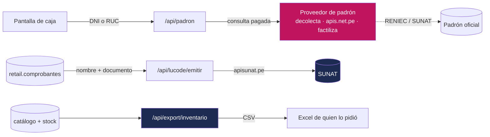

# Datos personales — qué guarda CAYLA de gente real

> **El problema, antes que la definición.** Un día alguien va a exportar un CSV para
> mandárselo al contador, y ese CSV va a llevar el DNI de 400 clientas dentro. Otro
> día una clienta va a escribir pidiendo que borren sus datos. Y otro día habrá que
> responderle a un fiscalizador qué guarda CAYLA de sus colaboradores y con qué
> permiso. Hoy no hay ningún archivo que responda las tres. **Este es ese archivo.**
>
> Alcance: los **dos sistemas**, porque comparten base de datos en producción (D-05).
> Lo que está escrito acá sale del SQL y del código, no de una política copiada de
> internet. Lo que todavía no se decidió está marcado ⏳ y nombrado, no disimulado
> (D-08).

---

## 1. Por qué esto no es un trámite

CAYLA guarda datos de **tres tipos de personas**, y no se parecen en nada:

| Quién | Dónde vive | Qué tan sensible | Quién lo mira hoy |
|---|---|---|---|
| **Clientas** | `retail.comprobantes`, `retail.proformas` | Medio: nombre y DNI | Cualquiera que opere esa sede, más cualquier Líder de equipo |
| **Colaboradores** | `public.personas` y 8 tablas más de Dynamic | **Alto**: DNI, sueldo, cuenta bancaria, salud, disciplina | Admin y Líder de equipo de Dynamic; cada quien ve lo suyo |
| **Proveedores** | `retail.proveedores` | Medio: RUC, cuenta bancaria, CCI, celular de Yape/Plin, titular de la cuenta, teléfono | **Cualquiera con cuenta** (D-27, decisión consciente) |

La diferencia importa. Perder el DNI de una clienta es feo. **Perder la planilla
entera —nombre, DNI, sueldo y número de cuenta de cada integrante— es otra categoría
de problema**, y está en la misma base de datos, a un `select` de distancia si alguien
se equivoca al dar un permiso.

---

## 2. La ley, en llano

**Ley N.º 29733, Ley de Protección de Datos Personales del Perú**, y su reglamento
(**D.S. 003-2013-JUS**). La autoridad es la **Autoridad Nacional de Protección de
Datos Personales**, dentro del Ministerio de Justicia.

No hace falta leerla entera. Obliga a cuatro cosas, y las cuatro se traducen a
decisiones de base de datos:

**1 · Consentimiento.** Para tratar el dato de una persona hay que tener su permiso —
salvo cuando una ley obliga a guardarlo igual. *Traducción a CAYLA:* el DNI que va en
una boleta **no necesita consentimiento**, porque SUNAT obliga a consignarlo. El
teléfono de esa misma clienta guardado "para avisarle de la campaña nueva" **sí**. Ese
segundo caso todavía no existe en la base, y aparece recién con el programa de
fidelización (D-48): **la mecánica del programa se diseña antes de escribir código, y
el consentimiento es parte del diseño, no un cartelito al final.**

**2 · Finalidad.** El dato se usa **para lo que se pidió**, y no para otra cosa. Se
recolecta el DNI para emitir el comprobante; usarlo después para armar una lista de
marketing es otra finalidad y necesita su propio permiso.

**3 · Proporcionalidad.** No se guarda más de lo necesario, ni por más tiempo del
necesario. Es el punto donde CAYLA está más floja: hoy **nada caduca** (ver §8).

**4 · Los derechos de la persona (ARCO).** Cualquiera puede pedir:

| Derecho | Qué pide | Qué implica en la base |
|---|---|---|
| **Acceso** | "¿Qué tienen de mí?" | Poder listar sus filas. Hoy se hace a mano, con SQL |
| **Rectificación** | "Mi nombre está mal escrito" | Corregir. En un comprobante ya emitido, no se edita: ver §7 |
| **Supresión / cancelación** | "Bórrenlo" | La pregunta difícil. §7 entera |
| **Oposición** | "No me manden más" | Todavía no hay a qué oponerse: no hay campañas |

**Y una obligación más, administrativa:** quien trata datos personales debe
**inscribir sus bancos de datos** ante la autoridad. ⏳ **Nadie sabe si CAYLA lo hizo.**
Ver §9.

---

## 3. Inventario — clientas (retail)

### `retail.comprobantes` — el único lugar donde retail guarda a una clienta

| Dato | Columna | Qué es | Quién lo ve hoy | Para qué se usa | Cuánto debería guardarse |
|---|---|---|---|---|---|
| Tipo de documento | `cliente_tipo_doc` | `dni`, `ruc` o `sin_documento` (por defecto) | Quien opere la sede **o** cualquier Líder de equipo | Decide si la ley permite boleta o exige factura | Lo mismo que el comprobante |
| Número de documento | `cliente_num_doc` | DNI de la clienta o RUC de la empresa | Igual | Obligatorio en la factura; SUNAT lo exige | **5 años** (propuesta, §8) |
| Nombre | `cliente_nombre` | Nombre o razón social | Igual | Se imprime en el comprobante | **5 años** (propuesta, §8) |

**El candado legal ya está en la base:** `comprobantes_factura_requiere_ruc` impide
guardar una factura sin RUC. Y `comprobantes_cliente_tipo_doc_check` solo acepta esos
tres valores — no se puede meter un pasaporte o un carné de extranjería aunque la
clienta lo traiga. Eso es un hueco real de negocio, no una virtud.

**Quién lo ve, exactamente:** una sola política, y es de lectura.

```sql
comprobantes_select (SELECT): retail.es_lider() or retail.puede_operar_sede(sede_id)
```

Lo que **no** hay es política de `insert`, `update` ni `delete`. Eso no es un olvido:
la única forma de escribir un comprobante es llamando a `emitir_comprobante`, que corre
como dueño. **Nadie puede editar el nombre de una clienta con un `update` suelto desde
la aplicación.** Es la misma idea de la frase 6 del mapa: se escribe por una sola puerta.

### `retail.proformas` — la cotización que todavía no es venta

| Dato | Columna | Quién lo ve hoy | Cuánto debería guardarse |
|---|---|---|---|
| Nombre | `cliente_nombre` | Igual que comprobantes | **La proforma vence** (`vence_at`). El dato personal debería irse con ella: propuesta, 12 meses |
| Documento | `cliente_num_doc` | Igual | Igual |

Una proforma **no es un documento fiscal**. Nada obliga a conservarla. Es el lugar
más fácil para empezar a borrar de verdad — y hoy tiene 0 filas en producción, así que
la regla se puede fijar antes de que duela.

### Lo que parece dato personal y no lo es

**`retail.ventas.token_cliente`** — un `uuid` que genera el navegador para que un
reintento no cobre dos veces (ADR-0032, ADR-0033). Identifica **la operación**, no a la
persona. No hay que tratarlo como dato personal, y marcarlo como tal solo lograría que
nadie le crea al resto de la lista.

**`retail.configuracion_empresa`** (`ruc`, `razon_social`, `email`) y
**`retail.sede_datos_fiscales`** (`direccion`, `telefono`, `ubigeo`) — son datos de
**CAYLA**, la empresa. Una persona jurídica no tiene datos personales. Que sean
legibles por cualquier cuenta autenticada está bien.

---

## 4. Inventario — proveedores (retail)

`retail.proveedores`, 4 filas en producción hoy (la verificación del 2026-09-19 para ADR-0134 encontró 2).

| Dato | Columna | Quién lo ve hoy | Nota |
|---|---|---|---|
| Razón social o nombre | `nombre` | **Cualquiera con cuenta** | Si el proveedor es persona natural con negocio, su nombre **sí** es dato personal |
| RUC | `ruc` | Cualquiera con cuenta | Un RUC de 10 dígitos que empieza en `10` **contiene el DNI de esa persona** |
| Persona de contacto | `contacto` | Cualquiera con cuenta | Nombre de una persona real de otra empresa |
| Teléfono | `telefono` | Cualquiera con cuenta | Casi siempre el celular personal del contacto |
| Banco y cuenta | `banco`, `cuenta_bancaria` | Cualquiera con cuenta | **Dato de un tercero, no de CAYLA** |
| CCI (interbancario) | `cci` | Cualquiera con cuenta | Desde 2026-09-19 (ADR-0134). **Dato de un tercero**; 20 dígitos, solo números. En una persona natural identifica una cuenta a su nombre |
| Celular de Yape/Plin y qué app | `celular_billetera`, `billeteras` | Cualquiera con cuenta | Desde 2026-09-19 (ADR-0134). Es un celular personal **distinto** del `telefono` (WhatsApp); 9 dígitos, sin +51 |
| Titular de la cuenta | `titular_cuenta` | Cualquiera con cuenta | Desde 2026-09-19 (ADR-0134). El nombre que muestra el banco/Yape; en una persona natural es su nombre |
| Dirección | `direccion` | Cualquiera con cuenta | |

```sql
proveedores_select (SELECT): auth.role() = 'authenticated'
proveedores_write_lider (ALL): retail.es_lider()
```

**Esto es una decisión de Felipe, no un descuido: D-27 dice que se dejan visibles, por
transparencia.** Queda escrita la única nota que la acompaña, y se repite acá porque es
el corazón de este capítulo: **la cuenta bancaria del proveedor es dato de un tercero,
no de CAYLA.** CAYLA la custodia; no es dueña de ella. Si mañana esa lista se filtra, el
perjudicado es el proveedor, y el responsable ante la ley es CAYLA.

**2026-09-19 (ADR-0134):** esa misma regla vale ahora para `cci`, `celular_billetera`, `billeteras` y `titular_cuenta`, que
nacieron con la misma lectura que `banco`/`cuenta_bancaria`. La tarjeta de la pantalla los muestra enmascarados y solo los
destapa con «Ver completos», pero eso es interfaz: la API los devuelve completos a cualquier sesión. Felipe decidió que la
restricción por rol de las cinco columnas de pago se resuelve **al final del proyecto**, todas juntas. Hoy hay 2 proveedores y
ninguna cuenta cargada, así que todavía no hay datos personales nuevos que proteger; conviene cerrarlo antes de cargarlas.

---

## 5. Inventario — colaboradores

### Lo que retail ve: una ventana de 7 columnas

**`retail.personas` NO es una tabla. Es una vista** sobre `public.personas` (la tabla
de Dynamic). Lo mismo `retail.sedes`. Hay llaves foráneas reales cruzando de `retail.*`
hacia `public.personas` y `public.sedes`.

La vista expone exactamente esto:

```sql
select id, auth_user_id,
       (nombres || ' ') || coalesce(apellidos, '') as nombre,
       sede_base_id as sede_id, rol::text as rol, email, estado
from personas p;
```

**Siete columnas de treinta y nueve.** No pasa `documento`, no pasa `pin_hash`, no pasa
`sueldo_base_legal`, no pasa `regimen_pension`. Eso es un cortafuegos, y está bien
puesto: quien entra al sistema de tiendas **no puede llegar al sueldo de nadie ni por
error ni queriendo.**

⚠️ **Por qué esto se hizo así, y por qué hay que cuidarlo:** los permisos por fila de
Postgres filtran **filas, no columnas**. Un permiso de lectura sobre `personas` da
acceso a *toda la fila* de las personas que puedas ver — DNI y sueldo incluidos. Dynamic
ya tropezó con eso: la vista `terminal_roster` existe justamente porque, mientras el
terminal de marcación leía `personas` directo, su token alcanzaba el DNI y la
remuneración. **La lección: para limitar columnas se usa una vista, nunca una policy.**

### Lo que Dynamic guarda de verdad: mucho más, y mucho más delicado

**`public.personas`** — 39 columnas. Las que identifican o exponen:

| Dato | Columna | Quién lo ve hoy | Para qué |
|---|---|---|---|
| Nombres y apellidos | `nombres`, `apellidos` | Admin/Líder; cada quien lo suyo; supervisor de su sede | Identidad |
| **DNI** | `documento` | Igual | T-Registro, PLAME, contratos. Índice único parcial |
| Correo | `email` | Igual | Acceso al sistema. `UNIQUE` |
| **PIN de marcación** | `pin_hash` | Igual, **más el terminal** vía `terminal_roster` | Marcar entrada. Va **hasheado**, no en texto plano — correcto |
| **Sueldo** | `sueldo_base_legal` | Admin/Líder; la propia persona | Base de CTS, gratificación y vacaciones |
| Régimen de pensión | `regimen_pension` | Igual | Descuento de AFP/ONP |
| Retención de 4ta | `retencion_4ta`, `constancia_4ta_hasta` | Igual | Renta de cuarta categoría |
| Vínculo y cargo | `tipo_vinculo`, `cargo`, `personal_direccion` | Igual | Qué le corresponde por ley |
| Hijos | `con_hijos` | Igual | Asignación familiar |
| **Cese** | `fecha_cese`, `motivo_cese` | Igual | Liquidación. `motivo_cese` puede decir `despido` |

**`public.datos_personales`** — 21 columnas, y es la tabla más pesada de todo CAYLA:

`nombre_dni` · `fecha_nacimiento` · `estado_civil` · `direccion` · `celular` ·
**`entidad_bancaria`** · **`numero_cuenta`** · `grado_instruccion` · `hijos_menores` ·
**`foto_dni_url`** · `foto_personal_url` · `foto_profesional_url` ·
`emergencia_nombre` / `emergencia_vinculo` / `emergencia_telefono` ·
**`discapacidad`** · **`discapacidad_conadis`** · `cuspp`.

Tres cosas que hay que nombrar en voz alta:
- **`foto_dni_url`** es una copia del documento de identidad. No es "un dato": es *el*
  documento.
- **`discapacidad` y `discapacidad_conadis`** son **datos de salud**. La Ley 29733 los
  llama *datos sensibles* y los protege más fuerte que al resto.
- Los datos de contacto de emergencia son de **otra persona** que nunca habló con
  CAYLA, igual que la cuenta del proveedor.

Permisos: `dp_select_admin_lider`, `dp_select_propia`, `dp_select_supervisor`. Solo
lectura por política; se escribe por función. La fila cuelga de `personas` con
`ON DELETE CASCADE`.

**El resto del rastro de una persona en Dynamic**, tabla por tabla:

| Tabla | Qué guarda de la persona | Por qué es delicado |
|---|---|---|
| `derechohabientes` | Nombre, DNI y fecha de nacimiento de **su familia** | Terceros: cónyuge, hijos, padres. No firmaron nada con CAYLA |
| `ausencias` | Tipo, fechas, `motivo`, `doc_profesional`, `doc_colegiatura`, `doc_storage_path`, `subsidio_diario` | **Dato de salud.** El propio esquema ya lo dice: *"Solo lo ven admin y líder de DO: es dato de salud"* |
| `expediente_disciplinario` | `hechos` (jsonb), suspensiones, descargos, `entrega_testigo_nombre` | Historia disciplinaria. Y arrastra a un testigo, que es otro tercero |
| `marcajes` | Persona, sede, terminal, hora exacta, tipo | **Es un rastro de dónde estuvo y a qué hora**, día por día |
| `firmas_escaneadas` | La firma manuscrita, como imagen base64 (≤ 1 MB) | Se puede falsificar un documento con ella |
| `planilla_pagada_detalle`, `movimientos_planilla`, `liquidacion_pagada`, `asignaciones_salario`, `desembolsos_beneficios` | Cuánto cobró cada quien, congelado | El historial económico completo de una persona |
| `documentos_firmados`, `contratos_generados`, `documentos_acuses` | Sus contratos y acuses | |
| `push_tokens` | `expo_push_token`, `plataforma` | Identifica su teléfono personal |
| `terminales` | Qué Mac mini es cada terminal, `requiere_pin` | Contexto de las marcaciones |

**Sobre la huella dactilar: no existe.** Se buscó. El terminal identifica a la persona
con un **PIN hasheado** (`personas.pin_hash`, `terminales.requiere_pin`), no con
biometría. Eso es una buena noticia y hay que mantenerla: la huella sería **dato
sensible** bajo la Ley 29733, con obligaciones mucho más duras. El día que alguien
proponga un lector de huellas, esta línea es la que hay que releer primero.

### Dicho sin rodeos

**Los datos de Dynamic son más sensibles que los de retail, y no se parecen.** Lo peor
que puede salir de retail es el nombre y el DNI de una clienta que compró una blusa. De
Dynamic puede salir el sueldo, el número de cuenta, la foto del DNI, un descanso médico
y una carta de despido de la misma persona. **Misma base de datos, dos niveles de daño.**
Cualquier permiso nuevo que cruce de retail hacia `public.*` se revisa con esa vara, no
con la de retail.

---

## 6. Por dónde sale el dato de CAYLA

Un inventario sirve de poco si no dice dónde se escapa. Hay tres salidas reales:



**1 · La consulta de padrón (ADR-0008).** Cuando se tipea un DNI en caja, ese número
viaja a un proveedor externo (`api.decolecta.com`, `api.apis.net.pe` o
`api.factiliza.com`, según `PADRON_PROVEEDOR`) para traer el nombre. **CAYLA le está
contando a una empresa tercera que esa persona está comprando.** La ruta no guarda nada
propio y busca primero en los comprobantes ya emitidos antes de salir a internet — eso
reduce las consultas, no las elimina. Es una **transferencia de datos a un tercero** y
como tal debe estar nombrada en la política de privacidad que CAYLA todavía no tiene.

**2 · La emisión a SUNAT.** `/api/lucode/emitir` manda `clienteTipoDoc`,
`clienteNumDoc` y `clienteNombre` a `apisunat.pe` (sandbox o producción) y de ahí a
SUNAT. Esta salida **es obligatoria por ley** y no necesita consentimiento: es el caso
de excepción del punto 1 de §2.

**3 · El CSV de inventario.** Buena noticia, verificada leyendo la ruta:
`/api/export/inventario` exporta SKU, referencia, familia, categoría, talla, color,
marca, stock por sede, mínimo, precio — y el **costo solo si quien exporta es Líder de
equipo**. **Cero datos personales.** No hay hoy ningún export de ventas por clienta. El
día que se construya, esta sección es el checklist.

---

## 7. La pregunta difícil: una clienta pide que borren sus datos

Esta es la pregunta que este capítulo existe para responder, y tiene trampa.

### Por qué no se puede simplemente borrar

Tres cosas chocan de frente:

1. **`movimientos` es append-only.** El historial es la verdad y no se toca (D-21). Se
   va a poner el candado físico para que la base rechace borrar o editar (D-22).
2. **El comprobante es un documento fiscal.** Una boleta emitida ya fue transmitida a
   SUNAT. Tiene un correlativo consumido que no se recupera. Borrarla abre un hueco en
   una serie numerada, que es precisamente lo que una serie numerada existe para hacer
   imposible.
3. **Hay un plazo legal de conservación** de los libros y comprobantes que corre por
   delante del derecho de supresión. El Código Tributario obliga a conservar; la Ley
   29733 reconoce esa obligación como límite al borrado.

Si alguien "resuelve" el pedido con un `delete from comprobantes`, rompe las tres a la
vez y deja a CAYLA peor parada ante SUNAT que ante la autoridad de datos.

### La salida real: se anonimiza el dato personal, se conserva el documento

**No se borra el comprobante. Se le quita la persona de adentro.**

El comprobante tiene dos clases de contenido, y solo una es personal:

| Parte del comprobante | Qué es | Qué pasa en el borrado |
|---|---|---|
| `tipo`, `serie`, `numero`, `total`, `igv`, `items`, `estado` | **El documento fiscal.** Lo que SUNAT y el contador necesitan | **Intacto. No se toca nunca** |
| `cliente_nombre`, `cliente_num_doc`, `cliente_tipo_doc` | **La persona** | Se reemplaza |

La venta siguió existiendo. El monto sigue cuadrando. El correlativo sigue en su serie.
Lo único que desaparece es **quién la hizo**.

**Cómo debe verse cuando se construya** (diseño, todavía **no existe** — D-08):

```sql
-- Función propuesta: retail.anonimizar_clienta(p_num_doc text, p_motivo text)
-- Corre como dueño, la llama solo Admin, y deja rastro.
update retail.comprobantes
   set cliente_nombre   = 'CLIENTA ANONIMIZADA',
       cliente_num_doc  = null,
       cliente_tipo_doc = 'sin_documento'
 where cliente_num_doc = p_num_doc;

delete from retail.proformas where cliente_num_doc = p_num_doc;  -- no es documento fiscal
```

Cuatro reglas que esa función tiene que cumplir:

1. **Nunca toca `movimientos`, `ventas`, `items`, `total` ni el correlativo.** El
   inventario y la plata quedan idénticos. Si el estado de resultados cambia después de
   anonimizar, la función está mal escrita.
2. **`sin_documento` ya es un valor válido** del check `comprobantes_cliente_tipo_doc_check`.
   O sea: **la base ya acepta un comprobante sin clienta identificada.** No hay que
   cambiar el esquema para que esto funcione — que es la razón por la que esta salida es
   la correcta y no un parche.
3. **La factura es la excepción.** `comprobantes_factura_requiere_ruc` impide dejar una
   factura sin RUC, y hace bien: una factura sin receptor no es una factura. **Las
   facturas no se anonimizan** — y no hace falta, porque el RUC de una empresa no es
   dato personal. Solo cuando el receptor es persona natural con negocio (RUC que
   empieza en `10`) hay que resolverlo con el contador, caso por caso.
4. **Queda rastro.** Quién pidió el borrado, cuándo, quién lo ejecutó y sobre cuántas
   filas. Sin eso, CAYLA no puede probar que cumplió — y probar que cumpliste es la
   mitad de cumplir.

### La respuesta que se le da a la clienta

> "Quitamos tu nombre y tu documento de nuestros registros. La boleta en sí no la
> podemos eliminar: es un documento tributario que la ley nos obliga a conservar, ya
> está declarado ante SUNAT y no puede desaparecer de una serie numerada. Lo que queda
> es una boleta sin ninguna persona identificada en ella."

Es verdad, es completa, y es defendible ante las dos autoridades a la vez.

### Un colaborador no es lo mismo

Un integrante que se va **no se anonimiza**, y no es una falta: `fecha_cese`,
`motivo_cese`, contratos, boletas y liquidación tienen **plazo de conservación laboral
propio**, más largo, y CAYLA los necesita para defenderse si hay un reclamo años
después. El derecho de supresión cede ante esa obligación, igual que ante SUNAT. Lo que
sí corresponde revisar es todo lo que **ya no sirve para nada** después del cese:
`push_tokens` (su teléfono), `firmas_escaneadas` y `foto_personal_url`. Eso no hay
ninguna ley que obligue a guardarlo. ⏳ Sin decidir.

---

## 8. Cuánto tiempo se guarda — ⏳ nadie lo decidió todavía

**El estado real de hoy: nada caduca.** Por diseño, CAYLA no borra (principio 4 de
`CLAUDE.md`, D-21, D-22). Eso es **correcto** para `movimientos` y para el libro
contable, y es **una deuda** para los datos personales: el DNI de una clienta de hace
tres años sigue en la base porque nunca se tomó la decisión de sacarlo, no porque
alguien haya decidido conservarlo.

Propuesta para que Felipe decida contra algo concreto y no contra una hoja en blanco:

| Dato | Propuesta | De dónde sale el plazo |
|---|---|---|
| `comprobantes.cliente_*` | **5 años** desde la emisión, después anonimizar | Alineado con el plazo tributario de conservación |
| `proformas.cliente_*` | **12 meses** o al vencer, lo que pase primero | No es documento fiscal: nada obliga |
| Consulta de padrón | **No se guarda** | Ya es así (ADR-0008) |
| `proveedores` | Mientras esté `activo`, más 5 años | El vínculo comercial tiene su propio plazo |
| Colaborador cesado — planilla, contratos, boletas | Lo que mande el plazo laboral, **sin tocar** | Obligación legal |
| Colaborador cesado — `push_tokens`, `firmas_escaneadas`, fotos personales | **Al cese** | Ninguna ley obliga a conservarlos |

⏳ **Esto es una propuesta, no una decisión.** Ninguno de estos plazos está confirmado
con el contador ni con quien lleve la parte legal de CAYLA. **No se escribe código sobre
esta tabla hasta que Felipe la firme.**

---

## 9. Lo que Felipe todavía no decidió

Marcado aparte y sin disimular, porque este documento habla de lo que existe y lista
separado lo que falta (D-08).

| # | Qué falta decidir | Por qué importa | Quién puede responderlo |
|---|---|---|---|
| 1 | **Los plazos concretos de retención** (§8) | Sin plazo, "no borramos nada" es la política real, y es indefendible | Felipe, con el contador |
| 2 | **¿CAYLA inscribió su banco de datos ante la autoridad?** | Es obligación administrativa de la Ley 29733. La respuesta es sí o no, y hoy **nadie la sabe** | Felipe. Es un dato, no una decisión: hay que averiguarlo, como con los respaldos (D-29) |
| 3 | **Quién es el responsable del banco de datos** | La ley exige una persona identificable que responda | Felipe |
| 4 | **Consentimiento en el programa de fidelización** | D-48 dice que la mecánica se diseña **antes** de escribir código. El consentimiento es parte de esa mecánica | Felipe, al diseñar D-48 |
| 5 | **Qué se borra de un colaborador cesado** (§7) | Hoy no se borra nada, ni siquiera el token de su teléfono | Felipe + Dynamic |
| 6 | **Si el contador externo recibe datos personales, y bajo qué acuerdo** | Si los recibe, es un *encargado de tratamiento* y eso necesita un contrato | Felipe |

---

## 10. Huecos del sistema, hoy

**1 · No hay tabla de clientas.** Suena raro en un capítulo de datos personales, pero es
la verdad: retail no tiene una entidad "clienta". Solo hay nombre y documento pegados a
cada comprobante. La tabla nace con D-48, y **nace con el consentimiento y el plazo de
retención puestos desde el primer día** — no después.

**2 · Los cuatro niveles de permiso no existen todavía.** D-12 los fijó: **Admin, Líder
de equipo, Integrante, Solo lectura**. **Hoy retail solo conoce dos**: `es_lider()` y
todo lo demás (integrante). Dynamic maneja su propio vocabulario aparte, donde además
aparece `supervisor_sede` en sus políticas. Consecuencia directa sobre datos personales:
**"Solo lectura", el nivel pensado para el contador externo, no existe.** Si hoy hay que
darle acceso al contador, se le da una cuenta que puede más de lo que necesita. Y "puede
más de lo que necesita" es exactamente lo que la Ley 29733 llama desproporcionado.

**3 · Nadie registra quién leyó qué.** No hay bitácora de accesos ni de exportaciones.
Si mañana se filtra la lista de proveedores con sus cuentas bancarias, no hay forma de
saber quién la sacó ni cuándo. Con seis personas se vive con eso; conviene saber que es
una decisión y no una característica.

**4 · Un pedido de acceso o de borrado se atiende a mano.** Hoy es Felipe pegando SQL en
producción (D-11), que al menos deja rastro. La función de §7 convierte eso en una
operación con nombre, con motivo y repetible.

---

## 11. Las cinco reglas, para llevar

1. **Antes de exportar cualquier cosa, pregúntate si lleva una persona adentro.** Hoy el
   único export que existe no lleva. Que el próximo tampoco.
2. **Para limitar columnas se usa una vista, no una policy.** Los permisos por fila
   filtran filas. `retail.personas` y `terminal_roster` son los dos ejemplos buenos.
3. **Un comprobante nunca se borra. Se anonimiza.** El documento fiscal sobrevive; la
   persona sale.
4. **La cuenta bancaria del proveedor es de un tercero.** Visible por decisión
   consciente (D-27), no por descuido — y esa distinción hay que poder sostenerla.
5. **Un permiso nuevo que cruce de `retail.*` hacia `public.*` se mide con la vara de
   Dynamic, no con la de retail.** Del otro lado hay sueldos y datos de salud.

---

*Decisiones que gobiernan este archivo: **D-28** (se marca qué campo identifica a una
persona, cuánto se guarda y quién lo ve, con la Ley 29733 como marco) · **D-27** (costos,
márgenes y cuentas bancarias de proveedores quedan visibles: transparencia, y la cuenta
del proveedor es dato de un tercero) · **D-12** (los cuatro niveles de permiso, de los
que hoy existen dos) · **D-21** y **D-22** (el historial no se borra; los errores se
corrigen escribiendo lo contrario) · **D-48** (clientas y fidelización: el consentimiento
se diseña antes de escribir código) · **D-08** (lo que existe y lo que falta, siempre
separados) · **D-11** (solo Felipe pega SQL en producción, y queda anotado). ADR
relacionados: **0008** (consulta de padrón), **0005** y **0009** (emisión electrónica),
**0032** y **0033** (el token de venta es idempotencia, no identidad).*
