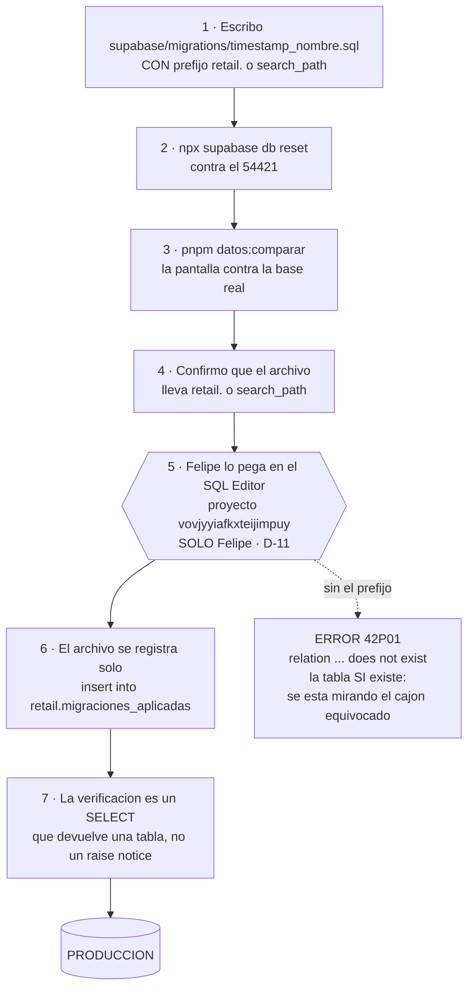

# Operación — los entornos, los respaldos, y cómo llega un cambio a las tiendas

> **El problema que resuelve este archivo:** cada vez que alguien escribe una
> pantalla, la prueba contra una base de datos que **no es** la que usan las
> tiendas. Cuando falla allá, el síntoma se lee como un bug del código. La
> causa real casi siempre es otra: la tienda no tiene esa columna, esa función
> o ese candado. Ya costó tiempo real cuatro veces.
>
> **Qué contesta:** dónde corre cada base · cómo se pega un cambio en las
> tiendas sin romper nada · quién puede hacerlo · qué respaldo hay · y qué
> hacer cuando algo se rompe, con los tres incidentes que ya pasaron.
>
> **Decisiones que lo gobiernan:** D-11, D-16, D-17, D-18, D-19, D-20, D-23,
> D-29. El acta manda: `DECISIONES-2026-09-12.md`.
>
> **Verificado el 2026-09-12** contra la base real de producción (proyecto
> `vovjyyiafkxteijimpuy`) y contra el SQL del repo. Los volcados están en
> `generado/retail_columnas.json`, `retail_constraints.json`,
> `retail_policies.json`, `retail_filas.json` y `funciones-produccion.txt`.
> Donde algo no se pudo verificar, lo dice con esas palabras.
>
> **Lo que NO está acá, a propósito:** la ficha campo por campo de
> `migraciones_aplicadas` y el ciclo de vida de una migración están en
> [`modulos/14-plataforma-y-esquema.md`](modulos/14-plataforma-y-esquema.md).
> La lista de qué hacer *antes* de cambiar el esquema, en
> [`07-GOBIERNO.md`](07-GOBIERNO.md) §3. El candado del historial, en el
> capítulo de historial y auditoría.

---

## 1. Los tres entornos: dos que existen y uno que Felipe aprobó y no existe

| | Tu máquina · **cayla-retail** | Tu máquina · **cayla-dynamic** | **Las tiendas** (producción) | **Ensayo** (D-18) |
|---|---|---|---|---|
| Qué es | Este repo | Otro repo, en `~/cayla-dynamic` | La base real | **No existe** |
| Puerto de la API | **54421** (`supabase/config.toml:10`) | **54321** — el default de Supabase | — | — |
| Postgres | 54422 (`config.toml:38`) | 54322 | dentro del proyecto de Dynamic | — |
| Dónde vive el cajón `retail` | schema `retail`, renombrado por `supabase/seed.sql:24` (ADR-0010) | **también tiene un `retail`** — una foto vieja de producción | schema `retail` dentro del proyecto `vovjyyiafkxteijimpuy` | — |
| Qué corre | `supabase/migrations/*.sql` con `npx supabase db reset` | nada nuestro | los mismos archivos **pegados a mano** + `supabase/unificacion/*.sql` | — |
| Tamaño | 44 tablas | irrelevante | **45 tablas + 2 vistas** en `retail`; el `public` del mismo proyecto es Dynamic entero: **69 tablas + 4 vistas** | — |

**Tres números que hay que corregir donde aparezcan.** `docs/datos/README.md`
y `docs/ARQUITECTURA.md` dicen **36** y **28** tablas; `CLAUDE.md` también dice
28, con fecha de verificación del 2026-09-03. Los tres están desactualizados.
Contados contra la base el 2026-09-12: **45 + 2 vistas** en `retail`
(`generado/retail_columnas.json` devuelve 47 objetos) y **69 + 4** en el
`public` de Dynamic.

### La trampa del 54321 — un fallo parcial que se disfraza de bug

`54321` es el puerto por defecto de Supabase, así que es al que uno apunta por
reflejo. Y apuntar al stack equivocado **no explota**: la copia local de
Dynamic también tiene un schema `retail`, así que catálogo, stock y ventas
responden con normalidad. Lo que falta son las tablas construidas *después* de
la unificación —`comprobantes`, `conteos`, `colores`, `stock_almacen`—, o sea
que **solo fallan Facturación y Conteo** mientras el resto anda bien.

Un fallo parcial es lo que más se confunde con un bug del código. Pasó **cuatro
veces** (`docs/BITACORA.md`, 2026-09-09). Las cuatro se resolvieron mirando, no
razonando. Ese mirar toma tres segundos:

```bash
pnpm local:donde
```

Dice qué stacks hay levantados, qué declara este repo, y **qué base está usando
de verdad el `:3000` que tienes corriendo** (`scripts/local/donde-estoy.mjs:5-28`).

**Y ya se coló en la documentación generada, que es lo grave.**
`generado/RPCS.md` declara en su cabecera `Origen: supabase_db_cayla-dynamic`
—el nombre del **contenedor Docker local** de Dynamic, no producción— y reporta
**23 funciones**. Producción tiene **56** (`generado/funciones-produccion.txt`,
y `00-MAPA.md` §6). La prueba de que es una foto vieja del stack equivocado
está en dos firmas:

| Función | `RPCS.md` dice | Producción tiene |
|---|---|---|
| `recibir_lote` | 6 parámetros, sin `p_orden_compra_id` | **7**, con `p_orden_compra_id` |
| `registrar_venta` | 4 parámetros, sin `p_token` | **5**, con `p_token` (la idempotencia de ADR-0032) |

Hasta que se regenere apuntando a producción, **`RPCS.md` no es la referencia
de las tiendas**: es la referencia del puerto equivocado. Usa
`funciones-produccion.txt` mientras tanto.

### Lo que tu máquina no puede probar, por diseño

Cuatro cosas. Las tres primeras se saben desde hace tiempo; la tercera está
**al revés de lo que se suponía**.

1. **`personas` y `sedes` son vistas allá, tablas acá.** En producción,
   `retail.personas` y `retail.sedes` son vistas `security_invoker` sobre
   `public.personas` / `public.sedes` de Dynamic
   (`supabase/unificacion/03_candados.sql:14-28`), y hay claves foráneas reales
   cruzando entre los dos schemas. Local las crea como tablas propias
   (`0001_init.sql:8` y `:25`), con otras columnas: local tiene `activo`,
   `created_at` y `updated_at`; producción tiene `email` y `estado`. Un filtro
   por `personas.activo` anda en tu máquina y se rompe en la tienda.

2. **El rol que producción considera mando, en local no se puede ni crear.**
   Local encierra el rol en `check (rol in ('lider','integrante'))`
   (`0001_init.sql:30`). Producción hereda el rol de Dynamic, que usa
   `admin` / `supervisor_sede` / `integrante`. Y el candado de allá pregunta
   literalmente por `admin`:

   ``sql
   -- supabase/unificacion/03_candados.sql:62-64
   create or replace function retail.es_lider()
   returns boolean language sql stable set search_path = public
   as $$ select coalesce(public.fn_rol_actual() = 'admin', false); $$;
   ``

   **La consecuencia operativa, hoy:** el rol `supervisor_sede` —que es lo que
   en la tienda se llama Líder de equipo— **no pasa el candado**. Toda RPC que
   empieza con `if not retail.es_lider() then raise` lo rechaza. En la
   práctica, **hoy solo Felipe puede dar de alta catálogo en las tiendas**. La
   escalera de cuatro niveles (Admin · Líder de equipo · Integrante · Solo
   lectura, D-12) está decidida y no construida: la base solo conoce dos. El
   detalle completo está en el módulo de identidad y acceso.

3. **El hueco del NULL está abierto en tu máquina y cerrado en la tienda.**
   Esto sorprende a todo el mundo, porque la intuición dice lo contrario.

   | | Local | Producción |
   |---|---|---|
   | Función | `fn_puede_operar_sede()` (`0012_rpc_valida_sede.sql:14-27`) | `retail.puede_operar_sede()` (`unificacion/03_candados.sql:79-81`) |
   | ¿Devuelve `false` cuando no sabe? | **No.** El término del medio, `p_sede_id = fn_sede_actual_persona()`, no lleva `coalesce` | **Sí.** Los dos términos llevan `coalesce(..., false)` |

   Por qué importa: si `fn_sede_actual_persona()` devuelve NULL —una sesión sin
   rol, un usuario sin fila en `personas`— la comparación da **NULL**, no
   `false`. Y el patrón que usan todas las RPC es
   `if not fn_puede_operar_sede(...) then raise exception …`. **`not NULL` no
   es `true`**, así que el `raise` no se dispara y la función sigue de largo:
   el candado se abre solo, exactamente para el caso que debía cerrar. (En una
   policy de RLS, NULL deniega — por eso el agujero es de las RPC y no se ve
   mirando RLS.)

   Producción ya está endurecida: `unificacion/36_candados_no_null.sql` lo
   declara *verificado contra la base el 2026-09-10*, y `03_candados.sql` quedó
   corregido para que un replay desde cero produzca el estado bueno. Local
   quedó atrás. **O sea que probar permisos en local no solo no significa nada:
   miente hacia el lado peligroso.**

4. **El volumen.** `taxonomia_categoria_atributos` tiene **16.527 filas** en
   producción y 0 en un local recién creado (`generado/retail_filas.json`). Una
   consulta que vuela con cero filas puede arrastrarse en la tienda.

### El entorno de ensayo (D-18): aprobado, no construido

Felipe aprobó un **tercer entorno** entre tu máquina y las tiendas: una copia
idéntica a la de producción donde probar antes de que un cambio lo vea una
clienta. Es lo que convierte el pegar-a-mano en algo seguro: hoy, pegar una
migración en producción es la **primera** vez que ese SQL toca una base con las
vistas de Dynamic, el rol `admin` de verdad y 16 mil filas. Con ensayo, es la
segunda.

**Ganas:** un cambio de esquema deja de estrenarse en la tienda, y las cuatro
cosas de la lista de arriba se pueden probar antes.
**Pagas:** dinero y un paso más por cambio. El dinero es un proyecto Supabase
adicional, o una rama de base de datos del proyecto `vovjyyiafkxteijimpuy` (las
ramas se cobran por hora encendida). **El número exacto se lee en el panel de
facturación del proyecto — este documento no lo inventa.**

**Cuándo montarlo:** después del paso 2 del plan de la §3. Antes de eso el
ensayo no se puede construir desde el repo, y habría que clonar producción a
mano — que es empezar la misma deuda otra vez con otro nombre.

---

## 2. Cómo se pega un cambio en las tiendas, paso a paso



### Paso 4, el que más cuesta acordarse

```sql
set search_path to retail, public;
```

**Por qué sin esto falla.** Producción de retail no vive en su propio proyecto
Supabase: vive **dentro** del proyecto de cayla-dynamic, en un cajón llamado
`retail`. El SQL Editor busca en `public` por defecto — y en ese proyecto
`public` es el schema **de Dynamic**, no el nuestro. El síntoma es
`relation "..." does not exist` (código 42P01), que se lee como "la tabla no
existe" cuando la tabla existe perfectamente. Solo se está mirando el cajón
equivocado.

Le pasó a la primera migración pegada después de la unificación (la `0030`, el
2026-09-03) y costó un round-trip antes de corregirlo (`CLAUDE.md`, §"Cómo
aplicar SQL a producción").

La alternativa —escribir `retail.` delante de cada tabla— también funciona, y es
lo que hace la mayoría de las migraciones. **Desde el corte V1→V2 (2026-09-12) el
prefijo o el `search_path` va en el archivo del repo**, no se agrega al pegar: el
Postgres local también vive en `retail`, así que el mismo archivo corre en local, en
CI y en producción. *(Corregido el 2026-09-26: este párrafo decía lo contrario
—«sin prefijo en el archivo, solo al pegar»—, que era el régimen anterior y ya rompió
una migración, #345 → #346.)*

**La segunda trampa del mismo prefijo, más barata pero igual de confusa:** si
el `insert` de registro se pega sin `retail.`, no escribe en nuestra tabla —
apunta a `public.migraciones_aplicadas`, que es la de Dynamic y tiene otras
columnas (`numero`, `nombre`, `aplicada_at`). Falla con "la columna `archivo`
no existe". Detalle completo en `modulos/14-plataforma-y-esquema.md`.

### Quién: solo Admin (Felipe), y queda anotado — D-11

Una sola mano toca la base real, y cada vez que lo hace se registra qué pegó y
cuándo. Los cuatro niveles (Admin · Líder de equipo · Integrante · Solo
lectura) están en `07-GOBIERNO.md` §2; ninguno salvo Admin pega SQL.

**No es burocracia: es el complemento del candado de `movimientos` (D-22).** La
aplicación no puede borrar ni editar un movimiento pasado — la base lo rechaza.
Pero Felipe sí puede, desde el SQL Editor. La regla hace que borrar historia sea
**imposible por accidente y posible a propósito, con rastro**. Ese rastro
necesita un lugar donde vivir, y ese lugar es la tabla de abajo.

La lista de qué hacer *antes* de cambiar el esquema —avisarle al pájaro del
módulo, escribir la nota de decisión, borrar la firma vieja, regenerar el
diccionario— está en `07-GOBIERNO.md` §3 y no se repite acá.

### El registro: `migraciones_aplicadas`

Existe en los dos lados y tiene tres columnas: `archivo` (llave primaria),
`aplicada_at` y `nota`. Tiene **RLS activado y cero políticas**, a propósito:
eso la deja invisible para la aplicación y visible solo para quien entra al SQL
Editor.

**La regla de una línea.** Todo archivo que se pegue en producción termina con:

```sql
insert into retail.migraciones_aplicadas (archivo)
  values ('0059_puente_sedes_y_configuracion.sql')
  on conflict (archivo) do nothing;
```

`do nothing` y no `do update`: si el archivo se vuelve a pegar sin saber que ya
corrió, la fecha que queda es la **primera** vez. Esa es toda la gracia de la
columna.

**Los dos niveles de certeza de `nota`, que ya están en uso:**

- *"verificado en vivo &lt;fecha&gt;"* — confirmado con una consulta directa contra
  producción (`pg_proc`, `information_schema`, o los datos mismos). Certeza real.
- *"según BACKLOG.md, no re-verificado hoy"* — la fecha viene de lo que escribió
  otra sesión. No es una medición de hoy. **De las 17 filas del backfill, 11 son
  de este tipo** (`unificacion/38_migraciones_aplicadas.sql:75-95`).

**Lo que hay que arreglarle, sin adornos:**

1. **Solo cubre un riel.** Las filas del backfill son todas de `unificacion/`.
   De las siete migraciones de `migrations/` que llegaron pegadas a mano
   (taxonomía, importaciones) **no hay ni una fila**.
2. **La convención se escribió y no se aplicó.** De los 37 archivos de
   `unificacion/`, el único que lleva la línea de auto-registro es el `38`, que
   es justamente el que la inventó. Los cuatro más recientes —`34`, `35`, `36`,
   `37`— **no tienen fila**, aunque sus propias cabeceras afirman que corrieron.
3. **Sobra una fila sin explicación.** El `38` documenta 17 filas; el volcado de
   producción reporta **18** (`generado/retail_filas.json`). Un
   `select * from retail.migraciones_aplicadas order by aplicada_at` en el SQL
   Editor lo resuelve en diez segundos, y vale la pena hacerlo.
4. **No registra lo que no es un archivo.** Cuando Felipe corrige un dato a mano
   —la salida de emergencia de D-22— eso no deja rastro en ningún lado.
   **Decidido, no construido:** filas con `archivo` tipo
   `'mano/2026-09-12-correccion-stock-TRU'` y el motivo en `nota`. No hace falta
   tabla nueva; alcanza con la convención de nombre.

### Paso 7: la verificación se escribe como `select`, no como `raise notice`

El SQL Editor no siempre muestra los `raise notice`, pero **una tabla de
resultados no se puede perder de vista**. El patrón ya está en uso:
`unificacion/36_candados_no_null.sql:56-65` y `38_migraciones_aplicadas.sql:98-106`
terminan con un `select` que devuelve una fila por cosa verificada y la palabra
`ok` o `REVISAR`.

---

## 3. Los dos rieles y su extinción (D-17)

Felipe decidió: **`supabase/unificacion/` es deuda a extinguir, con fecha.** No
es una carpeta más del proyecto.

**Por qué nació.** En julio de 2026 retail dejó de tener su propio proyecto
Supabase y se mudó dentro del proyecto de cayla-dynamic. Ese proyecto ya tenía
datos vivos de planilla y asistencia, así que no se podía hacer lo normal
—borrar y volver a crear desde las migraciones—: había que llegar con SQL
**aditivo**, pegado a mano, con `retail.` en cada tabla. Fue la decisión
correcta ese día. Los archivos `01` a `11` llevan la palabra "PASO" en la
cabecera y son literalmente los pasos de la mudanza. Del `12` en adelante ya no
es mudanza: es operación diaria, y la carpeta creció a 37 archivos sin que nadie
decidiera que así fuera.

### El hecho más grave, y no es el que se cuenta

La historia que circula es "local va adelante, hay que subir los cambios". **Es
al revés.** Producción tiene tablas y funciones vivas que **ningún archivo del
repo crea**. Reconstruir producción desde el repo —`npx supabase db reset` más
pegar los 37 de unificación— **produce una base distinta de la real**.

**Lo que produción tiene y ningún archivo crea, medido:**

| Qué | Filas hoy | Quién lo crea | Prueba |
|---|---|---|---|
| `retail.sede_meta` | 5 | **nadie** | `unificacion/12_almacen_interno.sql:37-40` lo admite: la creó *"el paso 02 que nunca quedó versionado en el repo"* |
| `retail.sede_datos_fiscales` | 1 | **nadie** | el mismo paso `02` perdido |
| `retail.configuracion_empresa` | 1 | **nadie** | el mismo paso `02` perdido |
| `catalogo_con_stock()` | — | **nadie** | el nombre no aparece en **ningún** `.sql` del repo. La app no la llama; solo salió en los tipos generados |
| `fn_normalizar_color(p_color_id, p_color)` | — | **nadie** | ídem: el nombre solo existe en `generado/funciones-produccion.txt` |

**Ojo con la confusión de nombres, que es de las que cuestan una tarde.**
`unificacion/01_sedes.sql:19` **sí** crea una tabla — pero se llama
`retail_sede_meta`, sin punto, y sin prefijo de schema, así que cae en el
`public` de Dynamic. **Esa tabla no existe en producción** (no aparece ni en
`generado/DICCIONARIO-RETAIL.md` ni en `DICCIONARIO-DYNAMIC.md`). La que existe
es `retail.sede_meta`, con punto, y viene del `02` perdido.

**Y cinco funciones más que el riel de producción no reproduce**, porque solo
están escritas en `supabase/migrations/` y llegaron pegadas a mano:
`importar_catalogo`, `deshacer_importacion`, `fn_codigo_tres_letras`,
`fn_familia_de_universal` y `fn_familia_color_de_universal`. Sumadas a las dos
huérfanas de arriba, son **siete funciones que `unificacion/` sola no produce**.

Por el mismo camino llegaron **siete tablas**: las cinco de taxonomía
(`taxonomia_versiones`, `taxonomia_categorias`, `taxonomia_atributos`,
`taxonomia_valores`, `taxonomia_categoria_atributos`), más `importaciones` y
`producto_atributos`. La prueba dura: las policies
`taxonomia_categorias_select`, `importaciones_select` y
`producto_atributos_select` están vivas en producción y solo están escritas en
`supabase/migrations/0052_taxonomia_universal.sql` y `0056_importar_catalogo.sql`.

> **Corrección al BACKLOG.** `docs/BACKLOG.md:82` dice *"(`0052` no está
> aplicada allá)"* y `:87-88` propone *"aplicar `0052` en producción"*. **Es
> falso.** Lo desmiente el propio `BACKLOG.md:64-65` —*"`0052` + seed + `0056`
> ya están en producción, Felipe los pegó el 11-sep"*— y lo desmienten los
> datos: `taxonomia_categoria_atributos` tiene **16.527 filas** vivas. Esas dos
> líneas del backlog hay que corregirlas: mandan a alguien a pegar algo que ya
> está pegado.

**Lo que hoy NO es un problema, y conviene decirlo:** producción tiene **56
funciones y ni un solo nombre repetido** (`generado/funciones-produccion.txt`).
No hay firmas duplicadas vivas. Eso lo cerró ADR-0026 y se mantiene.

### El plan para volver a un solo camino

Cinco pasos. Las fechas son una propuesta de este documento, no un compromiso ya
tomado — se confirman en `docs/BACKLOG.md`.

**Paso 1 — Congelar el riel viejo. Desde ya.** Ningún archivo nuevo entra a
`supabase/unificacion/`. Todo cambio de esquema nace **solo** en
`supabase/migrations/`, y se aplica a producción con el procedimiento de la §2.
*Ganas:* desde hoy no se crea deuda nueva. *Pagas:* hay que acordarse del
`search_path`, y la revisión de cada migración tiene que confirmar que no asume
`public`.

**Paso 2 — Rescatar el `02` perdido. Antes del 30-sep-2026.** Escribir
`supabase/migrations/0059_puente_sedes_y_configuracion.sql` que cree `sede_meta`,
`sede_datos_fiscales` y `configuracion_empresa` con `create table if not exists`,
copiando la forma **exacta** desde producción (las columnas ya están volcadas en
`generado/retail_columnas.json`; los candados, en `retail_constraints.json`). Es
aditivo, no toca ni una fila, y hace que `db reset` deje de mentir. **Sin este
paso ninguno de los demás sirve**, porque seguiría sin haber una copia completa
del sistema en ninguna parte — y el entorno de ensayo (D-18) no se podría
construir.

**Paso 3 — Traer o retirar las dos funciones huérfanas. Con el paso 2.**
`catalogo_con_stock()` y `fn_normalizar_color()` existen en producción y en
ningún archivo. Para cada una, dos salidas y hay que elegir una: escribirla en
`migrations/` trayendo el cuerpo desde la base con `pg_get_functiondef` —nunca
transcrito a ojo, que un arreglo copiado a ojo es un arreglo nuevo— o borrarla
en producción. Antes de borrar `catalogo_con_stock`, mirar si Dynamic la llama
desde su lado.

**Paso 4 — Cerrar las divergencias que quedan dentro de las tablas. Antes del
15-oct-2026.** En orden de daño:

| # | Qué se cierra | Dónde |
|---|---|---|
| 1 | Los tres candados de `asiento_lineas` (`debe >= 0`, `haber >= 0`, `linea_debe_xor_haber`) y el `check` de `asientos.origen` | producción |
| 2 | El `coalesce` que le falta a `fn_puede_operar_sede` (§1, punto 3) | **local** |
| 3 | `CORP` → `CCO` en `sedes_codigo_check`, y borrar la sede inventada por `0020_contabilidad_cimientos.sql:26` (D-20) | local |
| 4 | Vocabulario de rol unificado a los cuatro niveles (D-12) | los dos |
| 5 | Renombrar `fn_es_lider` / `fn_sede_actual_persona` / `fn_puede_operar_sede` a los nombres de producción | local |
| 6 | `registrar_gasto` a 7 parámetros, para que la pantalla deje de fallar | **producción** |
| 7 | `registrar_produccion` a 16 y `productos.material`; `set_etapa_produccion` a las 6 etapas | local |
| 8 | `lotes.orden_produccion_id` — decidir si vive o se borra (ADR-0004), y arreglar `recibir_lote` | los dos |

**Paso 5 — Que el local se parezca de verdad, y borrar la carpeta. Antes del
31-oct-2026.** Extender `supabase/seed.sql` para que, después del renombre a
`retail`, cree en local las **mismas dos vistas** `personas` y `sedes` (con
`email` y `estado`, sin `created_at`) sobre tablas de mentira, y las **mismas
tres funciones** `es_lider()`, `mi_sede()`, `puede_operar_sede()`. Ese día
`supabase/unificacion/` se elimina del repo y queda en su lugar un `LEEME.md` de
dos párrafos: qué fue, por qué existió, y que su historia completa está en
`git log`.
*Ganas:* una pantalla que corre en local corre en la tienda, y probar permisos
vuelve a significar algo. *Pagas:* el seed local se vuelve más largo y hay que
mantenerlo cuando Dynamic cambie sus columnas — que es exactamente el trabajo
que hoy se paga en horas de debug.

---

## 4. Respaldos (D-29) — lo que se sabe y lo que no se pudo verificar

Felipe decidió: **hay que averiguarlo y escribirlo con el número real.** Esta
sección está escrita para que ese número tenga dónde entrar, y para que nadie
confunda "no lo sé" con "no hay".

### Lo que SÍ está verificado

**El código tiene respaldo.** Está en GitHub y desplegado por Vercel desde el
repo (`docs/BACKLOG.md:1540`, `docs/BITACORA.md:769-778`). Antes de eso vivía
solo en la Mac de Felipe.

**Los datos no tienen ninguna copia que conste en el repo.** Y hay datos que no
se reconstruyen desde SQL: `movimientos` (28 filas, la única fuente de verdad
del inventario), `activos_fijos` (39 filas, el único dato financiero real
cargado), y la taxonomía entera (16.527 + 10.216 + 1.849 + 993 filas). Ninguna
migración las crea: son datos, no esquema.

### Lo que NO se pudo verificar — tres preguntas abiertas

> ⚠️ **Ninguna de estas tres tiene respuesta hoy.** No están respondidas en
> `docs/`, ni en `supabase/`, ni en ningún archivo del repo. Escribir una
> respuesta sin mirar el panel sería inventarla, que es peor que dejarla en
> blanco.

| # | Pregunta | Respuesta | Fecha en que se miró |
|---|---|---|---|
| 1 | ¿Hay respaldo automático de la base de producción? | _(por averiguar)_ | |
| 2 | ¿Cada cuánto corre y cuánto tiempo se guarda? | _(por averiguar)_ | |
| 3 | ¿Alguien probó restaurarlo alguna vez? | _(por averiguar)_ | |

### Dónde mirarlo, exactamente

**Panel de Supabase → proyecto `cayla-dynamic` (`vovjyyiafkxteijimpuy`) →
`Database` → `Backups`.** Ahí sale si hay respaldo diario, qué retención tiene y
el botón de restaurar. La retención depende del plan contratado, que se lee en
`Settings` → `Billing`. **Ninguno de los dos números se inventa acá:** se
copian de la pantalla, con la fecha en que se miraron, a la tabla de arriba.

### Lo que hay que saber ANTES de necesitarlo

**El schema `retail` vive dentro del proyecto de Dynamic.** Un restore de ese
proyecto restaura **los dos sistemas a la vez**: retail y planilla y asistencia.
No se puede restaurar solo retail sin tocar Dynamic. Eso cambia por completo la
conversación de un incidente —hay que avisarle a quien lleva el sistema de
personal antes de restaurar nada— y es exactamente el tipo de cosa que no se
descubre en el momento de necesitarla.

Es, además, el argumento más fuerte a favor de la decisión D-50 (el día que otra
marca use el sistema, cada marca su propia base): dos sistemas en un proyecto
significan un solo botón de restaurar para los dos.

### Lo que falta construir

**Un restore de prueba, trimestral, anotado.** `07-GOBIERNO.md` §7 ya lo asigna
a Gorrión con esa periodicidad. Hoy no consta que se haya hecho nunca — y para
el caso, "no se hizo" y "nadie lo escribió" dan lo mismo: un respaldo que nadie
probó restaurar no es un respaldo, es una intención.

La prueba mínima que sirve: restaurar a una rama o a un proyecto aparte,
**nunca sobre producción**, y verificar tres cosas — que `movimientos` trae sus
filas, que `retail.personas` y `retail.sedes` siguen resolviendo contra
`public`, y que `pnpm migraciones:verificar` da el mismo inventario. Si las
vistas puente no resuelven, el restore está incompleto aunque las tablas estén.

---

## 5. Cerrar el mes con llave (D-23) — decidido, no existe

**Decidido:** un mes dado por bueno no acepta escrituras sin abrirlo a propósito
y dejando rastro.

**Lo que hay hoy:** nada. Verificado — no existe tabla `periodos_contables` ni
función `cerrar_periodo` / `cerrar_mes` en **ninguno de los dos rieles**
(`modulos/12-contabilidad.md:446-450`). Se puede asentar en enero desde
septiembre, y los estados financieros que Felipe ya miró y dio por buenos
cambian sin avisar.

**Por qué está en el capítulo de operación y no solo en el de contabilidad.**
El candado de `movimientos` (D-22) protege los **hechos de mercadería**; cerrar
el mes protege los **números que ya se dieron por buenos**. Son dos mitades de
lo mismo, y una sin la otra deja la puerta abierta. Y las dos se apoyan en la
misma regla de operación, que ya existe y funciona: **imposible por accidente,
posible a propósito y con rastro.**

**Cómo se opera el día que exista:** reabrir un mes cerrado es un acto de D-11
—lo hace Felipe, no la aplicación— exige motivo escrito, y deja su fila en
`migraciones_aplicadas` con la convención `mano/`. No hace falta inventar una
filosofía nueva para el dinero: es la de `movimientos` aplicada a las fechas.

El diseño de la tabla y de las funciones vive en `modulos/12-contabilidad.md`;
las cinco puertas que hoy quedan abiertas —dos funciones que aceptan cualquier
fecha y tres tablas que se editan directo— están listadas ahí y en el capítulo
de historial.

---

## 6. Runbook: los tres incidentes que ya pasaron

No son hipótesis. Los tres ocurrieron, tienen fecha y dejaron código. Cada uno
con lo mismo: qué se vio, por qué pasó, cómo se arregló, y cómo se evita.

### 6.1 Drift de firma — la pantalla que falla solo en la tienda

**Síntoma A (local, 2026-09-09).** Un ajuste, una merma o un traslado normal
fallaban; una devolución al almacén funcionaba. El error, cazado con `explain`
—que no ejecuta nada—:

```
explain select retail.registrar_movimiento(p_variante_id => …, p_sede_id => …,
                                           p_tipo => …, p_cantidad => …);
→ ERROR: function retail.registrar_movimiento(...) is not unique
```

**Síntoma B (producción, hoy mismo).** No hay error de sintaxis: la pantalla
dice "no se pudo guardar", **siempre, no a veces**. Dos pantallas están así:

| Pantalla | Qué manda de más | Qué acepta producción |
|---|---|---|
| `apps/web/components/RegistrarGastoModal.tsx:57` | `p_metodo_pago` | `registrar_gasto` acepta **6** parámetros allá |
| `apps/web/components/RecibirLoteForm.tsx:431` | `p_orden_produccion_id` | `recibir_lote` acepta **7** parámetros allá |

(`generado/DRIFT.md`.) Registrar un gasto y recibir mercadería ligada a una
producción fallan en las tres tiendas y en el Taller.

**Causa.** Dos, encadenadas. Primera: `create or replace` con un parámetro nuevo
**no reemplaza nada** — crea una segunda función, y una llamada que solo nombra
los parámetros comunes no resuelve (ADR-0009, ADR-0026). Segunda, la que
explica por qué nadie lo vio: `pnpm typecheck` compara el código contra
`packages/database/src/types.ts`, **no contra la base**, y ese archivo lleva
parches a mano porque ningún entorno tiene el esquema completo. El typecheck
está en verde mientras dos pantallas fallan.

**Cómo se arregló.** `0049_una_sola_firma_por_funcion.sql` y su gemelo
`unificacion/31` borran la firma vieja con `drop function … (tipos explícitos)`.
Medido hoy: producción tiene 56 funciones y ni un nombre repetido.

**Cómo se evita — dos reglas.**

1. **Toda migración que le cambie los parámetros a una función existente lleva
   su `drop function` con los tipos explícitos, antes del `create`.** Está en
   `07-GOBIERNO.md` §3, paso 5, y en ADR-0026.
2. **`pnpm datos:comparar` antes de dar por buena una pantalla.** Es la única
   herramienta que compara **la pantalla contra la base real** — `typecheck`
   compara contra tipos viejos y `migraciones:verificar` compara el repo contra
   la base, pero ninguno de los dos mira esa tercera pareja. Sale con error si
   encuentra una pantalla rota, así que sirve como la alarma automática de D-19.

**Y una trampa que sigue armada.**
`unificacion/31_una_sola_firma_por_funcion.sql:72` solo borra la firma vieja de
`registrar_produccion` *si tiene 15 argumentos*. Producción tiene **16**. Si
alguien pega ese archivo hoy, no limpia nada y deja dos versiones conviviendo —
el bug de ADR-0009 otra vez. Según la bitácora ese archivo nunca se pegó en
producción, así que es un riesgo **dormido, no un daño hecho**. Antes de pegarlo,
corregir la condición.

### 6.2 Correlativo quemado — B004-000001

**Síntoma.** Ninguno visible ese día. El daño aparecería después: SUNAT
rechazando por duplicado toda la serie B004 de Trujillo.

**Qué pasó (2026-09-05).** En la primera prueba real con Lucode se transmitió a
**producción** la boleta `B004-000001` de Trujillo. Ese número ya existe ante
SUNAT, por una venta que nunca ocurrió (`docs/BITACORA.md:370-378`).

**Causa.** Dos cosas a la vez. Una serie siempre nacía en 1 y no había forma de
continuar una ya usada. Y la prueba se hizo contra el emisor real, no contra el
sandbox — que es lo único que consume numeración de verdad.

**Cómo se arregló.** `0039_serie_numero_inicial.sql` y su gemelo
`unificacion/22_serie_numero_inicial.sql` permiten fijar el próximo correlativo
al registrar la serie:

```sql
select retail.registrar_serie_comprobante('<sede_id_TRU>', 'boleta', 'B004', 2);
```

Y la boleta hay que darla de baja desde el panel de Lucode — resumen diario de
bajas, plazo de 7 días. La numeración quedó fijada con Felipe, una serie por
tienda para saber de dónde vino cada venta: **TRU B004/F004 · AQP B005/F005 ·
LIM B006/F006**.

**Cómo se evita.** Probar en sandbox: `comprobantes.entorno` existe exactamente
para distinguirlo (ADR-0015). Y saber la regla de fondo, que es la única de este
archivo sin vuelta atrás: **un correlativo quemado no se recupera.** Es el único
recurso del sistema que no tiene deshacer — ni una corrección de signo contrario,
ni un restore. El primer disparo de cualquier serie nueva contra el emisor real
quema el número 1, y hay que decidirlo a propósito.

De paso, un error de texto que se corrigió con esto: la pantalla decía "Serie
(la que dio SUNAT)". Falso — en facturación electrónica las series **las define
el emisor**, sin autorización; SUNAT solo manda el formato y que el correlativo
sea único y ascendente.

### 6.3 Recursión de RLS — "stack depth limit exceeded"

**Síntoma.** Consultar `activos_fijos` tumbaba la consulta con *stack depth
limit exceeded*. No era un error de permiso ni una pantalla en blanco: la base
se caía.

**Causa.** Un bucle. `fn_es_lider()` consulta `personas` → `personas` tiene una
policy que llama a `fn_es_lider()` → que vuelve a consultar `personas` → … hasta
que Postgres corta. Se manifestó al haber dos policies dependiendo de esas
funciones a la vez.

**Cómo se arregló.** `supabase/migrations/0023_rls_helpers_security_definer.sql`:
las tres funciones de identidad —`fn_es_lider`, `fn_sede_actual_persona`,
`fn_persona_actual`— pasan a `security definer`, así leen `personas` **sin
aplicar RLS** y el ciclo se rompe. Es seguro porque cada una lee solo la fila del
propio usuario (`where auth_user_id = auth.uid()`) y devuelve un booleano o una
sede, nunca datos de otros.

**Cómo se evita.** Una regla de diseño, corta: **ninguna policy puede llamar a
una función que consulta la misma tabla que esa policy protege**, salvo que la
función sea `security definer` y lea solo la fila del propio usuario.

**Lo que este incidente dejó abierto, y hay que saberlo.** La solución cambia el
problema de sitio: una función `security definer` **se salta las reglas por fila
enteras**. En producción hay 56 funciones y la gran mayoría corre como dueño. A
`movimientos` le falta `alter table movimientos force row level security`, así
que hoy una función definer nueva y descuidada puede borrar historia sin que
nada la frene. Eso se cubre en el capítulo de historial y auditoría (el candado
de D-22); acá basta con la consecuencia operativa: **toda RPC nueva valida sede
y rol por su cuenta, porque los candados de fila ya no la están mirando.**

---

## 7. Lo que este archivo deja abierto

| Qué falta | Dónde se decide |
|---|---|
| Las tres respuestas de respaldos, con la fecha en que se miró el panel | §4 — `Database > Backups` del proyecto `vovjyyiafkxteijimpuy` |
| El primer restore de prueba, y su periodicidad real | §4 y `07-GOBIERNO.md` §7 |
| El `02` perdido: `sede_meta`, `sede_datos_fiscales`, `configuracion_empresa` | §3, paso 2 |
| Decidir qué pasa con `catalogo_con_stock()` y `fn_normalizar_color()` | §3, paso 3 |
| Las dos pantallas rotas en las tiendas ahora mismo | §6.1 — `registrar_gasto` y `recibir_lote` |
| El `coalesce` que le falta a `fn_puede_operar_sede` en local | §1, punto 3 |
| Regenerar `RPCS.md` contra producción y no contra el contenedor local de Dynamic | §1 |
| La fila número 18 de `migraciones_aplicadas` que nadie documentó | §2 |
| Corregir `BACKLOG.md:82` y `:87-88`, que mandan a aplicar la `0052` ya aplicada | §3 |
| Corregir el número de tablas en `README.md`, `ARQUITECTURA.md` y `CLAUDE.md` (36 / 28 → **45 + 2 vistas**) | §1 |
| Costo real del entorno de ensayo | §1 — panel de facturación, no inventarlo |
| La tabla `periodos_contables` y sus funciones | §5 y `modulos/12-contabilidad.md` |
| Credencial de solo lectura para leer producción sin pegar SQL a mano | bloquea la alarma automática de D-19 y la v2 del generador |

---

*Decisiones que gobiernan este archivo: **D-11** (solo Felipe pega SQL en
producción, y queda anotado) · **D-16** (se describen las dos bases, lado a
lado) · **D-17** (`supabase/unificacion/` es deuda a extinguir, con fecha) ·
**D-18** (hace falta un entorno de ensayo) · **D-19** (la comparación es
automática y avisa solo cuando difieren) · **D-20** (la sede corporativa se
llama `CCO`) · **D-23** (el mes se cierra con llave) · **D-29** (los respaldos
se averiguan y se escriben con el número real). Se apoya además en **D-22** (el
candado del historial) y **D-12** (los cuatro niveles de permiso). El acta
manda: `DECISIONES-2026-09-12.md`.*
