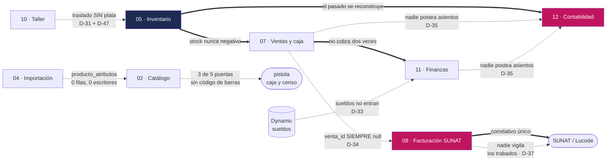

# Contratos — qué le promete cada módulo a los demás

> **Qué es esto:** los 14 módulos de CAYLA no se hablan por conversación, se hablan
> por **promesas**. Facturación cree que ventas le va a decir qué se vendió.
> Contabilidad cree que alguien le va a mandar asientos. Inteligencia cree que el
> catálogo tiene códigos. Esta página escribe esas promesas una por una, y dice
> **cuáles se cumplen hoy y cuáles no**.
>
> **Léelo antes de construir encima de otro módulo.** Es la diferencia entre apoyarte
> en una viga y apoyarte en un dibujo de una viga.

---

## El problema que resuelve esta página

Un sistema de 45 tablas no se rompe por una tabla mal hecha. Se rompe porque alguien
construyó la pantalla de devoluciones asumiendo que la boleta sabe de qué venta es —
y no lo sabe. La pantalla queda perfecta, pasa revisión, y el día que una clienta
devuelve una blusa en Arequipa no hay de dónde agarrarse.

Ese error no se ve leyendo ninguna tabla. Solo se ve mirando **la frontera** entre dos
módulos: lo que uno da por hecho y el otro nunca prometió.

`01-INVARIANTES.md` cubre el otro eje — lo que la base **impide**, dentro de una
tabla. Esta página cubre lo que **un módulo le debe a otro**, y son cosas distintas:
`comprobantes.venta_id` no viola ningún candado. Está vacía, nada más. Y por estar
vacía hay tres funciones del negocio que no se pueden construir.

---

## Cómo se lee un contrato

El vocabulario sale del propio repo: `apps/web/app/api/lucode/emitir/route.ts:5-14`
ya escribe su contrato así, en la cabecera del archivo. Se generaliza.

| Campo | Qué dice |
|---|---|
| **Quién promete** | El módulo dueño. Es quien tiene que arreglarlo si se rompe |
| **Qué promete** | Una frase. Lo que el resto puede dar por cierto |
| **Quién depende** | Los módulos que ya construyeron encima de esa promesa |
| **¿Se cumple?** | ✅ sí · ⚠️ sí, pero por costumbre · ❌ no |
| **Evidencia** | `archivo:línea`, nombre exacto de tabla, columna, candado o función |

**Los tres estados no son dos y medio.** Un ⚠️ es una promesa que hoy se cumple porque
nadie la ha roto todavía, no porque la base lo impida. Es exactamente la clase de cosa
que aguanta dos años y se cae un sábado.

---

# 1 · Los contratos que se cumplen

Primero lo que sí funciona, porque es lo que permite construir. Todos verificados
contra el esquema `retail` del proyecto de producción el **2026-09-12**.

## Los cinco grandes

### 1.1 · Inventario promete que el stock nunca es negativo

**Quién promete:** módulo 05 (🦅 Halcón). **Quién depende:** ventas, conteo,
producción, compras, inteligencia — todos.

**Qué promete:** ninguna sede puede quedar con −3 blusas, ni en el piso ni en el
almacén. Vender la última prenda dos veces es imposible, no improbable.

**¿Se cumple?** ✅ **Sí, con doble candado.** La regla de tabla
`stock_cantidad_no_negativa` y su gemela `stock_almacen_cantidad_no_negativa`
(`supabase/unificacion/27_ajuste_con_signo.sql:83-94`, las dos ya validadas contra los
datos reales), más una guardia dentro de `retail.fn_aplicar_movimiento` que bloquea la
fila con `for update` antes de restar
(`supabase/unificacion/07_funciones_operacion.sql:19-24`).

**Por qué la doble defensa importa:** la guardia da el mensaje que la vendedora
entiende (*"Stock insuficiente en sede X (hay 2, se pidió 3)"*). La regla de tabla
atrapa a todo lo demás — un script, el editor SQL, un agente de IA. Una sin la otra no
alcanza.

### 1.2 · Movimientos promete que se puede reconstruir el pasado

**Quién promete:** módulo 05. **Quién depende:** inventario, contabilidad,
inteligencia, conteo, y cualquier auditoría.

**Qué promete:** `retail.stock` y `retail.stock_almacen` son desechables. Si se
corrompen, se tiran y se reconstruyen enteros desde `retail.movimientos` con
`retail.recalcular_stock()`. El historial es la verdad; el stock es un resumen.

**¿Se cumple?** ⚠️ **Sí hoy, pero por omisión, no por candado.** Toda operación que
mueve mercadería pasa por `fn_aplicar_movimiento` y escribe su fila — verificado en
venta, traslado, ajuste, recepción de lote y cierre de producción. Lo que falta es el
candado físico: `retail.movimientos` **no tiene política de UPDATE ni de DELETE**, así
que la app no puede tocarla, pero nada frena a una función con permisos elevados ni al
editor SQL. El detalle completo está en `01-INVARIANTES.md` §2. **D-22 ordena cerrarlo.**

**El agujero conocido:** `retail.eliminar_produccion` sí hace `delete from producciones`
de verdad (`supabase/unificacion/09_funciones_produccion.sql:21-33`). El stock se
corrige aparte con `revertir_produccion_inventario`, que escribe movimientos de
compensación. O sea: el inventario queda bien, **la historia de producción no**.

### 1.3 · Caja promete que hay una sola caja abierta por sede

**Quién promete:** módulo 07 (🐦 Colibrí). **Quién depende:** ventas, finanzas
operativas, los tres números de Felipe (D-52).

**¿Se cumple?** ✅ Índice único parcial `cajas_sede_abierta_unique`. Sin él, el cierre
del día no cuadraría contra nada: las ventas caerían repartidas entre dos cajas.

### 1.4 · Ventas promete que un reintento sin red no cobra dos veces

**Quién promete:** módulo 07. **Quién depende:** la caja de las tres tiendas, todos los
días.

**Qué promete:** si se corta el internet mientras la cajera cobra y ella vuelve a
intentar, se cobra **una vez**. La segunda llamada devuelve la venta original.

**¿Se cumple?** ✅ `retail.registrar_venta(..., p_token)` más el índice único
`ventas_token_cliente_key`. La cola sin red vive en `apps/web/lib/ventas-offline.ts`,
indexada **por sede y no por caja** a propósito: una caja que se cierra antes de que
vuelva la red dejaba la venta huérfana para siempre. Es el contrato más redondo del
sistema y es también **D-49**, el filo competitivo que Felipe no quiere perder.

### 1.5 · Facturación promete que un correlativo nunca se repite

**Quién promete:** módulo 08 (🐦‍⬛ Cuervo). **Quién depende:** SUNAT, el contador, y
cualquiera que tenga que explicar dos boletas 0001-000123.

**¿Se cumple?** ✅ `retail.fn_reservar_numero_serie` bloquea la fila de la serie con
`for update` antes de incrementar
(`supabase/unificacion/17_facturacion_completa.sql:100-121`), y la regla de tabla
`comprobantes_tipo_serie_numero_key` lo remata. Dos cajas pidiendo número al mismo
segundo reciben números distintos.

## Los demás, en una tabla

| # | Quién promete | Qué promete | Quién depende | ¿Se cumple? | Evidencia |
|---|---|---|---|---|---|
| 1.6 | 06 · Conteo | Un censo no inventa: no hay dos conteos abiertos sobre el mismo lugar ni una prenda contada dos veces | Inventario | ✅ | `conteos_un_abierto_por_sede` (por **sede y ubicación**) · `conteo_lineas_conteo_id_variante_id_key` · `retail.previsualizar_cierre_conteo` corre antes de `cerrar_conteo` |
| 1.7 | 03 · Taxonomía | Hay **una sola** versión del vocabulario activa | Catálogo, importación | ✅ | `taxonomia_una_sola_activa` · 1.849 categorías, 993 atributos y 10.216 valores cargados en producción (`generado/retail_filas.json`) — **(borrado en el corte a V2 el 2026-09-12; se reconstruye después del censo)** |
| 1.8 | 02 · Catálogo | Una variante es única por (producto, talla, color); un color escrito de cinco formas es un solo color | Inventario, ventas, inteligencia | ✅ | `variantes_identidad_unica` · `colores_clave_unica` sobre `retail.fn_clave_texto(nombre)` — ADR-0024 |
| 1.9 | 12 · Contabilidad | Un asiento nunca queda descuadrado | El contador | ⚠️ | `asiento_lineas_cuadra` → `retail.fn_asiento_cuadra` **sí existe en producción**. Pero el candado de la línea individual (`linea_debe_xor_haber`) existe solo en local: una línea con `debe = −100` y `haber = −100` cuadra perfecto. Ver `01-INVARIANTES.md` §2 |
| 1.10 | 01 · Identidad | La sede es el candado: un Integrante de Arequipa opera Arequipa | Todos | ⚠️ | `retail.puede_operar_sede` en producción cierra el hueco del NULL con `coalesce(..., false)` en las dos ramas (`supabase/unificacion/03_candados.sql:76-79`). **En local el hueco sigue abierto** (`supabase/migrations/0012_rpc_valida_sede.sql:15-27`, sin `coalesce` en la comparación de sede). Al revés de lo que se suponía |
| 1.11 | 14 · Plataforma | Escribir pasa por una sola puerta: una RPC que hace todo o no hace nada | Todos | ⚠️ | 23 funciones en el esquema `retail` (`generado/RPCS.md`). La lista de excepciones —compras, proveedores, patrimonio, comparativo, ajustes de efectivo escriben directo— está módulo por módulo |

---

# 2 · Los siete contratos rotos

Este es el corazón de la página. Cada uno es una promesa que alguien ya está dando por
cierta y que hoy **no se cumple**. No son deseos: son acoplamientos que ya tienen
código encima.

---

## 2.1 · Ventas → Facturación: la boleta no sabe de qué venta es

> **El acoplamiento roto más caro del sistema, y el más barato de arreglar.**

**Quién promete:** módulo 07 (Ventas y caja).
**Qué promete:** cada venta queda pegada a su comprobante, y se puede cuadrar lo
vendido contra lo facturado.
**Quién depende:** facturación (08), contabilidad (12), devoluciones (D-43), clientas y
fidelización (D-48), y el primer número que Felipe mira (D-52a).

**¿Se cumple?** ❌ **No. La columna existe y está vacía en las 2 filas que hay.**

**La evidencia, en tres piezas:**

1. `retail.comprobantes.venta_id` **existe**, apunta a `retail.ventas(id)` y **acepta
   vacío** — `supabase/unificacion/17_facturacion_completa.sql:31`. Hasta tiene su
   índice: `:56`.
2. `retail.emitir_comprobante` **ya recibe** `p_venta_id` como sexto parámetro
   (`supabase/unificacion/17_facturacion_completa.sql:130`) y lo escribe tal cual
   (`:162-166`).
3. **Quien la llama no se lo pasa.** `apps/web/components/ComprobantesPanel.tsx:240-248`
   invoca `emitir_comprobante` con ocho parámetros, y `p_venta_id` no está entre ellos.
   El comentario dos líneas más arriba (`:236-237`) lo admite por escrito: *la
   desagregación por línea queda "para cuando esto se conecte a `ventas`"*.

**Qué se rompe por esto.** Tres cosas, y ninguna es cosmética:

- **No se puede cuadrar la caja contra SUNAT.** Son dos listas sueltas que se comparan
  a ojo. Con 2 ventas se nota; con 900 prendas censadas y tres tiendas vendiendo, no.
- **Las devoluciones no se pueden construir** (D-43). Una devolución tiene que
  agarrarse de una boleta concreta, y la boleta no sabe qué se vendió.
- **La clienta no se puede construir** (D-48). La clienta vive hoy como tres campos
  dentro del comprobante (`cliente_tipo_doc`, `cliente_num_doc`, `cliente_nombre`) y
  sin la unión no hay historial de compras al que colgarle un programa de puntos.

**Qué lo arregla — D-34, en tres pasos y en este orden:**

| Paso | Qué | Cuánto cuesta |
|---|---|---|
| 1 | Que `ComprobantesPanel.tsx` pase `p_venta_id` | Una línea |
| 2 | Rellenar las filas viejas | Son 2 |
| 3 | Volver `venta_id` obligatoria para boletas y facturas | Una migración. Las notas de crédito y débito se cuelgan de otro comprobante, no de una venta — ya tienen su propia regla `comprobantes_nota_requiere_original` |

---

## 2.2 · Sub-libros → Contabilidad: ninguna función postea un asiento

**Quién promete:** todos los módulos que mueven plata — ventas (07), finanzas
operativas (11), compras (09), producción (10).
**Qué promete:** cada hecho del negocio deja su asiento en el libro diario, solo.
**Quién depende:** módulo 12 (🦉 Urraca) y el contador externo.

**¿Se cumple?** ❌ **No, y no a medias: no existe ni una regla automática.**

**La evidencia, cruda:**

- `retail.asientos` y `retail.asiento_lineas` existen. **0 filas** las dos.
- `retail.cuentas_contables` existe. **0 filas.** El plan de cuentas nunca se cargó en
  producción. (`generado/retail_filas.json`, leído el 2026-09-12.)
- `retail.registrar_asiento()` existe y funciona, pero **la llama un solo sitio y es un
  formulario manual**: `apps/web/components/RegistroContableForm.tsx:155`. Ninguna
  operación del sistema escribe un asiento por su cuenta.

**Las 14 reglas del MANUAL son prosa.** `docs/MANUAL-CONTABLE-CAYLA.md:83-102` describe
catorce reglas de posteo —venta en efectivo, venta con POS, costo de esa venta, recibir
fardo, pagar al proveedor, flete, gasto operativo, depósito, merma, entrega del Taller,
compra de mueble, y la #14 que a propósito no genera asiento (bajada a tienda y
traslado)— y el propio manual las lista en su hito **C1** (`:249`) como si existieran.
**No existe ninguna.** El manual es un buen diseño; hay que leerlo como plan, no como
descripción. Va a `13-PROMESAS-INCUMPLIDAS.md`.

**Y sin embargo los balances salen. Por otro camino.** Este es el detalle que hay que
entender antes de tocar nada: `apps/web/lib/contabilidad.ts:9-20` lo declara en su
cabecera — *"Los 4 estados financieros se CALCULAN sobre los sub-libros que ya existen
(ventas, gastos, movimientos, stock, ajustes, depósitos, patrimonio). No hay tabla de
asientos todavía: es un modelo de lectura que aplica las reglas de posteo del manual."*

Las ocho consultas que lo alimentan están en `:99-106`. Ninguna toca `asientos`.

**Por qué eso es un problema y no una solución elegante.** El modelo de lectura *cuadra
por construcción* —el patrimonio se define como (Activo − Pasivo), así que
Activo = Pasivo + Patrimonio siempre da—, y ahí está la trampa: **cuadra aunque los
números estén mal**. Un libro de verdad cuadra porque cada hecho se anotó dos veces;
este cuadra porque la resta se definió así. Además el balance es **a hoy**, no
histórico: no se puede cerrar marzo y volver a mirarlo en julio.

**Qué lo arregla — D-35, por etapas.** Primero venta y gasto, que son las que más
pesan; cada regla se acuerda con el contador, no se inventa. **Primer paso concreto y
sin el cual nada más tiene sentido: cargar el plan de cuentas en producción.** Sin
cuentas, ninguna regla automática tiene dónde escribir.

**Dos dependencias que hay que respetar:** el mes cerrado con llave (D-23) y el candado
del historial (D-22). Postear asientos sobre un pasado editable es escribir en arena.

---

## 2.3 · Taller → Tiendas: la prenda cruza, la plata no

**Quién promete:** módulo 10 (🐓 Gallito, Producción del Taller).
**Qué promete:** el costo real de producir una prenda —tela, avíos, mano de obra,
alquiler y luz del Taller— se pega a esa prenda y **viaja con ella**. Cuando Trujillo la
vende, su estado de resultados muestra `ingreso − ese costo = margen real`.
**Quién depende:** el estado de resultados por sede (D-30), la medición del propio
Taller por eficiencia, y la consolidación.

**¿Se cumple?** ❌ **No. Hoy la entrega es un traslado de unidades, sin un solo sol
cruzando.**

**Lo que sí pasa, paso a paso:**

1. `retail.registrar_produccion` calcula el costo unitario bien:
   `(costo_tela + costo_avios + costo_maquila) / total`
   (`supabase/unificacion/09_funciones_produccion.sql:129`) y lo escribe en
   `variantes.costo` (`:152-155`).
2. `retail.cerrar_produccion` escribe un movimiento `tipo = 'entrada'` en la sede del
   Taller (`supabase/unificacion/09_funciones_produccion.sql:96-101`). Correcto.
3. El traslado a la tienda pasa por `fn_aplicar_movimiento`, rama `traslado`
   (`supabase/unificacion/07_funciones_operacion.sql:41-51`): resta unidades en origen,
   suma unidades en destino. **Y nada más.**

**Dónde exactamente se pierde la plata.** `retail.movimientos` **tiene** una columna
`monto`. `fn_aplicar_movimiento` **nunca la lee**, y la pantalla que registra traslados
tampoco la manda: `apps/web/components/MovimientoModal.tsx:84` llama a
`registrar_movimiento` sin `p_monto` (`generado/DRIFT.md`). El costo no viaja en el
movimiento: viaja, si acaso, colgado de `variantes.costo` — **un solo número por
variante, global a las tres tiendas, y el costo nuevo pisa al viejo**. Si en marzo la
blusa costó 28 y en agosto 35, la columna dice 35 también para la que se vendió en
abril.

**Dos huecos más que hay que nombrar:**

- **El alquiler y la luz del Taller no se absorben en absoluto.** Viven en
  `retail.gastos` con la sede del Taller y ninguna regla los reparte sobre lo producido
  en el mes. Hoy `gastos` tiene **0 filas** en producción, así que ni siquiera se ve el
  problema todavía.
- **La referencia de maquila no tiene dónde guardarse.** D-31 pide comparar contra lo
  que cobraría una maquila de Gamarra por la misma prenda. No hay campo para un precio
  externo con su fecha — y una cotización de hace dos años no es una referencia.
  ⚠️ **No se reusa `retail.variantes.precio_taller`**: esa columna es el precio interno
  del Taller, o sea justo el **precio de transferencia que D-31 descarta
  explícitamente**. Sigue viva en el esquema y en la pantalla
  (`apps/web/components/OrdenesProduccion.tsx:504`); es un vestigio, no un camino.

**Qué lo arregla — D-31, y exige D-47 antes.** Sin inventario de insumos —la tela
entra, se descuenta al cortar, avisa cuando falta— el "costo absorbido" es un monto que
alguien escribió, no un consumo que el sistema vio. **D-47 es lo que convierte D-31 de
estimación en medición.** Y la forma exacta de pegar el costo a la prenda depende de
D-45, que Felipe dejó abierta a propósito para decidirla con su contador (promedio
ponderado, PEPS o costo por lote).

---

## 2.4 · Retail → Dynamic: el sueldo es el gasto más grande y no entra

**Quién promete:** módulo 01 (🦅 Ganso, Identidad) y la frontera con el sistema de
personas.
**Qué promete:** este sistema **lee** de Dynamic lo que Dynamic sabe. No se copia a
mano de este lado.
**Quién depende:** el estado de resultados por sede (D-30), que Felipe llamó *"muy
importante"* y es el punto donde converge todo el bloque de negocio.

**¿Se cumple?** ❌ **Solo a medias, y la mitad que falta es la cara.**

**Lo que sí cruza la frontera.** `retail.personas` y `retail.sedes` **no son tablas:
son vistas** sobre `public.personas` y `public.sedes` de Dynamic
(`supabase/unificacion/01_sedes.sql:39`). Y no es un puente de papel: hay **42 llaves
foráneas reales** cruzando de `retail` a `public` — `movimientos.usuario_id`,
`ventas.sede_id`, `gastos.sede_id`, `asientos.unidad_id`, `comprobantes.usuario_id` y
así (`generado/retail_fks_cruzadas.json`). La única tabla propia de retail sobre sedes
es `retail.sede_meta`, que le cuelga un tipo a cada una.

**Lo que no cruza: la plata de la planilla.** El estado de resultados por sede vive en
`apps/web/lib/finanzas.ts:145`, `getEstadoResultados()`. Lee exactamente cuatro cosas,
y las cuatro son de retail (`:168-182`):

| Renglón | De dónde sale |
|---|---|
| Ventas | `retail.ventas` |
| Costo de lo vendido | `retail.movimientos` (salidas con motivo `venta`) × `retail.variantes.costo` |
| Mermas | `retail.movimientos` (salidas con motivo `merma`) |
| Gastos | `retail.gastos` |

**Sueldos: cero.** En una tienda el sueldo es el gasto más grande después de la
mercadería. Hoy el resultado de TRU dice que TRU gana lo que gana sin haber pagado a
nadie.

**Y el dato está al lado, en la misma base.** Dynamic guarda
`public.asignaciones_salario` con `salario_mensual_soles`, `vigente_desde` y
`vigente_hasta`, con un índice único parcial que garantiza un solo sueldo vigente por
persona (`idx_salario_vigente_unico`) y una restricción de exclusión que impide solapes
(`asignacion_salario_sin_solape`). Los bonos y descuentos del mes están en
`public.movimientos_planilla`. La atribución a sede sale de `personas.sede_id`, que
retail ya lee por la vista. Todo verificado en `generado/DICCIONARIO-DYNAMIC.md`.

**El obstáculo real no es el dato: es el permiso.** La política de lectura de
`asignaciones_salario` es `salario_admin_lider`, que exige `public.fn_es_admin_o_lider()`.
Y del lado de retail, `retail.es_lider()` es literalmente
`coalesce(public.fn_rol_actual() = 'admin', false)`
(`supabase/unificacion/03_candados.sql:62-64`). **Hoy solo Felipe pasa.** Un Líder de
equipo de Trujillo no puede ver ni su propio estado de resultados — de hecho
`getEstadoResultados` devuelve vacío para cualquiera que no sea `lider`
(`apps/web/lib/finanzas.ts:154`), y `mapearRol()` solo asciende a `admin` a ese nivel.

**Qué lo arregla — D-33**, más una vista o consulta que traiga el costo de planilla del
mes por sede. Y **D-32**: el sueldo de Felipe, el contador, los servidores y el software
no son de ninguna tienda — van a la sede corporativa **`CCO`** (⚠️ local todavía la
llama `CORP`: `supabase/migrations/0020_contabilidad_cimientos.sql:23`. Manda `CCO`).

La frontera completa entre los dos sistemas se documenta en `14-DYNAMIC.md`.

---

## 2.5 · Importación → Catálogo: `producto_atributos` existe y nadie la escribe

**Quién promete:** módulo 04 (🕊️ Golondrina, Importación de catálogo).
**Qué promete:** cuando entra un archivo de 900 prendas, lo que el archivo trae de rico
—tejido, patrón, cuello, largo de manga— se guarda y alimenta las sugerencias sobre el
catálogo. Lo pidió Felipe.
**Quién depende:** catálogo (02), inteligencia (13), y la asistencia de IA sobre el
catálogo.

**¿Se cumple?** ❌ **No. La tabla nació de solo lectura.**

**La evidencia es corta y contundente.** `producto_atributos` se crea en
`supabase/migrations/0056_importar_catalogo.sql:62-71`, con su llave compuesta
`(producto_id, atributo_id)`, su elección entre valor universal y texto libre, y su
`check (valor_id is not null or valor_texto is not null)`. Existe en producción
**(ya no: borrado en el corte a V2 el 2026-09-12; se reconstruye después del censo)**.

Después:
- Se le activa la seguridad por filas (`:73`).
- Se le da **una sola política, y es de lectura**: `producto_atributos_select` (`:75`).
- **No hay ni un `insert into producto_atributos` en todo el repo.** Ni en SQL, ni en la
  aplicación. Verificado con `grep -rn "producto_atributos"`: siete apariciones, todas
  son la creación de la tabla, su política, o los tipos generados.
- El pipeline de importación (`apps/web/lib/importacion/`: `inferir-mapeo.ts`,
  `mapeo.ts`, `resolver-valores.ts`, `valores.ts`) **no menciona atributos en ninguna
  parte**. Resuelve categoría y color; ahí se detiene.

**Filas hoy: 0.** Y no es porque nadie haya importado todavía —`importaciones` también
tiene 0 filas— sino porque **aunque se importara, seguiría en 0**.

**Lo que hace que duela:** el vocabulario del otro lado está completo. La taxonomía
universal tiene **993 atributos** cargados y **16.527 relaciones categoría↔atributo** en
producción (`generado/retail_filas.json`) **(borrado en el corte a V2 el 2026-09-12; se
reconstruye después del censo)**. El diccionario está impreso, encuadernado y
en el estante. Lo que falta es que alguien escriba en él.

**Qué lo arregla:** una rama en `importar_catalogo` que, resuelto el atributo contra
`taxonomia_atributos`, escriba la fila. Hay un agravante de entorno: **el cuerpo de
`importar_catalogo` que corre en producción no está en ningún archivo del repo** — ver
§3.

---

## 2.6 · Comprobantes → SUNAT: emitir no transmite, y nadie vigila los trabados

**Quién promete:** módulo 08 (🐦‍⬛ Cuervo, Facturación SUNAT).
**Qué promete:** toda venta tiene su papel legal, y ese papel llega a SUNAT.
**Quién depende:** el contador, los libros electrónicos (D-36), la contabilidad, y la
propia CAYLA el día de una fiscalización.

**¿Se cumple?** ⚠️ **La mitad que se cumple está bien hecha. La otra mitad no existe.**

**Lo que está bien, y hay que dejarlo así.** Emitir y transmitir son **dos pasos
separados a propósito**:

- `retail.emitir_comprobante` es Postgres puro: reserva el número correlativo oficial y
  guarda el comprobante en estado `pendiente`. **No llama a nadie.** Funciona con SUNAT
  caída, con el proveedor caído, y sin internet del lado del proveedor.
- La transmisión vive aparte, en `apps/web/app/api/lucode/emitir/route.ts`, y su propia
  cabecera escribe el contrato (`:5-14`): *"transmite… y deja su `estado` real en la
  base (enviado/aceptado/rechazado) — nunca inventa un resultado… no reintenta solo si
  Lucode no responde"*.

Eso es el principio 9 bien aplicado: se degrada con gracia, nunca miente. Un correlativo
quemado no se recupera, así que inventarle un estado sería peor que dejarlo pendiente.

**Lo que falta: el que mira.** Un comprobante que se quedó en `pendiente` **no molesta a
nadie**. No hay error en pantalla, no hay cola visible, no hay alerta. Molesta el día 30
del mes, cuando el contador nota que falta una boleta y el correlativo ya pasó.

- El dato está: `retail.comprobantes.estado` acepta `pendiente`, `enviado`, `aceptado`,
  `rechazado` y `anulado` (impuesto por `comprobantes_estado_check`), y `enviado_at` dice
  cuándo salió.
- El tipo está en la aplicación: `apps/web/lib/comprobantes.ts:5`.
- **El vigilante no está.** `apps/web/app/api/` tiene cinco rutas —`export`,
  `importacion`, `lucode`, `padron`, `taxonomia`— (`importacion` y `taxonomia`: borrado
  en el corte a V2 el 2026-09-12; se reconstruye después del censo) y **ninguna es una alarma**. El único
  archivo de automatización del repo es `.github/workflows/ci.yml`, que no consulta la
  base.

**Qué lo arregla — D-37.** Una consulta ("pendientes o enviados con más de N horas") más
algo que la corra sola y avise. Es de las piezas más baratas de esta página, y es la
única defensa contra un mes que se descubre incompleto cuando ya no se puede arreglar.

**Nota de alcance, para que nadie construya de más.** Los libros electrónicos (PLE)
**no los arma CAYLA**: los arma el contador, y el sistema le entrega un reporte limpio
(D-36). El formato lo cambia SUNAT cuando quiere; cargar con una obligación legal cuyo
formato no controlamos es comprarse un mantenimiento eterno. Ese reporte exportable es
también lo que justifica el rol de **Solo lectura** de D-12.

---

## 2.7 · Catálogo → Pistola: tres de cinco puertas dejan la prenda muda

**Quién promete:** módulo 02 (🐦 Loro, Catálogo).
**Qué promete:** toda prenda que existe se puede escanear, y todo código encuentra su
prenda.
**Quién depende:** ventas y caja (07), conteo y censo (06) — o sea, las dos operaciones
donde alguien está de pie con una pistola en la mano y una clienta esperando.

**¿Se cumple?** ❌ **No, por los dos extremos: se crean prendas sin código, y el
buscador no busca por código.**

### El extremo de la escritura

Hoy hay **cinco puertas** por las que nace una variante en producción. Solo dos le dejan
código:

| Puerta | Quién la abre en la vida real | ¿Deja código? | Evidencia |
|---|---|---|---|
| `crear_producto_con_variantes` | Alta manual desde la pantalla de catálogo | ❌ | `supabase/unificacion/16_crear_producto_variantes.sql:74` — `insert into variantes` y `return`. No llama a `fn_asignar_codigo_variante` |
| `recibir_lote` | Llega mercadería con un SKU que no existía | ❌ | `supabase/unificacion/13_recibir_lote_valida_sede.sql:73-75` |
| `registrar_produccion` | El Taller fabrica un modelo nuevo | ❌ | `supabase/unificacion/09_funciones_produccion.sql:152-155`. Peor: le pone de SKU `'T' ‖ 11 caracteres al azar` y `precio = 0` |
| `conteo_crear_variante` | Aparece una prenda durante el censo | ✅ | `supabase/unificacion/30_conteos.sql:318-326` — inserta en `variantes` **y** en `codigos_barras` |
| `importar_catalogo` | Carga masiva de un archivo | ✅ | `supabase/migrations/0057_importar_catalogo_revisado.sql:252` — `perform fn_asignar_codigo_variante(...)` — **(borrado en el corte a V2 el 2026-09-12; se reconstruye después del censo)** |

**La función que acuña el código hace lo correcto** y lo hace idempotente:
`retail.fn_asignar_codigo_variante` compone `BASE-COLOR-TALLA`, lo escribe en
`variantes.codigo` y **lo registra en `codigos_barras` en el mismo acto**, junto con el
`sku` —que es lo que codifican las etiquetas ya impresas—
(`supabase/unificacion/29_codigos.sql:250-289`). Devuelve `NULL` a propósito si el color
todavía no está normalizado, para no inventar un token que colisione.

**Por qué hoy no se nota.** El backfill del archivo 29 pasó por todo lo que existía:
`codigos_barras` tiene **38 filas** para **19 variantes** — dos por prenda, el código
corto y el SKU. Está completo. El agujero es **hacia adelante**: la prenda 20, si nace
por cualquiera de las tres puertas rotas, nace muda. Y el censo de 900 prendas es
exactamente el momento en que eso pasa a escala.

### El extremo de la lectura

**El buscador de la venta no busca por código.**
`apps/web/components/RegistrarVentaModal.tsx:111` filtra sobre
` `${v.sku} ${v.referencia} ${v.talla} ${v.color}` `. La coincidencia exacta que
dispara el Enter de la pistola compara **solo contra el SKU**: `:192`,
`v.sku.toLowerCase() === term`.

Ni `variantes.codigo` ni `codigos_barras.codigo` entran en la búsqueda. Una prenda
puede tener su código impreso, pegado y escaneable, y aun así la pistola no la
encuentra en la caja — a menos que el código resulte ser igual al SKU.

**Y las dos funciones que sí resuelven por código no las llama nadie.**
`retail.conteo_contar_por_codigo` (que sí busca en `codigos_barras`:
`supabase/unificacion/30_conteos.sql:238`) y `retail.registrar_codigo_barras` existen en
producción y **cero pantallas las invocan** — están en la lista "funciones que nadie
llama" de `generado/DRIFT.md`.

**Qué lo arregla:** dos cosas, y ninguna toca el núcleo.
1. Que las tres puertas rotas llamen a `fn_asignar_codigo_variante` después del insert
   —la función ya es idempotente, así que llamarla de más no hace daño.
2. Que el buscador de la caja y el del conteo resuelvan contra `codigos_barras` antes
   de caer al filtro de texto.

Esto no tiene una decisión `D-nn` propia porque nadie lo levantó en la sesión del
2026-09-12. Se levanta acá: **es un requisito silencioso del censo (D-25) y del segundo
número de Felipe (D-52b)**, y el mejor momento para cerrarlo es antes de contar 900
prendas, no después.

---

# 3 · El contrato que no es entre módulos: el repo y la base real

Los siete de arriba son fronteras dentro del sistema. Este es la frontera con el
sistema: **el repo promete que, con lo que hay en él, se puede reconstruir producción.**

**No se puede.** Y la brecha va en la dirección contraria a la que todos suponían: no es
que local vaya adelante, es que **producción tiene cosas vivas que ningún archivo del
repo crea**.

| Qué vive en producción | Qué hay en el repo |
|---|---|
| `retail.sede_datos_fiscales` (1 fila) | Nada la crea |
| `retail.sede_meta` (5 filas) | `supabase/unificacion/01_sedes.sql` la crea, pero como `public.retail_sede_meta` — otro nombre |
| **7 funciones sin cuerpo en ningún archivo** | `catalogo_con_stock` · `deshacer_importacion` · `fn_codigo_tres_letras` · `fn_familia_color_de_universal` · `fn_familia_de_universal` · `fn_normalizar_color` · `importar_catalogo` |

Verificado el 2026-09-12 cruzando `generado/funciones-produccion.txt` (56 funciones
leídas de la base) contra los 38 archivos de `supabase/unificacion/`. Reconstruir
producción desde el repo hoy **da una base distinta a la real**, y una de las que falta
es justo `importar_catalogo` — la puerta por la que van a entrar las 900 prendas.
**(2026-09-16: `importar_catalogo`, `deshacer_importacion` y `fn_codigo_tres_letras`
ya no existen en producción — borrado en el corte a V2 el 2026-09-12; se reconstruye
después del censo.)**

**Dos pantallas están rotas en las tiendas ahora mismo** por el mismo motivo: la app
llama a funciones con parámetros que producción no acepta.

| Pantalla | Qué manda de más | Consecuencia |
|---|---|---|
| `apps/web/components/RegistrarGastoModal.tsx:57` | `p_metodo_pago` — producción acepta 6 parámetros | Registrar un gasto **falla siempre**. No es intermitente |
| `apps/web/components/RecibirLoteForm.tsx:431` | `p_orden_produccion_id` — producción acepta 7 | Recibir mercadería ligada a una producción **falla siempre** |

Esto explica por qué `retail.gastos` tiene 0 filas: no es que nadie gaste, es que la
pantalla no puede escribir. Y es lo que D-17 (deuda a extinguir, con fecha) y D-19
(comparación automática que avisa) vienen a cerrar. El detalle vive en `08-OPERACION.md`
y en `generado/DRIFT.md`; `pnpm datos:comparar` sale con error mientras siga así.

---

# 4 · El mapa de las promesas

**Cómo se lee:** línea gruesa, promesa que se cumple. Línea punteada, promesa rota.
Los dos nodos en rojo —contabilidad y facturación— son los que más promesas rotas
reciben, y no por casualidad: son los dos módulos que **dependen de que otros les
manden**, y hoy nadie les manda nada.

---

# 5 · En qué orden se arreglan

No es una lista de deseos: es el orden que sale de las dependencias entre ellos.

| Orden | Qué | Por qué primero | Cuánto es |
|---|---|---|---|
| **0** | Las dos pantallas rotas en tiendas (§3) | Están rotas **hoy**, en producción, y una de ellas es la que explica por qué `gastos` tiene 0 filas | Dos parámetros |
| **1** | **§2.1** — pasar `p_venta_id` | Es el más barato de todos y desbloquea devoluciones (D-43), clientas (D-48) y el primer número de Felipe (D-52a) | Una línea + una migración |
| **2** | **§2.7** — código de barras en las tres puertas | Hay que cerrarlo **antes** del censo de 900 prendas, no después | Tres `perform` + el buscador |
| **3** | **§2.6** — la alarma de trabados | Barata, y es la única defensa contra un mes que se descubre incompleto tarde | Una consulta + un disparador |
| **4** | **§2.2** — cargar el plan de cuentas | Sin cuentas ninguna regla automática tiene dónde escribir. Primero venta y gasto | Carga de datos + 2 reglas |
| **5** | **§2.4** — sueldos por sede desde Dynamic | Sin esto el resultado por sede es fantasía, y D-30 es lo que Felipe más quiere | Una vista + el permiso |
| **6** | **§2.3** — costo absorbido del Taller | **Exige D-47 antes** (inventario de insumos) y D-45 decidida con el contador | Es el más grande de la lista |
| **—** | **§2.5** — `producto_atributos` | No bloquea a nadie hoy. Se cierra cuando se arregle `importar_catalogo` en producción (§3) — (borrado en el corte a V2 el 2026-09-12; se reconstruye después del censo) | Una rama en la función |

**Lo que no está en esta lista y debería preocupar más que todo lo anterior:** no hay ni
una prueba automática sobre el núcleo de stock (D-25). Los cuatro errores de esa familia
que se encontraron este año se encontraron leyendo SQL a mano.

---

## Dónde sigue cada cosa

| Si te interesa… | Abre |
|---|---|
| Lo que la base **impide**, dentro de una tabla | `01-INVARIANTES.md` |
| El detalle de cada módulo, campo por campo | `modulos/` — el número está en cada contrato |
| Las diferencias entre tu máquina y las tiendas | `08-OPERACION.md` y `generado/DRIFT.md` |
| La frontera con el sistema de personas | `14-DYNAMIC.md` |
| Todo lo que la documentación de CAYLA promete y la base no cumple | `13-PROMESAS-INCUMPLIDAS.md` |
| Qué falta construir y qué tablas exigiría | `10-ROADMAP-DATOS.md` |

---

*Escrito el 2026-09-12 leyendo el SQL del repo y el esquema `retail` de producción, no
la documentación previa. Gobiernan esta página: **D-34** (unir la boleta con su venta),
**D-35** (la contabilidad se llena sola, por etapas), **D-31** y **D-47** (costo
absorbido, referencia de maquila e inventario de insumos), **D-33** y **D-30** (los
sueldos se leen de Dynamic; cada sede con su estado de resultados), **D-32** (los gastos
comunes van a `CCO`), **D-37** (alarma diaria de comprobantes trabados), **D-36** (los
libros de SUNAT los arma el contador), **D-45** (método de costeo, abierta a propósito),
**D-17** y **D-19** (la deuda de `unificacion/` y la comparación automática), **D-22**
(candado en `movimientos`), **D-23** (el mes se cierra con llave), **D-25** (pruebas del
núcleo antes del censo), **D-12** (los cuatro niveles) y **D-52** (los tres números que
Felipe mira primero). Todas viven en `DECISIONES-2026-09-12.md`, que manda sobre esta
página.*
