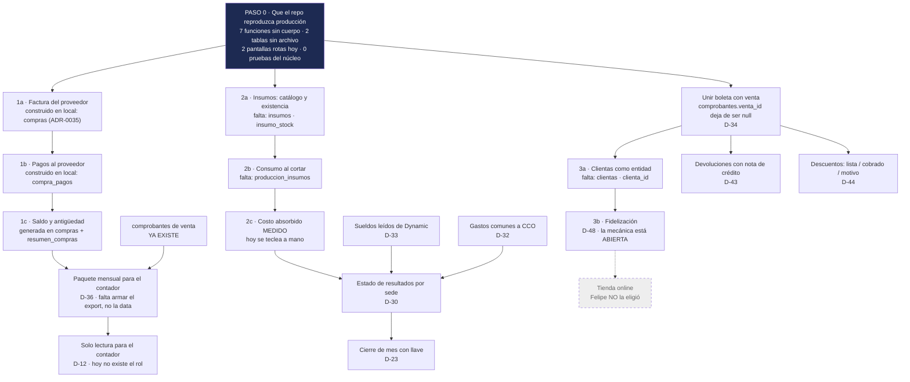

# Lo que falta construir, y en qué orden

> **Qué es este archivo.** Lo único de `docs/datos/` que habla de cosas que **no
> existen**. Todo lo demás de esta carpeta describe la base real; acá está el plan,
> claramente apartado, como manda D-08.
>
> **Cómo se usa.** Cada pieza trae: qué problema de negocio resuelve, **qué tablas y
> columnas exigiría**, de qué depende, y qué se rompe si alguien improvisa un esquema
> paralelo en vez de esperar a que esto se construya. Los nombres de tabla que
> aparecen acá son **propuestas**, no cosas hechas: si lo buscas en
> `generado/DICCIONARIO-RETAIL.md` y no está, es porque todavía no está.
>
> **La numeración.** `D-nn` es del acta `DECISIONES-2026-09-12.md`, que manda sobre
> todo este directorio. Cada bloque va marcado **DECIDIDA** (Felipe ya eligió, falta
> construirlo) o **ABIERTA** (falta la conversación antes que el código). No se
> construye nada marcado ABIERTA.

---

## El orden, en una imagen

Lo de arriba habilita lo de abajo. Empezar por el medio cuesta rehacerlo.



---

# Paso 0 · Que el repo reproduzca producción

**DECIDIDA** (D-17, D-18, D-25).

No es una funcionalidad, y por eso se salta. Es la condición para que las tres
prioridades se puedan construir sin adivinar.

**El problema, y es al revés de lo que todos suponen.** La historia que circula es
"local va adelante, producción va atrás". **Es la contraria.** Producción tiene
tablas y funciones vivas que **ningún archivo del repo crea**:

- `retail.sede_datos_fiscales` — 8 columnas, 1 fila (dirección, ubigeo,
  departamento, provincia, distrito, teléfono de la sede). Ningún archivo la crea,
  ningún código la lee (`modulos/01-identidad-y-acceso.md`, hueco 7).
- `retail.sede_meta` — 5 filas, vive en el schema `retail`; el repo la crea como
  `public.retail_sede_meta` (`supabase/unificacion/01_sedes.sql:19`). El paso que la
  movió nunca se versionó.
- **7 funciones** cuyo cuerpo no coincide con ningún archivo. Del barrido salieron
  diez; se cerraron las tres de permisos con
  `supabase/unificacion/36_candados_no_null.sql`, quedan siete.

**Qué se rompe:** levantar una base desde `supabase/migrations/*.sql` + `unificacion/`
da **una base distinta a la real**. Y eso es exactamente lo que D-50 exige que
funcione el día que otra marca use el sistema: cada marca, su propia base, levantada
desde el repo.

**Esta tabla describía un estado que el corte V1→V2 ya dejó atrás — corregido
2026-09-17, verificado directo contra el Postgres local.** `generado/DRIFT.md` es
anterior a `0af2f1b` (V1→V2, 2026-09-12): ni `RegistrarGastoModal.tsx` ni
`RecibirLoteForm.tsx` existen ya, y `registrar_gasto` **no existe en el esquema** —
`gastos` tampoco. El concepto de "gasto operativo suelto" fue reemplazado de raíz
por el eje factura-de-proveedor (`compras`, ADR-0035); ver la Prioridad 1 más abajo,
que por esto mismo cambia de diagnóstico. `recibir_lote` sigue viva pero con una
firma nueva y más chica:

```
recibir_lote(p_ubicacion_id uuid, p_proveedor_id uuid, p_items jsonb,
             p_numero_guia text default null, p_nota text default null)
```

5 argumentos, ninguno `p_orden_produccion_id` — la llama correctamente
`RecepcionFormV2.tsx:70`, para mercadería que entra sin factura registrada (la que sí
tiene factura entra por `recibir_compras`, ligada a `compra_items`). Ninguna de las
dos pantallas nombradas en la versión anterior de esta tabla existe hoy, así que
ninguna de las dos falla: `DRIFT.md` está desactualizado y conviene regenerarlo
(`pnpm datos:comparar`) antes de volver a citarlo.

**Las pruebas del núcleo (D-25).** Hoy hay 15 archivos `apps/web/lib/*.test.ts` y
**todos prueban TypeScript puro**. Pruebas sobre las funciones de la base: **0**
(`00-MAPA.md`, sección 6). Producción tiene 28 movimientos, 19 variantes y 2 ventas:
un error de signo cuesta corregir un movimiento. Después del censo, con ~900 SKUs
encima, el mismo error está repartido en miles de filas — y `movimientos` no se edita
(D-22): se corrige escribiendo una corrección por cada fila mal. **El precio de la
misma prueba se multiplica por el tamaño del catálogo.**

La prueba que se escribe primero es `recalcular_stock()`: si reconstruir el stock
desde `movimientos` da un número distinto al guardado, hay un movimiento mal
aplicado — y esa prueba lo encuentra antes que una clienta parada en el mostrador.

---

# Prioridad 1 · Cuentas por pagar e IGV

**DECIDIDA** — D-46 la puso primera. **Actualización 2026-09-17: esto ya se construyó
en local, con otros nombres que los que propone el resto de esta sección —** ver "Qué
hay en LOCAL hoy" más abajo antes de planear esta prioridad como si no existiera nada.

## El problema

Hoy nadie puede responder *"¿cuánto le debo a este proveedor y desde cuándo?"*
mirando el sistema. Hay que abrir el WhatsApp y contar facturas de papel.

Y el IGV de compra —lo que CAYLA paga de más en cada factura, y que se descuenta del
IGV que cobra— no está registrado en ningún lado. Eso deja de ser incómodo y pasa a
ser caro pronto: **CAYLA proyecta ~72% del umbral de 300 UIT en 2026**
(`docs/ARQUITECTURA.md:425`). Cuando lo cruce, la diferencia entre el IGV de venta y
el de compra es plata que sale todos los meses. **Un IGV de compra no registrado es
un impuesto que se paga dos veces.**

## Qué había en producción al 2026-09-12 (sin reverificar en esta pasada)

Esta era la foto contra producción del acta original. No se volvió a chequear contra
producción ahora — lo que sigue siendo cierto, salvo que alguien confirme lo
contrario, porque nada indica que producción se haya movido de acá:

| Tabla | Filas | Qué guarda de verdad |
|---|---|---|
| `proveedores` | 4 | `nombre`, `ruc` (nullable), `banco`, `cuenta_bancaria`, `contacto`, `telefono`, `activo`. **Ninguna columna de saldo ni de deuda** |
| `ordenes_compra` | 5 | `proveedor` (texto), `proveedor_id`, `estado` (default `pendiente`), `sede_destino_id`, `fecha`, `monto_estimado`, `fecha_estimada` |
| `ordenes_compra_items` | 0 | `orden_id`, `variante_id`, `cantidad`, `costo_unitario` — construida, nunca usada |
| `lotes` | 4 | `orden_compra_id` y `proveedor_id`: la recepción sí sabe de qué pedido vino |
| `gastos` | 0 | `sede_id`, `categoria`, `subtotal`, `igv`, `total`, `metodo_pago`. Tiene `igv`; **no tiene `proveedor_id`, ni número de factura, ni vencimiento** |
| `comprobantes` | 2 | Es solo de **venta**. `tipo` acepta `boleta`/`factura`/`nota_credito`/`nota_debito`, con serie y número **propios de CAYLA** (`series_comprobantes`) |

La pieza que faltaba saltaba a la vista: `monto_estimado` es una **intención de
compra**, no una deuda. Y no había ninguna tabla para el comprobante que emite el
proveedor — `comprobantes` no sirve para eso: su `UNIQUE (tipo, serie, numero)`
(`supabase/migrations/0032_comprobantes.sql:48`) es sobre la numeración de CAYLA.

El detalle tabla por tabla de lo que sí existe (en esta foto vieja) está en
`modulos/09-compras-y-proveedores.md` y `modulos/11-finanzas-operativas.md` — esos dos
módulos tampoco se revisaron en esta pasada; si describen `gastos`/`ordenes_compra`
como el estado actual, tienen el mismo drift que esta sección tenía.

## Qué hay en LOCAL hoy, verificado 2026-09-17 contra el Postgres local

**El corte V1→V2 (`0af2f1b`, 2026-09-12) reemplazó `gastos` y hasta cierto punto
`ordenes_compra` por un módulo de compras nuevo, construido el mismo día
(`20260912231956_compras_desde_factura.sql`, ADR-0035 "la factura de compra es el eje
de recepción y pago") y ampliado desde entonces con adjuntos, multipago y filtros.**
`gastos` y `registrar_gasto` **ya no existen** — ni la tabla ni la función — y
`RegistrarGastoModal.tsx` tampoco. Esto no es un cambio de nombre menor: es
prácticamente todo lo que esta prioridad pedía, ya construido, bajo otro nombre.

| Lo que esta sección proponía | Lo que existe en local, hoy |
|---|---|
| `compras_comprobantes` (factura del proveedor) | **`retail.compras`** — `proveedor_id`, `tipo` (`factura`/`boleta`/`nota_venta`), `serie`+`numero` (unique junto a `proveedor_id`), `fecha_emision`, `fecha_vencimiento`, `condicion` (`contado`/`credito`, con CHECK cruzado: crédito exige vencimiento), `subtotal`/`igv`/`total` (con CHECK `total = subtotal + igv`), `estado` (`vigente`/`anulada`), `ubicacion_destino_id` |
| "El saldo: calculado, nunca guardado" | **Columnas generadas** en `compras`: `saldo` (`total - pagado`), `estado_pago` (`pendiente`/`parcial`/`pagada`/`anulada`), `estado_recepcion` (`sin_recibir`/`parcial`/`recibida`) y `documento` (`serie-numero`). Nunca un valor tecleado — se recalculan solas, más estricto que lo que esta sección pedía |
| `pagos_proveedor` (cada pago, una fila) | **`retail.compra_pagos`** — `compra_id`, `fecha`, `monto` (`> 0`), `metodo` (transferencia/yape/plin/efectivo/depósito/otro), `referencia`, `usuario_id`. Sin policy de update/delete: append-only de hecho, igual que se pedía |
| "Una vista o función `saldo_por_proveedor`" | **`resumen_compras()`** — `registradas, vigentes, por_recibir, deuda, con_saldo, vencido, vencidas, por_vencer, por_vencer_monto`. Es función, como esta sección ya permitía |
| "Solo la cabecera, sin desglosar por prenda" (la recomendación de alcance) | **Se construyó con desglose real:** `compra_items` (`compra_id`, `producto_id`, `variante_id` opcional, `cantidad`, `costo_unitario`, `subtotal` generado) — más completo que lo recomendado, no menos |
| RPC de escritura (no propuesta explícitamente, pero implícita) | `registrar_compra`, `registrar_pago_compra`/`registrar_pagos_compra`, `recibir_compras` (recibe contra una línea de factura, valida que no se reciba más de lo facturado), `anular_compra`, `resumen_compras`, `listar_compras`, más adjuntos (`registrar_adjunto_compra`) |
| Pantalla | `CompraFormV2.tsx` (llama `registrar_compra`), `RecepcionCompraFormV2.tsx` (llama `recibir_compras`), `CompraDetallePanel.tsx`, `AdjuntosCompra.tsx`, `FiltrosCompras.tsx`, ruta `/compras` con modal de factura — todo verificado como código presente y llamando las RPC correctas, no solo el esquema |

**Lo que sigue sin existir, ni en local:** el rol Solo lectura para el contador (D-12
— `retail.colaboradores.rol` solo acepta `lider`/`colaborador`), la alarma diaria de
comprobantes trabados (D-37), y un export armado específicamente para el contador
(hay `apps/web/lib/exportar-csv.ts` de uso general; no se verificó que arme el
"registro de compras del mes" en el formato que pide el paquete PLE). Esos tres siguen
siendo trabajo real.

**Actualización, minutos después de escrito lo de arriba: sí llegó a producción.**
Se verificó directo contra `vovjyyiafkxteijimpuy` (proyecto real, confirmado por
`list_projects`): `compras`, `compra_items`, `compra_pagos` y `registrar_compra`
**existen y están vigentes en producción**, no solo en local. La cautela del párrafo
anterior era la correcta a tener — y resultó que la respuesta real era "sí, ya está",
no "no se sabe". Esto es consistente con un patrón ya visto dos veces antes (memoria
`commits-y-migraciones-en-produccion`): las migraciones se aplican en producción más
rápido de lo que cualquier documento, ADR o comentario de cabecera puede reflejar.
**Cualquiera que use esta sección para decidir "¿ya puedo usar esto en las tiendas?"
debe volver a preguntarle a la base ese mismo día, no confiar en esta fecha.**

## Qué tablas y columnas exigiría

**Esta propuesta ya se construyó en local — ver la tabla de mapeo arriba
("propuesta" → "lo que existe").** Se deja el diseño original tal cual se pensó,
porque el razonamiento (por qué un UNIQUE así, por qué el saldo nunca es una
columna) sigue siendo válido y es el mismo que terminó aplicado; solo el punto 4
(las columnas nuevas en `gastos`) quedó obsoleto porque `gastos` ya no existe.

**1 · `compras_comprobantes`** — la factura que llega del proveedor.

```
proveedor_id      → proveedores(id), NOT NULL
tipo              → 'factura' | 'boleta' | 'nota_credito' | 'nota_debito' (del tercero)
serie, numero     → los del proveedor, texto: no todos numeran como SUNAT espera
fecha_emision     date NOT NULL
fecha_vencimiento date            -- de acá sale la antigüedad de la deuda
subtotal, igv, total  numeric(12,2) NOT NULL
moneda            text default 'PEN'
sede_id           → sedes(id)     -- a qué sede se le carga el gasto (D-32: CCO si no es de ninguna)
orden_compra_id   → ordenes_compra(id), nullable
lote_id           → lotes(id), nullable
estado            'pendiente' | 'pagado_parcial' | 'pagado' | 'anulado'
UNIQUE (proveedor_id, tipo, serie, numero)
```

Ese UNIQUE es el punto: la misma factura no se registra dos veces, ni por error ni
por doble clic. Es el mismo candado que `comprobantes` ya tiene del lado de la venta,
pero con el proveedor en la llave porque la numeración es de él, no nuestra.

**2 · `pagos_proveedor`** — cada pago, una fila.

```
compra_comprobante_id → compras_comprobantes(id), NOT NULL
fecha            date NOT NULL
monto            numeric(12,2) NOT NULL
metodo_pago      text
usuario_id       → personas(id)
nota             text
created_at       timestamptz NOT NULL default now()
```

**Append-only, igual que `movimientos`.** Un pago no se edita ni se borra: si se
registró mal, se escribe otro con signo contrario y su motivo (D-22). El historial
muestra el error *y* la corrección, como un contador que no borra un asiento sino que
hace uno que lo revierte.

**3 · El saldo: calculado, nunca guardado.** Una vista o función
`saldo_por_proveedor`: facturas menos pagos, cortada en tramos desde
`fecha_vencimiento` (al día / 1-30 / 31-60 / 61-90 / más de 90).

**Nunca una columna `proveedores.saldo`.** Sería el mismo error que editar `stock` a
mano: principio 4 de `CLAUDE.md`, y la frase 1 de `00-MAPA.md`. El saldo es la suma
del historial, no un número que alguien pisa.

**4 · Dos columnas nuevas en `gastos` — obsoleto.** `gastos` ya no existe: el corte
V1→V2 la reemplazó por `compras`, que nace con `proveedor_id` desde su primera
migración. El problema que este punto 4 quería resolver (un gasto contado dos veces
si ya tiene factura) no aplica porque no hay dos caminos paralelos — solo `compras`.

## El paquete mensual para el contador (D-36)

**DECIDIDA.** Los libros electrónicos de SUNAT **los arma el contador**. El sistema
no genera ni transmite archivos PLE. Eso saca de encima un formato oficial que cambia
y donde un error es multa, y deja una tarea chica y bajo control: **entregar los
datos limpios**, por sede y consolidados.

| Lista | Estado | De dónde sale |
|---|---|---|
| **Registro de ventas del mes** | **Se puede hoy** | `comprobantes`: `created_at`, `tipo`, `serie`, `numero`, `cliente_tipo_doc`, `cliente_num_doc`, `cliente_nombre`, `subtotal`, `igv`, `total`, `estado`; para las notas, `comprobante_original_id` + `motivo`. Los anulados van **marcados, no borrados** — la base ya lo exige (`comprobantes_anulado_tiene_motivo`) |
| **Registro de compras del mes** | **La data ya existe en local; el export no está armado** | `compras` + `compra_items` + `proveedores.ruc` tienen todo lo que pide un registro de compras — falta solo el reporte que lo arme en CSV/Excel por sede y consolidado |
| **Resumen** | La mitad ya existe | IGV cobrado (de `comprobantes`) menos IGV pagado (de `compras.igv`, ya registrado) — antes la segunda mitad no existía; hoy es armar la resta, no inventar dónde vive el dato |

Formato: CSV o Excel, una pestaña por lista. **PDF no** — el contador lo tiene que
poder pegar en su sistema, no volver a tipearlo.

Dos cosas que este paquete necesita y todavía no existen:

- **El rol Solo lectura** (D-12). Hoy `retail.colaboradores.rol` solo conoce `lider`
  y `colaborador` (el vocabulario cambió con el corte V1→V2 — antes era
  `personas.rol` con `lider`/`integrante`). Ver la sección de roles más abajo.
- **La alarma diaria de comprobantes trabados** (D-37): revisar `comprobantes` en
  estado `pendiente` o `rechazado` con horas encima y avisar. Un comprobante trabado
  que nadie ve es un hueco en el registro de ventas del mes, y el contador lo
  descubre 30 días tarde.

## De qué depende

- **De que `proveedores.ruc` esté lleno.** Hoy es nullable y son 4 proveedores: media
  hora de trabajo. **Sin RUC no hay crédito fiscal** — para SUNAT esa factura no
  existe.
- ~~De que `registrar_gasto` deje de estar rota~~ — **obsoleto.** Esa pantalla y esa
  función no existen más; el IGV de compra entra por `registrar_compra`, que sí
  graba (ver arriba).
- **De poder comprar para el Taller y para CCO — sin reverificar.** La ruta se movió
  de `inventario/compras/page.tsx` (ya no existe) a `apps/web/app/(app)/compras/`;
  no encontré el filtro `tipo === "tienda"` en el mismo lugar dentro de esta pasada.
  No se puede afirmar si la limitación de "solo TRU/AQP/LIM en el desplegable"
  sigue viva o se resolvió con la reconstrucción — hay que mirar `CompraFormV2.tsx`
  directo antes de asumir cualquiera de las dos.
- **No depende de las otras dos prioridades.** Se construye en paralelo con los
  insumos, y de hecho se cruzan: la misma factura que crea la deuda es la que trae
  los metros de tela.

## Qué se rompe si alguien improvisa un esquema paralelo

**Queda como referencia, no como advertencia sobre algo pendiente:** `compras` no
tomó ninguno de estos atajos — ni metió la factura en `comprobantes` ni guardó la
deuda como columna en `proveedores`. Se deja el razonamiento para el día que a
alguien se le ocurra "simplificar" hacia uno de estos dos caminos más adelante.

El atajo tentador era meter la factura del proveedor dentro de `comprobantes` con un
`tipo` nuevo, o guardar la deuda como una columna en `proveedores`.

- **Meterla en `comprobantes`** rompe el correlativo legal de CAYLA. Esa tabla
  alimenta el registro de ventas que va a SUNAT; una fila que no es una venta nuestra
  ahí adentro contamina el libro y el `UNIQUE (tipo, serie, numero)` empieza a
  rechazar facturas legítimas de proveedores distintos. Y el día que se detecte, no
  se puede borrar: `comprobantes` tiene historial legal.
- **`proveedores.saldo` como columna** dura hasta el primer pago que alguien registre
  dos veces. Entonces hay dos números —el de la columna y el que sale de sumar los
  pagos— y nadie sabe cuál creerle. Es la misma enfermedad que ya tiene el sistema en
  `producciones.costo_tela`: un número tecleado que nadie puede contrastar.
- **Un Google Sheet paralelo** es peor que no tener nada: se ve oficial, nadie sabe
  quién lo actualizó por última vez, y cuando llegue la tabla real hay que migrar
  filas sin `proveedor_id` ni fecha de vencimiento.

## Cómo se ve hecho a medias — no fue el caso

**Esta sección advertía contra registrar las facturas y no los pagos, y recomendaba
arrancar solo por la cabecera, sin desglosar por prenda. Lo que se construyó fue más
completo que la recomendación, no menos:** `compra_pagos` existe desde el mismo día
que `compras` (no quedó para después), y `compra_items` sí desglosa por producto y
variante. El "Pagas" que se anticipaba acá —quedarse sin pagos o sin desglose— no
pasó. Se deja el texto original abajo porque el razonamiento sigue siendo válido
como criterio para priorizar, aunque en los hechos no hizo falta cortar tan corto.

Registrar las facturas y no los pagos habría dejado una pantalla que muestra una
deuda que nunca baja, todo el mundo deja de mirarla en dos semanas, y el número es
**peor** que no tener número, porque se ve oficial. Sobre el alcance había un corte
razonable propuesto —solo la cabecera de la factura, sin desglosar por prenda— con
**Ganas:** el saldo por proveedor, la antigüedad de la deuda y el IGV de compra
registrado desde el día uno, con la mitad del trabajo; **Pagas:** el costo de cada
prenda seguiría saliendo de lo que se teclea en "Recibir mercadería". La
recomendación original era empezar por la cabecera; lo que se construyó no se quedó
ahí.

---

# Prioridad 2 · Materia prima del Taller

**DECIDIDA** — D-47, textual: *completo*. Entra, se consume al cortar, y avisa cuando
falta.

**DECISIÓN CAMBIADA 2026-09-17, mismo día.** Una primera versión construyó las 4 tablas
+ 3 RPC de "Qué tablas y columnas exigiría" (abajo) tal cual las describe esta sección
(`supabase/migrations/20260917124059_materia_prima_taller.sql`, commit `fd3488f`) —
verificada y funcionando en local, pero **descartada** el mismo día al encontrar que
producción ya tenía un esquema para esto, huérfano, del volcado de unificación con
Dynamic de julio-2026 (`insumos`/`insumo_lotes`/`movimientos_insumo`/`v_insumo_saldos`
+ `recibir_insumo`/`ajustar_insumo_por_conteo`, 0 filas, sin uso). Felipe decidió
**adoptar el huérfano** en vez de seguir con el diseño de esta sección — más maduro
(seguimiento por lote, no un promedio global) y ya en producción. La prosa de abajo
("Qué tablas y columnas exigiría" en adelante) describe el diseño **descartado**: queda
como referencia histórica de por qué se necesitaba esto y qué se consideró, no como el
esquema real — el esquema real, tabla por tabla, está en
`docs/datos/modulos/10-produccion-del-taller.md` (sección "Materia prima del Taller") y
las decisiones completas en **ADR-0090**. **Lo único que falta construir de verdad es
el consumo** (`registrar_consumo_insumo`, `supabase/migrations/
20260917141500_registrar_consumo_insumo.sql`) — local, verificado end-to-end (huella
cero), pendiente de aplicar en producción (la entrada y el ajuste por conteo ya existen
ahí desde julio). El espejo local del esquema huérfano
(`20260917140000_insumos_taller_reconstruido.sql`) lo reconstruyeron dos sesiones
distintas el mismo día, de forma independiente, y coincidieron exactamente — ver
ADR-0090, "Reconciliación con la otra sesión". **Corrección de nombres, todavía
válida:** la
prosa de abajo se escribió contra `sede_id → sedes(id)` y `compras_comprobantes`, un
estado del esquema anterior a que Producción del Taller migrara a `ubicaciones`
(2026-09-15) — ninguna de las dos existe en este repo, ni en el diseño descartado ni en
el adoptado (que usa `ubicacion_id → ubicaciones(id)`, confirmado contra producción). No
se corrigió la prosa de abajo para no reescribir un documento ajeno bajo esta tarea —
**la Prioridad 1 (compras/gastos), más abajo, tiene el mismo drift de `p_sede_id` sin
auditar todavía.**

## El problema

`producciones` guarda `costo_tela`, `costo_avios` y `costo_maquila` como montos que
**alguien escribe a mano**. Nadie sabe cuántos metros de tela quedan en el Taller, ni
si el monto tecleado corresponde a lo que salió del estante. Y
`producciones.costo_unitario` es una **columna generada** a partir de esos tres: si
los tres son estimados, el "costo real" de la prenda es estimado también.

Eso se derrama fuera del Taller, y ahí está lo importante:

- **D-31** resolvió la medición del Taller con **costo absorbido**: el costo real de
  producir se pega a cada prenda y viaja con ella a la tienda en un traslado. Cuando
  Trujillo la vende, su margen es ingreso menos ese costo. **Si el costo viene
  tecleado, el margen de Trujillo es una estimación con cara de dato.**
- **D-31** también mide al Taller por **eficiencia**: lo que gastó en el mes contra lo
  que absorbió en las prendas que produjo. Los dos lados de esa resta necesitan el
  consumo medido.
- **D-30** exige estado de resultados por sede. Sin consumo medido, el de la sede
  Taller es fantasía y el de las tiendas arrastra el error.

Esta prioridad es, entonces, **la pieza que hace que el costo absorbido sea medido y
no estimado**. Los huecos vivos del Taller están en
`modulos/10-produccion-del-taller.md` (huecos 5 a 9).

## ¿Sirve `bom_items` como base? No

`bom_items` está **muerta**: 0 filas, marcada como legado junto con
`ordenes_produccion`, reemplazadas por `producciones`/`produccion_lineas`
(`modulos/10-produccion-del-taller.md`).

Y aunque estuviera viva no alcanzaría. Sus columnas son `producto_id`, `insumo`
(texto libre), `cantidad_requerida`, `unidad`, `precio_unitario`. Eso es una
**receta** —cuánta tela *debería* llevar un modelo— no un inventario: no tiene
existencia, ni entradas, ni sede, ni lote, ni precio histórico. Su propio archivo lo
dice: `supabase/migrations/0024_produccion_costeo.sql:17-18` — *"NO es inventario de
insumos (eso quedó para después): es una calculadora honesta."*

Sirve como pista de qué campos lleva una receta el día que se quiera hacer una. **Se
queda muerta; no se escribe ahí** (D-07).

## Qué tablas y columnas exigiría

**1 · `insumos`** — el catálogo.

```
codigo        text UNIQUE
nombre        text NOT NULL
tipo          'tela' | 'avio' | 'empaque'
unidad        'm' | 'und' | 'kg'
stock_minimo  numeric(12,3)
activo        boolean NOT NULL default true
```

Es **hermana de `productos`, no la misma tabla**. Una tela no se vende, no tiene
talla ni color vendible, y no puede entrar a `variantes` sin ensuciar el catálogo
entero: `variantes` cuelga de `colores` (30 palabras cerradas), acuña código con
`fn_asignar_codigo_variante`, y arrastra `codigos_barras`. Meter tela ahí significa
que un rollo de popelina aparece en el buscador de la caja.

**2 · `insumo_stock`** — cuánto hay y dónde.

```
PK (insumo_id, sede_id)
cantidad  numeric(12,3) NOT NULL default 0
```

**Con decimales, a diferencia de `stock.cantidad`, que es `integer`.** 2,35 metros de
tela es una cantidad válida; media blusa no. Ese es el motivo exacto por el que no se
puede reusar `stock`.

**3 · `insumo_movimientos`** — el historial, calcado de `movimientos`.

```
insumo_id, sede_id       NOT NULL
tipo                     'entrada' | 'salida' | 'ajuste'
cantidad                 numeric(12,3) NOT NULL
costo_unitario           numeric(12,4)
motivo                   text
produccion_id            → producciones(id), nullable
compra_comprobante_id    → compras_comprobantes(id), nullable   -- el puente con la prioridad 1
usuario_id, created_at
```

Append-only, con el mismo candado que `movimientos` (D-22): no se edita ni se borra,
se corrige con signo contrario y motivo. Y `insumo_stock` es su resumen, reconstruible
entero — la misma arquitectura que ya funciona para la mercadería.

**4 · `produccion_insumos`** — el puente, y la pieza clave.

```
produccion_id      → producciones(id)
insumo_id          → insumos(id)
cantidad_consumida numeric(12,3) NOT NULL
costo_unitario     numeric(12,4) NOT NULL
costo_total        numeric(12,2)   -- generada
```

Se llena **al cortar**. Es lo que hace que `producciones.costo_tela` deje de ser un
número tecleado y pase a ser la suma de un consumo real.

**5 · La alerta:** `insumo_stock.cantidad < insumos.stock_minimo` avisa, igual que el
stock mínimo de prendas (`fijar_stock_minimo`).

**6 · Una RPC de entrada propia.** Hoy `recibir_lote()` recibe **variantes**: su
`p_items` es un jsonb de `variante_id` + cantidad, y escribe en `movimientos`. La
tela no entra por esa puerta. Hace falta algo como
`recibir_insumos(p_sede_id, p_items, p_compra_comprobante_id)`.

## De qué depende

- **De la prioridad 1**, en el punto donde se tocan: la factura del proveedor de tela
  crea la deuda (prioridad 1) y trae los metros (prioridad 2). Conviene que sea el
  mismo registro, y por eso `insumo_movimientos.compra_comprobante_id` está en el
  esbozo desde el principio.
- **De poder comprar para el Taller.** Mismo bloqueo que la prioridad 1: la pantalla
  de compras solo ofrece tiendas.
- **De que el drift de `registrar_produccion` se cierre** (Paso 0). Hoy producción
  corre 16 argumentos y local 15 (`unificacion/11_produccion_material_etapas.sql:38-46`
  agregó `p_material` y no hay migración local gemela): tocar producción sin poder
  probar en local es probar en la base de las tiendas.

## Qué se rompe si alguien improvisa un esquema paralelo

- **Meter la tela en `productos`/`variantes`** para ahorrarse dos tablas: aparece en
  el buscador de la caja, exige un color de la lista cerrada de 30, se le acuña
  código de barras, y `stock.cantidad` la trunca a entero — 2,35 metros se guardan
  como 2. El error no avisa: redondea.
- **Guardar el consumo en `producciones.costo_tela` "pero ahora sí bien tecleado"**:
  no es un problema de disciplina, es que no hay contra qué contrastarlo. El número
  sigue sin poder auditarse.
- **Una hoja de cálculo de metros en el Taller**: el día que el estado de resultados
  por sede se conecte (D-30), el costo absorbido va a salir de la base, no de la
  hoja — y las dos cifras no van a coincidir nunca.

## Cómo se ve hecho a medias

Registrar la entrada de tela y no el consumo. Queda un almacén de insumos que solo
crece y nunca baja.

**Ganas:** saber cuánta tela compraste.
**Pagas:** sigues sin saber cuánto cuesta una prenda — que era el punto de toda la
prioridad. **La mitad que importa es el consumo, no la entrada.**

---

# Prioridad 3 · Clientas y fidelización

**DECIDIDA en el qué, ABIERTA en la mecánica** — D-48: clienta de verdad +
fidelización desde el principio, no solo historial. Qué se gana y cómo se canjea es
una de las cuatro decisiones abiertas del acta.

## Qué hay hoy, y es poco

La única huella de una clienta en toda la base son **tres columnas de texto** en
`comprobantes` (`supabase/migrations/0032_comprobantes.sql:31-33`):

- `cliente_tipo_doc` — `dni` / `ruc` / `sin_documento`, **con default
  `sin_documento`**
- `cliente_num_doc` — nullable
- `cliente_nombre` — nullable

Texto suelto, sin tabla propia, sin regla de unicidad. Dos boletas de la misma señora
son dos textos distintos, no una clienta con dos compras. `proformas` repite el mismo
patrón. **No existe `clientas`, no existe `clienta_id` en ninguna tabla, no hay
teléfono, no hay correo, no hay puntos.**

Y hay un agravante que convierte otra cosa en requisito: **`comprobantes.venta_id` es
nullable y hoy está siempre en NULL** (D-34). `emitir_comprobante` acepta el
parámetro, pero `ComprobantesPanel.tsx:240` no lo manda
(`modulos/08-facturacion-sunat.md`, hueco 3). El índice
`comprobantes_venta_id_idx` existe sobre una columna vacía. Aunque mañana existiera
`clientas`, **no se podría saber qué prendas se llevó**: la boleta no sabe de qué
venta salió.

## Qué tablas y columnas exigiría

**1 · `comprobantes.venta_id` lleno**, escrito por `emitir_comprobante()`. No es un
ítem aparte de esta prioridad: es su primer paso. Sin esto, todo lo demás es una
libreta de nombres.

**2 · `clientas`**

```
nombre            text NOT NULL
tipo_doc          'dni' | 'ruc' | 'sin_documento'
num_doc           text   -- UNIQUE parcial: where num_doc is not null
telefono          text
correo            text
fecha_nacimiento  date
sede_origen_id    → sedes(id)
acepta_contacto   boolean NOT NULL default false
created_at        timestamptz NOT NULL default now()
```

**Todo eso es dato personal.** Se marca en `06-DATOS-PERSONALES.md` (Ley 29733,
D-28) **antes** de guardar la primera fila, no después: nombre, documento, teléfono,
correo y fecha de nacimiento de una persona identificable, con `acepta_contacto` como
la base legal de cualquier mensaje que se le mande.

**3 · `clienta_id`** en `comprobantes` y en `ventas`, nullable — una venta sin
clienta identificada tiene que seguir siendo posible: la caja no se frena nunca
(D-49).

**4 · La mecánica de fidelización. ABIERTA.** Son preguntas de negocio; solo Felipe
las responde, y **no se escribe tabla antes**:

- ¿Qué se gana? ¿Puntos por sol gastado, sellos por compra, o nivel por lo acumulado
  en el año?
- ¿Cómo se canjea? ¿Descuento en la siguiente compra, prenda gratis, acceso a
  preventa?
- ¿Vence? Un punto que no vence es una deuda del negocio que crece para siempre y
  nunca se apaga.
- ¿Vale igual en las tres tiendas? Si sí, el saldo es de la clienta y no de la sede —
  y eso cambia quién puede canjear y cómo se reparte el descuento en el estado de
  resultados por sede (D-30).

**5 · Recién con eso decidido: `clienta_puntos_movimientos`.**

```
clienta_id      → clientas(id)
tipo            'gana' | 'canjea' | 'vence'
puntos          integer NOT NULL
motivo          text
comprobante_id  → comprobantes(id), nullable
created_at      timestamptz NOT NULL default now()
```

Solo se agregan filas, nunca se editan. **Nunca un campo `clientas.saldo_puntos` que
se pisa**: el saldo es la suma del historial, igual que `stock` es la suma de
`movimientos`. Un saldo de puntos pisado es plata que el negocio debe y no puede
auditar.

## De qué depende

De D-34 (unir boleta con venta), y de nada más. Es la única de las tres prioridades
que puede empezar sin tocar compras ni producción.

## El costo de esperar, con nombre

**Cada día sin esto es historial de clientas que no se guarda y no se recupera.** Es
el único hueco de toda esta lista donde esperar **destruye** información en vez de
solo postergar trabajo: el stock se puede recontar, una factura de proveedor se puede
registrar tarde, un asiento contable se puede escribir con fecha pasada. Una venta de
hace tres meses a una señora cuyo nombre nadie anotó no se reconstruye nunca.

## Qué se rompe si alguien improvisa un esquema paralelo

- **Seguir usando `comprobantes.cliente_nombre` como si fuera la clienta**: "María
  Pérez", "maria perez" y "Maria P." son tres clientas. Cuando llegue la tabla real,
  deduplicar eso es trabajo manual sobre miles de boletas, y el resultado es una
  suposición.
- **Puntos en una app externa o en un cuaderno de la tienda**: el saldo vive fuera de
  la base, no se puede cruzar con `comprobantes`, y el día que se migre no hay forma
  de demostrar que un canje se hizo.
- **`clienta_id` sin `venta_id`**: se sabe quién compró pero no qué se llevó. Es
  exactamente la mitad inútil, porque lo que da valor es *"la M vino se está
  quedando, y estas 40 clientas compran esa talla"*.

## Cómo se ve hecho a medias

Guardar la clienta y dejar la fidelización para después. Queda una lista de nombres
que nadie mira, y cuando se decida la mecánica hay que rehacer el diseño igual.

**Mitigación concreta, que quita casi todo el "pagas":** crear **`clientas` +
`clienta_id`** ya —eso no cambia con ninguna mecánica— y dejar los puntos para cuando
la mecánica esté escrita. Lo que no se recupera es el historial; los puntos sí se
pueden calcular retroactivamente desde `comprobantes` el día que la regla exista.

---

# Decididas y sin construir · la segunda fila

Todo lo de acá abajo ya lo decidió Felipe y nada existe en la base. No es prioridad
de hoy, pero tampoco es "algún día": es trabajo con destino.

## Devoluciones de clienta · D-43 · DECIDIDA

**El problema.** Hoy una devolución **se disfraza de ajuste**: `movimientos_tipo_check`
solo acepta `entrada`, `salida`, `ajuste` y `traslado`. Un ajuste y una devolución se
ven igual en el historial, así que la merma real y la mercadería que volvió del
cliente se mezclan en el mismo número.

**Qué exigiría.**
- `movimientos.tipo` acepta `devolucion` — y el CHECK se amplía, no se reinterpreta.
- `devoluciones`: `comprobante_original_id` → `comprobantes(id)`, `venta_id`,
  `sede_reingreso_id`, `motivo`, `usuario_id`, `created_at`.
- Cada línea devuelta genera **una nota de crédito** con `emitir_nota()`, que ya
  existe en producción y **ninguna pantalla llama** (`generado/DRIFT.md`, funciones
  que nadie usa).
- El motivo tiene que ser el **código de SUNAT**, no texto libre: hoy un motivo
  tecleado como "Devolución de la clienta" viaja como código de tipo
  (`modulos/08-facturacion-sunat.md`).

**De qué depende.** De D-34. Sin `comprobantes.venta_id` lleno, una devolución no
tiene a qué boleta agarrarse.

**La pregunta de negocio que queda, y es de Felipe:** **¿a qué sede reingresa?** Una
clienta compra en Trujillo y devuelve en Arequipa. Si reingresa en Arequipa, Trujillo
queda con una venta que no tiene stock detrás; si reingresa en Trujillo, Arequipa
tiene una prenda física que el sistema dice que está en otra ciudad.

**Qué se rompe improvisando.** Seguir usando `ajuste` con un texto en `motivo`: el
análisis de merma queda contaminado para siempre, y como `movimientos` no se edita
(D-22), reclasificar esas filas después es imposible.

## Descuentos en la venta · D-44 · DECIDIDA

**El problema.** No hay campo de descuento en ninguna tabla de venta. `ventas` tiene
8 columnas y ninguna es de precio de lista. **El precio lo pone el navegador**:
`registrar_venta` recibe `p_items` como jsonb con `monto` = precio unitario
(`supabase/migrations/0007_finanzas.sql:105`) y lo guarda tal cual. Nadie puede
distinguir un descuento autorizado de un cero de más al tipear.

**Qué exigiría.** Tres columnas por línea de venta, no una:

```
precio_lista    numeric(12,2) NOT NULL   -- lo que decía la etiqueta
precio_cobrado  numeric(12,2) NOT NULL   -- lo que pagó de verdad
motivo_descuento text                    -- vocabulario cerrado, no texto libre
```

Y como hoy las líneas de venta viven en `movimientos` (una `salida` por prenda, con
`monto`), esto obliga a la conversación que el sistema viene postergando: **o
`movimientos` gana esas columnas, o nace `venta_lineas`.** La segunda es la sana —
`movimientos` es el libro de la mercadería, no el de la plata— pero toca el núcleo, y
el núcleo no se toca sin razón de peso (principio 1).

**Qué se rompe improvisando.** Registrar el descuento solo en `ventas.nota`: ningún
análisis de margen es confiable, y el estado de resultados por sede (D-30) reparte un
descuento que no puede ver.

## Cierre de mes con llave · D-23 · DECIDIDA

**El problema.** Hoy **nada impide escribir en un mes ya dado por bueno**. El
contador cierra agosto, y el 15 de septiembre alguien registra un gasto con fecha de
agosto: los números que el contador ya entregó dejan de cuadrar y nadie se entera.

**Qué exigiría.**

```
periodos_contables
  anio, mes            integer, UNIQUE (anio, mes)
  estado               'abierto' | 'cerrado'
  cerrado_por          → personas(id)
  cerrado_at           timestamptz
  reapertura_motivo    text      -- reabrir deja rastro, D-11
```

Más un **trigger** sobre las tablas con fecha de negocio —`movimientos`, `ventas`,
`gastos`, `asientos`, `comprobantes`, y las nuevas `compras_comprobantes` y
`pagos_proveedor`— que rechace insertar con fecha dentro de un período cerrado.

**De qué depende.** De que haya algo que cerrar: el estado de resultados por sede
(D-30) y la contabilidad que se llena sola (D-35, hoy `asientos` tiene 0 filas y
ninguna RPC llama a `registrar_asiento()`).

**Qué se rompe improvisando.** Un candado en la pantalla en vez de en la base. Las
RPC son `security definer` y la API de Supabase queda expuesta: cualquiera con cuenta
puede escribir en el mes cerrado por API. El candado va donde va el de `movimientos`:
en la base.

## Cubrir otra sede, con fecha de fin · D-14 · DECIDIDA

**El problema.** La líder de Arequipa se va dos semanas y alguien tiene que cubrir.
Hoy la única forma es cambiarle la sede base a la persona —y no se la devuelve
nadie— o darle rol de admin, que abre todo para siempre.

**Qué exigiría.**

```
permisos_temporales
  persona_id   → personas(id)
  sede_id      → sedes(id)
  desde, hasta timestamptz NOT NULL
  motivo       text
  otorgado_por → personas(id)
  CHECK (hasta > desde)
```

Y **`puede_operar_sede` tiene que consultarla**. Hoy mira una sola sede y no entiende
de vencimientos: en producción es
`coalesce(public.fn_rol_actual() = 'admin', false) or coalesce(public.fn_sede_actual_persona() = p_sede_id, false)`
(`supabase/unificacion/03_candados.sql:76-79`).

**Ojo con dónde se toca.** `puede_operar_sede` es la función más llamada del sistema:
35 sitios con `if not fn_puede_operar_sede(...)` en 20 migraciones locales
(`modulos/01-identidad-y-acceso.md`, hueco 1). Un permiso que **vence solo** es la
única forma de que esto no se convierta en "todos son admin".

**Qué se rompe improvisando.** Dar admin "por esta vez". No hay fecha de fin, no hay
motivo, no hay rastro, y en producción `es_lider()` es `rol = 'admin'`: esa persona
pasa a poder dar de alta catálogo en las tres tiendas, para siempre.

## Los niveles Admin y Solo lectura · D-12 · DECIDIDA

**El problema.** D-12 fija **cuatro niveles** de permiso para todo CAYLA:

| Nivel | Qué es | Existe hoy |
|---|---|---|
| **Admin** | Ve y puede todo, en todas las sedes | En Dynamic sí (`rol = 'admin'`); **en el vocabulario de retail no** |
| **Líder de equipo** | Manda en su sede | `personas.rol = 'lider'` en retail; `supervisor_sede` en Dynamic |
| **Integrante** | Opera en su sede, con límites | Sí |
| **Solo lectura** | Ve, no toca nada — para el contador externo | **No existe** |

**El sistema hoy solo conoce dos.** Y hay algo peor, verificado contra producción: en
producción `retail.es_lider()` es `public.fn_rol_actual() = 'admin'`
(`supabase/unificacion/03_candados.sql:69-70`). **El rol `supervisor_sede` no pasa ese
candado.** O sea: el vocabulario dice "Líder de equipo manda en su sede", y la base
dice "solo admin". **Hoy solo Felipe puede dar de alta catálogo en las tiendas.**

**Qué exigiría.**
- Un vocabulario de rol único en los dos sistemas. Se llama **Líder de equipo** —
  nunca "encargada": hay hombres y mujeres en la empresa.
- `retail.es_lider()` reconoce `admin` **y** el rol de líder, y nace
  `retail.es_admin()` para lo que de verdad es solo de Felipe.
- Un rol `solo_lectura`: `SELECT` en todo, `INSERT`/`UPDATE` en nada, y **rechazado
  por toda RPC** — no alcanza con no darle policies de escritura, porque las RPC
  corren como dueño.

**Qué se rompe improvisando.** Darle al contador la cuenta de un integrante. Puede
vender, ajustar stock y cerrar caja, y cada cosa que haga queda firmada con el
`usuario_id` de esa persona.

## La pantalla de devolver al almacén · D-41 · DECIDIDA

> **(V1; hoy: 2026-09-25)** `devolver_a_almacen` y `bajar_a_piso` ya no existen. Retirar
> del piso es `mover_interno` con origen piso y destino almacén, y desde el 2026-09-25 tiene
> pantalla: «Retirar del piso», en el menú «⋯» de cada talla en Existencias (bloque 2 de ADR-0208). La ida es «Reponer» de Existencias
> (`mover_interno`) y, desde el 2026-09-25 (sin pegar en producción), la pantalla «Bajar
> prendas al piso» (`bajar_al_piso`), a la que se entra por el botón «Bajar al piso» de
> Existencias.
> El párrafo que sigue es el de V1.

`devolver_a_almacen(p_sede_id, p_variante_id, p_cantidad, p_nota)` (V1) **ya existe en
producción** y está en la lista de funciones que nadie llama
(`generado/DRIFT.md`). El camino de ida tiene pantalla —`BajarATiendaModal.tsx` llama
a `bajar_a_piso` (V1)— y el de vuelta no.

**Qué se rompe sin ella.** Fin de temporada: la ropa que sale de vitrina y vuelve a
cajas se registra como ajuste negativo en piso, o no se registra. En el primer caso
la merma queda inflada; en el segundo, el piso dice que hay 8 blusas colgadas y hay
0. No falta esquema: falta una pantalla. Es la tarea más barata de toda esta lista.

## La pantalla de alta de colores que la base nombra y no existe · DECIDIDA por omisión

**El problema, y es literal.** Cuando alguien cuenta una prenda de un color que no
está en el vocabulario, la base responde:

> `El color % no existe. La Líder puede agregarlo en Catálogo → Colores`

Está en cuatro archivos: `supabase/migrations/0048_conteos.sql:307`,
`supabase/migrations/0051_conteo_color_vacio.sql:60`, y sus gemelos de producción
`supabase/unificacion/30_conteos.sql:285` y
`supabase/unificacion/33_conteo_color_vacio.sql:62`.

**"Catálogo → Colores" no existe.** No hay ninguna ruta `catalogo` en
`apps/web/app/(app)/` — las secciones son inventario, vender, producción, finanzas,
almacén, comercial, buscar y más. El mensaje manda a la persona a un lugar
inventado.

**Tres problemas en una sola línea de error:**
1. La pantalla no existe, y el único camino que hoy crea colores es
   `importar_catalogo` (`supabase/migrations/0057_importar_catalogo_revisado.sql:118-131`),
   que solo corre en una importación masiva — no sirve para el color que apareció a
   mitad de un conteo.
2. Dice **"La Líder"**, en femenino. D-12 fija **Líder de equipo** justamente porque
   hay hombres y mujeres.
3. Y ni siquiera es la Líder: las policies `colores_insert_lider` /
   `colores_update_lider` (`supabase/migrations/0046_colores.sql:90-91`) exigen
   `es_lider()`, que en producción es `rol = 'admin'`. **Solo Felipe puede agregar un
   color.**

**Qué exigiría.** Una pantalla de alta de `colores` (`codigo` de 3 mayúsculas,
`nombre`, `familia_color`, `hex`, `orden`, `taxonomia_valor_id`) accesible al Líder de
equipo, más corregir el texto de los cuatro `raise exception` para que nombre la ruta
real y el rol real.

**Por qué importa ahora.** El censo de ~900 SKUs se hace contando. Cada color fuera
de la lista de 30 frena a la persona que está contando, y la desbloquea solo Felipe.

## Las que ya están nombradas en su módulo

Estas se decidieron, no existen, y su detalle vive en el módulo que las sufre. Acá va
solo la línea que falta y el puntero — no se repite el análisis.

| Decidido | Qué falta, concretamente | Dónde está el detalle |
|---|---|---|
| Unir boleta con venta (D-34) | `emitir_comprobante()` recibe `p_venta_id` y nadie se lo manda: `ComprobantesPanel.tsx:240`. Requisito de devoluciones **y** de clientas | `modulos/08-facturacion-sunat.md` |
| Contabilidad que se llena sola (D-35) | Ninguna RPC llama a `registrar_asiento()`; `asientos` tiene 0 filas y `cuentas_contables` 0 en producción. Empezar por venta y gasto | `modulos/12-contabilidad.md` |
| Candado de verdad en `movimientos` (D-22) | No hay trigger que rechace UPDATE/DELETE. Hoy "no se edita" es una costumbre, no una regla que la base imponga | `modulos/05-inventario-y-movimientos.md` |
| Alerta de stock con los dos bolsillos (D-39) | La alerta mira solo `stock`; falta sumar `stock_almacen` y decir cuántas están guardadas | `modulos/05-inventario-y-movimientos.md` |
| Sueldos leídos de Dynamic (D-33) | Nada en retail lee la planilla. Sin esto, el resultado por sede es fantasía | `07-dynamic-resumen.md` |
| CCO manda sobre CORP (D-20) | Local llama `CORP` a la sede corporativa y producción la llama `CCO`. Manda CCO; se corrige el local | `08-OPERACION.md` |
| Alarma de comprobantes trabados (D-37) | Revisar `comprobantes` en `pendiente`/`rechazado` con horas encima y avisar | `modulos/08-facturacion-sunat.md` |
| Referencia de maquila externa (D-31) | No hay tabla ni columna donde guardar "cuánto me cobraría un taller de afuera". La mitad del criterio de medición del Taller no tiene dónde vivir | `modulos/10-produccion-del-taller.md` |

---

# Abierta · el costeo del inventario

**D-45 · ABIERTA. No la decide quien lea esto.**

**El problema.** Hoy el costo de una prenda es **uno solo por variante, y el nuevo
pisa al viejo**. `variantes.costo` se escribe con el costo estimado de apertura de la
producción (`supabase/migrations/0029_orden_produccion.sql:246-258`) y
`cerrar_produccion` recalcula `producciones.costo_unitario` con el costo real **y no
toca `variantes.costo`**. Si en enero la blusa costó S/28 y en junio S/34, las 12 que
quedan de enero valen S/34 a partir de junio — y el margen de todas las ventas de ese
modelo queda mal sin que nada avise.

Felipe, textual: *"es un tema contable, existen métodos, no sé si es necesario ese
nivel de detalle ahora"*. **Se documenta el problema con los métodos nombrados para
que el contador decida. No se toca el núcleo hoy.**

Los tres métodos estándar, para tener la conversación con el contador:

| Método | Cómo funciona | Qué exigiría en la base |
|---|---|---|
| **Promedio ponderado** | Cada entrada recalcula un costo promedio sobre lo que ya había | Una columna de costo promedio por variante y sede, recalculada en cada entrada. Es lo más cercano a lo que hay hoy |
| **PEPS (FIFO)** | Lo que sale es lo que entró primero, con su costo original | Capas de costo: una tabla que guarde cada entrada con su cantidad restante y su costo, y consuma de la más vieja |
| **Costo por lote** | Cada unidad arrastra el costo de su lote de origen | `movimientos.lote_id` **ya existe** y `lotes` ya se llena al recibir. Es el que menos estructura nueva pide |

**Qué NO se hace mientras siga abierta.** No se agrega una columna de costo nueva "por
si acaso", no se cambia cómo escribe `cerrar_produccion`, y no se construye un cálculo
de margen que asuma un método. Elegir por defecto es elegir.

---

# Ya construido · para que nadie lo dé por faltante

## La caja que no se congela · D-49 · HECHA

Felipe la llamó *"el filo"*: lo único que un competidor no puede copiar en un
trimestre. **Existe**, y conviene saber exactamente qué existe para no reconstruirla:

- `apps/web/lib/ventas-offline.ts` y `apps/web/lib/sin-red.ts` (ADR-0036): cola de
  ventas por sede en el navegador.
- `registrar_venta` es **idempotente por token** en producción — la firma real allá es
  `registrar_venta(p_caja_id, p_metodo_pago, p_items, p_nota, p_token)`
  (`generado/funciones-produccion.txt`), de `supabase/migrations/0054_venta_idempotente.sql`
  y ADR-0033. Un reintento no cobra dos veces.
- La regla de negocio ya decidida: se vende sin red **solo si queda al menos 1 unidad
  después de la venta** (ADR-0013 §C). Dos sedes offline no se pueden coordinar, y esa
  es la única defensa real contra sobrevender.

**No es un hueco: es una restricción conocida y escrita.** Lo que sí falta es la
consecuencia de D-49 sobre lo que se construya encima: **ninguna pieza nueva puede
frenar la caja**. Si `clienta_id` fuera obligatorio, si el descuento exigiera
aprobación en línea, o si el cierre de mes bloqueara una venta del día, se rompe el
filo. Todo lo de este roadmap se diseña con ese límite.

---

# Más adelante · Felipe no lo eligió

**Ecommerce / omnicanal.** `movimientos.canal` ya acepta `online`
(`movimientos_canal_check`: `canal in ('tienda','online')`), pero **no hay
integración con ninguna tienda** (Shopify o similar) que escriba ahí sola. D-46 dice
textualmente que la tienda online queda para después de las tres prioridades.

Y hay un orden real detrás de esa postergación, no solo una preferencia: una tienda
online despacha del stock físico de una de las tres tiendas, así que necesita **el
stock confiable** (censo + pruebas del núcleo), **la clienta como entidad** (prioridad
3, porque una compra online sin clienta identificada no existe) y **las devoluciones**
(D-43, porque online devuelve más que tienda). Construir ecommerce antes de esas tres
es construirlo dos veces.

**Multi-moneda.** Todo está en soles. `comprobantes.moneda` existe con default
`'PEN'` (`supabase/migrations/0032_comprobantes.sql:34`) y ninguna otra tabla
financiera tiene campo de moneda.

**Varias marcas en una sola base.** **Descartado** (D-50). Cada marca tiene su
proyecto Supabase, su base y su despliegue. En la práctica, hoy, para quien escriba
una tabla de este roadmap: **no agregues `marca_id`, `tenant_id` ni `empresa_id`** a
`clientas`, `insumos`, `compras_comprobantes` ni a ninguna otra. Sería una columna con
el mismo valor en todas las filas para siempre, y todas las consultas cargando un
filtro que nunca filtra nada. Lo que sí importa es que las migraciones corran de cero
sobre una base vacía — ver el Paso 0, que hoy no lo cumple.

---

# La foto de hoy, verificada contra producción el 2026-09-12

Proyecto `vovjyyiafkxteijimpuy`. Si algún archivo de esta carpeta dice otra cosa, el
archivo está viejo.

| Qué | Cuánto |
|---|---|
| Tablas de CAYLA Retail (schema `retail`) | **45** + 2 vistas |
| Tablas del sistema de personas (schema `public`, Dynamic) | **69** + 4 vistas |
| `retail.personas` y `retail.sedes` | **Son vistas** sobre Dynamic, no tablas. Y hay FK reales cruzando de un schema al otro |
| Funciones que escriben en la base | 56 en producción |
| Funciones con firma duplicada | **0** hoy |
| Pantallas rotas en las tiendas ahora mismo | **2** |
| Pruebas automáticas sobre el núcleo de stock | **0** |

**Sí existen en producción, por si alguien lo duda:** las 5 tablas de taxonomía
(`taxonomia_versiones`, `taxonomia_categorias`, `taxonomia_atributos`,
`taxonomia_valores`, `taxonomia_categoria_atributos`), `importaciones`,
`producto_atributos`, `proformas`, `conteos`, `conteo_lineas`, `codigos_barras`,
`migraciones_aplicadas`, `sede_meta`, `sede_datos_fiscales` y
`configuracion_empresa`. **`docs/BACKLOG.md:82` y `:87` dicen que `0052` no está
aplicada en producción: están equivocados** — y se contradicen con `:64` del mismo
archivo, que dice que sí. Las tablas de taxonomía están ahí, con 29.586 filas entre
las cinco.

**Existe pero casi sin usar** (construido, no probado con datos reales):
`cuentas_contables` (0 filas), `asientos`/`asiento_lineas` (0), `importaciones` (0),
`ordenes_compra_items` (0), `gastos` (0), `depositos_bancarios` (0),
`ajustes_efectivo` (0), `proformas` (0), `patrimonio_items` (0), `conteo_lineas` (0).
Nada de eso es un error: es la diferencia normal entre "el código está listo" y "el
negocio ya lo usó".

**Muerto, no se toca** (D-07): `ordenes_produccion` y `bom_items`, reemplazadas por
`producciones`/`produccion_lineas`. Quedan en la base porque nunca se borra estructura
con historial, pero **ninguna pantalla nueva escribe ahí** — y `bom_items` tampoco
sirve de base para los insumos del Taller.

---

# Las cuatro decisiones abiertas del acta

Estas cuatro son las únicas que se pueden renegociar sin discutir el resto. Mientras
estén abiertas, **no se construye lo que dependa de ellas**.

| # | Tema | Qué falta, y quién | Qué bloquea |
|---|---|---|---|
| **D-45** | Método de costeo del inventario | Decidir con el contador entre promedio ponderado, PEPS y costo por lote. **No lo decide un desarrollador ni un agente** | El margen real por venta, el estado de resultados por sede (D-30) y la medición del Taller (D-31) |
| **D-48** | Mecánica de fidelización | Qué se gana, cómo se canjea, si vence, y si vale igual en las tres tiendas. Solo Felipe | `clienta_puntos_movimientos`. **`clientas` + `clienta_id` sí se pueden construir ya**: no cambian con ninguna mecánica |
| **D-29** | Respaldos | Averiguar el número real y escribirlo acá. Solo Felipe tiene acceso al dashboard (D-11): Supabase → proyecto `vovjyyiafkxteijimpuy` → Project Settings → Database → Backups | Nada técnico, y por eso es **la más urgente de las cuatro**: es el único riesgo de esta lista que puede cerrar el negocio en un día |
| **D-09** | Nombres de personas por pájaro | Felipe asigna quién es cada uno de los 14 pájaros en `07-GOBIERNO.md` | Que cada hueco de este roadmap tenga dueño con nombre, no solo con módulo |

Sobre D-29, y para que no quede una frase amable en vez de un dato: **no se pudo
verificar con las herramientas disponibles.** La configuración de respaldos (PITR,
snapshots diarios) es del plan y del dashboard, no de la base, y el MCP de Supabase no
la expone. Lo que sí se puede afirmar: **no hay ninguna mención en el repo, en
`docs/BITACORA.md` ni en los 40 ADR de que alguien haya probado restaurar un respaldo
alguna vez.** Un respaldo que nunca se probó restaurar no es un respaldo confirmado,
es una suposición.

| # | Pregunta | Respuesta |
|---|---|---|
| 1 | ¿Cada cuánto se respalda la base de producción? | _pendiente_ |
| 2 | ¿Cuánto tiempo atrás se puede volver? | _pendiente_ |
| 3 | ¿Alguien probó restaurar alguna vez, y cuándo? | _pendiente_ |

---

*Gobernado por D-46 (el orden de las tres prioridades), D-36 (el PLE lo arma el
contador), D-47 (insumos del Taller, completo), D-48 (clientas + fidelización, con la
mecánica abierta), D-43 (devoluciones con nota de crédito), D-44 (descuentos con
precio de lista, cobrado y motivo), D-45 (costeo del inventario, **abierta**), D-23
(cierre de mes con llave), D-14 (cubrir otra sede con fecha de fin), D-12 (los cuatro
niveles de permiso), D-41 (devolver al almacén), D-49 (la caja no se congela), D-50
(cada marca su propia base), D-25 (pruebas antes del censo), D-29 (respaldos,
**abierta**) y D-08, que es la razón por la que este archivo está separado del resto:
lo que existe y lo que falta nunca se mezclan en la misma página.*
