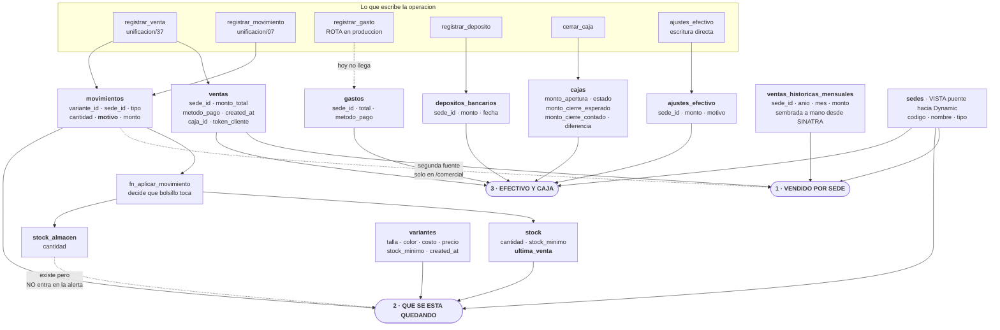
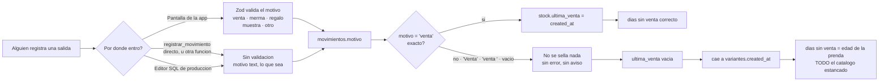
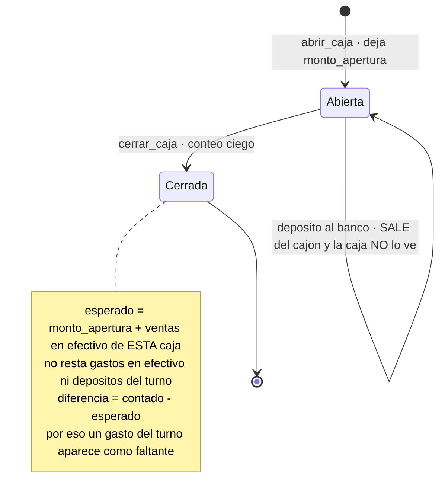

# 11 · Los números que Felipe mira primero

> **Qué es esto.** Felipe marcó tres números que mira antes que ningún otro
> (**D-52**). Este archivo existe para que esos tres sean los más confiables
> de todo el sistema. Por cada uno dice cuatro cosas, en este orden:
>
> 1. **Qué responde**, en lenguaje de negocio.
> 2. **De qué tablas y columnas cuelga** — nombre exacto.
> 3. **Dónde se calcula** — archivo:línea.
> 4. **Qué lo rompe.** Esta última es la razón de ser del archivo. Un número
>    que se rompe con un error en pantalla se arregla. Un número que se rompe
>    en silencio se sigue usando para decidir compras.
>
> **Qué NO es.** No es el capítulo del módulo de Inteligencia. Ese es
> [`modulos/13-inteligencia-y-reportes.md`](modulos/13-inteligencia-y-reportes.md)
> (🦅 Águila), y ahí está la mecánica completa: la única tabla del módulo,
> sus policies, los 15 huecos del código. Acá está la vista desde el negocio:
> **qué número muere si tocas qué columna.** Los dos se leen juntos; ninguno
> repite al otro.
>
> *(Este archivo cierra el hueco 14 de ese módulo: el acta nombraba
> `11-KPIS.md` y el archivo no existía.)*
>
> **Convención.** Cuando algo está decidido en el acta pero todavía no existe
> en la base, va marcado así: **decidido, no construido**.

---

## Cómo está cada número hoy

| # | Número | Dónde se ve | De qué cuelga | Confianza |
|---|---|---|---|---|
| **1** | **Vendido por sede** (hoy y mes) | `/`, `/finanzas`, `/finanzas/comparativo`, `/comercial` | `ventas` + `ventas_historicas_mensuales` + `movimientos` | **Media.** Hay dos fuentes para el mismo número y el precio cobrado lo teclea quien cobra |
| **2** | **Qué se está quedando** | `/comercial`, `/inventario`, `/producto/[varianteId]` | `stock.ultima_venta` + `movimientos.motivo` + `variantes` | **Baja.** Cuelga entero de una comparación de texto libre y de un relleno que nunca se corrió |
| **3** | **Efectivo y caja** | `/finanzas/efectivo`, cierre de caja en `/vender` | `ventas` + `gastos` + `depositos_bancarios` + `ajustes_efectivo` + `cajas` | **Media, y peor de lo que parece.** Dos definiciones distintas de "cuánto debería haber", y hoy en producción **ningún gasto puede llegar al cuadre** |

### El volumen real, hoy

Verificado contra producción el 2026-09-12 (`generado/retail_filas.json`):

| Tabla | Filas |
|---|---|
| `movimientos` | 28 |
| `variantes` / `productos` | 19 / 5 |
| `stock` / `stock_almacen` | 10 / 4 |
| `cajas` | 5 |
| `ventas` | **2** |
| `ventas_historicas_mensuales` | 12 (sembradas del Excel) |
| `gastos` · `depositos_bancarios` · `ajustes_efectivo` | **0 · 0 · 0** |

Léelo así: **ninguno de los tres números se ha estresado todavía.** Lo que
sigue no son riesgos teóricos — es la lista de lo que va a aparecer el primer
mes de operación de verdad, cuando 2 ventas sean 2.000.

---

## De qué columna cuelga cada número



Las tres cajas redondeadas son los tres números. Todo lo que les apunta es una
columna que, si cambia de nombre, de tipo o de significado, **cambia el número
sin avisarle a nadie**.

Y una que conviene leer dos veces: **`sedes` no es una tabla.** Es una vista
sobre `public.sedes` de Dynamic más `retail.sede_meta`
(`unificacion/03_candados.sql:14-19`). Lo mismo `retail.personas`. El "por sede"
de los tres números depende de que el sistema de personal siga respondiendo.

---

# Número 1 · Vendido por sede

## Qué responde

"¿Cuánto vendió cada tienda hoy?" y "¿cómo va este mes contra el anterior, y
contra el mismo mes del año pasado?".

## De qué tablas y columnas sale

**La tabla que manda es `ventas`** (`unificacion/05_operacion.sql:65-74`):

| Columna | Tipo | Qué aporta al número |
|---|---|---|
| `sede_id` | uuid, obligatorio, FK a `public.sedes` | Es el "por sede" |
| `monto_total` | `numeric(12,2)`, obligatorio | Es el número |
| `created_at` | `timestamptz`, default `now()` | Es el "hoy" y el "este mes" |
| `metodo_pago` | text con `check (metodo_pago in ('efectivo','pos','yape','transferencia'))` | Separa lo que entra al cajón de lo que no |
| `caja_id` | uuid, obligatorio, FK a `retail.cajas` | Ata la venta a un turno |
| `token_cliente` | uuid, índice único `ventas_token_cliente_key` (`unificacion/34:96-106`) | Impide cobrar dos veces por un reintento |

**El pasado vive en `ventas_historicas_mensuales`** (`sede_id`, `anio`, `mes`,
`monto`, con `unique (sede_id, anio, mes)`): los meses anteriores a que
existiera el sistema, los que estaban en el Excel SINATRA. 12 filas reales.

**La segunda fuente, la que casi nadie sabe que existe:** `/comercial` no suma
`ventas.monto_total`. Suma `movimientos.monto` de las filas con
`tipo = 'salida'` y `motivo = 'venta'`
(`apps/web/app/(app)/comercial/page.tsx:66-69`). Dos caminos distintos al mismo
número.

## Dónde se calcula

| Vista | Función | Archivo |
|---|---|---|
| Hoy por sede + tendencia de 14 días | `getPanelInicio` | `apps/web/lib/panel.ts:56-125` |
| La aritmética de "qué día es hoy en Lima" | `diaLima`, `indiceEnSerie`, `hastaEstaHora` | `apps/web/lib/panel-serie.ts:29-63` |
| Mes calendario por sede | `getEERRMensual` | `apps/web/lib/finanzas-nucleo.ts:44` |
| Año contra año | `getComparativoAnual` | `apps/web/lib/finanzas-nucleo.ts:185` |
| Comparativo entre sedes, 30 días | consulta suelta en la página | `apps/web/app/(app)/comercial/page.tsx:66-69` |

Dos cosas están bien hechas y **no hay que romperlas**:

- **Todo se cuenta en hora de Lima, no del servidor.** `panel-serie.ts:13` y
  `finanzas-nucleo.ts:11` restan 5 horas fijas. Una venta de las 11 de la noche
  en Trujillo cuenta como hoy. Perú no cambia la hora en verano, así que el
  desfase fijo es correcto y no hace falta librería de zonas horarias.
- **El comparativo contra la semana pasada corta a la misma hora.** A las 10 de
  la mañana de un martes, el martes anterior solo cuenta hasta sus 10
  (`hastaEstaHora`, `panel-serie.ts:63`). Sin eso, todas las mañanas el número
  saldría en rojo sin significar nada.

## Qué lo rompe

**a) Dos fuentes, y nada las obliga a cuadrar.** Inicio y Finanzas suman
`ventas.monto_total`; Comercial suma `movimientos.monto` con `motivo = 'venta'`.
Coinciden **solo** porque `registrar_venta` escribe las dos cosas en la misma
transacción. Una fila metida a mano con
`registrar_movimiento(..., p_motivo => 'venta', p_monto => 120)` aparece en
Comercial y **no** en el Inicio. Ninguna regla de la base lo impide.

**b) El precio cobrado lo teclea quien cobra, y el descuento no se registra.**
`registrar_venta` no lee `variantes.precio`: recibe un `monto` por línea desde
la pantalla.

```
RegistrarVentaModal.tsx:137        monto: v.precio ?? 0      ← lo precarga
RegistrarVentaModal.tsx:162-165    actualizar(id,"monto",…)  ← lo deja pisar
RegistrarVentaModal.tsx:401-409    <input type="number" …>   ← el campo editable
RegistrarVentaModal.tsx:235-238    p_items[].monto           ← lo que viaja
```

Así se hace hoy un descuento: pisando el precio. El total vendido queda bien;
lo que se pierde es el par **precio de lista / precio cobrado / motivo**. Es el
hueco exacto de **D-44** — *decidido, no construido*: faltan tres columnas en la
línea de la venta.

**c) Los rótulos de sede mienten en producción.** `panel.ts:82` y `panel.ts:121`
muestran `sedes.codigo` tal cual. En producción los códigos son `TRU`, `AQP`,
**`003` para la tienda de Lima** y **`LIM` para el Taller**, más `CCO`
(`packages/shared/src/enums.ts:5-7`). O sea: la columna que dice "LIM" en el
tablero **es el Taller, no la tienda**. La función que lo arregla ya existe —
`etiquetaSede` en `apps/web/lib/etiqueta-sede.ts:41`, devuelve "TND LIM" y
"TLL LIM" — pero hoy solo se usa en el menú y en `persona.ts`, no en los números.
Arreglarlo es cambiar `s.codigo` por `etiquetaSede(s)` en esos dos lugares.

**d) El año pasado es editable, y sembrar dos veces duplica.**
`ventas_historicas_mensuales` se sembró a mano y se sigue editando desde
`/finanzas/comparativo` (`HistoricosEditor.tsx:48-49`, `upsert` directo, sin
RPC). En el mes del corte los dos orígenes **se suman**, no se pisan
(`finanzas-nucleo.ts:174-177`) — está hecho a propósito y está bien. Pero el
editor ofrece 2023-2026 y **no marca qué mes ya tiene ventas del sistema**:
sembrar agosto 2026 "para completar" lo duplica en silencio, el año aparece
creciendo, y la compra del mes siguiente se decide sobre el doble de lo real.

**e) Nada se resta.** No existe la devolución de clienta como tipo de movimiento
(**D-43**): hoy se disfraza de ajuste. Y `comprobantes.venta_id` acepta vacío y
**está siempre vacío** (**D-34**), así que una boleta anulada no sabe qué venta
anular. El vendido por sede es hoy un número que **solo sube**.

**f) Nada cierra el mes.** **D-23**: un mes dado por bueno no debería aceptar
escrituras sin abrirlo a propósito. Hoy **no existe ninguna tabla ni función que
cierre un mes** — *decidido, no construido*. Una venta con fecha vieja, o una
corrección, cambian un mes que ya se reportó.

**g) La venta que todavía está en el bolsillo de la vendedora.** Una venta
atrapada en la cola sin internet (`apps/web/lib/ventas-offline.ts`) no existe
para el número de hoy: sale corto y se corrige solo cuando sube. Es el precio
consciente de **D-49** (la caja no se congela nunca), no un error — pero hay que
saberlo antes de preguntar por qué TRU "no vendió" el día que se cayó el wifi.

---

# Número 2 · Qué se está quedando

Este es el número que Felipe señaló como la ventaja de CAYLA frente a Bsale y
Alegra, y el diagnóstico es correcto: esos sistemas tratan la prenda como un
código plano. Acá el stock, las ventas y los códigos cuelgan **siempre de la
variante** — esa blusa, en talla M, en color vino. Por eso el sistema *puede*
decir **la M vino se está quedando**, que es la frase que ningún sistema
contable dice.

Es también, hoy, **el menos confiable de los tres.** Conviene que se sepa antes
de usarlo para comprar temporada.

## Qué responde

"¿Qué prendas y qué tallas no se mueven, y en qué tienda están paradas?" Y su
reverso: "¿qué repongo ya?" y "¿qué conviene mover de una tienda a otra?".

## De qué tablas y columnas sale

| Tabla | Columnas | Para qué |
|---|---|---|
| `stock` | `variante_id`, `sede_id`, `cantidad`, `stock_minimo`, **`ultima_venta`** (`unificacion/05_operacion.sql:191`) | Lo que hay en el piso y cuándo se vendió por última vez |
| `stock_almacen` | `variante_id`, `sede_id`, `cantidad` | Lo guardado en el almacén de esa misma sede |
| `variantes` | `id`, `sku`, `codigo`, `talla`, `color`, `costo`, `precio`, `stock_minimo`, `created_at` | Qué prenda es, cuánto vale, desde cuándo existe |
| `movimientos` | `variante_id`, `tipo`, `cantidad`, **`motivo`**, `monto`, `created_at` | Cuántas se vendieron en la ventana y por cuánta plata |

**La columna crítica es `stock.ultima_venta`.** Es la que decide "días sin
venta", que es el corazón del número.

## Dónde se calcula

`getCatalogoInteligente` (`apps/web/lib/inteligencia.ts:50`), montada sobre
`getCatalogoConStock` (`apps/web/lib/catalogo.ts`). Ventana por defecto: 30 días.

| Campo | Cómo se calcula | Línea |
|---|---|---|
| `vendidasVentana` | Σ `movimientos.cantidad` con `tipo='salida'` **y** `motivo='venta'` | `inteligencia.ts:77` |
| `velocidadDiaria` | `vendidasVentana / ventanaDias` | `inteligencia.ts:108` |
| `diasSinVenta` | Hoy − `stock.ultima_venta`; **si está vacía, cae a `variantes.created_at`** | `inteligencia.ts:115-116` |
| `estancado` | `stockTotal > 0` **y** `diasSinVenta > 45` | `inteligencia.ts:117` |
| `reorderPoint` | `velocidadDiaria × 14 + stock_minimo` | `inteligencia.ts:119` |
| `sedesBajoMinimo` | Sedes con stock de piso bajo su propio mínimo | `inteligencia.ts:121-124` |
| `claseABC` | Pareto 80/15/5 por monto vendido en la ventana | `inteligencia.ts:88-104` |
| `sellThrough` | `vendidas / (vendidas + stockTotal)` | `inteligencia.ts:128` |
| `sugerenciaTraslado` | La sede bajo su límite y la que tiene sobrante para cederle | `inteligencia.ts:133-167` |

Los dos umbrales viven en `packages/shared/src/enums.ts:41-42`
(`UMBRAL_ESTANCADO_DIAS = 45`, `LEAD_TIME_DIAS = 14`). No hay tabla de
configuración: se cambian ahí y afectan a todas las sedes por igual.

## De qué depende su exactitud

De una sola cosa, y conviene decirlo crudo:

> **De que la palabra `venta` esté escrita exactamente así —minúsculas, sin
> espacios, sin tilde— en la columna `movimientos.motivo`.**

## Qué lo rompe

**a) `motivo` es texto libre sin ninguna validación en la base.** En
`unificacion/05_operacion.sql:208` la columna es literalmente `motivo text,`.
Sin `check`, sin lista cerrada, y acepta vacío. Compárese con la columna de al
lado, dos líneas arriba:

```sql
-- unificacion/05_operacion.sql:206-209
tipo   text not null check (tipo in ('entrada','salida','ajuste','traslado')),
cantidad integer not null,
motivo text,
canal  text check (canal in ('tienda','online')),
```

`tipo` tiene candado. `canal` tiene candado. **`motivo`, que es del que cuelga
el número, no.**

**b) La única validación vive en la aplicación y no cubre a nadie más.**
`movimientoInputSchema` (`packages/shared/src/schemas.ts:31`) exige que el
motivo de una salida esté en `venta`/`merma`/`regalo`/`muestra`/`otro`. Pero
`registrar_movimiento` recibe `p_motivo text` y lo **inserta tal cual**. Lo que
no pase por esa pantalla —el Editor SQL de producción (D-11), otra función, una
carga masiva— escribe lo que quiera.

**Y el propio sistema ya lo demuestra:** `cerrar_produccion` escribe
`motivo = 'Producción del taller'` —mayúscula y tilde—
(`unificacion/09_funciones_produccion.sql:96-98`). Es una `entrada`, así que hoy
no rompe nada. Pero es la prueba de que nadie está vigilando la grafía.

**c) La comparación exacta `motivo = 'venta'` está repetida en seis lugares.**
Si una sola fila entra con otra grafía, los seis la ignoran **en silencio**: no
hay error, no hay aviso, el número simplemente sale más bajo.

| Dónde | Archivo:línea |
|---|---|
| Al sellar la fecha de última venta | `unificacion/27_ajuste_con_signo.sql:197` |
| Al reconstruir el stock del piso | `unificacion/25_recalcular_stock_neto.sql:92` |
| Al reconstruir el stock del almacén | `unificacion/35_recalcular_stock_almacen.sql:126` |
| En el relleno histórico | `unificacion/26_ultima_venta_en_aplicar_movimiento.sql:163` |
| Velocidad y clase ABC | `apps/web/lib/inteligencia.ts:77` |
| El comparativo de Comercial | `apps/web/app/(app)/comercial/page.tsx:69` |

Y hay un séptimo que no es de este número pero sí de la plata: el COGS del
estado de resultados filtra `.in("motivo", ["venta","merma"])`
(`finanzas-nucleo.ts:57`). Una grafía rara también le baja el costo de lo
vendido, o sea que **infla la utilidad**.

Para dimensionar lo suelto que está el campo, estos son motivos que el propio
SQL del repo escribe hoy, con tildes, mayúsculas y espacios: `venta`, `merma`,
`conteo`, `ingreso`, `ingreso de lote`, `bajada a piso`, `bajada de almacén`,
`devolución a almacén`, `produccion`, `traslado`, `ajuste`,
`Producción del taller`. Una lista cerrada en la base es una migración corta y
cierra el agujero entero. **Decidido en espíritu, no construido.**



**d) El relleno histórico de `ultima_venta` nunca se confirmó en producción.**
La historia, en orden:

1. `stock.ultima_venta` existe como columna desde el primer día de la
   unificación (`unificacion/05_operacion.sql:191`), **pero nadie la escribía**:
   `12_almacen_interno.sql` reescribió `fn_aplicar_movimiento` partiendo de un
   cuerpo viejo y perdió la línea por el camino.
2. `unificacion/26_ultima_venta_en_aplicar_movimiento.sql` la restauró y traía
   además un **relleno** que recuperaba la fecha desde `movimientos`, que es
   donde la verdad siempre estuvo.
3. `unificacion/27_ajuste_con_signo.sql:197` reemplaza la misma función e
   **incluye la línea**, así que sella bien de acá en adelante. Pero **`27` no
   trae el relleno**.
4. `retail.migraciones_aplicadas` registra `27` como aplicada el **2026-09-09**,
   verificada en vivo el 2026-09-10
   (`unificacion/38_migraciones_aplicadas.sql:87`). **`26` no aparece en esa
   lista.**

Resultado práctico: **toda venta anterior al 2026-09-09 probablemente no tiene
fecha en `ultima_venta`**. Y cuando está vacía, `inteligencia.ts:115` cae a
`variantes.created_at` — o sea que *"días sin venta" pasa a medir la edad de la
prenda*, y **todo el catálogo con stock se marca estancado para siempre**.

Peor: el número no lleva etiqueta. La pantalla muestra igual "45 días sin
venta" cuando la prenda se vendió hace 45 días y cuando nunca se vendió. Falta
el tercer estado — **"nunca se vendió"** — que hoy se disfraza de "se vendió
hace mucho". Es exactamente lo que ADR-0021 prohíbe: *datos viejos, nunca datos
distintos*.

Cómo se verifica contra producción, en un minuto:

```sql
-- los dos números tienen que coincidir
select count(*) from retail.stock where ultima_venta is not null;
select count(*) from (
  select 1 from retail.movimientos
  where tipo = 'salida' and motivo = 'venta'
  group by variante_id, sede_id) t;
```

Si no coinciden, el arreglo es pegar el bloque de relleno de `unificacion/26`:
es un `update`, no toca esquema ni funciones.

**e) Las alertas solo miran el piso, nunca el almacén.** `stockTotal` es la suma
del piso de venta. `stockAlmacenTotal` se calcula y se devuelve
(`catalogo.ts:129`) pero **no entra** ni en `reponerYa` ni en `sedesBajoMinimo`
ni en la sugerencia de traslado. **D-39** pidió justo lo contrario: *"quedan 2 en
piso y 8 en almacén — baja mercadería"*. Hoy esa tienda aparece como que hay que
comprar más. **Decidido, no construido.**

> **Ganas:** la alerta pasa de "comprá" a "bajá lo que ya tenés" — gratis e
> inmediato.
> **Pagas:** hay que decidir si el punto de reposición se calcula sobre los dos
> bolsillos juntos, o si el almacén solo cambia el texto del aviso. Son dos
> comportamientos distintos y hay que elegir uno.

**f) Una prenda que está toda en el almacén nunca aparece como estancada.**
`estancado` exige `stockTotal > 0`, y `stockTotal` es solo el piso
(`inteligencia.ts:117`). Si las 12 unidades están en cajas sin abrir, el sistema
dice que no hay nada estancado. Es, justamente, la plata más dormida que hay.

**g) El número cambia según quién mira, y la pantalla no lo dice.** `claseABC`,
`sellThrough`, `montoVentana` y `sugerenciaTraslado` se calculan solo si
`persona.rol === "lider"` (`inteligencia.ts:55`); para un Integrante llegan en
`null`. Y hay algo más fino: las policies de producción `stock_select` y
`movimientos_select` filtran por `retail.puede_operar_sede(sede_id)`
(`unificacion/05_operacion.sql:199` y `:223`), así que para un Integrante el
`stockTotal` y la `velocidadDiaria` se construyen **sobre su tienda sola** — con
el mismo nombre de campo y la misma pantalla. Quien está en TRU ve "quedan 3,
repón ya" de algo que en la red tiene 40.

---

# Número 3 · Efectivo y caja

## Qué responde

Tres preguntas que en la práctica son una: **cuánta plata debería haber en cada
cajón**, **cuánto se llevó al banco**, y **si al cerrar el día lo contado
coincidió con lo esperado**.

## De qué tablas y columnas sale

| Tabla | Columnas | Qué aporta |
|---|---|---|
| `ventas` | `sede_id`, `monto_total`, `metodo_pago` | Lo que entró al cajón: solo `metodo_pago = 'efectivo'` |
| `gastos` | `sede_id`, `total`, `metodo_pago` (`unificacion/05_operacion.sql:84-95`) | Lo que salió del cajón |
| `depositos_bancarios` | `sede_id`, `monto`, `fecha` (`:101-109`) | Lo que salió hacia el banco |
| `ajustes_efectivo` | `sede_id`, `monto`, `motivo not null` (`:117-125`) | Saldo inicial, sobrantes y faltantes |
| `cajas` | `monto_apertura`, `monto_cierre_esperado`, `monto_cierre_contado`, `diferencia`, `estado`, `cerrada_en` | El turno y su cuadre del día |

## Dónde se calcula

**El cuadre continuo** — `getCuadreEfectivo` (`finanzas-nucleo.ts:121`), pantalla
`/finanzas/efectivo`:

```
teorico = Σ ajustes_efectivo.monto                              (:127)
        + Σ ventas.monto_total  where metodo_pago = 'efectivo'  (:128)
        − Σ gastos.total        where metodo_pago = 'efectivo'  (:129)
        − Σ depositos_bancarios.monto                           (:130)
                                                    → el cálculo en :162
```

**El cierre del día** — `retail.cerrar_caja`
(`unificacion/07_funciones_operacion.sql:106-130`):

```
esperado   = cajas.monto_apertura
           + Σ ventas.monto_total de ESA caja con metodo_pago = 'efectivo'
diferencia = contado − esperado
```

El cierre es con **conteo ciego**: quien cierra cuenta los billetes sin ver
cuánto debería haber; el esperado lo calcula el servidor y se compara después.
Es una decisión de control, no de comodidad.

## De qué depende su exactitud

1. **Que haya una sola caja abierta por sede.** El índice único parcial
   `cajas_sede_abierta_unique` (`... where estado = 'abierta'`) lo hace
   imposible en la base. Sólido.
2. **Que no se pueda vender en una caja cerrada.** `cerrar_caja` y
   `registrar_venta` levantan `'Esta caja ya está cerrada'` antes de escribir
   nada. Sólido.
3. **Que el candado de sede no devuelva NULL.** `cerrar_caja` valida con
   `if retail.puede_operar_sede(v_caja.sede_id) is not true`
   (`unificacion/07:117`), y en producción esa función usa `coalesce(..., false)`
   (`unificacion/03_candados.sql:76-78`). **Ese hueco está cerrado en las tiendas
   y abierto en tu máquina:** el `fn_puede_operar_sede` local
   (`migrations/0012_rpc_valida_sede.sql:15-26`) devuelve NULL cuando la persona
   no tiene sede, y `not null` **no es true** — el `raise` no dispara. Es al
   revés de lo que uno supondría: acá producción es la que está bien.
4. **Que el método de pago esté escrito exactamente `efectivo`.** En `ventas` la
   base lo garantiza con un `check` (`05_operacion.sql:69`). En `gastos`, **no**.
5. **Que alguien cargue el saldo inicial del cajón.** Mientras nadie registre el
   primer ajuste, el teórico arranca en cero y no es el dinero real.

## Qué lo rompe

**a) Hoy, en producción, un gasto no puede llegar al cuadre. Por dos motivos
encadenados.** Este es el hallazgo más caro de la sección y no estaba escrito en
ningún lado:

1. **La pantalla está rota.** `RegistrarGastoModal.tsx:57` llama a
   `registrar_gasto` mandando `p_metodo_pago` (línea 64). En producción
   `retail.registrar_gasto` acepta **6 parámetros** y ese no está entre ellos
   (`unificacion/07_funciones_operacion.sql:175-178`, confirmado contra la base
   en `generado/DRIFT.md` y en `generado/funciones-produccion.txt`). La llamada
   falla **siempre**, no de a ratos. Por eso `gastos` tiene 0 filas.
2. **Y arreglarla quitando el parámetro no alcanza.** El `insert` de esa misma
   función **no escribe `metodo_pago`** (`unificacion/07:185-187`): la columna
   queda en NULL. Y `getCuadreEfectivo` filtra `.eq("metodo_pago","efectivo")`
   (`finanzas-nucleo.ts:129`), y **NULL nunca iguala a nada**. O sea: el gasto se
   guardaría, la pantalla de Efectivo no lo restaría nunca, y el teórico saldría
   siempre de más.

El arreglo completo son dos pasos, no uno: **agregar `p_metodo_pago` a la
función de producción y hacer que el `insert` lo escriba.** Cambiar solo la
pantalla deja el número silenciosamente inflado, que es peor que la pantalla
rota — la rota al menos avisa.

**b) Hay dos definiciones distintas de "cuánto debería haber".** La más fácil de
pasar por alto:

| | `cerrar_caja` (el cierre del día) | `getCuadreEfectivo` (la pantalla) |
|---|---|---|
| Saldo inicial | `cajas.monto_apertura` | `Σ ajustes_efectivo` |
| Ventas en efectivo | Solo las de **esa caja** | **Todas**, de toda la historia |
| Gastos en efectivo | **No los resta** | Los resta (cuando lleguen) |
| Depósitos al banco | **No los resta** | Los resta |
| Período | El turno | Desde el principio de los tiempos |

Consecuencia concreta: si durante el turno alguien paga un flete de S/80 en
efectivo sacándolo del cajón, al cerrar **la caja aparece con S/80 de faltante**
y alguien se pone a buscar plata que no se perdió. En Efectivo ese mismo gasto
ya está descontado. Dos pantallas, dos verdades.

**c) Los gastos y los depósitos no saben a qué turno pertenecen.** Ni `gastos`
ni `depositos_bancarios` tienen columna `caja_id`: solo `created_at` / `fecha`
(`unificacion/05_operacion.sql:84-109`). Por eso `cerrar_caja` no los puede
restar aunque quisiera. **Agregar `caja_id` a esas dos tablas es lo que cierra
el punto (b).** Decidido en espíritu por D-52, no construido.

**d) El método de pago del gasto no está protegido por la base.** En la tabla,
`metodo_pago` es `text` a secas (`05_operacion.sql:94`). La lista permitida
—`efectivo`/`banco`/`yape`/`tarjeta`— vive **dentro de la pantalla**, no en la
base ni en la función. Es el mismo agujero que `movimientos.motivo`, en otra
tabla y con plata encima.

**e) Las dos listas de métodos de pago no son la misma.** Ventas usa
`efectivo`/`pos`/`yape`/`transferencia` (con `check`); gastos usa
`efectivo`/`banco`/`yape`/`tarjeta` (sin `check`). Coinciden solo en `efectivo`
y `yape`. No rompe nada hoy —el cuadre solo mira `efectivo`— pero cualquier
informe que quiera cruzar "entró por Yape / salió por Yape" se tropieza acá.

**f) Un depósito puede ser negativo.** `depositos_bancarios.monto` es
`numeric(12,2) not null` **sin check de signo** (`05_operacion.sql:105`). Un
depósito de −500 *suma* 500 al efectivo teórico. Compárese con `gastos`, que sí
tiene `check (total > 0)` dos líneas arriba (`:90`). Es una línea de migración.

**g) El cuadre no tiene fecha de corte.** `getCuadreEfectivo` no filtra por
fecha: suma toda la historia (`finanzas-nucleo.ts:127-130`). Con 2 ventas no se
nota; con un año de operación, "cuánta plata hay" es la suma de todo lo que pasó
desde el principio, y un error de hace ocho meses se sigue arrastrando. La
solución es la misma que para el número 1: **cerrar el mes con llave (D-23)**,
que hoy no existe. Y hay un techo encima: ninguna de esas consultas lleva
`limit` ni `order by`, y el límite de filas de la API corta en silencio — está
documentado como el hueco más grave del módulo 13.

**h) `ajustes_efectivo` es la puerta que tapa todo.** Es la única forma de
cargar el saldo inicial y **también la única forma de hacer que un descuadre
desaparezca**. Guarda `usuario_id` y un `motivo not null`
(`05_operacion.sql:122`), así que queda rastro de quién y por qué — pero nada
obliga a que ese "por qué" sea informativo. Es la primera columna que hay que
mirar cuando un número de efectivo se vea raro.

**i) Quien puede tocar la plata no es el Líder de equipo, es Felipe.** Las
policies de `gastos` y `ajustes_efectivo` exigen `retail.es_lider()`
(`05_operacion.sql:98` y `:128`), y en producción esa función es
`coalesce(public.fn_rol_actual() = 'admin', false)`
(`unificacion/03_candados.sql:62-64`). El rol `supervisor_sede` —que es el
**Líder de equipo** real de **D-12**— **no pasa**. O sea: hoy la persona que
cierra la tienda no puede registrar el gasto ni cargar el saldo inicial de su
propio cajón. **D-13** dice que sí debería. *Decidido, no construido.*



---

# El segundo anillo

Estos no son los tres de D-52, pero son de los que salen las decisiones de
compra y de plata. Van con el mismo formato, más corto.

## Rotación y clase ABC

| | |
|---|---|
| **Qué responde** | Qué vuela, qué camina y qué está muerto — ordenado por plata, no por unidades |
| **De qué cuelga** | `movimientos.monto` y `movimientos.cantidad`, filtrados por `motivo='venta'` |
| **Dónde** | `inteligencia.ts:77` (el filtro), `:88-104` (el Pareto 80/15/5) |
| **Qué lo rompe** | (1) La grafía de `motivo`, igual que el número 2. (2) **Ordena por ingreso, no por margen**: una prenda rematada al costo puede coronar como clase A. (3) El monto es el que tecleó quien cobró (D-44). Y el corte se hace sobre el acumulado **previo**, a propósito, para que un solo producto que ya es el 90% del negocio caiga en A y no quede empujado a C (`inteligencia.ts:96-102`) |

## Sugerencias de traslado

| | |
|---|---|
| **Qué responde** | "AQP se quedó sin la M vino y TRU tiene 6: mandá 2" |
| **De qué cuelga** | `stock.cantidad` y `stock.stock_minimo` **por sede**, con `variantes.stock_minimo` como respaldo general |
| **Dónde** | `inteligencia.ts:133-167`. El mínimo por sede lo fija el Líder desde `/producto/[varianteId]` (RPC `fijar_stock_minimo`) |
| **Qué lo rompe** | **Solo mira el piso.** `stockAlmacenPorSede` existe en la misma estructura (`catalogo.ts:128`) y no se consulta. Consecuencia real: el sistema propone un traslado Arequipa→Trujillo mientras Trujillo tiene 20 de esa talla en su propio almacén sin bajar. Alguien maneja entre ciudades lo que se resolvía con una escalera. Contradice D-39 y D-42 |

## Margen por prenda — y por qué hoy está sucio por los dos lados

| | |
|---|---|
| **Qué responde** | "¿Cuánto gané de verdad con esta blusa?" |
| **De qué cuelga** | Numerador: `movimientos.monto` / `ventas.monto_total`. Denominador: `variantes.costo` |
| **Dónde** | `finanzas-nucleo.ts:87` (COGS = costo de hoy × cantidad vendida), `:96` (`margenBrutoPct`) |

Está sucio **arriba y abajo a la vez**:

- **Arriba, por los descuentos invisibles (D-44).** El monto guardado es lo que
  se cobró, sin registro de cuánto se bajó ni por qué. Un descuento autorizado
  del 30% y un error de tipeo se ven idénticos en la base. Así, **un margen bajo
  no distingue "vendimos barato" de "compramos caro"**.
- **Abajo, porque hay un solo costo por prenda y el nuevo pisa al viejo
  (D-45, ⏳ abierta).** `variantes.costo` es una columna sola. La reescriben
  `registrar_produccion` (`unificacion/09:157` y `unificacion/11:93`) y una
  pantalla directo, sin RPC (`components/RecetaCosto.tsx:77`). Como el COGS
  multiplica **el costo de hoy** por lo vendido en el mes que estés mirando,
  **cerrar marzo hoy da un número distinto del que dio en abril**. Ningún margen
  histórico es reproducible.

Felipe lo dejó abierto a propósito: *"es un tema contable, existen métodos, no sé
si es necesario ese nivel de detalle ahora"*. Los tres métodos para decidir con
el contador son **promedio ponderado**, **PEPS** y **costo por lote**. Hasta que
se elija uno, el margen por prenda es una estimación, no un dato. Y mientras
tanto, **el núcleo no se toca** (D-45 lo dice explícito).

## Estado de resultados por sede (D-30)

| | |
|---|---|
| **Qué responde** | "¿Cuánto ganó o perdió Arequipa en agosto?" |
| **De qué cuelga** | `ventas.monto_total` − (`variantes.costo` × salidas `motivo='venta'`) − (mismo costo × salidas `motivo='merma'`) − `gastos.total`, todo agrupado por `sedes.codigo` |
| **Dónde** | `getEERRMensual`, `finanzas-nucleo.ts:44-104`. El desglose por sede en `:95-99` |
| **Qué lo rompe** | Todo lo del margen, más lo que **no está adentro** (abajo) |

**Lo que le falta, y sin eso el resultado por sede no es real:**

- **Los sueldos (D-33).** Este sistema debe leerlos del sistema de personal.
  Comparten base en producción —`retail.personas` es una vista sobre
  `public.personas` (`unificacion/03_candados.sql:21-28`)—, así que los datos ya
  están literalmente al lado. Hoy la única forma de que un sueldo entre es
  cargarlo a mano como gasto de categoría `planilla`. **Decidido, no construido.**
- **Los gastos comunes de CCO (D-32).** El sueldo de Felipe, el contador, los
  servidores y el software van a la sede corporativa `CCO`, no repartidos a dedo
  entre tiendas. La sede existe en producción con ese código; **el entorno local
  la llama `CORP`** (`migrations/0020_contabilidad_cimientos.sql:23` y `:26`) —
  eso es un error de local que se corrige (**D-20**), no una variante aceptable.
  Y falta la función que consolide: hoy no hay ninguna que junte las sedes y
  reparta lo de CCO.
- **La consolidación formal.** `getEERRMensual` sí abre por sede;
  `getEstadosContables` (los cuatro estados financieros de `/finanzas/balances`)
  **no tiene desglose por sede en absoluto**. D-30 está cumplida a medias.

Mientras esas piezas no estén, **el margen por sede que muestra `/finanzas` está
sobrestimado**: le faltan los dos costos más grandes.

## Eficiencia del Taller (D-31)

| | |
|---|---|
| **Qué responde** | "¿Nos conviene producir acá o mandarlo a maquilar?" |
| **De qué cuelga** | `producciones.costo_tela` + `costo_avios` + `costo_maquila`, resumidos en la columna generada `producciones.costo_unitario` (`unificacion/06_contabilidad_produccion.sql:177`), que `cerrar_produccion` pega a `variantes.costo` y viaja con la prenda |
| **Dónde** | **En ningún lado.** `lib/taller.ts:34` (`getPanelTaller`) solo cuenta órdenes en proceso y terminadas sin inventariar. No hay ni un cálculo de eficiencia |

**Qué lo rompe — o mejor: qué falta para que exista.** D-31 define la medición
como *costo absorbido contra lo que se gastó*, más una **referencia de maquila
externa**. Hoy:

- **El numerador ya está.** El costo absorbido se calcula solo y se pega a la
  prenda: ese lado de D-31 está construido.
- **El denominador no existe.** Nada registra lo que el Taller gastó de verdad
  en el período (los gastos del Taller entrarían por `gastos` con `sede_id` del
  Taller — la tabla que hoy no recibe ni una fila, punto (a) del número 3).
- **La cotización de maquila no tiene dónde vivir.** No hay columna ni tabla
  para ella. **Y la columna que sí existe es la equivocada:**
  `variantes.precio_taller` (`unificacion/04_catalogo.sql:61`) y
  `producciones.precio_taller` (`06:176`) se escriben en cada producción
  (`unificacion/09:152-157`) y **nadie las lee nunca**. Eso es precio de
  transferencia interno — exactamente lo que **D-31 descartó** ("lo fija Felipe,
  así que el resultado también lo fijaría Felipe"). Hay una columna muerta
  ocupando el nombre del concepto que se descartó, y no hay ninguna para el
  concepto que se decidió.
- **Y falta el insumo (D-47).** Sin inventario de materia prima —la tela entra,
  se descuenta al cortar— el costo de tela es un número tecleado, no una
  medición. D-47 es la condición para que D-31 sea medición y no estimación.

## Sell-through por talla — la ventaja competitiva que todavía no se puede calcular

| | |
|---|---|
| **Qué responde** | "La M se agotó en dos semanas y la XL no se movió: la próxima corrida cambia de curva de tallas" |
| **De qué cuelga** | `variantes.talla` + `variantes.color` (las columnas que hacen distinta a CAYLA) cruzadas con `movimientos` de la ventana y `stock.cantidad` |
| **Dónde** | `sellThrough` se calcula **por variante** (`inteligencia.ts:128`), como `vendidas / (vendidas + stock)`. **No hay ninguna agregación por talla en ningún archivo del repo** |

**Por qué importa.** Es la frase que ningún sistema contable dice, porque tratan
la prenda como un código plano. Acá el modelo ya lo permite: el stock, las
ventas y los códigos cuelgan de la **variante**, no del producto
(`00-MAPA.md`, frase 3). La ventaja está en el esquema desde el primer día. Lo
que falta es la consulta que la use.

**Qué lo rompe hoy — y es lo primero, no lo último:** producción tiene **19
variantes, 5 productos y 2 ventas**. Con eso, cualquier sell-through por talla es
ruido con forma de número. Y la carga masiva tampoco ayuda todavía:
`producto_atributos` tiene **0 filas** y la llamada a `importar_catalogo` es la
única del sistema que el comparador **no puede revisar** (arma sus parámetros con
`...`, `generado/DRIFT.md`). Orden correcto: **catálogo real → ventas reales →
recién entonces la consulta por talla.** Construirla antes es construir sobre
nada.

---

## Antes de cambiar una columna, mira aquí

Estas son las columnas de las que cuelga un número del negocio, en orden de
cuánto duele tocarlas sin avisar:

| Columna | Qué número muere | Cómo muere |
|---|---|---|
| `movimientos.motivo` | **El número 2 entero**, más rotación, ABC, traslados y el COGS del EERR | **En silencio, en siete lugares a la vez.** Texto libre sin `check` (`unificacion/05_operacion.sql:208`) |
| `stock.ultima_venta` | "Días sin venta", "estancado", sugerencias de traslado | Cae a `variantes.created_at` y todo el catálogo sale estancado (`inteligencia.ts:115`) |
| `ventas.monto_total` | Los números 1 y 3, y el estado de resultados | Directo. Es *el* número |
| `ventas.metodo_pago` | El cuadre de efectivo y el cierre de caja | La base lo protege con `check` (`05_operacion.sql:69`). Quitar ese check es abrir el agujero de `gastos` en la tabla que sí lo tiene |
| `ventas.created_at` | El "hoy" y el "este mes" de los tres | Todo el sistema le resta 5 horas fijas (Lima). Cambiarlo a `date` o a hora local rompe la comparación a la misma hora |
| `ventas.token_cliente` + `ventas_token_cliente_key` | La honestidad del número 1 | Sin el índice único, un timeout en una tienda con mal internet **infla lo vendido** (`unificacion/34:105-106`) |
| `gastos.metodo_pago` | El cuadre de efectivo | Hoy ya está roto: la función de producción no lo escribe y NULL nunca iguala `'efectivo'` |
| `gastos.total` | El EERR por sede y el cuadre | Tiene `check (total > 0)` (`:90`). Es el único candado de signo en toda la sección de plata |
| `depositos_bancarios.monto` | El cuadre de efectivo | **No tiene check de signo.** Un negativo suma al teórico (`:105`) |
| `variantes.costo` | Margen, clase ABC, COGS, valor del inventario, patrimonio | Se pisa en cada producción. El margen del pasado cambia solo (D-45) |
| `variantes.talla` / `variantes.color` | Sell-through por talla, o sea la ventaja competitiva entera | Sin ellas CAYLA es Bsale |
| `sedes.codigo` / `sedes.tipo` | El "por sede" de los tres | `sedes` es una **vista** sobre Dynamic. Si deja de responder, los números existen pero no se reparten. Y `codigo` ya miente: `LIM` es el Taller |
| `cajas.diferencia` | La respuesta a "¿cuadró la caja?" | La calcula `cerrar_caja` y nadie más debería escribirla |
| `producciones.costo_unitario` | La eficiencia del Taller, el día que se mida | Es una columna **generada** (`06:177`). No se escribe: se cambia cambiando sus tres sumandos |

**El recorrido mínimo antes de tocar cualquiera de ellas:** buscar el nombre de
la columna en este archivo → abrir los archivos que la sección nombra → escribir
la nota corta de qué cambiaste, por qué, y qué se rompía sin eso (**D-10**, el
formato tipo ADR de `07-GOBIERNO.md`). Si además el cambio va a producción,
lo pega Felipe y queda anotado (**D-11**).

> **Ninguna de estas es una columna cualquiera. Cada una es un número con el que
> se toman decisiones de compra y de plata.**

---

*Gobernado por **D-52** (los tres números y el orden en que se miran), **D-30**
(estado de resultados por sede), **D-31** (el Taller se mide por eficiencia y
contra maquila externa, nunca por precio de transferencia), **D-32** (los gastos
comunes van a `CCO`), **D-33** (los sueldos se leen del sistema de personal),
**D-39** (las alertas cuentan piso y almacén), **D-43** y **D-34** (devoluciones
y boleta atada a su venta: hoy nada se resta), **D-44** (los descuentos no se
registran), **D-45 ⏳** (un solo costo por prenda — abierta, se decide con el
contador), **D-23** (cerrar el mes con llave), **D-20** (`CCO`, no `CORP`),
**D-13** y **D-12** (quién puede tocar la plata: hoy solo Admin) y **D-47**
(sin insumos del Taller, D-31 es estimación). El mecanismo del módulo está en
`modulos/13-inteligencia-y-reportes.md`; el acta manda sobre los dos.*
