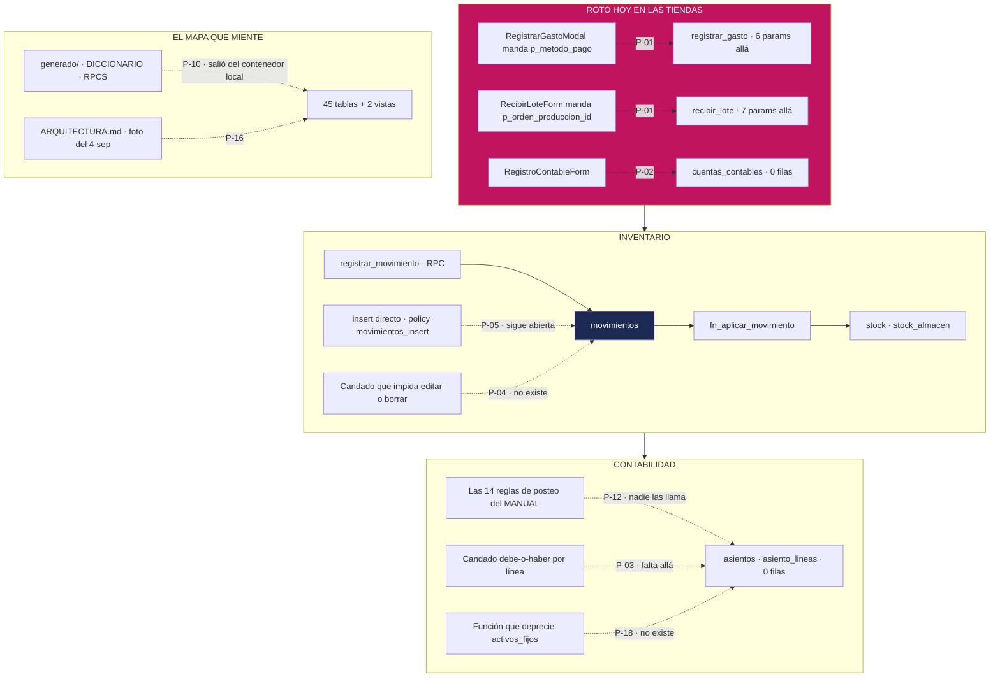
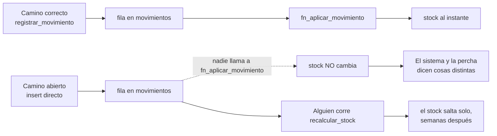

# Promesas incumplidas — con nombre y apellido

> Felipe pidió este capítulo con esas palabras: *"Sí, con nombre y apellido"* (D-24).
> Son las frases que la documentación de CAYLA **afirma** y que la base de datos **no
> hace**. Cada una se verificó contra el SQL del repo y contra el volcado de producción
> del **2026-09-12** antes de escribirse. Ninguna es una sospecha.

**Esto no existe para pasar vergüenza.** Existe porque un documento que promete de más
es peor que no tener documento. Alguien —una persona o un agente de IA— lee *"esto es
imposible en la base de datos"*, construye encima confiando en ese candado, y el candado
no está. Un candado que no existe no avisa: se descubre el día que ya pasó algo.

Cada ficha termina en una de dos cosas: **una tarea** (arreglar la base o la pantalla) o
**una corrección de texto** (retirar la promesa). Ninguna se queda como está.

---

## Cómo leer esto

| Campo | Qué trae |
|---|---|
| **Qué se promete** | La frase y dónde vive: `archivo:línea` |
| **Qué pasa de verdad** | La evidencia: nombre exacto de tabla, columna, candado o función |
| **Qué cuesta** | En la tienda o en la plata. No es una opinión de estilo |
| **Qué hacer** | Corregir la base, la pantalla, o el texto. Con el archivo |

**El orden es por daño, no por número.** Primero lo que puede costar plata o pasado.

**Dos entornos, dos verdades.** "Producción" es el schema `retail` dentro del proyecto
Supabase de `cayla-dynamic` (`vovjyyiafkxteijimpuy`), leído el 2026-09-12 — los volcados
crudos están en `generado/*.json` y `generado/funciones-produccion.txt`. "Local" es el
riel de `supabase/migrations/`. Buena parte de esta lista existe justamente porque los
dos no son lo mismo (D-16, D-17).

**Este capítulo no repite el detalle de los módulos.** Cuando una ficha necesita el
mecanismo completo, apunta al módulo que ya lo explica. Aquí está la promesa, la
evidencia y la tarea — nada más.

---

## El mapa del daño

Lo punteado es lo que **no existe**. Lo rojo está roto **hoy**, en las tiendas.



---

## A · Roto hoy, en la tienda

### P-01 · Registrar un gasto y recibir del Taller no funcionan en las tiendas

**Qué se promete.** `supabase/unificacion/31_una_sola_firma_por_funcion.sql:43-47`, bajo
el título *"QUÉ SE QUEDA (siempre la más nueva, que es la que la app llama hoy)"*, lista
`recibir_lote` con **8** argumentos y `registrar_produccion` con **15**. Y
`generado/RPCS.md:127` da `recibir_lote` con **6**.

**Qué pasa de verdad.** Ninguna de las tres es la firma real. Leído de producción el
2026-09-12 (`generado/funciones-produccion.txt:45,51`):

- `recibir_lote(p_sede_id, p_origen, p_items, p_proveedor, p_numero_guia, p_nota, p_orden_compra_id)` → **7**, sin `p_orden_produccion_id`.
- `registrar_produccion` termina en `p_material` → **16**.
- `registrar_gasto(p_sede_id, p_categoria, p_subtotal, p_igv, p_total, p_especificacion)` → **6**, sin `p_metodo_pago`.

Y dos pantallas mandan de más. No fallan a veces: fallan siempre.

| Pantalla | Manda | Producción acepta |
|---|---|---|
| `RecibirLoteForm.tsx:431` (`p_orden_produccion_id` en la 436) | 8 parámetros | los 7 de arriba |
| `RegistrarGastoModal.tsx:57` (`p_metodo_pago` en la 64) | 7 parámetros | los 6 de arriba |

La misma historia dos veces: el riel local avanzó (`0014_gasto_metodo_pago.sql`,
`0018_produccion.sql`), la pantalla se escribió contra local, y producción nunca recibió
el cambio. `generado/DRIFT.md` las tiene listadas como *"Roto en producción — 2"*.

**Qué cuesta.** Una tienda no puede registrar un gasto: la luz, el taxi, la costurera
externa. Y no puede recibir la mercadería que el Taller acaba de mandar. Eso es el
Estado de Resultados por sede (D-30) quedándose sin la mitad de su lado gasto, y
mercadería física en la percha que el sistema no sabe que llegó.

**Qué hacer. Las dos cosas.**
1. **Base:** llevar a producción `p_metodo_pago` en `registrar_gasto` y
   `p_orden_produccion_id` en `recibir_lote`. Es lo que el negocio quiere.
   Mientras tanto, quitar esos dos parámetros de las dos pantallas — eso destraba hoy.
2. **Texto:** `unificacion/31:43-47` y `unificacion/12:56-66`, con la firma real y la
   fecha de verificación.

`pnpm datos:comparar` sale con error cuando encuentra una pantalla rota (D-19). Debería
correr en cada subida, no cuando alguien se acuerda.

---

### P-02 · La tercera pantalla caída, y ninguna alarma la ve

**Qué se promete.** `docs/MANUAL-CONTABLE-CAYLA.md:21` presenta *"El plan de cuentas de
CAYLA (25 cuentas, no 500)"* como algo que existe, y
`supabase/migrations/0020_contabilidad_cimientos.sql:49-89` siembra 35 cuentas.

**Qué pasa de verdad.** En producción `retail.cuentas_contables` tiene **0 filas**
(`generado/retail_filas.json`). El `insert` de las 35 solo vive en el riel local;
`unificacion/06_contabilidad_produccion.sql:9-28` crea la tabla y no siembra una sola
fila.

La única pantalla que registra contabilidad lee esa tabla:
`apps/web/app/(app)/finanzas/registrar/page.tsx:17` hace
`.from("cuentas_contables").select(...)`. Con cero filas, el menú de cuentas sale vacío
y no hay nada que elegir. Y si alguien igual llegara a enviar,
`unificacion/08_funciones_finanzas.sql:60` levanta
`'La cuenta % no existe en el plan de cuentas'`.

**Por qué esta duele distinto que P-01.** `pnpm datos:comparar` compara **firmas**, no
**datos**. La firma de `registrar_asiento` calza perfecto. La pantalla está muerta
igual, y la alarma automática no la ve ni la va a ver.

**Qué cuesta.** El único camino construido para llevar contabilidad —el manual— no
funciona allá. Y bloquea todo lo que viene encima: P-12, P-18, y el Estado de Resultados
por sede (D-30).

**Qué hacer. Base.** Decidir con el contador cuál es el plan bueno (ver P-13) y sembrarlo
en producción con un archivo de `unificacion/`. Es DDL en el proyecto compartido, o sea
decisión de Felipe (D-11). **Y agregar a `datos:comparar` un aviso cuando una tabla que
una pantalla necesita está vacía en producción** — es el hueco que este caso destapa.

---

## B · Lo que puede costar plata o pasado

### P-03 · "Un asiento descuadrado es literalmente imposible" — es medio candado

**Qué se promete.** `docs/ARQUITECTURA.md:318-320`, §4.4 *Estados imposibles por diseño*:
*"`asiento_lineas`: `check(debe>0 xor haber>0)` + trigger deferred que exige Σdebe=Σhaber
al confirmar — un asiento descuadrado es **literalmente imposible en la base de datos**,
no solo validado en el formulario."*

**Qué pasa de verdad.** Medio sí, medio no.

- **El que sí está:** el disparador de cuadre existe en producción —
  `asiento_lineas_cuadra`, `deferrable initially deferred`
  (`unificacion/08_funciones_finanzas.sql:22-26`).
- **El que no:** el candado **por línea**. En local,
  `0020_contabilidad_cimientos.sql:115-119` crea tres reglas: `debe >= 0`, `haber >= 0` y
  `linea_debe_xor_haber`. En producción, `unificacion/06_contabilidad_produccion.sql:105-112`
  crea la tabla **sin ninguna de las tres**. El volcado lo confirma:
  `retail.asiento_lineas` tiene exactamente un candado en producción, y es su llave
  primaria (`generado/retail_constraints.json`).

Consecuencia mecánica: allá se puede escribir una línea con `debe` **y** `haber` a la
vez, o dos líneas con montos negativos que se compensan. La suma da igual y el disparador
no protesta. El asiento "cuadra" y no significa nada.

**Qué cuesta.** Hoy nada: la tabla tiene 0 filas. Mañana, todo: cuando P-12 se construya,
el posteo automático va a escribir sobre una tabla a la que le falta la mitad de sus
defensas. *"Literalmente imposible"* es exactamente la clase de frase que hace que nadie
vuelva a revisar.

**Qué hacer. Base y texto.** Un archivo nuevo en `supabase/unificacion/` que le agregue a
`retail.asiento_lineas` los tres candados. Es aditivo y la tabla está vacía: no puede
romper nada, y es el arreglo más barato de toda esta lista. Y corregir
`ARQUITECTURA.md:318` para que diga **cuál de los dos candados protege qué** — son cosas
distintas y hoy la frase los funde en una.

Detalle del módulo: `modulos/12-contabilidad.md`, ficha de `asiento_lineas`.

---

### P-04 · `movimientos` presentado como intocable, sin un solo candado

**Qué se promete.** `docs/ARQUITECTURA.md:253` — *"`movimientos` (**append-only**, fuente
de verdad — `stock` es un derivado…)"*. Y la frase 1 de `00-MAPA.md`, en esta misma
carpeta: *"Nunca se borra y nunca se edita."* Dicho así, en presente, suena a candado.

**Qué pasa de verdad.** No hay ninguno:

- Cero `force row level security` en todo el repo (`grep` sobre `supabase/` devuelve 0).
- Cero disparadores que rechacen `UPDATE` o `DELETE` sobre `movimientos`.
- `0004_grants.sql:11` concede `select, insert, update, delete` sobre **todas** las tablas
  a `authenticated`. `supabase/seed.sql:49` va más lejos:
  `grant all on all tables in schema retail to anon, authenticated, service_role`.

Lo único que hoy frena una edición es un accidente afortunado: `movimientos` tiene solo
dos políticas en producción (`movimientos_insert`, `movimientos_select`) y ninguna de
`UPDATE` ni de `DELETE`, así que el permiso por fila las rechaza. La garantía se sostiene
por lo que **falta**, no por lo que **hay** — y no cubre a la llave de servicio, al dueño
de la tabla, ni a ninguna de las **56 funciones `security definer`** de producción, que
se saltan las políticas por definición.

**Qué cuesta.** `movimientos` es la única historia real del negocio: `stock` se
reconstruye desde ahí con `recalcular_stock()`. Si se corrompe `movimientos`, no hay de
dónde reconstruir nada. Una fila editada no deja huella y cambia el pasado en silencio.

**Qué hacer. Base, ya decidido (D-22)** — disparador `before update or delete`,
`force row level security`, y quitarle `update`/`delete` a `authenticated`. El diseño
completo, con la salida de emergencia consciente para Felipe desde el SQL Editor (D-11),
está en `01-INVARIANTES.md:186` y en `modulos/05-inventario-y-movimientos.md`.

**Y corregir el texto:** `ARQUITECTURA.md:253` y la frase 1 de `00-MAPA.md` tienen que
decir **"no se debe"**, no **"no se puede"**, hasta que el candado esté pegado. Son dos
frases distintas y hoy solo una es cierta.

---

### P-05 · "La escritura pasa por el RPC, no por insert directo" — y sí pasa

**Qué se promete.** `supabase/migrations/0003_rls.sql:71-72`, en el comentario de la
sección: *"MOVIMIENTOS: mismo criterio; **la escritura real pasa por el RPC
`registrar_movimiento()` (security definer), no por insert directo**"*.

**Qué pasa de verdad.** Tres líneas más abajo, `0003_rls.sql:77-78` crea
`movimientos_insert_propia_sede`, que permite exactamente ese insert directo. En
producción la política se llama `movimientos_insert` y su condición es
`retail.puede_operar_sede(sede_id)` (`generado/retail_policies.json`): cualquier
integrante puede escribir filas en `movimientos` sin pasar por la función.

Lo que lo vuelve peligroso es que no hay disparador sobre la tabla:
`fn_aplicar_movimiento` se invoca **desde dentro** de las funciones
(`unificacion/07_funciones_operacion.sql:74`), no desde un trigger. Así que una fila
insertada a mano **no mueve el stock**. Queda dormida.



**Qué cuesta.** Es una bomba de efecto retardado, y el síntoma aparece lejos de la causa.
Nadie va a relacionar *"el stock de AQP saltó el martes"* con una fila que alguien
insertó tres semanas antes.

**Qué hacer. Base. Cerrar la puerta:** quitar la política de `insert` y dejar que solo
las funciones escriban. **Ganas:** una sola puerta, imposible equivocarse — y es lo que
el comentario de `0003_rls.sql` ya dice que pasa. **Pagas:** hay que buscar primero
cualquier script o herramienta que hoy inserte directo.

La alternativa (un disparador `after insert` que llame a `fn_aplicar_movimiento`) exige
hacer la función a prueba de repetición antes, porque en el camino normal se llamaría dos
veces. Más trabajo por menos garantía.

---

### P-06 · `comprobantes.motivo`: "texto libre" que viaja como código de SUNAT

**Qué se promete.** `docs/adr/0007-facturacion-esquema-legal-completo.md:37` —
*"`comprobantes` gana `comprobante_original_id` (FK) y `motivo` (**texto libre por ahora**
— el catálogo exacto 09/10 de SUNAT queda para cuando se conecte Nubefact en la Fase 1)"*.
La migración lo crea así: `0034_facturacion_completa.sql:129`,
`alter table comprobantes add column motivo text;`, y `emitir_nota` solo exige que no esté
vacío (`0034:186`).

**Qué pasa de verdad.** La Fase 1 llegó y nadie volvió a esa promesa.
`apps/web/app/api/lucode/emitir/route.ts:146` hace `datos.motivoCodigo = fila.motivo;` y
`apps/web/lib/lucode.ts:165-166` lo transmite como `nota_credito_codigo_tipo` — el código
del **Catálogo 09 (notas de crédito) o 10 (notas de débito) de SUNAT**. El comentario de
`lucode.ts:80-81` lo dice sin rodeos: *"es lo que `comprobantes.motivo` ya guarda desde la
Fase 0"*.

Y no hay candado sobre esa columna. `retail.comprobantes` tiene diez reglas propias en
producción (`generado/retail_constraints.json`) y ninguna toca `motivo`: la única que la
nombra es `comprobantes_nota_requiere_original`, que solo exige que no sea nula.

**Qué cuesta.** Si alguien escribe *"devolución de la clienta"* en vez de `"06"`, la nota
se emite localmente con su número ya reservado, viaja al proveedor con un código inválido,
y la rechazan. Un correlativo quemado no se recupera: anularlo es su propio trámite ante
SUNAT (ADR-0016). Es plata y es papel legal.

**Qué hacer. Base y texto.**
- Base: `check (motivo in (…))` con el catálogo que CAYLA usa de verdad — los que
  `MOTIVO_NC` y `MOTIVO_ND` de `lucode.ts:107-124` ya tienen escritos. Y que la pantalla
  ofrezca un menú, no una caja de texto.
- Texto: ADR-0007 §Decisión. El *"por ahora"* venció.

---

### P-07 · El hueco del `NULL`: abierto en local, cerrado en producción

**Qué se promete.** `supabase/migrations/0012_rpc_valida_sede.sql:6-10` presenta el
helper como defensa en profundidad: *"cada función aplica el mismo criterio que las reglas
de las tablas: «eres Líder, o eres de esta sede (o de su almacén asociado). Si no, error»"*.

**Qué pasa de verdad.** Al revés de lo que se venía suponiendo: **el hueco está en local,
y producción ya lo tiene cerrado.**

`0012:20-25` define `fn_puede_operar_sede` como
`fn_es_lider() or p_sede_id = fn_sede_actual_persona() or exists(...)`, sin `coalesce`. Si
la sesión no tiene fila en `personas`, `fn_sede_actual_persona()` devuelve `NULL`, la
comparación da `NULL`, y `false or NULL or false` = `NULL`. En el patrón que usan todas
las RPC del repo —`if not fn_puede_operar_sede(...) then raise exception`— **`not NULL` no
es `true`**: la excepción no se dispara y el permiso pasa solo. En una policy de RLS el
`NULL` deniega; en un `if` de plpgsql abre.

Producción no tiene ese hueco. `unificacion/03_candados.sql:76-79`:

```sql
create or replace function retail.puede_operar_sede(p_sede_id uuid)
returns boolean language sql stable set search_path = public
as $$ select coalesce(public.fn_rol_actual() = 'admin', false)
       or coalesce(public.fn_sede_actual_persona() = p_sede_id, false); $$;
```

El propio archivo cuenta la historia en sus líneas 42-61: alguien parchó producción a mano
y nunca quedó escrito, así que **volver a pegar el archivo viejo deshacía el arreglo en
silencio**. Se corrigió el archivo el 2026-09-10 y `36_candados_no_null.sql` es el paso
suelto para una base que haya recibido la versión mala.

**Qué cuesta.** Nadie opera en local con datos reales, así que hoy no cuesta plata. Cuesta
otra cosa: el entorno donde se prueba es **más permisivo** que el real, o sea que una
prueba de permisos que pasa en tu máquina no prueba nada. Y es exactamente el escenario
que D-18 (entorno intermedio) viene a cerrar.

**Qué hacer. Base local.** Una migración que le ponga `coalesce(..., false)` a
`fn_puede_operar_sede` y a `fn_es_lider`, igual que hizo `0023` con `fn_es_lider` y
producción con `03_candados.sql`. Un candado tiene que devolver `false` cuando no sabe.

---

### P-08 · `es_lider()` en producción es `admin`: el Líder de equipo no pasa el candado

**Qué se promete.** `supabase/migrations/0003_rls.sql:1-3` — *"Líderes ven todo (todas las
sedes, costos/precios)"*. El acta reparte cuatro niveles (D-12) y le da al **Líder de
equipo** cerrar caja, ajustar stock sin venta, registrar gastos y depósitos (D-13).

**Qué pasa de verdad.** En producción `retail.es_lider()` es
`coalesce(public.fn_rol_actual() = 'admin', false)` (`unificacion/03_candados.sql:62-64`).
O sea que el candado pregunta por **`admin`**, no por `lider`. Existe
`retail.es_supervisor()` — `fn_rol_actual() = 'supervisor_sede'` — y **ninguna política la
usa**: de las 70 políticas de producción, **26 llaman a `es_lider()` y 0 a
`es_supervisor()`** (`generado/retail_policies.json`). `es_supervisor` aparece en la lista
*"Funciones que nadie llama"* de `generado/DRIFT.md`.

Y el sistema tampoco conoce cuatro niveles: hoy conoce dos por el lado de retail
(`personas.rol` = `lider`/`integrante` en local) y resuelve la identidad real contra
Dynamic, que habla de `admin` y `supervisor_sede`. Son dos vocabularios distintos sobre
la misma persona.

**Qué cuesta.** Concreto: **hoy solo Felipe puede dar de alta catálogo en las tiendas.**
Crear una variante (`variantes_insert_lider`), corregir un precio
(`variantes_update_lider`), tocar proveedores (`proveedores_write_lider`) — todo eso pide
`admin`. Un `supervisor_sede` en Trujillo no puede. Eso convierte al fundador en cuello de
botella del censo del catálogo, que es el bloqueador número uno del proyecto.

**Qué hacer. Base y texto.**
- Base: decidir si `supervisor_sede` equivale al **Líder de equipo** de D-12 y, si sí,
  que `retail.es_lider()` lo incluya. Es un `create or replace` de una línea, pero abre
  permisos: va con la mano de Felipe (D-11).
- Texto: `0003_rls.sql:1-3` y toda mención a "Líder" en la documentación tiene que decir
  **contra qué rol pregunta la base hoy**, que es `admin`. Los cuatro niveles de D-12 son
  la meta, no el estado.

Los cuatro niveles y su brecha están en `07-GOBIERNO.md`; el mapeo con Dynamic, en
`modulos/01-identidad-y-acceso.md`.

---

### P-09 · La boleta y la venta siguen sueltas, y la nota de crédito no tiene pantalla

**Qué se promete.** `supabase/migrations/0032_comprobantes.sql:26` crea
`comprobantes.venta_id` apuntando a `ventas`, y la línea 51 crea
`comprobantes_venta_id_idx` para buscar por ahí. Un índice es una promesa: dice *"esta
búsqueda va a pasar seguido"*.

**Qué pasa de verdad.** Esa búsqueda no devuelve nada, nunca. La única pantalla que emite
comprobantes (`apps/web/components/ComprobantesPanel.tsx:240-249`) llama a
`emitir_comprobante` **sin** `p_venta_id`. Como el parámetro tiene valor por defecto nulo
(`0032:74`), la columna queda en `null` en todas las filas.

`generado/DRIFT.md` lo ve y lo deja pasar como aviso: *"no manda `p_venta_id`, `p_items`
(normal si tienen valor por defecto)"*. Tiene razón en que no rompe nada. Lo que ninguna
herramienta puede ver es que ese parámetro opcional es justo el que amarra la boleta con
la venta.

Y hay un segundo tramo, peor: **`emitir_nota` no tiene ninguna pantalla.** Existe en
producción con 7 argumentos y no la llama nadie en `apps/web` — solo la mencionan
comentarios (`lucode.ts:3`, `api/lucode/emitir/route.ts:8,135`). Está en la lista
*"Funciones que nadie llama"* de `DRIFT.md`.

**Qué cuesta.** Tres cosas, encadenadas:
- No se puede responder *"¿qué boleta corresponde a esta venta?"*, ni al revés.
- Las **devoluciones de clienta** (D-43) no se pueden ni diseñar: una nota de crédito
  cuelga de una boleta que cuelga de la venta con sus prendas. Falta el eslabón, y
  encima falta la pantalla que emitiría la nota.
- El posteo automático de la venta (P-12) no sabría qué comprobante está registrando.

**Qué hacer. Base y pantalla — ya decidido (D-34).** Que `ComprobantesPanel` mande
`p_venta_id`; una vez que no queden comprobantes sueltos, volverlo obligatorio para
boletas y facturas. Y construir la pantalla de nota de crédito, que es el requisito de
D-43. Detalle en `modulos/08-facturacion-sunat.md`.

---

## C · Cuando el mapa miente

### P-10 · La mitad "generada, por eso confiable" salió del contenedor local

**Qué se promete.** El `README.md` de esta carpeta separa dos mitades y dice de la
generada: *"Sale de la base de datos con un script. Nadie la escribe a mano, nadie la
corrige a mano. Si dice algo raro, es porque la base dice algo raro."*
`generado/DICCIONARIO-RETAIL.md` sube la apuesta: *"sale directo de la base de datos real de
producción… **manda esto, no lo que creas recordar**"*.

**Qué pasa de verdad.** Tres archivos de `generado/` no leyeron producción. Leyeron el
**contenedor Docker local de `cayla-dynamic`**, que es una foto vieja. Lo dicen ellos
mismos en su cabecera: *"Origen: `supabase_db_cayla-dynamic`"*
(`DICCIONARIO-RETAIL.md:7`, `DICCIONARIO-DYNAMIC.md:7`, `RPCS.md:7`). Y el `README.md`
raíz del repo, línea 35, ya avisaba que esa copia *"también tiene un schema `retail` — con
28 tablas en vez de 36"*.

El resultado, comparado contra el volcado crudo de producción del mismo día
(`generado/retail_columnas.json`, 47 entradas = 45 tablas + 2 vistas):

| Archivo | Dice | Producción |
|---|---|---|
| `DICCIONARIO-RETAIL.md:9` | 28 tablas/vistas | **47** |
| `RPCS.md:9` | 23 funciones en `retail` | **56** |
| `DICCIONARIO.md:8` | 46 tablas/vistas | **47**, y **no trae `movimientos`** |

Las **19 tablas** que `DICCIONARIO-RETAIL.md` no documenta son, exactamente, las que
nacieron después de la unificación: `comprobantes`, `series_comprobantes`, `proformas`,
`conteos`, `conteo_lineas`, `codigos_barras`, `codigos_correlativos`, `colores`,
`stock_almacen`, `importaciones`, `producto_atributos`, `migraciones_aplicadas`,
`configuracion_empresa`, `sede_datos_fiscales` y las cinco de taxonomía. Facturación,
censo y almacén: los tres módulos más nuevos, invisibles.

Dos síntomas más, para que no se busque a ciegas:

- Las firmas que `RPCS.md` sí muestra están viejas: `recibir_lote` con 6 argumentos
  (`RPCS.md:127`) y `registrar_venta` con 4 (`RPCS.md:175`) — falta `p_token`, que es lo
  que hace que un reintento no cobre dos veces (ADR-0033). Es la causa directa de P-01.
- `DICCIONARIO-RETAIL.md` da `productos` con *"14 columnas · ~0 filas"*. Producción tiene
  **17 columnas y 5 filas**, incluidas `material`, `codigo` e `importacion_id`.
- `DICCIONARIO.md` dice venir de producción y aun así la palabra `movimientos` no aparece
  **ni una vez** en todo el archivo. Su generador
  (`scripts/docs/generar-diccionario.py:43`) no lee la lista de tablas de la base: la
  tiene escrita a mano en la constante `DOMINIOS`, y `movimientos` no figura en ninguno
  de sus grupos.

**Qué cuesta.** Es el peor daño posible para el objetivo principal de esta carpeta
(D-01, onboarding en un día). Alguien —o un agente— abre el diccionario para entender el
stock, no encuentra `movimientos`, concluye que `stock` es la fuente de verdad, y escribe
un `update stock`. Ese es el error más caro que se puede cometer en este sistema.

**Qué hacer. Base del generador.** Antes que cualquier otra ficha de esta lista:
1. Que `pnpm datos:generar` **no pueda apuntar por defecto a un contenedor local** y
   llamarlo *"foto de producción"* (`scripts/datos/generar.mjs:24,40`). El origen se
   declara y se imprime; si no es el proyecto de producción, el archivo sale marcado.
2. Que `scripts/docs/generar-diccionario.py` **no tenga una lista de tablas escrita a
   mano**: que recorra lo que trae el volcado y use `DOMINIOS` solo para ordenar, con un
   grupo "sin clasificar" al final. Así una tabla nueva aparece sola, aunque fea, en vez
   de desaparecer. Y que la cuenta que imprime salga de contar, no de un número tecleado.
3. **Un solo diccionario por sistema**, no tres que se contradicen.
4. Una comprobación que falle si el número de tablas del volcado y el del markdown no
   coinciden. Mismo principio de D-19: avisar solo cuando difieren.

---

### P-11 · Producción tiene tablas y funciones que ningún archivo del repo crea

**Qué se promete.** Lo implícito de todo repo con carpeta de migraciones: que correr sus
archivos reproduce la base. `docs/BACKLOG.md:412` ya lo había anotado como sospecha — *"la
carpeta `unificacion/` NO reproduce lo que hay en producción"*.

**Qué pasa de verdad.** Confirmado, y la brecha va en la dirección contraria a la que se
suponía. **No es que local vaya adelante: es que producción tiene cosas vivas que el repo
no sabe crear.**

- **`retail.sede_datos_fiscales`** (1 fila) — ningún archivo de `supabase/` la menciona.
  Solo aparece en un mapeo de `scripts/docs/generar-diccionario.py:64`.
- **`retail.sede_meta`** (5 filas) — `unificacion/01_sedes.sql:19` la crea con **otro
  nombre**: `retail_sede_meta`, tabla en `public`. Producción tiene `retail.sede_meta`, y
  `unificacion/03_candados.sql:18` y `12_almacen_interno.sql:126` ya leen ese nombre. El
  propio registro lo dice: `unificacion/38:56-57` deja `01_sedes.sql` fuera del backfill
  *"porque el verificador encontró `retail_sede_meta` ausente"*.
- **`retail.configuracion_empresa`** (1 fila) — mismo caso: nadie la crea.
- **`retail.catalogo_con_stock()`** — función viva en producción, sin `create function` en
  ningún archivo del repo. `BACKLOG.md:480` ya la tenía nombrada como la última.
- **`retail.fn_normalizar_color(p_color_id, p_color)`** — función viva en producción cuyo
  nombre **no aparece en ningún otro archivo del repo**, ni siquiera en el BACKLOG. Es
  nueva en esta lista.

Y seis funciones más viven **solo** en `unificacion/`, nunca en `supabase/migrations/`:
`es_lider`, `es_supervisor`, `puede_operar_sede`, `mi_sede`, `persona_actual`,
`set_updated_at`. O sea que un `npx supabase db reset` local no las crea: los candados de
producción no existen en el entorno donde se prueban.

**Qué cuesta.** Si mañana hay que levantar producción desde el repo —un desastre, una
marca nueva (D-50), o el entorno intermedio de D-18— sale una base **distinta** a la real:
sin tres tablas, sin dos funciones, y con los candados de sede ausentes. Eso no se
descubre al levantarla: se descubre cuando algo falla en la copia y en la original no.

**Qué hacer. Base.** Escribir los archivos que faltan en `supabase/unificacion/` con el
DDL real leído de producción (`sede_datos_fiscales`, `configuracion_empresa`, y
`01_sedes.sql` corregido a `retail.sede_meta`), y volcar el cuerpo de
`catalogo_con_stock` y `fn_normalizar_color` a un archivo antes de que nadie las toque.
Cada uno registrado en `retail.migraciones_aplicadas` con la nota *"reconstruido desde
producción 2026-09-12"*. Detalle en `modulos/14-plataforma-y-esquema.md`.

---

### P-12 · Las 14 reglas de posteo automático que nadie ejecuta

**Qué se promete.** `docs/MANUAL-CONTABLE-CAYLA.md:83-85` — *"Las reglas de posteo — todo
lo que hace CAYLA. Estas son **todas** las operaciones del negocio. No hay una
décimo-quinta escondida."* Catorce reglas, cada una con su debe y su haber. Y el cierre de
§7, línea 254: *"**Nadie en CAYLA escribirá jamás un asiento contable.** Si algún día
alguien tiene que hacerlo, el diseño falló."*

**Qué pasa de verdad.** `registrar_asiento` existe y funciona
(`unificacion/08_funciones_finanzas.sql:29`). Lo que no existe es **quien la llame**. La
única invocación en todo el repo es
`apps/web/components/RegistroContableForm.tsx:155` — un formulario donde **una persona
escribe el asiento a mano**.

Ni `registrar_venta`, ni `registrar_gasto`, ni `registrar_deposito`, ni `recibir_lote`,
ni `registrar_produccion` postean nada. `retail.asientos` y `retail.asiento_lineas` tienen
**0 filas** en producción.

O sea: el manual describe un mecanismo que no está construido, y lo único que sí está
construido es exactamente lo que el manual declara un fracaso de diseño. Y ese formulario
tampoco funciona allá (P-02).

**Qué cuesta.** Es la brecha más grande entre lo prometido y lo hecho en todo el repo, y
bloquea D-30 —estado de resultados por sede—, que Felipe llamó *"muy importante para
CAYLA"*.

**Qué hacer. Base, por etapas — ya decidido (D-35).** Empezar por **venta y gasto**, que
son las que más pesan: que `registrar_venta` y `registrar_gasto` llamen a
`registrar_asiento` dentro de la misma transacción, con las reglas 1, 2, 4 y 9 del manual.
Requisito previo: P-02 (que las cuentas existan allá) y P-03 (que la tabla tenga sus
candados antes de recibir su primera fila).

**Mientras tanto, texto:** el MANUAL §2 debe decir, arriba de la tabla, **qué reglas están
construidas y cuáles son el plan**. Hoy las catorce se leen igual.

---

### P-13 · El plan de cuentas: 25 en el título, 26 en la tabla, 35 en el código, 0 en la base

**Qué se promete.** `docs/MANUAL-CONTABLE-CAYLA.md:21` — *"El plan de cuentas de CAYLA (25
cuentas, no 500)"*, con su tabla completa y la promesa de que *"los números no son
decorativos: son los que tu contador espera ver"*.

**Qué pasa de verdad.** Cuatro cifras:

| Dónde | Cuántas |
|---|---|
| El título del MANUAL §1 | 25 |
| La tabla del propio MANUAL §1, contada | **26** |
| `0020_contabilidad_cimientos.sql:49-89` | **35** |
| `retail.cuentas_contables` en producción | **0** |

Y las 35 del código **no son un superconjunto** de las 26 del manual. Se contradicen de
tres formas:

- **Cuentas que el manual usa y el código nunca creó:** `105` (medios de pago en tránsito
  — POS y Yape cobrados que el banco aún no abona), `711` (variación de productos
  terminados), `631` (transporte), `634` (mantenimiento), `637` (publicidad), `656`
  (suministros). Sin `105` no se pueden armar las reglas 2 y 3. Sin `711` no se puede
  armar la regla 12, que es justamente la entrega del Taller. Y el Estado de Resultados
  del MANUAL:121 resta *"Gastos de operación (62, 631, 634, 635, 636, 637, 656)"* — de
  esos siete, **cinco no existen** con ese código.
- **La misma cuenta con dos códigos:** `7011`/`7012` en el manual contra `701`/`702` en el
  código; `41` contra `411`; `50` contra `501`; `62` contra `621`.
- **El mismo código con dos significados:** `659` es *"Desmedros y otros — **las mermas**"*
  en el manual (línea 70) y *"Otros gastos de gestión"* en el código
  (`0020:88`). Un asiento de merma iría a parar a la cuenta equivocada.

**Qué cuesta.** El MANUAL es el documento que Felipe le va a mostrar a su contador. Hoy
describe un plan que no existe en ningún lado: ni con esos códigos, ni con esa cantidad,
ni sembrado.

**Qué hacer. Las dos cosas.**
1. **Base:** decidir con el contador cuál es el plan bueno —`7011/7012` (desglose de
   tercer nivel, que es lo que SUNAT espera en el PLE) o `701/702`— y sembrarlo en
   producción. Es P-02.
2. **Texto:** reescribir §1 del MANUAL con el plan que quede, y que el número del título
   salga de contar la tabla. Detalle en `modulos/12-contabilidad.md`.

---

### P-14 · "El integrante no ve costo/margen" — la promesa que hay que retirar

**Qué se promete.** `supabase/migrations/0003_rls.sql:1-3` — *"Líderes ven todo (todas las
sedes, costos/precios); Integrantes solo ven/operan su propia sede y **no ven
costo/margen** (mismo principio que CAYLA Inventario: roles validados en el servidor, no
solo ocultos en la UI)."*

**Qué pasa de verdad.** La política `variantes_select_autenticado` (`0003_rls.sql:58-59`,
y su gemela `variantes_select` en producción) deja leer la tabla **entera** a cualquier
sesión con cuenta: `auth.role() = 'authenticated'`. Y `retail.variantes` tiene `costo`,
`precio`, `precio_oferta` y `precio_taller` en las mismas filas
(`generado/retail_columnas.json`): viajan todas juntas en el mismo `select`. No hay vista
recortada ni columnas protegidas.

Lo mismo con `proveedores`: `proveedores_select` es `auth.role() = 'authenticated'`, así
que `ruc`, `banco` y `cuenta_bancaria` los ve todo el mundo.

**Qué cuesta.** Bajo como riesgo, alto como mentira. Y aquí lo que corresponde **no es
cerrar el permiso: es retirar la promesa.** Felipe ya decidió transparencia (D-27),
textual: *"ser transparente, no hay riesgo en ello, mostrarlo, no le veo el riesgo"*.

**Qué hacer. Texto.**
- Borrar *"no ven costo/margen"* de la cabecera de `0003_rls.sql` y poner en su lugar que
  los costos y precios son visibles **a propósito**.
- Dejar **una sola nota consciente**, la única reserva que Felipe pidió: la cuenta
  bancaria de un proveedor es dato de un **tercero**, no de CAYLA. Se muestra sabiéndolo,
  no por descuido. Va en `06-DATOS-PERSONALES.md`.
- Ojo: en `07-GOBIERNO.md`, *"ver costos y márgenes"* sigue listado como poder exclusivo
  del Líder de equipo (D-13). Eso es una decisión sobre la **pantalla**, no sobre la
  base. Conviene decirlo así para que nadie lo lea como un candado que no existe.

---

### P-15 · Cuántas tablas tiene CAYLA: 36, 28, 44 — y ninguna es la buena

**Qué se promete.** `README.md:35` del repo — *"también tiene un schema `retail` — con 28
tablas en vez de 36"*. `docs/ARQUITECTURA.md:397` — *"un schema llamado `retail` (28
tablas ahí hoy)"*. `CLAUDE.md` repite los 28. Presentados como el dato de referencia para
saber si estás hablando con la base correcta.

**Qué pasa de verdad.** Producción tiene **45 tablas + 2 vistas** en `retail`, y **69
tablas + 4 vistas** en `public` (Dynamic). Contado sobre el volcado del 2026-09-12
(`generado/retail_columnas.json`, `retail_filas.json`).

Y dos cosas más que ninguno de esos textos dice:

- **`retail.personas` y `retail.sedes` no son tablas: son vistas** sobre las tablas de
  Dynamic en `public` (`generado/DICCIONARIO-RETAIL.md`, ficha de `sedes`).
- Hay **42 llaves foráneas reales cruzando** de `retail` a `public.sedes` y
  `public.personas` (`generado/retail_fks_cruzadas.json`). No son dos bases que se
  parecen: son una sola, cosida.

Los 28 no son mentira: son el número del **contenedor local de Dynamic**, la copia vieja.
Se citaron como si fueran producción, que es un cajón distinto.

**Qué cuesta.** Es el número que alguien usa para decidir *"estoy hablando con la base
equivocada"*. Si el número de referencia es el de la copia vieja, el diagnóstico sale al
revés.

**Qué hacer. Texto, y que deje de escribirse a mano.** Corregir `README.md:35`,
`ARQUITECTURA.md:397` y `CLAUDE.md`. Y que a partir de acá el número salga de un
`count(*)`, no de la memoria de nadie — el volcado generado ya lo tiene. Es la regla de
oro de esta carpeta: *"una migración no está terminada hasta que su tabla está en el
diccionario"*.

---

### P-16 · `ARQUITECTURA.md` es una foto del 4 de septiembre y se lee como el mapa

**Qué se promete.** El propio archivo avisa en su cabecera: *"Generado el 2026-09-04
leyendo el código fuente… Si el código cambia, este documento se desactualiza."* Pero
`ARQUITECTURA.md:411`, §8, se titula **"Construido y verificado en producción"** y lista
ahí *"Finanzas (4 estados financieros, **motor de partida doble PCGE**)"*.

**Qué pasa de verdad.** Dos cosas distintas, y hay que separarlas.

**Una: el motor contable no está construido en el sentido que importa.** Las tablas
existen y `registrar_asiento` funciona, pero `cuentas_contables` tiene 0 filas (P-02),
nadie postea (P-12) y falta la mitad de los candados (P-03). *"Construido y verificado"*
sobre algo vacío hace que nadie lo priorice.

(La otra mitad de §8 sí se sostiene: *"Producción del Taller (6 etapas, costeo por margen
de contribución)"* es cierto — `retail.productos` tiene la columna `material` y
`registrar_produccion` tiene 16 argumentos incluido `p_material`, que son exactamente lo
que trae `unificacion/11_produccion_material_etapas.sql`. Corrió. Lo que hay que corregir
ahí es el registro: `unificacion/38` excluye ese archivo *"por falta de evidencia"*, y hoy
la evidencia está.)

**Dos: el modelo de datos de §4.1 tiene ocho tablas menos que la base.** No menciona
`proformas`, `codigos_barras`, `codigos_correlativos`, `conteos`, `conteo_lineas`,
`migraciones_aplicadas`, `sede_meta` ni `sede_datos_fiscales` — verificado contando
menciones sobre el archivo. Facturación con cotización previa, el censo entero, los
códigos de barras y el registro de qué migró: nada de eso está en el mapa que la gente
abre para orientarse.

**Qué cuesta.** Es el archivo al que `CLAUDE.md` manda para *"orientarse rápido"*. Ocho
tablas invisibles es alguien construyendo una tabla que ya existe, o consultando una que
cree que no existe.

**Qué hacer. Texto.** Mover Finanzas de *"Construido"* a *"En progreso"* con la frase
exacta de qué falta; agregar las ocho tablas a §4.1; y poner arriba, junto a la fecha,
un puntero a `docs/datos/` como la fuente viva del modelo de datos. `ARQUITECTURA.md` es
el mapa del **front** (rutas ↔ lib ↔ RPC); el modelo de datos ya vive aquí.

---

### P-17 · `BACKLOG.md` dice que `0052` no está en producción. Sí lo está.

**Qué se promete.** `docs/BACKLOG.md:64` — *"`[x]` **`0052` + seed + `0056` ya están en
producción** (Felipe los pegó el 11-sep)"*.

**Qué pasa de verdad.** El `[x]` tiene razón, y **el mismo archivo se contradice dieciocho
líneas después**: `BACKLOG.md:82` repite *"(`0052` no está aplicada allá)"*. Lo mismo
`packages/database/src/types.ts:12` — *"producción NO tiene la taxonomía universal"* — y
`types.ts:23-27`, que marca `importaciones` y `producto_atributos` como *"solo existen en
local"*.

El volcado del 2026-09-12 los desmiente a todos:

| Tabla | Filas en producción |
|---|---|
| `taxonomia_categoria_atributos` | 16.527 |
| `taxonomia_valores` | 10.216 |
| `taxonomia_categorias` | 1.849 |
| `taxonomia_atributos` | 993 |
| `taxonomia_versiones` | 1 |
| `importaciones` | 0, pero existe — **con la columna `token`, que es de la `0057`** |
| `producto_atributos` | 0, pero existe |

O sea que no solo está la `0052`: está también la columna que agregó la `0057`, que el
BACKLOG:65 sigue dando por pendiente.

**Qué cuesta.** Concreto y medible: `gen-types` sigue tratándose como no confiable y se
siguen acumulando parches a mano — **cuatro ya**, fechados en la cabecera de `types.ts`.
Con `0052` aplicada, producción es superconjunto de local y `gen-types` vuelve a servir de
un solo tiro, que es lo que el propio BACKLOG llama *"la salida más corta"*.

**Qué hacer. Texto y una regeneración.** Corregir `BACKLOG.md:82` y `types.ts:12,23-27`,
verificar si el cuerpo de `importar_catalogo` en producción es el de la `0057` o el de la
`0056`, y regenerar los tipos desde producción para retirar los parches que sobran.

---

## D · Documentado y nunca construido

### P-18 · Depreciación: documentada, con los datos guardados, y jamás calculada

**Qué se promete.** `supabase/migrations/0022_activos_fijos.sql:1-6` — *"Registro de
activos fijos (Fase 4 — control + **depreciación**). … Sirve para control físico … y para
la **depreciación automática mensual**. Metodología NIIF + tasas SUNAT: vida útil
(máq/muebles 10 años, cómputo 4), valor residual (máq/muebles 10%, cómputo 5%), línea
recta desde la compra."* La tabla guarda `tasa_anual`, `vida_util_meses` y
`valor_residual` exactamente para eso.

**Qué pasa de verdad.** No existe ninguna función que deprecie. `grep deprecia` sobre todo
`supabase/` devuelve seis líneas y **todas son comentarios o nombres de columna**. De las
56 funciones de producción, ninguna toca `681` (depreciación del mes) ni `391`
(depreciación acumulada). `retail.activos_fijos` tiene **39 filas reales** esperando un
cálculo que nadie corre; lo único que la pantalla muestra es `depreciacion_apertura`, un
número congelado del día que se cargó cada bien
(`apps/web/app/(app)/finanzas/activos/page.tsx:58,109`).

Y hay una contradicción de frente entre dos documentos vigentes de la casa:

| Documento | Qué dice |
|---|---|
| `0022_activos_fijos.sql:3-4` | *"depreciación automática mensual"* |
| `MANUAL-CONTABLE-CAYLA.md:232-234` | *"**Sin depreciación.** …entran al Balance a su costo y se quedan ahí… antes sería sobre-ingeniería"* |

Uno la presenta como construida. El otro la declara una simplificación consciente. Las dos
no pueden ser ciertas.

**Qué cuesta.** No rompe nada hoy, pero el Balance sobreestima el activo mes a mes sobre
39 bienes reales. El daño mayor es de confianza: son dos documentos de CAYLA
contradiciéndose sobre un tema contable, y el contador va a leer los dos.

**Qué hacer. Elegir uno y borrar el otro.** Si se construye: una `depreciar_mes(p_anio,
p_mes)` que postee `681` contra `391` por unidad, con llave de una sola vez por mes para
que correrla dos veces no cobre doble. Si no se construye ahora —defendible, y es lo que
dice el MANUAL— **corregir el texto de `0022`**: que diga que guarda los datos para una
depreciación que todavía no existe. Requisito previo en cualquiera de los dos casos:
P-02.

---

### P-19 · `producto_atributos`: la tabla de los "atributos ricos" sin un solo `insert`

**Qué se promete.** `supabase/migrations/0056_importar_catalogo.sql:57-60` — *"atributos
ricos por producto. Tejido, patrón, cuello, largo de manga… lo que el archivo del cliente
traiga y que **alimenta las sugerencias de la IA sobre el catálogo (lo pidió Felipe)**"*.
La tabla se crea con su llave primaria compuesta y su candado de "uno de los dos valores".

**Qué pasa de verdad.** No hay **un solo `insert`** a esa tabla en todo el repo. Ni en
`importar_catalogo` (`0056`), ni en su versión revisada (`0057`, donde la palabra
`producto_atributos` no aparece), ni en `apps/web`. Las únicas tres apariciones en
`supabase/` son el `create table` (`0056:62`), el `enable row level security` (`:73`) y la
policy de `select` (`:75`). En producción: **0 filas**.

**Qué cuesta.** La tabla vacía no rompe nada. Lo que rompe es leer `0056` y creer que el
importador la llena: quien construya las sugerencias de IA encima va a partir de una
fuente que nunca tuvo datos.

**Qué hacer. Base o texto, según qué se quiera.** Si los atributos ricos siguen en pie:
que `importar_catalogo` escriba ahí lo que la taxonomía universal resuelva por categoría
—la información ya está en `taxonomia_categoria_atributos`, 16.527 filas. Si no: marcarla
en el diccionario como **decidida, no construida**, y decir quién la llenaría. Detalle en
`modulos/04-importacion-de-catalogo.md`.

---

### P-20 · La pantalla de buscar promete leer la pistola, y el filtro no mira el código

**Qué se promete.** Dos veces, en el mismo archivo.
`apps/web/app/(app)/buscar/page.tsx:14` — *"La pistola Zebra funciona aquí sin configurar
nada: tipea el código y da Enter."* Y en la ayuda que ve el equipo de tienda, líneas
30-31: *"o escanear la etiqueta con la pistola: es lo mismo, la pistola solo escribe el
código por ti."*

**Qué pasa de verdad.** No es lo mismo. El filtro de esa pantalla (línea 80) es:

```ts
`${v.sku} ${v.referencia} ${v.categoria ?? ""} ${v.familia ?? ""} ${v.talla ?? ""} ${v.color ?? ""} ${v.marca ?? ""}`
  .toLowerCase().includes(term)
```

No incluye `v.codigo` **ni** los códigos de barras. Y son justo los dos que salen de una
pistola:

- **El código corto de CAYLA** (`BLU-0042-AZM-M`) es lo que se imprime en la etiqueta —
  `EtiquetasGenerator.tsx:24-25`: *"El corto (BLU-0042-AZM-M). Es lo que se imprime; `sku`
  es el respaldo."* El dato viaja hasta la pantalla (`lib/catalogo.ts:43` lo trae en el
  `select`) y el filtro lo ignora.
- **El código de fábrica del proveedor** vive en `retail.codigos_barras` (38 filas en
  producción). La pantalla de buscar nunca consulta esa tabla. La de censo sí
  (`lib/conteo.ts:194`), y por eso ahí la pistola funciona de verdad.

O sea: escanear la etiqueta que CAYLA misma imprimió devuelve **"Sin coincidencias"**.

Y las dos funciones que existían para este camino no las llama nadie:
`registrar_codigo_barras` y `conteo_contar_por_codigo` están en la lista *"Funciones que
nadie llama"* de `generado/DRIFT.md`.

**Qué cuesta.** Es la pantalla que Felipe nombró como el dolor número uno del negocio —el
comentario de `buscar/page.tsx:11-13` lo cita: *"no saber si se tiene stock e ir a almacén
a buscarlo a ciegas"*. Y `0047_codigos.sql:58-59` prometió que *"escanear cualquiera de
ellos encuentra la misma prenda"*. Alguien atiende a una clienta, escanea, no sale nada, y
concluye que no hay stock.

**Qué hacer. Pantalla.** Agregar `v.codigo` al filtro, y resolver el término contra
`codigos_barras` antes de filtrar —igual que ya hace `lib/conteo.ts:194`. Son pocas
líneas y es lo que el texto de la pantalla ya promete.

---

### P-21 · La base vino a permitir el ajuste negativo y la pantalla sigue prohibiéndolo

**Qué se promete.** `docs/adr/0023-el-ajuste-lleva-signo.md` y
`supabase/migrations/0045_ajuste_con_signo.sql` existen exactamente para que se pueda
registrar un conteo físico **menor** al que dice el sistema, sin mentir con una merma. El
ADR lo dice así: *"'el sistema dice 5, en la percha hay 3'. Sin ajustes con signo eso solo
se puede registrar mintiendo"* (`0045:28-31`). En producción ya está aplicado: el candado
`movimientos_cantidad_coherente` —
`CHECK (cantidad <> 0 AND (tipo = 'ajuste' OR cantidad > 0))` — está vivo. La base acepta
cantidades negativas **solo** en los ajustes.

**Qué pasa de verdad.** `apps/web/components/MovimientoModal.tsx:149` mantiene `min={1}`
en el campo de cantidad. Ciento veintiún líneas arriba, en la 28, está la opción que se
llama, literalmente, *"Ajuste (conteo físico)"*. El ADR-0023 ya señalaba ese `min={1}`
como el síntoma visible del problema de fondo (`0045:6`, `ADR-0023:18,116`). Arreglaron el
fondo y dejaron el síntoma.

**Qué cuesta.** No hay pérdida de datos, pero el equipo de tienda sigue sin poder decir la
verdad cuando la percha tiene menos de lo que marca el sistema — que es el caso más común
de un censo. La única salida que queda es mentir con una merma, o sea afirmar que la
prenda se perdió cuando lo que estaba equivocado era el sistema. Eso ensucia el margen
(regla 11 del MANUAL manda las mermas a `659`) y ensucia el historial.

**Qué hacer. Pantalla.** Que `min` dependa del tipo: sin mínimo cuando
`tipo === "ajuste"`, `min={1}` en el resto. Y que la etiqueta diga que un número negativo
significa *"hay menos de lo que dice el sistema"*.

---

## E · Lo chico que erosiona la confianza en lo grande

### P-22 · La sede corporativa se llama `CORP` en local y `CCO` en las tiendas

**Qué se promete.** `supabase/migrations/0020_contabilidad_cimientos.sql:23,26` — el
candado de `sedes.codigo` acepta `'CORP'` y la migración siembra
`('CORP', 'CAYLA Corporativo', 'corporativo')`.

**Qué pasa de verdad.** Producción la llama **`CCO`**. `unificacion/01_sedes.sql:36`
mapea `when 'CCO' then 'corporativo'` y la línea 40 la lista entre las cinco sedes reales:
`TRU`, `AQP`, `003`, `LIM`, `CCO`.

**Manda `CCO`** — es la decisión de Felipe, textual: *"CCO es eso la sede corporativa"*
(D-20, D-32). Es donde van los gastos que no son de ninguna tienda: su sueldo, el
contador, los servidores, el software.

**Qué cuesta.** Cualquier consulta escrita en local contra `'CORP'` devuelve vacío en
producción, **en silencio**. No falla: devuelve cero filas, que es peor. Y `CCO` es justo
la sede de la que cuelga el reparto de gastos comunes, o sea el estado de resultados por
sede (D-30).

**Qué hacer. Base local y texto.** Una migración que renombre `CORP` a `CCO` en el candado
y en la siembra de `0020`. Y revisar que ninguna ficha de módulo siga listando `CORP`.

---

### P-23 · El comentario de `recalcular_stock()` describe una versión que ya no existe

**Qué se promete.** El comentario vigente **en la base** viene de
`supabase/migrations/0053_stock_minimo_sobrevive.sql:125-126`: describe la función como
*"Reconstruye `stock` y `stock_almacen` … Conserva `stock_minimo` y `contenedor_id` …
incluida la fila que existe SOLO para guardar un mínimo, que 0053 dejó de borrar"*.

**Qué pasa de verdad.** `0055_recalcular_stock_almacen.sql:14` hizo
`create or replace function recalcular_stock()` y **no volvió a poner el comentario** —
`grep "comment on function"` sobre `0055` y sobre su gemelo
`unificacion/35_recalcular_stock_almacen.sql` no devuelve nada. Postgres conserva el
comentario viejo al reemplazar el cuerpo, así que la base sigue describiendo la versión
anterior. Lo que `0055` sumó y el comentario calla: el candado de Líder, la excepción de
los traslados para que *"devolver a almacén"* no deje inventario fantasma, y el guard de
`stock_minimo is null` en el borrado del piso.

**Qué cuesta.** Nadie se rompe por esto. Pero es la peor clase de dato falso: el que sale
**de la base misma**, que es donde todos —incluido el generador del diccionario— van a
buscar la verdad cuando dudan del repo.

**Qué hacer. Base.** Agregar el `comment on function` al final de `0055` y de su gemelo.
Regla para adelante: **todo `create or replace function` termina con su
`comment on function`.**

---

### P-24 · Los números que se reparten a mano: dos ADR `0003` y un `0043` que no existe

**Qué se promete.** Nada explícito, y eso es parte del problema. El sistema de ADR promete
un número único por decisión —así se puede escribir *"ver ADR-0003"* y que signifique una
cosa— y una numeración corrida de migraciones promete que no falta ningún archivo.

**Qué pasa de verdad.** Las dos promesas están rotas, por la misma causa: el número es un
recurso compartido y se toma sin mirar.

- **`docs/adr/` tiene dos `0003`:** `0003-modal-compartido-radix-sin-kit-visual.md`
  (2026-09-04, sobre el modal de la interfaz) y `0003-taxonomia-captura-real.md`
  (2026-09-03, sobre las 5 categorías nuevas antes de capturar el catálogo). Y
  `ARQUITECTURA.md:344` cita *"ADR-0003 (sep-3) — 5 categorías nuevas"*, o sea el
  segundo. Una referencia a "ADR-0003" a secas es ambigua.
- **`supabase/migrations/` salta del `0042` al `0044`:** 57 archivos numerados del `0001`
  al `0058`, con un solo hueco. Y **sí está explicado** —`docs/BITACORA.md:1948`, entrada
  del 2026-09-09: dos sesiones paralelas escribieron el mismo arreglo con el mismo número,
  se resolvió con la regla *"lo pusheado no se renumera, lo no commiteado sí"*. El problema
  no es el hueco: es **dónde vive la explicación**. Un diario de 253 KB no es donde alguien
  la va a buscar; la va a buscar en la carpeta donde nota el hueco.

**Qué cuesta.** Poco, pero suma. Cada uno de estos manda a alguien a buscar un archivo que
no existe o a leer la decisión equivocada. Y son la clase de detalle que hace que alguien
deje de confiar en el resto del documento, que sí importa.

**Qué hacer. Texto.** Renumerar el ADR más nuevo al siguiente libre y actualizar sus
referencias. Y dos líneas en `supabase/migrations/` —un `LEEME.md`, o un comentario al
inicio de `0044`— que digan por qué no hay `0043` y apunten a la BITÁCORA. Para adelante,
la regla que ya quedó anotada: **el número de ADR y el de migración se piden mirando
`origin`**, igual que un correlativo de boleta.

---

### P-25 · El índice de proveedores promete juntar «SAC» y «s.a.c.», y no lo hace

*(Descubierta el 2026-09-25, al construir la pregunta «¿no será un proveedor que ya tienes?».)*

**Qué se promete.** El comentario del índice, **en la base**, viene de
`supabase/migrations/20260914150000_proveedores_administrables.sql:55-56`: *"Impide que
"Textiles Andina SAC" y "textiles andina s.a.c." convivan como dos proveedores."*

**Qué pasa de verdad.** `proveedores_nombre_clave_unica` es un índice único sobre
`retail.fn_clave_texto(nombre)`, que baja a minúsculas, quita tildes y junta espacios, pero
**no quita puntos**. Preguntado a producción el 2026-09-25 (solo lectura):
`fn_clave_texto('Textiles Andina SAC')` da `textiles andina sac`,
`fn_clave_texto('textiles andina s.a.c.')` da `textiles andina s.a.c.`, y la comparación da
`false`. Los dos conviven sin que nada avise.

**Qué cuesta.** Plata repartida: un proveedor en dos fichas lleva sus facturas, su Por
pagar y sus notas de crédito partidos, y el saldo a favor de una ficha no se ve desde la
otra. Desde el 2026-09-25 la web pregunta antes de registrar (`proveedoresParecidos`,
ADR-0109 act. (b)), pero esa pregunta vive en la pantalla: una carga por SQL, o una puerta
que no la use —hoy el proveedor rápido de Gastos, `registrar_proveedor_de_gasto`—, sigue
pasando.

**Qué hacer. Base (texto).** Corregir el comentario en la próxima migración de proveedores:
que diga que junta mayúsculas, tildes y espacios, y que «SAC» contra «S.A.C.» lo pregunta
la pantalla. **No** se agrega un candado por nombre sin forma societaria: «Jacard Peru SAC»
y «Jacard Peru EIRL» pueden ser dos empresas con dos RUC (ver el «DESCARTÉ» del ADR-0109,
actualización (b)).

---

## Lo que se revisó y NO se confirma

Tres cosas que estaban en la lista original no sobrevivieron a mirar el SQL. Van aquí por
honestidad y para que nadie las vuelva a levantar.

**① *"`MovimientoModal.tsx` sigue ofreciendo las sedes `-ALM`."* — Falso hoy.**
`0044_almacen_interno.sql:59-66` deja escrito que ninguna pantalla nueva debe ofrecer las
sedes hermanas `TRU-ALM` / `AQP-ALM` / `LIM-ALM`, y señala a `MovimientoModal.tsx` como el
que las arrastraba. Ya no las ofrece: el destino sale de
`apps/web/app/(app)/inventario/page.tsx:76`, que filtra
`todasSedes.filter((s) => s.tipo !== "almacen")` antes de pasarlas, y
`InventarioAgrupado.tsx:88` las mapea todas con `esAlmacen: false`. En producción esas
sedes nunca existieron.

**Pero deja otro hueco, este sí real:** con `esAlmacen` siempre en `false` y
`contenedoresAlmacen={[]}` (`InventarioAgrupado.tsx:256`), la rama *"Devolver a almacén"*
del modal es **código inalcanzable** — lo dice el propio comentario en las líneas 84-88. O
sea que `devolver_a_almacen`, que existe y funciona en producción, **no tiene pantalla**.
Eso es D-41 (*"pasa de verdad, falta la pantalla"*) y ya está anotado como hueco en
`modulos/05-inventario-y-movimientos.md`, no como promesa rota.

**② *"`0004_grants.sql` concede `update` y `delete`, así que el historial se puede
editar."* — Cierto el grant, incompleta la conclusión.** El permiso de tabla está (y
`seed.sql:49` va más lejos con `grant all … to anon`), pero los permisos por fila lo
bloquean **para la app**, porque `movimientos` no tiene ninguna política de `UPDATE` ni de
`DELETE`. El agujero real es otro y está en **P-04**: la protección depende de que *falte*
una política, no de que *exista* un candado, y no cubre a la llave de servicio, al dueño
de la tabla, ni a las 56 funciones `security definer`.

**③ *"`retail.puede_operar_sede` sigue sin la cláusula `tienda_asociada_id`, y eso es una
deuda."* — Deuda fantasma.** `ARQUITECTURA.md:381-382` la lista entre las deudas activas.
`unificacion/12_almacen_interno.sql:56-61` dice lo contrario, y con argumento: *"con este
diseño (almacén = la misma sede, no una hermana) esa cláusula ya no hace falta: una
integrante valida directo contra su propia sede"*. El segundo tiene razón — es justo lo
que D-26 decidió. Lo que hay que corregir es el texto de `ARQUITECTURA.md:381`: sacarlo de
la lista de deudas y decir por qué dejó de serlo. Si no, alguien va a "arreglar" algo que
ya está bien y meter una cláusula que sobra.

---

## Resumen: qué se arregla con SQL y qué con un párrafo

| # | Qué | Cuesta | El arreglo es |
|---|---|---|---|
| **P-01** | **Gasto y recepción del Taller, caídos en las tiendas** | **ALTO** | SQL + pantalla |
| **P-02** | **El registro contable a mano también, y la alarma no lo ve** | **ALTO** | SQL |
| P-03 | Falta el candado debe-o-haber por línea en producción | ALTO | SQL + texto |
| P-04 | Sin candado que impida editar el historial | ALTO | SQL + texto |
| P-05 | El `insert` directo a `movimientos` sigue abierto | ALTO | SQL |
| P-06 | `comprobantes.motivo`: texto libre que viaja como código SUNAT | ALTO | SQL + texto |
| P-07 | El hueco del `NULL` en `fn_puede_operar_sede`, en **local** | ALTO | SQL |
| P-08 | `es_lider()` = `admin`: solo Felipe da de alta catálogo | ALTO | SQL + texto |
| P-09 | Boleta y venta sueltas · `emitir_nota` sin pantalla | ALTO | SQL + pantalla |
| P-10 | La mitad "generada" salió del contenedor local | ALTO | Generador |
| P-11 | Producción tiene tablas y funciones que el repo no crea | ALTO | SQL |
| P-12 | Las 14 reglas de posteo que nadie llama | ALTO | SQL + texto |
| P-13 | Plan de cuentas: 25 / 26 / 35 / 0 | ALTO | SQL + texto |
| P-14 | "El integrante no ve costo" — retirar la promesa | MEDIO | Texto |
| P-15 | 36 / 28 / 44 tablas: ninguna es la buena | MEDIO | Texto |
| P-16 | `ARQUITECTURA.md`: foto vieja, 8 tablas sin mencionar | MEDIO | Texto |
| P-17 | `BACKLOG` dice que `0052` no está aplicada; sí lo está | MEDIO | Texto |
| P-18 | Depreciación documentada y nunca calculada | MEDIO | Elegir uno |
| P-19 | `producto_atributos` sin un solo `insert` | MEDIO | SQL o texto |
| P-20 | Buscar promete la pistola y el filtro ignora el código | MEDIO | Pantalla |
| P-21 | `min={1}` bloquea el ajuste negativo que `0045` habilitó | MEDIO | Pantalla |
| P-22 | `CORP` en local, `CCO` en las tiendas | MEDIO | SQL + texto |
| P-23 | Comentario viejo de `recalcular_stock()` en la base | BAJO | SQL |
| P-24 | Dos ADR `0003` y un `0043` que no existe | BAJO | Texto |
| P-25 | El índice de proveedores promete juntar «SAC» y «s.a.c.» (2026-09-25) | MEDIO | Texto en la base |

**Trece de las veinticuatro son ALTO, y siete de esas trece son contabilidad o
historial** — los dos lugares donde una mentira cuesta plata o cuesta pasado. Ninguna es
un rediseño: la más grande (P-12) es conectar dos funciones que ya existen, y la más
barata (P-03) es un `alter table` sobre una tabla vacía.

D-24 hablaba de veinte. Salieron veinticuatro, y cuatro de ellas —P-02, P-07, P-08 y
P-20— aparecieron recién al medir contra la base en vez de contra la documentación. Eso
es lo que hace este capítulo.

**Si hubiera que empezar por tres, hoy, en este orden:**

1. **P-01 y P-02** — son tres pantallas que las tiendas no pueden usar ahora mismo. Es lo
   único de esta lista que está roto en vivo.
2. **P-10** — porque mientras el diccionario no traiga `movimientos` ni 19 tablas más,
   todo lo que se construya encima parte de un mapa equivocado. Incluido lo que construya
   un agente de IA, que no tiene cómo dudar.
3. **P-04** — porque es el candado que protege lo único que no se puede reconstruir: el
   pasado.

---

## Cómo se mantiene esta lista

Tres reglas, cortas:

1. **Una ficha se cierra cuando el arreglo está pegado, no cuando está escrito.** Cerrarla
   es tacharla aquí con la fecha y el archivo que la cerró — **no borrarla**. La lista de
   lo que ya se arregló es lo que hace creíble la de lo que falta.
2. **Una promesa nueva entra aquí el día que se descubre**, aunque no haya tiempo de
   arreglarla. Es más barato que la descubra esta lista a que la descubra alguien
   construyendo encima.
3. **Cuando un texto de la casa y el SQL se contradicen, manda el SQL** — y el texto se
   corrige diciendo que estaba mal, no borrándolo en silencio. Es la misma regla que
   gobierna la mitad generada de esta carpeta.

Y una cuarta, que sale de P-10: **una promesa sobre la base solo vale si alguien la midió
contra la base.** No contra el repo, no contra la copia local, no contra lo que otro
documento dice. Contra la base de las tiendas, con la fecha escrita al lado.

> Verificado el 2026-09-12 contra `supabase/migrations/`, `supabase/unificacion/`,
> `apps/web/`, `docs/`, y los volcados de producción de `docs/datos/generado/` — schema
> `retail` del proyecto `vovjyyiafkxteijimpuy` (`cayla-dynamic`).

*Gobiernan este capítulo: **D-24** (documentar las promesas incumplidas, con nombre y
apellido), **D-08** (lo que existe y lo que falta, nunca mezclados), **D-22** (el candado
de verdad sobre `movimientos`), **D-35** (el libro contable se llena solo, por etapas),
**D-27** (costos y márgenes visibles a propósito), **D-34** (boleta y venta se unen),
**D-19** (la comparación avisa sola), **D-16**/**D-17** (las dos bases, lado a lado, y la
deuda del riel paralelo), **D-20**/**D-32** (la sede corporativa es `CCO`), **D-12**/
**D-13** (los cuatro niveles), **D-11** (una sola mano pega SQL en producción) y **D-01**
(todo esto existe para que alguien entienda CAYLA en un día).*
