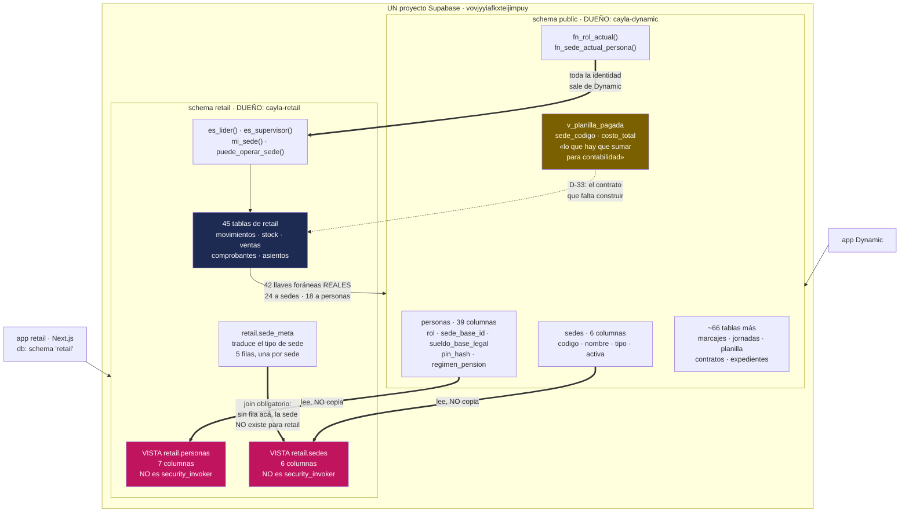

# Dynamic — el otro sistema, y exactamente dónde está la frontera

> **Qué responde este archivo:** qué es Dynamic y qué dominios cubre; **dónde
> está la frontera entre los dos sistemas y de qué está hecha**; qué se puede
> y qué no se puede tocar desde retail; qué contrato hay que construir para
> que el estado de resultados por sede sea real (D-33); y qué riesgos trae
> compartir una sola base de datos.
>
> **Qué NO responde, a propósito:** el detalle campo por campo de Dynamic —
> eso es `generado/DICCIONARIO-DYNAMIC.md`, y le corresponde vivir en
> `cayla-dynamic/docs/`, no duplicado acá. Las tablas `sede_meta`,
> `retail.personas` y `retail.sedes` vistas desde retail están en
> `modulos/01-identidad-y-acceso.md`. Qué datos de gente real guarda cada
> sistema, en `06-DATOS-PERSONALES.md`. Los dos rieles de migración, en
> `modulos/14-plataforma-y-esquema.md` y `08-OPERACION.md`.
>
> Verificado contra la base de producción (`vovjyyiafkxteijimpuy`) y contra el
> SQL de los dos repos el **2026-09-12**. Donde un archivo anterior decía otra
> cosa, acá se corrige y se dice cuál era.

---

## 1. Qué es Dynamic, en una frase que importa

**Lo que Dynamic registra alimenta el pago de una persona real.**

Esa frase está en `cayla-dynamic/CLAUDE.md` y no es decorativa: es el criterio
que ordena todo lo demás. Un error en retail deja un stock mal contado. Un
error en Dynamic es plata mal pagada a alguien que trabajó el mes.

Dynamic es el sistema de **asistencia y planilla** de CAYLA: marcación de
entrada y salida en un terminal fijo por sede, turnos y horarios, feriados y
ausencias, vacaciones, sobretiempo, planilla peruana completa (AFP/ONP,
gratificaciones, CTS, EsSalud, retención de 4ta), contratos, expediente
disciplinario y comunicación interna. Está en producción y en uso **todos los
días** en `cayla-dynamic.vercel.app`, con ~30 personas entre activas e
inactivas.

Y sobre todo: **Dynamic es el dueño de la identidad de CAYLA.** Quién es cada
persona, a qué sede pertenece, qué rol tiene, si está activa. Retail no tiene
opinión propia sobre eso — la lee.

---

## 2. Los dos vocabularios, uno al lado del otro

| | `cayla-retail` | `cayla-dynamic` |
|---|---|---|
| Qué resuelve | Vender ropa | Pagar personas |
| Schema en producción | `retail` | `public` |
| Tamaño hoy | **45 tablas + 2 vistas** | **69 tablas + 4 vistas** |
| Migraciones en su repo | 57 locales + 37 del riel de unificación | **407 archivos**, numerados hasta la 0422 |
| Quién pega SQL en producción | Felipe, a mano (D-11) | Felipe, a mano — misma regla, escrita aparte |
| Llama al Taller | `fabrica` | `taller` |
| Llama al corporativo | `corporativo` | `central` |
| Llama a quien manda en una tienda | `lider` (local) | `supervisor_sede` |

**Son 407 archivos de migración contra 57.** Dynamic es el sistema más grande
de CAYLA por bastante, y el más viejo. Cuando los dos sistemas discrepan sobre
una persona o una sede, no hay empate: **manda Dynamic**, porque es el dueño de
la tabla.

---

## 3. Las ~69 tablas de Dynamic, agrupadas en familias

Nadie necesita las 69 de memoria. Sí hace falta saber **qué familia ya existe
allá**, para no construir en retail algo que ya está hecho. La lista campo por
campo está en `generado/DICCIONARIO-DYNAMIC.md`.

| Familia | Qué resuelve | Tablas cabeza |
|---|---|---|
| **Identidad y estructura** | Quién es quién, en qué sede, con qué rol y área | `personas`, `sedes`, `areas`, `categorias_laborales`, `configuracion`, `parametros_laborales` |
| **Asistencia y turnos** | El corazón: marcar, calcular la jornada, justificar la excepción | `marcajes`, `marcas_apartadas`, `terminales`, `jornadas`, `turnos`, `horarios_asignados`, `tardanzas_justificadas`, `incidencias_aceptadas` |
| **Ausencias, feriados y vacaciones** | Los días que no se trabajan y por qué | `ausencias`, `tipos_ausencia`, `solicitudes_vacaciones`, `vacaciones` *(vista)*, `feriados`, `feriados_descanso_sustitutorio`, `actas_descanso_sustitutorio` |
| **Planilla y compensación** | Cuánto se le paga a cada quien, y cuánto cuesta | `periodos_planilla`, `periodo_grupo_pago`, `movimientos_planilla`, `planilla_pagada_detalle`, `v_planilla_pagada` *(vista)*, `liquidacion_pagada`, `reversas_pago`, `asignaciones_salario`, `politica_salarial`, `tarifas_hora`, `factores_categoria`, `bonos_umbral_permitido` |
| **Pensiones y beneficios** | AFP/ONP, educación, derechohabientes | `asignaciones_regimen_pension`, `tasas_pension`, `asignaciones_educacion`, `educacion_comprobantes`, `topes_educacion_rango`, `derechohabientes`, `desembolsos_beneficios` |
| **Documentos y cumplimiento laboral** | El papel que la ley peruana exige | `documentos_institucionales`, `documentos_tipos`, `documentos_firmados`, `documentos_acuses`, `firmas_escaneadas`, `contratos_generados`, `expediente_disciplinario`, `expediente_adjuntos`, `correcciones_auditoria` |
| **Datos personales sensibles** | Lo que la Ley 29733 obliga a cuidar | `datos_personales` (21 columnas: DNI, dirección, celular, **entidad bancaria y número de cuenta**) |
| **Objetivos y rendimiento** | Metas mensuales y cómo se cumplieron | `objetivos_mensuales`, `objetivos_items`, `rendimiento_mensual`, `metas_cobertura` |
| **Comunicación y alertas** | Anuncios, avisos push, cola de envíos | `anuncios`, `anuncios_leidos`, `alertas`, `push_tokens` |
| **Sistema y control** | El andamio del propio Dynamic | `migraciones_aplicadas` (~360 filas), `funciones_nunca_para_authenticated`, `google_sheets_sync_queue`, `revisiones_pedidas`, `etiquetas_complemento` |

### 3.1 Corrección: el diccionario generado de Dynamic **no es la foto de producción**

Su encabezado lo dice y hay que leerlo:
`generado/DICCIONARIO-DYNAMIC.md:7-8` → **Origen: `supabase_db_cayla-dynamic`**
(el contenedor **local**), **67 objetos encontrados**. Y `sedes` sale con
~3 filas, cuando en producción hay 5.

Producción tiene **69 tablas + 4 vistas = 73**. El diccionario trae 63 tablas
+ 4 vistas = 67. La diferencia cuadra exacta:

| Faltan en el diccionario | Por qué | Evidencia |
|---|---|---|
| `catalogo_campos_perfil`, `solicitudes_cambio_perfil`, `seguimiento_planilla_por_solicitud` | migración nueva, el contenedor local está atrasado | `cayla-dynamic/supabase/migrations/0399_el_colaborador_propone_do_aprueba.sql` |
| `consentimientos_datos_personales` | ídem | `…/0404_queda_constancia_de_que_acepto_el_tratamiento.sql` |
| `confirmaciones_firma_contrato` | ídem | `…/0406_confirmar_la_firma_dos_veces_no_borra_la_primera.sql` |
| `respaldo_horarios_chiara_20260814` | **no la crea ningún archivo**: respaldo puntual hecho a mano en producción | ningún `create table` en los 407 archivos |

63 + 5 + 1 = **69**. La última es la incómoda: una tabla viva en producción que
ningún archivo del repo crea — el mismo patrón que `sede_meta` del lado de
retail (§4). Lleva fecha en el nombre: es candidata a archivar, no a mantener.

**Qué hacer con esto:** correr `pnpm datos:generar` contra producción, no
contra el contenedor local. Mientras no se haga, el diccionario de Dynamic es
útil para entender la forma de cada tabla y **no** para contar cuántas hay.

### 3.2 Corrección: no hay tabla `perfiles`, ni proyecto "Freewheel"

La versión anterior de este documento decía que una tabla `perfiles` vivía en
un proyecto Supabase aparte llamado "Freewheel" (`dslarulabzyufkhipsne`).
**No hay evidencia de eso.** En los 407 archivos de Dynamic, `perfiles`
aparece una sola vez y no es una tabla: es el **bucket de Storage** donde cada
persona sube su foto
(`cayla-dynamic/supabase/migrations/0381_cada_quien_sube_su_foto_y_aparece_en_el_terminal.sql:162`).
No hay un tercer proyecto Supabase que investigar.

---

## 4. La frontera: no hay dos copias de nadie

Esto es lo que casi ningún documento anterior explicaba bien, y es la causa más
probable de la confusión del equipo.

**No hay sincronización. No hay copia. No hay "traer las personas de Dynamic".**
Hay **una sola tabla de personas y una sola de sedes**, que viven en `public` y
son de Dynamic, y retail las mira por una ventana.



### 4.1 Las dos vistas, exactas

`supabase/unificacion/03_candados.sql:14-28` las crea, y el volcado de
producción confirma que lo desplegado es idéntico al archivo:

```sql
create or replace view retail.sedes with (security_invoker = true) as
select s.id, s.codigo, s.nombre, m.tipo, m.tienda_asociada_id, s.activa as activo
from public.sedes s join retail.sede_meta m on m.sede_id = s.id;

create or replace view retail.personas with (security_invoker = true) as
select p.id, p.auth_user_id,
       (p.nombres || ' ' || coalesce(p.apellidos, '')) as nombre,
       p.sede_base_id as sede_id, p.rol::text as rol, p.email, p.estado
from public.personas p;
```

**Tres cosas que hay que leer ahí:**

1. **`retail.personas` ve 7 columnas de 39.** No ve el sueldo, ni el PIN, ni el
   régimen de pensión, ni la fecha de cese. La ventana es angosta a propósito.
2. **`sede_id` en retail es `sede_base_id` en Dynamic.** Es la sede de
   *adscripción*, no la de presencia física. Dynamic tiene además
   `personas.sede_fisica_id`, y ese campo **solo decide la tarifa de
   movilidad** — no es el permiso de cubrir otra sede de D-14, y usarlo como
   tal sería un error.
3. **La vista de sedes hace `join` con `retail.sede_meta`, y ese `join` muerde.**
   Si mañana alguien crea una sede en Dynamic y nadie inserta su fila en
   `sede_meta`, **esa sede no existe para retail**. No da error: no aparece en
   ninguna lista, y la caja de esa tienda nunca abre.

### 4.2 Las 42 llaves que cruzan de verdad

No son identificadores "de confianza": son llaves foráneas que Postgres hace
cumplir. Lista completa y verificada en `generado/retail_fks_cruzadas.json`:

| Hacia | Cuántas | Desde |
|---|---|---|
| `public.sedes` | **24** | `activos_fijos`, `ajustes_efectivo`, `asientos`, `cajas`, `comprobantes`, `contenedores`, `conteos`, `depositos_bancarios`, `gastos`, `lotes`, `movimientos` (×2: origen y destino), `ordenes_compra`, `ordenes_produccion` (×2), `producciones`, `proformas`, `sede_meta` (×2), `series_comprobantes`, `stock`, `stock_almacen`, `ventas`, `ventas_historicas_mensuales` |
| `public.personas` | **18** | `ajustes_efectivo`, `asientos`, `cajas` (×2: abierta_por / cerrada_por), `codigos_barras`, `comprobantes` (×2), `conteo_lineas`, `conteos` (×2), `depositos_bancarios`, `gastos`, `importaciones` (borrado en el corte a V2 el 2026-09-12; se reconstruye después del censo), `lotes`, `movimientos`, `producciones`, `proformas`, `ventas` |

**24 tablas de retail** tienen al menos una. En la práctica: contratar a alguien
en Dynamic hace que retail lo vea **al instante**, sin sincronizar nada. Y
`movimientos.usuario_id` no es un nombre copiado: es un puntero a una persona
que existe de verdad.

### 4.3 El candado físico: la app de retail solo ve el schema `retail`

El cliente de Supabase de retail está clavado al schema:

- `apps/web/lib/supabase/server.ts:11` → `db: { schema: "retail" }`
- `apps/web/lib/supabase/client.ts:8` → `{ db: { schema: "retail" } }`

PostgREST solo expone ese schema a esta app. **El código de retail no puede
nombrar `public.personas` aunque quiera** — solo llega a lo que las vistas
dejan pasar. No es disciplina del equipo: es configuración.

La excepción a tener presente: las RPC de retail declaran
`set search_path = public` y corren como `security definer`. Adentro de una
función **sí** se toca `public`. Por eso el punto peligroso no es la pantalla,
es el cuerpo de una función.

---

## 5. Las tablas que nacen del riel de unificación

Tres tablas de retail existen en producción, tienen datos, la app las usa — y
**ningún `create table` del repo las crea**:

| Tabla | Filas | Qué guarda | Estado |
|---|---|---|---|
| `retail.sede_meta` | 5 | El `tipo` que retail necesita de cada sede | La creó el paso "02" que nunca quedó versionado |
| `retail.sede_datos_fiscales` | 1 | Dirección, ubigeo, teléfono para el comprobante | Ídem. **Ningún código la lee todavía** |
| `retail.configuracion_empresa` | 1 | RUC, razón social, email del emisor | Ídem |

Lo admite el propio SQL:
`supabase/unificacion/12_almacen_interno.sql:38` habla de *"el paso 02 que
nunca quedó versionado en el repo"*.

### 5.1 El enredo del nombre: `retail_sede_meta` vs `retail.sede_meta`

Esto confunde a todo el que lo lee por primera vez, así que se dice directo:

| | Qué es | Dónde |
|---|---|---|
| `public.retail_sede_meta` | Una tabla en `public` con guion bajo en el nombre. La crea el archivo del repo | `supabase/unificacion/01_sedes.sql:19` |
| `retail.sede_meta` | La tabla **viva**, en el schema `retail`. La usa la vista. La crea el `02` perdido | `supabase/unificacion/03_candados.sql:18` la consulta |

Son **dos tablas distintas con el mismo contenido esperado**. Volver a pegar
`01_sedes.sql` crea o actualiza la equivocada y no arregla nada de lo que
importa. El archivo incluso se explica a sí mismo en su cabecera
(`01_sedes.sql:12`): *"solo crea UNA tabla nueva de retail
(`retail_sede_meta`)"* — se escribió antes de que existiera el schema `retail`,
y nunca se actualizó.

**La consecuencia grande, sin rodeos:** hoy es **imposible** reconstruir
producción desde el repo. `npx supabase db reset` + pegar los 37 archivos de
`unificacion/` produce una base **distinta** a la que tienen las tiendas: sin
`sede_meta`, sin `sede_datos_fiscales`, sin `configuracion_empresa`, y sin el
cuerpo real de varias funciones que producción trae parchadas a mano. La brecha
no es "local va adelante": es que **producción tiene cosas vivas que el repo no
sabe crear**. El plan para cerrarla está en
`08-OPERACION.md`.

### 5.2 Y el `on delete cascade` que nadie eligió

`sede_meta.sede_id` está declarada `references sedes (id) on delete cascade`
(`supabase/unificacion/01_sedes.sql:20`). Borrar una sede en Dynamic **borra en
silencio su fila de `sede_meta`**, y con eso la sede desaparece del mapa de
retail aunque tenga años de movimientos colgando — porque la vista es un `join`
y sin la fila no hay renglón.

Las sedes **no se borran**: se marcan `sedes.activa = false`.

---

## 6. El choque de vocabulario de roles

### 6.1 Lo que Dynamic usa hoy, verificado en su SQL

`cayla-dynamic/supabase/migrations/0001_init.sql:11`:

```sql
create type rol_usuario as enum ('integrante', 'supervisor_sede', 'lider_do', 'admin');
```

Cuatro valores, y ninguna migración posterior agrega uno (`alter type … add
value`: cero apariciones en los 407 archivos). El escalafón real es
`admin` > `lider_do` > `supervisor_sede` > `integrante`.

| Valor | Qué es de verdad en CAYLA |
|---|---|
| `admin` | Felipe y quien designe. Ve todo |
| `lider_do` | **Líder de Desarrollo Organizacional** — RR.HH., no tienda. Tiene acceso total a la planilla |
| `supervisor_sede` | **La persona a cargo de una tienda.** Ve y actúa solo sobre su sede |
| `integrante` | El resto del equipo |

El candado grande de Dynamic es
`fn_es_admin_o_lider() = fn_rol_actual() in ('admin', 'lider_do')`
(`0078_guards_no_fallan_abiertos.sql:44-49`). Es decir: **quien manda en una
tienda no está adentro de ese candado.**

### 6.2 La trampa del nombre: Dynamic ya imprime "Líder de Equipo", y no es lo que D-12 quiere decir

`cayla-dynamic/supabase/migrations/0074_firmante_elegible_y_cargo_entregado.sql:56-61`:

```sql
select case p_rol
  when 'admin'           then 'Gerencia General'
  when 'lider_do'        then 'Líder de Equipo'
  when 'supervisor_sede' then 'Encargada de Tienda'
  else null
end;
```

Ese texto **sale impreso en contratos y en memorandos disciplinarios**. O sea:

- **"Líder de Equipo" ya está tomado** en Dynamic, y designa a RR.HH.
  (`lider_do`), no a quien manda en una tienda.
- A quien manda en una tienda, Dynamic hoy la llama **"Encargada de Tienda"** —
  exactamente la palabra en femenino que D-12 prohíbe, *porque hay hombres y
  mujeres en la empresa*, y encima en un documento con valor legal.

**Qué implica D-12 para Dynamic, en concreto:** unificar los cuatro niveles no
es cambiar una etiqueta de pantalla. Hay que decidir qué hacer con
`fn_cargo_de_rol`, que es el que le pone cargo a un contrato firmado. El propio
Dynamic ya lo tiene anotado como hallazgo abierto
(`cayla-dynamic/docs/hallazgos-abiertos.md:151`).

Y el rol no se cambia con un `update` a mano: hay un disparador
`fn_bloquear_rol_directo` (`0296_el_rol_solo_cambia_por_una_puerta.sql:59`) y
una función `fn_set_rol` (`0295_el_rol_ya_no_se_asigna_solo.sql:81`) que es la
única puerta.

### 6.3 El hallazgo gordo: en producción, `es_lider()` significa `admin`

`supabase/unificacion/03_candados.sql:62-64`:

```sql
create or replace function retail.es_lider()
returns boolean language sql stable set search_path = public
as $$ select coalesce(public.fn_rol_actual() = 'admin', false); $$;
```

`retail.es_lider()` **no pregunta si eres líder de una sede. Pregunta si eres
admin.** Contado sobre las políticas de producción en
`generado/DICCIONARIO-RETAIL.md`:

| Función | Veces que aparece en políticas |
|---|---|
| `es_lider()` | **21** |
| `puede_operar_sede()` | **17** |
| `es_supervisor()` | **0** — existe y **ninguna política la llama** |

**Traducido a la operación de hoy:** la persona a cargo de TRU o de AQP tiene
`supervisor_sede` en Dynamic, así que `retail.es_lider()` le devuelve `false`.
No puede dar de alta un producto, ni registrar un gasto, ni tocar una orden de
compra. **Hoy solo Felipe puede dar de alta catálogo en las tiendas.** Eso no
es una decisión: es un efecto de un mapeo escrito de apuro en julio, que el
propio archivo documenta en su cabecera (`03_candados.sql:8` —
*"admin → Líder"*).

En producción, retail tiene **dos niveles, no cuatro**: Admin, y todos los demás.

### 6.4 Los cuatro niveles de D-12, y qué falta de cada lado

| Nivel (D-12) | Hoy en Dynamic | Hoy en retail producción | Hoy en retail local |
|---|---|---|---|
| **Admin** | `admin` ✅ | `es_lider()` ✅ | `rol = 'lider'` |
| **Líder de equipo** | `supervisor_sede` ✅ (mal etiquetado) | **no existe** — cae a integrante | se confunde con Admin |
| **Integrante** | `integrante` ✅ | ✅ | `rol = 'integrante'` |
| **Solo lectura** (contador) | **no existe** | **no existe** | **no existe** |

Qué hay que tocar, en este orden:

1. **Dynamic primero**, porque es el dueño del tipo: agregar el nivel de solo
   lectura y decidir si `supervisor_sede` se renombra a `lider_equipo` o se
   queda el valor y cambia la etiqueta. Pasando por `fn_set_rol`, no por
   `update`.
2. **retail producción:** `es_lider()` tiene que partirse en dos — "puede todo"
   y "manda en su sede". Y `es_supervisor()` o se conecta a las 21 políticas o
   se borra: **una función de permisos que nadie llama es una trampa**, porque
   cualquiera asume que está protegiendo algo.
3. **retail local:** `personas.rol` con `check (rol in ('lider','integrante'))`
   (`supabase/migrations/0001_init.sql:30`) se queda corto. Mientras local y
   producción no digan lo mismo, **una prueba de permisos en tu máquina no
   prueba nada**.
4. **Lo que no existe en ningún lado:** cubrir otra sede con fecha de
   vencimiento (D-14). Haría falta algo tipo `cobertura_sede` (quién, qué sede,
   desde, hasta) que `puede_operar_sede()` consulte. Repetimos: **no reutilizar
   `personas.sede_fisica_id` para esto** — ese campo es de movilidad.

El detalle de quién puede qué tabla por tabla está en `05-SEGURIDAD.md` y en
`modulos/01-identidad-y-acceso.md`.

### 6.5 El hueco del NULL está abierto en **local**, no en producción

Al revés de lo que se venía suponiendo.

- **Producción, cerrado:** `retail.puede_operar_sede()` envuelve las dos ramas
  en `coalesce(..., false)` (`03_candados.sql:76-79`). Cuando no sabe,
  responde que no.
- **Local, abierto:** `fn_puede_operar_sede()`
  (`supabase/migrations/0012_rpc_valida_sede.sql:15-27`) no lleva `coalesce` en
  la rama de la sede. Si `fn_sede_actual_persona()` devuelve NULL, la función
  devuelve NULL — y en el patrón que usan todas las RPC del repo
  (`if not fn_puede_operar_sede(...) then raise exception`), **`not null` no es
  true: la excepción no se dispara y el permiso pasa solo.**

**Y esto tiene población real, no es teórico.** En Dynamic, cada **terminal**
de marcación tiene su propio `auth_user_id` y **no tiene fila en `personas`**
(`cayla-dynamic/supabase/migrations/0003_rls.sql:32-36`). Una sesión de
terminal tiene `auth.uid()` válido y `fn_rol_actual()` NULL. Contra producción
se le niega todo, limpio. Contra local, entra por el hueco.

Se arregla poniéndole `coalesce(..., false)` a la versión local — y hasta que
se haga, **local es más permisivo que las tiendas**, que es la peor dirección
posible para una diferencia entre entornos.

---

## 7. El contrato a construir: los sueldos por sede (D-33)

**El problema primero.** D-30 dice que cada sede tiene su estado de resultados.
El sueldo es el gasto más grande de una tienda. Hoy retail no lo ve. Entonces
el resultado por sede de hoy no está incompleto: **está mal**, y en la
dirección que más engaña — todas las tiendas parecen más rentables de lo que
son.

D-33 lo resuelve sin duplicar nada: **retail lee el número de allá.**

### 7.1 La buena noticia: la mesa ya está puesta

Dynamic ya congela exactamente lo que hace falta, y en una sola vista:
**`public.v_planilla_pagada`**. Su propia descripción en el diccionario dice,
con esas palabras: *"Lo que hay que sumar para contabilidad"*.

| Lo que retail necesita | Columna de `public.v_planilla_pagada` |
|---|---|
| Qué sede | `sede_codigo` |
| Qué mes | `periodo_id` → `periodos_planilla.fecha_ini` / `fecha_fin` |
| **Cuánto le costó a CAYLA** | `costo_total` = `total + provision_total` (columna calculada) |
| Cuánto recibió la persona | `total` |
| Cuánto es provisión (grati, CTS, vacaciones) | `provision_gratificacion`, `provision_cts`, `provision_vacaciones` |
| Aporte del empleador | `aporte_essalud` |
| Quién | `persona_id`, `nombre` |

Tres propiedades que hacen que esto sea un contrato sólido y no un reporte
frágil:

1. **Es una foto congelada, no un cálculo vivo.** `planilla_pagada_detalle` es
   *append-only*; la vigente de cada periodo y grupo es la de mayor `version`,
   y eso es justo lo que la vista filtra. El número de un mes cerrado **no
   cambia** si mañana alguien corrige un horario. Es la misma disciplina que
   `movimientos` en retail: el pasado no se edita.
2. **Ya trae la sede adentro** (`sede_codigo`), así que no hay que reconstruir
   a qué tienda pertenecía cada persona ese mes.
3. **Ya distingue lo que la persona recibe de lo que a CAYLA le cuesta.** Para
   el estado de resultados manda `costo_total`, no `total`.

Ojo con dos detalles del calendario: el periodo de planilla **va del 29 al 28**,
no de fin de mes a fin de mes (`periodos_planilla`, candado
`periodos_planilla_check`), y solo cuenta el periodo con `estado = 'pagado'`.
La regla de reparto entre meses la decide el contador (D-35), no el sistema.

### 7.2 Lo que falta, y la forma que debería tener

| Pieza | Estado |
|---|---|
| El dato del lado de Dynamic | **Existe y está listo** |
| Una vista puente `retail.planilla_por_sede` | **No existe.** Sería la tercera ventana de la frontera, junto a `retail.personas` y `retail.sedes` |
| El asiento contable que lo lleva al libro | **No existe.** Ninguna función de CAYLA escribe un asiento todavía (D-35) |
| Los gastos de planilla que no son de tienda | Van a `CCO` por D-32 — `sede_codigo = 'CCO'` ya los separa solo |

**Cómo debería construirse, en una línea:** una vista `retail.planilla_por_sede`
con `security_invoker = true`, del mismo molde que las otras dos, que agregue
`v_planilla_pagada` por `sede_codigo` y periodo y exponga **solo importes
totales — nunca el sueldo de una persona identificable**. Retail necesita
"cuánto costó la planilla de AQP en agosto", no "cuánto gana fulana". Esa línea
es la que separa un contrato contable legítimo de una fuga de datos personales
(`06-DATOS-PERSONALES.md`).

Dos avisos para quien lo construya:

- **El `join` es por `sede_codigo`, texto, y los códigos no significan lo mismo
  en las dos bases.** En producción `LIM` es **el Taller**, y la tienda de Lima
  es `003`. El Taller se busca por `tipo = 'fabrica'`, nunca por su código
  (§ `00-MAPA.md` §4). Un reporte que asuma "LIM = tienda de Lima" le
  carga los sueldos del Taller a una tienda.
- **El Taller no vende, absorbe** (D-31). Su planilla es costo de producción que
  se pega a la prenda, no gasto administrativo. Esa es la conexión directa con
  el módulo 10 y la razón de que D-33 y D-31 se construyan juntas.

---

## 8. Qué NO se puede tocar desde retail

| Objeto | Desde la app de retail | Por qué |
|---|---|---|
| `public.personas` | **Invisible.** Solo a través de `retail.personas`, 7 columnas | El cliente está clavado a `schema: "retail"` (`apps/web/lib/supabase/server.ts:11`) |
| `public.sedes` | **Invisible.** Solo por `retail.sedes`, y solo las que tienen fila en `sede_meta` | Ídem + el `join` de la vista |
| Crear o dar de baja una persona | **No.** Se hace en Dynamic | `personas_insert_admin_lider` / `personas_update_admin_lider` exigen `fn_es_admin_o_lider()` |
| Cambiar el rol de alguien | **No, ni siquiera en Dynamic con un `update`** | Disparador `fn_bloquear_rol_directo`; única puerta, `fn_set_rol` |
| Sueldo, PIN, régimen de pensión, fecha de cese | **No se ven** | No están en la vista |
| `retail.sede_meta` | Lectura sí; escritura solo pegando SQL (D-11) | Su única política es `retail_sede_meta_read` para SELECT (`01_sedes.sql:29`) |

**Las vistas son de lectura y punto.** Son vistas con `join` y con expresiones
(`nombres || ' ' || apellidos`), así que Postgres no las deja actualizar aunque
alguien lo intente.

### 8.1 Qué pasa si alguien borra una persona en Dynamic

Tres capas, de la más fuerte a la más sutil:

1. **Si esa persona ya hizo algo en retail, el borrado FALLA.** Las 18 llaves
   hacia `public.personas` se declararon **sin `on delete`**, que en Postgres
   significa *no hagas nada y rechaza si hay hijos*. Quien registró una venta,
   abrió una caja o contó en un conteo **no se puede borrar**. Postgres
   devuelve error 23503 y el historial queda intacto.
2. **Si nunca tocó retail, se borra sin ruido** — y ahí no hay red.
3. **El caso realmente silencioso no es borrar la persona: es borrar su
   usuario.** `personas.auth_user_id` referencia `auth.users(id)`
   **`on delete set null`**. Si alguien elimina el usuario en el panel de
   Supabase, la fila de la persona sobrevive pero se queda huérfana:
   `fn_rol_actual()` y `fn_sede_actual_persona()` devuelven NULL para esa
   sesión. En producción eso la deja afuera de todo, limpio. En local cae
   dentro del hueco de §6.5.

**La regla, entonces:** las personas no se borran, se marcan
`estado = 'inactivo'` con su `fecha_cese` — y el candado
`personas_cese_coherente` obliga a poner la fecha, no deja hacerlo a medias.
Mismo criterio que las sedes (`activa = false`) y que `movimientos` (D-22): en
CAYLA **nada se borra, todo se marca**.

---

## 9. Los riesgos de compartir base, nombrados uno por uno

Compartir base compró una sola fuente de identidad, que es lo correcto. Lo que
se paga es esto:

| Riesgo | Qué pasaría | Qué avisaría hoy |
|---|---|---|
| **Sede nueva en Dynamic sin fila en `sede_meta`** | Esa sede no existe para retail. Sin lista, sin caja, sin stock | **Nada.** No hay error: hay ausencia |
| **Renombrar o quitar una columna de `public.personas`** (p. ej. `apellidos`) | La vista `retail.personas` se rompe o devuelve otra cosa. Cae la pantalla de caja de las tres tiendas | **Nada.** Dynamic no tiene forma de saber que retail depende de esa columna |
| **Cambiar `personas.rol` a un valor nuevo** | `p.rol::text` lo pasa tal cual a retail, que no lo entiende. `es_lider()` da false y la persona pierde permisos sin explicación | **Nada** |
| **Borrar una sede en Dynamic** | Cascada silenciosa sobre `sede_meta` (§5.2) | Nada del lado de retail |
| **Cambiar el tipo de una sede en Dynamic** | Nada: retail usa `m.tipo` de `sede_meta`, no `s.tipo`. **Quedan desincronizados y nadie se entera** | Nada |
| **Una migración de Dynamic que toque `public` sin prefijo** | Puede chocar con nombres de retail. Los dos schemas tienen una tabla `migraciones_aplicadas`, con formas distintas | El error de la migración, si choca |
| **Pegar SQL de retail sin el prefijo `retail.`** | Se crea en `public`, o sea dentro de Dynamic. Es exactamente lo que pasó con `retail_sede_meta` (§5.1) | Un `42P01` si hay suerte; si no, una tabla de más en el schema equivocado |

**El patrón, en una frase:** casi ninguna fila de esa tabla dice "algo avisaría".
Los dos sistemas se pisan **en silencio**, y el silencio es el problema.

### 9.1 Lo mínimo que cierra el silencio

1. **Un chequeo de la frontera en `pnpm datos:comparar`** (D-19): que falle si
   alguna sede activa de `public.sedes` no tiene fila en `retail.sede_meta`, y
   si la lista de columnas que las dos vistas esperan cambió. Son dos consultas.
2. **Escribirlo del lado de Dynamic.** `cayla-dynamic/CLAUDE.md` no menciona
   hoy que el schema `retail` cuelga de sus tablas. Quien toque
   `public.personas` allá merece leer, en su propio repo, que hay 18 llaves
   foráneas y dos vistas apoyadas encima.
3. **Un candado al borrado de sedes**: hoy la cascada de `sede_meta` la hace
   posible sin fricción.

### 9.2 Un detalle sin cerrar, marcado y no resuelto

El linter de seguridad de Supabase marca `retail.personas` y `retail.sedes`
como `SECURITY DEFINER VIEW` (nivel ERROR) — una vista que se saltaría los
permisos por fila de quien pregunta. El SQL fuente declara lo contrario:
`security_invoker = true` (`03_candados.sql:15` y `:22`). Puede ser falso
positivo del linter, o puede que lo desplegado no sea lo que dice el archivo.
**Hasta que alguien con acceso a producción lo confirme, no se puede afirmar
que las políticas de Dynamic protegen de verdad lo que se ve por estas
ventanas.** Es la pregunta más importante abierta de la frontera.

---

## 10. Lo que este archivo corrige de lo que ya estaba escrito

| Decía | Dice de verdad |
|---|---|
| "Dynamic tiene 66 tablas" | **69 tablas + 4 vistas** en producción. El diccionario generado trae 67 objetos porque se leyó del contenedor **local** |
| "El Supabase local de Dynamic tiene un schema `retail` con 28 tablas, frente a 36" | Producción de retail tiene **45 + 2 vistas**. El 28 es lo que hay en el contenedor local de Dynamic — y también lo que trae `generado/DICCIONARIO-RETAIL.md`, por el mismo motivo |
| "`perfiles` vive en el proyecto Freewheel" | No hay tal tabla ni tal proyecto. `perfiles` es un **bucket de Storage** (`0381:162`) |
| "`unificacion/01_sedes.sql` crea `sede_meta`" | Crea `public.retail_sede_meta`, que **no es** la tabla viva `retail.sede_meta` |
| "El hueco del NULL es de producción" | Es de **local**. Producción lo cerró con `coalesce` |
| "La brecha es que local va adelante" | Es al revés: **producción tiene tablas y funciones que el repo no sabe crear** |
| "Retail le agrega a `sedes` el campo `tipo` que Dynamic no tiene" | `public.sedes.tipo` existe y es obligatorio (`chk_sede_tipo`). Son **dos vocabularios**: `taller`/`central` allá, `fabrica`/`corporativo` acá |

---

## 11. Huecos conocidos de la frontera

1. **`es_lider()` = admin.** Quien manda en una tienda no puede dar de alta
   catálogo ni registrar un gasto en producción. Es el hueco más caro del día a
   día. → §6.3
2. **`es_supervisor()` existe y no la llama nadie.** 0 de 21. → §6.3
3. **"Solo lectura" no existe en ningún lado**, y el contador externo lo
   necesita (D-12).
4. **Cubrir otra sede con fecha de vencimiento no tiene tabla** (D-14).
5. **No hay puente de sueldos**: D-33 está decidido y no construido. → §7
6. **El `02` perdido:** `sede_meta`, `sede_datos_fiscales` y
   `configuracion_empresa` no se pueden reconstruir desde el repo. → §5
7. **Nada avisa cuando Dynamic cambia algo que retail mira.** → §9
8. **El linter y el SQL se contradicen sobre `security_invoker`.** → §9.2
9. **El diccionario de Dynamic se genera contra local**, no contra producción.
   → §3.1
10. **`retail.sede_datos_fiscales` existe, tiene una fila y ningún código la
    lee.** Está construida para el comprobante electrónico y no conectada.

---

*Gobiernan este archivo: **D-05** (se documentan los dos sistemas completos),
**D-12** (cuatro niveles, un solo vocabulario: Admin · Líder de equipo ·
Integrante · Solo lectura), **D-13** y **D-14** (qué puede un Líder de equipo y
dónde), **D-16** (las dos bases lado a lado), **D-17** (el riel de unificación
es deuda a extinguir), **D-19** (la comparación avisa sola), **D-20** (la sede
corporativa es `CCO`), **D-28** (datos personales marcados), **D-30** y **D-32**
(estado de resultados por sede, y lo que no es de ninguna va a `CCO`), **D-31**
(el Taller se mide por costo absorbido), **D-33** (los sueldos se leen de
Dynamic — el contrato de §7) y **D-50** (cada marca, su propia base). El acta
manda: `DECISIONES-2026-09-12.md`.*
