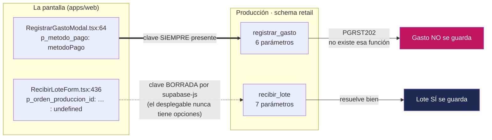

# Diagnóstico — las pantallas que llaman a una función que producción no tiene

> ⚠️ **ESTE ARCHIVO NO ARREGLA NADA, Y ES A PROPÓSITO.** Felipe pidió
> explícitamente diagnosticar y dejar la corrección escrita, sin ejecutarla. El SQL
> de abajo está completo y listo para copiar, pero **no se pegó en producción**, y
> ningún archivo de `apps/web` se tocó. Pegar SQL en producción lo hace una sola
> mano y queda anotado (**D-11**).
>
> **Qué responde:** por qué registrar un gasto falla en las tres tiendas, por qué
> recibir mercadería del Taller *parece* rota y no lo está, qué se pierde mientras
> tanto, y cuáles son exactamente las dos salidas con lo que cuesta cada una.

---

## 1. El titular, en cuatro líneas

`generado/DRIFT.md` cuenta **dos pantallas rotas**. Al abrir el código línea por
línea son **dos divergencias reales y un solo daño diario**:

| | Divergencia entre pantalla y producción | ¿Falla hoy en la tienda? |
|---|---|---|
| **Registrar un gasto** | Real. `p_metodo_pago` se manda **siempre** | **Sí. Cada vez. Nunca funcionó** |
| **Recibir mercadería del Taller ligada a una producción** | Real. `p_orden_produccion_id` está escrito en el código | **No. El camino está apagado en origen desde el 2026-09-03** |

La diferencia no es un detalle de redacción: cambia la urgencia. Una es una
pantalla que una Líder de equipo intenta usar y no puede. La otra es una mina
enterrada que explota el día que alguien vuelva a encender el desplegable.

**Por qué el comparador no distingue las dos.** `scripts/datos/comparar.mjs` lee el
texto del archivo y saca los nombres de las claves. No sabe que `supabase-js` borra
del JSON las claves cuyo valor es `undefined` — lo mismo que ya nos había mordido al
revés en `MovimientoModal` (`unificacion/31_una_sola_firma_por_funcion.sql:41`). Con
`p_metodo_pago: metodoPago` la clave viaja siempre; con
`p_orden_produccion_id: … ? … : undefined` no viaja nunca. Ver §5.



---

## 2. Caso 1 — Registrar un gasto. Rota de verdad, y nunca funcionó

### 2.1 Qué ve la Líder de equipo

Abre Finanzas → Efectivo → Registrar gasto, elige sede, categoría, método de pago y
total, y le da a guardar. La pantalla responde:

> *«No se pudo registrar el gasto. Vuelve a intentar; si sigue igual, avisa a
> Felipe. Código: …»*

Ese texto es el último renglón de `apps/web/lib/error-escritura.ts:194` — el que
aparece cuando el error **no** es uno de los nuestros. No lo es: es `PGRST202` de
PostgREST, «no existe una función con esos parámetros». Volver a intentar no cambia
nada, porque no es un problema de red ni de momento.

### 2.2 La llamada contra la firma

```
La pantalla manda (RegistrarGastoModal.tsx:57-65):
  p_sede_id · p_categoria · p_subtotal · p_igv · p_total · p_especificacion · p_metodo_pago

Producción acepta (funciones-produccion.txt, leído de pg_proc el 2026-09-12):
  registrar_gasto(p_sede_id uuid, p_categoria text, p_subtotal numeric,
                  p_igv numeric, p_total numeric, p_especificacion text) -> uuid
```

`p_metodo_pago` viaja **siempre**: `metodoPago` nace con valor
(`RegistrarGastoModal.tsx:34`, `useState<MetodoPagoGasto>("efectivo")`) y el
desplegable no ofrece vacío. Nunca es `undefined`, así que nunca se borra del JSON.
Siete claves contra una función de seis: PostgREST no resuelve y devuelve `PGRST202`
antes de tocar la base.

### 2.3 Qué migración introdujo el parámetro

`supabase/migrations/0014_gasto_metodo_pago.sql`, del **2026-07-19**, el día de la
Fase F1 — la jubilación de SINATRA (`docs/BITACORA.md:889-907`). Hizo dos cosas:

1. `drop function if exists registrar_gasto(uuid, text, numeric, numeric, numeric, text)`
   (línea 5) — borra la firma de seis a propósito, para no dejar dos conviviendo.
2. Recrea la función con `p_metodo_pago text default null` (línea 14) y lo inserta
   en la columna (línea 34), validando contra `('efectivo','banco','yape','tarjeta')`
   (línea 28).

La columna había nacido cuatro líneas antes, en la migración hermana:
`0013_finanzas_nucleo.sql:35` — `alter table gastos add column metodo_pago text check
(metodo_pago in ('efectivo','banco','yape','tarjeta'))`. El comentario dice para qué:
*«Para el cuadre continuo hay que saber qué gastos salieron del cajón físico»*.

### 2.4 Por qué producción no lo tiene

**Porque el gemelo de la 0014 nunca se escribió.** Es la respuesta corta y es
literal: en `supabase/unificacion/` —los 38 archivos que son el riel real de
producción (**D-17**)— no existe ningún archivo que actualice `registrar_gasto`.

Lo que sí se pegó fue `unificacion/07_funciones_operacion.sql:174-188`, y ese archivo
**copió el cuerpo de la 0007**, no el de la 0014:

| | `migrations/0007_finanzas.sql:204` | `unificacion/07_funciones_operacion.sql:174` |
|---|---|---|
| Parámetros | 6 | 6 |
| `insert into gastos (…)` | sin `metodo_pago` (línea 227) | sin `metodo_pago` (línea 184) |

Es **exactamente el mismo error que ADR-0004** documenta para `recibir_lote`: copiar
el cuerpo de una función sin verificar cuál es la última versión. La diferencia es
que aquel tuvo su ADR el mismo día y este no tiene ninguno. Busqué los 40 ADR de
`docs/adr/`: ninguno menciona `registrar_gasto`. **Esta divergencia nunca se decidió;
se filtró.**

### 2.5 Desde cuándo, y qué se pierde

**Desde siempre.** No hay una fecha en que se rompió: en el proyecto unificado nunca
funcionó. La prueba no es un razonamiento, es un número:
`retail.gastos` tiene **~0 filas** (`generado/DICCIONARIO-RETAIL.md`, leído de la base
real el 2026-09-12). En catorce meses de operación, con tres tiendas, un taller y
S/645k vendidos, **no hay ni un gasto registrado en producción**.

Qué significa eso en el negocio, sin adornos:

- **El estado de resultados por sede (D-30) hoy solo tiene la mitad de arriba.**
  Entra la venta, no sale nada. Un EERR con ingresos y cero costos no es un EERR
  optimista: es un número que no se puede usar para decidir nada.
- **El cuadre de efectivo continuo no cuadra nunca.** Es el reporte irrenunciable
  #3 de la Fase F1. Cuenta lo que entró por caja y lo que se depositó al banco, pero
  no lo que salió del cajón para pagar el mototaxi, la limpieza o el arreglo de la
  vitrina. El descuadre de −S/6,122 de TRU que hizo jubilar al Excel se está
  reproduciendo, con otra forma.
- **`CCO` no absorbe nada (D-32).** La sede corporativa existe para recibir el
  contador, los servidores y el software. Nada de eso entró nunca por esta pantalla.
- **«Efectivo y caja» es uno de los tres números que Felipe mira primero (D-52)** y
  hoy es el menos confiable de los tres.
- **El gasto volvió al cuaderno.** Si la pantalla no acepta, la tienda anota en
  papel o en WhatsApp. Jubilamos el Excel en julio y el gasto se fue a un lugar
  peor: uno que ni siquiera suma.

### 2.6 Qué columna se queda sin llenar

`retail.gastos.metodo_pago` — `text`, acepta vacío, sin valor por defecto, décima de
diez columnas (`generado/DICCIONARIO-RETAIL.md`, bloque `gastos`).

**La columna sí existe en producción.** La creó `unificacion/05_operacion.sql:94`,
dentro del `create table if not exists retail.gastos`. Está vacía no porque falte,
sino porque la única función que podría llenarla no está.

Y llegó a producción **sin su candado**: en local la columna tiene
`check (metodo_pago in ('efectivo','banco','yape','tarjeta'))`
(`0013_finanzas_nucleo.sql:36`); en producción es `text` a secas — el único `check`
que muestra el diccionario para esa tabla es `gastos_total_check`. Cuando se
destrabe la pantalla, la validación la hará el `if` de la función
(`0014:28`), no la tabla. Anotarlo: es una diferencia que sobrevive al arreglo.

### 2.7 La trampa que el arreglo NO resuelve

Aunque se pegue el SQL de §2.8, en producción:

```sql
retail.es_lider() = coalesce(public.fn_rol_actual() = 'admin', false)
-- unificacion/03_candados.sql:62-64
```

`es_lider()` es `admin`, punto. El rol `supervisor_sede` **no pasa el candado** — lo
comprueba la función de al lado, `retail.es_supervisor()`, que es la que mira ese rol
y a la que `registrar_gasto` nunca llama. Y `registrar_gasto` abre con
`if not retail.es_lider() then raise exception 'Solo un Líder puede registrar gastos'`
(`unificacion/07:183`).

**Traducción:** con el SQL pegado, la pantalla deja de dar `PGRST202` y pasa a dar
*«Solo un Líder puede registrar gastos»* para todas las Líderes de equipo de TRU, AQP
y LIM. **Hoy solo Felipe puede registrar un gasto.** Arreglar la firma es necesario y
no es suficiente: el vocabulario de cuatro niveles de **D-12** —Admin, Líder de
equipo, Integrante, Solo lectura— sigue sin existir en la base, que solo conoce dos.
Ese es trabajo aparte (`07-GOBIERNO.md`, `05-SEGURIDAD.md`), y quien pegue el SQL
tiene que saber que sale de un error y entra en otro.

### 2.8 Salida (a) — el SQL exacto para pegar en producción

> **NO EJECUTADO.** Se pega en el SQL Editor del proyecto de producción
> (`vovjyyiafkxteijimpuy`, el proyecto de Dynamic — retail vive ahí dentro, en el
> schema `retail`; ver `CLAUDE.md`, «Cómo aplicar SQL a producción»). Idempotente:
> correrlo dos veces no cambia nada la segunda.

```sql
-- ============================================================================
-- registrar_gasto acepta el método de pago · CUERPO SCHEMA-CALIFICADO
-- Gemelo de supabase/migrations/0014_gasto_metodo_pago.sql (2026-07-19), que
-- nunca tuvo archivo en supabase/unificacion/. Correr en cayla-DYNAMIC.
-- Solo toca el schema `retail`.
-- ============================================================================
set search_path to retail, public;

-- 1) Se va la firma de 6. Sin este drop quedan DOS funciones vivas y una llamada
--    que nombre solo los parámetros comunes deja de resolver con un error que no
--    dice nada (ADR-0026, y el mismo razonamiento de unificacion/31). Con tipos
--    explícitos y SIN cascade: si algo dependiera de ella, que falle a la vista.
--    Verificado el 2026-09-12: hoy producción tiene una sola firma por función.
drop function if exists retail.registrar_gasto(uuid, text, numeric, numeric, numeric, text);

-- 2) Entra la de 7.
create or replace function retail.registrar_gasto(
  p_sede_id uuid,
  p_categoria text,
  p_subtotal numeric,
  p_igv numeric,
  p_total numeric,
  p_especificacion text default null,
  p_metodo_pago text default null
)
returns uuid
language plpgsql
security definer
set search_path to 'retail', 'public'
as $$
declare
  v_persona_id uuid;
  v_gasto_id uuid;
begin
  if not retail.es_lider() then
    raise exception 'Solo un Líder puede registrar gastos';
  end if;

  -- La columna en producción NO trae el check que sí tiene local
  -- (0013_finanzas_nucleo.sql:36). Mientras eso no se empareje, este if es la
  -- única defensa contra un "efctivo" que se caiga del cuadre sin avisar.
  if p_metodo_pago is not null
     and p_metodo_pago not in ('efectivo', 'banco', 'yape', 'tarjeta') then
    raise exception 'Método de pago inválido';
  end if;

  select id into v_persona_id from public.personas where auth_user_id = auth.uid();

  insert into retail.gastos (
    sede_id, categoria, subtotal, igv, total, especificacion, usuario_id, metodo_pago
  )
  values (
    p_sede_id, p_categoria, p_subtotal, p_igv, p_total, p_especificacion,
    v_persona_id, p_metodo_pago
  )
  returning id into v_gasto_id;

  return v_gasto_id;
end;
$$;

-- 3) Los permisos NO sobreviven un drop + create (sí sobreviven un create or
--    replace a secas). Se reponen con el mismo patrón que ya usó
--    unificacion/34_idempotencia_registrar_venta.sql:194-195.
revoke all on function retail.registrar_gasto(uuid, text, numeric, numeric, numeric, text, text) from public;
grant execute on function retail.registrar_gasto(uuid, text, numeric, numeric, numeric, text, text)
  to authenticated, service_role;

-- ============================================================================
-- VERIFICACIÓN (correr a mano después de pegar, sin ejecutar la función)
-- ============================================================================
-- a) Una sola firma, y es la de 7:
--    select p.proname, pg_get_function_identity_arguments(p.oid)
--    from pg_proc p join pg_namespace n on n.oid = p.pronamespace
--    where n.nspname = 'retail' and p.proname = 'registrar_gasto';
--    → exactamente UNA fila, terminada en «, p_metodo_pago text».
--
-- b) La llamada resuelve (explain no ejecuta nada):
--    explain select retail.registrar_gasto(
--      p_sede_id => null::uuid, p_categoria => null::text,
--      p_subtotal => null::numeric, p_igv => null::numeric,
--      p_total => null::numeric, p_metodo_pago => null::text);
--    → un plan. Si dice «is not unique», el drop de arriba no corrió.
-- ============================================================================
```

**Cómo se revierte:** volver a pegar el cuerpo de
`unificacion/07_funciones_operacion.sql:174-188` tal cual, y borrar la firma de 7 con
`drop function retail.registrar_gasto(uuid, text, numeric, numeric, numeric, text, text)`.
Ningún dato se pierde: `metodo_pago` acepta vacío.

**Después de pegar, obligatorio (regla de oro del `README.md`):**
`pnpm datos:generar` y `pnpm datos:comparar`, y refrescar
`generado/funciones-produccion.txt` con la consulta de la cabecera de
`scripts/datos/comparar.mjs`.

### 2.9 Salida (b) — cambiar la pantalla, perdiendo la funcionalidad

Un solo borrado:

```
apps/web/components/RegistrarGastoModal.tsx:64
-      p_metodo_pago: metodoPago,
```

Con esa línea fuera, la llamada manda seis claves como mucho y resuelve contra la
función que producción sí tiene. **Pero no alcanza**, y esto es lo que hace de (b)
una salida más cara de lo que parece: el desplegable «Método de pago» seguiría en
pantalla (líneas 118-132) y su ayuda seguiría prometiendo

> *«Si fue en efectivo, el sistema lo descuenta del cuadre de la sede.»*
> (`RegistrarGastoModal.tsx:131`)

…una frase que pasaría a ser mentira. Salida (b) honesta = borrar también el bloque
118-132, el `useState` de la línea 34 y los tres imports de `@cayla-retail/shared`
(líneas 10-12). Es decir: **borrar la funcionalidad, no esconderla**. Si se borra la
línea 64 y se deja el desplegable, se cambia una pantalla rota por una pantalla que
miente — que es peor, porque la rota al menos avisa.

---

## 3. Caso 2 — Recibir mercadería ligada a una producción. Latente, no rota

### 3.1 El hallazgo

`generado/DRIFT.md` dice que esta pantalla *«falla siempre en las tiendas. No es
intermitente»*. **Eso hoy no es cierto**, y hay tres evidencias encadenadas:

1. **El desplegable nunca se dibuja.** `RecibirLoteForm.tsx:522` lo condiciona a
   `produccionesPendientes.length > 0`, y la página que alimenta esa prop la pasa
   vacía y a mano:
   `const produccionesPendientes: { id: string; descripcion: string }[] = [];`
   (`apps/web/app/(app)/inventario/recibir/page.tsx:67`). Arriba, el comentario
   dice por qué y desde cuándo: *«DESACTIVADO a propósito … decidida con Felipe
   2026-09-03 (ver docs/BACKLOG.md, ADR-0004)»* (líneas 60-66).
2. **Entonces `ordenProduccionId` se queda en `""`** (su valor inicial,
   `RecibirLoteForm.tsx:110`), así que la expresión de la línea 436
   —`origen === "taller" && ordenProduccionId ? … : undefined`— da `undefined`
   siempre.
3. **Y `undefined` no viaja.** `supabase-js` serializa con `JSON.stringify`, que
   borra las claves `undefined`. El propio repo lo tiene escrito en
   `unificacion/31_una_sola_firma_por_funcion.sql:41`.

Resultado: la llamada que sale del navegador lleva `p_sede_id`, `p_origen`,
`p_items` y las opcionales que tengan valor. **Resuelve limpio contra la función de
siete parámetros que producción tiene.** Recibir mercadería —de proveedor, con orden
de compra, o del Taller sin orden— funciona.

Y aunque alguien reactivara la consulta, el desplegable seguiría vacío:
`retail.ordenes_produccion` tiene **~0 filas** y está marcada ⚰️ MUERTA en el
diccionario de producción. Nunca hubo una orden que elegir.

### 3.2 Qué migración introdujo el parámetro

`supabase/migrations/0018_produccion.sql`, del **2026-07-19** (el día que el Taller
entró al sistema). Tres líneas la cuentan entera:

- `:13` — `alter table lotes add column orden_produccion_id uuid references ordenes_produccion (id)`
- `:45` — `p_orden_produccion_id uuid default null` en la firma
- `:79-84` — si viene, marca la orden `completada`

### 3.3 Por qué producción no lo tiene — y por qué esta vez SÍ fue una decisión

Aquí la historia se parte en dos, y la segunda mitad es lo importante:

**Primera mitad, el accidente.** `unificacion/08_funciones_finanzas.sql` migró al
schema `retail` una copia de `recibir_lote` **anterior a la 0017/0018** — sin validar
sede, sin guardar `categoria_id`, sin `p_orden_compra_id`. Mismo error que el gasto.
Está documentado, fechado y firmado: **ADR-0004**, 2026-09-03, verificado con
`pg_get_functiondef` contra producción.

**Segunda mitad, la decisión.** El arreglo se escribió dos veces —
`migrations/0031_recibir_lote_completo.sql` (local) y
`unificacion/14_recibir_lote_produccion.sql` (el que se pegó, schema-calificado) — y
**los dos dejan `p_orden_produccion_id` fuera a propósito**. `0031:20-30` lo explica
sin rodeos, y ADR-0004 lo cierra: *«Confirmado con Felipe (2026-09-03): esto queda
como tarea aparte, no se mezcla con esta corrección.»*

El motivo no es pereza: es que el parámetro apunta a un modelo que ya no existe.

| Pieza | Estado en producción (2026-09-12) |
|---|---|
| `retail.ordenes_produccion` | ⚰️ **MUERTA**. 13 columnas, ~0 filas, sin RPC activo |
| `retail.producciones` + `produccion_lineas` | El modelo vivo, desde 0025-0029 |
| `retail.lotes.orden_produccion_id` | **No existe.** Las 11 columnas de `lotes` no la incluyen |
| `retail.lotes.orden_compra_id` | Existe, con FK a `retail.ordenes_compra` |

Así que **producción hizo lo correcto**: aceptó los tres arreglos reales y rechazó el
parámetro que no tenía dónde escribir.

### 3.4 Desde cuándo, y qué se pierde

- **Entre el 2026-07-19 y el 2026-09-03** la divergencia existía y el camino estaba
  encendido en pantalla — pero inerte, porque `ordenes_produccion` nunca tuvo filas.
- **Desde el 2026-09-03** el camino está apagado en origen, con comentario y ADR.

Lo que se pierde no es una pantalla: es **la trazabilidad de la prenda que sale del
Taller**. Hoy el lote que llega de Lima entra con `origen = 'taller'`
(`lotes_origen_check`) y ahí muere el hilo: no queda registrado de qué producción
salió. Eso choca de frente con **D-31** —medir el Taller por costo absorbido y
eficiencia, *«nada inventado, todo automático»*— porque para comparar lo que el
Taller gastó contra lo que absorbió hace falta saber qué lote corresponde a qué
producción. Sin ese vínculo, la consolidación deja de ser una suma y vuelve a ser
una estimación.

### 3.5 Qué columna se queda sin llenar

**Ninguna, y ese es el punto.** A diferencia del gasto —donde la columna existe,
vacía, esperando— aquí `retail.lotes` **no tiene** columna para el vínculo. La salida
(a) no es actualizar una función: es un cambio de esquema con una decisión de modelo
adentro.

### 3.6 Salida (a) — el SQL exacto, con su advertencia delante

> ⚠️ **NO EJECUTADO, y a diferencia del gasto, tampoco recomendado tal cual.**
> Este bloque cambia el esquema y elige un modelo. Ese es un cambio que Felipe
> confirma antes (`CLAUDE.md`, «Detente y confirma primero ante: cambios de esquema
> en producción»). Se escribe aquí para que la decisión se tome mirando el costo
> real, no de memoria. La elección que hace este SQL —colgar de `producciones`, la
> tabla viva, y no de `ordenes_produccion`, la muerta— es **la única defendible**,
> pero sigue siendo una elección.

```sql
-- ============================================================================
-- recibir_lote ligado a una producción del Taller · CIERRE DE ADR-0004
-- Correr en cayla-DYNAMIC. Toca esquema (una columna) y una función.
-- ============================================================================
set search_path to retail, public;

-- 1) El vínculo que falta. Cuelga de `producciones` (el modelo vivo desde
--    0025-0029), NO de `ordenes_produccion` (⚰️ muerta, ~0 filas). Aditivo:
--    acepta vacío, así que las filas existentes no se tocan.
alter table retail.lotes
  add column if not exists orden_produccion_id uuid references retail.producciones (id);

-- 2) Se va la firma de 7. Igual que en el gasto: sin el drop quedan dos vivas y
--    una llamada que solo nombre los parámetros comunes deja de resolver.
drop function if exists retail.recibir_lote(uuid, text, jsonb, text, text, text, uuid);

-- 3) Entra la de 8. El cuerpo es el de unificacion/14_recibir_lote_produccion.sql
--    —el verificado contra producción el 2026-09-03— más el vínculo.
create or replace function retail.recibir_lote(
  p_sede_id uuid,
  p_origen text,
  p_items jsonb,
  p_proveedor text default null,
  p_numero_guia text default null,
  p_nota text default null,
  p_orden_compra_id uuid default null,
  p_orden_produccion_id uuid default null
)
returns uuid
language plpgsql
security definer
set search_path to 'retail', 'public'
as $$
declare
  v_persona_id uuid;
  v_lote_id uuid;
  v_item jsonb;
  v_variante_id uuid;
  v_producto_id uuid;
  v_movimiento_id uuid;
  v_contenedor_id uuid;
begin
  if p_items is null or jsonb_array_length(p_items) = 0 then
    raise exception 'El lote no tiene ítems';
  end if;
  if not retail.puede_operar_sede(p_sede_id) then
    raise exception 'No tienes permiso para recibir mercadería en esa sede';
  end if;
  -- Un lote no puede nacer de una compra Y de una producción a la vez: son dos
  -- orígenes distintos y `lotes_origen_check` solo admite uno.
  if p_orden_compra_id is not null and p_orden_produccion_id is not null then
    raise exception 'Un lote viene de una compra o de una producción, no de las dos';
  end if;

  select id into v_persona_id from public.personas where auth_user_id = auth.uid();

  insert into lotes (
    sede_id, origen, proveedor, numero_guia, recibido_por, nota,
    orden_compra_id, orden_produccion_id
  )
  values (
    p_sede_id, p_origen, p_proveedor, p_numero_guia, v_persona_id, p_nota,
    p_orden_compra_id, p_orden_produccion_id
  )
  returning id into v_lote_id;

  if p_orden_compra_id is not null then
    update ordenes_compra set estado = 'recibida', updated_at = now()
      where id = p_orden_compra_id and estado in ('pendiente', 'confirmada');
  end if;

  -- `producciones.estado` solo admite 'en_proceso' | 'terminado'
  -- (producciones_estado_check). No hay estado 'recibida': recibir el lote
  -- cierra la producción como terminada, y el lote guarda de cuál vino.
  if p_orden_produccion_id is not null then
    update producciones set estado = 'terminado'
      where id = p_orden_produccion_id and estado = 'en_proceso';
  end if;

  for v_item in select * from jsonb_array_elements(p_items) loop
    if (v_item ->> 'variante_id') is not null then
      v_variante_id := (v_item ->> 'variante_id')::uuid;
    else
      if (v_item ->> 'producto_id') is not null then
        v_producto_id := (v_item ->> 'producto_id')::uuid;
      else
        insert into productos (sku_padre, referencia, categoria_id, genero, marca, temporada)
          values (
            v_item ->> 'sku_padre', v_item ->> 'referencia',
            case when (v_item ->> 'categoria_id') is not null
              then (v_item ->> 'categoria_id')::uuid else null end,
            v_item ->> 'genero', v_item ->> 'marca', v_item ->> 'temporada'
          )
          returning id into v_producto_id;
      end if;

      insert into variantes (producto_id, sku, talla, color, costo, precio, stock_minimo)
        values (
          v_producto_id, v_item ->> 'sku', v_item ->> 'talla', v_item ->> 'color',
          coalesce((v_item ->> 'costo')::numeric, 0),
          coalesce((v_item ->> 'precio')::numeric, 0),
          coalesce((v_item ->> 'stock_minimo')::integer, 0)
        )
        returning id into v_variante_id;
    end if;

    v_contenedor_id := case when (v_item ->> 'contenedor_id') is not null
      then (v_item ->> 'contenedor_id')::uuid else null end;

    insert into movimientos (
      variante_id, sede_id, tipo, cantidad, motivo, usuario_id, lote_id, contenedor_id
    )
    values (
      v_variante_id, p_sede_id, 'entrada', (v_item ->> 'cantidad')::integer,
      'ingreso de lote', v_persona_id, v_lote_id, v_contenedor_id
    )
    returning id into v_movimiento_id;
    perform retail.fn_aplicar_movimiento(v_movimiento_id);
  end loop;

  return v_lote_id;
end;
$$;

-- 4) Permisos, que el drop se llevó.
revoke all on function retail.recibir_lote(uuid, text, jsonb, text, text, text, uuid, uuid) from public;
grant execute on function retail.recibir_lote(uuid, text, jsonb, text, text, text, uuid, uuid)
  to authenticated, service_role;

-- ============================================================================
-- VERIFICACIÓN (correr a mano después de pegar)
-- ============================================================================
-- a) select column_name from information_schema.columns
--    where table_schema = 'retail' and table_name = 'lotes'
--      and column_name = 'orden_produccion_id';   → una fila
--
-- b) select p.proname, pg_get_function_identity_arguments(p.oid)
--    from pg_proc p join pg_namespace n on n.oid = p.pronamespace
--    where n.nspname = 'retail' and p.proname = 'recibir_lote';
--    → UNA fila, terminada en «, p_orden_produccion_id uuid».
-- ============================================================================
```

**Y el SQL no termina el trabajo.** Para que esto sirva de algo hacen falta además:
reactivar la consulta de `apps/web/app/(app)/inventario/recibir/page.tsx:67` contra
`producciones` (no contra `ordenes_produccion`), definir qué es «en camino, sin
recibir» en el modelo nuevo, y escribir el gemelo local
(`supabase/migrations/00xx_…`) para que `npx supabase db reset` produzca la misma
base. Es una sesión propia, exactamente como ADR-0004 dijo en septiembre.

### 3.7 Salida (b) — cambiar la pantalla

Un solo borrado, y esta vez no deja nada colgando:

```
apps/web/components/RecibirLoteForm.tsx:436
-      p_orden_produccion_id: origen === "taller" && ordenProduccionId ? ordenProduccionId : undefined,
```

Consecuencia real de negocio: **ninguna hoy**, porque el camino ya está apagado
(§3.1). Lo que cambia es que el comparador deja de gritar y el `DRIFT.md` baja a
una sola pantalla rota — la verdad medida.

Honesto = borrar también lo que quedaría muerto: el `useState` de la línea 110, el
bloque del desplegable (líneas 522-536), la prop `produccionesPendientes`
(líneas 90 y 104) y la constante de `page.tsx:67`. Y dejar en su lugar **un
comentario de tres líneas** que diga que el vínculo lote↔producción se borró a
propósito, que lo exige D-31, y que vive en el roadmap. Si se borra sin dejar la
nota, dentro de seis meses alguien lo reconstruye desde cero creyendo que nunca
existió.

---

## 4. Recomendación

| | Salida (a) · pegar SQL en producción | Salida (b) · cambiar la pantalla |
|---|---|---|
| **Gasto** | ✅ **Sí, y primero.** Riesgo bajo, valor alto | ❌ No. Sería borrar una funcionalidad decidida en F1 por no pegar 40 líneas |
| **Recibir del Taller** | ⚠️ No todavía. Cambia esquema y elige modelo | ✅ **Sí, como higiene**, con el comentario que explica por qué |

**Para el gasto, salida (a).** Argumento en tres patas:

1. **La funcionalidad no es opcional.** `metodo_pago` no es un adorno: es la
   condición del cuadre de efectivo continuo, uno de los cuatro reportes
   irrenunciables de F1 y uno de los tres números de **D-52**. Elegir (b) es elegir
   que CAYLA nunca sepa qué salió del cajón — se cambia un error visible por un
   agujero invisible, que es el peor de los dos.
2. **El riesgo es del tamaño de la función.** El SQL toca una sola función de once
   líneas de cuerpo, sobre una tabla de ~0 filas. No hay dato que migrar, no hay
   nada que pueda quedar a medias. La función que reemplaza no funciona hoy: el
   piso es cero.
3. **La deuda ya está escrita y fechada.** `08-OPERACION.md` §Paso 4 lo tiene como
   ítem 6, con vencimiento 15-oct-2026. Esto no abre trabajo nuevo: cierra trabajo
   ya presupuestado.

**Y con una condición, no negociable:** pegar el SQL **sin** cerrar antes lo de
`es_lider()` (§2.7) deja a las tres tiendas con un mensaje distinto y el mismo
bloqueo. Si la decisión es destrabar la pantalla *para las tiendas*, el orden es:
primero el vocabulario de roles de **D-12**, después la firma. Si la decisión es
destrabarla *para Felipe hoy* y capturar los gastos de CCO y el histórico, entonces
la firma va sola y ya. Las dos son razonables; lo que no es razonable es pegar el
SQL creyendo que con eso la Líder de TRU puede registrar su gasto.

**Para recibir del Taller, salida (b).** Porque no está roto, porque (a) esconde una
decisión de modelo que merece su propia sesión, y porque dejar la línea 436 en el
código mantiene una mina: el día que alguien reactive el desplegable, la pantalla
falla en el peor momento —con el fardo abierto en el mostrador— y con un mensaje que
no explica nada. Borrar la línea hoy cuesta un minuto y desarma la mina. El vínculo
lote↔producción que D-31 necesita se construye después, entero y bien.

---

## 5. Cómo evitar la próxima (D-19)

Las dos divergencias vivieron meses porque **nada las miraba**. `pnpm typecheck`
compara el código contra `packages/database/src/types.ts` —tipos generados, con
parches a mano— y no contra la base; `pnpm migraciones:verificar` compara el repo
contra la base y no mira lo que la pantalla llama. `pnpm datos:comparar` cierra ese
triángulo, y lo cierra bien: de las 33 llamadas de `apps/web` encontró las dos.

**D-19 dice que esa comparación corre automático y avisa solo cuando difieren.** Hoy
corre a mano. Falta poco, y falta en tres sitios concretos:

**1. El comparador no está en CI.** `.github/workflows/ci.yml` corre tipos, lint,
pruebas y `supabase db reset`, y nada más. `datos:comparar` ya sale con código 1
cuando encuentra una llamada rota, así que entra como paso sin escribir código nuevo
— al lado de `scripts/migraciones/verificar.mjs`, en el job `migraciones`. **Sería
un gate de verdad, no un informe**, porque su afirmación es dura: un parámetro que la
función no acepta falla siempre.

**2. La verdad de producción se refresca a mano.** El comparador lee
`docs/datos/generado/funciones-produccion.txt`, y ese archivo se llena copiando el
resultado de una consulta en el SQL Editor (la consulta está en la cabecera de
`scripts/datos/comparar.mjs:36-42`). Un archivo que alguien tiene que acordarse de
actualizar es exactamente el tipo de cosa que este documento existe para evitar. Con
esa consulta corriendo sola y el resultado escrito al archivo, el CI comparía contra
lo que hay **hoy** en las tiendas, no contra la última vez que alguien se acordó.

**3. El comparador no sabe leer `undefined`.** Es el punto ciego que hizo que este
diagnóstico tenga un caso menos de los que prometía (§1). Hoy cuenta como «roto»
cualquier clave que aparezca en el texto, aunque su valor sea `undefined` y
`supabase-js` la borre antes de enviarla. La corrección no es difícil —si el valor de
la clave es literalmente `undefined`, o termina en `: undefined`, baja de «roto» a
«aviso, puede no viajar»— y el criterio de honestidad del propio script ya está
escrito en su cabecera: *un verificador que aprueba lo que no entendió enseña a
confiar en un verde que no significa nada*. Lo mismo al revés: uno que grita por algo
que no pasa enseña a ignorar el rojo.

**Y una cuarta, que no es de herramienta sino de método.** Las dos divergencias
nacieron igual: alguien copió el cuerpo de una función a `unificacion/` sin verificar
cuál era la última versión. ADR-0004 ya nombró el antídoto que Dynamic aprendió antes
—nunca copiar el cuerpo de una función sin comprobar cuál es la versión vigente— y
aun así volvió a pasar con `registrar_gasto`. Mientras `supabase/unificacion/` exista
(**D-17** le puso fecha de extinción: 31-oct-2026), toda migración local que redefina
una función necesita su gemelo en la carpeta **el mismo día**, o un archivo que diga
por escrito que no lo lleva y por qué — como hicieron bien `0031` y `unificacion/14`,
y como no hizo `0014`.

---

## 6. Lo que este diagnóstico corrige de la documentación de hoy

No se tocó ninguno de estos archivos. Queda anotado para su pájaro dueño
(`07-GOBIERNO.md`):

| Archivo | Qué dice hoy | Qué es verdad |
|---|---|---|
| `generado/DRIFT.md` | `recibir_lote`: *«esa pantalla falla siempre … No es intermitente»* | Se regenera solo cuando el comparador aprenda a leer `undefined` (§5, punto 3) |
| `00-MAPA.md` §8 «Los números, hoy» | «Pantallas rotas en las tiendas ahora mismo: **2**» | **1** — registrar gasto |
| `08-OPERACION.md` §Síntoma B | «Registrar un gasto y recibir mercadería … fallan en las tres tiendas y en el Taller» | El gasto sí; recibir no (§3.1) |
| `10-ROADMAP-DATOS.md` | Las dos como Paso 0 | El gasto es Paso 0; recibir es limpieza + una sesión de modelo |
| `docs/adr/` | Ningún ADR sobre `registrar_gasto` | Falta uno. La divergencia nunca se decidió: se filtró (§2.4) |

---

*Gobiernan este diagnóstico: **D-11** (solo Felipe pega SQL en producción, y queda
anotado) · **D-10** (antes de cambiar el esquema se escribe el porqué) · **D-19** (la
comparación local↔producción corre automático y avisa sola) · **D-17**
(`supabase/unificacion/` es deuda a extinguir, con fecha) · **D-12** y **D-13** (los
cuatro niveles de permiso, y que registrar gastos es cosa de Líder de equipo) ·
**D-30**, **D-32** y **D-52** (el gasto sin registrar es lo que impide el estado de
resultados por sede, lo que CCO debe absorber, y el número de efectivo que Felipe
mira primero) · **D-31** (medir el Taller exige el vínculo lote↔producción) ·
**D-08** (lo que existe y lo que falta, nunca mezclados). Escrito el 2026-09-12
leyendo el SQL, el código de las pantallas y la base de producción — sin ejecutar
nada.*
