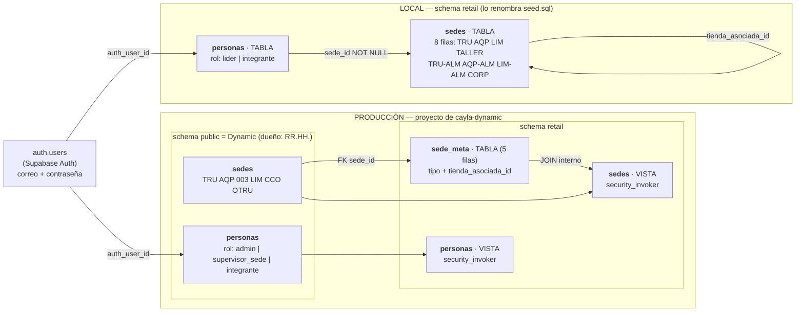
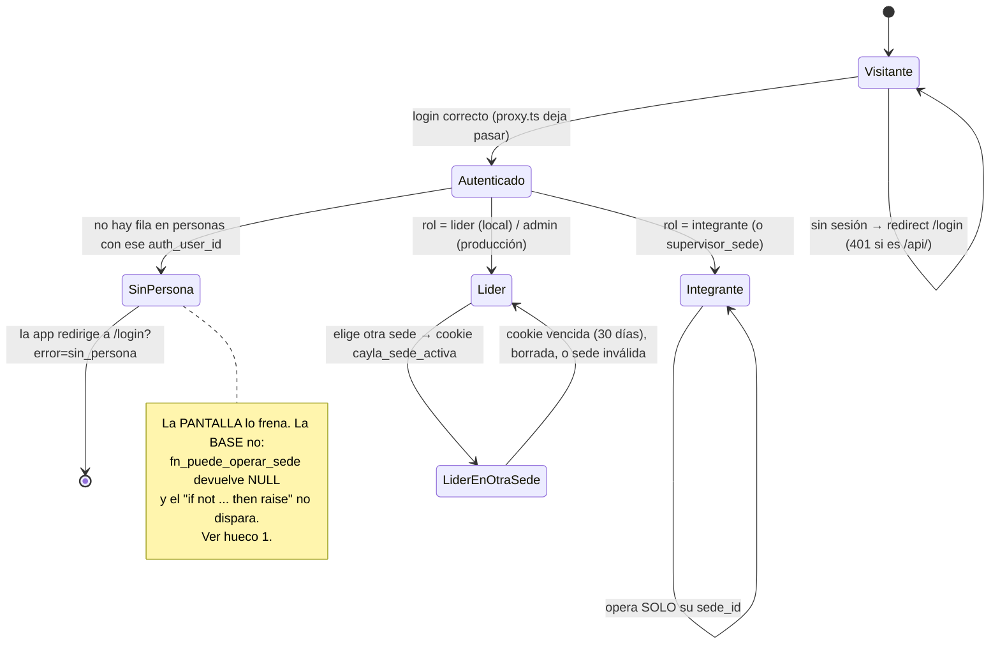

# 01 · Identidad y acceso
> **Pájaro:** GANSO · **Lo lleva:** _(libre — apúntate en `07-GOBIERNO.md`)_ · **Última revisión:** 2026-09-12

## Para qué existe

Una prenda vale plata y una caja tiene efectivo adentro. Alguien que entra al sistema
tiene que quedar amarrado a **una persona con nombre** y a **una sede**, porque todo lo
demás —el movimiento de stock, la venta, el cierre de caja, el conteo— se pregunta
siempre las mismas dos cosas: *quién lo hizo* y *dónde*. Este módulo es la respuesta a
esas dos preguntas, y es de donde el resto del sistema saca el permiso para dejar pasar
o frenar una operación.

También es la **frontera con el otro sistema**. En producción CAYLA no tiene su propia
lista de sedes ni de colaboradores: las lee de cayla-dynamic, el sistema de personal.
Esa costura es la parte más delicada del módulo y la que más se rompe cuando alguien
asume que local y producción son iguales.

## El mapa



Ciclo de vida de una sesión — quién es la persona en cada momento:



## Las tablas

### `sedes` — dónde pasa todo: las tres tiendas, el Taller y la sede corporativa
**Existe en:** local y producción — **pero no es la misma cosa.** En local es una TABLA
del repo. En producción es una **VISTA** (`retail.sedes`, `unificacion/03_candados.sql:14`)
sobre `public.sedes` de Dynamic unida a `retail.sede_meta`.
**Quién escribe:** nadie desde la app. En local la siembran las migraciones
(`0001_init.sql:8` las tiendas y el Taller, `0008_almacen.sql:14` los almacenes,
`0020_contabilidad_cimientos.sql:27` el corporativo). En producción la escribe Dynamic
en su propia tabla; retail solo mira. No hay política de INSERT/UPDATE en local —
solo `sedes_select_autenticado` — así que por la API no se puede crear ni editar una
sede ni siendo Líder: se hace por SQL (D-11).

**Columnas en LOCAL** (tabla):

| Columna | Tipo | Vacío | Por defecto | Para qué sirve |
|---|---|---|---|---|
| `id` | uuid | no (PK) | `gen_random_uuid()` | La identidad de la sede; es lo que viaja en cada movimiento, venta y caja. |
| `codigo` | text | no (único) | — | Cómo se la nombra en voz alta: `TRU`, `AQP`, `LIM`, `TALLER`, `TRU-ALM`, `AQP-ALM`, `LIM-ALM`, `CORP`. |
| `nombre` | text | no | — | Nombre largo para pantalla ("Trujillo", "Taller (Lima)"). |
| `tipo` | text | no | — | `tienda` / `fabrica` / `almacen` / `corporativo`. Es lo que decide de verdad: el Taller se encuentra por `tipo='fabrica'`, nunca por su código. |
| `activo` | boolean | no | `true` | Bandera de sede viva. **Hoy nadie la mira** — ver hueco 6 y ADR-0029. |
| `created_at` | timestamptz | no | `now()` | Cuándo se dio de alta. |
| `updated_at` | timestamptz | no | `now()` | Lo pisa el trigger `sedes_set_updated_at` en cada UPDATE. |
| `tienda_asociada_id` | uuid | sí | — | Apunta de un almacén `-ALM` a su tienda. Modelo VIEJO: ver "Candados" y hueco 5. |

**Columnas en PRODUCCIÓN** (vista; verificado contra la base en `docs/datos/generado/retail_columnas.json`):

| Columna | Tipo | Vacío | Por defecto | Para qué sirve |
|---|---|---|---|---|
| `id` | uuid | sí (es vista) | — | `public.sedes.id` de Dynamic. |
| `codigo` | text | sí | — | `TRU`, `AQP`, `003` (tienda de Lima), `LIM` (el Taller), `CCO` (corporativo). **El código dejó de ser legible** — por eso existe `lib/etiqueta-sede.ts`. |
| `nombre` | text | sí | — | De Dynamic. Es la única fuente donde quedó la ciudad de la tienda `003` ("Tienda LIM"). |
| `tipo` | text | sí | — | Sale de `retail.sede_meta.tipo`, no de Dynamic. Dynamic no modela esto. |
| `tienda_asociada_id` | uuid | sí | — | Sale de `retail.sede_meta`. Hoy NULL en las 5 filas. |
| `activo` | boolean | sí | — | Es `public.sedes.activa` de Dynamic, prestada. **Retail dejó de mirarla** (ADR-0029). |

**Candados** (lo que la base impide que pase):
- `sedes_codigo_key` — UNIQUE(codigo). **Solo local.** Dos sedes no pueden compartir código.
- `sedes_codigo_check` — CHECK del código contra una lista cerrada de 8 valores. **Solo local.** Garantiza que nadie invente una sede "LIMA2" a mano; también es lo que hace imposible cargar la sede `003` de producción en local.
- `sedes_tipo_check` — CHECK `tipo in ('tienda','fabrica','almacen','corporativo')`. **Solo local.** En producción el mismo candado vive en `sede_meta_tipo_check`, sobre `retail.sede_meta`, con la misma lista.
- `sedes_tienda_asociada_id_fkey` — FK a `sedes(id)`. **Solo local.**
- `sedes_pkey` — PRIMARY KEY(id). **Solo local**: una vista no tiene clave primaria, y por eso el tipo generado de producción marca **todas** sus columnas como nullables (`packages/database/src/types.ts:2321`). De ahí el filtro defensivo de `lib/sedes.ts:38`.

**Diferencias local vs producción:**
- **La sede corporativa se llama distinto:** `CORP` en local, `CCO` en producción. D-20 lo zanja: `CCO` es el nombre correcto y `CORP` es un error de local que se corrige.
- **Los almacenes son otra cosa.** Local tiene tres sedes hermanas `TRU-ALM`/`AQP-ALM`/`LIM-ALM` con `tipo='almacen'` (`0008_almacen.sql:14`). Producción nunca las creó: el almacén es un **contenedor dentro de la misma sede** (`unificacion/12_almacen_interno.sql`). Las `-ALM` de local son legado y no se borran, pero ninguna pantalla nueva debe ofrecerlas (`0044_almacen_interno.sql:58-66`).
- **En producción no se puede escribir.** La vista une dos tablas, así que Postgres no la hace actualizable — no existe `Insert`/`Update` en el tipo generado.
- **Dynamic tiene una sexta sede que nunca llega:** `OTRU` (Oficina TRU). El JOIN de la vista es interno y no tiene fila en `sede_meta`, así que retail no la ve (ADR-0029, nota al margen).
- **Producción tiene además `retail.sede_datos_fiscales`** (`sede_id`, `direccion`, `ubigeo`, `departamento`, `provincia`, `distrito`, `telefono`, `updated_at`; 1 fila). No existe en local, no la crea ningún archivo del repo y **ningún código la lee**. Ver hueco 7.

---

### `retail.sede_meta` — lo que CAYLA sabe de una sede y Dynamic no modela
**Existe en:** solo producción.
**Quién escribe:** nadie. La sembró `unificacion/01_sedes.sql:32` una sola vez en julio de
2026 y desde entonces no la toca ningún RPC ni ninguna pantalla. Una sede nueva en
Dynamic **no aparece en CAYLA** hasta que alguien le inserte su fila a mano (D-11).

| Columna | Tipo | Vacío | Por defecto | Para qué sirve |
|---|---|---|---|---|
| `sede_id` | uuid | no (PK) | — | FK a `public.sedes(id)` de Dynamic, `on delete cascade`. Una fila por sede, nunca dos. |
| `tipo` | text | no | — | `tienda` / `fabrica` / `corporativo` / `almacen`. Es el dato que hace funcionar todo lo demás: el Taller se encuentra por `tipo='fabrica'` porque su código en producción es `LIM` y confundiría con la tienda de Lima. |
| `tienda_asociada_id` | uuid | sí | — | Apuntaría de un almacén a su tienda. **Hoy NULL en las 5 filas** — el modelo de almacén cambió (ver `sedes`). |
| `created_at` | timestamptz | no | `now()` | Cuándo se le colgó el `tipo` a esa sede. |

**Candados:**
- `sede_meta_pkey` — PRIMARY KEY(sede_id). Una sede no puede tener dos tipos a la vez.
- `sede_meta_tipo_check` — CHECK sobre los 4 valores. Un `tipo` inventado no entra.
- `sede_meta_sede_id_fkey` — FK a `public.sedes(id)` **con `on delete cascade`**: si Dynamic borra una sede, la fila de meta se va con ella y esa sede desaparece de `retail.sedes` (el JOIN es interno). Nada de retail avisa.
- `sede_meta_tienda_asociada_id_fkey` — FK a `public.sedes(id)`.
- Política `sede_meta_read` (SELECT, rol `authenticated`, `using (true)`): cualquiera con cuenta lee los tipos de sede. No hay política de escritura, así que por la API no se puede tocar.

**Diferencias local vs producción:** no existe en local, y por eso `gen-types` desde local
la borra del archivo de tipos (`packages/database/src/types.ts:12-14`). **El archivo del
repo está mal:** `unificacion/01_sedes.sql:19` crea `retail_sede_meta` en `public`, y lo
que hay vivo en producción es `retail.sede_meta` en el schema `retail` —con la política
llamada `sede_meta_read`, no `retail_sede_meta_read`—. El paso que la movió (el "paso 02"
de la unificación) **nunca quedó versionado** (`unificacion/12_almacen_interno.sql:38-40`).

---

### `personas` — el colaborador detrás de cada movimiento
**Existe en:** local y producción — **pero no es la misma cosa.** En local es una TABLA
del repo. En producción es una **VISTA** (`retail.personas`,
`unificacion/03_candados.sql:21`) sobre `public.personas` de Dynamic.
**Quién escribe:** ninguna pantalla y ningún RPC de retail. En local la siembra
`supabase/seed.sql:92` (un solo colaborador de desarrollo) y el alta real se hace por SQL
(D-11). En producción la escriben las pantallas de Dynamic. **Dar de alta a un
colaborador no es una función de CAYLA retail.**

**Columnas en LOCAL** (tabla):

| Columna | Tipo | Vacío | Por defecto | Para qué sirve |
|---|---|---|---|---|
| `id` | uuid | no (PK) | `gen_random_uuid()` | Es lo que queda estampado en `movimientos.usuario_id`, `cajas.abierta_por`, `conteos.cerrado_por`… el "quién" de todo el historial. |
| `auth_user_id` | uuid | sí (único) | — | El puente con la cuenta de Supabase Auth. `on delete set null`: si se borra el login, la persona sobrevive y el historial no pierde el nombre. |
| `nombre` | text | no | — | Cómo se la llama en pantalla. |
| `sede_id` | uuid | no | — | Su sede base. FK a `sedes(id)`. Es el "dónde puede operar" cuando no es Líder. |
| `rol` | text | no | — | `lider` o `integrante`. Nada más. |
| `activo` | boolean | no | `true` | Bandera de colaborador vigente. **Nadie la mira** — ver hueco 4. |
| `created_at` | timestamptz | no | `now()` | Cuándo se dio de alta. |
| `updated_at` | timestamptz | no | `now()` | Lo pisa el trigger `personas_set_updated_at`. |

**Columnas en PRODUCCIÓN** (vista; verificado en `docs/datos/generado/retail_columnas.json`):

| Columna | Tipo | Vacío | Por defecto | Para qué sirve |
|---|---|---|---|---|
| `id` | uuid | sí (es vista) | — | `public.personas.id` de Dynamic. Es a lo que apuntan todas las FK de retail. |
| `auth_user_id` | uuid | sí | — | El mismo puente con Supabase Auth. La cuenta es compartida entre los dos sistemas. |
| `nombre` | text | sí | — | **Calculado:** `nombres || ' ' || coalesce(apellidos,'')`. No se puede escribir. |
| `sede_id` | uuid | sí | — | **Es `public.personas.sede_base_id`**, renombrado por la vista. |
| `rol` | text | sí | — | **Calculado:** el enum de Dynamic pasado a texto — `admin`, `supervisor_sede`, `integrante`. No se puede escribir. |
| `email` | text | sí | — | Correo del colaborador. **Solo producción**: local no tiene esta columna. |
| `estado` | text | sí | — | Estado laboral según Dynamic. **Solo producción**: el equivalente de `activo` en local, con otro nombre y otros valores. Nadie de retail lo mira. |

**Candados:**
- `personas_auth_user_id_unique` — UNIQUE(auth_user_id). **Solo local** (`0006_personas_auth_user_id_unique.sql:9`, ADR-0002). Nació de un desastre real: un INSERT corrido cuatro veces dejó 4 filas para el mismo login y `requirePersonaActual()` usa `.single()`, así que esa cuenta quedó inutilizable pese a estar "dada de alta". El constraint vuelve ese estado imposible en vez de confiar en que nadie repita el INSERT. **En producción ese candado no se ve desde retail** — si existe, vive en Dynamic, y este repo no lo verifica (hueco 3).
- `personas_pkey` — PRIMARY KEY(id). **Solo local.**
- `personas_sede_id_fkey` / `personas_auth_user_id_fkey` — FK a `sedes(id)` y a `auth.users(id)`. **Solo local.**
- `personas.sede_id NOT NULL` y `personas.rol NOT NULL` — **solo local.** En la vista de producción todo es nullable, y por eso `lib/persona.ts:82` trata "persona sin sede" igual que "sin persona".

**Diferencias local vs producción:**
- **Vocabularios de rol distintos.** Local: `lider` / `integrante` (CHECK cerrado). Producción: `admin` / `supervisor_sede` / `integrante` (enum de Dynamic). La única traducción del sistema es `mapearRol()` en `lib/persona.ts:49-51`; reconocer uno solo dejaba al Líder local fuera de Finanzas, Facturación y Producción (ADR-0010).
- **`supervisor_sede` se cae a `integrante`** a propósito (`lib/persona.ts:47`): "el supervisor ve sus reportes" es una decisión pendiente, no un olvido.
- **`activo` (local) vs `estado` (producción)**: mismo concepto, dos nombres, ninguno se usa.
- **En producción la vista es de una sola tabla**, así que Postgres **sí** la hace actualizable en `id`, `auth_user_id`, `sede_id`, `email` y `estado` (`packages/database/src/types.ts:2291-2320`). Quién puede hacerlo lo deciden las políticas de Dynamic, no las de retail: la vista es `security_invoker = true`. Ver hueco 3.
- **Todas las tablas de retail en producción apuntan con FK a `public.personas` y `public.sedes` de Dynamic**, no a las vistas (verificado en `docs/datos/generado/retail_fks_cruzadas.json`: 30 FK cruzadas). Esa es la forma real de la frontera: retail guarda ids que son de otro sistema.

## Cómo se escribe (la única puerta)

**Este módulo no tiene RPC de escritura.** Ni `sedes` ni `personas` se escriben desde
CAYLA retail, en ninguno de los dos entornos. Lo único que se escribe es una **cookie**.
Las funciones que siguen son todas de lectura: son el candado que el resto de los módulos
consulta antes de dejar pasar una operación.

### Helpers de LOCAL

| Firma exacta | Qué contesta | Candado que aplica | Idempotente |
|---|---|---|---|
| `fn_es_lider() returns boolean` | ¿Quien llama es Líder de equipo? | ninguno (él ES el candado) | sí, solo lee |
| `fn_sede_actual_persona() returns uuid` | ¿Cuál es su sede base? | ninguno | sí, solo lee |
| `fn_persona_actual() returns personas` | Su fila entera de `personas` | ninguno | sí, solo lee |
| `fn_puede_operar_sede(p_sede_id uuid) returns boolean` | ¿Puede tocar ESTA sede? | rol + sede | sí, solo lee |

Las tres primeras son `language sql stable **security definer** set search_path = public`
(`0023_rls_helpers_security_definer.sql`). `fn_puede_operar_sede` es
`language sql stable set search_path = public` — **sin `security definer`**
(`0012_rpc_valida_sede.sql:15`). Su cuerpo, textual:

```sql
select fn_es_lider()
  or p_sede_id = fn_sede_actual_persona()
  or exists (select 1 from sedes
             where id = p_sede_id and tienda_asociada_id = fn_sede_actual_persona());
```

**Por qué las tres primeras son `security definer` — la recursión infinita de `0023`.**
El problema, contado como pasa en una tienda: la política que decide quién puede leer
`personas` llama a `fn_es_lider()`; `fn_es_lider()` para contestar tiene que **leer
`personas`**; leer `personas` vuelve a evaluar la política; la política vuelve a llamar a
`fn_es_lider()`… y así hasta que Postgres corta con *"stack depth limit exceeded"*. Es
como pedirle a la Líder de AQP la llave del almacén y que ella conteste "déjame consultar
al que tiene la llave del almacén". Nunca termina. Se manifestó consultando
`activos_fijos`, que tiene dos políticas colgadas de estas funciones, y la pantalla
simplemente reventaba.

El arreglo es el patrón estándar de Supabase: las tres funciones pasan a `security
definer`, o sea corren con los permisos de quien las creó y **leen `personas` sin pasar
por RLS**. El ciclo se rompe en el primer paso. Es seguro porque cada una filtra por
`where auth_user_id = auth.uid()` — solo pueden devolver la fila de quien está preguntando,
nunca la de otro (`0023_rls_helpers_security_definer.sql:1-18`).

**`fn_puede_operar_sede` no necesita `security definer`** porque no lee `personas`
directo: llama a las otras dos, que ya la tienen. El `exists` sobre `sedes` sí queda
sujeto a RLS, pero la única política de `sedes` (`sedes_select_autenticado`) deja pasar a
cualquiera con sesión.

### Helpers de PRODUCCIÓN

| Firma exacta | Cuerpo | Nota |
|---|---|---|
| `retail.es_lider() returns boolean` | `select coalesce(public.fn_rol_actual() = 'admin', false)` | el `admin` de Dynamic = Líder |
| `retail.es_supervisor() returns boolean` | `select coalesce(public.fn_rol_actual() = 'supervisor_sede', false)` | **MUERTO**: ninguna policy ni RPC la llama |
| `retail.mi_sede() returns uuid` | `select public.fn_sede_actual_persona()` | **sin `coalesce` a propósito**: devuelve uuid, y ahí NULL sí es la respuesta correcta ("no tengo sede") |
| `retail.puede_operar_sede(p_sede_id uuid) returns boolean` | `coalesce(rol='admin',false) or coalesce(sede = p_sede_id, false)` | **no tiene** la rama de `tienda_asociada_id` que sí tiene local |
| `retail.persona_actual() returns table(id, auth_user_id, nombre, sede_id, rol, email)` | `security definer` sobre `public.personas` | **MUERTO**: nadie la llama |

Las cuatro primeras son `language sql stable set search_path = public`. Todas se apoyan en
**funciones de Dynamic** (`public.fn_rol_actual()`, `public.fn_sede_actual_persona()`) que
no viven en este repo y que este repo no puede verificar.

### El cambio de sede activa — lo único que este módulo escribe

**Archivo:** `apps/web/app/actions/sede.ts`. Server Action, no RPC.

```ts
export async function cambiarSedeActiva(sedeId: string)
```

Escribe la cookie `cayla_sede_activa` (`app/actions/sede.ts:8`) con
`httpOnly: true, sameSite: "lax", path: "/", maxAge: 30 días` (`:52`). La acción:

1. Verifica el JWT localmente con `getClaims()` (ES256, sin viaje de red — ADR-0013).
2. Relee el rol de `personas` y **falla en duro** si la consulta se cae (`exigir`, `:36`).
   Antes devolvía en silencio y el Líder tocaba el selector sin que pasara nada:
   indistinguible de "no tienes permiso".
3. Si `mapearRol(...) !== "lider"` → retorna sin hacer nada (`:39`). Un Integrante no
   cambia de sede.
4. Si la sede no existe o es `tipo='almacen'` → retorna sin hacer nada (`:49`).

**La cookie es solo perspectiva, nunca permiso.** `lib/persona.ts:99-110` la lee y cambia
la sede desde la que se ve la app, pero el permiso real lo vuelve a validar el servidor
en cada RPC con `fn_puede_operar_sede` / `retail.puede_operar_sede`. Está escrito así en
`proxy.ts:18-21` y en `app/actions/sede.ts:11-12`. Idempotente: escribir la misma cookie
dos veces es lo mismo que escribirla una.

### Pantallas que escriben directo a una tabla del módulo

**Ninguna.** Las seis referencias a `personas` en la app son SELECT
(`lib/persona.ts:74`, `lib/actividad.ts:92`, `app/actions/sede.ts:26`,
`app/api/export/inventario/route.ts:15`, `app/api/padron/route.ts:54`,
`app/(app)/producto/[varianteId]/page.tsx:114`), y las tres de `sedes` también
(`lib/sedes.ts:34`, `app/actions/sede.ts:44`, `app/(app)/vender/facturacion/page.tsx:36`).
La superficie de riesgo no está en una pantalla: está en el hueco 2, que se alcanza por
API directa sin pasar por ninguna pantalla.

## Quién ve y quién toca

Los cuatro niveles de D-12 son **Admin · Líder de equipo · Integrante · Solo lectura**.
**Hoy existen dos**, y hay que decirlo sin rodeos:

| Nivel de D-12 | Qué hay en la base hoy |
|---|---|
| **Admin** | `rol='lider'` (local) / `rol='admin'` (producción). |
| **Líder de equipo** | **No existe separado de Admin.** La app junta los dos en uno solo (`mapearRol`, `lib/persona.ts:49-51`). Producción tiene el valor `supervisor_sede` y hasta una función para leerlo (`retail.es_supervisor()`), pero **ninguna policy ni RPC la llama**, y `mapearRol` lo manda a Integrante. |
| **Integrante** | `rol='integrante'`. Existe y funciona. |
| **Solo lectura** | **No existe.** Ningún valor de rol, ninguna policy, nada para el contador externo. |

Sobre las operaciones propias de este módulo, según las policies que están escritas:

| Operación | Admin / Líder de equipo | Integrante | Solo lectura |
|---|---|---|---|
| Ver la lista de sedes | sí (`sedes_select_autenticado`, local) | sí — la misma policy: basta tener sesión | n/a |
| Ver a los demás colaboradores | sí (`personas_select_lider`, local) | **no** — solo su propia fila (`personas_select_propia`) | n/a |
| Editar un colaborador | sí por la API (`personas_update_lider`, local) — **ninguna pantalla lo usa** | no | n/a |
| Dar de alta / de baja a un colaborador | **nadie**: no hay policy de INSERT ni de DELETE. Se hace por SQL (D-11) o desde Dynamic | no | n/a |
| Crear o editar una sede | **nadie**: no hay policy de INSERT ni de UPDATE en `sedes` | no | n/a |
| Cambiar la sede desde la que trabaja | sí (selector del AppShell, `SedeSwitcher.tsx`) | **no** — `app/actions/sede.ts:39` corta | n/a |
| Operar sobre otra sede | sí (`fn_es_lider()` da true en `fn_puede_operar_sede`) | **no** — solo su `sede_id` | n/a |

En **producción** la lectura de `retail.personas` y `retail.sedes` **no la deciden las
policies de retail**: las vistas son `security_invoker = true`, o sea que se aplican las
políticas de Dynamic sobre `public.personas` y `public.sedes`. Este repo no las contiene y
no las verifica.

## Qué se rompe sin esto

Sin este módulo nadie entra: `requirePersonaActual()` corre en el layout de toda la app
(`app/(app)/layout.tsx:7`) y manda a `/login` a quien no resuelva. No es que se degrade
una pantalla — no hay pantallas.

Si la resolución de sede falla, la caja no sabe de qué tienda es el efectivo que está
contando, el movimiento de stock no sabe de qué piso salió la prenda y el comprobante no
sabe qué serie usar. Si la lista de sedes viene vacía, el selector queda en blanco y el
stock por tienda no se puede cruzar — por eso `lib/sedes.ts:31-36` **revienta con error**
en vez de devolver `[]`: un fallo de red disfrazado de "CAYLA no tiene tiendas" es peor
que un error visible.

Y si el candado de sede falla en la dirección contraria —deja pasar de más—, un
Integrante de Arequipa puede mover stock, abrir caja o cerrar un conteo en Trujillo por
API directa, sin que ninguna pantalla lo muestre. Eso es exactamente el hueco 1.

## Huecos conocidos

1. **`fn_puede_operar_sede` devuelve NULL, y el patrón que usan 35 sitios no lo frena.
   (Solo local.)** El cuerpo de `0012_rpc_valida_sede.sql:15-23` es
   `fn_es_lider() or p_sede_id = fn_sede_actual_persona() or exists(...)`. Si la persona
   no tiene fila en `personas`, `fn_sede_actual_persona()` devuelve NULL, la comparación
   da NULL, y `false or NULL or false` = **NULL**. Y en el patrón que usan todas las RPC —
   `if not fn_puede_operar_sede(...) then raise exception ... end if` — **`not NULL` no es
   `true`**, así que el `raise` no dispara y la función sigue de largo. El candado se abre
   solo, justo para el caso que debía cerrar. En una policy de RLS, NULL deniega; en un
   `if` de plpgsql, abre — por eso mirando RLS no se ve.
   **Dónde:** 35 llamadas con `if not fn_puede_operar_sede(...)` repartidas en 20
   migraciones locales (`0012:52,84,127,178,230`, `0013:133`, `0017:49`, `0018:64`,
   `0021:34`, `0025:34`, `0026:41`, `0027:56,123`, `0028:30,57`, `0029:45,91,194`,
   `0031:67`, `0032:91`, `0034:86,200,264,308`, `0037:64,144`, `0038:40`, `0040:77`,
   `0041:83`, `0044:229,269`, `0048:180,212,300`, `0059:50`). **Una sola** usa la forma
   segura: `registrar_venta`, con `if fn_puede_operar_sede(...) is not true`
   (`0054_venta_idempotente.sql:115`).
   **La consecuencia en la tienda:** alguien con cuenta de Supabase Auth válida pero sin
   fila en `personas` —el caso normal entre "te creé el usuario" y "te di de alta"— puede
   llamar a `registrar_movimiento` por API contra **cualquier** sede. La pantalla lo frena
   (`lib/persona.ts:83` lo manda a `/login?error=sin_persona`), la base no. Y el
   movimiento entra con `usuario_id = NULL`, porque `movimientos.usuario_id` es nullable:
   stock movido en Trujillo, sin autor.
   **En producción este agujero está cerrado**, pero por el otro lado: `retail.puede_operar_sede`
   lleva `coalesce` en las dos ramas (`unificacion/03_candados.sql:76-79`) y nunca devuelve
   NULL. Local nunca recibió ese endurecimiento.

2. **El endurecimiento de producción vivió meses sin archivo, y volver a pegar el repo lo
   deshacía.** Alguien parchó a mano `retail.es_lider`, `retail.es_supervisor` y
   `retail.puede_operar_sede` en el SQL Editor y no quedó escrito en ningún lado.
   `unificacion/03_candados.sql` seguía con la versión sin `coalesce`, así que **volver a
   pegarlo —lo que haría cualquiera siguiendo el repo— desarmaba el candado en silencio**
   (`docs/BACKLOG.md:410-445`). Se corrigió el archivo y se agregó
   `unificacion/36_candados_no_null.sql` el 2026-09-10. Queda el problema de fondo, sin
   cerrar: del barrido salieron **diez** funciones de producción cuyo cuerpo no coincide
   con ningún archivo del repo; se cerraron tres (las de permisos) y **quedan siete**.

3. **En producción nadie verifica que un login mapee a una sola persona.** El constraint
   `personas_auth_user_id_unique` existe **solo en local** (`0006:9`). Nació de un
   desastre real en producción, antes de la unificación: 4 filas para el mismo
   `auth_user_id` dejaron esa cuenta inutilizable porque `lib/persona.ts:74` usa
   `.single()` (ADR-0002). Hoy la tabla real es `public.personas` de Dynamic y este repo
   **no sabe** si tiene ese candado. **Consecuencia:** un alta duplicada del lado de
   Dynamic deja a un colaborador sin poder entrar a CAYLA, con el mismo error que "no
   existes", y el equipo de retail no tiene dónde mirar.

4. **Una baja no cierra la puerta.** `personas.activo` (local) y `personas.estado`
   (producción) existen y **nadie los consulta**: `lib/persona.ts:74` pide
   `id, nombre, rol, sede_id` y nada más; ninguna policy ni ningún helper los menciona.
   **Consecuencia:** una colaboradora que ya no trabaja en CAYLA sigue entrando, vendiendo
   y cerrando caja mientras su cuenta de Supabase Auth exista. La baja hay que hacerla
   borrando el login, no marcándola en el sistema.

5. **`tienda_asociada_id` es una rama de permiso que ya no lleva a ningún lado.**
   `fn_puede_operar_sede` (local) tiene un `exists` sobre `sedes.tienda_asociada_id` para
   que un Integrante pueda operar el almacén de su tienda (`0012:15-23`). Ese modelo se
   abandonó: desde `0044_almacen_interno.sql` el almacén es un contenedor dentro de la
   misma sede. Producción **nunca** tuvo esa rama (`unificacion/12_almacen_interno.sql:56-63`).
   La app lee la columna (`lib/sedes.ts:34`) y **no decide nada con ella**. Es código
   MUERTO que sigue vivo porque borrarlo obliga a reescribir `fn_puede_operar_sede`, que
   es la función más llamada del sistema (D-07).

6. **La bandera `activo` de una sede no la pone CAYLA.** En producción `retail.sedes.activo`
   **es `public.sedes.activa` de Dynamic**, prestada. Los dos criterios no coinciden: para
   CAYLA la tienda de Lima está abierta y operando; para Dynamic figuraba inactiva, y eso
   dejaba una sede donde se podía vender pero no cargarle el alquiler. Decisión de Felipe
   (ADR-0029): retail dejó de mirar el flag. **Lo que se paga:** el día que se cierre una
   sede de verdad, seguirá apareciendo. La salida escrita es una columna propia en
   `retail.sede_meta`, no volver a colgarse de Dynamic
   (`app/(app)/finanzas/egresos/page.tsx:39-44`).

7. **Dos tablas de producción que este repo no describe.** `retail.sede_datos_fiscales`
   (8 columnas, 1 fila: dirección, ubigeo, departamento, provincia, distrito, teléfono de
   la sede) **no la crea ningún archivo del repo y ningún código la lee** — verificado con
   `grep` sobre todo el árbol. Y `retail.sede_meta` vive en el schema `retail` mientras
   `unificacion/01_sedes.sql:19` crea `retail_sede_meta` en `public`: el paso que la movió
   nunca quedó versionado. **Consecuencia:** `npx supabase db reset` + la carpeta
   `unificacion/` NO reproduce producción, y el próximo comprobante que necesite la
   dirección fiscal de la sede la va a buscar a una tabla que en local no existe.

### Promesas incumplidas (D-24)

8. **`0003_rls.sql:1-3` promete que el Integrante no ve costo ni margen.** Cita exacta:
   *"Líderes ven todo (todas las sedes, costos/precios); Integrantes solo ven/operan su
   propia sede y no ven costo/margen"*. La policy que escribe dos líneas más abajo,
   `variantes_select_autenticado` (`0003_rls.sql:58`), deja leer **la tabla entera** —
   `costo` incluido— a cualquiera con sesión. Nunca fue cierto. D-27 zanja que los costos
   **se dejan visibles** por transparencia; lo que se corrige es el comentario, que
   describe algo que no existe.

9. **`0012_rpc_valida_sede.sql:10-16` promete "el mismo criterio que las reglas de las
   tablas".** Cita exacta: *"Ahora cada función aplica el mismo criterio que las reglas de
   las tablas: «eres Líder, o eres de esta sede (o de su almacén asociado). Si no,
   error»"*. No es el mismo criterio, y la diferencia es justo la peligrosa: en una policy
   de RLS, NULL **deniega**; en el `if not ... then raise` que escribe esa misma
   migración, NULL **deja pasar** (hueco 1).

10. **La documentación dice cuatro niveles de permiso; la base tiene dos.** D-12 define
    Admin, Líder de equipo, Integrante y Solo lectura. El CHECK de `personas.rol` en local
    admite exactamente `('lider','integrante')` (`0001_init.sql:30`) y `mapearRol`
    (`lib/persona.ts:49-51`) colapsa a dos también el vocabulario de producción.
    **Consecuencia concreta:** no hay forma de darle acceso al contador externo sin darle
    permiso de escritura, y no hay forma de que una Líder de equipo mande en su sede sin
    mandar además en las otras tres.

11. **D-14 promete cubrir otra sede temporalmente; no existe.** *"puede cubrir otra
    temporalmente (permiso con fecha de vencimiento — hoy no existe, hay que
    construirlo)"*. Lo más cercano es la cookie `cayla_sede_activa`, que dura 30 días
    (`app/actions/sede.ts:52`), **no tiene fecha de vencimiento del permiso** y solo la
    puede usar quien ya podía operar todas las sedes. Hoy cubrir una sede se resuelve
    haciendo Líder a alguien, que es exactamente lo que D-14 quería evitar.

12. **El código todavía dice "Encargada" — y una vez en pantalla, no en un comentario.**
    68 apariciones en `apps/web` y `supabase` (`lib/persona.ts:12`,
    `components/SedeSwitcher.tsx:9`, `app/(app)/layout.tsx:9`,
    `0048_conteos.sql:13,19`, `0054_venta_idempotente.sql:19,40`, entre otras). D-12 fija
    **Líder de equipo** porque en CAYLA hay hombres y mujeres en ese puesto. La grave es
    `app/(app)/mas/page.tsx:29`: **imprime "Encargada de atención al cliente" en la
    pantalla**, con género femenino fijo, a cualquier Integrante que abra el menú. Las
    otras 67 son comentarios, que solo lee quien entra al equipo; ésta la lee el
    colaborador todos los días.

## Decisiones que lo gobiernan

- **D-12** — cuatro niveles (Admin · Líder de equipo · Integrante · Solo lectura), un solo vocabulario en todo CAYLA. Hoy hay dos: huecos 10 y 12.
- **D-13** — qué puede un Líder de equipo que un Integrante no: cerrar caja, ver costos y márgenes, ajustar stock sin venta, registrar gastos y depósitos, ver las métricas de su sede.
- **D-14** — el Líder manda en su sede y puede cubrir otra con permiso vencible. No existe: hueco 11.
- **D-15** — el Taller es una sede con poderes especiales. Se identifica por `tipo='fabrica'`, nunca por código.
- **D-16** — cada tabla lleva marcado en qué base existe. Es la razón de que este archivo tenga dos tablas de columnas por cada nombre.
- **D-17** — `supabase/unificacion/` es deuda a extinguir con fecha; se documenta honestamente. Huecos 2 y 7.
- **D-20** — la sede corporativa se llama `CCO`; el `CORP` de local es un error que se corrige.
- **D-24** — las promesas incumplidas se documentan con la cita exacta: huecos 8 a 12.
- **D-26** — un Integrante puede operar el almacén de su propia sede. En producción ya se cumple sin la rama de `tienda_asociada_id`, porque el almacén es un contenedor de la misma sede.
- **D-27** — costos y márgenes se dejan visibles por transparencia; lo que se corrige es el comentario de `0003_rls.sql` (hueco 8).
- **D-07** — lo muerto se marca: `fn_persona_actual`, `retail.persona_actual`, `retail.es_supervisor` y la rama `tienda_asociada_id` (hueco 5).
- **D-11** — solo Felipe pega SQL en producción, y queda anotado. Es el único camino para dar de alta una sede en `retail.sede_meta`.
- **ADR-0002** — `personas.auth_user_id` único: el desastre de las 4 filas duplicadas y por qué el candado tiene que estar en la base (hueco 3).
- **ADR-0010** — el entorno local existe: el schema se renombra en `seed.sql`, y `mapearRol` tiene que reconocer los dos vocabularios de rol.
- **ADR-0013** — `getClaims()` en vez de `getUser()`: el JWT se verifica localmente (ES256) en `proxy.ts`, `lib/persona.ts` y `app/actions/sede.ts`.
- **ADR-0026** — saber qué corrió en producción, y por qué un `create or replace` con firma nueva no reemplaza sino que duplica. Es el mecanismo que destapó el hueco 2.
- **ADR-0029** — retail no mira el flag `activa` de Dynamic (hueco 6).
