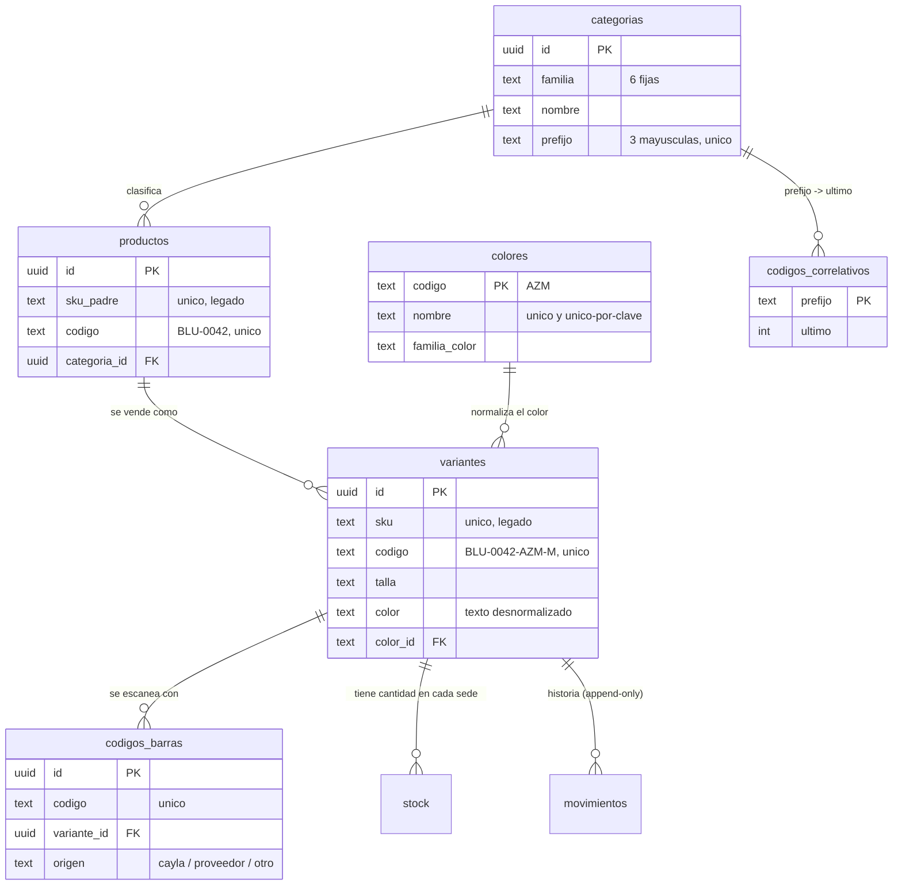
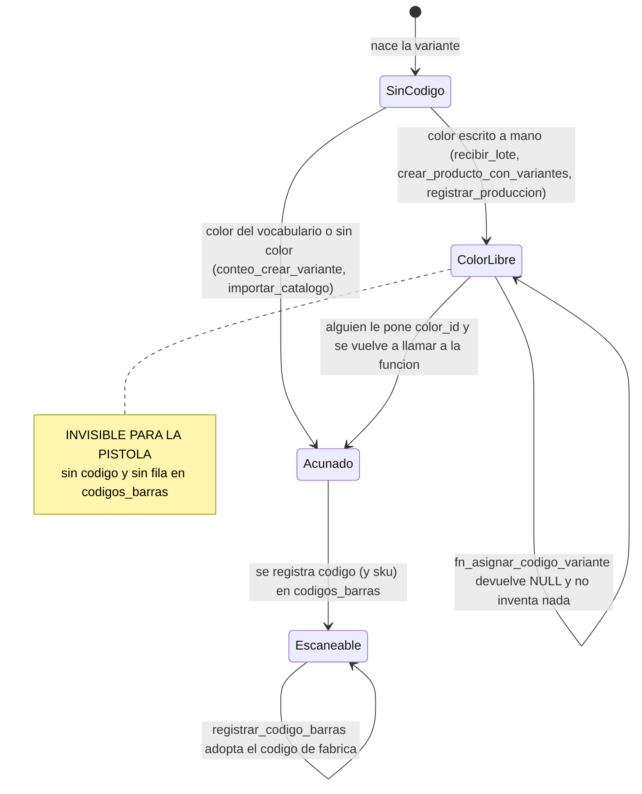

# 02 · Catálogo y vocabulario
> **Pájaro:** LORO · **Lo lleva:** Felipe Alvarez · **Última revisión:** 2026-09-16

> **⚠ Este documento describe el núcleo V1.** Se escribió el 2026-09-12, el mismo día del
> corte a V2 (`0af2f1b`), y no lo menciona. En V2 `variantes` tiene `color_codigo` (FK a
> `colores.codigo`) en vez de `color`/`color_id`, no existen `taxonomia_*`, `importaciones`,
> `producto_atributos` ni `registrar_produccion`, y las migraciones `00xx` que se citan abajo ya
> no están en el repo. Los huecos 1, 2, 4 y 8 se re-verificaron contra V2 y producción el
> 2026-09-16; el resto sigue sin re-verificar.

## Para qué existe

CAYLA no vende "una blusa": vende esa blusa, en talla M, en color vino, en Trujillo.
Ese nivel es el que decide si se repone o no, y ningún sistema contable lo distingue.
Este módulo guarda la ficha de cada prenda en dos pisos —el modelo y lo vendible— y
guarda además el **idioma** con el que se escribe esa ficha: 37 categorías y 30 colores
cerrados, para que cuatro personas capturando 900 prendas en paralelo no inventen cinco
formas de escribir "azul marino". Y le da a cada prenda un nombre corto y estable
(`BLU-0042-AZM-M`) más una lista de códigos de barras, para que la pistola la encuentre.

---

## El mapa

**El ciclo de vida del `codigo` de una variante** — es lo único del módulo que tiene
estados, y explica por qué hay prendas que la pistola no encuentra:

---

## Las tablas

### `productos` — el modelo: "Blusa Aurora", sin talla ni color

**Existe en:** local y producción
**Quién escribe:** `crear_producto_con_variantes`, `recibir_lote`, `registrar_produccion`,
`conteo_crear_variante`, `importar_catalogo`, `deshacer_importacion` (solo `estado`),
`fn_asignar_codigo_producto` (solo `codigo`). Y **directo, sin RPC**:
`components/FotoProducto.tsx:57` (`foto_url`) y `components/RecetaCosto.tsx:70`
(`costo_mano_obra`).

| Columna | Tipo | Vacío | Por defecto | Para qué sirve |
|---|---|---|---|---|
| `id` | uuid | no | `gen_random_uuid()` | La única clave. Todo FK, todo join, toda policy apunta acá. |
| `sku_padre` | text | no | — | Identificador viejo del modelo. Sigue siendo obligatorio y único, pero ya no es el nombre: el nombre es `codigo`. |
| `referencia` | text | no | — | Cómo se llama la prenda para la gente: "Blusa Aurora". |
| `descripcion` | text | sí | — | Texto largo del modelo. Lo escribe `importar_catalogo`; **ninguna pantalla lo lee**. |
| `categoria_id` | uuid | sí | — | De qué categoría es. Null = el producto entra igual y se ve "sin categoría". |
| `genero` | text | sí | — | Texto libre ("Mujer"). Lo escriben dos RPC; **ninguna pantalla lo lee**. |
| `marca` | text | sí | — | Marca del modelo. Se ve en el catálogo y se puede buscar por ella. |
| `temporada` | text | sí | — | Texto libre ("Verano 26"). **Ninguna pantalla lo lee**. |
| `estado` | text | no | `'activa'` | `activa` / `descontinuada` / `agotada`. Descontinuada = desaparece del catálogo (`lib/catalogo.ts:100`) sin borrarse. |
| `foto_url` | text | sí | — | Una foto por modelo, del bucket público `fotos-productos`. |
| `costo_mano_obra` | numeric(12,2) | sí | — | Mano de obra del Taller para ese modelo. Alimenta la receta de costo. |
| `proveedor_id` | uuid | sí | — | Proveedor habitual del modelo. Referencia editable, no candado: quién trajo *este* lote vive en `lotes`. |
| `codigo` | text | sí | — | El nombre corto y estable (`BLU-0042`). Se asigna una vez y no se recalcula. Null mientras nadie lo acuñe. |
| `importacion_id` | uuid | sí | — | De qué importación de catálogo nació. Permite deshacer en bloque. |
| `material` | text | sí | — | **Solo producción.** Tela del modelo, la usa la pantalla de Producción. |
| `created_at` | timestamptz | no | `now()` | Cuándo nació el modelo. |
| `updated_at` | timestamptz | no | `now()` | Lo mueve un trigger en cada update. |

**Candados** (lo que la base impide que pase):
- `productos_pkey` — un modelo no puede tener dos identidades.
- `productos_sku_padre_key` (UNIQUE) — dos modelos no pueden compartir SKU padre. Es lo que hace fallar a "Recibir mercadería" cuando se pide dos veces la misma referencia nueva.
- `productos_estado_check` — el estado solo puede ser `activa`, `descontinuada` o `agotada`. No hay "borrado".
- `productos_codigo_unico` (índice único sobre `codigo`) — dos modelos no pueden llamarse `BLU-0042`.
- **No hay policy de DELETE**: la base no deja borrar un modelo desde la app, en ninguna de las dos. Se descontinúa.

**Diferencias local vs producción:**
- `material` existe **solo en producción** (`supabase/unificacion/11_produccion_material_etapas.sql:16`). `apps/web/app/(app)/produccion/page.tsx:50,55` la consulta: contra la base local esa pantalla falla.
- El trigger de `updated_at` se llama `productos_set_updated_at` en local (`0002_functions.sql:19`) y `productos_updated` en producción (`unificacion/04_catalogo.sql:47`). Hace lo mismo.
- `importacion_id` existe en las dos, pero en producción **no tiene archivo en `supabase/unificacion/`**: se pegó a mano (D-11).

---

### `variantes` — lo que de verdad se vende: esa blusa, talla M, color vino

**Existe en:** local y producción
**Quién escribe:** las mismas cinco RPC que crean catálogo, más `fn_asignar_codigo_variante`
(solo `codigo`) y `registrar_produccion` (pisa `costo` y `precio_taller` de una variante que
ya existía, `0029_orden_produccion.sql:254`). Y **directo, sin RPC**:
`components/RecetaCosto.tsx:77`, que hace `update variantes set costo = … where producto_id = …`
para todas las variantes del modelo de una sola vez.

| Columna | Tipo | Vacío | Por defecto | Para qué sirve |
|---|---|---|---|---|
| `id` | uuid | no | `gen_random_uuid()` | La única clave. `stock`, `movimientos`, `codigos_barras` y las ventas cuelgan de acá. |
| `producto_id` | uuid | no | — | De qué modelo es. `on delete cascade`: si el modelo se fuera, se van sus variantes. |
| `sku` | text | no | — | Identificador viejo, único. Es lo que codifican las etiquetas impresas antes de 2026-09-09, por eso no se toca. |
| `talla` | text | sí | — | Texto libre acotado por `categorias.tallas_sugeridas`. No hay tabla de tallas, a propósito. |
| `color` | text | sí | — | El nombre del color **desnormalizado**, para mostrar y para no romper lo que ya lo leía. |
| `color_id` | text | sí | — | FK dura contra `colores.codigo`. O es null (legado / sin resolver) o es un color real. |
| `costo` | numeric(12,2) | no | `0` | Lo que costó la prenda. Uno solo por variante: el nuevo pisa al viejo (D-45, abierta). |
| `precio` | numeric(12,2) | no | `0` | Precio de lista. Lo ve todo el mundo: la tienda lo necesita para vender. |
| `precio_oferta` | numeric(12,2) | sí | — | **MUERTO.** Lo escribe `crear_producto_con_variantes`; ninguna pantalla lo lee ni lo aplica en la venta. |
| `foto_url` | text | sí | — | **MUERTO.** Ninguna RPC lo escribe y ninguna pantalla lo lee: la foto es del modelo, no de la variante. |
| `stock_minimo` | integer | no | `0` | Mínimo general de la variante. El mínimo por sede vive en `stock.stock_minimo`. |
| `precio_taller` | numeric(12,2) | no | `0` | Precio de referencia del Taller. Lo escribe Producción. |
| `codigo` | text | sí | — | El nombre corto (`BLU-0042-AZM-M`): lo que se imprime en la etiqueta y se dicta por teléfono. |
| `created_at` | timestamptz | no | `now()` | Cuándo nació. `lib/inteligencia.ts` lo usa para "días sin venta" cuando nunca se vendió. |
| `updated_at` | timestamptz | no | `now()` | Lo mueve un trigger. |

**Candados:**
- `variantes_pkey`, `variantes_sku_key` (UNIQUE `sku`) — no hay dos variantes con el mismo SKU.
- `variantes_identidad_unica` — índice único sobre `(producto_id, coalesce(talla,''), coalesce(color,''))`. Es lo que impide que cuatro personas creen cuatro veces "Blusa Aurora M vino". **Ojo: vigila el `color` de texto, no `color_id`** — ver hueco 4.
- `variantes_codigo_unico` — dos prendas no pueden llamarse igual.
- FK `color_id → colores(codigo)`: un color que no está en el vocabulario no se puede referenciar.
- **No hay policy de DELETE.**

**Diferencias local vs producción:**
- `variantes_producto_id_idx` existe **solo en local** (`0001_init.sql:65`). `unificacion/04_catalogo.sql` no crea ningún índice: en producción, listar las variantes de un modelo hace scan.
- Todo lo demás (columnas, únicos, FK de color) es idéntico. Verificado contra el diccionario generado de producción del 2026-09-12.

---

### `categorias` — el vocabulario de clasificación: 6 familias fijas, 37 categorías

**Existe en:** local y producción (37 filas en producción)
**Quién escribe:** `importar_catalogo` crea las que trae el archivo de un cliente nuevo.
Y **directo, sin RPC**: `app/api/taxonomia/anclar/route.ts:131` escribe
`taxonomia_categoria_id`. **Ninguna pantalla da de alta una categoría**: las 37 de hoy
entraron por migración (`0009`, `0030`, `0036`).

| Columna | Tipo | Vacío | Por defecto | Para qué sirve |
|---|---|---|---|---|
| `id` | uuid | no | `gen_random_uuid()` | La clave. `productos.categoria_id` apunta acá. |
| `familia` | text | no | — | Uno de seis: `indumentaria`, `calzado`, `accesorios`, `bisuteria`, `belleza`, `papeleria`. Fijo en el esquema. |
| `nombre` | text | no | — | "Blusas", "Zapatillas". Es lo que se elige en el desplegable. |
| `tallas_sugeridas` | text[] | sí | — | Las tallas que el formulario propone. **No es un candado**: nadie impide escribir otra. |
| `prefijo` | text | no | — | Las tres letras del código (`BLU`). Escritas a mano una por una en `0047_codigos.sql:87-120`. |
| `taxonomia_categoria_id` | text | sí | — | De qué categoría del estándar universal cuelga ésta. Null = sin anclar. |
| `created_at` | timestamptz | no | `now()` | Cuándo se creó. |

**Candados:**
- `categorias_familia_check` — la familia solo puede ser una de las seis. Una séptima familia necesita migración.
- `categorias_familia_nombre_key` (UNIQUE `familia, nombre`) — no hay dos "Blusas" dentro de indumentaria.
- `categorias_prefijo_formato` — el prefijo tiene que ser exactamente tres mayúsculas.
- `categorias_prefijo_unico` — dos categorías no pueden compartir prefijo, o `BLU-0042` sería ambiguo.
- `prefijo` es **NOT NULL**: una categoría insertada a mano sin prefijo la rechaza la base. Es el candado que hace imposible una categoría sin código.
- **No hay columna `activo` ni policy de DELETE**: una categoría mal creada se queda para siempre en el desplegable.

**Diferencias local vs producción:** ninguna en forma. En producción la policy de escritura
usa `retail.es_lider()` y en local `fn_es_lider()`; no es lo mismo (ver "Quién ve y quién toca").

---

### `colores` — las 30 palabras con las que se puede nombrar un color

**Existe en:** local y producción (30 filas en producción)
**Quién escribe:** `importar_catalogo` crea los colores nuevos que trae el archivo de un
cliente. Y **directo, sin RPC**: `app/api/taxonomia/anclar/route.ts:130` escribe
`taxonomia_valor_id`. **Ninguna pantalla da de alta un color** (ver hueco 1).

| Columna | Tipo | Vacío | Por defecto | Para qué sirve |
|---|---|---|---|---|
| `codigo` | text | no | — | La clave, tres mayúsculas: `AZM`. Es el segmento de color del código de la prenda. |
| `nombre` | text | no | — | "Azul marino". Es lo que se copia a `variantes.color` cuando la escritura pasa por un camino que respeta el vocabulario. |
| `familia_color` | text | no | — | Uno de nueve: `neutro`, `azul`, `rojo`, `amarillo`, `verde`, `morado`, `tierra`, `metalico`, `estampado`. Sirve para agrupar y para derivar la familia de un color importado. |
| `hex` | text | sí | — | El chip de color de la pantalla. Para Estampado, Multicolor y Animal print no significa nada y queda null. |
| `activo` | boolean | no | `true` | Si aparece o no en el selector (`lib/conteo.ts:253-257`). |
| `orden` | integer | no | `100` | Orden del selector. Los 30 de CAYLA van del 10 al 92; los importados entran en 200. |
| `taxonomia_valor_id` | text | sí | — | De qué color del estándar universal cuelga: Arena → Beige. Null = sin anclar. |
| `created_at` | timestamptz | no | `now()` | Cuándo entró al vocabulario. |

**Candados:**
- `colores_pkey` sobre `codigo` y `colores_codigo_check` — el código es exactamente tres mayúsculas.
- `colores_nombre_key` (UNIQUE `nombre`) — no hay dos colores con el mismo nombre exacto.
- **`colores_clave_unica`** — índice único sobre `fn_clave_texto(nombre)`. **Este es el candado de verdad**: hace imposible que coexistan "Azul marino", "azul marino", "AZUL MARINO" y "Azul  marino". Lo rechaza la base, no un `if` que alguien olvida en la próxima pantalla.
- `colores_familia_color_check` y `colores_hex_check` — la familia es una de nueve y el hex tiene forma de hex.
- **No hay policy de DELETE.**

**`fn_clave_texto(text)`** es la pieza que sostiene ese índice: pasa a minúsculas, quita
acentos con `translate()`, colapsa espacios repetidos y convierte el vacío en null. Es
`IMMUTABLE` —requisito para poder indexar sobre ella— y usa `translate()` y no `unaccent()`
porque `unaccent` vive en el schema `extensions` y obligaría a tocar el `search_path` de
cada RPC de producción (`0046_colores.sql:61-71`). El importador la replica en TypeScript
(`lib/taxonomia/anclar.ts`, fijada contra Postgres por `anclar.test.ts`).

**Diferencias local vs producción:** ninguna en forma. En producción el índice se define
como `retail.fn_clave_texto(nombre)`.

---

### `codigos_correlativos` — el contador que da el número de cada modelo

**Existe en:** local y producción (4 filas en producción)
**Quién escribe:** solo `fn_siguiente_correlativo(text)`, que es `security definer`. No hay
policy de escritura: ninguna pantalla puede tocarla.

| Columna | Tipo | Vacío | Por defecto | Para qué sirve |
|---|---|---|---|---|
| `prefijo` | text | no | — | La clave: `BLU`, `JEA`, `GEN`. Un contador por prefijo de categoría. |
| `ultimo` | integer | no | `0` | El último número entregado. `BLU-0042` significa que acá dice 42. |
| `updated_at` | timestamptz | no | `now()` | Cuándo se entregó el último número. |

**Candados:**
- `codigos_correlativos_pkey` sobre `prefijo` — un solo contador por prefijo.
- `codigos_correlativos_ultimo_check` — `ultimo >= 0`, nunca retrocede a negativo.
- Sin policy de INSERT/UPDATE/DELETE: RLS activado y sin policy de escritura la deja de solo lectura para la app.

**Por qué es una tabla y no un `create sequence`:** una secuencia de Postgres no es
transaccional — un insert que hace rollback quema el número y deja huecos. Felipe va a leer
`BLU-0042` como "el modelo 42 de blusas", y los huecos lo hacen desconfiar. El
`insert … on conflict do update … returning` toma el lock de fila: es atómico, sin huecos, y
en una sola sentencia (`0047_codigos.sql:139-159`).

**Diferencias local vs producción:** el `search_path` de la función es `public` en local y
`retail, public` en producción. Nada más.

---

### `codigos_barras` — todos los códigos que encuentran la misma prenda

**Existe en:** local y producción (38 filas en producción)
**Quién escribe:** `fn_asignar_codigo_variante` (mete el `codigo` recién acuñado y el `sku`),
`registrar_codigo_barras` (adopta el código de fábrica), `conteo_crear_variante` (los dos
casos a la vez) y el backfill de `0047_codigos.sql:330-332`. Sin policy de escritura: se
escribe por RPC, igual que `stock` y `movimientos`.

| Columna | Tipo | Vacío | Por defecto | Para qué sirve |
|---|---|---|---|---|
| `id` | uuid | no | `gen_random_uuid()` | La clave de la fila. |
| `codigo` | text | no | — | Lo que sale de la pistola: el corto de CAYLA, el SKU viejo, o el EAN que la prenda trae de fábrica. |
| `variante_id` | uuid | no | — | A qué prenda lleva ese código. `on delete cascade`. |
| `origen` | text | no | — | `cayla`, `proveedor` u `otro`. Dice de dónde salió el código. |
| `nota` | text | sí | — | Por qué se registró: "código corto CAYLA", "adoptado durante el conteo". |
| `created_at` | timestamptz | no | `now()` | Cuándo se registró. |
| `creado_por` | uuid | sí | — | Quién lo registró. Null cuando lo escribió una migración o una RPC sin sesión. |

**Candados:**
- `codigos_barras_codigo_key` (UNIQUE `codigo`) — **un código lleva a una sola prenda**. Si dos proveedores reutilizan el mismo EAN, la base lo rechaza ruidosamente en vez de adivinar cuál gana.
- `codigos_barras_origen_check` — el origen es uno de tres.
- `codigos_barras_variante_idx` — índice por variante, para listar todos los códigos de una prenda. Existe en las dos bases.

**Diferencias local vs producción:**
- `creado_por` apunta a `personas` en local y a **`public.personas`** en producción — la tabla real de Dynamic, que retail ve a través de la vista `retail.personas` (`unificacion/03_candados.sql:21`). Es la única FK de este módulo que cruza de schema.

---

## Cómo se escribe (la única puerta)

**Hay cinco caminos que crean catálogo. Tres dejan la prenda invisible para la pistola.**
Eso no es una opinión: una prenda es escaneable si tiene fila en `codigos_barras`, y solo
dos de los cinco caminos escriben ahí.

| # | Camino | Firma | Candado de permiso | Color | ¿Acuña `codigo`? | ¿Escaneable? |
|---|---|---|---|---|---|---|
| 1 | `recibir_lote` | 8 args en local, **7 en producción** (ADR-0004) | `fn_puede_operar_sede(p_sede_id)` | **texto libre** | **no** | **NO** |
| 2 | `crear_producto_con_variantes` | `(text, text, jsonb, uuid, text, text, text, uuid)` | `fn_es_lider()` | **texto libre** | **no** | **NO** |
| 3 | `registrar_produccion` | 15 args | `fn_puede_operar_sede(p_unidad_id)` | **texto libre** | **no** | **NO** |
| 4 | `conteo_crear_variante` | `(uuid, text, text, text, integer, uuid, uuid, numeric, numeric, text, text, uuid)` | `fn_puede_operar_sede(sede del conteo)` | vocabulario cerrado | sí | **SÍ** |
| 5 | `importar_catalogo` | `(jsonb)` | `fn_es_lider()` | se resuelve contra `colores` | sí (siempre lo intenta) | **SÍ** |

**1 · `recibir_lote`** — la llama `components/RecibirLoteForm.tsx:431`. El color entra por un
input de texto libre (`RecibirLoteForm.tsx:346`) y la RPC lo inserta tal cual
(`0031_recibir_lote_completo.sql:98`). No toca `color_id`, no llama a
`fn_asignar_codigo_variante` y no escribe en `codigos_barras`. **La mercadería que entra por
la puerta principal del negocio nace invisible para la pistola.** Idempotente: no.

**2 · `crear_producto_con_variantes`** — la llama `components/NuevoProductoForm.tsx:159`.
Misma historia: el color es un input libre (`NuevoProductoForm.tsx:361`) y la RPC lo inserta
tal cual (`0035_productos_proveedor.sql:65`). Exige Líder. Idempotente: no — reintentar crea
un segundo producto o revienta contra `productos_sku_padre_key`.

**3 · `registrar_produccion`** — la llama `components/OrdenesProduccion.tsx:498`. Cuando el
modelo no existe, crea un producto con `sku_padre = 'T' + 9 caracteres de un uuid` y variantes
con `sku = 'T' + 11 caracteres` (`0029_orden_produccion.sql:219,247`). Sin `codigo`, sin
`color_id`, sin `codigos_barras`. Esos códigos `T########` son el peor caso: no dicen nada,
no se dictan por teléfono y no se verifican a ojo contra la prenda.

**4 · `conteo_crear_variante`** — la llama `components/AltaEnConteo.tsx:115`. Es el camino que
convierte un conteo en censo, y el único que hace las cuatro cosas bien: valida el color contra
`colores`, calcula el `codigo` con `fn_componer_codigo_variante`, lo registra en
`codigos_barras` y **adopta el código de fábrica que se acaba de escanear** con
`registrar_codigo_barras`. El permiso es `fn_puede_operar_sede`, no `fn_es_lider`: es un cambio
deliberado, porque si cada ficha la tuviera que crear un Admin no hay censo. El control está en
el cierre, que sí es de Líder. Idempotente en parte: si la combinación (producto, talla, color)
ya existe, cuenta sobre esa fila en vez de duplicarla.

**5 · `importar_catalogo`** — la llama `app/api/importacion/importar/route.ts:137`. Exige Líder.
Es **todo o nada**: 900 prendas entran en una transacción o no entra ninguna. Llama a
`fn_asignar_codigo_variante` siempre (`0057_importar_catalogo_revisado.sql:252`), así que una
correa sin color también recibe código. **Idempotente por token**: la pantalla manda un `token`
uuid por intento; si ya hay una importación con ese token, devuelve la que existe y no repite
nada (`0057:98-110`, `importaciones_token_unico`).

### Las funciones que acuñan

- **`fn_clave_texto(text) → text`** — `IMMUTABLE`, sin permisos. La clave de comparación que sostiene `colores_clave_unica`.
- **`fn_token_talla(text) → text`** — `IMMUTABLE`. `M` → `M`, `Único` → `U`, `Estándar` → `STD`.
- **`fn_componer_codigo_variante(base, color_id, talla) → text`** — `IMMUTABLE`. Arma `BLU-0042-AZM-M`; sin color arma `CIN-0001-U`, sin relleno.
- **`fn_siguiente_correlativo(prefijo) → integer`** — `security definer`. Entrega el siguiente número sin huecos y sin carrera.
- **`fn_asignar_codigo_producto(uuid) → text`** — `security definer`, **idempotente**: si el producto ya tiene código lo devuelve y no renumera. Sin categoría usa el prefijo `GEN`.
- **`fn_asignar_codigo_variante(uuid) → text`** — `security definer`, **idempotente**. Devuelve NULL y no asigna nada si la variante tiene color escrito a mano sin normalizar: inventar un token de color desde texto libre ensuciaría el código con la misma mugre que el vocabulario vino a limpiar. Cuando sí asigna, registra el `codigo` **y** el `sku` en `codigos_barras` en el mismo acto — ese detalle es lo que hace que el invariante "todo código encuentra su prenda" valga también para lo que nace mañana, no solo para lo que existía el día de la migración.
- **`registrar_codigo_barras(uuid, text, text, text) → uuid`** — `security definer`, **idempotente**: si el código ya es de esa misma prenda devuelve la fila; si es de otra, levanta excepción.
- **`conteo_contar_por_codigo(...)`** — resuelve un escaneo contra `codigos_barras`, luego `variantes.codigo`, luego `variantes.sku`. **MUERTO**: ninguna pantalla la llama; la resolución se hace en el cliente con el mapa que arma `lib/conteo.ts:194`. Sigue viva porque es la red correcta el día que el escaneo se resuelva en el servidor.

### Escrituras directas a tabla, sin pasar por RPC (superficie de riesgo)

| Archivo:línea | Qué escribe | Por qué importa |
|---|---|---|
| `components/RecetaCosto.tsx:77` | `update variantes set costo = … where producto_id = …` | Cambia el costo de **todas** las variantes del modelo de un golpe, sin registro de quién ni cuándo. |
| `components/RecetaCosto.tsx:70` | `update productos set costo_mano_obra = …` | Igual: sin rastro. |
| `components/FotoProducto.tsx:57` | `update productos set foto_url = …` | Bajo riesgo, pero es escritura directa desde el navegador. |
| `app/api/taxonomia/anclar/route.ts:130-131` | `update colores set taxonomia_valor_id`, `update categorias set taxonomia_categoria_id` | El endpoint verifica rol Líder por su cuenta antes de escribir. |

Las cuatro pasan porque `variantes_update_lider`, `productos_update_lider`,
`colores_update_lider` y `categorias_update_lider` permiten UPDATE de **cualquier columna** a
quien sea Líder. Nada en la base impide que uno de esos updates toque `codigo` (hueco 3).

---

## Quién ve y quién toca

Los cuatro niveles son los de D-12. Ojo con la columna del medio: **en producción, "Líder de
equipo" no es lo mismo que `es_lider()`**.

| Operación | Admin | Líder de equipo | Integrante | Solo lectura |
|---|---|---|---|---|
| Ver productos, variantes, categorías, colores, códigos | sí | sí | sí | — |
| Ver `variantes.costo` | sí | sí (la base lo deja) | sí (la base lo deja) | — |
| Crear un producto desde "Nuevo producto" | sí | **no, en producción** | no | — |
| Recibir mercadería creando prendas nuevas | sí | sí, en su sede | sí, en su sede | — |
| Crear una prenda durante un conteo | sí | sí, en su sede | sí, en su sede | — |
| Importar un catálogo | sí | **no, en producción** | no | — |
| Editar precio / costo de una variante | sí | **no, en producción** | no | — |
| Agregar un color o una categoría al vocabulario | solo por SQL | no | no | — |
| Borrar cualquier cosa de este módulo | **nadie**: no hay policy de DELETE en ninguna de las seis tablas | | | |

Cómo leerlo, con las policies reales:

- **Ver** es `auth.role() = 'authenticated'` en las seis tablas, en las dos bases. Quien entró, ve todo el catálogo de todas las sedes. Eso incluye `costo` y `precio`: **la base no los esconde**. `lib/catalogo.ts:95,123` los tapa en la pantalla para quien no es Líder, pero es cosmético — cualquiera con la sesión puede pedir la columna. Es coherente con D-27 (transparencia), pero no con el comentario que encabeza `0003_rls.sql:1-3`.
- **Escribir** es `fn_es_lider()` en local y `retail.es_lider()` en producción. Y no son lo mismo: local mira `personas.rol = 'lider'`; producción mira `public.fn_rol_actual() = 'admin'` (`unificacion/03_candados.sql:62-64`). El rol `supervisor_sede` de producción —que es el Líder de equipo real de una tienda— **no pasa ese candado**, y `mapearRol` (`lib/persona.ts:49-51`) lo manda a "integrante" también en la interfaz. Hoy, en las tiendas, solo Felipe puede dar de alta catálogo.
- **Solo lectura** (D-12, para el contador externo) **no existe todavía**: `personas.rol` en local solo admite `lider` e `integrante` (`0001_init.sql:30`).
- `codigos_barras` y `codigos_correlativos` tienen RLS activado y **solo** policy de SELECT: se escriben por RPC `security definer` y por nadie más.

---

## Qué se rompe sin esto

Sin catálogo no hay nada que vender: la pantalla de venta no encuentra la prenda, la caja no
puede cobrarla y el comprobante no tiene qué describir. Sin el vocabulario cerrado, "cuántas
unidades azul marino tengo entre las tres boutiques" deja de tener respuesta, y arreglarlo
después no es corregir una falta de ortografía: es **fusionar variantes con stock real y
movimientos colgando**, o sea reescribir historia. Sin `codigos_barras`, el censo vuelve a ser
"imprimir y pegar 900 etiquetas antes de poder escanear nada" en vez de "escanear lo que ya
está en la percha". Y sin `codigo`, la etiqueta no tiene qué imprimir: lo que se dicta por
teléfono vuelve a ser `BLUSA-MANGA-LARGA-ESCOTE-V-M-AZUL-MARINO`.

---

## Huecos conocidos

1. ~~**No existe la pantalla para agregar un color, y la base la menciona por su nombre.**~~
   **Cerrado en V2 (verificado 2026-09-16):** ninguna función manda ya a "Catálogo → Colores",
   `/productos/colores` tiene "+ Agregar color" (`components/ColoresLista.tsx`) y "Arena" viene en
   el vocabulario base (`20260912235500_vocabulario_cerrado.sql:70`). Queda abierta la decisión
   del 2026-09-16 —cualquiera propone un color y admin aprueba—, que V2 no tiene: hoy escribe
   solo `colores_write_lider`, y en producción Líder = admin.
   `0048_conteos.sql:307` y `0051_conteo_color_vacio.sql:60` levantan literalmente:
   `'El color % no existe. La Líder puede agregarlo en Catálogo → Colores'`. Esa pantalla no
   existe: `components/InventarioNav.tsx:17-29` lista Proveedores, Compras, Recibir, Almacén,
   Catálogo, Conteo, Etiquetas, Importar y Vocabulario — y "Vocabulario"
   (`app/(app)/inventario/taxonomia/page.tsx`) solo *ancla* colores al estándar universal, no
   los crea. **Consecuencia en tienda:** durante el censo aparece una prenda de un color que
   falta en los 30, el sistema le dice a la persona que vaya a un sitio que no existe, y la
   prenda no se puede dar de alta hasta que Felipe pegue SQL. Es exactamente lo que pasó con
   "Arena" (`0050_color_arena.sql`).

2. ~~**Tres de los cinco caminos dejan la prenda invisible para la pistola.**~~
   **Cerrado en V2 (verificado 2026-09-16):** el disparador `variantes_asignar_codigo`
   (`20260912235500_vocabulario_cerrado.sql:240`) acuña código y fila en `codigos_barras` para
   toda variante nueva, venga del camino que venga; `recibir_lote` ya no crea variantes y
   `registrar_produccion` no existe. Lo que quedaba —36 variantes de producción nacidas antes del
   disparador— eran todas de los productos de prueba: se archivan, y
   `20260916190000_variantes_identidad_unica.sql` deja una red que rellena cualquier variante
   **activa** sin código.
   `recibir_lote` (`0031_recibir_lote_completo.sql:98`), `crear_producto_con_variantes`
   (`0035_productos_proveedor.sql:65`) y `registrar_produccion`
   (`0029_orden_produccion.sql:247`) insertan en `variantes` sin `color_id`, sin `codigo` y sin
   fila en `codigos_barras`. **Consecuencia en tienda:** la mercadería que llega por la puerta
   principal y la que sale del Taller no se puede escanear, no se puede etiquetar y no aparece
   contada cuando alguien pasa la pistola. Se descubre el día del censo, con la caja de
   mercadería ya abierta. Esto también hace falsa la promesa de `0046_colores.sql:24-26`:
   «`variantes.color` (texto) → se conserva y se llena con `colores.nombre` **en cada escritura
   nueva**» — solo se cumple en dos de los cinco caminos.

3. **`codigo` promete ser inmutable y nada lo hace cumplir.**
   `0047_codigos.sql:45` declara el invariante: «`codigo` se asigna UNA VEZ y nunca se
   recalcula». Pero `variantes_update_lider` / `productos_update_lider` permiten UPDATE de
   cualquier columna, y `0004_grants.sql:11` le da `update` sobre todas las tablas al rol
   `authenticated`. No hay trigger, ni CHECK, ni columna generada que lo impida.
   **Consecuencia:** un update a mano desde el navegador puede cambiar el nombre de una prenda
   cuya etiqueta ya está pegada en la percha, y la pistola deja de encontrarla.

4. ~~**La identidad única vigila la columna sucia.**~~
   **Cerrado 2026-09-16 (`20260916190000_variantes_identidad_unica.sql`, ADR-0069):** en V2 el
   color ya era FK, pero la regla `unique (producto_id, talla, color_codigo)` comparaba la talla
   como texto exacto ("M" ≠ "m ") y dejaba pasar dos variantes sin color con la misma talla. La
   reemplaza `variantes_identidad_unica` sobre `fn_clave_texto(talla)` con `nulls not distinct`.
   Producción tenía 0 pares en conflicto.
   `variantes_identidad_unica` es `(producto_id, coalesce(talla,''), coalesce(color,''))` —
   el texto desnormalizado, no `color_id`. **Consecuencia:** "Azul marino" y "azul  marino" del
   mismo modelo y talla son dos filas distintas para la base, dos posiciones de stock y dos
   etiquetas. Ya pasó: `0050_color_arena.sql:16-20` documenta dos variantes con color `"azul "`
   en producción. El candado que ADR-0025 promete contra el duplicado tiene esa rendija.

5. **`fn_siguiente_correlativo` es llamable por cualquiera que tenga sesión.**
   `0004_grants.sql:13` y `:17` dan `execute` sobre todas las funciones a `authenticated`, y la
   función no comprueba ningún rol. **Consecuencia:** un integrante con la consola del navegador
   abierta puede quemar números y dejar huecos en la numeración de modelos — justo lo que
   `0047_codigos.sql:63-73` explica que se eligió una tabla contadora para evitar («los huecos lo
   van a hacer desconfiar»).

6. **El código de una categoría importada puede chocar con el de un color.**
   `0047_codigos.sql:84-85` dice: «Ninguna repite un código de `colores` (0046), para que leer
   `CAM-0042-CAM-M` no sea un acertijo». El importador no mantiene esa regla:
   `fn_codigo_tres_letras` (`0056_importar_catalogo.sql:85`) comprueba la unicidad **solo dentro
   de la tabla destino** — un color nuevo puede recibir `BLU` y una categoría nueva puede recibir
   `AZM`. No corrompe datos, pero rompe la legibilidad que justificaba el diseño.

7. **No hay forma de registrar un código de fábrica fuera de un conteo.**
   `registrar_codigo_barras` no tiene un solo llamador en `apps/web` (verificado sobre todo
   `app/`, `components/` y `lib/`): solo la usa `conteo_crear_variante` por dentro.
   **Consecuencia:** si una prenda ya existe en el catálogo y llega con el EAN de fábrica en la
   etiqueta, no hay pantalla para adoptarlo. Hay que abrir un conteo o pegar SQL.

8. ~~**El buscador global dice que lee la pistola y no lee el código.**~~
   **Cerrado 2026-09-16:** `/buscar` filtra también por `codigosBarras` (código corto y de fábrica)
   y normaliza acentos con la misma `clave()` que la caja y el conteo
   (`lib/buscar-prenda-v2.ts`). Verificado con la semilla local: el EAN `7750100000006` pasó de 0 a
   1 resultado.
   `app/(app)/buscar/page.tsx:14` afirma: «La pistola Zebra funciona aquí sin configurar nada:
   tipea el código y da Enter», y la ayuda de la pantalla (`:30-31`) repite «o escanear la
   etiqueta con la pistola: es lo mismo». El filtro real (`:80`) es
   `${v.sku} ${v.referencia} ${v.categoria} ${v.familia} ${v.talla} ${v.color} ${v.marca}` —
   **no incluye `v.codigo` y no consulta `codigos_barras`**. El mismo hueco está en el Catálogo
   (`components/InventarioAgrupado.tsx:65-67`). **Consecuencia en tienda:** una clienta pregunta
   por una prenda, la persona escanea la etiqueta QR que el propio sistema imprimió —que codifica
   `codigo`, `components/EtiquetasGenerator.tsx:393`— y el buscador responde "sin coincidencias".
   Solo Conteo y Etiquetas resuelven por código.

9. **`sku_padre` ya no es el nombre de nada y sigue siendo obligatorio.**
   ADR-0025 movió el nombre del modelo a `codigo`, pero `productos.sku_padre` sigue NOT NULL
   UNIQUE. `conteo_crear_variante` lo rellena con `'TMP-' || uuid` y después lo pisa
   (`0051:69-73`), `importar_catalogo` lo sluguea desde la referencia, y `NuevoProductoForm` se
   lo sigue **pidiendo a la persona**. **MUERTO**, y sigue vivo porque quitarlo exige migración y
   porque `lib/error-escritura.ts:75` todavía traduce su violación de unicidad a un mensaje en
   idioma CAYLA.

10. **Columnas que nadie lee.** `variantes.precio_oferta` se escribe en
    `crear_producto_con_variantes` y no lo lee ninguna pantalla ni la venta: una oferta cargada
    ahí **no se cobra**. `variantes.foto_url` no se escribe ni se lee en ningún lado.
    `productos.genero`, `productos.temporada` y `productos.descripcion` se escriben y nunca se
    muestran. Todas **MUERTAS**, y vivas porque están en la firma de RPC que ADR-0026 congeló en
    una sola versión: quitarlas obliga a cambiar la firma.

11. **`productos.material` existe solo en producción y una pantalla la consulta.**
    `unificacion/11_produccion_material_etapas.sql:16` la agrega en producción; ninguna migración
    local la crea. `app/(app)/produccion/page.tsx:50,55` la pide. **Consecuencia:** la pantalla de
    Producción no funciona contra la base local, y esa diferencia no se ve hasta que alguien la
    abre en desarrollo.

12. **`0052`, `0056` y `0057` están en producción sin archivo de unificación.**
    El diccionario generado del 2026-09-12 muestra `taxonomia_*`, `importaciones`,
    `producto_atributos`, `importaciones.token`, `categorias.taxonomia_categoria_id` y
    `colores.taxonomia_valor_id` **vivos en producción**, pero `supabase/unificacion/` termina en
    `38_migraciones_aplicadas.sql` y ninguno de esos tres tiene gemelo ahí. Se pegaron a mano
    (D-11). **Consecuencia:** reconstruir producción desde cero con la carpeta de unificación da
    una base distinta a la real, y `migraciones_aplicadas` no registra esas tres.

13. **Una categoría no se puede retirar.** `categorias` no tiene columna `activo` ni policy de
    DELETE — a diferencia de `colores`, que sí tiene `activo`. **Consecuencia:** una categoría
    creada por error durante una importación se queda para siempre en el desplegable de "Recibir
    mercadería" y de "Nuevo producto", y su prefijo queda reservado en `codigos_correlativos`.

14. **Cuentas mal escritas en los comentarios de migración.**
    `0036_categorias_completas.sql:5,13,17` dice que faltaban «"Blusas" y las otras 24 categorías
    originales» y llama «las 30 originales» a un `insert` que tiene **32 filas**.
    `0056_importar_catalogo.sql:79` habla de «los 30 colores … que escribió Felipe a mano en
    0046», cuando `0046` trae 29 y el 30.º (Arena) llegó en `0050`. No rompe nada; hace
    desconfiar del resto del comentario, que sí es exacto.

15. **No hay una sola prueba automática sobre el módulo.** D-25 lo exige antes del censo. Los
    tests que existen (`lib/importacion/valores.test.ts`, `lib/taxonomia/anclar.test.ts`) cubren las réplicas
    en TypeScript de `fn_token_talla` y `fn_clave_texto`, no las funciones de la base.
    **Consecuencia:** los invariantes de acuñación de código y del vocabulario se verifican hoy
    leyendo SQL a mano.

---

## Decisiones que lo gobiernan

- **D-06** — Campo por campo, todas las tablas. Por eso esta ficha lista todas las columnas, incluidas las muertas.
- **D-07** — Lo muerto se marca con el motivo por el que sigue vivo: `precio_oferta`, `variantes.foto_url`, `sku_padre`, `conteo_contar_por_codigo`.
- **D-08** — Lo que existe va arriba; lo que falta va en "Huecos conocidos", separado.
- **D-11** — Solo Felipe pega SQL en producción. Es por eso que `0052`/`0056`/`0057` viven en producción sin archivo de unificación (hueco 12).
- **D-12** — Los cuatro niveles. "Solo lectura" no existe todavía en el esquema; "Líder de equipo" no equivale a `es_lider()` en producción.
- **D-16** — Cada tabla dice en qué base existe. Las seis existen en las dos; las diferencias están en columnas e índices.
- **D-24** — Las promesas incumplidas se escriben con la cita exacta: huecos 1, 2, 3, 6, 8.
- **D-25** — Pruebas sobre el núcleo antes del censo: hueco 15.
- **D-27** — Costos y márgenes visibles a propósito. El comentario de `0003_rls.sql:1-3` que dice lo contrario se corrige, porque describe algo que nunca fue cierto.
- **D-45 (abierta)** — Un solo `costo` por variante, el nuevo pisa al viejo. El método de costeo lo decide el contador; no se toca el núcleo hoy.
- **D-50** — Cada marca, su propia base. Por eso el vocabulario propio *cuelga* del estándar universal en vez de ser reemplazado por él.
- **ADR-0024** — El color deja de ser texto libre: tabla `colores`, FK en columna nueva, y `colores_clave_unica` como candado real.
- **ADR-0025** — Código corto y varios códigos de barras por prenda. **Leer la corrección del 2026-09-10 que encabeza el ADR**: el diagnóstico original (el código largo no se lee) era falso; la causa era el estirado del SVG, y la etiqueta pasó a imprimir QR. La decisión se sostiene por otras razones: el código es estable ante un typo y se dicta por teléfono.
- **ADR-0026** — Una sola firma por función. Es lo que congela `crear_producto_con_variantes` en 8 argumentos y por qué las columnas muertas no se quitan a la ligera.
- **ADR-0027** — El censo es el primer conteo: por eso `conteo_crear_variante` abre el permiso a `fn_puede_operar_sede`.
- **ADR-0030** — Taxonomía universal como capa de traducción: de ahí salen `categorias.taxonomia_categoria_id` y `colores.taxonomia_valor_id`. El módulo 03 (Tucán) documenta el árbol.
- **ADR-0004** — El drift de `recibir_lote` entre local y producción, que es el precedente del hueco 11.
- **ADR-0010** — En producción, retail vive en el schema `retail` dentro del proyecto de Dynamic. Explica `public.personas` en la FK de `codigos_barras`.
- **ADR-0022** — Los errores de escritura hablan idioma CAYLA: `lib/error-escritura.ts` traduce `productos_sku_padre_key` y compañía.
