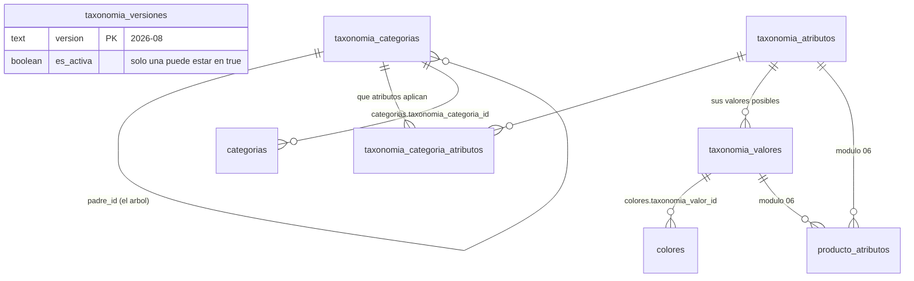
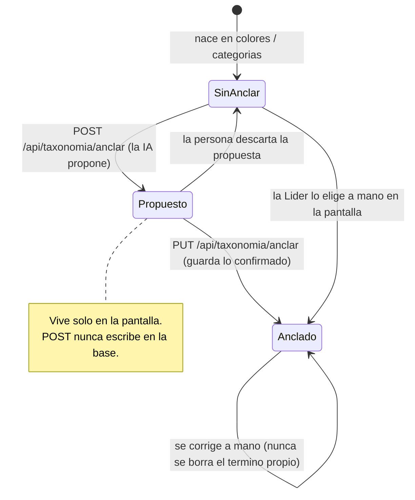

# 03 · Taxonomía universal
> **Pájaro:** TUCÁN · **Lo lleva:** _(libre — apúntate en `07-GOBIERNO.md`)_ · **Última revisión:** 2026-09-12

## Para qué existe

CAYLA tiene 37 categorías y 30 colores propios: "Blusas", "Bisutería", "Palo rosa",
"Arena". Ese vocabulario sirve para CAYLA y no sirve para nadie más — una zapatería
infantil no tiene "Blusas", una marca deportiva no tiene "Bisutería". El sistema se
está construyendo para venderse a otras marcas, y el primer día de cada marca nueva
es su inventario en un Excel con palabras inventadas por ella.

Este módulo es el diccionario contra el que se traduce ese Excel: la Shopify Standard
Product Taxonomy (MIT, en español, release fijado `2026-08`), cargada entera en cinco
tablas de solo lectura. El vocabulario propio de la marca **cuelga** de ese estándar
en vez de ser reemplazado por él: "Arena" sigue llamándose Arena, y además se sabe que
es un Beige. Así el trabajo del modelo de IA deja de ser "adivina a qué categoría de
CAYLA va esto" —imposible de generalizar— y pasa a ser "mapea al universal", que es el
mismo trabajo para todos los clientes, para siempre.

## El mapa

Ciclo de vida de **un término propio** (un color, una categoría de CAYLA) camino a
quedar anclado:

## Las tablas

> **Dónde existe este módulo — leer antes de seguir.** El encargo de esta ficha decía
> que las cinco tablas NO existen en producción. **Es falso a 2026-09-12**, y por eso
> la marca de cada ficha dice "local y producción". La evidencia: la foto en vivo del
> schema `retail` del proyecto `vovjyyiafkxteijimpuy` (cayla-dynamic) tomada el
> 2026-09-12 trae las cinco tablas con sus PK
> (`docs/datos/generado/retail_constraints.json`), el índice único
> `taxonomia_una_sola_activa` (`retail_indices_unicos.json`), las cinco policies de
> lectura (`retail_policies.json`), las columnas `categorias.taxonomia_categoria_id` y
> `colores.taxonomia_valor_id` (`retail_columnas.json`) y los datos cargados
> (`retail_filas.json`: 1.849 · 993 · 10.216 · 16.527 · 1). Lo corrobora
> `docs/BACKLOG.md:64` ("`0052` + seed + `0056` ya están en producción, Felipe los
> pegó el 11-sep"). Quien diga lo contrario está leyendo `docs/BACKLOG.md:82`, que
> quedó viejo — ver hueco #1.

### `taxonomia_versiones` — qué release del estándar manda hoy
**Existe en:** local y producción
**Quién escribe:** nadie desde la app. El SQL que genera `scripts/taxonomia/cargar.mjs`, aplicado por psql (local) o pegado en el SQL Editor (producción)

| Columna | Tipo | Vacío | Por defecto | Para qué sirve |
|---|---|---|---|---|
| `version` | text | no | — | El release tal como lo publica Shopify: `'2026-08'`. Es la llave. |
| `cargada_en` | timestamptz | no | `now()` | Cuándo entró ese release a esta base. El seed la vuelve a poner al activar la versión. |
| `es_activa` | boolean | no | `false` | Marca cuál release está vigente. Es lo único que evita que el catálogo se reclasifique solo. |

**Candados:**
- `taxonomia_versiones_pkey` — PK sobre `version`: el mismo release no entra dos veces.
- `taxonomia_una_sola_activa` — índice único parcial sobre `(es_activa) where es_activa`: imposible tener dos versiones activas a la vez. Sin él, el mismo id de categoría resolvería a dos nombres distintos según el join (`0052:52-55`).

**Diferencias local vs producción:** ninguna. En producción la tabla vive en el schema `retail`; en local también, porque `supabase/seed.sql` renombra `public` → `retail` después de las migraciones (ADR-0010).

### `taxonomia_categorias` — el árbol de categorías del estándar, 1.849 nodos
**Existe en:** local y producción
**Quién escribe:** nadie desde la app. Solo el seed de `cargar.mjs`

| Columna | Tipo | Vacío | Por defecto | Para qué sirve |
|---|---|---|---|---|
| `id` | text | no | — | El id parlante de Shopify sin el prefijo `gid://shopify/...`: `'aa-1-1-2-4'`. Estable entre releases y legible en un log o en un prompt. |
| `nombre` | text | no | — | La hoja sola: `'Camisetas de capa base'`. |
| `ruta` | text | no | — | El `full_name` completo separado por ` > `. Es lo que se muestra en pantalla y lo que ve el modelo. |
| `padre_id` | text | sí | — | De qué categoría cuelga. Vacío solo en la raíz de cada vertical. |
| `nivel` | integer | no | — | Profundidad en el árbol. `1` es el nombre del vertical ("Ropa y accesorios"), que nunca es una respuesta útil. |
| `vertical` | text | no | — | El rubro cargado: `aa` (ropa, calzado, accesorios, bisutería), `hb` (belleza), `os` (papelería), `lb` (bolsos de viaje). |

**Candados:**
- `taxonomia_categorias_pkey` — PK sobre `id`.
- FK `padre_id → taxonomia_categorias(id)` — no se puede colgar una categoría de un padre que no existe. El seed ordena por `nivel` ascendente antes de insertar, justo para no chocar con esto (`cargar.mjs:157-161`).
- Índices `taxonomia_categorias_padre_idx` y `taxonomia_categorias_vertical_idx` — navegación por rama y por rubro sin escaneo completo.

**Diferencias local vs producción:** ninguna de forma. La foto de producción confirma las 6 columnas con los mismos tipos y nulabilidad. Los dos índices no-únicos y la FK de `padre_id` **no fueron verificados en la foto de producción** (las consultas de `docs/datos/generado/README-REGENERAR.md` solo traen constraints `p/u/c` e índices únicos): están en `0052` y `preparar-produccion.mjs` no altera esa parte del archivo, pero no hay lectura en vivo que lo pruebe.

### `taxonomia_atributos` — las 993 preguntas que el estándar sabe hacerle a un producto
**Existe en:** local y producción
**Quién escribe:** nadie desde la app. Solo el seed de `cargar.mjs`

| Columna | Tipo | Vacío | Por defecto | Para qué sirve |
|---|---|---|---|---|
| `id` | text | no | — | El id de Shopify: `'1'` es Color, `'2778'` es Talla. |
| `handle` | text | no | — | El nombre estable en inglés (`'color'`, `'size'`). Es por donde lo busca el código, porque el id numérico Shopify no promete mantenerlo. |
| `nombre` | text | no | — | El nombre en español: `'Color'`, `'Talla'`. |
| `descripcion` | text | sí | — | El texto descriptivo del estándar. Hoy no lo lee ninguna pantalla ni ningún prompt. |

**Candados:**
- `taxonomia_atributos_pkey` — PK sobre `id`.
- `taxonomia_atributos_handle_key` — UNIQUE sobre `handle`. Es lo que hace legítimo el `.single()` de `lib/taxonomia/consultas.ts:68`, que busca el atributo `color` por handle: si hubiera dos, esa consulta reventaría en runtime.

**Diferencias local vs producción:** ninguna.

### `taxonomia_valores` — los 10.216 valores posibles de esos atributos
**Existe en:** local y producción
**Quién escribe:** nadie desde la app. Solo el seed de `cargar.mjs`

| Columna | Tipo | Vacío | Por defecto | Para qué sirve |
|---|---|---|---|---|
| `id` | text | no | — | El id de Shopify: `'15'`. |
| `atributo_id` | text | no | — | De qué atributo es este valor. `'Azul marino'` es un valor de `color`, no de `Tejido`. |
| `handle` | text | no | — | `'color__navy'`. Lo lee `fn_familia_color_de_universal` para derivar la familia de color de la marca (`0056:134-155`). |
| `nombre` | text | no | — | El nombre en español: `'Azul marino'`. De los 10.216, solo **19** son colores. |

**Candados:**
- `taxonomia_valores_pkey` — PK sobre `id`.
- FK `atributo_id → taxonomia_atributos(id) on delete cascade` — un valor huérfano no puede existir; si se quitara un atributo, sus valores se van con él.
- Índice `taxonomia_valores_atributo_idx` — pedir "los valores de color" no escanea las 10.216 filas.
- **No hay UNIQUE sobre `handle`.** El estándar lo prefija con el atributo (`color__navy`) así que en la práctica no choca, pero la base no lo impide.

**Diferencias local vs producción:** ninguna de forma. Igual que arriba: la FK y el índice no-único no se leyeron en vivo de producción.

### `taxonomia_categoria_atributos` — qué preguntas tienen sentido para qué producto
**Existe en:** local y producción
**Quién escribe:** nadie desde la app. Solo el seed de `cargar.mjs`

16.527 filas. Es lo que permite pedirle a la IA solo los atributos que tienen sentido
para la prenda que está clasificando: una camiseta tiene Cuello y Longitud de manga,
un arete no.

| Columna | Tipo | Vacío | Por defecto | Para qué sirve |
|---|---|---|---|---|
| `categoria_id` | text | no | — | La categoría del estándar. |
| `atributo_id` | text | no | — | Un atributo que aplica a esa categoría. |

**Candados:**
- `taxonomia_categoria_atributos_pkey` — PK compuesta `(categoria_id, atributo_id)`: el mismo atributo no se repite dos veces en la misma categoría.
- Las dos FK son `on delete cascade`: si una categoría o un atributo desaparecen, el puente se va solo y no queda apuntando al vacío.

**Diferencias local vs producción:** ninguna de forma; las FK no se leyeron en vivo de producción.

### Las dos columnas de anclaje — donde el vocabulario propio se cuelga del estándar
**Existen en:** local y producción (verificadas en `retail_columnas.json`)
**Quién escribe:** `PUT /api/taxonomia/anclar` (la pantalla Vocabulario) e `importar_catalogo` (0056/0057) al crear un color o una categoría nueva desde un archivo de cliente

| Columna | Tipo | Vacío | Por defecto | Para qué sirve |
|---|---|---|---|---|
| `categorias.taxonomia_categoria_id` | text | sí | — | De qué categoría universal cuelga esta categoría propia. Vacío = sin anclar todavía. |
| `colores.taxonomia_valor_id` | text | sí | — | De qué color universal cuelga este color propio: Arena → Beige. Vacío = sin anclar. |

**Candados:**
- FK a `taxonomia_categorias(id)` y a `taxonomia_valores(id)`: no se puede anclar a un término que no existe.
- Nullable **a propósito** (`0052:97-99`): un término propio sin anclar funciona exactamente igual que hoy. El anclaje agrega capacidad, no la condiciona. Es lo que hace que esta migración sea aditiva y reversible.

**Lo que NO impiden:** nada obliga a que `colores.taxonomia_valor_id` apunte a un valor del atributo `color`. La FK acepta cualquiera de los 10.216 valores — un color de CAYLA puede quedar anclado a `'Algodón'` (un valor de Tejido) y la base lo acepta sin chistar. Ver hueco #3.

## Cómo se escribe (la única puerta)

**No hay ningún RPC en este módulo.** Las cinco tablas tienen RLS encendido y
**solo policies de SELECT** — ni Admin, ni Líder de equipo, ni nadie escribe el
estándar desde la aplicación. Es deliberado (`0052:110-115`): *"que una Líder no pueda
editar el estándar es el punto: si pudiera, dejaría de ser un estándar."*

| Puerta | Qué hace | Candado de permiso | Idempotente |
|---|---|---|---|
| `scripts/taxonomia/cargar.mjs` | Baja el release fijado de GitHub, filtra los 4 verticales y **genera un .sql**. Con `--aplicar` lo corre contra el Postgres local por `docker exec psql`. | Ninguno de base: corre como superusuario y salta RLS. En producción el SQL lo pega Felipe a mano (D-11). | **Sí.** Cada insert lleva `on conflict (id) do update` (categorías, atributos, valores) u `on conflict do nothing` (el puente y la versión). Correrlo dos veces no duplica nada. |
| `scripts/taxonomia/preparar-produccion.mjs` | Parte el seed (~1,5 MB) en trozos de 380 KB que el SQL Editor aguanta, y le pone `set search_path to retail, public;` a cada uno. | Ninguno. Solo escribe archivos en disco. | Sí, regenera los mismos archivos. |
| `POST /api/taxonomia/anclar` | **PROPONE.** Le pide a `claude-haiku-4-5` de qué universal cuelga cada término propio todavía sin anclar. **Nunca escribe.** | `persona.rol !== "lider"` → 403 (`route.ts:36-39`). Sin `ANTHROPIC_API_KEY` → 503 con mensaje, no stack (`route.ts:49-58`). Freno de 40 llamadas por persona y hora. | No aplica: no escribe. Sí evita repetir trabajo — solo manda al modelo lo que tiene `ancladoA === null` (`route.ts:68`). |
| `PUT /api/taxonomia/anclar` | **GUARDA** lo que la persona confirmó en pantalla. | `persona.rol !== "lider"` → 403 (`route.ts:107-109`) **y** las policies `colores_update_lider` / `categorias_update_lider`. | Sí de hecho: es un `update` por clave, volver a mandar lo mismo deja el mismo valor. Un anclaje que falle no arrastra a los demás — devuelve 207 con la lista de fallidos. |

**Superficie de riesgo — escritura directa sin RPC.** `PUT /api/taxonomia/anclar`
escribe a las tablas con el cliente de Supabase, no por una función de base:

- `apps/web/app/api/taxonomia/anclar/route.ts:130` → `supabase.from("colores").update({ taxonomia_valor_id: … }).eq("codigo", a.clave)`
- `apps/web/app/api/taxonomia/anclar/route.ts:131` → `supabase.from("categorias").update({ taxonomia_categoria_id: … }).eq("id", a.clave)`

Está acotado: son dos columnas nullable, la única defensa real es la policy de
`update` de Líder, y el daño posible es un anclaje malo, no un stock roto. Pero es
escritura directa y hay que saberlo.

**La regla que gobierna todo el módulo: la IA propone, una persona confirma.** Dos
verbos y no uno, porque **anclar mal es invisible** — nada falla, "Palo rosa" queda
colgando de Beige, y nadie se entera hasta que un reporte agrupa mal tres meses
después. Un error que no avisa hay que atajarlo antes, no después.

## Quién ve y quién toca

| Operación | Admin | Líder de equipo | Integrante | Solo lectura |
|---|---|---|---|---|
| Leer el árbol universal (las 5 tablas) | sí | sí | sí | sí |
| Abrir la pantalla `/inventario/taxonomia` | sí | sí | sí (solo mira) | sí (solo mira) |
| Pedirle una propuesta de anclaje a la IA | sí | sí | **no** (403) | **no** (403) |
| Guardar un anclaje | sí | sí | **no** (403 + policy) | **no** (403 + policy) |
| Cargar o cambiar la versión del estándar | **no desde la app** | **no desde la app** | no | no |

Las policies reales son las cinco `taxonomia_*_select` con `auth.role() = 'authenticated'`:
quien tiene sesión lee todo, sin filtro de sede. No hay ninguna policy de `insert`,
`update` ni `delete` en ninguna de las cinco tablas.

**Aviso sobre los cuatro niveles (D-12).** En este módulo los cuatro niveles son
solo tres columnas de una tabla: `apps/web/lib/persona.ts:49-51` colapsa todo a
`lider` / `integrante`, y traduce el `admin` que viene de Dynamic a `lider`. **Admin y
Solo lectura no existen como niveles distintos acá** — un Admin es un Líder, y un Solo
lectura sería hoy un Integrante, que ya puede leer todo el estándar. La fila de "Solo
lectura" de arriba describe lo que la base haría, no un rol que exista.

## Qué se rompe sin esto

Si estas cinco tablas desaparecen, CAYLA sigue vendiendo: el catálogo, el stock, la
caja y la facturación no las tocan. Lo que se cae es la puerta de entrada de cualquier
marca nueva — `/inventario/importar` deja de tener a dónde traducir un Excel ajeno, y
volver a mapear a mano un archivo de 3.000 prendas es el trabajo que este módulo
existe para evitar.

Se cae también, y de inmediato, `producto_atributos`: sus dos FK apuntan acá
(`0056:64-66`), así que sin taxonomía no hay tejido, patrón ni cuello por producto.
La pantalla Vocabulario se queda en su mensaje de "el estándar todavía no está
cargado" (`page.tsx:54-60`) y `importar_catalogo` no puede crear un color nuevo con
familia derivada, porque `fn_familia_color_de_universal` lee `taxonomia_valores`
(`0056:152`) — un `create function` que ni siquiera compila si la tabla no está.

Y se pierde lo que no se ve: la promesa de venderle el sistema a una segunda marca.
Ese es el único motivo por el que 30.000 filas de vocabulario viven en una base que
hoy tiene 5 productos.

## Huecos conocidos

1. **El repo se contradice sobre si esto está en producción, y el encargo de esta ficha
   heredó la versión equivocada.** `docs/BACKLOG.md:64` dice "`0052` + seed + `0056`
   ya están en producción (Felipe los pegó el 11-sep)". `docs/BACKLOG.md:82` dice, en
   el mismo archivo, "*Generar desde producción borra los 5 tipos de taxonomía y las 2
   columnas de anclaje (`0052` no está aplicada allá)*", y `:87` remata con "**La
   salida más corta es aplicar `0052` en producción**". La foto en vivo del 2026-09-12
   le da la razón a la línea 64. **Consecuencia:** alguien va a volver a pegar el seed
   entero en producción creyendo que falta (no rompe nada, es idempotente, pero son
   ~1,5 MB de SQL a mano), o peor, va a regenerar `packages/database` creyendo que
   producción está incompleta. Se corrigen las líneas 80-88 del BACKLOG.
2. **Nada registra que el seed corrió, y por eso el hueco #1 pudo existir.** La
   convención de `0058` / `unificacion/38` dice que todo archivo pegado en producción
   termina con `insert into retail.migraciones_aplicadas (archivo) …`. `0052` es
   anterior a esa convención y `scripts/taxonomia/preparar-produccion.mjs` no agrega
   esa línea a ninguno de los archivos que genera (verificado: `grep
   migraciones_aplicadas` no devuelve nada en ese script ni en `0052`). **Consecuencia:**
   la única tabla que existe justamente para responder "¿esto ya corrió?" no puede
   responderlo para este módulo.
3. **Un color de CAYLA puede quedar anclado a algo que no es un color.**
   `colores.taxonomia_valor_id` es FK a `taxonomia_valores(id)` a secas
   (`0052:102-103`). De las 10.216 filas de esa tabla, solo 19 son colores; las otras
   10.197 son tejidos, cuellos, tallas y patrones. La base acepta anclar "Arena" a
   "Algodón". Hoy no pasa porque `getColoresUniversales` solo ofrece los 19
   (`consultas.ts:65-78`), pero eso es disciplina de la aplicación, no un candado.
   **Consecuencia:** el día que alguien escriba esa columna desde otro lado —un script,
   el SQL Editor, un importador futuro— el error entra y no avisa. El arreglo es un
   CHECK o una FK compuesta contra `(atributo_id, id)`.
4. **La versión "fijada" es una etiqueta, no un filtro.** `0052:33-38` promete: *"El
   estándar saca release cada trimestre y v2026-08 sumó 2.000 categorías… un catálogo
   que se reclasifica solo de un día para otro es peor que uno desactualizado.
   `taxonomia_versiones.es_activa` fija la versión"*. Pero `taxonomia_categorias` no
   tiene columna `version` (ver su ficha: `id, nombre, ruta, padre_id, nivel,
   vertical`) y **ninguna consulta del repo filtra por versión** —
   `getCategoriasUniversales` (`consultas.ts:103-132`) solo filtra `nivel > 1`. El seed
   hace `on conflict (id) do update`, así que cargar `2026-11` encima **pisa los
   nombres en el sitio** y deja conviviendo las categorías que ese release eliminó, sin
   forma de distinguir cuáles son. **Consecuencia:** subir de versión sí reclasifica el
   catálogo de un día para otro — exactamente lo que la migración promete evitar.
   `scripts/taxonomia/revisar-version.mjs` avisa qué se movería, pero nadie limpia.
5. **El vocabulario de CAYLA todavía no está anclado.** `docs/BACKLOG.md:30-33` lo deja
   por escrito: falta "darle a *guardar* en Inventario → Vocabulario para anclar los 30
   colores y 37 categorías de CAYLA (corregir a mano `Tops → Tops cortos deportivos` y
   decidir `Fucsia → Púrpura` o `Rosa`)". **Consecuencia:** las dos columnas de anclaje
   existen y están vacías, así que hoy el módulo es un diccionario sin ninguna
   traducción hecha — el puente está construido y nadie lo cruzó.
6. **El anclaje automático nunca corrió contra la API de verdad.** ADR-0030 lo dice sin
   adornos: *"Lo que NO está verificado: el anclaje automático nunca corrió. No hay
   `ANTHROPIC_API_KEY` en el entorno"* (`docs/adr/0030…md:150-153`), y
   `apps/web/.env.example:51` sigue con la variable vacía. **Consecuencia:** la calidad
   de las propuestas del modelo —lo único que decide si esta pantalla ahorra trabajo o
   lo crea— no está medida. `scripts/taxonomia/examen-anclaje.mts` existe para medirla
   el día que haya clave.
7. **`docs/datos/`05-SEGURIDAD.md` promete una escritura que no existe.** Mete
   `taxonomia_*` en el patrón *"cualquiera autenticado puede leer, **solo Líder
   escribe**"*. Falso: estas cinco tablas no tienen ninguna policy de escritura, ni para
   Líder. **Consecuencia:** alguien va a construir una pantalla de "editar el estándar"
   confiando en esa frase y va a descubrir el problema en runtime, con un update que
   devuelve 0 filas afectadas y ningún error.
8. **Los comentarios de `0052` cuentan mal el vocabulario propio.** La cabecera dice
   "`categorias` (32) y `colores` (29)" (`0052:5`); la base tiene **37 y 30**
   (`retail_filas.json`). ADR-0030 dice 32 y 30. **Consecuencia:** menor, pero es la
   clase de número que alguien cita en una decisión — y el argumento central del ADR
   ("Shopify tiene 19 colores, CAYLA tiene 30") depende de que esa cuenta sea la real.
9. **Ningún índice no-único ni ninguna FK de este módulo fue leída en vivo de
   producción.** Las consultas de `docs/datos/generado/README-REGENERAR.md` solo traen
   constraints `p/u/c` e índices únicos. **Consecuencia:** si una FK se cayó al pegar
   el seed por partes, hoy nadie lo sabría. Agregar `contype = 'f'` y los índices
   completos a esas consultas es una línea.
10. **El aviso de versión nueva no corre solo.** `revisar-version.mjs` existe y
    funciona, pero `docs/BACKLOG.md` deja escrito que "el cron semanal para
    `revisar-version.mjs` no existe: se corre a mano cuando se quiera saber si hay
    versión nueva". **Consecuencia:** "fijada" sin aviso automático termina siendo
    "olvidada", que es justo lo que ese script se escribió para evitar.

## Decisiones que lo gobiernan

- **D-05 · Los dos sistemas completos** — producción de retail vive dentro del proyecto de cayla-dynamic, schema `retail`; por eso todo SQL de este módulo lleva `set search_path to retail, public`.
- **D-07 · Lo muerto se marca** — no hay nada muerto en este módulo: las cinco tablas tienen datos y dos rutas vivas las leen. `taxonomia_atributos.descripcion` es la única columna que nadie lee hoy.
- **D-11 · Solo Felipe pega SQL en producción** — es la única puerta de escritura del estándar; no hay RPC ni policy que lo permita desde la app.
- **D-12 · Cuatro niveles de permiso** — este módulo solo distingue dos (Líder de equipo / Integrante). Ver el aviso en "Quién ve y quién toca".
- **D-16 · Cada tabla marca en qué base existe** — las cinco dicen "local y producción", contra lo que afirmaba el encargo; la evidencia está al inicio de "Las tablas" y el conflicto en el hueco #1.
- **D-24 · Las promesas incumplidas se escriben con la cita exacta** — huecos #4, #7 y #8.
- **D-50 · Cada marca, su propia base** — este módulo es la otra mitad de esa decisión: sin `tenant_id`, lo que permite que una segunda marca entre es que el estándar universal sea el mismo en todas las bases.
- **ADR-0030 · La taxonomía universal va DEBAJO del vocabulario propio, no en su lugar** — la decisión completa: por qué Shopify y no Google/GS1, por qué capa de traducción y no columna vertebral, por qué `claude-haiku-4-5` fijo y por qué se descartó el tier gratuito de Gemini.
- **ADR-0010 · El entorno local usa el schema `retail`** — el seed renombra `public` → `retail` después de las migraciones, y por eso local y producción tienen la misma forma sin que las migraciones lleven prefijo.
- **ADR-0035 · La IA compila el mapeo, no procesa las filas** — el principio que hereda este módulo: lo que resuelve el código (`anclarPorNombre`, determinista y testeado) no se le pregunta a la IA.
