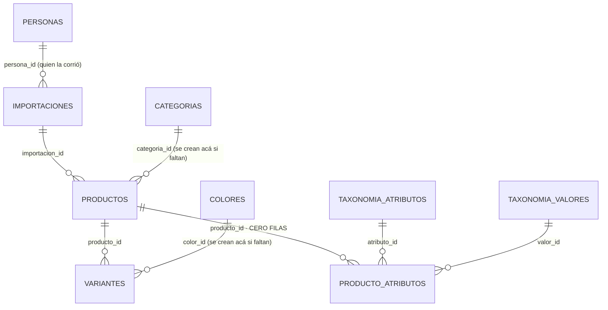
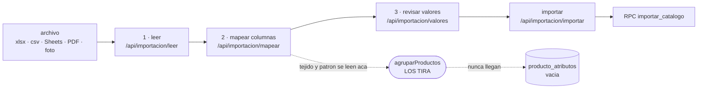
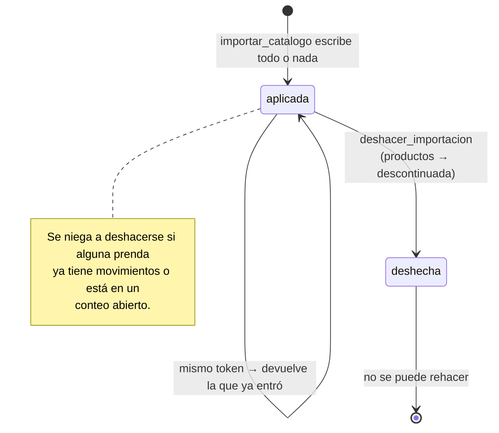

# 04 · Importación de catálogo
> **Pájaro:** GOLONDRINA · **Lo lleva:** Felipe Alvarez · **Última revisión:** 2026-09-16

> **⚠ Este documento describe el importador V1. El módulo no existe hoy, ni en producción
> ni en el repo** (verificado 2026-09-16: `to_regclass` da NULL para `importaciones` y
> `producto_atributos`; no existen `importar_catalogo`, `deshacer_importacion` ni
> `fn_codigo_tres_letras`). **Historia:** estuvo en producción del 2026-09-11 al 2026-09-12
> 20:49 UTC; ese día el corte a V2 aplicó `retail_0001b_limpiar_esquema_v1` (`drop schema retail
> cascade`), y `0af2f1b` borró del repo `0056`-`0059`, `lib/importacion`, `/api/importacion/*` y
> `/inventario/importar`. **No pegar `0056`/`0057` en producción: fallan con 42P01.** Golondrina
> se reconstruye sobre V2 **después del censo** (20-sep), como migración nueva guiada por el ADR
> de "taxonomía ideal"; lo de abajo queda como diseño de referencia.

## Para qué existe

Cuando una marca nueva entra al sistema, su inventario está en un archivo suyo: un Excel
con las columnas que se le ocurrieron a quien lo hizo, un PDF del proveedor, o la foto de
un cuaderno. Darlo de alta prenda por prenda con `crear_producto_con_variantes` (0033) son
900 viajes a São Paulo de ~322 ms cada uno (ADR-0013): cinco minutos mirando una barra, y
si el viaje 600 falla quedan 599 prendas a medias. Este módulo convierte ese archivo en
catálogo en una sola transacción, con stock en cero, y guarda qué se interpretó como qué
para poder deshacerlo.

No levanta cantidades: el catálogo entra vacío y las unidades las pone el censo (ADR-0027).
Esa es justamente la razón por la que deshacer es posible sin reescribir historia.

## El mapa

Las dos tablas del módulo son `importaciones` y `producto_atributos`. Todo lo demás
—`productos`, `variantes`, `colores`, `categorias`, `codigos_barras`— es del módulo de
catálogo: este módulo solo las **escribe**, no las posee.

El camino que recorre un archivo, y dónde se pierde algo:

Ciclo de vida de una importación:

## Las tablas

### `importaciones` — el acta de cada archivo que se importó: quién, cuándo, con qué plan y cuánto entró

**Existe en:** solo local
**Quien escribe:** `importar_catalogo` (inserta y después actualiza los contadores) y
`deshacer_importacion` (pasa `estado` a `deshecha`). Ninguna pantalla escribe directo.

| Columna | Tipo | Vacío | Por defecto | Para qué sirve |
|---|---|---|---|---|
| `id` | `uuid` | no | `gen_random_uuid()` | La importación. Es lo que cuelga de cada prenda creada y lo que recibe `deshacer_importacion`. |
| `persona_id` | `uuid` | sí | — | Quién la corrió. FK a `personas`. Queda vacía si el usuario logueado no tiene fila en `personas`, y entonces el acta pierde al autor. |
| `origen` | `text` | no | — | De dónde salió, en texto para leer: `inventario.xlsx · hoja "Stock"`. Lo arma la pantalla; el RPC pone `(sin origen)` si no llega. |
| `plan` | `jsonb` | no | — | El plan de mapeo aplicado, tal cual, con las cabeceras del archivo pegadas. Con él se ve después qué se interpretó como qué, y se reimporta el mismo formato sin volver a pagar una llamada al modelo. |
| `productos_creados` | `integer` | no | `0` | Cuántas prendas entraron. Se escribe al final de la transacción, no al principio. |
| `variantes_creadas` | `integer` | no | `0` | Cuántas variantes (talla × color) entraron. |
| `colores_creados` | `integer` | no | `0` | Cuántos colores nuevos se sembraron en el vocabulario de la marca. |
| `categorias_creadas` | `integer` | no | `0` | Cuántas categorías nuevas se sembraron. |
| `estado` | `text` | no | `'aplicada'` | `aplicada` o `deshecha`. Es lo que impide deshacer dos veces la misma. |
| `deshecha_en` | `timestamptz` | sí | — | Cuándo se deshizo. Vacía mientras siga aplicada. |
| `created_at` | `timestamptz` | no | `now()` | Cuándo entró. Ordena la búsqueda del plan reutilizable (las últimas 20). |
| `token` | `uuid` | sí | — | Lo genera la pantalla por intento (0057). Reintentar con el mismo token devuelve la importación que ya entró en vez de repetirla. |

**Candados** (lo que la base impide que pase):

- `importaciones_pkey` — una fila, un `id`.
- `importaciones_estado_check` (`estado in ('aplicada','deshecha')`) — no existe una
  importación "a medias" ni "en curso": o entró entera o no existe.
- `importaciones_token_unico` — índice único parcial sobre `(token) where token is not null`.
  Dos intentos con el mismo token no pueden crear dos importaciones. El `null` queda fuera
  del índice, así que una importación sin token (llamada directa al RPC) no bloquea a otra.
- `importaciones_persona_id_fkey` → `personas (id)`. Nullable: borrar la persona no borra
  el acta.
- RLS activado con **una sola policy, `importaciones_select`** (`auth.role() = 'authenticated'`).
  No hay policy de insert, update ni delete: aunque `0004_grants.sql` da `insert/update/delete`
  a `authenticated` a nivel de tabla, RLS lo bloquea todo. La única vía de escritura es el
  RPC `security definer`. Eso es el candado, no una omisión.

**Diferencias local vs producción:** la tabla no la crea ningún archivo de
`supabase/unificacion/`, y `retail.migraciones_aplicadas` (`unificacion/38_migraciones_aplicadas.sql:75-91`)
no la lista. En producción, además, `retail.personas` es una **vista** sobre Dynamic
(`unificacion/03_candados.sql:22`) y una FK no puede apuntar a una vista: el generador
reescribe `references personas (` a `references public.personas (`
(`scripts/taxonomia/preparar-produccion.mjs:123`). Ver hueco 2.

---

### `producto_atributos` — tejido, patrón, cuello, largo de manga: lo que describe la prenda más allá de talla y color

**Existe en:** solo local
**Quien escribe:** **nadie.** Ni un RPC, ni una pantalla, ni un script. Está vacía y no
tiene forma de dejar de estarlo. Ver hueco 1.

| Columna | Tipo | Vacío | Por defecto | Para qué sirve |
|---|---|---|---|---|
| `producto_id` | `uuid` | no | — | La prenda. Parte de la PK y FK a `productos` con `on delete cascade`: si la prenda desaparece, sus atributos se van con ella. |
| `atributo_id` | `text` | no | — | Qué atributo es. FK a `taxonomia_atributos (id)` — el id del estándar universal (`'1'` es Color, `'2778'` es Talla). Parte de la PK. |
| `valor_id` | `text` | sí | — | El valor universal, si el texto del archivo calzó con uno. FK a `taxonomia_valores (id)`. |
| `valor_texto` | `text` | sí | — | El texto libre del archivo cuando no calzó ningún universal. Es lo que evita perder "lino peruano 60/40". |

**Candados:**

- `producto_atributos_pkey` (`producto_id, atributo_id`) — una prenda no puede tener dos
  veces el mismo atributo. No hay "tejido = lino" y "tejido = algodón" en la misma prenda.
- `producto_atributos_check` (`valor_id is not null or valor_texto is not null`) — no se
  puede guardar un atributo sin valor. Una fila que no dice nada no entra.
- `producto_atributos_producto_id_fkey` con `on delete cascade`.
- `producto_atributos_atributo_id_fkey` → `taxonomia_atributos (id)`, **sin** cascade: no se
  puede borrar un atributo del estándar que alguna prenda esté usando.
- `producto_atributos_valor_id_fkey` → `taxonomia_valores (id)`.
- RLS activado con una sola policy, `producto_atributos_select`. Igual que arriba: lectura
  para cualquiera con sesión, escritura para nadie desde la API.

**Diferencias local vs producción:** no existe en `supabase/unificacion/`. Depende además de
`taxonomia_atributos` y `taxonomia_valores`, que también nacen solo en `migrations/0052`.

---

### `productos.importacion_id` — la columna que ata cada prenda a su acta

No es una tabla, pero es parte del módulo: `0056` la agrega a `productos`.

| Columna | Tipo | Vacío | Por defecto | Para qué sirve |
|---|---|---|---|---|
| `importacion_id` | `uuid` | sí | — | De qué importación nació esta prenda. Vacía para todo lo que se dio de alta a mano o por el censo. FK a `importaciones (id)`. |

**Candados:** `productos_importacion_idx`, índice **parcial** (`where importacion_id is not null`)
— no indexa las prendas de CAYLA, que son la mayoría y todas tienen `null`. Es lo que hace
barato el `update ... where importacion_id = ?` de `deshacer_importacion`.

**Diferencias local vs producción:** `retail.productos` (`unificacion/04_catalogo.sql:28-42`)
no tiene esta columna.

## Cómo se escribe (la única puerta)

### `importar_catalogo(p_catalogo jsonb) returns jsonb`

`language plpgsql · security definer · set search_path = public`

- **Candado de permiso:** rol. `if not fn_es_lider() then raise exception 'Solo un Líder
  puede importar un catálogo'`. **Ninguno de sede**, a propósito: un catálogo no pertenece
  a una tienda, pertenece a la marca.
- **Idempotente, por token.** `p_catalogo ->> 'token'` se castea a `uuid`; si ya existe una
  fila en `importaciones` con ese token, devuelve esa misma con `"repetida": true` y no
  toca nada. El token lo genera la pantalla una vez por revisión
  (`RevisarValores.tsx:151`), no por clic. Sin token el RPC funciona igual, pero cada
  llamada escribe un catálogo nuevo.
- **Todo o nada.** Una sola transacción. Si el producto 600 no tiene variantes, no queda
  ninguno de los 599 anteriores.
- **Qué escribe:** `importaciones`, `colores` (los nuevos, con su código de 3 letras
  derivado), `categorias` (idem, con `prefijo`), `productos`, `variantes`, y —vía
  `fn_asignar_codigo_variante` (0048)— `codigos_barras` y `codigos_correlativos`.
- **Qué NO escribe, a propósito:** `movimientos` y `stock`. El catálogo entra con stock
  cero y las cantidades las levanta el censo (ADR-0027). Por eso deshacer no reescribe
  historia.
- **Qué NO escribe, sin querer:** `producto_atributos`. Ver hueco 1.

Forma del parámetro, tal como la arma `app/api/importacion/importar/route.ts:138-148`:
`{ token, origen, plan, colores: [{nombre, taxonomiaValorId}], categorias: [{nombre,
taxonomiaCategoriaId}], productos: [{referencia, categoria, marca, genero, temporada,
descripcion, variantes: [{codigoCliente, talla, color, costo, precio}]}] }`.

### `deshacer_importacion(p_importacion_id uuid) returns jsonb`

`language plpgsql · security definer · set search_path = public`

- **Candado de permiso:** rol, `fn_es_lider()`. Ninguno de sede.
- **Deshacer es descontinuar, nunca borrar.** `update productos set estado =
  'descontinuada'` sobre las prendas de esa importación que sigan `activa`. Los colores y
  categorías creados se conservan: son vocabulario, y un vocabulario que desaparece deja
  huérfano lo que otra importación pudo usar.
- **Se niega en dos casos**, y lo dice en vez de decidir: si alguna prenda ya tiene
  `movimientos` (alguien la vendió o la contó), o si hay un `conteo` abierto con líneas
  sobre ella (el cierre ajustaría stock de prendas descontinuadas).
- **Repetirla no hace daño:** la segunda llamada falla con "Esa importación no existe o ya
  fue deshecha" porque el `where ... and estado = 'aplicada'` ya no encuentra nada. Es
  idempotencia por rechazo ruidoso, no por repetición silenciosa.

### Las tres funciones auxiliares (0056)

| Firma | Qué hace | Permiso |
|---|---|---|
| `fn_codigo_tres_letras(p_nombre text, p_tabla text) returns text` | Deriva el código de 3 mayúsculas que `colores.codigo` y `categorias.prefijo` exigen: primera letra + consonantes (`TERRACOTA → TRR`), y si choca prueba hasta 31 variantes. | **Ninguno.** `language plpgsql`, sin `security definer` y sin guarda de rol. |
| `fn_familia_color_de_universal(p_valor_id text) returns text` | Deriva `colores.familia_color` (NOT NULL con CHECK) del universal: `color__navy → azul`. Sin universal cae en `neutro`. | Ninguno. `language sql stable`. |
| `fn_familia_de_universal(p_categoria_id text) returns text` | Deriva `categorias.familia` del prefijo del id universal: `aa-6-% → bisuteria`, `hb-% → belleza`. Sin universal cae en `accesorios`. | Ninguno. `language sql stable`. |

### Escritura directa a tabla, sin RPC

**Ninguna.** Las cuatro rutas de escritura del módulo pasan por los dos RPC. El único
acceso directo a una tabla del módulo desde la app es una **lectura**:
`apps/web/app/api/importacion/mapear/route.ts:38-43` hace
`.from("importaciones").select("plan, created_at")` para reutilizar el plan de un archivo
con las mismas cabeceras. No escribe.

Lo que sí conviene saber: los cuatro endpoints (`leer`, `mapear`, `valores`, `importar`) y
el de `deshacer` repiten el chequeo de rol en TypeScript (`persona.rol !== "lider"` → 403)
**antes** de llamar al RPC. Eso es cortesía de pantalla, no seguridad: la seguridad es
`fn_es_lider()` dentro de la función.

## Quién ve y quién toca

| Operación | Admin | Líder de equipo | Integrante | Solo lectura |
|---|---|---|---|---|
| Abrir `/inventario/importar` y leer un archivo | sí | sí | no (`page.tsx:28`) | no |
| Mapear columnas / revisar valores (gasta modelo) | sí | sí | no (403) | no |
| Correr `importar_catalogo` | sí | sí | no (`fn_es_lider()`) | no |
| Correr `deshacer_importacion` | sí | sí | no (`fn_es_lider()`) | no |
| Leer el historial de `importaciones` y sus planes | sí | sí | **sí** | **sí** |
| Leer `producto_atributos` | sí | sí | sí | sí |
| Escribir `producto_atributos` | **nadie** | nadie | nadie | nadie |

Lo que hay que saber para leer esa tabla sin engañarse: **en la base solo existen dos
roles.** `personas.rol` admite `lider` e `integrante` y nada más
(`0001_init.sql:30`). Admin y Solo lectura de D-12 no tienen representación: `mapearRol`
(`apps/web/lib/persona.ts:49-51`) aplasta el `admin` de producción sobre `lider` y el
`supervisor_sede` sobre `integrante`. Y las dos policies del módulo son
`auth.role() = 'authenticated'`, o sea que "Solo lectura" ve exactamente lo mismo que un
Líder de equipo: el historial completo de importaciones con sus planes de mapeo.

## Qué se rompe sin esto

El onboarding de una marca nueva vuelve a ser manual: cada prenda, una pantalla, un viaje a
São Paulo. Novecientas prendas dejan de ser una tarde y pasan a ser una semana de tipeo, con
los errores de tipeo que eso trae.

CAYLA pierde la única vía barata para el trabajo que ya tiene encima: `docs/BACKLOG.md`
deja escrito que el catálogo real de CAYLA se captura por censo físico porque SINATRA es un
registro de compras, no un catálogo — y el censo necesita que las prendas existan antes de
poder contarlas.

Se pierde también la auditoría: sin `importaciones.plan` nadie puede responder "¿de dónde
salió esta prenda y qué columna del archivo se leyó como su precio?" seis meses después. Y
sin `importacion_id` no hay forma de deshacer en bloque una carga que salió mal: habría que
descontinuar prenda por prenda desde el editor SQL.

## Huecos conocidos

> Todos los huecos de abajo están latentes: renacen si alguien re-porta el diseño V1 tal cual; ninguno duele hoy en tienda.

1. **`producto_atributos` existe, está documentada, tiene sus candados… y nadie la escribe
   nunca.** El campo `tejido` y el campo `patron` existen en `CAMPOS`
   (`apps/web/lib/importacion/mapeo.ts:25-26`), se ofrecen en el desplegable de la pantalla
   con etiqueta propia (`apps/web/components/MapearColumnas.tsx:44-45`), se le explican al
   modelo (`apps/web/lib/importacion/inferir-mapeo.ts:72`), se extraen del archivo en
   `FilaEstandar` (`mapeo.ts:76-77`) — y se **tiran a la basura** en
   `apps/web/app/api/importacion/importar/route.ts:61-67`, donde `agruparProductos` arma la
   variante con `codigoCliente, talla, color, costo, precio` y nada más. El RPC nunca los
   recibe, y `importar_catalogo` no tiene una sola línea que inserte en
   `producto_atributos`. **Consecuencia en tienda:** una Líder de equipo mapea la columna
   "COMPOSICIÓN" a Tejido, la pantalla se lo acepta sin una palabra, y el dato no está en
   ningún lado. Nadie puede buscar "todo lo de lino" ni agrupar por estampado, y la razón
   por la que Felipe pidió la tabla —alimentar las sugerencias de la IA sobre el catálogo,
   `0056_importar_catalogo.sql:57-61`— no ocurre.

2. **Las dos tablas no están en el riel de producción.** Ningún archivo de
   `supabase/unificacion/` (01..38) crea `importaciones` ni `producto_atributos`, y
   `retail.migraciones_aplicadas` (`unificacion/38_migraciones_aplicadas.sql:75-91`) no las
   registra. `packages/database/src/types.ts:23-27` lo dice con todas las letras: *"`importaciones`,
   `producto_atributos`, `productos.importacion_id` y las funciones `importar_catalogo`,
   `deshacer_importacion` … (migración `0056`; solo existen en local hasta que se aplique
   allá)"*. **Consecuencia:** el botón "Importar" está en la navegación de Inventario en
   producción (`InventarioNav.tsx:25`) y la pantalla abre, pero la escritura no tiene dónde
   caer.

3. **Promesa incumplida: tres versiones distintas del estado de `0056` en producción, en el
   mismo repo.** `supabase/migrations/0057_importar_catalogo_revisado.sql:9` afirma
   *"0056 ya está aplicada en producción, así que sus tablas quedan y solo cambian las
   funciones"*. `docs/adr/0035-la-ia-compila-el-mapeo-no-procesa-las-filas.md:6` afirma
   *"Falta aplicar `0056` en producción."* `docs/BACKLOG.md:64` afirma que Felipe la pegó a
   mano el 11-sep. Las tres no pueden ser ciertas a la vez, y ninguna se puede comprobar
   desde el repo. **Consecuencia:** nadie puede decidir si hay que pegar la 0056, la 0057 o
   las dos sin abrir el SQL Editor de producción — que es exactamente lo que
   `38_migraciones_aplicadas.sql` se creó para evitar (D-11).

4. **Promesa incumplida: el arreglo que hace funcionar el importador en producción no está
   versionado.** `docs/BACKLOG.md:26-30` dice que falta pegar
   `supabase/seed-taxonomia/produccion/9-migracion-0057.sql`, y que *"Sin eso, la 0056 que
   ya está allá llama a `fn_es_lider()`, que no existe en producción, y el importador
   revienta al primer uso"*. En producción el candado se llama `retail.es_lider()`
   (`unificacion/03_candados.sql:62`) y el generador hace la sustitución
   (`scripts/taxonomia/preparar-produccion.mjs:130`). Pero `.gitignore` ignora
   `supabase/seed-taxonomia/` entera, así que **ese archivo no existe en el repo**: hay que
   volver a generarlo con Node antes de poder pegarlo. **Consecuencia:** la prueba de
   Felipe del 11-sep no dejó rastro en la base, y el próximo intento tampoco lo dejará
   hasta que alguien corra el script.

5. **Deshacer solo se puede en la misma pestaña, y solo hasta que se recargue.** El
   `importacionId` vive únicamente en el estado de React
   (`apps/web/components/RevisarValores.tsx:127`), y no existe ninguna pantalla que liste
   `importaciones`: el único lugar del código que lee la tabla es `planGuardado`
   (`mapear/route.ts:38-43`), que solo saca el `plan`. **Consecuencia:** si la Líder de
   equipo cierra la pestaña y al día siguiente descubre que el archivo tenía los precios en
   dólares, no hay botón que deshacer — hay que ir al editor SQL de producción a buscar el
   `id`, que por D-11 solo puede hacer Felipe.

6. **Promesa incumplida: "Para volver a intentarlo, sube el archivo de nuevo"
   (`RevisarValores.tsx:236`) duplica el catálogo.** Deshacer deja los `productos` en
   `descontinuada` pero su `sku_padre` sigue ocupado, así que el segundo intento entra
   entero otra vez con sufijos `-2` (`0057:...v_sku_padre := v_sku_base || '-' || v_n`) y
   quema correlativos nuevos en `codigos_correlativos`. **Consecuencia:** el catálogo queda
   con 900 prendas descontinuadas y 900 activas con códigos distintos a los de las
   etiquetas ya impresas, y `variantes_codigo_unico` no protege de nada porque los códigos
   sí son distintos.

7. **No se sabe qué colores ni qué categorías creó cada importación.** `importaciones`
   guarda `colores_creados` y `categorias_creadas` como un número, pero `colores` y
   `categorias` no tienen ninguna columna que apunte de vuelta a la importación (0046, 0009,
   0047, 0052). **Consecuencia:** si una importación sembró 40 colores mal clasificados —"Ocre"
   colgando de `neutro` porque el modelo no lo ancló—, no hay consulta que los aísle para
   revisarlos. Hay que compararlos a ojo contra los 30 de CAYLA.

8. **La idempotencia es por intento, no por archivo.** El token nace con la revisión
   (`RevisarValores.tsx:151`) y protege del reintento tras una caída de red, que es
   exactamente el bug que 0057 vino a cerrar. Pero nada compara `origen` ni el contenido:
   subir el mismo Excel dos veces en dos sesiones distintas crea dos importaciones válidas
   y dos catálogos completos. **Consecuencia:** la misma plata en inventario contada dos
   veces el día del censo, si nadie nota los duplicados con sufijo.

9. **Promesa incumplida: la cita del ADR de idempotencia apunta al ADR equivocado, en dos
   sitios.** `supabase/migrations/0057_importar_catalogo_revisado.sql:18` dice *"El mismo
   problema que ADR-0034 resolvió en ventas"* y `RevisarValores.tsx:133` repite *"el mismo
   mecanismo que ADR-0034 en ventas"*. ADR-0034 es "La pantalla abre antes que el dato:
   service worker para el censo". La idempotencia de la venta es **ADR-0032** (backend) y
   **ADR-0033** (el token). **Consecuencia:** quien vaya a leer por qué el token se genera
   una vez por sesión y no por clic —la decisión que evita cobrar dos veces— aterriza en un
   documento sobre service workers.

10. **`fn_codigo_tres_letras` puede tumbar la importación entera por un código de tres
    letras.** Tras 31 intentos lanza `raise exception 'No encontré un código de 3 letras
    libre para "%"'` (`0056_importar_catalogo.sql:125`), dentro de la misma transacción que el catálogo.
    **Consecuencia:** con los 30 colores de CAYLA y los 37 prefijos de categoría ya
    ocupados, una marca con paleta grande puede ver morir 900 prendas por el color número
    41, y el mensaje no dice qué hacer.

11. **`fn_familia_color_de_universal` depende de que Postgres respete el orden de un
    `union all` sin `order by`.** El fallback a `'neutro'` es `union all select 'neutro'
    limit 1` (`0056_importar_catalogo.sql:152-153`): si la primera rama devuelve fila, gana porque el ejecutor
    concatena en orden, no porque algo lo garantice. **Consecuencia:** una fila de
    `colores` con `familia_color` incorrecto rompe el `check` o —peor— clasifica un azul
    como neutro, y el filtro "todo lo azul" del catálogo deja de encontrarlo.

12. **Vocabulario: el módulo no usa "Líder de equipo" en ningún mensaje, y en pantalla
    genera en femenino.** `apps/web/app/(app)/inventario/importar/page.tsx:30` dice *"Solo
    una Líder puede importar un catálogo completo"*; los RPC dicen *"Solo un Líder puede
    importar un catálogo"* (`0057:92`) y *"Solo un Líder puede deshacer una importación"*
    (`0057:281`). D-12 fijó **Líder de equipo** precisamente porque hay hombres y mujeres.
    **Consecuencia:** el término que se decidió para no excluir a nadie no llegó al único
    lugar donde la persona lo lee.

13. **Ninguna prueba toca el RPC.** Los tres archivos de test del módulo
    (`apps/web/lib/importacion/mapeo.test.ts`, `tabla.test.ts`, `valores.test.ts`) son
    TypeScript puro, sin base. No hay una sola prueba de `importar_catalogo` ni de
    `deshacer_importacion`: las seis fallas que arregló 0057 se encontraron leyendo, no
    corriendo. **Consecuencia:** la próxima regresión del RPC se descubre con un catálogo de
    cliente adentro.

14. **El freno de gasto del modelo vive en memoria del proceso.** `permitirLlamada`
    (`apps/web/lib/ia/cliente.ts:147-164`) guarda el historial en un `Map` de módulo: en
    Vercel cada instancia tiene el suyo, así que el techo real es 40 × instancias activas.
    Está dicho en el propio comentario del código, y lo repito acá porque es plata: la clave
    de Anthropic es una sola, de prepago y compartida por todas las sedes.

## Decisiones que lo gobiernan

- **D-02** — este documento se escribe para quien codea y para los agentes de IA, no para tienda.
- **D-06** — campo por campo: por eso las fichas de arriba llevan las 12 columnas de `importaciones` y las 4 de `producto_atributos`.
- **D-07** — `producto_atributos` no está muerta, está **nonata**: se marca acá (hueco 1) con el motivo por el que sigue en el esquema.
- **D-08** — lo que existe arriba, lo que falta abajo y claramente separado.
- **D-11** — solo Felipe pega SQL en producción, y queda anotado: por eso los huecos 3 y 4 son bloqueantes y no un trámite.
- **D-12** — los cuatro niveles; el hueco 12 registra que el módulo no los nombra bien y la tabla de permisos registra que la base solo conoce dos.
- **D-16** — cada tabla marcada: las dos son **solo local**.
- **D-17** — `supabase/unificacion/` es deuda a extinguir; este módulo es el caso más visible de la brecha: se construyó entero del lado local.
- **D-21 / D-22** — `importar_catalogo` no escribe `movimientos` y `deshacer_importacion` no borra nada: descontinúa. El historial no se toca.
- **D-24** — las promesas incumplidas van con cita exacta: huecos 3, 4, 6 y 9.
- **D-25** — no hay pruebas sobre este módulo (hueco 13); no toca el núcleo de stock, pero sí crea el catálogo que el censo va a contar.
- **D-51** — tres diagramas Mermaid, en texto, para que se actualicen con el documento.
- **ADR-0035** (`la-ia-compila-el-mapeo-no-procesa-las-filas`) — la decisión que funda el módulo: el modelo produce un plan mirando cabeceras y 40 filas; el código determinista lo aplica a las 3.000. El modelo nunca ve la fila 2.847.
- **ADR-0030** (`taxonomia-universal-como-capa-de-traduccion`) — "Fucsia neón" se conserva como color de esa marca, colgando de "Rosa" universal. Es lo que hacen los dos bucles de siembra del RPC.
- **ADR-0027** (`el-censo-es-el-primer-conteo`) — el catálogo entra con stock cero; las cantidades las levanta el censo.
- **ADR-0032 / ADR-0033** (idempotencia de la venta y el token del cliente) — el mecanismo que 0057 copió para el token de importación. Son estos, no ADR-0034 (hueco 9).
- **ADR-0025** (`codigo-corto-y-varios-codigos-de-barras`) — el código no se inventa: sin color normalizado, `fn_asignar_codigo_variante` devuelve null y no asigna.
- **ADR-0022** (`los-errores-de-escritura-hablan-idioma-cayla`) — los 23505 y los checks de Postgres pasan por `traducirError` antes de llegar a pantalla.
- **ADR-0013** (`latencia-geografia-y-apuesta-local-first`) — los ~322 ms por viaje a São Paulo que justifican un solo RPC transaccional en vez de 900 llamadas.
- **ADR-0010** (`entorno-local-schema-retail`) — por qué producción vive en el schema `retail` dentro del proyecto de Dynamic, y por qué la FK a `personas` hay que reescribirla.
