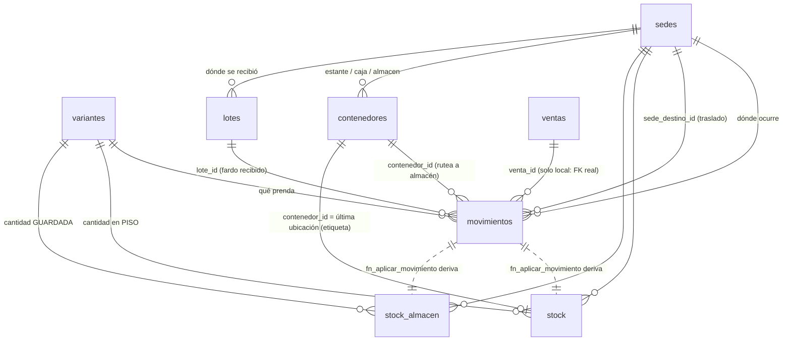
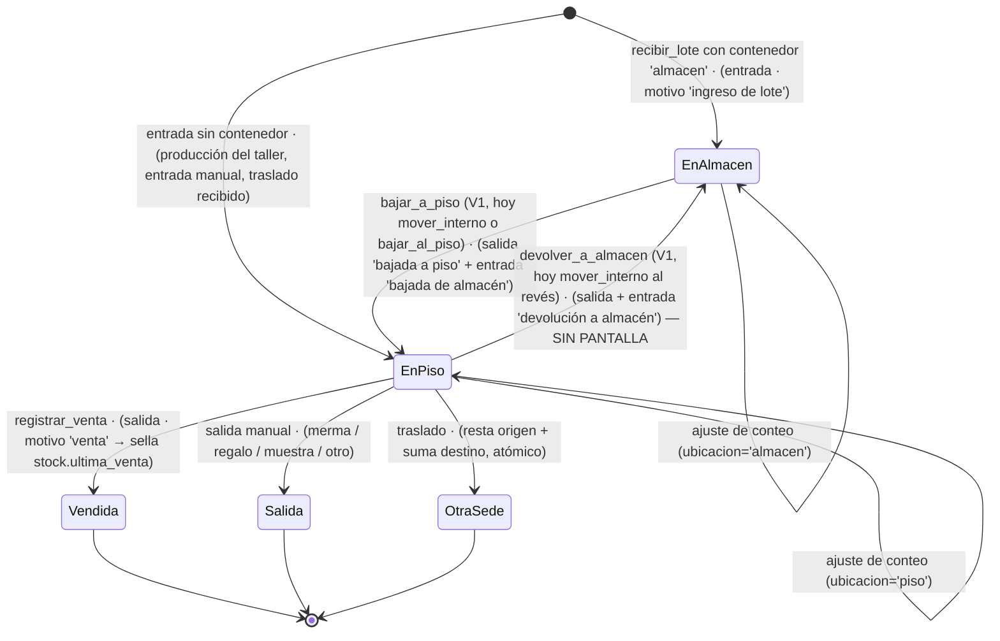

# 05 · Inventario y movimientos
> **Pájaro:** HALCÓN · **Lo lleva:** _(libre — apúntate en `07-GOBIERNO.md`)_ · **Última revisión:** 2026-09-25 (aviso de abajo); el cuerpo sigue siendo el del 2026-09-12

> **⚠️ Actualización 2026-09-25: el cuerpo de este documento describe V1** (`bajar_a_piso`, `devolver_a_almacen`,
> `sedes`, `contenedores`, `stock_almacen`, `stock.ultima_venta` y los motivos `bajada a piso` / `bajada de almacén` /
> `devolución a almacén`). Nada de eso existe hoy. Cómo es en V2:
> - Piso, almacén y cuarentena son `sububicaciones` de cada ubicación (`tipo` `piso_venta`, `almacen_tienda`,
>   `cuarentena`), y `stock` es una fila por variante, ubicación y sububicación.
> - Bajar y retirar del piso es la misma función: `retail.mover_interno(p_ubicacion_id, p_variante_id, p_cantidad,
>   p_sububicacion_origen_id, p_sububicacion_destino_id, p_nota)`, una prenda por llamada. Escribe UNA fila `traslado`
>   con motivo `movimiento_interno`. Movimientos la nombra por el par de sububicaciones: «Bajada al piso» (almacén →
>   piso) o «Retiro del piso» (piso → almacén); otro par sale como «Movimiento interno», que es también el nombre del
>   filtro (ADR-0208, «Movimientos nombra la bajada y el retiro por su par»). La usan «Reponer» y, desde el 2026-09-25,
>   «Retirar del piso» (menú «⋯» de cada talla), los dos en Existencias y solo en la sede activa.
> - Desde el 2026-09-25 hay además `retail.bajar_al_piso` (migración `0200`, pegada en producción según Felipe):
>   varias prendas, todo o nada, con token, que llama a `mover_interno` por prenda y guarda el documento en
>   `bajadas_piso` / `bajada_piso_items` (ADR-0208, «Construcción — bloque 1»). Se llega por el botón «Bajar al piso» de
>   Existencias; el módulo que lo enciende (`0000`) está sin confirmar en producción.
> - También desde el 2026-09-25 (migración `20260926000400`, pegada en producción según Felipe): un ajuste con motivo
>   «Reposición» ya no puede subir ni bajar el piso; `registrar_movimiento` lo rechaza con el hint
>   `reposicion_piso_cerrada`. Lo que sube del almacén se baja; lo que aparece de más al contar va por «Conteo físico».
>   En el almacén sigue permitido.
> - La venta sigue exigiendo la unidad en el piso: el efecto del hueco 5 sigue vigente.
> - Las cifras vigentes de cada tabla están en `../generado/DICCIONARIO-RETAIL.md`, que escribe un script.

## Para qué existe

CAYLA tiene la misma prenda repartida en cuatro sitios físicos (TRU, AQP, LIM, Taller) y
dentro de cada sitio en dos bolsillos: lo que está colgado en el piso de venta y lo que
sigue guardado en el almacén de atrás. Sin este módulo nadie sabe cuántas hay, dónde
están, ni por qué la cuenta cambió. Y lo segundo pesa más que lo primero: una cifra de
stock sin historia no se puede auditar ni corregir, solo se puede creer o no creer.

Por eso el módulo guarda **cada hecho** (`movimientos`) y deriva de ahí **la cifra**
(`stock`, `stock_almacen`). El hecho es la verdad; la cifra es una conveniencia que se
puede reconstruir.

## El mapa

Ciclo de vida de una unidad dentro de una sede — los dos bolsillos:

**Lo importante del dibujo:** no hay flecha de `EnAlmacen` a `Vendida`. Vender algo que
todavía está guardado exige bajarlo primero. Ver hueco 5.

## Las tablas

### `movimientos` — el libro de la mercadería: cada entrada, salida, ajuste y traslado, en orden
**Existe en:** local y producción
**Quién escribe:** `registrar_movimiento`, `registrar_venta`, `recibir_lote`, `bajar_a_piso` (V1; hoy: `mover_interno` y `bajar_al_piso`),
`devolver_a_almacen` (V1; hoy: `mover_interno` al revés), `cerrar_conteo`, `inventariar_produccion` / `revertir_produccion_inventario`
(0027/0028/0029). **Y también cualquier cliente autenticado por INSERT directo** — ver hueco 2.

| Columna | Tipo | Vacío | Por defecto | Para qué sirve |
|---|---|---|---|---|
| `id` | uuid | no | `gen_random_uuid()` | Identifica el hecho; lo referencia `conteo_lineas.movimiento_id` |
| `variante_id` | uuid | no | — | Qué prenda exacta (talla + color) se movió. FK a `variantes` |
| `sede_id` | uuid | no | — | Dónde ocurrió. En un traslado es la sede que ENTREGA |
| `tipo` | text | no | — | `entrada` · `salida` · `ajuste` · `traslado`. Define el signo y la rama de `fn_aplicar_movimiento` |
| `cantidad` | integer | no | — | Unidades. Siempre positiva salvo en `ajuste`, que lleva signo |
| `motivo` | text | **sí** | — | Por qué se movió. **Texto libre, sin CHECK** (`0001_init.sql:85`). `'venta'` es el único valor con consecuencia mecánica |
| `canal` | text | sí | — | `tienda` o `online`. Lo escribe solo `registrar_venta` (siempre `'tienda'`) |
| `sede_destino_id` | uuid | sí | — | En un traslado, la sede que RECIBE. Obligatorio para `tipo='traslado'`, pero por código, no por constraint |
| `monto` | numeric(12,2) | sí | — | Soles de la línea. Solo lo llena la venta; alimenta el análisis ABC de `inteligencia.ts` |
| `venta_id` | uuid | sí | — | A qué venta pertenece esta salida. **FK real solo en local** |
| `usuario_id` | uuid | sí | — | Qué integrante lo registró (FK a `personas`). Lo resuelve la RPC desde `auth.uid()` |
| `nota` | text | sí | — | Texto libre de quien registró: "vino roto", "Conteo censo AQP" |
| `created_at` | timestamptz | no | `now()` | Cuándo. Es el orden del libro y la fecha que se copia a `stock.ultima_*` |
| `contenedor_id` | uuid | sí | — | En qué ubicación cayó. **Si apunta a un contenedor `tipo='almacen'`, el movimiento se rutea a `stock_almacen` en vez de `stock`** |
| `lote_id` | uuid | sí | — | Qué fardo lo trajo (FK a `lotes`). Lo llena `recibir_lote` |

**Candados** (lo que la base impide que pase):
- `movimientos_tipo_check` — el tipo solo puede ser `entrada`/`salida`/`ajuste`/`traslado`.
  Ningún tipo inventado entra, y por eso `cerrar_conteo` usa `ajuste` con signo en vez de
  un `tipo='conteo'` propio: un tipo desconocido quedaría fuera de `recalcular_stock` en
  silencio (`0048_conteos.sql:36-41`).
- `movimientos_canal_check` — `tienda` u `online`, nada más.
- `movimientos_cantidad_coherente` — `cantidad <> 0 and (tipo = 'ajuste' or cantidad > 0)`.
  Garantiza que no exista una `entrada` de −5, una `salida` de 0, ni un movimiento vacío.
  Añadido por `0045_ajuste_con_signo.sql:105` y su gemelo `unificacion/27:97`. Se aplicó
  `not valid` + `validate` a propósito: si hubiera basura histórica, la guarda protege lo
  nuevo y el `validate` grita señalando el problema en vez de dejar todo sin protección.
- `movimientos_venta_id_fkey` — **solo local** (`0010_stock_concurrencia.sql:19`): `venta_id`
  apunta a una venta que existe de verdad. En producción no existe: `unificacion/05_operacion.sql`
  declara `venta_id uuid` suelto.
- Índices: `movimientos_variante_sede_idx`, `movimientos_created_at_idx` (las dos bases);
  `movimientos_venta_id_idx` **solo local** (`0001_init.sql:95`).
- **NO hay** candado de append-only: no hay `FORCE ROW LEVEL SECURITY`, no hay trigger
  `before update`/`before delete`, y `0004_grants.sql:11` da `update, delete` a
  `authenticated`. Ver hueco 1 y D-22.

**Diferencias local vs producción:**
| Cosa | Local | Producción (`retail.movimientos`) |
|---|---|---|
| FK `venta_id → ventas` | sí (`0010:19`) | **no** |
| Índice `movimientos_venta_id_idx` | sí | **no** |
| Policy de SELECT | tres policies: `movimientos_select_lider`, `movimientos_select_propia_sede`, `movimientos_select_sede_destino` (`0005`) | una sola: `movimientos_select using (puede_operar_sede(sede_id) or sede_destino_id = mi_sede())` |
| Policy de INSERT | `movimientos_insert_propia_sede` con `sede_id = fn_sede_actual_persona() or fn_es_lider()` | `movimientos_insert` con `puede_operar_sede(sede_id)` |

---

### `stock` — cuántas unidades hay EN EL PISO de cada sede, listas para vender hoy
**Existe en:** local y producción
**Quién escribe:** solo `fn_aplicar_movimiento` (security definer) y `recalcular_stock`.
El único otro camino es `fijar_stock_minimo`, y solo toca la columna `stock_minimo`.
**No hay policy de INSERT ni de UPDATE**: desde la app, `stock` es de solo lectura.

| Columna | Tipo | Vacío | Por defecto | Para qué sirve |
|---|---|---|---|---|
| `variante_id` | uuid | no | — | Qué prenda. Parte de la PK. `on delete cascade` |
| `sede_id` | uuid | no | — | En qué sede. Parte de la PK |
| `cantidad` | integer | no | `0` | Lo que se puede vender ahora mismo en esa sede |
| `ultima_entrada` | timestamptz | sí | — | Cuándo entró la última unidad (incluye bajadas del almacén) |
| `ultima_salida` | timestamptz | sí | — | Cuándo salió la última (venta, merma, traslado, subida al almacén) |
| `updated_at` | timestamptz | no | `now()` | Cuándo se tocó la fila por última vez |
| `contenedor_id` | uuid | sí | — | **Etiqueta** de la última ubicación conocida, no un reparto de cantidad. Ver hueco 14 |
| `ultima_venta` | timestamptz | sí | — | Cuándo se VENDIÓ por última vez. Sellado solo cuando `movimientos.motivo = 'venta'` |
| `stock_minimo` | integer | sí | — | Mínimo propio de esta prenda en esta sede. `null` = usar el mínimo general de `variantes.stock_minimo` |

**Candados:**
- PK `(variante_id, sede_id)` — una sola fila por prenda y sede. Es lo que permite que
  `on conflict do update` sea atómico, y lo que el diseño de almacén decidió NO ampliar a
  `(variante, sede, contenedor)` para no reescribir el núcleo (`unificacion/12:79-88`).
- `stock_cantidad_no_negativa` — `cantidad >= 0`. La base nunca deja stock negativo.
  En local desde `0010_stock_concurrencia.sql:14`; **producción NUNCA lo tuvo** hasta
  `unificacion/27_ajuste_con_signo.sql:84` (aplicada 2026-09-09, verificada en vivo el
  2026-09-10 según `retail.migraciones_aplicadas`).
- `for update` dentro de `fn_aplicar_movimiento` — no es un constraint, pero cierra el
  estado imposible que motivó `0010`: dos clientas comprando la última prenda en el mismo
  segundo. La segunda transacción espera, relee el valor ya descontado, y se rechaza con
  mensaje amable en vez de dejar el stock en −1.
- **No hay índice sobre `sede_id` solo** (en ninguna de las dos bases): la PK empieza por
  `variante_id`, así que un "dame todo el stock de AQP" recorre la tabla.

**Diferencias local vs producción:** ninguna en columnas ni candados (tras `unificacion/27`).
Las policies difieren en forma pero no en efecto: local tiene `stock_select_lider` +
`stock_select_propia_sede`; producción una sola `stock_select using (puede_operar_sede(sede_id))`.

---

### `stock_almacen` — cuántas unidades siguen GUARDADAS en el almacén de la sede, sin bajar al piso
**Existe en:** local y producción
**Quién escribe:** solo `fn_aplicar_movimiento` y `recalcular_stock`. Sin policy de
INSERT/UPDATE, a propósito (`0044_almacen_interno.sql:104`).

| Columna | Tipo | Vacío | Por defecto | Para qué sirve |
|---|---|---|---|---|
| `variante_id` | uuid | no | — | Qué prenda. Parte de la PK. `on delete cascade` |
| `sede_id` | uuid | no | — | De qué sede es ese almacén. Parte de la PK |
| `cantidad` | integer | no | `0` | Unidades recibidas que todavía nadie bajó al piso |
| `ultima_entrada` | timestamptz | sí | — | Cuándo entró la última al almacén |
| `ultima_salida` | timestamptz | sí | — | Cuándo se bajó la última al piso |
| `updated_at` | timestamptz | no | `now()` | Cuándo se tocó la fila |

**Candados:**
- PK `(variante_id, sede_id)` — un almacén por sede, por construcción.
- `stock_almacen_cantidad_no_negativa` — `cantidad >= 0`. Añadido en las dos bases por
  `0045:97` / `unificacion/27:91`; antes de eso el almacén podía irse a negativo en silencio.
- Índice `stock_almacen_sede_id_idx` sobre `sede_id` — el que `stock` no tiene.
- **No tiene `stock_minimo` ni `ultima_venta` ni `contenedor_id`.** Un mínimo se fija sobre
  el piso, no sobre lo guardado (`0053_stock_minimo_sobrevive.sql:29-31`).

**Diferencias local vs producción:** ninguna. Producción la tiene desde `unificacion/12`
(2026-09-03); local la recibió después, con `0044_almacen_interno.sql` — el orden inverso
al habitual, y el motivo de que ese archivo exista.

---

### `contenedores` — las ubicaciones fijas dentro de una sede: estantes, cajas, y EL almacén
**Existe en:** local y producción
**Quién escribe:** `/inventario/recibir` y cualquier cliente autenticado con la policy de
INSERT. No hay RPC dedicada. El contenedor `ALMACEN` de cada sede lo siembra la propia
migración (`0044:81-84`, `unificacion/12:124-129`).

| Columna | Tipo | Vacío | Por defecto | Para qué sirve |
|---|---|---|---|---|
| `id` | uuid | no | `gen_random_uuid()` | Identifica la ubicación |
| `sede_id` | uuid | no | — | De qué sede es esta ubicación |
| `codigo` | text | no | — | Cómo la llama el equipo: `A1`, `CAJA-3`, `ALMACEN` |
| `tipo` | text | no | — | `estante` · `caja` · `almacen`. **El tipo `almacen` es funcional, no decorativo**: es lo que hace que un movimiento se rutee a `stock_almacen` |
| `created_at` | timestamptz | no | `now()` | Cuándo se creó |

**Candados:**
- `unique (sede_id, codigo)` — dos estantes no pueden llamarse igual dentro de una sede.
- `contenedores_tipo_check` — solo los tres tipos. Ampliado a `almacen` por `0044:71` /
  `unificacion/12:115`.
- `contenedores_un_almacen_por_sede` — índice único parcial `on (sede_id) where tipo='almacen'`.
  **Este es el candado que define el modelo**: una sede no puede tener dos almacenes, así
  que `bajar_a_piso` puede resolver "el almacén de esta sede" con un `select` sin ambigüedad. (V1; hoy: el candado
  equivalente es `sububicaciones_tipo_unico_por_ubicacion`, y `bajar_al_piso` resuelve piso y almacén por tipo.)
  Si el negocio alguna vez necesita un almacén central compartido entre AQP y TRU, este
  índice es lo primero que hay que rediseñar (`0044:8-9` lo dice explícito).

**Diferencias local vs producción:** las policies. Local: `contenedores_select_lider` +
`contenedores_select_propia_sede` (`sede_id = fn_sede_actual_persona()`, sin la cláusula de
almacén hermano). Producción: `contenedores_select using (puede_operar_sede(sede_id))`.
El seed también difiere: local lee `sedes` directo y filtra `tipo in ('tienda','fabrica')`;
producción lee `retail.sede_meta`, que en local no existe.

---

### `lotes` — el fardo que llegó: agrupa todas las prendas de una misma recepción
**Existe en:** local y producción
**Quién escribe:** solo `recibir_lote`. La policy de INSERT también lo permitiría directo,
pero ninguna pantalla lo hace.

| Columna | Tipo | Vacío | Por defecto | Para qué sirve |
|---|---|---|---|---|
| `id` | uuid | no | `gen_random_uuid()` | Identifica la recepción; lo referencia `movimientos.lote_id` |
| `sede_id` | uuid | no | — | Dónde se recibió el fardo |
| `origen` | text | no | — | `taller` o `proveedor`. De dónde vino la mercadería |
| `proveedor` | text | sí | — | Nombre del proveedor como texto libre (respaldo histórico de antes del directorio) |
| `numero_guia` | text | sí | — | Guía de remisión del transportista, para cruzar con el papel |
| `fecha_recepcion` | date | no | `current_date` | Qué día llegó |
| `recibido_por` | uuid | sí | — | Quién lo recibió (FK a `personas`) |
| `nota` | text | sí | — | Observaciones: "faltaron 2 blusas", "caja mojada" |
| `created_at` | timestamptz | no | `now()` | Cuándo se registró |
| `proveedor_id` | uuid | sí | — | El proveedor del directorio (`0013_finanzas_nucleo.sql:31`) |
| `orden_compra_id` | uuid | sí | — | Qué orden de compra cierra esta recepción (`0017_ordenes_compra.sql:12`) |
| `orden_produccion_id` | uuid | sí | — | **MUERTO · solo local** (`0018_produccion.sql:13`). Ver abajo |

**`lotes.orden_produccion_id` — MUERTO.** Apunta a `ordenes_produccion`, el modelo de
Producción de la Fase 1 que las migraciones 0025-0029 reemplazaron por `producciones` /
`produccion_lineas`. **Sigue vivo** porque nunca se borran columnas con historial y porque
`recibir_lote` (la firma de 8 argumentos que sobrevivió a `0049`) todavía la escribe. La
pantalla ya no la alimenta: `app/(app)/inventario/recibir/page.tsx:60-67` deja
`produccionesPendientes` en `[]` a propósito y explica por qué.

**Candados:**
- `lotes_origen_check` — `taller` o `proveedor`, nada más.
- Índice `lotes_sede_id_idx` — **solo local** (`0008_almacen.sql:30`). Producción no lo tiene.
- **No hay candado que exija `proveedor_id` cuando `origen='proveedor'`**, ni que prohíba
  `orden_compra_id` cuando `origen='taller'`. Es coherencia por convención, no por base.

**Diferencias local vs producción:**
| Cosa | Local | Producción (`retail.lotes`) |
|---|---|---|
| `orden_produccion_id` | sí (muerta) | **no existe** |
| Índice `lotes_sede_id_idx` | sí | **no** |
| Policies | `lotes_select_lider` + `lotes_select_propia_sede` + `lotes_insert_propia_sede` | `lotes_select` / `lotes_insert`, ambas con `puede_operar_sede(sede_id)` |

---

### Las dos sedes-almacén legadas — `TRU-ALM`, `AQP-ALM`, `LIM-ALM`
**Existe en:** **solo local** (filas de `sedes`, no una tabla propia)
**Quién escribe:** nadie hoy. Las sembró `0008_almacen.sql:14-16`.

**MUERTO.** El primer diseño del almacén (julio 2026) lo modeló como una **sede hermana**:
`TRU` y `TRU-ALM` eran dos sedes distintas unidas por `sedes.tienda_asociada_id`, y bajar
mercadería al piso era un `traslado` entre sedes. En septiembre de 2026 Felipe decidió lo
contrario: el almacén es **un contenedor dentro de la misma sede** (`unificacion/12:4-6`).
Producción nunca creó las sedes `-ALM`; local sí las tiene y no se borran, porque hay
movimientos históricos apuntando ahí.

**Sigue vivo** porque: (a) no se borran datos; (b) `fn_puede_operar_sede` todavía consulta
`tienda_asociada_id` (`0012_rpc_valida_sede.sql:19-22`); (c) el frontend conserva la rama
de "devolución vía traslado a una sede-almacén" en `MovimientoModal.tsx:76`, aunque
`InventarioAgrupado.tsx:88` la desactiva pasando `esAlmacen: false` a todas las sedes y
`contenedoresAlmacen={[]}` (línea 256). Ninguna pantalla nueva debe ofrecerlas.

---

## Cómo se escribe (la única puerta)

Todas las funciones son `security definer` con `set search_path = public` (local) o
`retail, public` (producción). Todas están al alcance de `authenticated` por
`0004_grants.sql:13` (`grant execute on all functions ... to authenticated`), salvo
`recalcular_stock`, a la que `0055:103` le revoca `public`.

### `fn_aplicar_movimiento(p_movimiento_id uuid) → void`
El corazón. No es una RPC pública en la práctica (nadie la llama desde el cliente), pero
**está expuesta**: el grant de funciones es global. No valida permisos ni sede — asume que
quien la llama ya validó.

Qué hace, en orden:
1. Lee el movimiento. Si no existe, `raise`.
2. Si trae `contenedor_id`, valida que el contenedor pertenezca a la sede correcta (la
   destino si es traslado, la propia si no) y averigua si es `tipo='almacen'`.
   Un contenedor de otra sede aborta con excepción.
3. **Ruteo:** si el contenedor es de almacén y el tipo es `entrada`/`salida`/`ajuste`,
   escribe en `stock_almacen` y **retorna ahí mismo**. Un `traslado` nunca entra a esta
   rama: `v_es_almacen := false` se fuerza (`0045:167`).
4. Rama piso: valida stock suficiente con `for update` para salida y traslado; aplica.
5. En `salida`, sella `ultima_venta` **solo si `m.motivo = 'venta'`**.
6. En `ajuste` (las dos ramas), usa el patrón **asegurar-bloquear-verificar-sumar**:
   `insert ... values (.., 0) on conflict do nothing`, luego `for update`, luego comprobar
   `actual + delta >= 0`, y recién entonces `update ... set cantidad = cantidad + delta`.
   Nunca se propone una fila negativa, porque Postgres evalúa el CHECK sobre la fila
   PROPUESTA antes de detectar el conflicto — el bug que `0042` y `0045` documentan.

**Candado de permiso:** ninguno. **Idempotente:** no — llamarla dos veces con el mismo
movimiento aplica el efecto dos veces.

### `registrar_movimiento(p_variante_id uuid, p_sede_id uuid, p_tipo text, p_cantidad integer, p_motivo text default null, p_canal text default null, p_sede_destino_id uuid default null, p_monto numeric default null, p_venta_id uuid default null, p_nota text default null, p_contenedor_id uuid default null, p_lote_id uuid default null) → uuid`
Firma de **12 argumentos**, la única viva desde `0049_una_sola_firma_por_funcion.sql`.
Inserta en `movimientos` con `usuario_id` resuelto desde `auth.uid()` y llama a
`fn_aplicar_movimiento` en la misma transacción.

**Candado de permiso:** `if not fn_puede_operar_sede(p_sede_id) then raise` — es decir,
Líder de equipo en cualquier sede, o Integrante en la suya (y en su almacén hermano legado).
**Este candado puede abrirse solo: ver hueco 3.**
**Idempotente:** no. Dos llamadas iguales crean dos movimientos y descuentan dos veces.

### `recibir_lote(p_sede_id uuid, p_origen text, p_items jsonb, p_proveedor text default null, p_numero_guia text default null, p_nota text default null, p_orden_compra_id uuid default null, p_orden_produccion_id uuid default null) → uuid`
Firma de **8 argumentos en local** (la de `0018_produccion.sql:37`, que `0049` eligió
conservar) y de **7 en producción** (`unificacion/14`, sin `p_orden_produccion_id`).
Crea el lote, marca la orden de compra como `recibida`, y por cada ítem crea producto y
variante si no existían y emite una `entrada` con `motivo='ingreso de lote'`,
`lote_id` y `contenedor_id`. Si el contenedor es el almacén, la mercadería cae en
`stock_almacen` — que es lo que D-42 pide.

**Candado de permiso:** `fn_puede_operar_sede(p_sede_id)`. **Idempotente:** no — pegar dos
veces el mismo fardo crea dos lotes y duplica el stock.

### `bajar_a_piso(p_sede_id uuid, p_variante_id uuid, p_cantidad integer, p_nota text default null) → uuid` (V1; hoy: no existe)
> Hoy se baja con `mover_interno` (una fila `traslado`, motivo `movimiento_interno`) o con `bajar_al_piso` (varias
> prendas, todo o nada, con token; ADR-0208). Lo que sigue describe V1.

Dos movimientos en la misma transacción: `salida` con `motivo='bajada a piso'` y el
contenedor de almacén (resta de `stock_almacen`), más `entrada` con
`motivo='bajada de almacén'` sin contenedor (suma a `stock`). Si el almacén no alcanza, la
salida revienta y **la entrada nunca corre**: o pasan las dos o no pasa ninguna.

**Candado de permiso:** `fn_puede_operar_sede(p_sede_id)`, más `p_cantidad > 0` y "esta sede
tiene un contenedor `almacen`". **Idempotente:** no.
**Pantalla:** `components/BajarATiendaModal.tsx:39`, desde `/inventario/almacen`.

### `devolver_a_almacen(p_sede_id uuid, p_variante_id uuid, p_cantidad integer, p_nota text default null) → uuid` (V1; hoy: no existe)
> Hoy retirar del piso es `mover_interno` con origen piso y destino almacén. Desde el 2026-09-25 tiene pantalla:
> «Retirar del piso», en el menú «⋯» de cada talla en Existencias (`ReponerPisoModal` con `sentido: 'retirar'`,
> bloque 2 de ADR-0208), con nota opcional del motivo. Lo que sigue describe V1.

El espejo exacto: `salida` sin contenedor (resta del piso) + `entrada` con el contenedor de
almacén (suma al almacén), las dos con `motivo='devolución a almacén'`.
**Candado de permiso:** idéntico al anterior. **Idempotente:** no.
**Pantalla: NO TIENE.** D-41 lo dice y el código lo confirma: `InventarioAgrupado.tsx:86-88`
desactiva a propósito la rama de devolución del modal.

### `recalcular_stock() → void`
La red de seguridad. Reconstruye `stock` y `stock_almacen` enteros desde `movimientos`.
Versión vigente: `0055_recalcular_stock_almacen.sql` en local, `unificacion/35` en producción
(ADR-0031). Lo que hace bien, y costó tres migraciones aprender:
- calcula el **neto por (variante, sede) en una sola pasada** antes de escribir, porque
  proponer una fila negativa choca contra `stock_cantidad_no_negativa` antes del
  `on conflict` (ADR-0020);
- **no hace `truncate`**, así que `stock_minimo` y `contenedor_id` —que no se derivan de
  `movimientos`— sobreviven;
- **rutea por contenedor**: lo que fue al almacén no se pliega de vuelta al piso;
- **excluye el traslado del filtro de almacén** (`where m.tipo = 'traslado' or coalesce(c.tipo,'') <> 'almacen'`),
  porque `fn_aplicar_movimiento` fuerza que un traslado nunca vaya al almacén; sin esa
  excepción, un traslado hacia un contenedor de almacén desaparecería del inventario;
- **no borra la fila que existe solo por su mínimo** (`and s.stock_minimo is null`, 0053).

**Candado de permiso:** `if not fn_es_lider() then raise` (local desde `0055:24`;
producción desde `unificacion/35`). **Idempotente: SÍ** — es la única del módulo que lo es:
correrla dos veces da el mismo resultado, porque escribe el absoluto, no un delta.
**Pantalla: NO TIENE.** Solo se invoca desde el editor SQL (D-11).

### Escrituras que NO pasan por estas RPC

| Quién | Dónde | Qué escribe |
|---|---|---|
| `registrar_venta` | `0054_venta_idempotente.sql:165` | `insert into movimientos` + `fn_aplicar_movimiento`, directo. Es la puerta de la venta, no de inventario, pero mueve stock |
| `cerrar_conteo` | `0048_conteos.sql:458` | `insert into movimientos` tipo `ajuste` con signo, `motivo='conteo'`, y el contenedor de almacén si el conteo es del almacén |
| `inventariar_produccion` / `cerrar_produccion` | `0027:70`, `0029:143` | `entrada` con `motivo='Producción del taller'` |
| `revertir_produccion_inventario` | `0028:71` | `salida` con `motivo='Reversa de producción'` |
| `fijar_stock_minimo` | `0016_fijar_stock_minimo.sql:24` | `insert into stock ... on conflict do update` — la única escritura a `stock` que no viene de un movimiento. Solo toca `stock_minimo` |
| **Cualquier cliente autenticado** | policy `movimientos_insert_propia_sede` (`0003_rls.sql:77`) | Un `insert` directo a `movimientos` **sin** `fn_aplicar_movimiento`. **Ésta es la superficie de riesgo real del módulo.** Ver hueco 2 |

## Quién ve y quién toca

Aviso primero, porque cambia cómo se lee la tabla: **la base solo conoce dos niveles**.
`personas.rol` acepta `lider` e `integrante` (`0001_init.sql`), y en producción
`apps/web/lib/persona.ts:49-51` mapea `admin → lider` y todo lo demás (incluido
`supervisor_sede`) → `integrante`. **Admin y Solo lectura de D-12 todavía no existen en el
esquema.** En la tabla, "Admin" se comporta hoy como Líder de equipo, y "Solo lectura" se
comporta como Integrante — es decir, puede escribir.

| Operación | Admin | Líder de equipo | Integrante | Solo lectura |
|---|---|---|---|---|
| Ver stock y almacén de su sede | sí | sí | sí | sí |
| Ver stock y almacén de otras sedes | sí | sí | no | no |
| Ver el historial de movimientos de su sede | sí | sí | sí | sí |
| Ver movimientos de otras sedes | sí | sí | no (salvo si su sede es el destino del traslado) | no |
| Ver costo y margen | sí | sí | **sí en la base**, oculto solo en `catalogo.ts:93` | sí en la base |
| Registrar entrada / salida / ajuste / traslado | sí | en cualquier sede | solo en la suya | **sí — no debería** |
| Recibir un lote | sí | en cualquier sede | solo en la suya | **sí — no debería** |
| Bajar a piso / devolver a almacén | sí | en cualquier sede | solo en la suya | **sí — no debería** |
| Fijar el stock mínimo por sede | sí | sí | no | no |
| Cerrar un conteo (el único ajuste masivo) | sí | sí | no | no |
| Recalcular el stock | sí | sí | no | no |
| Editar o borrar un movimiento ya escrito | **sí, con el editor SQL o la llave de servicio** | no (RLS sin policy de UPDATE/DELETE) | no | no |

## Qué se rompe sin esto

Sin `movimientos` no hay inventario, y sin inventario no hay venta: `registrar_venta` llama
a `fn_aplicar_movimiento` por cada línea del carrito, así que la caja se cae con él. La
pantalla de Catálogo (`lib/catalogo.ts`) falla en duro a propósito si `stock` o
`stock_almacen` no responden — antes se dibujaba vacía y una Líder de equipo concluía que
CAYLA no tiene mercadería.

Sin `stock_almacen`, "Recibir mercadería" mete unidades reales que no aparecen en ningún
lado hasta que alguien las baja, y `/inventario/recibir` y `/inventario/almacen` mienten
diciendo "tu sede no tiene un almacén configurado".

Y sin el historial completo se pierde lo que ningún reporte puede reconstruir: por qué la
cuenta cambió. El Estado de Resultados por sede (D-30) y el costo absorbido del Taller
(D-31) se apoyan en que cada unidad tenga un movimiento con fecha, sede y motivo. Un stock
sin historia se puede creer o no creer, pero no se puede auditar.

## Huecos conocidos

1. **El historial se puede borrar: no hay candado físico (D-22).** Tres cosas faltan a la
   vez: `0004_grants.sql:11` da `update, delete on all tables ... to authenticated`;
   ninguna tabla del módulo tiene `FORCE ROW LEVEL SECURITY` (verificado: cero coincidencias
   en `supabase/migrations/` y `supabase/unificacion/`); y no existe ningún trigger
   `before update`/`before delete` sobre `movimientos`. Hoy la RLS tapa el agujero para
   `authenticated` —no hay policy de UPDATE ni de DELETE, así que afectan 0 filas—, pero
   el dueño de la tabla, `service_role` y cualquier función `security definer` lo saltan
   entero. **Consecuencia:** la única defensa del libro contra una edición es que nadie
   escriba la policy equivocada ni use la llave de servicio. D-22 decide poner el candado
   de verdad: la base rechaza borrar o editar un movimiento pasado, y un error se corrige
   escribiendo lo contrario.

2. **Se puede escribir un movimiento sin que mueva el stock.** La policy
   `movimientos_insert_propia_sede` (`0003_rls.sql:77`) y su gemela de producción
   (`unificacion/05_operacion.sql:226`) permiten un `insert` directo desde la API. Ese
   `insert` no dispara `fn_aplicar_movimiento` — no hay trigger. **Consecuencia:** la fila
   queda en el historial y `stock` no cambia. Todo cuadra hasta que alguien corre
   `recalcular_stock`, y ahí la cifra salta sin explicación. Peor: un `insert` directo
   puede poner `usuario_id` de otra persona, porque la columna no la fija ningún default.

3. **El candado de sede se abre solo con una sesión sin `personas`.**
   `fn_puede_operar_sede` (`0012_rpc_valida_sede.sql:15-23`) devuelve
   `fn_es_lider() or p_sede_id = fn_sede_actual_persona() or exists(...)`. Si el usuario no
   tiene fila en `personas`, `fn_sede_actual_persona()` es NULL, la comparación es NULL, y
   `false or NULL or false` = **NULL**. Y el patrón que usan todas las RPC del módulo es
   `if not fn_puede_operar_sede(...) then raise` — **`not NULL` no es true, así que el
   `raise` no dispara**. Solo `registrar_venta` se arregló (`0054:115`, `is not true`);
   `registrar_movimiento` (`0012:52`), `recibir_lote` (`0018:64`), `bajar_a_piso` (V1)
   (`0044:229`) y `devolver_a_almacen` (V1) (`0044:269`) siguen con `if not`. El propio `0054`
   lo deja escrito: *"el barrido del resto queda en el BACKLOG"* (`0054_venta_idempotente.sql:67`).
   **Consecuencia:** una cuenta recién creada, sin dar de alta, puede mover inventario en
   cualquier sede.

4. **`movimientos.motivo` es texto libre y `stock.ultima_venta` depende de una comparación
   exacta.** La columna no tiene CHECK (`0001_init.sql:85`), y `fn_aplicar_movimiento` sella
   la fecha de última venta con `case when m.motivo = 'venta'` — comparación exacta,
   sensible a mayúsculas, sin `trim`. `recalcular_stock` usa el mismo literal
   (`where tipo = 'salida' and motivo = 'venta'`). El formulario manual
   (`MovimientoModal.tsx:199-205`) ofrece un **input de texto libre** para el motivo de
   entrada, ajuste y traslado. **Consecuencia:** un `'Venta'`, un `' venta'` o un
   `'venta a clienta'` no sellan nada, y el indicador "Días sin venta" de
   `lib/inteligencia.ts:113` cae al fallback `creadaEn` y marca la prenda como estancada
   para siempre. Al revés también duele: una llamada a `registrar_movimiento` con
   `p_tipo='salida'` y `p_motivo='venta'` sella la fecha y descuenta stock **sin crear fila
   en `ventas` ni en caja** — plata que el inventario dice que salió y el Diario de Caja
   nunca vio (D-34).

5. **Vender lo que está en el almacén no se puede (D-40 incumplida).** D-40 promete: *"se
   puede, y el sistema registra solo el paso por el piso. La caja no se frena nunca por un
   trámite."* En el SQL no existe: `registrar_venta` (`0054:165`) inserta una `salida` sin
   contenedor, que va contra `stock` (piso). Si la prenda solo está en `stock_almacen`,
   `fn_aplicar_movimiento` lanza *"Stock insuficiente en sede %"* y la venta se cae. No hay
   ninguna llamada a `bajar_a_piso` (V1; hoy tampoco a `mover_interno`: con piso 0 la caja dice «está agotada»,
   ADR-0208) en el camino de venta (verificado: las únicas
   referencias son `BajarATiendaModal.tsx:39`). **Consecuencia:** la clienta con la prenda
   en la mano espera a que alguien vaya a "Bajar a tienda" y vuelva. La caja se frena por
   un trámite, que es exactamente lo que D-40 prohíbe.

6. **Las alertas de reposición no miran el almacén (D-39 incumplida).** D-39 promete:
   *"cuentan las dos cosas, pero avisan cuántas están guardadas: 'quedan 2 en piso y 8 en
   almacén — baja mercadería'"*. `lib/inteligencia.ts:119-125` calcula `reorderPoint` y
   `reponerYa` solo sobre `v.stockTotal`, que en `lib/catalogo.ts:107` es la suma de
   `stockPorSede` — **piso puro**. `stockAlmacenTotal` existe en el mismo objeto y no se
   usa en ningún cálculo de alerta. **Consecuencia:** el sistema manda comprar mercadería
   que ya está en el cuarto de atrás. Plata gastada dos veces por la misma prenda.

7. **`devolver_a_almacen` no tiene pantalla (D-41).** (V1. **Resuelto el 2026-09-25:** retirar es `mover_interno` al
   revés y tiene pantalla, «Retirar del piso» en el menú «⋯» de Existencias; bloque 2 de ADR-0208.) La RPC funciona y es atómica
   (`0044:262-296`), pero `InventarioAgrupado.tsx:88` fuerza `esAlmacen: false` en todas las
   sedes y la línea 256 pasa `contenedoresAlmacen={[]}`, así que la rama de devolución de
   `MovimientoModal.tsx:76` es inalcanzable. **Consecuencia:** lo que baja al piso ya no
   sube. Con el tiempo el piso acumula prendas dañadas, de temporada pasada o para devolver
   al proveedor, todas contadas como vendibles hoy.

8. **Dos modelos de almacén conviven y el legado sigue en el código.** Las sedes hermanas
   `TRU-ALM` / `AQP-ALM` / `LIM-ALM` (`0008_almacen.sql:14-16`) son el modelo viejo y están
   **solo en local**; el modelo vigente es el contenedor `tipo='almacen'` dentro de la misma
   sede. `fn_puede_operar_sede` todavía consulta `tienda_asociada_id`, y `MovimientoModal`
   conserva entera la rama de "devolución = traslado a una sede-almacén". **Consecuencia:**
   alguien que lea el código concluye que hay dos formas válidas de guardar mercadería, y
   un `npx supabase db reset` local produce sedes que producción no tiene — el entorno de
   prueba deja de parecerse al real.

9. **La base acepta ajustes negativos desde `0045`; la pantalla no.**
   `MovimientoModal.tsx:149` tiene `min={1}` en el campo de cantidad. **Consecuencia:** un
   conteo que encuentra MENOS de lo que dice el sistema solo se puede registrar por la
   pantalla de Conteos (`cerrar_conteo`), que exige Líder de equipo. Una Integrante que ve
   que faltan dos blusas no tiene forma honesta de anotarlo: o lo registra como `merma`
   —afirmando que la prenda se perdió cuando el equivocado era el sistema— o no lo registra.

10. **`recibir_lote` sigue arrastrando el modelo muerto de producción.** La firma que
    sobrevivió a `0049` es la de 8 argumentos (`0018_produccion.sql:37`), que escribe
    `lotes.orden_produccion_id` y marca `ordenes_produccion.estado = 'completada'` — una
    tabla que `0025`-`0029` reemplazaron por `producciones`. `0031_recibir_lote_completo.sql`
    escribió a propósito una versión de 7 argumentos SIN ese parámetro y explicó por qué
    (líneas 20-33), y `0049` la borró en favor de la de 8. **Consecuencia:** local y
    producción divergen en la firma de la RPC más compleja del módulo (8 vs 7 argumentos),
    y "recibir ligado a una orden de producción" sigue apuntando a un modelo que ya nadie
    llena.

11. **Producción no deja al Integrante operar el almacén hermano (D-26).**
    `retail.puede_operar_sede` (`unificacion/03_candados.sql`, reafirmada en `36`) es
    `admin or mi_sede = p_sede_id`, sin la cláusula `tienda_asociada_id` que sí tiene local.
    `docs/ARQUITECTURA.md:381-382` lo tiene anotado como pendiente. Hoy no duele —en el
    modelo nuevo el almacén es la misma sede— pero significa que las dos bases no aplican
    el mismo criterio de permiso, y que los movimientos históricos hacia las sedes `-ALM`
    de local no tienen equivalente allá.

12. **`movimientos.venta_id` en producción no apunta a nada garantizado.** La FK
    `movimientos_venta_id_fkey` y el índice `movimientos_venta_id_idx` existen **solo en
    local** (`0010:19`, `0001:95`). **Consecuencia:** en la base con la que factura CAYLA,
    una salida puede citar una venta que no existe, y reconstruir "qué se vendió en esta
    boleta" recorre la tabla entera. Es material directo para D-34 (unir venta y comprobante).

13. **Cero pruebas sobre el núcleo de stock (D-25).** Los cuatro errores de esta familia
    —`recalcular_stock` que nunca podía correr (ADR-0020), el ajuste negativo imposible
    (ADR-0023), el `ultima_venta` perdido en la unificación (`unificacion/26`), y la ceguera
    al almacén (ADR-0031)— se encontraron **a mano**, cada uno meses después de introducirse.
    `apps/web` tiene tests de errores de escritura y de etiquetas de sede, ninguno del
    comportamiento de `fn_aplicar_movimiento`. **Consecuencia:** el siguiente error de esta
    familia también se va a encontrar a mano, con plata real encima.

14. **`stock.contenedor_id` parece decir dónde está la prenda, y no lo dice.** Es la
    **última ubicación conocida**, una etiqueta que se pisa con cada entrada
    (`contenedor_id = coalesce(excluded.contenedor_id, stock.contenedor_id)`); no reparte
    cantidad entre ubicaciones. `unificacion/12:76-82` lo explica como alternativa
    descartada. Pero `/buscar` la muestra al lado de la cantidad
    (`app/(app)/buscar/page.tsx:74`), y un traslado dirigido a un contenedor de almacén de
    la sede destino deja la fila con `contenedor_id = ALMACEN` y la cantidad sumada en
    `stock` (piso), porque `fn_aplicar_movimiento` fuerza `v_es_almacen := false` para
    traslados. **Consecuencia:** la pantalla dice "está en el almacén" y el sistema la
    cuenta como vendible.

15. **Un solo costo por variante, el nuevo pisa al viejo (D-45, abierta).**
    `variantes.costo` es un `numeric(12,2)` único. Ni `movimientos` ni `lotes` guardan el
    costo unitario de esa recepción concreta —`ordenes_compra_items.costo_unitario` existe
    pero `recibir_lote` no lo lee—, así que un fardo más caro reescribe el costo de todo lo
    que quedaba del fardo anterior. **Consecuencia:** el margen histórico se recalcula solo
    hacia atrás. D-45 queda abierta a propósito: el contador decide entre promedio
    ponderado, PEPS o costo por lote. **No se toca el núcleo hasta entonces.**

16. **Promesas incumplidas encontradas en los propios archivos:**
    - `0003_rls.sql:1-3` — *"Integrantes solo ven/operan su propia sede y no ven
      costo/margen (mismo principio que CAYLA Inventario: roles validados en el servidor,
      no solo ocultos en la UI)"*. Falso desde el día uno: `variantes_select_autenticado`
      deja leer `costo` a cualquier autenticado, y el ocultamiento vive exactamente donde
      el comentario dice que no vive — en la UI (`lib/catalogo.ts:93`). D-27 decide dejar
      los costos visibles a propósito y **corregir este comentario**, porque describe algo
      que nunca fue cierto.
    - `0044_almacen_interno.sql:29-32` — *"Después de esta migración, el Postgres local y el
      `retail` de producción tienen la MISMA maquinaria de inventario"*. No se cumple: local
      conserva `lotes.orden_produccion_id`, `lotes_sede_id_idx`, la FK y el índice de
      `venta_id`, y las sedes `-ALM`; producción conserva un `puede_operar_sede` distinto y
      una `recibir_lote` de otra aridad.
    - `0042_recalcular_stock_neto.sql:78` y `0044:404` — *"Conserva stock_minimo y
      contenedor_id, que no se derivan de movimientos"*. Era verdad para las filas que
      sobrevivían y mentira para las que la propia función borraba. `0053` lo arregló con
      `and s.stock_minimo is null` y reescribió el comentario; el caso está cerrado y queda
      aquí como precedente: un `comment on function` que promete más de lo que el cuerpo
      hace es tan grave como un bug.

## Decisiones que lo gobiernan

- **D-21** — `movimientos` es la historia y no se toca; el pasado se puede reconstruir.
  Es el principio 4 de `CLAUDE.md` hecho decisión.
- **D-22** — Hoy no hay candado físico sobre el historial; se pone. Un error se corrige
  escribiendo lo contrario, nunca editando. Gobierna el hueco 1.
- **D-25** — Pruebas sobre el núcleo de stock antes del censo. Gobierna el hueco 13.
- **D-26** — El Integrante puede operar el almacén de su propia sede; producción se corrige
  para comportarse como local. Gobierna el hueco 11.
- **D-27** — Costos y márgenes quedan visibles a propósito; el comentario de `0003_rls.sql`
  que dice lo contrario se corrige.
- **D-38** — Piso y almacén son dos bolsillos de la MISMA sede (`stock` y `stock_almacen`).
  Un almacén por sede alcanza — lo hace cumplir `contenedores_un_almacen_por_sede`.
- **D-39** — Las alertas cuentan las dos bolsas y avisan cuántas están guardadas.
  Hoy no se cumple: hueco 6.
- **D-40** — Vender desde el almacén se puede y el sistema registra solo el paso por el piso.
  Hoy no existe: hueco 5.
- **D-41** — Devolver del piso al almacén ya pasa en la base; **la pantalla existe desde el 2026-09-25** («Retirar del piso», bloque 2 de ADR-0208). Hueco 7: el registro está resuelto; la consecuencia no del todo, porque el semáforo de Existencias («Reponer», «Por colgar») vuelve a pedir bajar lo que se guardó a propósito, hasta que Felipe decida la marca de «retirada de la venta» (bloque 3 de ADR-0208).
- **D-42** — La mercadería nueva entra al almacén y de ahí se baja al piso. Lo cumple
  `recibir_lote` con el contenedor `ALMACEN`.
- **D-45 (abierta)** — Método de costeo del inventario. No se toca el núcleo hoy. Hueco 15.
- **D-16** — Cada tabla lleva marca de en qué base existe. Aplicado en cada ficha.
- **D-07** — Lo muerto se marca con el motivo por el que sigue vivo: `lotes.orden_produccion_id`
  y las sedes `-ALM`.
- **D-11** — Solo Felipe pega SQL en producción, y queda anotado
  (`retail.migraciones_aplicadas`, `unificacion/38`).
- **ADR-0001** — La sede que RECIBE un traslado ve la fila en su historial
  (`movimientos_select_sede_destino`).
- **ADR-0004** — `recibir_lote` en producción divergió de la 0018 durante la unificación:
  el origen del hueco 10.
- **ADR-0020** — `recalcular_stock()` calcula el neto antes de escribir; el CHECK se evalúa
  sobre la fila propuesta, antes del `on conflict`.
- **ADR-0023** — El ajuste lleva signo y el stock no puede ser negativo. Es lo que hace
  posible un conteo físico honesto.
- **ADR-0026** — Una sola firma por función, y cómo se sabe qué corrió en producción.
  Gobierna `0049` y la tabla `migraciones_aplicadas`.
- **ADR-0027** — El censo es el primer conteo: los ajustes masivos entran por `cerrar_conteo`,
  con `ajuste` y signo, no por un tipo de movimiento nuevo.
- **ADR-0031** — `recalcular_stock()` vuelve a saber que el almacén existe; incluye el
  candado de Líder, la excepción de traslado y el guard de `stock_minimo`. También documenta
  las 2 filas de `stock` de AQP que ya estaban infladas en producción y se corrigieron a mano.
- **ADR-0032 / ADR-0033** — La venta es idempotente por token; los movimientos que emite no
  se duplican en un reintento.
