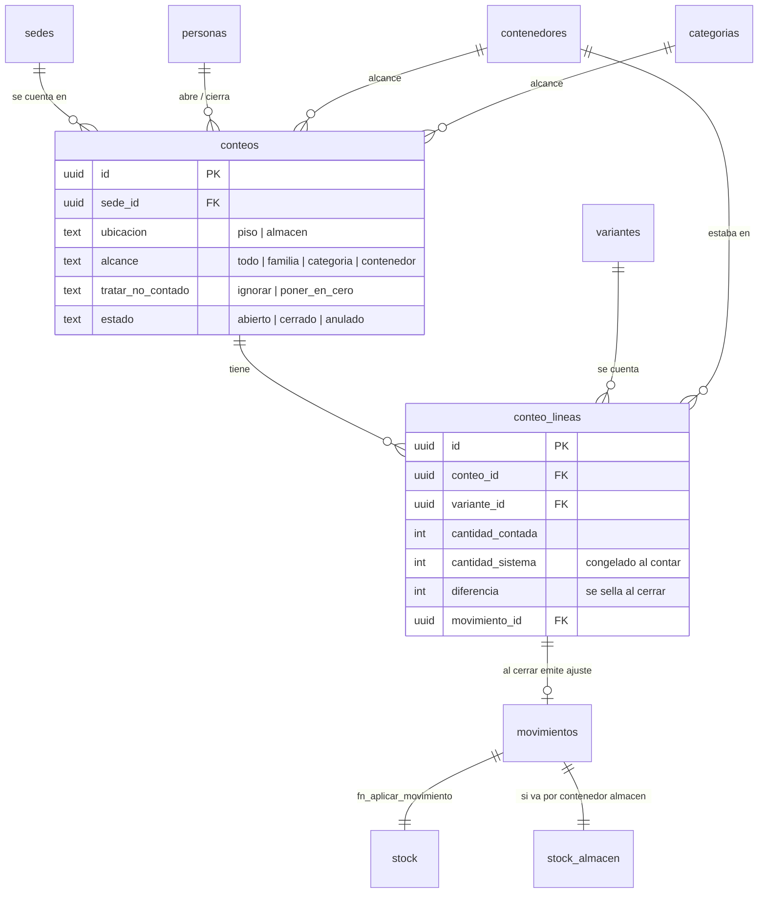
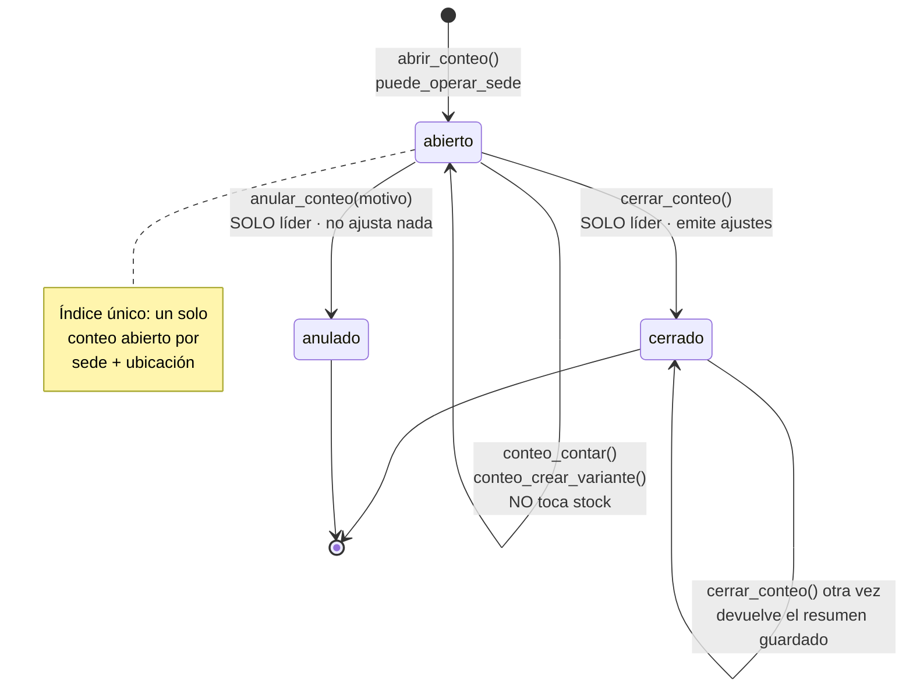

# 06 · Conteo y censo físico
> **Pájaro:** LECHUZA · **Lo lleva:** _(libre — apúntate en `07-GOBIERNO.md`)_ · **Última revisión:** 2026-09-12

## Para qué existe

CAYLA tiene entre 300 y 900 prendas en el piso de TRU, AQP y LIM, y casi ninguna estaba
en el sistema. Mientras el catálogo esté a medias, "stock dice 0" es ambiguo: no se sabe
si se agotó o si nunca se capturó, y entonces ninguna alerta de reposición sirve. Este
módulo es la respuesta: una sola operación que sirve para traer las 900 prendas la primera
vez **y** para mantener el inventario honesto después, porque un conteo que puede crear
prendas al vuelo ES un censo.

La regla de negocio que le da forma: **lo contado no toca el stock hasta que un líder de
equipo cierra.** Contar es trabajo de piso; aprobar es una firma. El cierre es esa firma.

## El mapa

Ciclo de vida de una sesión de conteo:

## Las tablas

### `conteos` — la sesión: una tienda, una tarde, una firma al final
**Existe en:** local y producción
**Quién escribe:** solo tres RPC — `abrir_conteo` (inserta), `cerrar_conteo` (sella el
resumen), `anular_conteo` (marca anulado). Ninguna pantalla escribe directo, y no puede:
la tabla tiene RLS con policy de `select` y **ninguna** policy de escritura.

| Columna | Tipo | Vacío | Por defecto | Para qué sirve |
|---|---|---|---|---|
| `id` | uuid | no | `gen_random_uuid()` | Identidad de la sesión de conteo. |
| `sede_id` | uuid | no | — | En qué tienda se está contando. FK a `sedes` en local, a `public.sedes` en producción. |
| `ubicacion` | text | no | `'piso'` | Qué bolsillo se cuenta: el piso de venta o el almacén de la misma sede. Solo `'piso'` o `'almacen'`. |
| `alcance` | text | no | `'todo'` | Qué universo declara cubrir el conteo. Es **descriptivo, no restrictivo**: nunca impide contar una prenda de fuera. `'todo'`, `'familia'`, `'categoria'` o `'contenedor'`. |
| `alcance_familia` | text | sí | `null` | La familia declarada cuando `alcance='familia'`. Solo acepta las seis del catálogo (indumentaria, calzado, accesorios, bisutería, belleza, papelería). |
| `alcance_categoria_id` | uuid | sí | `null` | La categoría declarada cuando `alcance='categoria'`. |
| `alcance_contenedor_id` | uuid | sí | `null` | El estante o caja declarado cuando `alcance='contenedor'`. |
| `tratar_no_contado` | text | no | `'ignorar'` | Qué hacer al cerrar con lo que el alcance cubre y nadie contó: dejarlo como está, o ponerlo en cero. Es la única pieza del módulo que puede destruir datos en masa, por eso el defecto no hace nada. |
| `estado` | text | no | `'abierto'` | `'abierto'`, `'cerrado'` o `'anulado'`. El estado es toda la máquina. |
| `nombre` | text | sí | `null` | Etiqueta legible. La pantalla la arma sola: "Conteo TRU 12/9/2026" (`ConteoPanel.tsx:446`). Va en la `nota` de cada movimiento que sale del cierre. |
| `abierto_por` | uuid | sí | `null` | Quién abrió la sesión. |
| `abierto_en` | timestamptz | no | `now()` | Cuándo se abrió. |
| `cerrado_por` | uuid | sí | `null` | Quién cerró **o anuló** — la misma columna guarda las dos firmas. |
| `cerrado_en` | timestamptz | sí | `null` | Cuándo se cerró o se anuló. |
| `lineas_ajustadas` | integer | sí | `null` | Cuántas prendas salieron con diferencia distinta de cero. Se sella al cerrar; sirve para que un segundo cierre devuelva el mismo resumen sin recalcular. |
| `unidades_diferencia` | integer | sí | `null` | Sobrantes menos faltantes, en unidades. Se sella al cerrar. |
| `nota` | text | sí | `null` | Texto libre. Hoy solo lo escribe `anular_conteo`, que le concatena `'anulado: <motivo>'`. |

**Candados** (lo que la base impide que pase):
- **`conteos_un_abierto_por_sede`** — índice único parcial sobre `(sede_id, ubicacion)`
  donde `estado='abierto'`. Es *la* restricción del diseño: imposibilita dos conteos
  abiertos a la vez en el mismo bolsillo de la misma sede. Sin él, cada uno calcularía su
  varianza contra un sistema que el otro está por cambiar.
- **`conteos_alcance_coherente`** — un conteo de familia no puede traer también una
  categoría, uno de contenedor no puede traer familia, y uno de `'todo'` no puede traer
  ninguna de las tres. Imposibilita un alcance que dice dos cosas distintas.
- **`conteos_cierre_coherente`** — o está abierto y `cerrado_en` es nulo, o no está abierto
  y `cerrado_en` tiene fecha. Imposibilita un conteo cerrado sin hora de cierre, y uno
  abierto que ya diga cuándo cerró.
- **CHECK de columna** (sin nombre propio en el SQL; Postgres los nombra
  `conteos_ubicacion_check`, `conteos_alcance_check`, `conteos_alcance_familia_check`,
  `conteos_tratar_no_contado_check`, `conteos_estado_check`) — cada uno cierra su
  vocabulario. Imposibilitan un `estado='raro'` o una `ubicacion='vitrina'`.
- **`conteos_sede_idx`** — índice sobre `(sede_id, estado)`. Es el que hace barata la
  pregunta que la pantalla hace en cada carga: "¿hay un conteo abierto acá?".
- **RLS `conteos_select`** — solo se ve un conteo de una sede que puedas operar. Sin
  policy de `insert`/`update`/`delete`: escribir fuera de las RPC es imposible.

**Diferencias local vs producción:**
- Local: `sede_id` apunta a `sedes`, `abierto_por`/`cerrado_por` a `personas` — todo en
  `public`. Producción: la tabla vive en el schema `retail` dentro del proyecto de Dynamic,
  y esas tres FK apuntan a `public.sedes` y `public.personas`, que son de **Dynamic**. Las
  FK a `categorias` y `contenedores` sí quedan dentro de `retail`.
- La policy usa `fn_puede_operar_sede(sede_id)` en local y `retail.puede_operar_sede(sede_id)`
  en producción, y **no son la misma función** (ver "Quién ve y quién toca").
- Producción usa `create table if not exists` y `create index if not exists`; local no. Es
  la convención de `supabase/unificacion/` para poder re-pegar sin daño.

---

### `conteo_lineas` — una prenda contada, con el instante que afirma
**Existe en:** local y producción
**Quién escribe:** `conteo_contar` (la inserta o le suma), `conteo_crear_variante` (que
termina llamando a `conteo_contar`), y `cerrar_conteo` (materializa las no contadas y sella
`diferencia` + `movimiento_id`). RLS sin policy de escritura: ninguna pantalla puede tocarla.

| Columna | Tipo | Vacío | Por defecto | Para qué sirve |
|---|---|---|---|---|
| `id` | uuid | no | `gen_random_uuid()` | Identidad de la línea. |
| `conteo_id` | uuid | no | — | A qué sesión pertenece. |
| `variante_id` | uuid | no | — | Qué prenda exacta (modelo + talla + color) se contó. |
| `cantidad_contada` | integer | no | — | Cuántas hay de verdad en la percha. En modo `'sumar'` se le suma cada disparo de la pistola; en modo `'fijar'` se reemplaza. |
| `cantidad_sistema` | integer | no | — | **Lo que el sistema decía cuando esta prenda se contó, congelado.** No se recalcula nunca, ni en un re-conteo ni al cerrar. Es la decisión más fina del módulo (ver abajo). |
| `contenedor_id` | uuid | sí | `null` | En qué estante o caja estaba. La RPC lo acepta; hoy ninguna pantalla lo manda. |
| `contado_por` | uuid | sí | `null` | Quién la contó (la primera vez). |
| `contado_en` | timestamptz | no | `now()` | Cuándo se contó la primera vez. Es el orden de la lista en pantalla. |
| `actualizado_en` | timestamptz | no | `now()` | Se pisa en cada re-conteo o corrección de la misma prenda. |
| `diferencia` | integer | sí | `null` | `contada − sistema`. Nulo mientras el conteo está abierto; **se sella al cerrar**, y es el filtro que hace idempotente el cierre. |
| `movimiento_id` | uuid | sí | `null` | El ajuste que salió de esta línea. Nulo si la diferencia fue cero (no se emite movimiento). |
| `nota` | text | sí | `null` | Texto libre. Hoy solo lo escribe la rama `poner_en_cero` del cierre: `'no contada — puesta en cero al cerrar'`. |

**Por qué `cantidad_sistema` se congela al contar y no al cerrar.** El sistema dice 10. A
las 15:00 la líder de equipo cuenta y hay 8. A las 15:30 se vende 1, el sistema queda en 9.
A las 16:00 se cierra. Con el delta congelado (8 − 10 = −2) el stock queda en 9 − 2 = **7**,
que es lo correcto: contó 8 y después vendió 1. Leyendo el sistema al cerrar (8 − 9 = −1)
quedaría en 8 y **la venta desaparecería**. Un conteo es una afirmación sobre un instante,
no sobre el presente: un delta compone con lo que pasó después, un absoluto lo pisa.

**Candados:**
- **UNIQUE `(conteo_id, variante_id)`** (sin nombre en el SQL; Postgres lo llama
  `conteo_lineas_conteo_id_variante_id_key`) — una prenda aparece una sola vez por conteo.
  Es lo que convierte el segundo escaneo en un `on conflict do update` que suma, en vez de
  una segunda fila que nadie sabría cómo resolver.
- **CHECK `cantidad_contada >= 0`** (`conteo_lineas_cantidad_contada_check`) — imposibilita
  contar menos que nada. Nótese que `cantidad_sistema` **no** tiene ese check.
- **`conteo_lineas_conteo_idx`** — índice sobre `conteo_id`. Es por donde entra todo: la
  lista de lo contado, la previsualización y el bucle del cierre.
- **RLS `conteo_lineas_select`** — se ve una línea solo si se puede operar la sede de su
  conteo. Sin policies de escritura.
- **FK a `movimientos`** — una línea no puede apuntar a un ajuste inventado.

**Diferencias local vs producción:** en producción `variante_id`, `contenedor_id` y
`movimiento_id` apuntan a `retail.variantes` / `retail.contenedores` / `retail.movimientos`,
mientras `contado_por` apunta a `public.personas`, que es de Dynamic. La columna
`cantidad_sistema` lleva el comentario resumido en producción y el largo en local — mismo
tipo, misma semántica.

---

### El service worker y la cola de escaneos — no son tablas, pero son estado del módulo
**Existe en:** solo en el repo (`apps/web/public/sw.js`, registrado por
`components/RegistroServiceWorker.tsx`). No hay nada de esto en ninguna base.

El problema que resuelve: todas las pantallas de CAYLA son Server Components, así que el
HTML lo arma Vercel en cada carga. Con el wifi de la tienda caído no llega ni el HTML, y
entonces **ningún JavaScript nuestro llega a correr** — da igual lo que hubiera guardado el
navegador. Y eso pasa justo cuando más duele: el censo pone a varias personas escaneando
durante días con la red de la tienda.

Qué guarda, y nada más:
- `/_next/static/*` → cache-first. Llevan hash en el nombre, así que son inmutables.
- El **documento** de `/inventario/conteo` → network-first, con respaldo en caché solo
  cuando la red ya falló. Así un despliegue nuevo se toma en la primera carga con internet.
- `/__cayla/servido-desde-cache` → una entrada-marca que el worker escribe cuando sirvió
  desde caché. Existe porque `navigator.onLine` miente: un wifi de tienda conectado a un
  router sin salida devuelve `true`, y sin esta marca la pantalla mostraría el catálogo de
  ayer sin decir una palabra.
- **Todo lo demás pasa de largo.** Ni una API, ni Supabase, ni las otras 17 pantallas. Es
  deliberado: una app que finge estar entera sin internet hace que la persona descubra el
  borde a mitad de una venta.

La cola de escaneos vive en `localStorage`, bajo la llave `cayla:conteo:pendientes:v1`
(`ConteoPanel.tsx:57`). Cada elemento es `{ varianteId, cantidad, referencia }`. Solo se
encola el **fallo de red**; un rechazo del servidor (conteo cerrado, sin permiso) se muestra
y no se encola, porque repetirlo cada 30 segundos para siempre daría el mismo no. Se vacía
sola al volver la red, al montar la pantalla, y con un latido cada 30 segundos mientras haya
algo pendiente.

## Cómo se escribe (la única puerta)

Siete funciones, todas `security definer`. Ninguna pantalla escribe directo a `conteos` ni a
`conteo_lineas` — y aunque lo intentara, RLS sin policies de escritura lo rechazaría. Esa es
la superficie de riesgo que este módulo **no** tiene.

| RPC | Firma | Candado | Idempotente |
|---|---|---|---|
| `abrir_conteo` | `(p_sede_id uuid, p_alcance text default 'todo', p_alcance_familia text default null, p_alcance_categoria_id uuid default null, p_alcance_contenedor_id uuid default null, p_ubicacion text default 'piso', p_nombre text default null) returns uuid` | `fn_puede_operar_sede(p_sede_id)` | No, y a propósito: si ya hay uno abierto levanta *"Ya hay un conteo abierto en esta sede — ciérralo antes de abrir otro"*. El índice único es la red debajo. |
| `conteo_contar` | `(p_conteo_id uuid, p_variante_id uuid, p_cantidad integer, p_modo text default 'sumar', p_contenedor_id uuid default null) returns uuid` | `fn_puede_operar_sede(c.sede_id)` + el conteo tiene que estar abierto | En `'sumar'` **no**, y es el diseño: cada disparo de la pistola es una prenda que acabas de levantar de la pila. En `'fijar'` sí. |
| `conteo_contar_por_codigo` | `(p_conteo_id uuid, p_codigo text, p_cantidad integer default 1, p_modo text default 'sumar') returns uuid` | Hereda el de `conteo_contar` | Igual que `conteo_contar`. **MUERTA** — ver huecos. |
| `conteo_crear_variante` | `(p_conteo_id uuid, p_referencia text, p_talla text, p_color_codigo text, p_cantidad integer, p_categoria_id uuid default null, p_producto_id uuid default null, p_precio numeric default 0, p_costo numeric default 0, p_codigo_barras text default null, p_sku text default null, p_contenedor_id uuid default null) returns uuid` | `fn_puede_operar_sede(c.sede_id)` — **no** `fn_es_lider` | No: dos llamadas seguidas suman dos veces en la misma línea. Pero **no duplica la prenda**: busca por `(producto_id, talla, color)` antes de insertar. |
| `previsualizar_cierre_conteo` | `(p_conteo_id uuid) returns table (variante_id uuid, codigo text, referencia text, talla text, color text, contada integer, sistema integer, diferencia integer, origen text)` | **Ninguno** | Read-only (`stable`). |
| `cerrar_conteo` | `(p_conteo_id uuid) returns table (lineas_totales integer, lineas_ajustadas integer, unidades_sobrantes integer, unidades_faltantes integer)` | `fn_es_lider()` — **sin** chequeo de sede | Sí. Cerrar dos veces devuelve el resumen guardado en `conteos.lineas_ajustadas` sin duplicar movimientos. Dos cierres a la vez: el segundo se bloquea en el `for update`, ve `'cerrado'` y no emite nada. Sin tabla de idempotency-keys. |
| `anular_conteo` | `(p_conteo_id uuid, p_motivo text) returns void` | `fn_es_lider()` — **sin** chequeo de sede; motivo obligatorio | Sí por estado: un conteo ya cerrado o anulado levanta *"Ese conteo ya está …"*. Nunca borra las líneas. |

**El permiso que hace posible el censo.** `conteo_crear_variante` deja crear prendas a
cualquiera que pueda operar su sede, mientras `crear_producto_con_variantes` sigue exigiendo
líder. Es deliberado: si cada ficha la tiene que crear una sola persona, no hay censo. El
control no desaparece, se mueve al cierre.

**Por qué el cierre emite `ajuste` con signo y no un `tipo='conteo'` nuevo.**
`recalcular_stock` conoce entrada, salida, ajuste y traslado, y nada más. Un tipo nuevo
quedaría excluido **en silencio**, y el día que alguien corra la red de seguridad para
arreglar otra cosa, el censo entero se borraría. Cada ajuste sale con `motivo='conteo'` y la
nota `'Conteo <nombre>'`, así el historial de la prenda explica de dónde salió la corrección.

**Dónde se enrutan los ajustes.** Si el conteo es del almacén, `cerrar_conteo` busca el
contenedor `tipo='almacen'` de esa sede y lo pega al movimiento; `fn_aplicar_movimiento` ve
ese contenedor y escribe en `stock_almacen` en vez de `stock`. Si esa sede no tiene almacén
configurado, el cierre aborta con *"Esta sede no tiene un almacén configurado"* — no ajusta
a medias.

**Escrituras directas desde pantalla:** ninguna sobre las tablas del módulo. Lo único que se
escribe fuera de la base es la cola de `localStorage` (`ConteoPanel.tsx:109-116`), que es
estado del navegador, no del sistema.

## Quién ve y quién toca

La base solo distingue **dos** roles en local (`personas.rol check (rol in ('lider',
'integrante'))`, `0001_init.sql:30`). Los cuatro niveles de D-12 todavía no existen en el
esquema: "Admin" y "Líder de equipo" son la misma fila, y "Solo lectura" no existe.

| Operación | Admin | Líder de equipo | Integrante | Solo lectura |
|---|---|---|---|---|
| Ver conteos y sus líneas | Todas las sedes | **Todas las sedes** (no solo la suya) | Su sede y la tienda asociada a su sede | No existe el rol |
| Abrir un conteo | Sí | Sí, en cualquier sede | Sí, en su sede | — |
| Contar una prenda | Sí | Sí | Sí | — |
| Crear una prenda al vuelo | Sí | Sí | **Sí** — es lo que hace posible el censo | — |
| Previsualizar el cierre | Sí | Sí | **Sí, y en cualquier sede** — la función no tiene candado | — |
| Cerrar (aprobar) | Sí | Sí, **en cualquier sede** | No | — |
| Anular | Sí | Sí, **en cualquier sede** | No | — |

Las dos casillas de "todas las sedes" salen de que `fn_puede_operar_sede` empieza con
`select fn_es_lider() or …` (`0012_rpc_valida_sede.sql:20`): un líder de TRU pasa el candado
de AQP. Y `cerrar_conteo`/`anular_conteo` ni siquiera miran la sede.

**En producción el mapa de roles es otro.** `retail.es_lider()` es
`fn_rol_actual() = 'admin'` y `retail.puede_operar_sede()` es `admin or sede propia`
(`unificacion/03_candados.sql:65,76`). Consecuencias reales:
1. La persona con rol `supervisor_sede` de Dynamic —la que en tienda manda— **puede contar
   pero no puede cerrar** su propio conteo en producción. En local sí podría.
2. Producción **no tiene** la rama de `tienda_asociada_id` que local sí tiene, así que
   nadie puede operar la sede-almacén asociada a la suya.
3. La pantalla de cerrar redirige si `persona.rol !== "lider"`
   (`app/(app)/inventario/conteo/cerrar/page.tsx:25`), que es una comodidad, no un permiso:
   el candado de verdad está en la RPC.

## Qué se rompe sin esto

Sin este módulo el catálogo real nunca entra al sistema: no hay otra vía para dar de alta
una prenda que se encuentra en la percha sin ser líder, y el plan de captura gradual ya
estuvo dos meses sin moverse por eso. Sin conteo, la única forma de registrar "el sistema
dice 5 y hay 3" es mentir con una salida por merma, que afirma que la prenda se perdió
cuando en realidad el sistema estaba equivocado. Sin la aprobación al cerrar, cualquiera con
una pistola puede mover el inventario de una tienda sin que nadie lo mire. Y sin el service
worker, el censo se cae entero cada vez que la red de la tienda parpadea: no se pierde el
dato, se pierde la pantalla, que es peor porque nadie puede seguir trabajando.

## Huecos conocidos

1. **`conteo_contar_por_codigo` está MUERTA.** Ninguna pantalla la llama (grep sobre
   `apps/web`: cero resultados fuera de los comentarios). El panel resuelve el código en el
   navegador contra el mapa que le llegó del servidor (`lib/conteo.ts:205-206`,
   `ConteoPanel.tsx:407`) para no esperar los ~322 ms de viaje a São Paulo por cada disparo.
   Sigue viva porque es la puerta correcta para un lector de códigos que escriba directo a la
   base, y borrarla obligaría a reescribirla. Consecuencia: se mantiene y se prueba código
   que nadie ejecuta.
2. **`cerrar_conteo` y `anular_conteo` no miran la sede.** Solo piden `fn_es_lider()`
   (`0048_conteos.sql`, bloques 9 y 10). Un líder de equipo de TRU puede cerrar el conteo de
   AQP con solo tener el uuid, y ese cierre emite ajustes reales sobre el stock de AQP. En
   plata: el inventario de una tienda se corrige con la firma de alguien de otra tienda.
3. **`previsualizar_cierre_conteo` no tiene ningún candado** y es `security definer`, así
   que salta el RLS de `conteo_lineas` y de `stock`. Cualquier persona con cuenta que tenga
   un `conteo_id` ve la varianza completa de esa sede: qué prenda falta y cuántas. Es lectura
   de faltantes de otra tienda, que es justo el dato que no se quiere suelto.
4. **La cola de escaneos no guarda a qué conteo pertenece.** `Pendiente` es
   `{ varianteId, cantidad, referencia }` (`ConteoPanel.tsx:58`) y el reintento usa el conteo
   **actual** (`ConteoPanel.tsx:274-279`). Si el líder cierra el conteo mientras un equipo
   tiene prendas en cola y después se abre uno nuevo, esas prendas se cuentan en el conteo
   nuevo. En tienda: unidades que aparecen de más en el segundo conteo y de menos en el
   primero, sin rastro de por qué.
5. **Si `localStorage` falla, se pierden prendas ya mostradas como contadas.** El
   `catch` de `ConteoPanel.tsx:113-115` dice *"Modo privado o almacenamiento lleno: se pierde
   la cola, no el conteo ya guardado"* — pero la línea que acaba de fallar por red **no está
   guardada en ningún lado**, y la pantalla ya la pintó como contada (`ConteoPanel.tsx:198-219`).
   El comentario promete más de lo que el código cumple.
6. **`tratar_no_contado='poner_en_cero'` es inalcanzable.** Ninguna pantalla lo ofrece:
   `abrir_conteo` se llama siempre con los defaults (`ConteoPanel.tsx:442-447`), y el propio
   código lo admite en `app/(app)/inventario/conteo/cerrar/page.tsx:99-104`. Consecuencia: un
   conteo de control nunca puede cerrar el círculo — lo que el sistema cree que está y nadie
   encontró, sigue figurando como si estuviera.
7. **Y en el almacén ese modo no funcionaría aunque se ofreciera.** La rama `no_contado` de
   `previsualizar_cierre_conteo` filtra por `c.ubicacion = 'piso'` y lee `stock`, no
   `stock_almacen` (`0048_conteos.sql`, bloque 8). Un conteo de almacén con `poner_en_cero`
   cerraría en silencio sin poner nada en cero. Es el peor modo de fallar: el que no avisa.
8. **La ubicación `'almacen'` no tiene pantalla.** Las lecturas usan el defecto `"piso"`
   (`lib/conteo.ts:109,183`) y el botón abre siempre `p_ubicacion: "piso"`. Toda la mitad del
   módulo que enruta a `stock_almacen` está construida y probada en SQL, y no la puede usar
   nadie. En la operación: el almacén de cada sede nunca se cuenta.
9. **El alcance nunca se usa.** La pantalla siempre manda `'todo'`, así que
   `alcance_familia`, `alcance_categoria_id` y `alcance_contenedor_id` son siempre nulas. Un
   conteo parcial ("hoy solo blusas") no se puede declarar como tal, y quien lea el histórico
   mañana no puede distinguir un conteo completo de uno a medias.
10. **`conteo_lineas.contenedor_id` no se llena nunca.** Ni `ConteoPanel` ni `AltaEnConteo`
    mandan `p_contenedor_id`. Se pierde el dato de dónde estaba cada prenda, que es
    exactamente lo que haría útil un conteo por estante.
11. **Cerrar un conteo ANULADO devuelve un resumen, no un error.** La rama de idempotencia
    dispara con `c.estado <> 'abierto'`, que incluye `'anulado'`; la pantalla entonces pinta
    *"Conteo cerrado · El inventario de TRU quedó igual a lo contado"*
    (`CerrarConteoPanel.tsx:92-95`) sobre un conteo que no ajustó nada. Escenario real: dos
    líderes a la vez, uno anula y el otro cierra — el segundo se va convencido de que aprobó.
12. **Cero pruebas sobre las RPC.** Lo único probado del módulo es aritmética de TypeScript:
    `lib/conteo-varianza.test.ts` (7 casos) y `lib/sin-red.test.ts` (10 casos). Nada ejercita
    `cerrar_conteo`, la congelación de `cantidad_sistema` ni la idempotencia — que es lo que
    de verdad mueve stock. D-25 pide pruebas sobre el núcleo de stock **antes del censo**, y
    ese antes ya pasó.
13. **`33_conteo_color_vacio.sql` no figura en `migraciones_aplicadas`.** La cabecera de
    `unificacion/38_migraciones_aplicadas.sql:9-10` dice *"ya aplicado en producción"*, pero
    la fila no está en el backfill (que sí incluye `30_conteos.sql`). Según el propio criterio
    de ese archivo, ausencia no significa "no corrió" sino "no hay evidencia". Riesgo
    concreto: crear un accesorio sin color durante un conteo en producción falla con *"El
    color  no existe"* y nadie sabe si es el bug viejo o algo nuevo.
14. **El costo de una prenda creada al vuelo nace en 0.** `conteo_crear_variante` usa
    `coalesce(p_costo, 0)` y `AltaEnConteo` ni siquiera manda `p_costo`. La pantalla de cierre
    lo avisa bien (*"la cifra real es mayor que esta, no menor"*,
    `app/(app)/inventario/conteo/cerrar/page.tsx:91-96`), pero nada obliga a completarlo
    después. En plata: la varianza en soles del censo entero queda subestimada, y un faltante
    que se ve pequeño no se investiga.
15. **La caché de estáticos crece sin límite.** `sw.js:46` fija `VERSION = "v1"` y el
    `activate` solo borra las cachés que **no** coinciden con ese nombre. Como la versión
    nunca sube, `cayla-estatico-v1` acumula los chunks con hash de cada despliegue para
    siempre. En un equipo de tienda que lleva meses con el censo abierto, eso es
    almacenamiento que solo se libera al cerrar sesión.

### Promesas incumplidas (dónde se promete, y qué pasa de verdad)

- **`0048_conteos.sql`, cabecera:** *"El alcance alimenta la hoja de trabajo de la pantalla y
  define el universo de `poner_en_cero`."* → No alimenta nada: no hay hoja de trabajo, y el
  universo de `poner_en_cero` es inalcanzable (huecos 6 y 9).
- **ADR-0027, §Consecuencias:** *"`tratar_no_contado='poner_en_cero'` existe pero no se usa en
  el censo inicial … Queda detrás de Líder + previsualización obligatoria, para el día que un
  conteo de control sí necesite cerrar el círculo."* → Ese día no puede llegar: ninguna
  pantalla permite pedirlo (hueco 6).
- **ADR-0027, encabezado:** *"pendiente de pegar en producción (`supabase/unificacion/30_conteos.sql`)"*
  → Ya se pegó el 2026-09-09 y se verificó en vivo el 2026-09-10
  (`unificacion/38_migraciones_aplicadas.sql:90`). El ADR nunca se actualizó.
- **ADR-0027, §"Lo que falta":** *"Falta la captura por matriz (talla × color), la pantalla de
  conteo con la pistola, el resumen de varianza y las etiquetas en lote."* → Tres de las
  cuatro ya existen (`ConteoPanel.tsx`, `app/(app)/inventario/conteo/cerrar/page.tsx`,
  `EtiquetasGenerator.tsx`). La captura por matriz sigue faltando. El texto está vencido y
  desorienta a quien entra hoy.
- **ADR-0034, addendum:** *"Lo que sigue sin verse en navegador: el flujo corregido del punto
  2 (escanear sin red y ver la línea aparecer sin error rojo)."* → Sigue sin verificarse.

## Decisiones que lo gobiernan

- **D-07** — lo muerto se marca con el motivo por el que sigue vivo: `conteo_contar_por_codigo`,
  la ubicación `'almacen'` y el alcance están marcados arriba, no borrados.
- **D-12** — los cuatro niveles de permiso. La base solo tiene dos (`lider`, `integrante`) y
  en producción el mapeo pasa por los roles de Dynamic; la tabla de permisos lo dice.
- **D-13** — "ajustar stock sin venta" es de líder de equipo: eso es exactamente lo que hace
  `cerrar_conteo`, y por eso su candado es `fn_es_lider()`.
- **D-16** — cada tabla lleva marca de en qué base existe. Las dos del módulo están en local
  y en producción.
- **D-17** — `supabase/unificacion/` es deuda a extinguir: `30_conteos.sql` y
  `33_conteo_color_vacio.sql` son los gemelos de producción de `0048` y `0051`.
- **D-21 / D-22** — `movimientos` es la historia y no se toca. El cierre no corrige el pasado:
  escribe un ajuste nuevo que lo explica, y ese ajuste tampoco se revierte.
- **D-25** — pruebas sobre el núcleo de stock antes del censo. Es el hueco 12.
- **D-38 / D-39** — piso y almacén son dos bolsillos de la misma sede; por eso
  `conteos.ubicacion` tiene dos valores y el cierre enruta por contenedor.
- **D-45** (⏳ abierta) — método de costeo. Mientras no se decida, una prenda que nace en un
  conteo lleva un solo costo y el nuevo pisa al viejo; es parte del hueco 14.
- **D-49** — la caja sin internet no se congela nunca. El service worker de este módulo es la
  primera pieza construida de ese filo, aunque hoy cubra una sola pantalla.
- **D-51** — un dibujo por módulo: los dos de "El mapa".
- **ADR-0027** — el censo es el primer conteo, y el cierre es la aprobación. Es el ADR madre
  del módulo: la sesión en vez de aplicar al instante, `cantidad_sistema` congelada al contar,
  `ajuste` con signo en vez de un tipo nuevo, el alcance descriptivo y `'sumar'` por defecto.
- **ADR-0034** — la pantalla abre antes que el dato: el service worker para el censo, el
  aviso que distingue "sin internet" de "sin conexión con el sistema", y el reintento
  automático de la cola. Corrige a ADR-0018.
- **ADR-0023** — el ajuste lleva signo. Sin esa migración, un conteo hacia abajo era imposible
  y todo este módulo no existiría.
- **ADR-0025** — código corto y varios códigos de barras: es lo que deja que una prenda creada
  al vuelo adopte el código de fábrica que ya trae puesto, en vez de imprimir 900 etiquetas
  antes de empezar.
- **ADR-0026** — una sola firma por función. Por eso `0051` arregla el color vacío con un
  `create or replace` de la **misma** firma en vez de agregarle un `default`.
- **ADR-0013** — latencia y geografía (~322 ms a São Paulo): es la razón de que el panel
  resuelva los códigos en el navegador y tenga prohibido `router.refresh()` por escaneo.
- **ADR-0020 / ADR-0031** — `recalcular_stock` neto y consciente del almacén: es la red de
  seguridad que un `tipo='conteo'` nuevo habría dejado fuera en silencio.
