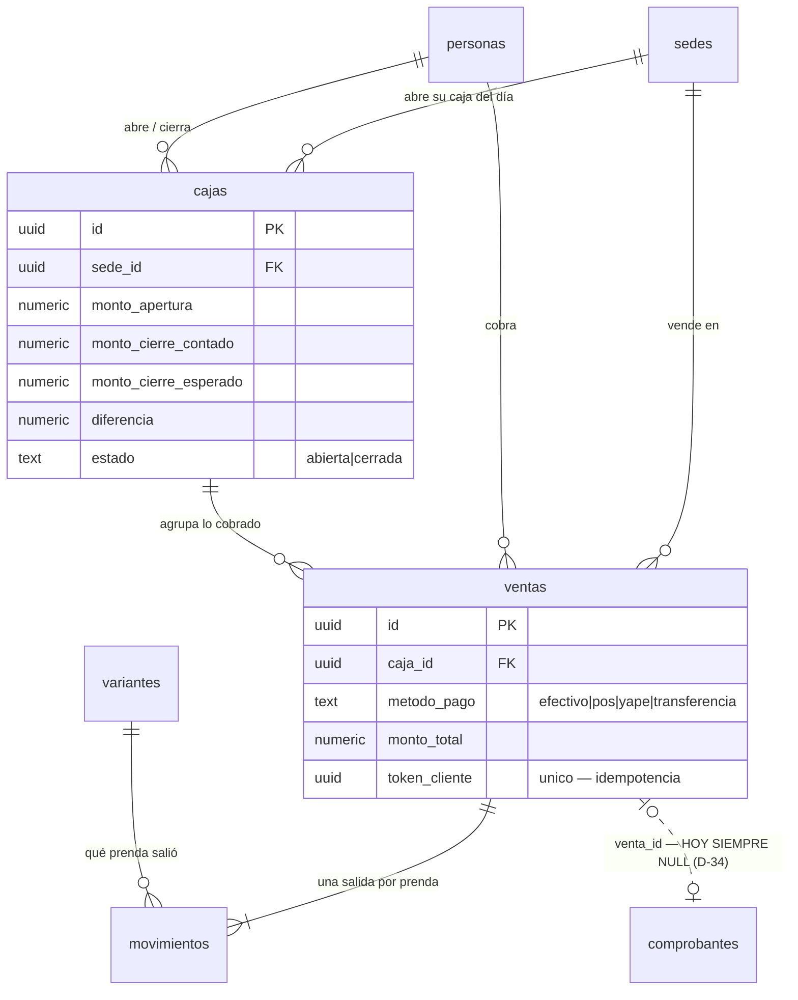
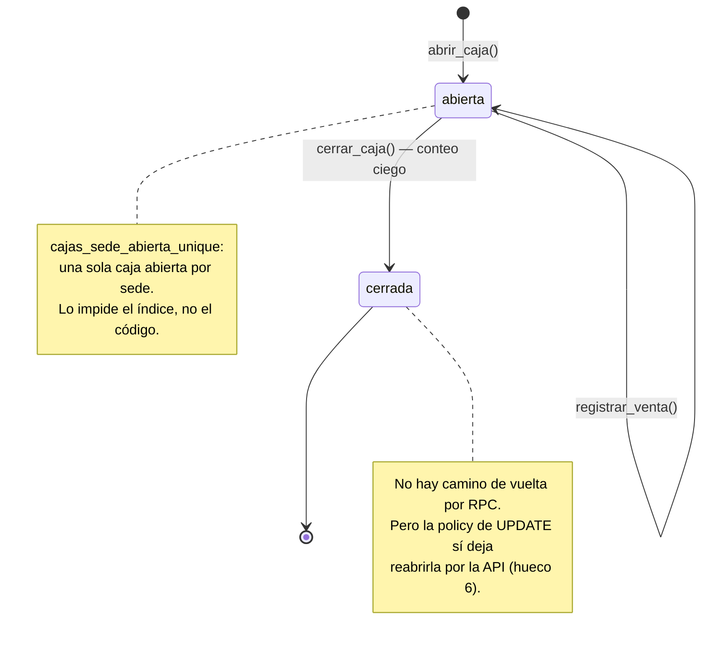
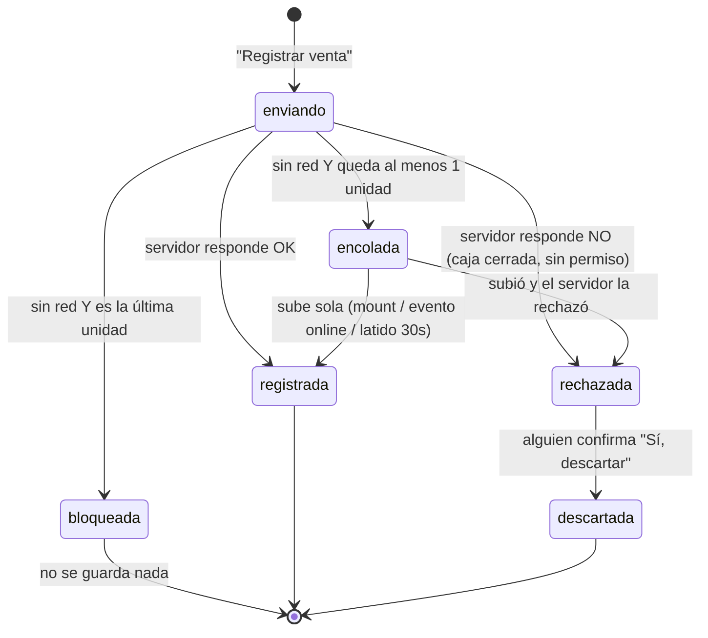

# 07 · Ventas y caja
> **Pájaro:** COLIBRÍ · **Lo lleva:** _(libre — apúntate en `07-GOBIERNO.md`)_ · **Última revisión:** 2026-09-12

## Para qué existe

Una clienta llega al mostrador con dos prendas y paga. En ese momento tienen que
pasar tres cosas a la vez o ninguna: el dinero entra al cajón, el stock de la sede
baja, y queda escrito quién cobró y cuándo. Este módulo es lo que hace que esas tres
cosas sean una sola operación y no tres anotaciones que después no cuadran.

Encima de eso vive la otra mitad del problema: el internet de las tiendas se corta a
mitad de una llamada. Este módulo es el que decide qué pasa cuando eso ocurre con la
clienta enfrente — y el que garantiza que volver a intentar no le cobre dos veces.

## El mapa

Ciclo de vida de una caja:

Ciclo de vida de una venta cuando se corta la red (ADR-0036):

## Las tablas

### `cajas` — el turno de caja de una sede: se abre con un monto, se opera, se cierra contando

**Existe en:** local y producción
**Quién escribe:** RPC `abrir_caja` (inserta) y RPC `cerrar_caja` (actualiza el cierre).
Ninguna pantalla escribe directo — pero la policy de UPDATE lo permitiría (ver hueco 6).

| Columna | Tipo | Vacío | Por defecto | Para qué sirve |
|---|---|---|---|---|
| `id` | uuid | no | `gen_random_uuid()` | Identifica el turno; es lo que cada venta guarda en `caja_id`. |
| `sede_id` | uuid | no | — | En qué tienda es este turno. FK a `sedes` en local, a `public.sedes` (Dynamic) en producción. |
| `monto_apertura` | numeric(12,2) | no | — | Con cuánto efectivo arrancó el cajón, declarado por quien abrió. |
| `abierta_por` | uuid | sí | — | Quién abrió. FK a `personas` (a `public.personas` en producción). |
| `abierta_en` | timestamptz | no | `now()` | Cuándo se abrió. Es lo que usa la bandeja de pendientes para gritar "caja de días anteriores sin cerrar". |
| `monto_cierre_contado` | numeric(12,2) | sí | — | Lo que la persona contó físicamente al cerrar. Vacío mientras la caja esté abierta. |
| `monto_cierre_esperado` | numeric(12,2) | sí | — | Lo que el servidor calculó que debería haber: apertura + ventas en efectivo de ESTA caja. |
| `diferencia` | numeric(12,2) | sí | — | Contado − esperado. Positivo sobra, negativo falta. Es el número por el que se pregunta al día siguiente. |
| `cerrada_por` | uuid | sí | — | Quién cerró. Puede ser otra persona que quien abrió. |
| `cerrada_en` | timestamptz | sí | — | Cuándo se cerró. |
| `estado` | text | no | `'abierta'` | `abierta` o `cerrada`. Es lo que el índice parcial usa para impedir dos turnos abiertos. |

**Candados** (lo que la base impide que pase):

- `cajas_pkey` — PRIMARY KEY (id).
- `cajas_estado_check` — `estado in ('abierta','cerrada')`. No existe una caja "en revisión" ni "reabierta": son dos estados y nada más.
- `cajas_sede_abierta_unique` — `UNIQUE INDEX ON cajas (sede_id) WHERE estado = 'abierta'`. **Dos cajas abiertas en la misma sede son imposibles**, no improbables. Es un índice único parcial: solo mira las filas abiertas, así que las cerradas de los días anteriores no estorban. En las dos bases.
- `cajas_sede_id_fkey`, `cajas_abierta_por_fkey`, `cajas_cerrada_por_fkey` — la caja pertenece a una sede real y la abre/cierra una persona real.
- **No hay** check sobre `monto_apertura`: un monto de apertura negativo entra. El `min={0}` del formulario (`AbrirCajaModal.tsx`) es del navegador, no de la base.
- **No hay** UPDATE ni DELETE bloqueados: ver hueco 6.

**Diferencias local vs producción:** en producción la tabla vive en el schema `retail` y sus FKs cruzan a `public.sedes` / `public.personas`, que son de Dynamic (`unificacion/05_operacion.sql:43-54`). Las policies se llaman distinto (`cajas_select`/`cajas_insert`/`cajas_update` en producción; `cajas_select_lider`/`cajas_select_propia_sede`/`cajas_insert_propia_sede`/`cajas_update_propia_sede` en local) y no hacen lo mismo: la de local reconoce al Líder por separado, la de producción resuelve todo dentro de `retail.puede_operar_sede()`. Producción tiene **5 filas** hoy (`generado/retail_filas.json`).

---

### `ventas` — una fila por cobro completo, no por prenda

**Existe en:** local y producción
**Quién escribe:** RPC `registrar_venta`, y nada más. Verificado: ninguna pantalla hace
`insert` sobre `ventas` — las ocho referencias `from("ventas")` en `apps/web` son todas de
lectura.

| Columna | Tipo | Vacío | Por defecto | Para qué sirve |
|---|---|---|---|---|
| `id` | uuid | no | `gen_random_uuid()` | Identifica el cobro. Es lo que cada `movimientos.venta_id` de esa venta guarda. |
| `sede_id` | uuid | no | — | En qué tienda se cobró. Lo copia la RPC desde la caja, no lo manda el navegador. |
| `caja_id` | uuid | no | — | A qué turno pertenece. FK a `cajas`. Es lo que hace que el cierre pueda sumar solo lo suyo. |
| `metodo_pago` | text | no | — | Cómo pagó la clienta. Solo importa de verdad para el cierre: únicamente `efectivo` mueve el cajón físico. |
| `monto_total` | numeric(12,2) | no | — | Lo cobrado. **Lo calcula la RPC sumando `monto × cantidad` de los ítems que le mandan**, no del catálogo (ver hueco 7). |
| `usuario_id` | uuid | sí | — | Quién cobró. Lo resuelve la RPC desde `auth.uid()`, no viaja desde el navegador. |
| `nota` | text | sí | — | Texto libre del mostrador. Hoy ninguna pantalla lo llena: el modal de venta no manda `p_nota`. |
| `created_at` | timestamptz | no | `now()` | Cuándo se cobró. Es la columna sobre la que se arma "Ventas de hoy" y toda la serie del panel. |
| `token_cliente` | uuid | sí | — | El identificador que el navegador genera antes de mandar el cobro. Es lo que hace que reintentar no cobre dos veces. Vacío es válido y esperado para cualquier llamada vieja. |

**Candados:**

- `ventas_pkey` — PRIMARY KEY (id).
- `ventas_metodo_pago_check` — `metodo_pago in ('efectivo','pos','yape','transferencia')`. Cerrado a propósito: el cierre de caja pregunta por `= 'efectivo'` y no puede andar adivinando si alguien escribió "Yape", "yape " o "YAPE".
- `ventas_token_cliente_key` — `UNIQUE INDEX ON ventas (token_cliente)`. **Dos ventas con el mismo token son imposibles.** Es la pieza que resuelve la carrera de verdad (dos envíos casi simultáneos con el mismo token): Postgres decide cuál INSERT gana, y el que pierde recibe `unique_violation`, que `registrar_venta` captura para devolver la venta que sí entró. Múltiples `NULL` están permitidos, que es el diseño estándar de Postgres y por eso las llamadas sin token no cambian de comportamiento.
- `ventas_caja_id_idx`, `ventas_sede_id_idx` — índices, no candados: hacen rápido el cierre de caja y el estado de resultados por sede.
- **No hay policy de UPDATE ni de DELETE** en ninguna de las dos bases. Con RLS activo y sin policy, PostgREST deniega: por la API, **una venta no se edita ni se borra**. Es la única tabla de este módulo que se comporta como el historial que debería ser.
- **No hay** check sobre `monto_total`: cero y negativo entran (hueco 8).

**Diferencias local vs producción:** producción tuvo `token_cliente` **primero** —alguien lo parchó a mano en el SQL Editor el 2026-09-10 y quedó escrito recién en `unificacion/34_idempotencia_registrar_venta.sql`— y local lo recibió después, con `migrations/0054_venta_idempotente.sql`. Es la única migración del repo que va al revés que todas las demás, y la cabecera de `0054` lo dice. Producción tiene **2 filas** hoy (`generado/retail_filas.json`): el catálogo real todavía no está cargado allá.

---

### `movimientos` (la parte que escribe este módulo) — una salida por cada prenda vendida

**Existe en:** local y producción
**Quién escribe (desde este módulo):** RPC `registrar_venta`, con `tipo = 'salida'`,
`motivo = 'venta'`, `canal = 'tienda'` y `venta_id` apuntando a la venta recién creada.

La ficha completa de la tabla vive en el módulo de inventario. Acá solo importan las
tres columnas que la venta usa y que nadie más llena igual:

| Columna | Tipo | Vacío | Por defecto | Para qué sirve |
|---|---|---|---|---|
| `venta_id` | uuid | sí | — | A qué cobro pertenece esta salida. Es el único camino para saber qué prendas se llevó una clienta. |
| `motivo` | text | sí | — | `'venta'` es el que sella `stock.ultima_venta` — el que hace que "Días sin venta" mida días sin VENDER y no días sin cualquier salida (`0011_stock_ultima_venta.sql`). |
| `monto` | numeric(12,2) | sí | — | El total de esa línea (`precio × cantidad`), no el unitario. |

**Candados que protegen la venta:**

- `movimientos_cantidad_coherente` — `cantidad <> 0 and (tipo = 'ajuste' or cantidad > 0)`. Una venta de −2 unidades, que sumaría stock en vez de restarlo, es imposible. En las dos bases.
- `stock_cantidad_no_negativa` — `check (cantidad >= 0)` sobre `stock`. Aunque todo lo demás falle, la base nunca guarda un stock negativo. En las dos bases (local desde `0010`, producción desde `unificacion/27`).
- `fn_aplicar_movimiento` bloquea la fila de stock con `for update` antes de validar: dos ventas de la última unidad en el mismo segundo se serializan, la segunda re-lee el valor ya descontado y se rechaza con mensaje amable en vez de dejar el stock en −1.

**Diferencias local vs producción:**

- `movimientos_venta_id_fkey` existe **solo en local** (`0010_stock_concurrencia.sql:19`). Ningún archivo de `supabase/unificacion/` la crea. En producción, la línea de detalle de una venta puede apuntar a una venta que no existe y nadie se entera.
- `movimientos_venta_id_idx` existe **solo en local** (`0001_init.sql:95`). `unificacion/05_operacion.sql` crea `movimientos_variante_sede_idx` y `movimientos_created_at_idx`, no ese. En producción, preguntar "qué prendas llevó esta venta" recorre la tabla entera.

---

### `comprobantes` (solo la columna que este módulo debería llenar y no llena)

**Existe en:** local y producción
**Quién escribe:** RPC `emitir_comprobante` / `emitir_nota`. La ficha completa vive en
el módulo de facturación.

| Columna | Tipo | Vacío | Por defecto | Para qué sirve |
|---|---|---|---|---|
| `venta_id` | uuid | sí | — | A qué venta ampara esta boleta. **Hoy siempre vacío.** |

`0032_comprobantes.sql:26` la declara `venta_id uuid references ventas (id)` — nullable.
`emitir_comprobante` acepta `p_venta_id uuid default null`
(`0034_facturacion_completa.sql:70`, `0037_comprobantes_items.sql:46`,
`unificacion/17_facturacion_completa.sql:130`). Y la única pantalla que la llama,
`ComprobantesPanel.tsx:240`, **no manda ese parámetro**: pasa sede, tipo, subtotal, IGV,
total y datos de la clienta, nada más. Resultado: cada boleta nace suelta. Ver hueco 1
y la decisión D-34.

## Cómo se escribe (la única puerta)

Las tres RPC son `security definer` con `search_path` fijo. Ninguna pantalla escribe
directo a `cajas` ni a `ventas`.

### `abrir_caja(p_sede_id uuid, p_monto_apertura numeric) → uuid`

- **Local:** `0012_rpc_valida_sede.sql:74`. **Producción:** `unificacion/07_funciones_operacion.sql:80`.
- **Candado de permiso:** sede. Local: `if not fn_puede_operar_sede(p_sede_id)` (línea 84). Producción: `if retail.puede_operar_sede(p_sede_id) is not true` (línea 92). **No son lo mismo** — ver hueco 9.
- **Idempotente:** no, y a propósito. Un segundo `abrir_caja` sobre una sede que ya tiene caja abierta falla con «Ya hay una caja abierta en esta sede — ciérrala antes de abrir otra». No devuelve la caja existente: grita. El índice `cajas_sede_abierta_unique` lo respalda aunque el `if` fallara.
- Quién la llama: `AbrirCajaModal.tsx` → `supabase.rpc("abrir_caja", { p_sede_id, p_monto_apertura })`.

### `registrar_venta(p_caja_id uuid, p_metodo_pago text, p_items jsonb, p_nota text default null, p_token uuid default null) → uuid`

- **Local:** `0054_venta_idempotente.sql:87`. **Producción:** `unificacion/37_registrar_venta_p_nota.sql`.
- `p_items` es `[{ "variante_id": uuid, "cantidad": int, "monto": numeric }, …]`, donde `monto` es el **precio unitario**.
- **Candado de permiso:** sede, resuelta desde la caja (no desde un parámetro). Las dos bases usan `is not true` (`0054:115`, `unificacion/37:69`), que es la forma correcta: con `not NULL` el `raise` no dispararía y el candado se abriría solo.
- **Orden de las validaciones, que importa:** existe la caja → permiso de sede → la caja está abierta → el carrito no está vacío → recién ahí se mira el token. Un token nunca es un pase que se salte un permiso; está decidido así y está escrito en `unificacion/34`, ronda 1.
- **Idempotente por `p_token`**, en dos ramas que hacen lo mismo:
  1. Antes de insertar, busca una venta con ese token. Si existe y coinciden caja, método de pago y monto total, **devuelve su id y no escribe nada** — ese es el reintento honesto.
  2. Si el token existe pero los datos NO coinciden, **rechaza**: «Este token ya se uso para una venta con otros datos…». Es el caso de quien agrega una prenda y vuelve a darle a Registrar creyendo que la primera no entró. La primera sí entró, y lo correcto es frenar, no cobrar dos veces. `lib/error-escritura.ts:130` traduce ese texto a idioma CAYLA.
  3. `exception when unique_violation` repite la misma comparación para la carrera real (dos envíos simultáneos con el mismo token). Las dos ramas usan `is distinct from`, no `<>`, para que un campo nulo nunca deje pasar una comparación sin resolver.
- **Un `p_token` nulo se comporta exactamente como antes de que existiera la idempotencia.**
- **Se rompe si** algún día se agrega otra restricción única a `ventas`: el `exception when unique_violation` asume que la única causa posible es el índice del token.
- Quién la llama: `RegistrarVentaModal.tsx:235` (la venta del mostrador, con `token.current` generado en `crypto.randomUUID()` y guardado en un `useRef` que **no se regenera entre reintentos** — ADR-0033) y `CajaPanel.tsx:93` (la cola offline, que reenvía cada venta con el mismo token con el que se encoló).

### `cerrar_caja(p_caja_id uuid, p_monto_contado numeric) → table(monto_esperado, monto_contado, diferencia)`

- **Local:** `0012_rpc_valida_sede.sql:163`. **Producción:** `unificacion/07_funciones_operacion.sql:106`.
- **Candado de permiso:** sede, resuelta desde la caja. Local: `if not …` (línea 178). Producción: `is not true` (línea 117). Misma diferencia que `abrir_caja`.
- **Conteo ciego:** quien cierra manda el contado sin haber visto el esperado; el esperado se calcula acá y se revela recién en la respuesta. La cuenta es `monto_apertura + Σ ventas de esta caja con metodo_pago = 'efectivo'` (`0007_finanzas.sql:188`). POS, Yape y transferencia no tocan el cajón físico y no entran.
- **Idempotente:** no. Un segundo `cerrar_caja` falla con «Esta caja ya está cerrada». No hay RPC para reabrir.
- Quién la llama: `CerrarCajaModal.tsx`, que además muestra —antes de que la persona cuente— cuánto efectivo hay atrapado en la cola offline sin subir (`totalEfectivoEncolado`, `lib/ventas-offline.ts:161`), porque ese billete SÍ está en el cajón y el esperado todavía no lo sabe.

### La venta sin red (ADR-0036) — dónde vive y qué decide sola

No es una RPC: es una cola en el navegador, en `localStorage`, bajo la clave
`cayla:cola-ventas` (`lib/ventas-offline.ts:55`). Indexada **por sede, no por caja**,
para que una venta que quedó pendiente con la caja de ayer siga intentando subir hoy.

- **Detecta el corte por la forma del error**, no por `navigator.onLine`: ese flag no ve un servidor caído con wifi arriba (`esFalloDeRed`, `lib/error-escritura.ts:151`).
- **El umbral de D-49/ADR-0013 §C se aplica ANTES de encolar:** `stockAqui - cantidad >= 1` (`lib/ventas-offline.ts:150`). Con cantidad 1 eso significa **2 o más unidades en la sede**. Si no pasa, se bloquea y no se guarda nada: sin red no hay forma de coordinarse con otra sede, y llevarse la última prenda es justo lo que puede sobrevender.
- **Descuenta en pantalla lo que la cola ya comprometió** (`conStockComprometidoDescontado`), o dos ventas offline seguidas de la misma prenda pasarían el umbral las dos.
- **Sube sola** con tres disparadores: al montar, al evento `online`, y con un latido de 30 s (`CajaPanel.tsx:49`). Cada venta sube con su `p_token`, así que si el servidor ya la había recibido y solo se cortó la respuesta, `registrar_venta` la devuelve sin duplicarla.
- **Un rechazo real del servidor no se descarta solo.** Se queda en la cola con su motivo traducido y un botón "Descartar" de dos pasos, que dice explícitamente que no registra la venta ni corrige el stock.

**Superficie de riesgo:** nadie escribe directo a estas tablas desde la app, pero las
policies lo permitirían. `cajas` acepta UPDATE por la API (hueco 6) y `ventas` acepta
INSERT por la API — un `POST /rest/v1/ventas` crea una venta sin ningún movimiento
detrás, con el stock intacto. En las dos bases.

## Quién ve y quién toca

Los cuatro niveles de D-12 **todavía no existen en la base**. Hoy hay dos:

- **Admin** — `personas.rol = 'lider'` en local; `fn_rol_actual() = 'admin'` en producción.
- **Integrante** — `personas.rol = 'integrante'` en local; cualquier rol que no sea `admin` en producción.
- **Líder de equipo** — no tiene nivel propio. En producción existe `fn_rol_actual() = 'supervisor_sede'` y la función `retail.es_supervisor()`, pero **cero policies la usan** (verificado en `generado/retail_policies.json`): un supervisor de sede se comporta exactamente igual que un Integrante.
- **Solo lectura** — no existe. El contador externo, si entra, entra como Integrante o como Admin.

| Operación | Admin | Líder de equipo | Integrante | Solo lectura |
|---|---|---|---|---|
| Abrir caja de su sede | sí | sí (como Integrante) | sí | — (no existe) |
| Abrir caja de otra sede | sí | no | no | — |
| Registrar venta en su sede | sí | sí | sí | — |
| Cerrar caja de su sede | sí | sí | **sí** ⚠️ | — |
| Ver las ventas de su sede | sí | sí | sí | — |
| Ver las ventas de todas las sedes | sí | no | no | — |
| Editar o borrar una venta | **no** | no | no | — |
| Editar la caja sin pasar por `cerrar_caja` | sí | sí | **sí** ⚠️ | — |

⚠️ **D-13 dice que cerrar la caja del día es de Líder de equipo, y la base no lo
distingue:** cualquier Integrante de la sede puede llamar `cerrar_caja` — las dos
versiones solo preguntan por sede (`fn_puede_operar_sede` / `retail.puede_operar_sede`),
nunca por rol. Y la policy de UPDATE sobre `cajas` le permite además reescribir el
cierre a mano.

Base: `0007_finanzas.sql:62-74` (local) y `unificacion/05_operacion.sql:56-62` y `:78-81`
(producción), leídas contra el volcado real de policies en `generado/retail_policies.json`.

## Qué se rompe sin esto

Sin este módulo la tienda no cobra: `registrar_venta` es la única puerta por la que
una prenda sale por venta, así que el stock de las tres tiendas se congela en el último
número bueno y empieza a mentir desde la primera clienta.

Se apaga el cuadre de efectivo: sin `cerrar_caja` nadie sabe si al cajón de Trujillo le
faltan S/40, y la diferencia deja de existir como número al que alguien tenga que
responder al día siguiente.

Se apagan dos de los tres números que Felipe mira primero (D-52): "Vendido por sede
(hoy y mes)" sale de `ventas` (`lib/panel.ts:58`) y "Efectivo y caja" de `ventas` +
`cajas` (`lib/finanzas-nucleo.ts:128`). El estado de resultados por sede (D-30) también
se queda sin la línea de arriba (`lib/finanzas.ts:178`).

Y se apaga la inteligencia de inventario: `stock.ultima_venta` solo se sella con
`motivo = 'venta'`, así que "Días sin venta" —lo que dice qué se está quedando (D-52)—
se queda clavado para siempre.

## Huecos conocidos

1. **La venta y la boleta no se conocen.** `comprobantes.venta_id` es nullable
   (`0032_comprobantes.sql:26`) y la única pantalla que emite,
   `ComprobantesPanel.tsx:240`, no manda `p_venta_id` — así que hoy **siempre es NULL**.
   Consecuencia en la tienda: no hay devoluciones posibles (D-43 depende de esto), nadie
   puede decir qué prendas ampara una boleta, y el IGV del comprobante se calcula
   dividiendo entre 1.18 un total tipeado a mano (`ComprobantesPanel.tsx:238`) en vez de
   desagregarlo de las líneas reales de la venta. **D-34 decide unirlas.**
   *Promesa incumplida*, `ComprobantesPanel.tsx:237`: «la desagregación exacta por línea
   **queda para cuando esto se conecte a `ventas`** (ver nota al pie)».

2. **La caja SÍ se congela, y D-49 dice que no se congela nunca.** La cola offline
   protege una venta que se corta a mitad de un envío con la pantalla **ya cargada**. Una
   recarga completa sin servidor no arranca.
   *Promesa incumplida*, ADR-0036: «una recarga completa de la pantalla MIENTRAS el
   servidor está caído no funciona — el server component también habla con Supabase a
   través de Kong, así que sin servidor la navegación entera falla con la pantalla de
   error genérica ("El sistema no pudo arrancar"), no con la cola».
   Consecuencia: si alguien recarga o entra desde otra pestaña con el internet caído, no
   vende nada — ni encolado.

3. **Abrir y cerrar caja no funcionan sin red.** `abrir_caja` y `cerrar_caja` no tienen
   cola ni equivalente offline, y `RegistrarVentaModal` necesita un `cajaId` de una caja
   **abierta** para siquiera encolar (`CajaPanel.tsx:267-275`).
   *Promesa incumplida*, ADR-0036 §"Lo que NO entra en este ADR": «**Caja offline
   (abrir/cerrar)** — abrir dos cajas de la misma sede sin coordinación es otro estado
   imposible (principio 2) que este ADR no resuelve».
   Consecuencia: si el internet se cae a las 9:55 y la caja todavía no se abrió, esa
   tienda no vende en todo el día, ni offline.

4. **El "conteo ciego" es una convención de pantalla, no un candado.** `cerrar_caja`
   calcula el esperado en el servidor, pero la policy `ventas_select_propia_sede`
   (`0007_finanzas.sql:70`) deja a cualquier Integrante leer las ventas de su sede: sumar
   el efectivo antes de contar es un `GET` de una línea.
   *Promesa incumplida*, `0007_finanzas.sql:164`: «Conteo ciego: el llamador manda
   p_monto_contado **sin haber visto el esperado**».
   Consecuencia: el control interno que justifica todo el mecanismo se apoya en que nadie
   abra la consola del navegador.

5. **El esperado del cierre ignora todo el efectivo que SALIÓ del cajón.** La cuenta es
   `monto_apertura + Σ ventas en efectivo` (`0007_finanzas.sql:188`,
   `unificacion/07_funciones_operacion.sql:122`). No resta los gastos pagados en efectivo
   (`gastos.metodo_pago = 'efectivo'`, columna agregada en `0013_finanzas_nucleo.sql:35`),
   ni los depósitos al banco (`depositos_bancarios`), ni los ajustes de efectivo
   (`ajustes_efectivo`) — tres tablas que existen, y que la fórmula correcta ya usa en otra
   pantalla: `getCuadreEfectivo` (`lib/finanzas-nucleo.ts:121-134`) suma exactamente esas
   cinco fuentes. La RPC del cierre no.
   Consecuencia concreta: la sede paga S/50 de movilidad con plata del cajón, cierra, y el
   sistema reporta un faltante de S/50 que se lee como que alguien se llevó la plata.

6. **La caja se puede reescribir por la API sin pasar por `cerrar_caja`.** La policy
   `cajas_update_propia_sede` (`0007_finanzas.sql:66`) y su gemela de producción
   `cajas_update` (`unificacion/05_operacion.sql:62`) usan solo `using` y, sin `with
   check`, Postgres reutiliza esa misma expresión para validar la fila nueva. Cualquiera
   de la sede puede hacer un `PATCH /rest/v1/cajas` y reescribir `monto_cierre_contado`,
   `diferencia` o volver `estado` a `'abierta'`.
   Consecuencia: la diferencia de caja del día se borra sin dejar rastro, y el único
   número que hace responsable a alguien por el efectivo deja de ser confiable.

7. **El precio lo pone el navegador y el descuento no se registra.** `registrar_venta`
   suma `monto × cantidad` de lo que le mandan y nunca mira `variantes.precio`. El modal
   deja editar el precio unitario a mano (`RegistrarVentaModal.tsx:405`, campo «Precio de
   …»). No se guarda precio de lista, ni precio cobrado como dos cosas distintas, ni
   motivo.
   Consecuencia: nadie puede medir cuánto se regala en descuentos por sede, ni distinguir
   un descuento autorizado de un cero de más al tipear. **Es exactamente D-44**, que ya
   dejó el diseño propuesto: precio de lista, precio cobrado, motivo.

8. **Una venta de S/0 o negativa entra.** `ventas.monto_total` no tiene ningún `check`
   (verificado en `generado/retail_constraints.json`: solo `ventas_pkey` y
   `ventas_metodo_pago_check`). `movimientos_cantidad_coherente` sí impide cantidades
   ≤ 0, pero el `monto` no está cubierto.
   Consecuencia: una venta de S/−200 baja el esperado del cierre y fabrica un sobrante
   que cuadra con un faltante de caja real.

9. **En local, `abrir_caja` y `cerrar_caja` todavía tienen el agujero del NULL.** Local
   usa `if not fn_puede_operar_sede(…)` (`0012_rpc_valida_sede.sql:84` y `:178`);
   producción usa `is not true` (`unificacion/07_funciones_operacion.sql:92` y `:117`).
   Con una sesión sin fila en `personas`, `fn_puede_operar_sede` devuelve NULL, `not NULL`
   no es true, el `raise` no dispara y **el candado se abre solo**.
   *Promesa incumplida*, ADR-0033 §Consecuencias: «**El resto de las funciones locales no
   se revisó**: queda en el BACKLOG». `0054` cerró solo `registrar_venta`.
   Consecuencia: cualquier base levantada desde `supabase/migrations/` —el entorno
   intermedio de D-18, entre otros— deja abrir y cerrar cajas de cualquier sede sin rol.

10. **`retail.es_supervisor()` está MUERTA.** Definida en `unificacion/03_candados.sql:66`
    y reescrita en `unificacion/36_candados_no_null.sql:47`. Cero policies la usan.
    **Sigue viva** porque `36` la endurece junto a las otras dos y borrarla rompería ese
    archivo idempotente. Es el hueco exacto donde debería entrar el nivel "Líder de
    equipo" de D-12; hoy `supervisor_sede` no manda más que un Integrante.

11. **Ni una sola prueba automatizada toca `registrar_venta`, `abrir_caja` o
    `cerrar_caja`.** Hay 11 archivos `*.test.ts` en `apps/web/lib/` —incluido
    `ventas-offline.test.ts`, que prueba la aritmética pura de la cola— y **ningún test de
    SQL** en todo el repo. Lo que ADR-0033 llama "cómo se verificó" fue a mano, dentro de
    una transacción con `rollback`, una sola vez.
    Consecuencia: la idempotencia, el candado de sede y el cuadre del cierre se rompen en
    silencio en el próximo `create or replace`. **D-25 pide esas pruebas antes del censo.**

12. **La caja no tiene día.** `cajas` no tiene columna de fecha de negocio ni cierre
    automático: una caja abierta el lunes sigue abierta el viernes y se lleva las ventas de
    toda la semana. Lo único que existe es un aviso en la bandeja de pendientes
    (`lib/pendientes.ts:135`, «cajas de días anteriores sin cerrar»).
    Consecuencia: "Efectivo y caja" (D-52) deja de ser un número diario, y la diferencia
    del cierre se vuelve incomparable entre sedes.

13. **En producción, `movimientos.venta_id` no tiene llave foránea ni índice.** Local
    tiene las dos (`0001_init.sql:95`, `0010_stock_concurrencia.sql:19`); ningún archivo de
    `supabase/unificacion/` las crea.
    Consecuencia: en la base que usan las tiendas, una línea de venta puede apuntar a una
    venta inexistente sin que nada lo impida, y reconstruir "qué llevó esta clienta" hace
    un scan completo de `movimientos`.

14. **Una venta descartada de la cola offline no deja ningún rastro en el servidor.**
    ADR-0036, addendum 2: se descartó el registro de auditoría porque «no hay ninguna fila
    del lado del servidor que recuperar o marcar». La confirmación avisa que hay que
    anotarlo a mano.
    Consecuencia: plata ya cobrada que solo existe en el `localStorage` de un navegador. Si
    ese equipo se cambia, se limpia o se abre en modo privado, la venta desaparece sin
    dejar dónde buscarla.

15. **`0007_finanzas.sql` promete un ADR que nunca se escribió.**
    *Promesa incumplida*, `0007_finanzas.sql:2`: «Ver `docs/adr/` para el porqué de cada
    decisión (apertura/cierre con conteo ciego, mermas como COGS y no como gasto
    operativo, categorías de gasto estructuradas)». En `docs/adr/` hay 40 archivos y
    **ninguno** habla de caja ni de conteo ciego. `docs/ARQUITECTURA.md:292` repite la
    afirmación sin fuente.
    Consecuencia: la decisión de control interno más delicada del módulo —que quien cuenta
    no vea el esperado— no tiene dónde discutirse ni revisarse.

## Decisiones que lo gobiernan

- **D-34** — Boleta y venta se unen: cada venta queda pegada a su comprobante. Es el hueco 1, y el requisito para que las devoluciones funcionen.
- **D-49** — La caja sin internet no se congela nunca. Hoy se cumple a medias: ver huecos 2 y 3.
- **D-44** — Los descuentos hoy no se registran: hueco + diseño propuesto (precio de lista, precio cobrado, motivo). Es el hueco 7.
- **D-43** — Las devoluciones de clientas no existen; se marcan como hueco y se deja diseñado cómo modelarlas, ligadas a su boleta. Bloqueadas por D-34.
- **D-13** — Cerrar la caja del día es atribución de Líder de equipo. La base no lo distingue: cualquier Integrante de la sede puede cerrar.
- **D-12** — Cuatro niveles de permiso, un solo vocabulario. En este módulo solo existen dos; "Líder de equipo" y "Solo lectura" no tienen implementación.
- **D-52** — Los tres números que Felipe mira primero: dos de los tres (vendido por sede, efectivo y caja) salen enteros de este módulo.
- **D-16** — Cada tabla lleva marca de en qué base existe. `cajas`, `ventas`, `movimientos` y `comprobantes` están en las dos; las diferencias reales están en las fichas.
- **D-25** — Pruebas sobre el núcleo de stock antes del censo. Hoy no hay ninguna sobre estas tres RPC (hueco 11).
- **D-07** — Lo muerto se marca: `retail.es_supervisor()` (hueco 10).
- **ADR-0033** — El reintento no cobra dos veces: el token lo genera el navegador, se crea en el primer envío y **no se regenera** entre reintentos. También explica por qué el mensaje de "se cayó la red" dejó de mentir solo en la venta.
- **ADR-0032** — El backend de esa idempotencia: la columna, el índice único y por qué las dos ramas (`select` previo y `unique_violation`) comparan lo mismo.
- **ADR-0036** — La cola de ventas offline: el umbral, el overlay de stock comprometido, la cola por sede y el botón "Descartar".
- **ADR-0013 §C** — La decisión de negocio de Felipe sobre vender sin internet, con el umbral fijado el 2026-09-11: 2 o más unidades en la sede.
- **ADR-0026 / ADR-0009** — Una firma nueva no reemplaza a la vieja: por eso `0054` crea la de 5 argumentos, comprueba que existe, y recién entonces borra la de 4.
- **ADR-0022** — Los errores de escritura hablan idioma CAYLA: el rechazo del token reusado se traduce en `lib/error-escritura.ts`, no en la RPC.
- **ADR-0018** — Lo que el diseño local-first NO resuelve, y por qué la idempotencia era la condición previa a cualquier cola.
