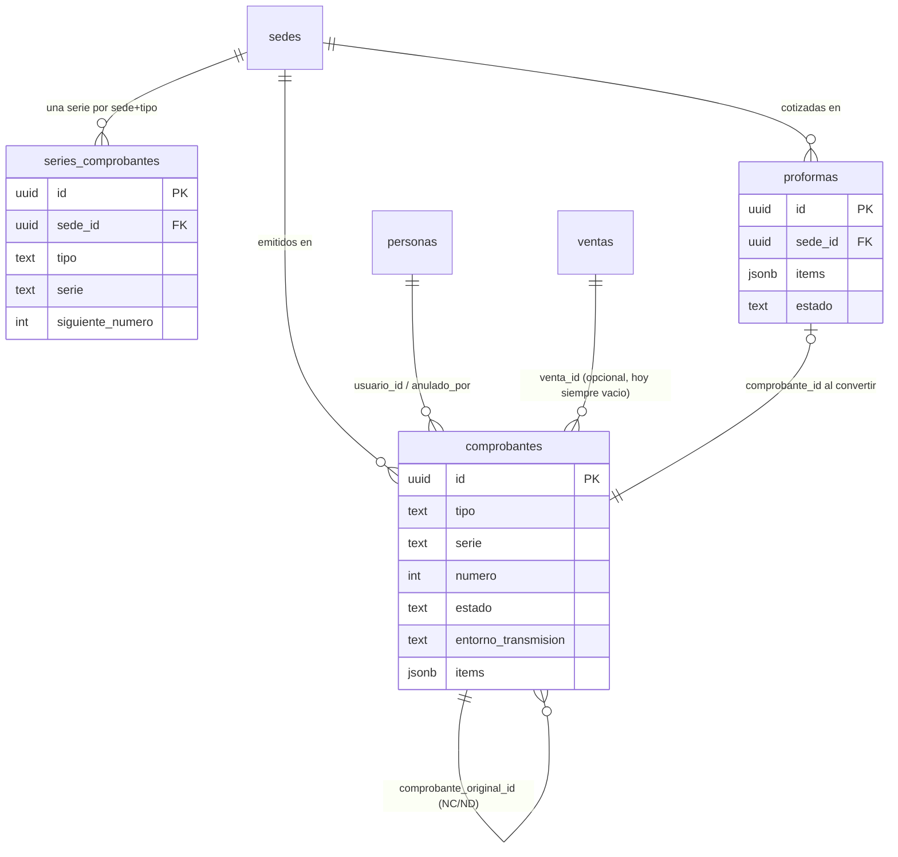
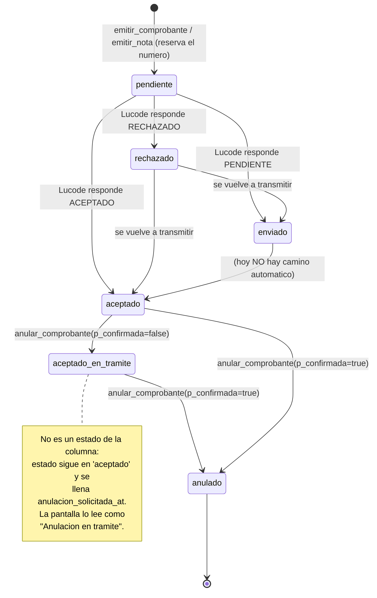
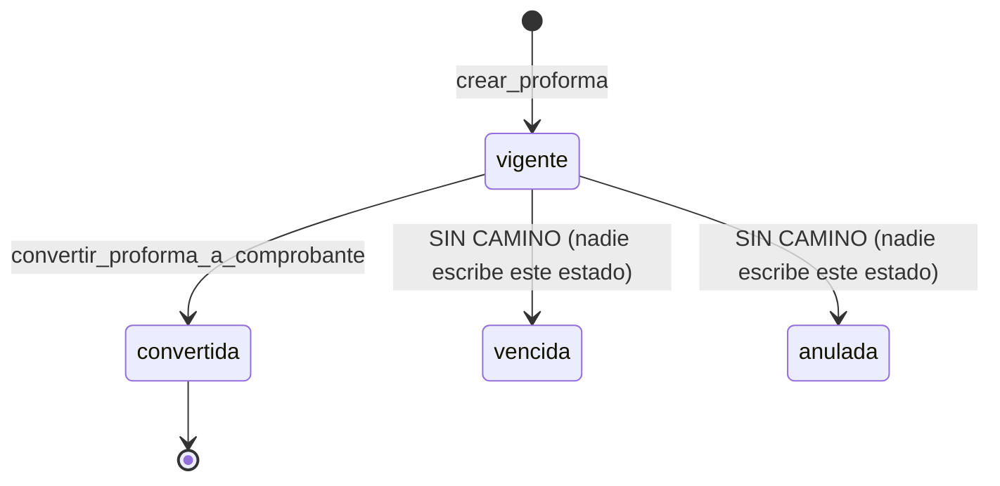

# 08 · Facturación electrónica SUNAT
> **Pájaro:** CUERVO · **Lo lleva:** _(libre — apúntate en `07-GOBIERNO.md`)_ · **Última revisión:** 2026-09-18

**Auditoría de flujo completo 2026-09-17** (Felipe preguntó qué le falta al módulo):
huecos 3 y 6 de abajo ya estaban resueltos y quedaron marcados; huecos 14-16 son
nuevos, encontrados en esa auditoría. Detalle completo en BACKLOG de esa fecha.
Ojo: este doc todavía usa `sede_id`/`fn_puede_operar_sede` en varios ejemplos —
el código real renombró todo a `ubicacion_id`/`fn_puede_operar_ubicacion` en
`0010_facturacion.sql` (12-sep, mismo día que este doc). La lógica descrita sigue
siendo correcta; el vocabulario de columnas no.

## Para qué existe

Cada venta de CAYLA necesita un documento legal ante SUNAT, y ese documento lleva un
número que no se puede repetir ni saltar. Ese número es responsabilidad de CAYLA, no
del proveedor que transmite: por eso el módulo primero **reserva** el correlativo en
la base de datos y recién después intenta mandarlo a SUNAT por Lucode (el PSE). Si
SUNAT o Lucode están caídos, el comprobante queda "pendiente" con su número guardado
y se reintenta; la clienta no espera en el mostrador a que responda un servidor ajeno.
El módulo cubre además las notas de crédito/débito, las proformas (que NO son
comprobante de pago) y la anulación de lo ya emitido.

## El mapa

Ciclo de vida de un comprobante:

Ciclo de vida de una proforma:

## Las tablas

### `series_comprobantes` — el contador de correlativos: una fila por sede y tipo de documento

**Existe en:** local y producción
**Quién escribe:** `registrar_serie_comprobante` (crea/actualiza) y
`fn_reservar_numero_serie` (incrementa el correlativo). Ninguna pantalla escribe directo.

| Columna | Tipo | Vacío | Por defecto | Para qué sirve |
|---|---|---|---|---|
| `id` | `uuid` | no | `gen_random_uuid()` | Llave de la fila. |
| `sede_id` | `uuid` | no | — | Qué tienda usa esta serie. FK a `sedes(id)`; en producción apunta a `public.sedes`, en local a `sedes` del mismo schema. |
| `tipo` | `text` | no | — | `boleta`, `factura`, `nota_credito` o `nota_debito`. Cada tipo lleva su propio contador. |
| `serie` | `text` | no | — | El prefijo del documento (`B004`, `F001`). Lo define CAYLA, no SUNAT; se guarda siempre en mayúsculas porque la RPC hace `upper()`. |
| `siguiente_numero` | `integer` | no | `1` | El correlativo que se va a entregar en la próxima emisión. Es lo que la pantalla muestra como "Se va a reservar el número". |

**Candados** (lo que la base impide que pase):
- `series_comprobantes_pkey` — una fila no se duplica por id.
- `unique (sede_id, tipo)` — una sede no puede tener dos series vivas del mismo tipo, así que nunca hay duda de qué contador toca.
- `series_comprobantes_siguiente_numero_check` (`siguiente_numero > 0`) — no existe el correlativo cero ni negativo.
- `series_comprobantes_tipo_check` — solo los cuatro tipos legales. Este check se tuvo que rehacer aparte del de `comprobantes` (`0034_facturacion_completa.sql`) porque son dos constraints distintas que se desincronizan en silencio.
- RLS activa, con **una sola policy y es de SELECT**: `series_comprobantes_select` (`fn_es_lider() or fn_puede_operar_sede(sede_id)`). No hay policy de insert/update/delete, así que la base rechaza cualquier escritura que no venga de una RPC `security definer`.

**Diferencias local vs producción:** en local el `check` de `tipo` nació con tres valores (`0032_comprobantes.sql`) y se amplió a cuatro en `0034`; en producción nació ya con los cuatro (`unificacion/17_facturacion_completa.sql`). Estado final idéntico. En producción la tabla vive en el schema `retail` y la FK apunta a `public.sedes`.

---

### `comprobantes` — el documento legal: boleta, factura, nota de crédito y nota de débito, todos en la misma tabla

**Existe en:** local y producción
**Quién escribe:** `emitir_comprobante`, `emitir_nota`, `convertir_proforma_a_comprobante`
(insertan), `actualizar_transmision_comprobante` (estado de transmisión) y
`anular_comprobante` (baja). Ninguna pantalla escribe directo.

| Columna | Tipo | Vacío | Por defecto | Para qué sirve |
|---|---|---|---|---|
| `id` | `uuid` | no | `gen_random_uuid()` | Llave de la fila. |
| `venta_id` | `uuid` | sí | — | La venta que este comprobante documenta. **Hoy siempre llega vacío:** ninguna pantalla lo manda (ver hueco 3). |
| `sede_id` | `uuid` | no | — | La tienda que emitió. Decide el permiso y el correlativo. |
| `tipo` | `text` | no | — | `boleta`, `factura`, `nota_credito`, `nota_debito`. |
| `serie` | `text` | no | — | Copia de `series_comprobantes.serie` en el momento de emitir: si mañana la sede cambia de serie, los documentos viejos no se reescriben. |
| `numero` | `integer` | no | — | El correlativo que se llevó esta emisión. Irreversible ante SUNAT una vez transmitido. |
| `cliente_tipo_doc` | `text` | no | `'sin_documento'` | `dni`, `ruc` o `sin_documento`. En una boleta sin documento se transmite el DNI comodín `99999999`. |
| `cliente_num_doc` | `text` | sí | — | El DNI o RUC de la clienta. |
| `cliente_nombre` | `text` | sí | — | Nombre o razón social. Si va vacío, Lucode recibe `CLIENTE VARIOS`. |
| `moneda` | `text` | no | `'PEN'` | Moneda del documento. Sin check: acepta cualquier texto, aunque el conector solo entiende `PEN` y `USD`. |
| `subtotal` | `numeric(12,2)` | no | `0` | Valor de venta sin IGV. |
| `igv` | `numeric(12,2)` | no | `0` | El IGV del documento. Hoy se calcula en el navegador (ver hueco 2). |
| `total` | `numeric(12,2)` | no | `0` (pero el check exige > 0) | Lo que paga la clienta, IGV incluido. |
| `estado` | `text` | no | `'pendiente'` | `pendiente` (reservado, no transmitido), `enviado`, `aceptado`, `rechazado`, `anulado`. |
| `motivo_rechazo` | `text` | sí | — | El texto con que SUNAT/Lucode rechazó. Solo se escribe cuando el estado pasa a `rechazado`. |
| `respuesta_sunat` | `jsonb` | sí | — | La respuesta cruda de Lucode (hash, XML, CDR, PDF, mensaje). Es la prueba de lo que pasó. |
| `usuario_id` | `uuid` | sí | — | Quién emitió. FK a `personas(id)`. Queda vacío si quien llama no tiene fila en `personas`. |
| `created_at` | `timestamptz` | no | `now()` | Cuándo se reservó el número. Es el campo por el que filtra el mes la pantalla. |
| `enviado_at` | `timestamptz` | sí | — | Primer intento de transmisión. Se escribe una sola vez (`coalesce(enviado_at, now())`), así que un reintento no pisa la fecha original. |
| `comprobante_original_id` | `uuid` | sí | — | Solo NC/ND: qué comprobante corrige. FK a la misma tabla. |
| `motivo` | `text` | sí | — | Solo NC/ND. Declarada como **texto libre**, pero el conector la transmite como **código del Catálogo 09/10 de SUNAT** (ver hueco 1). |
| `items` | `jsonb` | sí | — | El desglose de línea que Lucode exige (`descripcion`, `cantidad`, `precio_unitario`). Si no se manda, la RPC arma un ítem genérico "Venta de mercadería". |
| `entorno_transmision` | `text` | sí | — | `sandbox` o `produccion`. Es lo que impide que un "Aceptado" de prueba se confunda con uno real (ADR-0015). |
| `motivo_anulacion` | `text` | sí | — | Por qué se dio de baja. Obligatorio para poder quedar `anulado`. |
| `anulacion_solicitada_at` | `timestamptz` | sí | — | Cuándo se pidió la baja. Con esto lleno y `estado='aceptado'`, la baja está en trámite. |
| `anulado_at` | `timestamptz` | sí | — | Cuándo SUNAT la confirmó. |
| `respuesta_anulacion` | `jsonb` | sí | — | La respuesta cruda del proveedor a la baja. |
| `anulado_por` | `uuid` | sí | — | Quién pidió la baja. FK a `personas(id)`. |

**Candados** (lo que la base impide que pase):
- `unique (tipo, serie, numero)` — **el candado más importante del módulo**: es imposible que existan dos boletas B004-000007. Si dos personas emiten al mismo tiempo, una de las dos revienta antes que SUNAT vea un duplicado.
- `comprobantes_tipo_check` — solo los cuatro tipos legales.
- `comprobantes_total_check` (`total > 0`) — no existe un comprobante de S/0.
- `comprobantes_cliente_tipo_doc_check` — solo `dni`/`ruc`/`sin_documento`.
- `comprobantes_factura_requiere_ruc` — una factura sin RUC del cliente no puede existir en la base, no solo en el formulario.
- `comprobantes_nota_requiere_original` — una NC/ND sin comprobante original y sin motivo no puede existir.
- `comprobantes_transmitido_tiene_entorno` (`estado = 'pendiente' or entorno_transmision is not null`) — un comprobante que salió de "pendiente" siempre sabe si fue prueba o real. **Nació `not valid`**: las filas viejas quedan marcadas como ambiente desconocido en vez de rellenarse con una mentira.
- `comprobantes_anulado_tiene_motivo` (`estado <> 'anulado' or motivo_anulacion is not null`) — un documento dado de baja sin razón no existe. También nació `not valid`.
- `comprobantes_entorno_transmision_check` — solo `sandbox` o `produccion`.
- Trigger `comprobantes_valida_nota_referencia` (`before insert`, ejecuta `fn_valida_nota_referencia_aceptada`) — una nota de crédito/débito solo puede nacer sobre un comprobante en estado `aceptado`. Vive en un trigger y no en un `check` porque un `check` no puede leer otra fila.
- Índices: `comprobantes_sede_id_idx`, `comprobantes_venta_id_idx`, `comprobantes_estado_idx`.
- RLS activa con **una sola policy y es de SELECT**: `comprobantes_select` (`fn_es_lider() or fn_puede_operar_sede(sede_id)`). Sin policies de insert/update/delete: la base rechaza cualquier escritura que no pase por una RPC.

**Diferencias local vs producción:**
- La restricción `comprobantes_transmitido_tiene_entorno` quedó **`NOT VALID` en producción** y **validada en local**. Motivo documentado en ADR-0015: al aplicar `unificacion/23` apareció la boleta **B004-000002** (S/10.00, aceptada el 08-09) sin ambiente conocido. Esa fila sigue con `entorno_transmision` nulo.
- `comprobantes_anulado_tiene_motivo` quedó **validada en las dos** (ADR-0016).
- En producción la tabla vive en `retail` y sus FK cruzan de schema: `venta_id → retail.ventas`, `sede_id → public.sedes`, `usuario_id → public.personas`.
- El bloque de verificación de `unificacion/20_comprobantes_items.sql` (al final del archivo) dice que `emitir_comprobante` debe tener `pronargs=9` y `emitir_nota` `pronargs=6`. **Es incorrecto**: ese mismo archivo las deja en 10 y 7. Quien corra esa verificación al pie de la letra va a concluir que la migración falló cuando salió bien.

---

### `proformas` — la cotización que todavía no es un documento legal

**Existe en:** local y producción
**Quién escribe:** `crear_proforma` (inserta) y `convertir_proforma_a_comprobante`
(marca `convertida`). Ninguna pantalla escribe directo.

Una proforma **no** es comprobante de pago (Art. 2, RS 007-99/SUNAT). Por eso vive en
su propia tabla y nunca "se promociona" con un `update`: convertirla crea un
comprobante nuevo con su propio correlativo, y la proforma solo anota cuál nació de ella.

| Columna | Tipo | Vacío | Por defecto | Para qué sirve |
|---|---|---|---|---|
| `id` | `uuid` | no | `gen_random_uuid()` | Llave de la fila. |
| `sede_id` | `uuid` | no | — | Dónde se cotizó. Decide el permiso. |
| `cliente_nombre` | `text` | sí | — | A quién se le cotizó. |
| `cliente_num_doc` | `text` | sí | — | Su DNI o RUC, si lo dejó. |
| `items` | `jsonb` | no | — | Lo cotizado. Sin forma fija en la base: hoy la pantalla guarda `{descripcion, cantidad, precio}` — ojo, `precio`, no `precio_unitario` (ver hueco 6). |
| `subtotal` | `numeric(12,2)` | no | `0` | Valor sin IGV. |
| `igv` | `numeric(12,2)` | no | `0` | IGV calculado en el navegador, igual que en el comprobante. |
| `total` | `numeric(12,2)` | no | `0` (el check exige > 0) | Lo cotizado, IGV incluido. |
| `estado` | `text` | no | `'vigente'` | `vigente`, `convertida`, `vencida`, `anulada`. Los dos últimos **no los escribe nadie**. |
| `comprobante_id` | `uuid` | sí | — | El comprobante que nació de esta proforma. Se llena solo al convertir. |
| `usuario_id` | `uuid` | sí | — | Quién la creó. |
| `created_at` | `timestamptz` | no | `now()` | Cuándo se cotizó. |
| `vence_at` | `timestamptz` | sí | — | Hasta cuándo vale el precio. La pantalla lo usa para marcar "por vencer (48h)"; la base no lo hace cumplir. |

**Candados** (lo que la base impide que pase):
- `proformas_total_check` (`total > 0`) — no se cotiza S/0.
- `proformas_estado_check` — solo los cuatro estados declarados.
- `items` es `not null` — una proforma sin nada cotizado no existe (la RPC además rechaza un arreglo vacío).
- Índice `proformas_sede_id_idx`.
- RLS activa con **una sola policy y es de SELECT**: `proformas_select` (`fn_es_lider() or fn_puede_operar_sede(sede_id)`).
- **No hay candado de vencimiento**: nada impide convertir una proforma cuyo `vence_at` ya pasó, porque `convertir_proforma_a_comprobante` solo mira `estado = 'vigente'` y nadie mueve ese estado con el tiempo.

**Diferencias local vs producción:** ninguna de estructura. En producción vive en `retail` y sus FK apuntan a `public.sedes` / `public.personas` / `retail.comprobantes`.

## Cómo se escribe (la única puerta)

Las tres tablas tienen RLS con **solo policy de SELECT**. Eso deja una única puerta de
escritura: las RPC `security definer` de abajo. Verificado: **ninguna pantalla del
repo escribe directo a `comprobantes`, `series_comprobantes` ni `proformas`.**

| RPC | Firma exacta | Candado de permiso | ¿Idempotente? |
|---|---|---|---|
| `emitir_comprobante` | `(p_sede_id uuid, p_tipo text, p_subtotal numeric, p_igv numeric, p_total numeric, p_venta_id uuid default null, p_cliente_tipo_doc text default 'sin_documento', p_cliente_num_doc text default null, p_cliente_nombre text default null, p_items jsonb default null) returns uuid` | Sede: `fn_puede_operar_sede(p_sede_id)`. Sin exigencia de rol. | **NO.** Cada llamada quema un correlativo. Ver hueco 1. |
| `emitir_nota` | `(p_comprobante_original_id uuid, p_tipo text, p_motivo text, p_subtotal numeric, p_igv numeric, p_total numeric, p_items jsonb default null) returns uuid` | Sede del comprobante original. Sin exigencia de rol. Además exige que el original esté `aceptado` (lo revisa la RPC **y** el trigger). | **NO.** Mismo problema. |
| `registrar_serie_comprobante` | `(p_sede_id uuid, p_tipo text, p_serie text, p_siguiente_numero integer default null) returns uuid` | Rol: `fn_es_lider()`. **No valida sede** — un líder registra series de cualquier sede. | **Sí**, por `on conflict (sede_id, tipo) do update`. Sin `p_siguiente_numero` no toca el correlativo en curso. |
| `actualizar_transmision_comprobante` | `(p_comprobante_id uuid, p_estado text, p_entorno text, p_respuesta_sunat jsonb default null, p_motivo_rechazo text default null) returns void` | Sede del comprobante. Sin exigencia de rol. | **Sí en la práctica**: escribe el mismo estado final. `enviado_at` se preserva con `coalesce`. Rechaza `pendiente` y `anulado` a propósito. `p_entorno` no tiene default: quien transmite siempre declara el ambiente. |
| `anular_comprobante` | `(p_comprobante_id uuid, p_motivo text, p_confirmada boolean, p_respuesta jsonb default null) returns void` | **Rol `fn_es_lider()` + sede** del comprobante. | **Sí**: `anulacion_solicitada_at` se preserva con `coalesce`; volver a llamar con `p_confirmada=true` deja el mismo estado final. |
| `crear_proforma` | `(p_sede_id uuid, p_items jsonb, p_subtotal numeric, p_igv numeric, p_total numeric, p_cliente_nombre text default null, p_cliente_num_doc text default null, p_vence_at timestamptz default null) returns uuid` | Sede. Sin rol. | **NO.** Dos clics = dos proformas. Barato: no consume correlativo. |
| `convertir_proforma_a_comprobante` | `(p_proforma_id uuid, p_tipo text, p_venta_id uuid default null, p_cliente_tipo_doc text default 'sin_documento', p_cliente_num_doc text default null, p_cliente_nombre text default null) returns uuid` | Sede de la proforma. Sin rol. | **Sí, por accidente útil**: toma la fila `for update` y exige `estado = 'vigente'`, así que la segunda llamada falla en vez de emitir dos comprobantes. |
| `fn_reservar_numero_serie` | `(p_sede_id uuid, p_tipo text) returns table(serie text, numero integer)` | **Ninguno.** Es el helper interno del `for update`; no valida permiso porque asume que quien la llama ya lo hizo. | No aplica: cada llamada consume un número. |

**La reserva de serie + correlativo (`for update`).** Es el corazón del módulo y vive
en `fn_reservar_numero_serie` (`supabase/migrations/0034_facturacion_completa.sql`).
El problema que resuelve es el mismo que el stock: si Trujillo y Arequipa emiten a la
vez, las dos leen `siguiente_numero = 7` y las dos se llevan el 7. El `select ... for
update` bloquea la fila de `series_comprobantes` hasta que la transacción termina, así
que la segunda espera y se lleva el 8. Y si algo se saltara ese candado, el
`unique (tipo, serie, numero)` de `comprobantes` revienta antes de que SUNAT vea un
duplicado — dos candados para el mismo estado imposible.

**El entorno de transmisión (ADR-0015).** `LUCODE_ENTORNO` decide contra qué plataforma
habla `apps/web/lib/lucode.ts`: `sandbox.apisunat.pe` o `app.apisunat.pe`. Antes de la
columna, los dos dejaban `estado='aceptado'` con su CDR y su PDF, y la base afirmaba un
hecho que no podía respaldar. Ahora el ambiente **viaja pegado al resultado** de la
llamada (`ResultadoLucode.entorno`) y no se vuelve a leer de `process.env` al guardar:
entre transmitir y guardar nadie puede cambiar de ambiente sin que el dato mienta. La
regla de que una nota no cruza de ambiente vive en la ruta
(`apps/web/app/api/lucode/emitir/route.ts:137`), no en la base, porque es una regla
sobre el proveedor y no sobre Postgres.

**La anulación en dos tiempos (ADR-0016).** SUNAT tiene dos caminos según el tipo:
comunicación de baja (`/api/v3/voided`) para factura y notas, resumen diario
(`/api/v3/daily-summary`) para boletas — y una boleta **no** se puede dar de baja
individualmente. Los dos caminos devuelven `PENDIENTE`, no `ACEPTADO`: SUNAT procesa
la baja después. Por eso `anular_comprobante` recibe `p_confirmada`:
- `p_confirmada = false` → el estado sigue en `aceptado` y se llena
  `anulacion_solicitada_at`. La pantalla dice "Anulación en trámite" y ofrece el
  botón "Consultar".
- `p_confirmada = true` → recién ahí `estado = 'anulado'` y `anulado_at = now()`.

`POST /api/lucode/consultar-anulacion` cierra el ciclo: lee `/api/v3/status` y solo
escribe si Lucode dice `ANULADO`. El vocabulario de anulación es propio
(`interpretarEstadoAnulacion` en `apps/web/lib/lucode.ts:270`) y no reusa
`traducirEstado`, porque ese manda a `PENDIENTE` todo lo que no reconoce y habría
leído un `ANULADO` real como "sigue en trámite" para siempre.

Además, `anular_comprobante` bloquea la baja de un comprobante que tenga notas vivas
colgadas: primero se resuelve la nota, después se anula el original.

## Quién ve y quién toca

Los permisos reales del módulo salen de dos funciones: `fn_es_lider()` y
`fn_puede_operar_sede(sede_id)`. **Ojo con el vocabulario:** el esquema solo conoce dos
roles (`personas.rol check (rol in ('lider','integrante'))`, `0001_init.sql:30`). Los
cuatro niveles de D-12 no existen todavía en la base — ver hueco 8.

| Operación | Admin | Líder de equipo | Integrante | Solo lectura |
|---|---|---|---|---|
| Ver comprobantes | Todas las sedes | Todas las sedes (`fn_es_lider()` abre la policy entera) | Solo su sede (y la tienda asociada si su sede es un almacén) | **No existe este nivel** |
| Ver series y proformas | Todas | Todas | Solo su sede | **No existe** |
| Emitir comprobante (`emitir_comprobante`) | Sí | Sí | **Sí, en su sede** — la RPC no exige rol | **No existe** |
| Emitir nota (`emitir_nota`) | Sí | Sí | **Sí**, sobre comprobantes de su sede | **No existe** |
| Crear / convertir proforma | Sí | Sí | **Sí**, en su sede | **No existe** |
| Registrar serie (`registrar_serie_comprobante`) | Sí | Sí, **de cualquier sede** | No | **No existe** |
| Transmitir a SUNAT (`actualizar_transmision_comprobante`) | Sí | Sí | **Sí**, en su sede | **No existe** |
| Anular (`anular_comprobante`) | Sí | Sí | **No** — la RPC exige `fn_es_lider()` | **No existe** |

Una capa más, que no es permiso pero acota quién llega: la pantalla
`/vender/facturacion` hace `if (persona.rol !== "lider") redirect("/")`
(`apps/web/app/(app)/vender/facturacion/page.tsx:24`). O sea que **hoy un integrante no
ve la pantalla, pero sí podría llamar las RPC directo** por PostgREST. Una pantalla no
es un permiso: solo `anular_comprobante` repite la regla en la base.

**Ojo con `fn_es_lider()` hoy (0012_control_total_temporal.sql, decisión de Felipe
12-sep):** mientras retail esté en etapa de pruebas, esa función devuelve `true` para
*cualquier persona activa* de Dynamic, no solo líderes. En este módulo eso tiene un
radio de impacto mayor que en Catálogo o Inventario: cualquier colaborador activo
puede hoy `anular_comprobante` (dar de baja algo ya aceptado por SUNAT) o
`registrar_serie_comprobante` (reapuntar la serie de cualquier ubicación) — las dos
operaciones más sensibles del módulo. Intencional y documentado en su propia
migración; vale tenerlo presente específicamente acá.

## Qué se rompe sin esto

Sin este módulo CAYLA no puede entregar un documento legal por una venta, y en Perú
eso no es un inconveniente de software: es vender sin comprobante. Si la reserva de
correlativo falla, SUNAT empieza a rechazar por número duplicado y cada rechazo quema
un número que ya no vuelve. Si el estado de transmisión miente, el mes cierra con
ventas que el contador cree facturadas y no lo están — y CAYLA va al 72% del umbral de
las 300 UIT, así que ese error se paga con IGV mal declarado. Si la anulación no
funciona, un error de emisión queda vivo ante SUNAT y hay que resolverlo a mano en el
panel de Lucode contra un plazo que nadie tiene claro. Y sin la proforma, la clienta
que está decidiendo se lleva un precio escrito a mano que nadie puede rastrear.

## Huecos conocidos

1. **RESUELTO 2026-09-18 — `20260918091500_emitir_comprobante_idempotente_y_valida_igv.sql`
   (ADR-0102).** Historia del hueco, para quien llegue después: `emitir_comprobante` no
   tenía token de idempotencia: un doble clic quema dos correlativos irreversibles ante
   SUNAT.
   `apps/web/components/ComprobantesPanel.tsx:230-258` llamaba a la RPC sin ningún token;
   la firma de `supabase/migrations/0037_comprobantes_items.sql` no tiene un `p_token`
   que recibir. El botón se deshabilita con `cargando={loading}`
   (`ComprobantesPanel.tsx:554`, y `Boton` hace `disabled={props.disabled || cargando}`
   en `components/ui/campos.tsx:544`), pero eso solo cubre el clic doble rápido en la
   misma pestaña: **no cubre el caso caro**, que es la llamada que llega al servidor y
   cuya respuesta se corta de vuelta. Ahí `lib/error-escritura.ts:185` le dice a la
   líder de equipo *«la conexión falló antes de llegar al servidor. No se guardó nada —
   revisa el internet y vuelve a intentar.»* — y esa frase es falsa la mitad de las
   veces: el correlativo **ya se consumió**. Vuelve a apretar Emitir y la sede se queda
   con dos comprobantes por la misma venta, uno de ellos huérfano y ya reservado.
   Consecuencia en la tienda: hay que anular el sobrante (solo líder, contra plazo, y
   una boleta solo se da de baja por resumen diario diferido) o dejar un hueco en la
   numeración que SUNAT va a preguntar. Consecuencia en la plata: IGV declarado por una
   venta que no existió.
   **Es un hueco evitable, no un problema difícil**: `registrar_venta` ya resolvió
   exactamente esto (`supabase/migrations/0054_venta_idempotente.sql` + ADR-0033:
   columna `token_cliente`, índice único, `p_token uuid default null`, guarda que
   rechaza el mismo token con otros datos y `exception when unique_violation` para la
   carrera) y `importar_catalogo` también (`0057`). Facturación —la única operación del
   sistema que es **irreversible ante un tercero**— es la que se quedó sin ese candado.
   Lo mismo aplica a `emitir_nota` y a `convertir_proforma_a_comprobante`, aunque esta
   última se salva por el `for update` + `estado = 'vigente'`.
   **Matiz 2026-09-17:** desde `0011_venta_con_comprobante.sql` (12-sep), toda emisión
   que nace DENTRO de `registrar_venta` (o sea, todo lo que emite Vender/POS) hereda
   gratis la idempotencia por `p_token` de la venta — un reintento con el mismo token
   no vuelve a llamar `emitir_comprobante`, retorna la venta ya existente. El hueco
   real hoy está acotado al panel manual de Facturación (`ComprobantesPanel.tsx:272`,
   `onEmitir` llama a `emitir_comprobante` sin ningún token) — sigue siendo grave ahí,
   ya no en el flujo normal de venta.
   **Cerrado 2026-09-18:** se portó el mismo patrón `token_cliente`/`p_token` de
   `registrar_venta` a `emitir_comprobante` — el guard revisa el token ANTES de
   `fn_reservar_numero_serie`, así que un reintento no quema un correlativo nuevo.
   `ComprobantesPanel.tsx` genera el token con `useRef` (mismo patrón que
   `PuntoDeVenta.tsx`) y lo renueva solo tras un Emitir exitoso. `emitir_nota` queda
   fuera a propósito (cero llamadores reales, ver hueco 5). Detalle completo, lo
   verificado y lo que falta (aplicar en producción) en ADR-0102.

2. **El IGV se despeja en el navegador con `total - total/1.18`.** GRAVE.
   `apps/web/components/ComprobantesPanel.tsx:238` y
   `apps/web/components/ProformasPanel.tsx:96` calculan
   `const igv = Math.round((total - total / 1.18) * 100) / 100;` y mandan ese número a
   la base. Tres problemas encadenados:
   (a) la tasa **18% está escrita a mano en dos archivos del cliente**, no en la base ni
   en `packages/shared`; el día que cambie hay que acordarse de los dos;
   (b) `emitir_comprobante` **no valida ninguna relación entre `subtotal`, `igv` y
   `total`** — no hay `check` ni verificación en la RPC, así que cualquiera que llame la
   RPC directo puede guardar `subtotal=1, igv=0, total=1000` y la base lo acepta;
   (c) el redondeo del navegador no tiene por qué coincidir con el que Lucode calcula a
   partir de `valor_unitario` (`apps/web/lib/lucode.ts:131`, seis decimales) y
   `porcentaje_igv: "18"`. Consecuencia: un comprobante donde el IGV que CAYLA guardó y
   el que SUNAT recibió difieren en céntimos, y una declaración mensual que no cuadra
   contra el sistema. Lo correcto es que el IGV lo despeje la base, en una sola línea,
   igual que el correlativo.
   **Matiz 2026-09-17:** `0011_venta_con_comprobante.sql:134` ya mueve el cálculo a SQL
   para lo que emite Vender (`v_igv := round((v_total_items - v_total_items / 1.18) *
   100) / 100`) — mismo 18% hardcodeado, ahora en dos archivos en vez de uno, pero al
   menos ya no confía en lo que mande el navegador para esa ruta. El panel manual
   (`ComprobantesPanel.tsx:270`) sigue calculando y mandando el IGV desde el cliente sin
   ninguna verificación del lado de la base — (b) sigue completo ahí.
   **(b) CERRADA 2026-09-18 (ADR-0102), (a) y (c) siguen abiertas.**
   `20260918091500_emitir_comprobante_idempotente_y_valida_igv.sql` agrega el candado
   `subtotal + igv = total` (con NULL rechazado explícitamente) a `emitir_comprobante`
   **y** a `crear_proforma` — ya no se puede guardar una cifra que no cuadra por ninguna
   de las dos puertas, aunque se llame la RPC directo. El 18% sigue escrito a mano en
   `ComprobantesPanel.tsx`, `ProformasPanel.tsx` y `0011_venta_con_comprobante.sql` (a),
   y el redondeo del navegador vs. Lucode (c) no se tocó — mover el cálculo a la base es
   un cambio de alcance mayor, ver "Lo que falta" en ADR-0102.

3. **RESUELTO 2026-09-12, mismo día de este doc — `supabase/migrations/0011_venta_con_comprobante.sql`.**
   `registrar_venta` gana `p_tipo_comprobante`/`p_cliente_tipo_doc`/`p_cliente_num_doc`/
   `p_cliente_nombre` y emite el comprobante DENTRO de la misma transacción que la venta
   (si `emitir_comprobante` revienta —ej. sin serie registrada—, la venta entera se
   revierte, stock incluido). Verificado contra el código real 2026-09-17:
   `PuntoDeVenta.tsx:647-650` los manda siempre (`tipoComprobante` por defecto
   `"boleta"`, nunca queda sin mandarse). D-34 ya se cumple para toda venta hecha por
   Vender. **Lo que sigue sin resolver:** el panel manual de Facturación
   (`ComprobantesPanel.tsx`, "Emitir comprobante" suelto) NO manda `p_venta_id` — es
   correcto que no lo haga cuando el comprobante no corresponde a una venta registrada
   en el sistema, pero significa que "Ventas de hoy" y "Emitir comprobante" siguen sin
   conectarse entre sí para el caso de re-facturar una venta ya hecha (ver BACKLOG
   2026-09-16, "Ventas de hoy no conecta con Emitir comprobante" — pospuesto por
   Felipe). Devoluciones de clientas (D-43) siguen sin construirse, pero ya no por
   falta de `venta_id` — ver hueco 5, que es la causa real.

4. **`comprobantes.motivo` se declara texto libre pero se transmite como CÓDIGO del
   catálogo de SUNAT.** GRAVE.
   La base solo exige que no esté vacío: `emitir_nota` hace
   `if p_motivo is null or length(trim(p_motivo)) = 0 then raise exception 'La nota
   requiere un motivo'` (`supabase/migrations/0037_comprobantes_items.sql`), y la
   columna es `motivo text` sin check ni FK a catálogo alguno. Pero
   `apps/web/app/api/lucode/emitir/route.ts:146` hace
   `datos.motivoCodigo = fila.motivo;` y `apps/web/lib/lucode.ts:165-166` lo manda como
   `nota_credito_codigo_tipo: c.motivoCodigo` y busca su descripción con
   `catalogo[c.motivoCodigo] ?? "Otros"`. **La promesa está escrita explícitamente** en
   `apps/web/lib/lucode.ts:80-82`: *«Solo NC/ND: código del Catálogo 09 (crédito) o 10
   (débito) de SUNAT — es lo que `comprobantes.motivo` ya guarda desde la Fase 0.»* No
   es cierto: la Fase 0 nunca guardó un código, guardó lo que alguien escriba.
   Consecuencia: un motivo tipeado como "Devolución de la clienta" viaja a SUNAT como
   código de tipo `"Devolución de la clienta"` con descripción `"Otros"` — y SUNAT
   rechaza la nota o la acepta mal tipificada, quemando el correlativo de la nota en
   cualquiera de los dos casos. Hoy no ha explotado por una sola razón: **nadie llama a
   `emitir_nota` desde el repo** (ver hueco 5). El día que se le ponga pantalla,
   explota. Arreglo: un `check (motivo in ('01',...,'10'))` sobre la columna, o una
   columna aparte `motivo_codigo` separada del texto libre.

5. **`emitir_nota` está construida y no tiene pantalla: es código vivo e inalcanzable.**
   Verificado: `grep emitir_nota` sobre `apps/web` y `packages` devuelve solo
   comentarios y el tipo generado en `packages/database/src/types.ts:2545` — **ninguna
   llamada real**. Lo mismo con `consultarEstadoLucode` en `lib/lucode.ts:301`, que no
   la usa nadie. No se marca MUERTO porque no está abandonado: es la mitad de las
   devoluciones (D-43) y de los descuentos (D-44) que todavía no se construyeron, y el
   esquema, el trigger y el conector ya están listos esperándola. Consecuencia hoy: una
   devolución de clienta no tiene forma de registrarse como nota de crédito y se
   disfraza de ajuste de stock.
   **Confirmado 2026-09-17, ya con Devoluciones y Cambios construidos (ADR-0052/0053) y
   Anular Venta también (ADR-0065):** `apps/web/lib/devoluciones.ts` usa
   `parsearComprobante`/`buscarVentaIdsPorComprobante` solo para ENCONTRAR la venta
   original por su número de boleta/factura — nunca para emitir una nota. `grep -rl
   "emitir_nota" apps/web` sigue devolviendo solo la ruta Lucode y los tipos, cero
   llamadores reales. Con Devoluciones ya en producción, este hueco pasó de teórico a
   activo: cada devolución sobre una venta con **factura** (RUC, crédito fiscal) deja el
   IGV de esa venta declarado de más ante SUNAT, indefinidamente.

6. **RESUELTO 2026-09-12, mismo día de este doc — `0010_facturacion.sql`.**
   `ProformasPanel.tsx:114` ya guarda `{ descripcion, cantidad, precio_unitario }` (la
   clave correcta) y `convertir_proforma_a_comprobante` ya reenvía `v_proforma.items`
   reales al comprobante nuevo en vez de caer siempre al genérico — el propio SQL lo
   dice: *"a diferencia de producción, que los perdía y caía siempre al genérico (bug
   confirmado leyendo el código real; se corrige acá de una vez)"*. Verificado contra
   el código 2026-09-17: sigue así. Lo que sí sigue sin resolver es que el monto
   **incluye IGV** en vez de ser el valor unitario sin IGV — no se profundizó si eso
   ya se corrigió también, revisar antes de conectar una proforma con ítems reales
   (no genéricos) a una transmisión real.

7. **Los estados `vencida` y `anulada` de una proforma no los escribe nadie.**
   El check de `proformas.estado` los declara
   (`supabase/migrations/0034_facturacion_completa.sql`), `ProformasPanel.tsx:19-27`
   les dibuja chip y etiqueta, y `ProformasPanel.tsx:194` hasta les da orden de
   clasificación — pero no existe ninguna RPC que los escriba, ni un trigger, ni un
   job. `marcarPorVencer` (`apps/web/lib/proformas-reglas.ts:40`) es un cálculo de
   pantalla, no toca la base. Consecuencia: una cotización de hace tres meses sigue
   apareciendo "Vigente" y se puede convertir a comprobante al precio viejo sin que
   nada frene. Nadie puede anular una proforma equivocada.

8. **Los cuatro niveles de permiso de D-12 no existen en la base, y los dos que existen
   no se llaman igual en local que en producción.**
   Local: `personas.rol check (rol in ('lider','integrante'))`
   (`supabase/migrations/0001_init.sql:30`) y `fn_es_lider()` compara
   `rol = 'lider'` (`0023_rls_helpers_security_definer.sql`).
   Producción: `retail.es_lider()` compara `public.fn_rol_actual() = 'admin'` y existe
   además `retail.es_supervisor()` que compara con `'supervisor_sede'`
   (`supabase/unificacion/36_candados_no_null.sql`). **No hay ningún nivel "Solo
   lectura"** en ninguna de las dos, así que el contador externo (D-12) hoy no tiene
   dónde entrar sin ver y poder emitir. Consecuencia concreta para este módulo: la fila
   "Solo lectura" de la tabla de permisos de arriba describe algo que no se puede
   configurar.

9. **En local, `fn_puede_operar_sede` puede devolver NULL — y `if not NULL` no dispara
   el `raise`.** GRAVE, solo local.
   `supabase/migrations/0012_rpc_valida_sede.sql:15` define la función **sin
   `coalesce`**: si `fn_sede_actual_persona()` devuelve NULL (una sesión autenticada sin
   fila en `personas`), la expresión completa evalúa a NULL, no a false. Todas las RPC
   del módulo usan el patrón `if not fn_puede_operar_sede(p_sede_id) then raise
   exception ...`, y `not NULL` es NULL, que **no es true**: el candado no se dispara y
   `emitir_comprobante` sigue de largo, reservando un correlativo de **cualquier sede**.
   Producción ya está tapada: `unificacion/36_candados_no_null.sql` puso
   `coalesce(..., false)` en `retail.puede_operar_sede` y explica exactamente este
   razonamiento para `es_lider()`. Local se quedó con la versión vieja de
   `fn_puede_operar_sede`. En RLS este agujero no se ve, porque ahí NULL deniega — solo
   se ve en las RPC.

10. **La vigilancia diaria de comprobantes trabados (D-37) no existe como alarma
    automática.** Lo que hay es `apps/web/lib/pendientes.ts:104-130`: una bandeja
    dentro del Inicio que cuenta rechazados y "sin transmitir de días anteriores". Eso
    solo aparece **si alguien abre la pantalla**. No hay Edge Function, no hay
    `pg_cron`, no hay correo (verificado: `supabase/functions/` no existe y no hay
    ninguna llamada a `cron.schedule` en el repo). Consecuencia: un fin de semana largo
    con una boleta trabada nadie se entera, y el plazo del resumen diario corre igual.

11. **Un `nota_debito` que llegue a la tabla rompe la pantalla.**
    `apps/web/lib/comprobantes.ts:4` declara
    `TipoComprobante = "boleta" | "factura" | "nota_credito"` —sin `nota_debito`—
    mientras que la base acepta los cuatro desde `0034`. `ETIQUETA_TIPO` en
    `ComprobantesPanel.tsx:15-19` tiene tres claves, así que una nota de débito se
    dibujaría como `undefined F001-000004`. Hoy es teórico porque nadie emite notas
    (hueco 5).

12. **`registrar_serie_comprobante` no valida sede.** La RPC
    (`supabase/migrations/0039_serie_numero_inicial.sql`) exige `fn_es_lider()` y nada
    más: un líder de Trujillo puede registrar o **reapuntar** la serie de Arequipa. Y
    cambiar `p_serie` sobre una combinación `(sede_id, tipo)` existente **no valida
    nada contra lo ya emitido** — el control de `v_max_emitido` solo corre cuando se
    manda `p_siguiente_numero`. Consecuencia: se puede dejar una sede apuntando a una
    serie que ya venía usándose, y los siguientes envíos se rechazan por duplicado, uno
    por uno, quemando un número en cada intento.

13. **La deuda de ADR-0015 sigue abierta en producción:** la boleta **B004-000002**
    está `aceptado` con `entorno_transmision` nulo, y por eso
    `comprobantes_transmitido_tiene_entorno` sigue `NOT VALID` allá. Se resuelve
    mirando el panel de Lucode y escribiendo el ambiente real (solo Felipe puede pegar
    ese SQL, D-11), y recién después `validate constraint`.

14. **El PDF/XML/CDR que Lucode devuelve se guarda y nunca se muestra a nadie —
    encontrado 2026-09-17.** GRAVE. `emitirDocumentoLucode` devuelve `pdfUrl`/`xmlUrl`/
    `cdrUrl` (`apps/web/lib/lucode.ts:236-238`) y `app/api/lucode/emitir/route.ts:189-191`
    los guarda dentro de `comprobantes.respuesta_sunat`. Verificado con `grep -rn
    "pdfUrl\|respuesta_sunat" apps/web --include=*.tsx`: cero pantallas los leen —
    `ComprobantesPanel.tsx` no tiene ni un botón "Descargar" ni "Ver PDF".
    Consecuencia: el sistema transmite el documento legal a SUNAT correctamente, pero
    no tiene forma de ENTREGÁRSELO a la clienta — ese último paso pasa hoy por fuera
    del sistema (¿el panel de Lucode directamente?), lo cual es justo el tipo de paso
    manual que este módulo existe para eliminar.

15. **Un comprobante `pendiente` que nadie transmite queda huérfano para siempre — sin
    camino de salida, y ya no es hipotético.** GRAVE. `anular_comprobante` exige
    `estado = 'aceptado'` (línea 314 de `emitir_comprobante`/`anular_comprobante` en
    `0010_facturacion.sql`) — no hay ninguna RPC que libere un correlativo reservado y
    nunca transmitido. Dos casos reales confirmados en producción 2026-09-16:
    **B004-000004** (S/655.50, 14-sep) y **B004-000005** (S/185.30, 15-sep). Además,
    `anular_venta` (ADR-0065, `20260916172645_anular_venta.sql`) solo BLOQUEA la
    anulación si el comprobante de la venta ya está `enviado`/`aceptado` (línea 79) —
    si está `pendiente`, la venta se anula y el comprobante queda huérfano igual, sin
    que la función lo toque (`grep "update comprobantes"` sobre ese archivo: sin
    resultado). O sea que hay dos caminos activos produciendo el mismo estado
    imposible — uno por olvido operativo (nadie aprieta "Transmitir"), otro
    estructural (anular una venta con comprobante sin transmitir). Pregunta de negocio
    para Felipe, no técnica: ¿se puede soltar un `pendiente` sin avisar a SUNAT (nunca
    salió de acá, no hay nada que darle de baja allá)? ¿Y debería `anular_venta`
    hacerlo automático cuando el comprobante que deja atrás está `pendiente`?

16. **El cliente de un comprobante no está ligado a la tabla `clientes` — encontrado
    2026-09-17.** `comprobantes.cliente_nombre`/`cliente_num_doc` son texto libre sin
    FK, a diferencia de `ventas.cliente_id → clientes(id)`. Consecuencia: no se puede
    ver "cuánto le facturamos a esta persona" ni cruzar el historial de compras con el
    de comprobantes, y el mismo cliente puede quedar escrito con variaciones distintas
    en cada emisión. Menor prioridad que 14/15 — es una limitación de reporting, no un
    riesgo de datos.

## Decisiones que lo gobiernan

- **D-34** · Boleta y venta se unen. **Incumplida hoy**: `venta_id` existe y nadie lo llena (hueco 3).
- **D-36** · Los libros electrónicos (PLE) los arma el contador; el sistema le entrega un reporte limpio. Por eso este módulo no genera ningún formato PLE, y está bien que no lo haga.
- **D-37** · Vigilancia de comprobantes trabados con alarma automática diaria. **Incumplida hoy**: solo hay bandeja en pantalla (hueco 10).
- **D-07** · Lo muerto se marca. `emitir_nota` y `consultarEstadoLucode` no son muertos: son piezas construidas esperando pantalla (hueco 5).
- **D-11** · Solo Felipe pega SQL en producción y queda anotado — aplica al arreglo de B004-000002 (hueco 13).
- **D-12** · Cuatro niveles de permiso. **Incumplida hoy**: la base solo conoce dos (hueco 8).
- **D-16** · Cada tabla marcada con en qué base existe. Las tres del módulo: local y producción.
- **D-24** · Las promesas incumplidas se documentan con cita. Aquí van los huecos 4, 10, 14 y 15 (el 1 se cerró 2026-09-18, ADR-0102).
- **D-46** · Prioridad 1 es cuentas por pagar e IGV (CAYLA al 72% de las 300 UIT). El hueco 2 (IGV calculado en el navegador) pega directo ahí.
- **ADR-0005** — Facturación electrónica se construye en dos partes separadas: reservar el número (nuestro) y transmitir (del PSE). Superado el 05-09: el proveedor es Lucode.
- **ADR-0007** — Esquema legal completo: la proforma no es comprobante, la nota solo sobre un original aceptado, `nota_debito` como cuarto tipo.
- **ADR-0009** — `comprobantes.items` y el conector Lucode; la traducción al formato del PSE vive en `lib/lucode.ts`, no en una migración.
- **ADR-0015** — El comprobante guarda contra qué ambiente se transmitió; `p_entorno` sin default a propósito.
- **ADR-0016** — Anular: dos caminos según el tipo (resumen diario para boletas, comunicación de baja para el resto), "anulado" solo cuando SUNAT confirma, y solo el líder.
- **ADR-0026** — Una firma nueva borra la vieja: por eso cada migración que agrega un parámetro hace `drop function` explícito antes del `create or replace`.
- **ADR-0032 / ADR-0033** — La idempotencia por token que `registrar_venta` ya tenía y que le faltaba a `emitir_comprobante`.
- **ADR-0102** — Portó ese mismo patrón a `emitir_comprobante` (hueco 1, cerrado) y agregó el candado `subtotal+igv=total` a `emitir_comprobante`/`crear_proforma` (hueco 2(b), cerrado).
