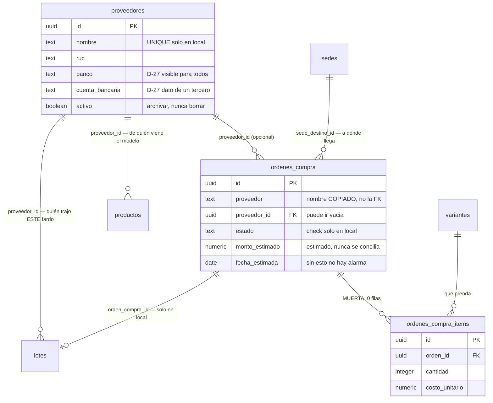
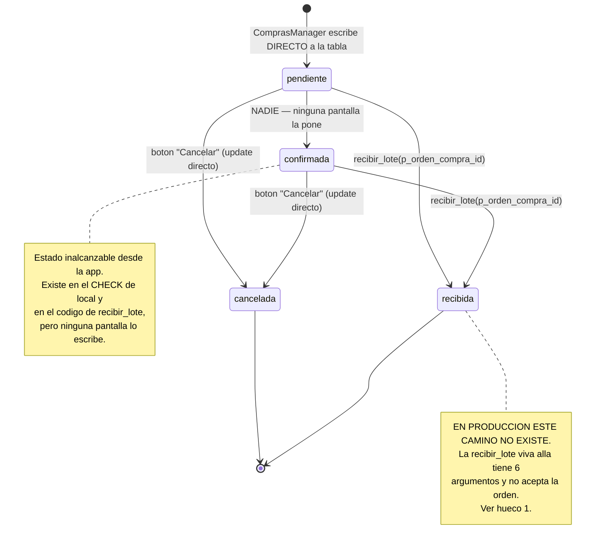

# 09 · Compras y proveedores
> **Pájaro:** PELÍCANO · **Lo lleva:** _(libre — apúntate en `07-GOBIERNO.md`)_ · **Última revisión:** 2026-09-12

## Para qué existe

CAYLA le compra a mucha gente distinta y casi siempre por WhatsApp: se pacta un fardo,
un monto y una fecha. Antes de este módulo ese acuerdo vivía en tres Excel distintos —
TRU tenía 295 proveedores, AQP y LIM 287 cada uno, y ninguno decía lo mismo. Este módulo
existe para dos cosas: que el proveedor sea **una sola ficha para las tres tiendas**, y
que un pedido pactado quede escrito **antes** de que llegue, con su plata comprometida a
la vista.

Lo que este módulo **no** hace, y conviene saberlo el primer día: no lleva la cuenta de
lo que CAYLA le debe a nadie. Registra la intención de compra, no la deuda.

## El mapa



Ciclo de vida de una orden de compra:



## Las tablas

### `proveedores` — la ficha única de a quién le compramos, para las tres sedes

**Existe en:** local y producción (`0013_finanzas_nucleo.sql:9`; `unificacion/05_operacion.sql:9`)
**Quién escribe:** **ninguna RPC.** `ProveedoresManager.tsx` escribe DIRECTO: `insert`
(línea 123), `update` del formulario (línea 122) y `update` de activo/inactivo (línea 134).
**4 filas en producción** (`generado/retail_filas.json`).

| Columna | Tipo | Vacío | Por defecto | Para qué sirve |
|---|---|---|---|---|
| `id` | uuid | no | `gen_random_uuid()` | Identifica al proveedor; es lo que guardan `ordenes_compra.proveedor_id`, `lotes.proveedor_id` y `productos.proveedor_id`. |
| `nombre` | text | no | — | Con qué nombre se le conoce en la tienda. **UNIQUE en local, sin unique en producción** (ver hueco 5). |
| `ruc` | text | sí | — | Su RUC, para el comprobante de compra. Se escribe a mano y **nadie lo valida**: la consulta a SUNAT (`lib/padron.ts`) solo la usa Facturación, nunca esta pantalla. |
| `categoria` | text | sí | — | Etiqueta heredada de SINATRA. Se muestra y se busca (`ProveedoresManager.tsx:76,227`) pero **ya no se edita**: el formulario la quitó a propósito (`:39-43`) porque el vínculo real producto↔proveedor vive en `productos.proveedor_id`. |
| `marca` | text | sí | — | La línea que maneja ese proveedor ("jeans", "blusas de vestir"). |
| `score` | numeric(3,1) en local · `numeric` sin precisión en producción | sí | — | Nota de calidad heredada de SINATRA. Se muestra en la lista (`:224`) y **ninguna pantalla la escribe** — MUERTA de escritura. |
| `contacto` | text | sí | — | Nombre de la persona con quien se habla. |
| `telefono` | text | sí | — | El WhatsApp por el que se pacta el fardo. |
| `banco` | text | sí | — | En qué banco cobra. **Visible para cualquiera con cuenta, decisión consciente (D-27).** |
| `cuenta_bancaria` | text | sí | — | El número de cuenta al que se le transfiere. **D-27: se deja visible por transparencia. Es dato de un tercero, no de CAYLA.** |
| `direccion` | text | sí | — | Dónde queda su local o almacén. |
| `nota` | text | sí | — | Texto libre. **MUERTA: ninguna pantalla la escribe ni la lee.** Sigue viva porque borrar una columna es DDL sobre el proyecto compartido con Dynamic y no gana nada (D-07). |
| `activo` | boolean | no | `true` | Si sigue siendo proveedor. Desactivar **nunca borra la fila** — el botón mueve `activo` a false y es reversible (`ProveedoresManager.tsx:8-11,130-139`). |
| `created_at` | timestamptz | no | `now()` | Cuándo se dio de alta. |
| `updated_at` | timestamptz | no | `now()` | Cuándo se tocó por última vez. Lo pone un trigger, no la pantalla. |

> **Actualización 2026-09-19 (ADR-0129, `docs/adr/0129-proveedores-cci-yape-plin-y-titular.md`) — cuatro columnas nuevas,
> aplicadas en producción como `20260919173940`** (archivo del repo: `20260919170000_proveedores_cci_y_billetera.sql`).
> Este módulo no se reescribe aquí; solo se agrega lo de este cambio.
>
> | Columna | Tipo | Vacío | Para qué sirve |
> |---|---|---|---|
> | `cci` | text | sí | Código de Cuenta Interbancario, 20 dígitos solo números (`proveedores_cci_formato`). |
> | `celular_billetera` | text | sí | Celular al que se yapea/plinea, 9 dígitos que empiezan con 9, sin +51 (`proveedores_celular_billetera_formato`). **No es `telefono`** (el WhatsApp). |
> | `billeteras` | text[] | sí | Qué app tiene ese celular: `yape`, `plin` o ambas (`proveedores_billeteras_validas`). Hay celular si y solo si hay app (`proveedores_billetera_coherente`). |
> | `titular_cuenta` | text | sí | El nombre que muestra el banco/Yape al pagar, 2–120 caracteres (`proveedores_titular_largo`); quien paga lo compara antes de confirmar. |
>
> `cuenta_bancaria` no cambió, pero ahora significa «cuenta local» (el interbancario vive en `cci`). Las 4 columnas se escriben
> por la RPC `guardar_cuentas_proveedor` (solo líder, reemplazo completo) y se leen por `fn_proveedores()` (28 columnas). Se
> leen con la misma regla que `banco` y `cuenta_bancaria` (D-27); la restricción por rol de las cinco columnas de pago queda
> para el final del proyecto (Felipe, 2026-09-19). Sin bitácora de cambios de cuenta todavía.

**Candados** (lo que la base impide que pase):

- `proveedores_pkey` — PRIMARY KEY (id). En las dos bases.
- `proveedores_nombre_key` — `UNIQUE (nombre)`. **Solo en local.** Es el candado que hace
  cumplir "un proveedor, una ficha". En producción no existe: `generado/retail_constraints.json`
  trae para `retail.proveedores` únicamente `proveedores_pkey`. Ver hueco 5.
- Trigger `proveedores_set_updated_at` (local) / `proveedores_updated` (producción) →
  `fn_set_updated_at()` / `retail.set_updated_at()`. La fecha de modificación no depende
  de que la pantalla se acuerde de mandarla.
- **No hay** ningún check sobre `ruc` (largo, dígito verificador), sobre `cuenta_bancaria`
  (formato, banco) ni sobre `score` (rango). Cualquier texto entra.
- **No hay** FK saliendo de esta tabla: el proveedor no pertenece a ninguna sede — es del
  sistema entero, que es justo el punto del directorio único.
- **Borrar un proveedor:** en local es imposible para todos (no existe policy de DELETE, y
  RLS sin policy deniega). En producción la policy `proveedores_write_lider` es `FOR ALL`,
  así que un Admin sí puede borrar — y solo lo frena la FK de una orden o un lote que ya
  lo referencie (`NO ACTION`, que es el default: nadie escribió `on delete`).

**Diferencias local vs producción:** en producción la tabla vive en el schema `retail`.
Falta el UNIQUE de `nombre`. `score` está declarada sin precisión. Las policies se llaman
distinto y no hacen lo mismo: local tiene `proveedores_select_autenticado` +
`proveedores_insert_lider` + `proveedores_update_lider` (sin DELETE); producción tiene
`proveedores_select` + `proveedores_write_lider` (`FOR ALL`, incluye DELETE), y su
`retail.es_lider()` pregunta por el rol `admin` de Dynamic, no por Líder de equipo
(`unificacion/03_candados.sql:62-64`).

---

### `ordenes_compra` — el pedido pactado, escrito antes de que llegue el fardo

**Existe en:** local y producción (`0001_init.sql:123` + `0017_ordenes_compra.sql:8-11`;
`unificacion/05_operacion.sql:131`)
**Quién escribe:** `ComprasManager.tsx` DIRECTO — `insert` (línea 111) y `update` a
`cancelada` (línea 128). Además la RPC `recibir_lote` la mueve a `recibida`… **solo en
local** (ver hueco 1). **5 filas en producción.**

| Columna | Tipo | Vacío | Por defecto | Para qué sirve |
|---|---|---|---|---|
| `id` | uuid | no | `gen_random_uuid()` | Identifica la orden; es lo que `lotes.orden_compra_id` guarda al recibirla. |
| `proveedor` | text | no | — | El nombre del proveedor **copiado como texto** en el momento de crear la orden (`ComprasManager.tsx:102-104`). Es lo que se muestra en pantalla y en la bandeja de pendientes, no el nombre del directorio. |
| `estado` | text | no | `'pendiente'` | `pendiente` · `confirmada` · `recibida` · `cancelada`. **El CHECK que lo hace cumplir existe solo en local.** |
| `sede_destino_id` | uuid | no | — | A qué tienda llega el fardo. FK a `sedes` en local, a `public.sedes` (Dynamic) en producción. Es también la llave del permiso: quien opera esa sede ve la orden. |
| `fecha` | date | no | `CURRENT_DATE` | El día en que se pactó. Es el punto de partida de la línea de control pedido→llegada (`ComprasManager.tsx:43-49`). |
| `created_at` | timestamptz | no | `now()` | Cuándo se registró. Es por lo que se ordena la lista, no por `fecha`. |
| `updated_at` | timestamptz | no | `now()` | Última modificación. La pone un trigger. |
| `proveedor_id` | uuid | sí | — | FK al directorio. **Puede ir vacía**: el formulario deja escribir un proveedor suelto sin darlo de alta (`ComprasManager.tsx:164` — "Otro (escribir abajo)…"). |
| `monto_estimado` | numeric(12,2) | sí | — | Cuánto se espera pagar. **Estimado y nunca conciliado con lo que se pagó de verdad.** Es la única cifra de plata del módulo y es la que suma "Dinero comprometido en camino" (`ComprasManager.tsx:133-135`). |
| `fecha_estimada` | date | sí | — | Cuándo debería llegar. Sin ella no hay línea de control ni alarma de atraso: `pendientes.ts:191-192` solo marca atrasada la que tiene fecha vencida, a propósito. |
| `nota` | text | sí | — | Lo pactado en texto ("40 blusas + 20 jeans por WhatsApp"). Es el sustituto real de `ordenes_compra_items`. |

**Candados** (lo que la base impide que pase):

- `ordenes_compra_pkey` — PRIMARY KEY (id). En las dos bases.
- `ordenes_compra_estado_check` — `estado in ('pendiente','confirmada','recibida','cancelada')`.
  **Solo en local.** En producción `generado/retail_constraints.json` trae para
  `retail.ordenes_compra` únicamente `ordenes_compra_pkey`: allá cualquier texto entra en
  `estado`. Ver hueco 4.
- `ordenes_compra_proveedor_id_fkey` → `proveedores(id)`. En las dos. Impide apuntar a un
  proveedor que no existe.
- `ordenes_compra_sede_destino_id_fkey` → `sedes(id)` en local, `public.sedes` (Dynamic) en
  producción (`generado/retail_fks_cruzadas.json`). Una orden siempre llega a una sede real.
- Trigger `ordenes_compra_updated` / `ordenes_compra_set_updated_at`.
- **No hay** check de `monto_estimado > 0`: el `min={0}` del formulario
  (`ComprasManager.tsx:192`) vive en el navegador, no en la base. Por API entra un negativo
  y ensucia el total comprometido.
- **No hay** unique de ninguna clase: la misma orden se puede crear dos veces seguidas y
  nada lo impide. La idempotencia que sí tiene la venta (`0054`) acá no existe.
- **No hay** índice sobre `sede_destino_id` ni sobre `estado`, que son las dos columnas por
  las que se filtra (`inventario/recibir/page.tsx:28-29`, `lib/pendientes.ts:59-61`). Con 5
  filas no importa; queda escrito para el día que importe.

**Diferencias local vs producción:** falta el CHECK de `estado`. El schema es `retail` y la
FK cruza a `public.sedes`. Las policies: local tiene `ordenes_compra_all_lider` (`FOR ALL`,
`fn_es_lider()`) + `ordenes_compra_select_propia_sede`; producción tiene
`ordenes_compra_lider` (`FOR ALL`, `retail.es_lider()` = rol `admin`) +
`ordenes_compra_select_sede` (`sede_destino_id = retail.mi_sede()`). Y la grande: en local
`recibir_lote` cierra la orden, en producción no puede (hueco 1).

---

### `ordenes_compra_items` — el detalle por prenda del pedido. MUERTA.

**Existe en:** local y producción (`0001_init.sql:134`; `unificacion/05_operacion.sql:153`)
**Quién escribe:** **nadie.** Cero lecturas y cero escrituras en `apps/web` — solo aparece
en los tipos generados (`packages/database/src/types.ts:1275`). **0 filas en producción.**

**MUERTA.** El motivo por el que sigue viva está escrito en la migración que la conectó,
`0017_ordenes_compra.sql:4-6`: *"El detalle por prenda (`ordenes_compra_items`) queda para
cuando haga falta: la compra real de CAYLA se pacta por fardo/monto, no por SKU (así
operaba SINATRA)."* Nació lista en la Fase 1 y el negocio nunca la necesitó — lo que se
pacta va en `ordenes_compra.nota`. Borrarla sería DDL sobre el proyecto compartido con
Dynamic y no gana nada (D-07).

| Columna | Tipo | Vacío | Por defecto | Para qué sirve |
|---|---|---|---|---|
| `id` | uuid | no | `gen_random_uuid()` | Identifica la línea del pedido. |
| `orden_id` | uuid | no | — | A qué orden pertenece. Se borra en cascada con la orden. |
| `variante_id` | uuid | no | — | Qué talla/color exacta se pidió. |
| `cantidad` | integer | no | — | Cuántas unidades de esa variante. |
| `costo_unitario` | numeric(12,2) | no | — | A cuánto se pactó cada una. |

**Candados:**

- `ordenes_compra_items_pkey` — PRIMARY KEY (id). En las dos bases.
- `ordenes_compra_items_orden_id_fkey` → `ordenes_compra(id)` **ON DELETE CASCADE**. Es la
  única cascada del módulo: borrar la orden se lleva sus líneas.
- `ordenes_compra_items_variante_id_fkey` → `variantes(id)`.
- **No hay** check de `cantidad > 0` ni de `costo_unitario >= 0`. La tabla nació sin las
  redes que el resto del núcleo sí tiene, y como nadie escribe en ella nunca se notó.

**Diferencias local vs producción:** solo el schema (`retail`) y el nombre de la policy
(`ordenes_compra_items_all_lider` en local, `ordenes_compra_items_lider` en producción).
En las dos, solo Líder de equipo (local) / Admin (producción) puede tocarla — y nadie lo hace.

## Cómo se escribe (la única puerta)

**En este módulo no hay puerta única. Hay dos pantallas que escriben directo a tabla y una
sola RPC, que además no es de este módulo.** Eso es la superficie de riesgo, y conviene
verla completa:

| Escritura | Archivo:línea | Qué hace | Qué la frena |
|---|---|---|---|
| Crear proveedor | `components/ProveedoresManager.tsx:123` | `insert` en `proveedores` | Solo la policy de RLS + el UNIQUE de `nombre` (que en producción no existe) |
| Editar proveedor | `components/ProveedoresManager.tsx:122` | `update` en `proveedores` | Solo la policy |
| Activar / desactivar proveedor | `components/ProveedoresManager.tsx:134` | `update` de `activo` | Solo la policy |
| Crear orden de compra | `components/ComprasManager.tsx:111` | `insert` en `ordenes_compra` | Solo la policy + las FK. El `estado` sale del default |
| Cancelar orden | `components/ComprasManager.tsx:128` | `update` `estado = 'cancelada'` | Solo la policy. **No valida en el servidor en qué estado estaba**: la API deja cancelar una orden ya recibida, y en producción deja escribir cualquier texto en `estado` |

Que escriban directo significa que **el único candado es la policy de la fila**. No hay
validación de negocio del lado del servidor, no hay mensaje en idioma CAYLA propio, y no hay
transacción: si mañana una orden tuviera que crear algo más junto con ella, la mitad podría
quedar escrita y la otra no. Es lo contrario de cómo funciona el inventario, donde todo pasa
por `registrar_movimiento` / `recibir_lote`.

### `recibir_lote(...)` — la única RPC que toca este módulo

Es la función del módulo 05 (Inventario). Acá importa solo por una línea: cuando recibe un
fardo ligado a una orden, la cierra en la misma transacción.

**Firma viva en LOCAL** (8 argumentos, la de `0018_produccion.sql:37`, que `0049` eligió
conservar):

```sql
recibir_lote(p_sede_id uuid, p_origen text, p_items jsonb,
             p_proveedor text default null, p_numero_guia text default null,
             p_nota text default null, p_orden_compra_id uuid default null,
             p_orden_produccion_id uuid default null) → uuid
```

Lo que hace para compras (`0018_produccion.sql:70-77`): inserta el lote con
`orden_compra_id`, y si vino una orden ejecuta
`update ordenes_compra set estado='recibida' where id = p_orden_compra_id and estado in ('pendiente','confirmada')`.
Ese `and estado in (...)` es el detalle fino: una orden ya `cancelada` o ya `recibida` no se
re-abre ni se re-marca.

**Candado de permiso:** `if not fn_puede_operar_sede(p_sede_id) then raise` — Líder de
equipo en cualquier sede, o Integrante en la suya. **No mira el rol para cerrar la orden**:
quien puede recibir en esa sede puede cerrar la orden de esa sede, aunque la policy de
`ordenes_compra` no le dejaría tocarla por API. Es correcto (la función es `security
definer` y ese es su trabajo), pero conviene saberlo.

**Idempotente:** **no.** Pegar dos veces el mismo fardo crea dos lotes y duplica el stock.
Lo único idempotente es el cierre de la orden: la segunda vez el `update` no encuentra fila
en estado `pendiente`/`confirmada` y no hace nada.

**Firma viva en PRODUCCIÓN hoy: 6 argumentos, sin `p_orden_compra_id`.** Verificado contra
el catálogo real el 2026-09-12 a las 17:45 UTC (`generado/inventario-cayla-dynamic.json`,
`generado/RPCS.md:127`): una sola firma, 38 líneas de cuerpo — que es exactamente el cuerpo
de `unificacion/08_funciones_finanzas.sql:133`. **Ligar una recepción a una orden de compra
no funciona en producción.** Ver hueco 1.

**Quién la llama:** `components/RecibirLoteForm.tsx:431`, desde `/inventario/recibir`. El
formulario manda `p_orden_compra_id` solo cuando el origen es proveedor y hay una orden
elegida (`:435`); `supabase-js` borra del JSON las claves `undefined`, así que una recepción
sin orden sí resuelve contra la firma de 6 argumentos de producción — y una **con** orden no
resuelve contra ninguna.

## Quién ve y quién toca

Según las policies reales (`0003_rls.sql:85-88`, `0013_finanzas_nucleo.sql:97-100`,
`0017_ordenes_compra.sql:16-17` en local; `generado/retail_policies.json` en producción).

| Operación | Admin | Líder de equipo | Integrante | Solo lectura |
|---|---|---|---|---|
| Ver el directorio de proveedores (incluido banco y cuenta) | sí | sí | sí | sí |
| Crear / editar / desactivar un proveedor | sí | **sí en local · NO en producción** | no | no |
| Borrar un proveedor | **no en local · sí en producción** | no | no | no |
| Ver órdenes de compra de su sede | sí (todas) | sí | sí | sí (las de su sede) |
| Ver órdenes de compra de otra sede | sí | **sí en local · NO en producción** | no | no |
| Crear / cancelar una orden de compra | sí | **sí en local · NO en producción** | no | no |
| Recibir un fardo y cerrar la orden | sí | sí | sí, en su sede | no |
| Ver o escribir `ordenes_compra_items` | sí | sí en local | no | no |

Tres cosas que esta tabla esconde y hay que decir en voz alta:

1. **"Solo lectura" no existe como rol en ninguna de las dos bases.** El CHECK de local
   admite `lider` e `integrante` (`0001_init.sql:30`); Dynamic maneja `admin`,
   `supervisor_sede`, `integrante`. El contador externo hoy entraría como Integrante.
2. **En producción, Líder de equipo NO manda en compras.** `retail.es_lider()` pregunta por
   el rol `admin` de Dynamic (`unificacion/03_candados.sql:62-64`), y
   `apps/web/lib/persona.ts:49` manda `supervisor_sede` a `integrante`. En producción, crear
   un proveedor o una orden lo puede hacer solo Felipe.
3. **El botón escondido no es un permiso.** `ComprasManager.tsx:144` y
   `ProveedoresManager.tsx:152` ocultan los botones a quien no es Líder, pero como las dos
   pantallas escriben directo a tabla, lo único que de verdad rechaza la fila es la policy.

## Qué se rompe sin esto

Sin el directorio, cada sede vuelve a su Excel y el mismo proveedor pasa a tener tres fichas
con tres números de cuenta distintos — que es exactamente de donde CAYLA venía. Sin las
órdenes, nadie puede responder "cuánta plata tengo comprometida en camino" antes de decidir
si alcanza para pedir más: el número del encabezado de Compras deja de existir y la decisión
vuelve a ser memoria. La bandeja de pendientes del Inicio pierde su aviso de "orden de compra
que ya debió llegar" (`lib/pendientes.ts:195-203`), así que un fardo que no llegó se descubre
cuando una clienta pregunta por una talla. Y la pantalla de recibir mercadería pierde la lista
de proveedores y la de órdenes pendientes: se puede seguir recibiendo, pero escribiendo el
nombre del proveedor a mano cada vez, que es el hábito que este módulo vino a matar.

## Huecos conocidos

1. **Producción corre la versión vieja de `recibir_lote` y nadie lo sabía.** El catálogo real
   leído el 2026-09-12 17:45 UTC (`generado/inventario-cayla-dynamic.json`;
   `generado/RPCS.md:124-130`) devuelve **una sola** `retail.recibir_lote`, de **6 argumentos
   y 38 líneas de cuerpo** — el cuerpo exacto de `unificacion/08_funciones_finanzas.sql:133`.
   Consecuencia triple, toda viva hoy en las tiendas: (a) **recibir ligado a una orden falla**
   — `RecibirLoteForm.tsx:435` manda `p_orden_compra_id` y ninguna función lo acepta, así que
   la recepción entera se cae y hay que elegir "No / sin orden"; (b) la función **no valida
   sede** — cualquiera con cuenta que llame la RPC directo puede meter mercadería en el
   inventario de otra tienda (es el hueco que ADR-0004 escribió para cerrar); (c) **pierde la
   categoría** de cada producto nuevo creado al recibir. En la plata: las 5 órdenes de
   producción quedan `pendiente` para siempre, "Dinero comprometido en camino" solo crece, y
   la bandeja de pendientes grita atrasos de fardos que ya están en la tienda.
2. **Promesa incumplida, dos veces, sobre lo mismo.** `unificacion/38_migraciones_aplicadas.sql`
   afirma: `('14_recibir_lote_produccion.sql', '2026-09-03', 'según BACKLOG.md (ADR-0004,
   verificado con pg_proc/regprocedure), no re-verificado hoy')`. Y
   `docs/datos/modulos/05-inventario-y-movimientos.md:324-325` afirma: *"Firma de 8 argumentos
   en local … y de **7 en producción** (`unificacion/14`, sin `p_orden_produccion_id`)"*. El
   catálogo de hoy dice 6. O `14` nunca se pegó, o se pegó y algo volvió a pasar `08` por
   encima. Las dos frases se corrigen y la fila de `migraciones_aplicadas` se borra o se
   marca como no verificada — es justo el "verde que no se ganó" que esa tabla dice evitar.
3. **Las dos pantallas del módulo escriben directo a tabla, sin RPC.**
   `ComprasManager.tsx:111,128` y `ProveedoresManager.tsx:122,123,134`. Quedan apoyadas
   únicamente en las policies de RLS: ninguna validación de negocio en el servidor, ninguna
   transacción, ningún mensaje propio. Concreto: `cancelar()` (`ComprasManager.tsx:126-131`)
   no comprueba en qué estado estaba la orden — el botón se esconde para las recibidas, pero
   la API deja cancelar una orden ya recibida y desarmar el historial de la compra.
4. **En producción `ordenes_compra.estado` no tiene CHECK.** `generado/retail_constraints.json`
   trae para `retail.ordenes_compra` solo `ordenes_compra_pkey`; local sí tiene
   `ordenes_compra_estado_check` (`0001_init.sql:126-127`). Un `update` con un typo deja la
   orden en un estado que ninguna pantalla sabe dibujar (`ETIQUETA_ESTADO`,
   `ComprasManager.tsx:25-30`, cae al texto crudo) y que ningún filtro encuentra.
5. **El "directorio único" no tiene candado en producción, y nunca se llenó.** La pantalla
   promete, en su propio comentario (`ProveedoresManager.tsx:8-9`): *"Directorio único de
   proveedores (fin de las 3 copias desincronizadas de SINATRA: TRU tenía 295 filas, AQP/LIM
   287)"*. Producción tiene **4 filas** (`generado/retail_filas.json`) y **no tiene el UNIQUE
   de `nombre`** que local sí tiene (`0013_finanzas_nucleo.sql:11`). O sea: los ~292
   proveedores nunca se migraron, y nada impide que las tres sedes vuelvan a crear la misma
   ficha tres veces. Además el duplicado en local ni siquiera se explica bien: `proveedores_nombre_key`
   no está en las huellas de `lib/error-escritura.ts:49-134`, así que sale el mensaje crudo
   de Postgres con "Código:" delante.
6. **Cuentas por pagar de verdad NO existen.** Es el hueco más caro y D-46 lo pone de
   prioridad 1 (junto con IGV, con CAYLA al 72% del umbral de 300 UIT). Lo que falta, nombrado:
   no hay factura de compra, no hay monto **real** (solo `monto_estimado`, que nunca se
   concilia con lo pagado), no hay saldo pendiente, no hay fecha de vencimiento, no hay IGV de
   compra, y no hay vínculo entre una orden y el `gasto` o el pago que la saldó. El código lo
   admite en una línea: `apps/web/lib/contabilidad.ts:19` — *"sin cuentas por pagar aún (eso
   llega con el módulo de compras formales)"*. Consecuencia concreta: CAYLA no puede decir
   hoy cuánto le debe a sus proveedores ni cuánto crédito fiscal de IGV tiene acumulado.
7. **`ordenes_compra_items` está muerta** (0 filas, ningún lector, ningún escritor). El
   detalle de lo pactado vive en `ordenes_compra.nota`, un texto libre. Mientras siga así, no
   se puede comparar lo pedido contra lo recibido — que es lo que convertiría una orden en un
   control real y no en un recordatorio.
8. **El estado `confirmada` es inalcanzable.** Está en el CHECK de local y `recibir_lote` lo
   acepta como origen válido para cerrar, pero **ninguna pantalla lo escribe**:
   `ComprasManager` solo produce `pendiente` (default) y `cancelada` (`:128`). Es un estado
   fantasma que ensucia el modelo mental de quien entra hoy.
9. **`proveedor` (texto) y `proveedor_id` (FK) conviven y nadie los sincroniza.**
   `ComprasManager.tsx:102-104` copia el nombre del directorio a la columna de texto en el
   momento de crear. Si mañana se corrige el nombre del proveedor en su ficha, todas las
   órdenes viejas siguen mostrando el nombre viejo — y la bandeja de pendientes
   (`lib/pendientes.ts:198`) y la pantalla de Compras (`ComprasManager.tsx:246`) leen el texto,
   no la FK. Además `proveedor_id` puede quedar vacía a propósito (`:164`, "Otro (escribir
   abajo)…"), así que una orden puede no estar ligada a ninguna ficha del directorio.
10. **D-27 y la cuenta bancaria del tercero.** La policy `proveedores_select` /
    `proveedores_select_autenticado` usa `auth.role() = 'authenticated'`: **cualquier persona
    con cuenta, de cualquier rol y cualquier sede, puede leer `banco` y `cuenta_bancaria` por
    API.** Y no es solo teórico: `app/(app)/inventario/proveedores/page.tsx:18` los selecciona
    para todos y se los pasa como props a `ProveedoresManager`, así que **viajan al navegador
    de un Integrante** aunque la pantalla solo los dibuje dentro del formulario de edición,
    que se abre únicamente para Líder (`ProveedoresManager.tsx:88`). Felipe decidió dejarlo
    visible (D-27, transparencia consciente) — la nota que queda escrita es que **ese número
    es dato de un tercero, no de CAYLA**, y que la decisión de exponerlo no es de CAYLA sola.
11. **El comentario de `0003_rls.sql:1-3` miente y hay que corregirlo.** Dice textualmente:
    *"Líderes ven todo (todas las sedes, costos/precios); Integrantes solo ven/operan su
    propia sede **y no ven costo/margen**"*. Nunca fue cierto: ninguna policy filtra columnas
    de costo. D-27 lo resuelve por la vía contraria —se dejan visibles— así que lo que se
    corrige es el comentario, no la policy.
12. **No se puede pedir para el Taller ni para la sede corporativa.**
    `app/(app)/inventario/compras/page.tsx:27` filtra `s.tipo === "tienda"`, así que el
    desplegable "Llega a" solo ofrece TRU/AQP/LIM. La materia prima del Taller (tela, avíos —
    D-47, prioridad 2) no tiene por dónde pedirse, y un gasto de compra de CCO (D-32) tampoco.

## Decisiones que lo gobiernan

- **D-07** · Lo muerto se marca con el motivo por el que sigue vivo: `ordenes_compra_items`,
  `proveedores.nota` y `proveedores.score` llevan esa marca en su ficha.
- **D-12** · Los cuatro niveles son Admin / Líder de equipo / Integrante / Solo lectura. En
  este módulo, "Solo lectura" no existe todavía en ninguna base y "Líder de equipo" no manda
  en producción.
- **D-16** · Cada tabla dice en qué base existe; las tres del módulo existen en las dos, con
  las diferencias listadas fila por fila.
- **D-17** · `supabase/unificacion/` es deuda a extinguir: el hueco 1 es exactamente el costo
  de tener dos rieles.
- **D-24** · Las promesas incumplidas se escriben con la cita exacta: huecos 2, 5, 6 y 11.
- **D-27** · Costos, márgenes y cuentas bancarias de proveedores quedan visibles por
  transparencia, con la nota de que la cuenta bancaria es dato de un tercero. Es la decisión
  que gobierna el hueco 10, y la que obliga a corregir el comentario del hueco 11.
- **D-32** · Los gastos que no son de ninguna sede van a `CCO` — hoy no se puede pedir para
  `CCO` (hueco 12).
- **D-42** · La mercadería nueva entra al almacén de la sede y de ahí baja al piso: eso lo
  hace `recibir_lote` vía el contenedor `almacen`, y por eso la recepción es el punto de
  contacto entre este módulo y el 05.
- **D-46** · Prioridad 1 declarada por Felipe: cuentas por pagar e IGV. El hueco 6 es esa
  prioridad escrita como falta concreta.
- **D-47** · Inventario de insumos del Taller (prioridad 2). Hoy no hay ni por dónde
  pedirlos (hueco 12).
- **ADR-0004** (`docs/adr/0004-recibir-lote-drift-unificacion.md`) — documenta las tres
  divergencias de `recibir_lote` en producción. El hueco 1 demuestra que la corrección que
  ese ADR decidió **no está aplicada hoy**.
- **ADR-0026** (`docs/adr/0026-saber-que-corrio-y-la-firma-vieja-se-borra.md`) — una firma
  por función y la tabla `migraciones_aplicadas`. El hueco 2 es el primer caso donde esa
  tabla afirma algo que el catálogo desmiente.
- **ADR-0022** (`docs/adr/0022-los-errores-de-escritura-hablan-idioma-cayla.md`) — los errores
  de escritura hablan idioma CAYLA. El duplicado de proveedor todavía no (hueco 5).
