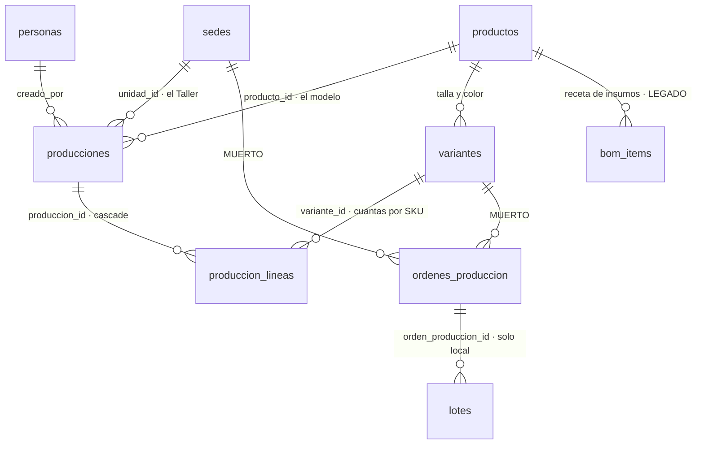
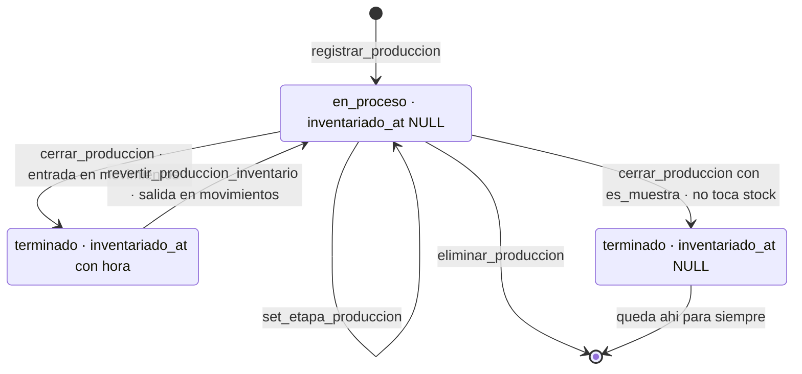

# 10 · Producción del Taller
> **Pájaro:** GALLITO · **Lo lleva:** _(libre — apúntate en `07-GOBIERNO.md`)_ · **Última revisión:** 2026-09-12

> **Nota 2026-09-17, sobre el resto de este documento (no sobre la sección de insumos
> del final, que sí está al día):** las tablas `producciones`/`produccion_lineas`/
> `ordenes_produccion` que siguen abajo se documentaron con `sedes`/`unidad_id` y
> `registrar_produccion`/5 RPC de la `0026`-`0029`. El Postgres local de HOY ya no
> tiene eso — `20260915130000_produccion_del_taller.sql` restauró el módulo sobre el
> modelo V2 (`ubicaciones`, `sububicaciones`, `ubicacion_id`, RPC `abrir_produccion`/
> `set_etapa_produccion`/`cerrar_produccion`/`anular_produccion`/`revertir_produccion`,
> estados `en_proceso`/`terminada`/`anulada`), verificado directo contra el Postgres
> local al escribir ADR-0074. Este documento no se reescribió entero bajo esa tarea
> (alcance: solo la sección de insumos) — queda pendiente un refresco completo.
## Para qué existe

El Taller de Lima fabrica prendas en continuo y las manda a TRU, AQP y LIM. Sin este
módulo nadie sabe cuánto costó de verdad una prenda que salió de la mesa de corte, ni
cuántas quedaron a medio hacer, ni si la corrida ya entró al inventario o las prendas
están apiladas en el Taller sin que el sistema las cuente. Es la única parte del ERP
donde el stock **nace** en vez de llegar de un proveedor: aquí se decide cuánto cuesta
la prenda que después se vende en tienda. Si el costo de aquí sale mal, el margen de
toda la cadena sale mal.

## El mapa

Ciclo de vida de una orden de producción:

`inventariado_at` es el candado del doble conteo: mientras tenga fecha, `cerrar_produccion`
se niega a cerrar otra vez. Es lo único que impide que un doble clic sume las mismas 80
prendas dos veces al stock del Taller.

## Las tablas

### `producciones` — la cabecera de una corrida: qué modelo, cuánto costó, en qué etapa va

**Existe en:** local y producción
**Quién escribe:** `registrar_produccion` (abre) · `cerrar_produccion` (costo real + inventario)
· `set_etapa_produccion` (etapas) · `revertir_produccion_inventario` · `eliminar_produccion`.
Ninguna pantalla la escribe directo — pero la policy la deja abierta para un Líder (ver Candados).

| Columna | Tipo | Vacío | Por defecto | Para qué sirve |
|---|---|---|---|---|
| `id` | uuid | no | `gen_random_uuid()` | Identifica la corrida; su prefijo de 8 caracteres queda escrito en la nota del movimiento de stock. |
| `unidad_id` | uuid → `sedes(id)` | no | — | La sede que produce: el Taller. Es lo que decide quién puede tocar la orden. |
| `variante_id` | uuid → `variantes(id)` | sí | — | **MUERTO.** Resto del modelo por talla-color de la `0024`; desde la `0026` ningún RPC la llena. Sigue viva porque borrarla implicaría tocar el núcleo. |
| `producto_id` | uuid → `productos(id)` | sí | — | El modelo que se fabrica. Nullable por herencia de la `0026`, pero en la práctica todo RPC lo llena. |
| `fecha` | date | no | `current_date` | **MUERTO.** Fecha de la corrida; nadie la escribe fuera del default y ninguna pantalla la lee. |
| `cantidad` | integer | no | — | Cuántas prendas. Al abrir es el plan; al cerrar `cerrar_produccion` la pisa con las que salieron buenas. |
| `costo_tela` | numeric(12,2) | no | `0` | Soles de tela de toda la corrida (no por prenda). |
| `costo_avios` | numeric(12,2) | no | `0` | Botones, cierres, etiquetas, hilo: el resto del material directo. |
| `costo_maquila` | numeric(12,2) | no | `0` | Lo que se mandó afuera en esa corrida (planchado, corte tercerizado). |
| `precio_taller` | numeric(12,2) | no | `0` | Precio al que el Taller "le vende" a la tienda. **Contradice D-31** (ver Huecos 6). |
| `costo_unitario` | numeric(12,2) **generada** | sí | `round((costo_tela+costo_avios+costo_maquila)/nullif(cantidad,0), 2)` stored | El costo por prenda. No se escribe: la base lo recalcula sola cada vez que cambia un costo o la cantidad. Por eso cerrar con menos prendas buenas sube el costo unitario solo: la merma queda absorbida. |
| `es_muestra` | boolean | no | `false` | Si es desarrollo del modelo (patrón, prototipo) y no producción vendible. Una muestra nunca entra al inventario. |
| `estado` | text | no | `'terminado'` · check `('en_proceso','terminado')` | En qué punto está. Ojo: el default dice `terminado`, pero `registrar_produccion` inserta `'en_proceso'` a mano. Un insert directo caería en `terminado` con `inventariado_at` vacío — o sea, alarma inmediata. |
| `etapas` | jsonb | no | `'{}'` | Mapa `{etapa: estado}` — ej. `{"corte":"hecho","confeccion":"tercerizado"}`. Es el tablero de avance del Taller. |
| `detalle` | text | sí | — | Texto libre con las tallas/colores de la corrida ("S/M/L · negro, arena"). Es lo que se ve en la bandeja de pendientes. |
| `fecha_entrega` | date | sí | — | Para cuándo se comprometió. Alimenta la alarma de "orden pasada de fecha". |
| `inventariado_at` | timestamptz | sí | — | Cuándo entró al stock. `NULL` = todavía no. Es el candado contra el doble conteo. |
| `nota` | text | sí | — | Observación libre. Hoy la UI nunca la manda (`OrdenesProduccion.tsx:513` envía `undefined`). |
| `creado_por` | uuid → `personas(id)` | sí | — | Quién abrió la corrida. |
| `created_at` | timestamptz | no | `now()` | Cuándo se abrió. Es el orden del tablero. |

**Candados** (lo que la base impide que pase):
- `producciones_estado_check` — el estado solo puede ser `en_proceso` o `terminado`. No existe una corrida "a medio estado".
- `producciones_cantidad_check` (`cantidad > 0`) — **solo local**. Imposible registrar una corrida de 0 prendas. En producción esa fila no tiene check: `cantidad` solo es `not null`.
- `costo_unitario` generada con `nullif(cantidad, 0)` — el costo por prenda nunca es una división por cero ni un número tecleado a mano que no cuadre con los costos.
- FK `unidad_id → sedes(id)` — una corrida no puede pertenecer a una sede que no existe.
- Índices `producciones_unidad_idx`, `producciones_variante_idx`, `producciones_producto_idx` — **solo local** (`0024`, `0026`). `unificacion/06_contabilidad_produccion.sql` no crea ninguno.
- No hay candado contra editar `inventariado_at` a mano: la policy `producciones_all_lider` es `for all`.

**Diferencias local vs producción:**
- El check `cantidad > 0` existe solo en local.
- Los tres índices existen solo en local.
- El orden de declaración de columnas difiere; el conjunto de columnas es el mismo.
- Las policies se llaman igual pero llaman helpers distintos: local `fn_es_lider()` (rol `lider`) y `fn_sede_actual_persona()`; producción `retail.es_lider()` (rol `admin` de Dynamic) y `retail.mi_sede()`.

---

### `produccion_lineas` — el desglose: cuántas unidades de cada talla y color lleva la corrida

**Existe en:** local y producción
**Quién escribe:** `registrar_produccion` (inserta con `on conflict do update`) y `cerrar_produccion`
(ajusta a lo que salió bueno, y **borra** la línea que quedó en 0). Ninguna pantalla la escribe directo —
y no podría: no hay policy de INSERT en ninguna de las dos bases.

| Columna | Tipo | Vacío | Por defecto | Para qué sirve |
|---|---|---|---|---|
| `id` | uuid | no | `gen_random_uuid()` | Identifica la línea. |
| `produccion_id` | uuid → `producciones(id)` **on delete cascade** | no | — | A qué corrida pertenece. Borrar la corrida se lleva sus líneas. |
| `variante_id` | uuid → `variantes(id)` | no | — | Qué SKU exacto (talla + color). Es el que recibe la entrada de stock al cerrar. |
| `cantidad` | integer | no | — | Cuántas unidades de ese SKU. Al abrir es el plan; al cerrar, las buenas. |
| `created_at` | timestamptz | no | `now()` | Cuándo se agregó la línea. |

**Candados:**
- `produccion_lineas_produccion_id_variante_id_key` (unique `(produccion_id, variante_id)`) — la misma talla-color no puede aparecer dos veces en la misma corrida. Sin esto, un reintento del formulario duplicaría las unidades de un SKU.
- `produccion_lineas_cantidad_check` (`cantidad > 0`) — no existe una línea de 0 prendas. Por eso `cerrar_produccion` **borra** la línea en vez de ponerla en cero.
- `on delete cascade` — imposible que quede una línea huérfana apuntando a una corrida borrada.
- Sin policy de INSERT/UPDATE/DELETE en ninguna base: la única puerta de escritura son las RPC `security definer`.

**Diferencias local vs producción:** ninguna en la forma de la tabla. Solo cambia el nombre de la policy de lectura (`produccion_lineas_select` en local, `pl_select` en producción) y el helper que usa.

---

### `bom_items` — la receta de costo del modelo: qué insumos lleva y cuánto vale cada uno

**Existe en:** local y producción
**Quién escribe:** **la pantalla, directo, sin RPC.** `apps/web/components/RecetaCosto.tsx:49` (insert)
y `:64` (delete). Es superficie de riesgo — ver "Cómo se escribe".

Es **legado**: nació en la Fase 1 (`0001_init.sql:113`) como ficha de consumo, la `0024` le agregó
precio para convertirla en calculadora de costo, y el modelo real de producción (`producciones`)
se construyó después sin tocarla. **Pero no está muerta: tiene pantalla propia y viva** — el botón
"Receta de costo" en la ficha del producto (`apps/web/app/(app)/producto/[varianteId]/page.tsx:165-177`),
visible solo para un Líder. Lo que nunca pasó es que la receta alimente a `registrar_produccion`:
los dos caminos calculan costo y no se hablan.

| Columna | Tipo | Vacío | Por defecto | Para qué sirve |
|---|---|---|---|---|
| `id` | uuid | no | `gen_random_uuid()` | Identifica la línea de receta. |
| `producto_id` | uuid → `productos(id)` **on delete cascade** | no | — | De qué modelo es la receta. Borrar el modelo borra su receta. |
| `insumo` | text | no | — | Cómo se llama el insumo ("Lino crudo", "Botón 4 huecos"). Texto libre: no hay catálogo de insumos. |
| `cantidad_requerida` | numeric(12,4) local · **numeric(12,3) producción** | no | — | Cuánto entra en una prenda. |
| `unidad` | text | no | — | En qué se mide ("m", "und"). Texto libre, sin vocabulario cerrado. |
| `precio_unitario` | numeric(12,4) local · **numeric(12,2) producción** | sí | — | Precio de referencia del insumo. Vacío = la línea no suma al costo sugerido. |
| `created_at` | timestamptz | no | `now()` | Cuándo se agregó. Es el orden en pantalla. |

**Candados:**
- FK `producto_id` con `on delete cascade` — no quedan recetas colgando de modelos borrados.
- Policy única `bom_items_all_lider` / `bom_all_lider` (`for all`) — un Integrante no ve ni toca la receta, ni siquiera la del Taller donde trabaja.
- No hay unique sobre `(producto_id, insumo)`: el mismo insumo se puede cargar dos veces y el costo sugerido se dobla sin que nada avise.

**Diferencias local vs producción:** la precisión decimal de las dos columnas numéricas no coincide
(`12,4` local contra `12,3` y `12,2` en producción). Una receta con 3 decimales de consumo de tela se
redondea distinto en cada base.

---

### `ordenes_produccion` — **MUERTO**: el rastreador de órdenes de la Fase 1, reemplazado por `producciones`

**Existe en:** local y producción
**Quién escribe:** nadie desde la app. Solo la toca `recibir_lote` **en local** (`0018`/`0031`), que
al recibir un lote con `p_orden_produccion_id` la marca `completada`. En producción ni eso: `retail.recibir_lote`
no tiene ese parámetro (`unificacion/14_recibir_lote_produccion.sql`).

**Por qué sigue viva:** `lotes.orden_produccion_id` la referencia (solo en local), y `recibir_lote`
todavía la actualiza. Borrarla implicaría reescribir `recibir_lote` en las dos bases. La reconciliación
de los dos modelos está declarada como tarea aparte en `apps/web/app/(app)/inventario/recibir/page.tsx:59-66`.
Ninguna pantalla la lee: la única mención en `apps/web` es ese comentario.

| Columna | Tipo | Vacío | Por defecto | Para qué sirve |
|---|---|---|---|---|
| `id` | uuid | no | `gen_random_uuid()` | Identifica la orden vieja. |
| `variante_id` | uuid → `variantes(id)` | no | — | Qué SKU se iba a producir. El modelo viejo era por talla-color, no por corrida. |
| `sede_id` | uuid → `sedes(id)` | no | — | Dónde se produce. |
| `cantidad_planeada` | integer | no | — | Cuántas se pidieron. |
| `cantidad_producida` | integer | no | `0` | Cuántas salieron. Nadie la actualiza nunca. |
| `estado` | text | no | `'planeada'` · check `('planeada','en_proceso','completada','cancelada')` | En qué punto está. Solo `recibir_lote` local la mueve a `completada`. |
| `fecha_inicio` | date | sí | — | Cuándo arrancó. |
| `fecha_fin` | date | sí | — | Cuándo terminó. `recibir_lote` local la llena al recibir. |
| `created_at` | timestamptz | no | `now()` | Cuándo se creó. |
| `updated_at` | timestamptz | no | `now()` | Última edición; la mantiene un trigger. |
| `etapa` | text | sí | `'corte'` | Etapa del modelo viejo. **Check `('corte','confeccion','acabado')` solo en local**; en producción la columna no tiene check. |
| `destino_sede_id` | uuid → `sedes(id)` | sí | — | A qué tienda iba la mercadería. |
| `nota` | text | sí | — | Observación libre. |

**Candados:**
- `ordenes_produccion_estado_check` — el estado es uno de los cuatro, en las dos bases.
- Check de `etapa` — **solo local**.
- Trigger `ordenes_produccion_set_updated_at` (local) / `op_updated` (producción) — `updated_at` no se puede falsear a mano.
- Cinco policies (`all_lider`, `select_sede`, `select_destino`, `insert_sede`, `update_sede`): la tienda destino ve lo que viene hacia ella.

**Diferencias local vs producción:**
- El check de `etapa` existe solo en local.
- `lotes.orden_produccion_id` existe **solo en local** (`0018`). `retail.lotes` (`unificacion/05_operacion.sql:165-177`) no tiene esa columna, así que en producción una recepción no se puede ligar a una orden de producción ni de la forma vieja.
- Las policies de insert/update usan `fn_sede_actual_persona() or fn_es_lider()` en local y `retail.puede_operar_sede(sede_id)` en producción.

---

**Columnas de otras tablas que este módulo escribe** (fichas completas en sus módulos):
`variantes.costo` y `variantes.precio_taller` (las pisa `registrar_produccion` en cada corrida),
`productos.costo_mano_obra` (la escribe `RecetaCosto.tsx:70`), `productos.material`
(**solo producción**, `unificacion/11`), y `movimientos` + `stock` (entrada al cerrar, salida al revertir).

## Cómo se escribe (la única puerta)

Las cinco RPC son `security definer` con `set search_path`. Ninguna exige rol de Líder:
**el candado es de sede**, vía `fn_puede_operar_sede(unidad_id)` en local y
`retail.puede_operar_sede(unidad_id)` en producción. Quien trabaja en el Taller puede
abrir, avanzar, cerrar, revertir y eliminar corridas del Taller; quien trabaja en una
tienda no puede tocar ninguna.

| Función | Firma | Candado | Idempotente |
|---|---|---|---|
| `registrar_produccion` | **local, 15 args:** `(p_unidad_id uuid, p_cantidad integer, p_costo_tela numeric, p_costo_avios numeric, p_costo_maquila numeric, p_precio_taller numeric, p_variantes jsonb default '[]', p_producto_id uuid default null, p_referencia text default null, p_categoria_id uuid default null, p_detalle text default null, p_es_muestra boolean default false, p_fecha_entrega date default null, p_marcar_terminado boolean default false, p_nota text default null) returns uuid` **producción, 16 args:** lo mismo **+ `p_material text default null`** al final | sede (`puede_operar_sede`) | **No.** No hay token ni clave única: un reintento crea una segunda corrida. Si venía con `p_marcar_terminado`, entra dos veces al stock. |
| `set_etapa_produccion` | `(p_produccion_id uuid, p_etapa text, p_estado text) returns void` | sede | **Sí.** Hace `etapas || jsonb_build_object(...)`: marcar dos veces lo mismo deja el mismo jsonb. |
| `cerrar_produccion` | `(p_produccion_id uuid, p_costo_tela numeric, p_costo_avios numeric, p_costo_maquila numeric, p_buenas jsonb) returns void` | sede | **Sí, por guarda.** Si `inventariado_at` ya tiene fecha, lanza *"Esta orden ya está cerrada en el inventario"*. Ese es el candado del doble conteo. |
| `eliminar_produccion` | `(p_produccion_id uuid) returns void` | sede | **Sí, por guarda.** Se niega si `inventariado_at` no es null. El segundo intento falla con "La producción no existe". |
| `revertir_produccion_inventario` | `(p_produccion_id uuid) returns void` | sede | **Sí, por guarda.** Se niega si `inventariado_at` es null. Y si ya vendiste o trasladaste parte de esas prendas, `fn_aplicar_movimiento` frena la salida y no revierte nada: todo o nada. |

`p_etapa` acepta `'corte' | 'confeccion' | 'acabado'` **en local** y las seis
`'patronaje' | 'muestra' | 'escalado' | 'corte' | 'confeccion' | 'acabado'` **en producción**
(`unificacion/11_produccion_material_etapas.sql`). `p_estado` acepta `'pendiente' | 'hecho' | 'tercerizado'`
en las dos.

`marcar_produccion_terminada(uuid)` ya no existe: la `0029` la borró a propósito para dejar un solo
camino de cierre. En producción nunca se creó.

**Drift de firma — el más caro del módulo.** `registrar_produccion` tiene **16 argumentos en producción
y 15 en local**. El argumento de más es `p_material`, que la `unificacion/11` agregó (y que borra la
firma vieja de 15 para no dejar dos versiones vivas, la lección de ADR-0026). Ese paso **nunca se subió
al riel numerado de `supabase/migrations/`**: no hay migración local gemela. Consecuencias reales:

- `OrdenesProduccion.tsx:512` manda `p_material` cuando se crea un modelo nuevo. Contra el Postgres local esa llamada no resuelve: no existe una función con ese parámetro. Registrar un modelo nuevo con su tela no se puede probar en local — se prueba directo contra la base de las tiendas.
- Los tipos generados (`packages/database/src/types.ts:2700-2718`) declaran `p_material`. TypeScript afirma que existe; el Postgres local dice que no. Los tipos se generaron contra producción, así que el compilador no protege del drift, lo esconde.
- `supabase/unificacion/31_una_sola_firma_por_funcion.sql:45,72-75` declara que la firma que se queda tiene **15** argumentos. Ya son 16. Si ese archivo se corriera hoy, su candado no encontraría la de 15 y dejaría las dos viejas vivas con un `warning`.

**Pantallas que escriben DIRECTO a una tabla, sin RPC** (superficie de riesgo):

1. `apps/web/components/RecetaCosto.tsx:49` — `from("bom_items").insert(...)`. Sin validación de negocio: el mismo insumo se puede cargar dos veces.
2. `apps/web/components/RecetaCosto.tsx:64` — `from("bom_items").delete().eq("id", id)`. Borrado físico, sin rastro.
3. `apps/web/components/RecetaCosto.tsx:70` — `from("productos").update({ costo_mano_obra })`. La mano de obra del modelo se edita sin pasar por ninguna función.
4. `apps/web/components/RecetaCosto.tsx:77` — `from("variantes").update({ costo: sugerido }).eq("producto_id", productoId)`. **El peor de los cuatro:** reescribe el costo de **todas** las variantes del modelo de un golpe, incluidas las que ya se vendieron, sin dejar un movimiento ni una fecha. Es la puerta trasera al costo de la prenda, que es justamente lo que D-31 quiere que sea automático.
5. La policy `producciones_all_lider` es `for all`: con la llave anónima y una sesión de Líder se puede insertar, editar `inventariado_at` o borrar una corrida sin pasar por ninguna RPC y sin la validación de stock. Hoy ninguna pantalla lo hace; la puerta está abierta igual.

## Quién ve y quién toca

Advertencia antes de leer la tabla: la base **no conoce los cuatro niveles de D-12**. Conoce uno
elevado y uno normal. `fn_es_lider()` es `rol = 'lider'` en local; `retail.es_lider()` es
`fn_rol_actual() = 'admin'` en producción; y `mapearRol` (`apps/web/lib/persona.ts:49-51`) colapsa
`admin` y `lider` en "líder", y `supervisor_sede` e `integrante` en "integrante". **Admin y Líder de
equipo son la misma fila en este módulo. Solo lectura no existe: no hay rol, ni policy, ni pantalla.**

| Operación | Admin | Líder de equipo | Integrante | Solo lectura |
|---|---|---|---|---|
| Entrar a `/produccion` | Sí | Sí | Solo si su sede es el Taller (`produccion/page.tsx:19-22`) | — |
| Ver las corridas (`producciones`) | Sí | Sí | Solo las de su propia sede (`producciones_select_propia`) | — |
| Ver el desglose (`produccion_lineas`) | Sí | Sí | Solo las de una corrida de su sede (`produccion_lineas_select`) | — |
| Abrir una orden · avanzar etapas · cerrar al inventario | Sí | Sí | Sí, si la corrida es de su sede | — |
| Revertir o eliminar una corrida | Sí | Sí | Sí, si la corrida es de su sede | — |
| Ver y editar la receta (`bom_items`) | Sí | Sí | **No**, ni la de su propio Taller (`bom_items_all_lider`) | — |
| Escribir `producciones` sin pasar por RPC | Sí (policy `for all`) | Sí (policy `for all`) | No (solo SELECT) | — |
| Ver `ordenes_produccion` (muerto) | Sí | Sí | Su sede, o si es la sede destino | — |

Un detalle que cambia entre bases: `fn_puede_operar_sede` en local también deja operar el almacén
asociado a la tienda propia (`0012_rpc_valida_sede.sql:15-26`); `retail.puede_operar_sede`
(`unificacion/36_candados_no_null.sql:51-54`) solo compara contra la sede propia. Para este módulo
casi no pesa —la unidad siempre es el Taller— pero es la misma función que decide, y no dice lo mismo.

## Qué se rompe sin esto

Sin este módulo el Taller produce a ciegas: nadie sabe qué hay en la mesa, qué está pasado de
fecha, ni cuánto costó la corrida que salió ayer. Las prendas fabricadas dejan de entrar al
inventario, así que el stock del Taller queda en cero para siempre y las tiendas no ven mercadería
que existe físicamente — todo lo que se calcula sobre stock (alertas de reposición, valorización,
"qué se está quedando") queda mal mientras dure. El costo de la prenda deja de actualizarse: cada
venta de un modelo del Taller se registra con el costo viejo, y el margen por sede que exige D-30
se vuelve un número inventado. Y como este es el único lugar del ERP donde el stock nace en vez de
llegar comprado, no hay ninguna otra puerta por la que esas prendas puedan entrar al sistema.

## Huecos conocidos

1. **El drift de firma de `registrar_produccion` (16 args en producción, 15 en local).**
   `unificacion/11_produccion_material_etapas.sql:38-46` agregó `p_material`; no existe migración
   local gemela. Se ve en `apps/web/components/OrdenesProduccion.tsx:512` y en
   `packages/database/src/types.ts:2700-2718`, que declaran un parámetro que el Postgres local no
   tiene. **Consecuencia:** abrir una orden con un modelo nuevo y su tela no se puede probar en
   local; se prueba en la base de las tiendas, con la clienta a un clic de distancia.

2. **Las 6 etapas solo existen en producción.** `set_etapa_produccion` de `0029_orden_produccion.sql:44-50`
   acepta tres; la de `unificacion/11:22-33` acepta seis. La UI ofrece las seis siempre
   (`OrdenesProduccion.tsx:33-42`). **Consecuencia:** en local, marcar "Patronaje" en una orden de
   muestra devuelve *"Etapa inválida"*. El desarrollo de modelos no se puede seguir fuera de producción.

3. **`productos.material` solo existe en producción.** `unificacion/11:17`. La pantalla la pide en
   `apps/web/app/(app)/produccion/page.tsx:50` y `:55`. **Consecuencia:** contra el Postgres local esa
   consulta falla por columna inexistente, `exigir` lanza, y el tablero del Taller no abre en local.

4. **Cada muestra cerrada queda como alarma permanente.** `cerrar_produccion` se niega a meter una
   muestra al inventario a propósito (`0029_orden_produccion.sql:101-110`), así que queda
   `estado='terminado'` con `inventariado_at` en null. Pero `apps/web/lib/taller.ts:72-74` y
   `apps/web/lib/pendientes.ts:158-160` filtran exactamente esa combinación como "producción terminada
   sin inventariar", sin excluir `es_muestra`. **Consecuencia:** el Inicio del Taller y la bandeja de
   pendientes del Líder acumulan una alarma roja por cada muestra que el Taller desarrolló, y nadie
   puede apagarla. Una bandeja que miente se deja de mirar.

5. **El costo real del cierre nunca llega a la prenda.** `registrar_produccion` escribe
   `variantes.costo` con el costo **estimado de apertura** (`0029:246-258`). `cerrar_produccion`
   recalcula `producciones.costo_unitario` con el costo real y las prendas buenas
   (`0029:130-138`) y **no toca `variantes.costo`**. **Consecuencia:** D-31 dice *"el costo real de
   producción se pega a la prenda y viaja con ella"* — hoy viaja el estimado. Si la corrida costó
   más o salieron menos buenas, el margen de cada venta de ese modelo está mal y nada lo avisa.

6. **El precio de transferencia interno está vivo, y D-31 lo descarta explícitamente.**
   `variantes.precio_taller` (`0024_produccion_costeo.sql:11`), `producciones.precio_taller`
   (`0026:11`), el semáforo de `OrdenesProduccion.tsx:54-61` y las etiquetas *"Precio a tienda (c/u)"*
   (`:610`) y *"Deja para taller"* (`:421`). **Promesa incumplida, con cita:** `0024_produccion_costeo.sql:10`
   dice *"Precio al que el Taller le vende a las tiendas (paridad competitiva), por variante"*.
   D-31: *"El Taller NO le vende a las tiendas"* y *"Descartado explícitamente: el precio de
   transferencia interno (lo fija Felipe, así que el resultado también lo fijaría Felipe)."*
   **Consecuencia:** el semáforo verde/ámbar/rojo que el Taller mira todos los días mide un margen
   contra un precio que Felipe inventó — exactamente el circuito cerrado que D-31 prohíbe.

7. **No existe la referencia de maquila externa que D-31 exige.** `costo_maquila` es el gasto real
   tercerizado de esa corrida, no una cotización de comparación. No hay tabla, columna ni pantalla
   que guarde "cuánto me cobraría un taller de afuera por esta prenda". **Consecuencia:** la mitad
   del criterio de medición del Taller (D-31) no tiene dónde guardarse.

8. **No existe la medición de eficiencia del Taller.** D-31 la define como *"lo que gastó contra lo
   que absorbió en las prendas que produjo"*. `grep -rn "eficiencia" apps/web` no devuelve nada.
   **Promesa incumplida, con cita:** la cabecera de `0024_produccion_costeo.sql:4-7` dice *"La mano
   de obra y los gastos del taller son costos de producción FIJOS del mes → van al resultado mensual
   del Taller"*. Ese resultado mensual del Taller no se calcula en ninguna parte.

9. **El inventario de insumos de D-47 no existe.** `bom_items` es una calculadora, no stock: no
   descuenta tela al cortar ni avisa cuando falta. **Promesa incumplida, con cita:**
   `0024_produccion_costeo.sql:17-18` — *"NO es inventario de insumos (eso quedó para después): es
   una calculadora honesta."* **Consecuencia:** `costo_tela` lo teclea una persona en el formulario.
   Si se equivoca en un cero, el costo de la prenda y el margen quedan mal y no hay nada contra qué
   contrastarlos. D-47 es la condición para que D-31 sea medición y no estimación.

10. **La receta y la producción calculan costo por caminos separados que no se hablan.** La receta
    (`RecetaCosto.tsx`) suma insumos × precio + mano de obra y la aplicas con un botón;
    `registrar_produccion` pide tela y avíos a mano y pisa `variantes.costo` con lo suyo.
    **Consecuencia:** el que aplicó la receta ayer ve su costo borrado por la corrida de hoy, sin
    aviso. **Promesa incumplida, con cita:** `0018_produccion.sql:3` dice *"costo calculado por
    receta (sin inventario de insumos aún)"*; la receta nunca entra en el cálculo real.

11. **Cuatro escrituras directas a tabla en `RecetaCosto.tsx`** (`:49`, `:64`, `:70`, `:77`). La de
    `:77` hace `update variantes set costo` filtrando por `producto_id`: **reescribe el costo de
    todas las variantes del modelo a la vez**, incluidas las de prendas ya vendidas, sin movimiento
    ni fecha. **Consecuencia:** el costo histórico se puede reescribir sin dejar rastro, que es lo
    contrario de D-21/D-22.

12. **`registrar_produccion` no es idempotente.** `registrar_venta` tiene `p_token` desde la `0054`
    (ADR-0032/0033); `registrar_produccion` no tiene nada. **Consecuencia:** un reintento por red
    lenta abre una segunda corrida con el mismo costo; y si el formulario venía con
    `p_marcar_terminado` marcado, las mismas prendas entran dos veces al stock. **Promesa
    incumplida, con cita:** `0027_produccion_variantes_inventario.sql:11-12` dice *"Idempotencia:
    `producciones.inventariado_at` evita que un doble clic sume el stock dos veces"*. Es cierto para
    el **cierre**; es falso para la **apertura con cierre inmediato**, que es el camino que más usa
    el Taller.

13. **La producción entra al piso de venta, no al almacén (contra D-42).** `cerrar_produccion` inserta
    el movimiento sin `contenedor_id` (`0029:140-148`), así que `fn_aplicar_movimiento`
    (`0045_ajuste_con_signo.sql:127-143`) lo rutea a `stock`, no a `stock_almacen`.
    **Consecuencia:** D-42 dice *"la mercadería nueva entra al almacén, y de ahí se baja al piso"*.
    Las 80 prendas recién cosidas aparecen como exhibidas en el Taller, que no tiene piso de venta.

14. **Nada de lo que fabrica el Taller llega al libro contable.** Las cuentas `211` "Productos
    terminados (Taller)" y `231` "Productos en proceso" existen desde
    `0020_contabilidad_cimientos.sql:56-57`, y ninguna RPC de este módulo llama a `registrar_asiento`.
    **Consecuencia:** el mayor tiene los cajones vacíos con el nombre puesto. D-35 (que el libro se
    llene solo) no empieza por aquí.

15. **`ordenes_produccion` está muerta pero sigue amarrada al riel de recepción, y distinto en cada
    base.** `lotes.orden_produccion_id` existe solo en local (`0018`); `retail.lotes`
    (`unificacion/05_operacion.sql:165-177`) no la tiene, y `retail.recibir_lote`
    (`unificacion/14`) no acepta `p_orden_produccion_id`. `RecibirLoteForm.tsx:436` sí lo manda.
    **Consecuencia:** hoy no explota solo porque la lista de producciones pendientes está vacía a
    propósito (`inventario/recibir/page.tsx:67`). El día que alguien la llene, "recibir ligado a una
    producción" falla en producción y funciona en local — el mismo patrón de ADR-0004. Ojo con el
    comentario de `inventario/recibir/page.tsx:61-63`: dice *"`lotes` no tiene columna para ligar una
    producción nueva"*, y eso es cierto en producción y falso en local.

16. **Producción no tiene índices ni el check de `cantidad > 0`.** `unificacion/06_contabilidad_produccion.sql`
    no crea `producciones_unidad_idx` ni los otros dos, y declara `cantidad integer not null` sin
    check. **Consecuencia:** el tablero del Taller escanea la tabla entera en cada render, y la base
    real acepta una corrida de 0 o de −5 prendas que la base de pruebas rechaza. Lo mismo con el
    check de `ordenes_produccion.etapa`, que existe solo en local.

17. **Columnas muertas dentro de una tabla viva:** `producciones.variante_id` (resto de la `0024`,
    ningún RPC la llena desde la `0026`) y `producciones.fecha` (nadie la escribe fuera del default,
    nadie la lee). Siguen vivas porque tocarlas es tocar el núcleo. **Consecuencia:** quien lea el
    esquema sin este documento va a creer que una corrida tiene una variante y una fecha propias.

## Materia prima del Taller (D-47) — esquema huérfano de producción, adoptado 2026-09-17

Primera versión construida hoy desde cero (commit `fd3488f`), descartada el mismo día
al descubrir que producción ya tenía un esquema para esto — huérfano, 0 filas, sin
código de `apps/web` que lo use, del volcado de unificación con Dynamic de julio-2026.
Felipe decidió adoptarlo tal cual en vez de seguir con el diseño propio. `ADR-0074`
tiene la historia completa y la verificación; acá solo el estado actual. Resuelve el
hueco 9: hasta acá, `costo_tela`/`costo_avios` eran montos tecleados sin nada real
detrás.

**Migraciones:** `supabase/migrations/20260917140000_insumos_taller_reconstruido.sql`
(SOLO local — recrea lo que producción ya tiene, para poder desarrollar contra algo
real sin tocar producción; reconstruido de forma independiente por dos sesiones el
mismo día, ver ADR-0074 "Reconciliación") +
`supabase/migrations/20260917141500_registrar_consumo_insumo.sql` (la única pieza
nueva de verdad; migración normal, SÍ pendiente de aplicar en producción). Usa
`ubicacion_id`/`fn_puede_operar_ubicacion` (el modelo real, ver nota al inicio de este
documento) — a diferencia del resto de `docs/datos/10-ROADMAP-DATOS.md`, que diseñó
esta misma idea contra `sede_id` (ese diseño quedó descartado junto con la primera
versión de hoy).

| Tabla / vista | Existe en | Qué guarda | Notas |
|---|---|---|---|
| `insumos` | local (espejo) y producción | Catálogo: `codigo`, `nombre`, `tipo` (`tela`\|`avio`), `unidad_medida` (`metro`\|`unidad`\|`kilo`\|`cono`\|`par`\|`docena`), `proveedor_id`, `merma_pct`, `stock_minimo`, `archivado_at` | Hermana de `productos`, nunca entra a `variantes`. Select autenticado, insert/update líder (policies `insumos_select_autenticado`/`insumos_insert_lider`/`insumos_update_lider`, verificadas contra producción) — sin policy de DELETE, se archiva. |
| `insumo_lotes` | local (espejo) y producción | Una fila por ENTRADA: `insumo_id`, `ubicacion_id`, `codigo_lote`, `proveedor_id`, `cantidad_ingresada`, `costo_unitario`, `documento`, `fecha_ingreso`, `origen` (`compra`\|`saldo_inicial`) | Seguimiento por lote, no un promedio global — la diferencia principal contra el diseño descartado. Unique parcial `(insumo_id, codigo_lote) where codigo_lote is not null`. Solo `select` vía RLS (`fn_puede_operar_ubicacion`); se escribe solo por RPC. |
| `movimientos_insumo` | local (espejo) y producción | Historial append-only: `tipo` (`compra`\|`consumo`\|`devolucion`\|`merma`\|`ajuste`), `cantidad`, `costo_unitario`, `insumo_lote_id`, `produccion_id`, `usuario_id`, `motivo` | `produccion_id` liga consumo↔corrida directo — no existe (ni hace falta) una tabla puente tipo `produccion_insumos`: el constraint `movimientos_insumo_produccion_segun_tipo` ya exige ese vínculo para `consumo`/`devolucion` y lo prohíbe para el resto. Solo `select` vía RLS; se escribe solo por RPC. |
| `v_insumo_saldos` | local (espejo) y producción | Vista: `sum` de `movimientos_insumo` con signo, agrupado por insumo+ubicación → `fisico`, `valor` | Stock derivado, nunca una tabla a mano. **Sin `security_invoker`** (confirmado contra producción) — si algún día una pantalla la consulta directo con la sesión del usuario, no filtra por ubicación (el dueño de la vista tiene `BYPASSRLS`). Hoy inerte (0 filas, solo la consultan funciones `security definer`), pero real — ver ADR-0074. |

**RPC (`security definer`, `fn_puede_operar_ubicacion` como candado, `EXECUTE` revocado
de `PUBLIC`):**

| Función | Existe en | Firma | Qué hace |
|---|---|---|---|
| `recibir_insumo` | local (espejo) y producción | `(p_insumo_id uuid, p_ubicacion_id uuid, p_cantidad numeric, p_costo_total numeric, p_codigo_lote text default null, p_proveedor_id uuid default null, p_documento text default null, p_origen text default 'compra', p_nota text default null) returns uuid` | Entrada de materia prima: crea el lote y su movimiento `compra` gemelo. Devuelve el id del lote. |
| `ajustar_insumo_por_conteo` | local (espejo) y producción | `(p_insumo_id uuid, p_ubicacion_id uuid, p_cantidad_contada numeric, p_motivo text) returns uuid` | Ajuste por conteo físico: compara contra `v_insumo_saldos`, inserta un `movimientos_insumo` tipo `ajuste` con la diferencia (con motivo obligatorio). Sin diferencia, no inserta nada (`returns null`). |
| `registrar_consumo_insumo` | **solo local — pendiente en producción** | `(p_produccion_id uuid, p_insumo_id uuid, p_cantidad numeric, p_nota text default null) returns uuid` | La pieza nueva: consumo real al cortar. Elige el lote MÁS ANTIGUO con saldo > 0 (`for update` sobre esa fila — no hay tabla de stock que bloquear en este esquema), recalcula su saldo después del lock, y NO parte el consumo entre lotes (rechaza con el saldo exacto si no alcanza). **Exige `producciones.estado = 'en_proceso'`** — se registra antes de cerrar, nunca después. Recalcula `producciones.costo_tela`/`costo_avios` (según `insumos.tipo`) sumando el consumo real de esa producción, pero solo el campo cuyo tipo tuvo al menos una fila. También bloquea `producciones` desde el inicio (protege el recálculo de costo de una carrera entre dos consumos concurrentes de la misma corrida). Ver ADR-0074 para los 10 escenarios verificados, incluida concurrencia real con dos procesos. |

**No conectado todavía:** `NuevaOrdenProduccionForm.tsx` sigue mandando `costo_tela`/
`costo_avios` tecleados a `abrir_produccion`, sin pasar por `recibir_insumo`/
`registrar_consumo_insumo` — cablear la pantalla es otra sesión. Tampoco hay pantalla
de alerta de stock mínimo (`insumos.stock_minimo` contra `v_insumo_saldos.fisico`): la
columna existe, la lectura no se construyó.

## Decisiones que lo gobiernan

- **D-31** — El Taller se mide por costo absorbido + referencia de maquila, nunca por precio de transferencia interno. Hoy el esquema hace lo contrario (huecos 5, 6, 7, 8).
- **D-47** — Inventario de insumos completo: la tela entra, se descuenta al cortar y avisa cuando falta. **Esquema huérfano de producción adoptado 2026-09-17** (hueco 9 cerrado en local — ver sección "Materia prima del Taller" arriba y ADR-0074; falta pegar en producción solo `registrar_consumo_insumo` y conectar la pantalla). Es la condición para que D-31 sea medición.
- **D-15** — El Taller es una sede con poderes especiales. Aquí se ve en que `unidad_id` apunta a `sedes` como cualquier tienda.
- **D-16** — Cada tabla dice en qué base existe, y cada diferencia va en su fila.
- **D-07** — `ordenes_produccion` y las columnas muertas van marcadas con el motivo por el que siguen vivas.
- **D-12** — Los cuatro niveles de permiso. En este módulo la base solo conoce dos, y Solo lectura no existe.
- **D-42** — La mercadería nueva entra al almacén. La producción entra al piso (hueco 13).
- **D-45** (abierta) — Un solo costo por variante, el nuevo pisa al viejo. Aquí se ve crudo: cada corrida reescribe `variantes.costo` de todas las tallas del modelo.
- **D-35** — El libro contable se llena solo, por etapas. Producción todavía no aporta ningún asiento (hueco 14).
- **D-24** — Las promesas incumplidas se documentan con la cita de dónde se prometen. Aquí hay seis.
- **ADR-0004** — `recibir_lote` divergió en la unificación; es la raíz del hueco 15.
- **ADR-0026** — Una sola firma por función, y cómo se sabe qué corrió en producción. Explica por qué el drift de `p_material` es peligroso y por qué `unificacion/31` quedó desactualizado.
- **ADR-0010** — El entorno local vive en `public` y producción en el schema `retail`; por eso cada archivo de `unificacion/` califica con `retail.`.
- **ADR-0022** — Los errores de escritura hablan idioma CAYLA: `OrdenesProduccion.tsx` pasa cada error por `traducirError`.
- **ADR-0032 / ADR-0033** — Idempotencia de `registrar_venta` con token. Es el patrón que `registrar_produccion` todavía no adopta (hueco 12).
