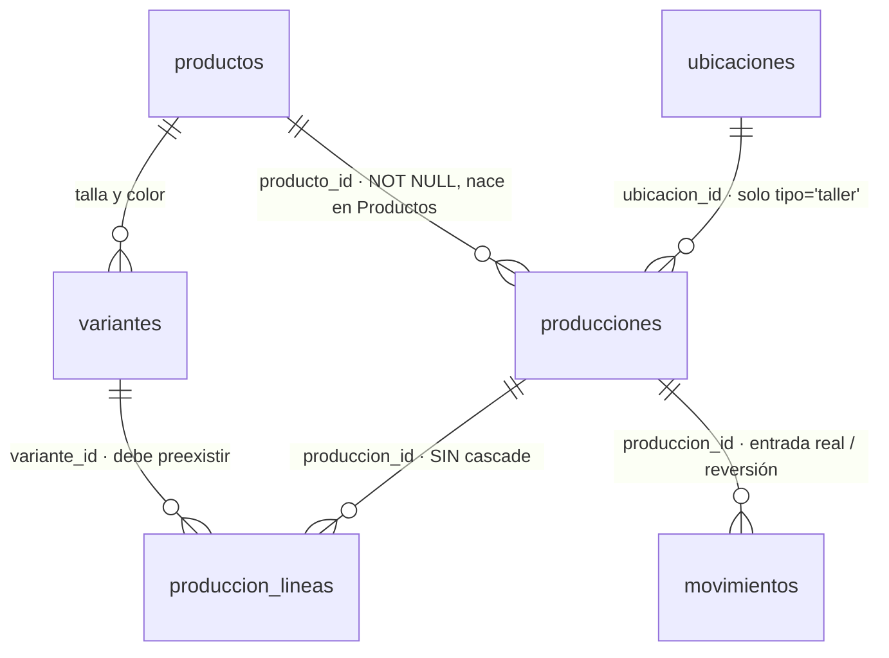
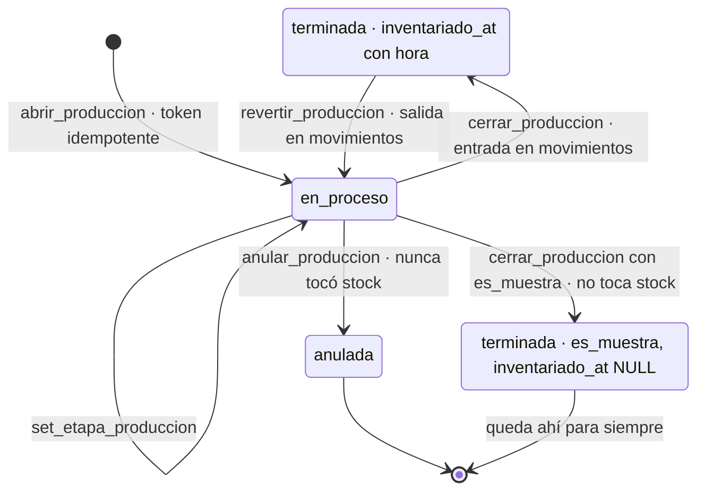

# 10 · Producción del Taller
> **Pájaro:** GALLITO · **Lo lleva:** _(libre — apúntate en `07-GOBIERNO.md`)_ · **Última revisión:** 2026-09-17

> **Nota 2026-09-17, sobre el resto de este documento (no sobre la sección de insumos
> del final, que sí está al día):** las tablas `producciones`/`produccion_lineas`/
> `ordenes_produccion` que siguen abajo se documentaron con `sedes`/`unidad_id` y
> `registrar_produccion`/5 RPC de la `0026`-`0029`. El Postgres local de HOY ya no
> tiene eso — `20260915130000_produccion_del_taller.sql` restauró el módulo sobre el
> modelo V2 (`ubicaciones`, `sububicaciones`, `ubicacion_id`, RPC `abrir_produccion`/
> `set_etapa_produccion`/`cerrar_produccion`/`anular_produccion`/`revertir_produccion`,
> estados `en_proceso`/`terminada`/`anulada`), verificado directo contra el Postgres
> local al escribir ADR-0090. Este documento no se reescribió entero bajo esa tarea
> (alcance: solo la sección de insumos) — queda pendiente un refresco completo.
## Para qué existe

El Taller de Lima fabrica prendas en continuo y las manda a TRU, AQP y LIM. Sin este
módulo nadie sabe cuánto costó de verdad una prenda que salió de la mesa de corte, ni
cuántas quedaron a medio hacer, ni si la corrida ya entró al inventario o las prendas
están apiladas en el Taller sin que el sistema las cuente. Es la única parte del ERP
donde el stock **nace** en vez de llegar de un proveedor: aquí se decide cuánto cuesta
la prenda que después se vende en tienda. Si el costo de aquí sale mal, el margen de
toda la cadena sale mal.

**Nota de versión.** Todo lo de abajo describe la reconstrucción sobre V2
(ADR-0051, 2026-09-15). El corte V1→V2 (`0af2f1b`, 2026-09-12) había borrado el
módulo entero a propósito — 8 migraciones (`0018`…`0031`) y tres componentes,
incluido `RecetaCosto.tsx` — porque no tenía pantalla propia y su data era de
prueba. Lo que sigue no es un refresh de nombres sobre el V1 que describía la
revisión anterior de este documento: es un módulo **reconstruido de cero** sobre
`ubicaciones`/`sububicaciones`/`movimientos` inmutables, no sobre `sedes`/`unidad_id`.

## El mapa

`bom_items` y `ordenes_produccion` —las dos tablas "legado" que la revisión anterior
de este documento describía en detalle— **ya no existen**. El corte V1→V2 las borró
con el resto del árbol viejo de Producción y nadie las reconstruyó: no había pantalla
viva que las necesitara (`RecetaCosto.tsx` también desapareció) y su data era de
prueba, no operación real. Quien busque "receta de costo por insumo" hoy no
encuentra nada — es exactamente el vacío que `10-ROADMAP-DATOS.md` (Prioridad 2 ·
Materia prima del Taller) propone llenar, todavía sin construir en esta rama.

Ciclo de vida de una orden de producción:

`inventariado_at` sigue siendo el candado del doble conteo: mientras tenga fecha,
`cerrar_produccion` se niega a cerrar otra vez. Lo nuevo es que la base también hace
imposible la fila incoherente por construcción (`producciones_terminada_coherente`,
ver Candados) — en V1 eso dependía de que cada RPC se comportara bien; en V2 es un
CHECK.

## Las tablas

### `producciones` — la cabecera de una corrida: qué modelo, en qué Taller, cuánto costó

**Existe en:** local y producción, tabla y 4 de sus 5 RPC (verificado 2026-09-15 por
Felipe contra la base de producción — ADR-0051). La única pieza que **no** llegó a
producción todavía es el cuerpo nuevo de `cerrar_produccion` (ver más abajo).
**Quién escribe:** `abrir_produccion` (abre) · `cerrar_produccion` (costo real +
inventario) · `set_etapa_produccion` (etapas) · `revertir_produccion` ·
`anular_produccion`. Ninguna pantalla la escribe directo, y a diferencia de V1 **no
hay policy que lo permita**: ver Candados.

| Columna | Tipo | Vacío | Por defecto | Para qué sirve |
|---|---|---|---|---|
| `id` | uuid | no | `gen_random_uuid()` | Identifica la corrida. |
| `ubicacion_id` | uuid → `ubicaciones(id)` | no | — | El Taller que produce. `abrir_produccion` rechaza cualquier ubicación cuyo `tipo` no sea `'taller'` — ya no basta con que la fila se *llame* Taller. |
| `producto_id` | uuid → `productos(id)` | **no** | — | El modelo que se fabrica. En V1 era nullable "por herencia"; en V2 es obligatorio desde el diseño: no hay corrida sin modelo. |
| `estado` | text | no | `'en_proceso'` · check `('en_proceso','terminada','anulada')` | Tres valores, no dos. El default ya no contradice lo que inserta `abrir_produccion` (en V1 el default decía `'terminado'` mientras el RPC insertaba `'en_proceso'`). |
| `es_muestra` | boolean | no | `false` | Desarrollo del modelo, no producción vendible. Nunca entra al inventario. |
| `etapas` | jsonb | no | `'{}'` | Mapa `{etapa: estado}`. Igual que en V1. |
| `costo_tela` / `costo_avios` / `costo_maquila` | numeric(12,2) | no | `0` | Los tres costos directos de la corrida, cada uno con `check (>= 0)` — nuevo respecto a V1, que no lo tenía. |
| `cantidad_plan` | integer | no | — | Cuántas prendas se planearon al abrir. Reemplaza a la `cantidad` única de V1: ahora plan y buenas son dos columnas. |
| `cantidad_buenas` | integer | sí | — | Cuántas salieron buenas. `NULL` hasta que `cerrar_produccion` la llena; ya cerrada, nunca es `NULL` (ver el CHECK de coherencia). |
| `costo_unitario` | numeric(12,2) **generada** | sí | `round((costo_tela+costo_avios+costo_maquila) / coalesce(cantidad_buenas, cantidad_plan), 2)` stored | El costo por prenda: divide entre las buenas si ya cerró, entre el plan si no. Sin `nullif` protegiendo la división — no hace falta, `cantidad_plan > 0` y `cantidad_buenas > 0` son CHECK, nunca hay un cero ahí. |
| `fecha_entrega` | date | sí | — | Para cuándo se comprometió. |
| `nota` | text | sí | — | Observación libre. `anular_produccion` le concatena el motivo de anulación (`concat_ws`) en vez de tener una columna aparte. |
| `inventariado_at` | timestamptz | sí | — | Cuándo entró al stock. El candado contra el doble conteo, igual que en V1. |
| `token_cliente` | uuid **unique** | sí | — | **Nuevo.** Idempotencia: `abrir_produccion(p_token := …)` con un token ya usado devuelve la misma corrida en vez de crear otra. Mismo patrón que `registrar_venta` (ADR-0032/33). Cierra el hueco de idempotencia que V1 nunca tuvo. |
| `creado_por` | uuid → `public.personas(id)` | sí | — | Quién abrió la corrida. Nota el schema: `personas` ya no es de `retail` — vive en `public`, compartida con la identidad de Dynamic desde el corte V1→V2. |
| `created_at` | timestamptz | no | `now()` | Cuándo se abrió. |

Columnas que **ya no existen** y sí existían en V1: `variante_id` (era el resto muerto
de la `0024`), `fecha` (nadie la leía), `precio_taller` (el precio de transferencia
interno — ver más abajo) y `detalle` (texto libre de tallas/colores; ahora
`produccion_lineas` lo modela de verdad).

**Candados** (lo que la base impide que pase):
- `producciones_estado_check` — el estado es uno de tres: `en_proceso`, `terminada`, `anulada`.
- `producciones_terminada_coherente` (**nuevo**) — `check ((estado = 'terminada' and cantidad_buenas is not null) or (estado <> 'terminada' and cantidad_buenas is null and inventariado_at is null))`. Hace imposible por construcción una fila "terminada sin buenas" o "en proceso con fecha de inventario" — en V1 esto dependía de que cada RPC se portara bien.
- `producciones_cantidad_plan_check` (`> 0`) y `producciones_cantidad_buenas_check` (`is null or > 0`) — en las dos bases por igual (la migración que las crea es la misma en local y producción).
- FK `ubicacion_id → ubicaciones(id)` **más** la validación en `abrir_produccion` de que esa ubicación sea `tipo = 'taller'`: no basta con que exista, tiene que ser el Taller de verdad.
- `token_cliente` único — dos aperturas con el mismo token son la misma corrida, no dos.
- Índices `producciones_ubicacion_estado_idx (ubicacion_id, estado, created_at desc)` y `producciones_producto_idx (producto_id)` — en las dos bases (mismo archivo).
- **RLS solo de lectura.** `producciones_select` es la única policy — no existe un `for all` como el `producciones_all_lider` de V1. Insert/update/delete están otorgados a nivel de tabla (`grant`) pero sin policy RLS que los autorice, así que **ninguna sesión autenticada puede escribir la tabla si no es a través de una RPC `security definer`**. Esto cierra el hueco que V1 dejaba abierto (ver "Pantallas que escriben directo", más abajo — ya no aplica).

**Diferencias local vs producción: ninguna, verificado en vivo el 2026-09-17.**
Las tablas, los índices, los checks y las 5 RPC —incluido el cuerpo de
`cerrar_produccion`— son idénticos en las dos bases. El encabezado de
`20260916090000_costo_promedio_ponderado.sql` dice *"Solo LOCAL. No aplicar en
producción sin autorización explícita de Felipe"*, pero eso ya no describe la
realidad: `pg_get_functiondef` contra el proyecto de producción
(`vovjyyiafkxteijimpuy`) muestra que `cerrar_produccion` ya llama
`fn_recalcular_costo_variante`, y `costo_historial` /
`fn_recalcular_costo_variante` / `fn_costo_historial` **existen en producción**.
Alguien lo aplicó sin actualizar el comentario del archivo — el mismo patrón que ya
había pasado antes con `produccion_del_taller` (ADR-0051) y con otras 10 migraciones
el 2026-09-16 (ver `commits-y-migraciones-en-produccion` en memoria): los
encabezados y los ADR dicen "no aplicado" horas o días después de que sí se aplicó.
**No confiar en el comentario de cabecera de una migración para saber si algo está
en producción — preguntarle a la base.**

Esto significa que D-45 (promedio ponderado) **ya se subió**, no está pendiente de
subir. Ver Decisiones.

---

### `produccion_lineas` — el desglose: cuántas unidades de cada talla y color

**Existe en:** local y producción, mismo archivo.
**Quién escribe:** `abrir_produccion` (inserta agrupando por variante — dos líneas
del formulario con la misma talla se suman, no se duplican, gracias al `unique`) y
`cerrar_produccion` (llena `cantidad_buenas`). Ninguna pantalla la escribe directo:
no tiene policy de insert/update/delete en ninguna base.

| Columna | Tipo | Vacío | Por defecto | Para qué sirve |
|---|---|---|---|---|
| `id` | uuid | no | `gen_random_uuid()` | Identifica la línea. |
| `produccion_id` | uuid → `producciones(id)` **sin cascade** | no | — | A qué corrida pertenece. |
| `variante_id` | uuid → `variantes(id)` | no | — | Qué SKU exacto. Tiene que pertenecer al `producto_id` de la corrida — `abrir_produccion` lo valida línea por línea. |
| `cantidad_plan` | integer | no | — | Cuánto se planeó de ese SKU. |
| `cantidad_buenas` | integer | sí | — | Cuánto salió bueno. A diferencia del total en `producciones.cantidad_buenas` (que nunca es cero), **una línea sí puede quedar en cero** — toda una talla puede salir mala mientras otras de la misma corrida están bien. |
| `created_at` | timestamptz | no | `now()` | Cuándo se agregó. |

**Candados:**
- `produccion_lineas_produccion_id_variante_id_key` (unique `(produccion_id, variante_id)`) — la misma talla-color no aparece dos veces en la misma corrida.
- `produccion_lineas_cantidad_plan_check` (`> 0`) y `produccion_lineas_cantidad_buenas_check` (`is null or >= 0`, **admite cero**).
- Sin policy de INSERT/UPDATE/DELETE: la única puerta de escritura son las RPC.

**Cambio de comportamiento respecto a V1:** en V1, `cerrar_produccion` **borraba** la
línea que quedaba en cero (el CHECK de V1 exigía `cantidad > 0`, así que cero no
podía guardarse). En V2 el CHECK de `cantidad_buenas` es `>= 0`: una talla que salió
completamente mala **se guarda en cero**, no se borra. Es un cambio de diseño
deliberado, no un descuido — deja ver en el desglose que esa talla se intentó y no
salió, en vez de que desaparezca de la corrida.

**Sin FK `on delete cascade`:** V1 sí la tenía. En V2 no hace falta: nada hace un
`DELETE` real sobre `producciones` (`anular_produccion` es un `UPDATE` de estado, no
un borrado), así que la ausencia de cascade no es un hueco — es que el borrado físico
que la justificaba ya no existe en el flujo.

---

### Las tablas de insumos (`bom_items`, y su reemplazo) — no están en ningún git de esta auditoría, pero sí en producción

La revisión anterior de este documento describía `bom_items` como "legado, pero
viva": tenía pantalla propia (`RecetaCosto.tsx`) y algo de uso. Eso ya no es cierto
en ningún sentido — la tabla **no existe**, la pantalla **no existe**. Lo que
reemplaza el concepto (`retail.insumos`, `recibir_insumo`, `ajustar_insumo_por_conteo`)
**existe en producción** (verificado 2026-09-17) pero no hay un `.sql` para eso en
`supabase/migrations/` de esta rama ni de `main` — ver Hueco 2 para el detalle
completo, incluida la tercera versión distinta que vive en otro worktree sin
mergear. `10-ROADMAP-DATOS.md` (Prioridad 2 · Materia prima del Taller) describe
esto como una propuesta todavía sin construir; no es exacto — está construido,
solo que en un lugar que ningún branch de git refleja.

## Columnas de otras tablas que este módulo escribe

- `variantes.costo` — la promedia (las dos bases, desde el 2026-09-16) tanto
  `cerrar_produccion` como `recibir_lote`/`recibir_compras`: las tres funciones
  comparten `fn_recalcular_costo_variante`. También dispara
  `historial_producto_cambios` (rama agregada por la misma migración del 2026-09-16):
  el cambio de costo se audita gratis en `/productos/[id]/historial`.
- `movimientos.produccion_id` (**nuevo**) — cada entrada o reversión de una corrida
  apunta a su orden con una FK real. En V1 esto se resolvía escribiendo el prefijo de
  8 caracteres del id en el texto libre de `nota`; ahora es una columna consultable.
- `movimientos` recibe la entrada/salida real vía `fn_aplicar_movimiento`, siempre en
  la sububicación `almacen_tienda` del Taller (`fn_sububicacion_por_defecto(·,
  'entrada')` para cerrar, `'venta'` → `piso_venta` para revertir — ver Huecos sobre
  esa asimetría). **Esto resuelve** el hueco de V1 donde la producción entraba al
  piso de venta en vez de al almacén (D-42): hoy `cerrar_produccion` entra a
  `almacen_tienda`, no a `piso_venta`.

Lo que este módulo **ya no escribe**, porque las columnas o las pantallas
desaparecieron: `variantes.precio_taller` (columna eliminada), `productos.material`
(no existe en el esquema V2 — ADR-0051 lo dice explícito: "no se agrega desde
Producción"), `productos.costo_mano_obra` (la escribía `RecetaCosto.tsx`, que ya no
existe).

## Cómo se escribe (la única puerta)

Las cinco RPC son `security definer` con `set search_path`. El candado sigue siendo
de ubicación, no de rol: `fn_puede_operar_ubicacion(ubicacion_id)` — que es
`fn_es_lider() or ubicacion_id = fn_ubicacion_actual_persona()`, el reemplazo directo
de `fn_puede_operar_sede`. Quien trabaja en el Taller puede abrir, avanzar, cerrar,
revertir y anular corridas del Taller; quien trabaja en una tienda no puede tocar
ninguna — y además, desde el 2026-09-17, ni siquiera puede **entrar a la pantalla**
aunque sea Líder (ver "Quién ve y quién toca").

| Función | Firma | Candado | Idempotente |
|---|---|---|---|
| `abrir_produccion` | `(p_ubicacion_id uuid, p_producto_id uuid, p_lineas jsonb, p_costo_tela numeric default 0, p_costo_avios numeric default 0, p_costo_maquila numeric default 0, p_es_muestra boolean default false, p_fecha_entrega date default null, p_nota text default null, p_token uuid default null) returns uuid` | ubicación + `tipo='taller'` | **Sí.** `p_token` repetido devuelve la misma corrida (`token_cliente` unique). `NuevaOrdenProduccionForm.tsx:97` ya lo manda. |
| `set_etapa_produccion` | `(p_produccion_id uuid, p_etapa text, p_estado text) returns void` | ubicación | **Sí.** `etapas \|\| jsonb_build_object(...)`: repetir no cambia nada. |
| `cerrar_produccion` | `(p_produccion_id uuid, p_buenas jsonb, p_costo_tela numeric, p_costo_avios numeric, p_costo_maquila numeric) returns void` | ubicación | **Sí, por guarda.** Se niega si `estado <> 'en_proceso'` o `inventariado_at` ya tiene fecha: *"Esta orden ya está cerrada"*. |
| `anular_produccion` | `(p_produccion_id uuid, p_motivo text default null) returns void` | ubicación | **Sí, por guarda.** Solo anula una orden `en_proceso`; nunca tocó stock, así que no hay nada que deshacer. |
| `revertir_produccion` | `(p_produccion_id uuid) returns void` | ubicación | **Sí, por guarda.** Solo revierte una orden `terminada`. Si ya se vendió parte de esas prendas, `fn_aplicar_movimiento` frena la salida: todo o nada. |

`p_etapa` acepta las seis en las dos bases desde el mismo día: `'patronaje' |
'muestra' | 'escalado' | 'corte' | 'confeccion' | 'acabado'`. `p_estado` acepta
`'pendiente' | 'hecho' | 'tercerizado'`. El drift de 15-vs-16 argumentos de
`registrar_produccion` que dominaba la revisión anterior de este documento **ya no
existe como problema**: esa función no existe más — `abrir_produccion` es una
función distinta, con una sola firma de 10 argumentos, la misma en local y
producción, y sin el equivalente a `p_material` (que nunca se reconstruyó — ver
arriba).

`registrar_produccion`, `eliminar_produccion`, `revertir_produccion_inventario` y
`marcar_produccion_terminada` — los cuatro nombres que usaba V1 — **no existen en
ningún branch de esta rama**. Quien encuentre esos nombres en un ADR viejo, en
`packages/database/src/types.ts` desactualizado o en una captura de pantalla vieja
está viendo V1.

**Las variantes nunca nacen desde una orden (decisión de ADR-0051).** V1 dejaba
tipear tallas y colores libres en el formulario y `registrar_produccion` creaba la
variante al vuelo — eso producía prendas sin precio y colores duplicados
("Negro"/"negro"). `abrir_produccion` exige que la variante ya exista y pertenezca al
`producto_id` elegido; la pantalla (`NuevaOrdenProduccionForm.tsx`) muestra una
matriz color × talla donde una combinación sin variante se ve como "—" con un enlace
a Productos. Es un candado de diseño, no solo de base.

**Pantallas que escribían directo a una tabla, sin RPC — resuelto.** La revisión
anterior de este documento dedicaba una sección entera a esto: `RecetaCosto.tsx`
escribiendo `bom_items`/`productos.costo_mano_obra`/`variantes.costo` sin pasar por
ninguna función, más la policy `producciones_all_lider` (`for all`) que dejaba
escribir `producciones` directo con la llave anónima. Los dos huecos están cerrados
en V2: `RecetaCosto.tsx` no existe, y `producciones`/`produccion_lineas` no tienen
ninguna policy de escritura — sin excepción, ni para Líder.

## Quién ve y quién toca

El vocabulario de rol cambió: `retail.colaboradores.rol` acepta `'lider'` o
`'colaborador'` (no `'integrante'` — ese era el valor en la tabla `personas` propia
de V1, que ya no existe). La identidad (`public.personas`: `auth_user_id`, `estado`)
vive separada del perfil de retail (`retail.colaboradores`: `rol`,
`ubicacion_asignada_id`), unidas por `persona_id`.

| Operación | Líder de equipo | Colaborador | Solo lectura |
|---|---|---|---|
| Entrar a `/produccion` | **Solo si su propia ubicación es el Taller** (`persona.ubicacionTipo !== "taller"` → `redirect("/")`, sin excepción de rol) | Igual: solo si su ubicación es el Taller | — |
| Abrir, avanzar, cerrar, revertir, anular una corrida (vía RPC) | Sí, desde cualquier ubicación (`fn_es_lider()` pasa el candado) | Sí, si la corrida es del Taller y esa es su ubicación | — |
| Ver las corridas (`producciones`, `produccion_lineas`) | Sí | Solo las del Taller si esa es su ubicación | — |

**El dato que vale la pena resaltar:** desde el 2026-09-17
(`app/(app)/produccion/page.tsx`, comentario en el propio archivo), un Líder de
equipo cuya ubicación asignada es una tienda **ya no puede entrar a la pantalla de
Producción**, ni siquiera por URL directa — la excepción "líder desde cualquier
ubicación" duró dos días y Felipe pidió revertirla. Pero si ese mismo Líder llamara
la RPC directo (por ejemplo, desde la consola), `fn_puede_operar_ubicacion` **sí lo
dejaría pasar**, porque `fn_es_lider()` sigue estando en el OR. Es una asimetría
consciente entre la pantalla (más estricta) y la base (la de siempre) — no es un
hueco de seguridad, porque el candado real es el de la base y ese no se relajó, pero
vale saber que la pantalla es hoy más restrictiva que la RPC que llama.

Los cuatro niveles de D-12 (Admin / Líder / Colaborador / Solo lectura) siguen sin
existir como tales en este módulo: la base solo distingue Líder de todo lo demás,
igual que antes del corte V1→V2.

## Qué se rompe sin esto

Sin este módulo el Taller produce a ciegas: nadie sabe qué hay en la mesa, qué está
pasado de fecha, ni cuánto costó la corrida que salió ayer. Las prendas fabricadas
dejan de entrar al inventario, así que el stock del Taller queda en cero para siempre
y las tiendas no ven mercadería que existe físicamente — todo lo que se calcula sobre
stock (alertas de reposición, valorización, "qué se está quedando") queda mal
mientras dure. El costo de la prenda deja de actualizarse: cada venta de un modelo
del Taller se registra con el costo viejo, y el margen por sede que exige D-30 se
vuelve un número inventado. Y como este es el único lugar del ERP donde el stock nace
en vez de llegar comprado, no hay ninguna otra puerta por la que esas prendas puedan
entrar al sistema.

## Huecos conocidos

1. ~~`cerrar_produccion` calcula el costo distinto en local y en producción~~ —
   **resuelto, verificado 2026-09-17.** D-45 (promedio ponderado) ya está en las dos
   bases. Se deja tachado en vez de borrado: el comentario de cabecera de la
   migración todavía dice "Solo LOCAL", así que alguien que lea el archivo sin este
   documento va a creer que sigue pendiente.

2. **Insumos ya existe en producción, con una forma que no coincide con ningún
   archivo de este repo — y sin conectar todavía con el costo de la corrida.**
   `retail.insumos` (`codigo`, `nombre`, `tipo`, `unidad_medida`, `proveedor_id`,
   `merma_pct`, `stock_minimo`, `archivado_at`, `nota`) y las funciones
   `recibir_insumo`, `ajustar_insumo_por_conteo` **existen en producción**
   (verificado 2026-09-17), pero no en `supabase/migrations/` de esta rama ni de
   `main` — es el mismo patrón que ya le pasó una vez a `produccion_del_taller`
   (ADR-0051): se escribió y aplicó sin dejar el `.sql` en git. Y aunque existiera
   acá, sería una implementación **distinta** a la que se ve en el worktree
   `cayla-invoices-module-review-451aa5` (`insumos.unidad`/`activo`, funciones
   `recibir_insumos`/`registrar_consumo_insumos` — nombres y columnas distintos):
   hay al menos tres versiones de "insumos" dando vueltas y ninguna es la otra.
   **Lo que sigue igual:** `cerrar_produccion` (ver arriba, cuerpo completo) no
   llama nada de `insumos` — sigue recibiendo `costo_tela`/`costo_avios`/
   `costo_maquila` como números sueltos. El catálogo de insumos existe; el puente
   que D-47 pide entre "lo que se consumió" y "lo que costó la corrida" no. Ver
   `10-ROADMAP-DATOS.md`, Prioridad 2 — que describe esto como "no construido
   todavía", y tampoco es exacto.

3. **No existe la referencia de maquila externa que D-31 exige.** `costo_maquila` es
   el gasto real tercerizado de esa corrida, no una cotización de comparación. No hay
   tabla, columna ni pantalla que guarde "cuánto me cobraría un taller de afuera por
   esta prenda". **Consecuencia:** la mitad del criterio de medición del Taller
   (D-31) sigue sin dónde guardarse. (Sin cambios respecto a la revisión anterior.)

4. **No existe la medición de eficiencia del Taller que D-31 pide** ("lo que gastó
   contra lo que absorbió en las prendas que produjo"). `grep -rn "eficiencia"
   apps/web` sigue sin devolver nada. (Sin cambios respecto a la revisión anterior.)

5. **Nada de lo que fabrica el Taller llega al libro contable.** Ninguna RPC de este
   módulo llama a `registrar_asiento`. (Sin cambios respecto a la revisión anterior —
   D-35 sigue sin empezar por acá.)

6. **La pantalla es más estricta que la base sobre quién entra a Producción — ver
   "Quién ve y quién toca".** No es un hueco de seguridad (el candado real sigue en
   la RPC), pero es una asimetría reciente (2026-09-17) que vale la pena que quien
   toque este módulo conozca antes de "corregirla" sin saber que fue a propósito.

**Resueltos desde la revisión anterior (2026-09-12), y por qué ya no aparecen
arriba:** el drift de 15-vs-16 argumentos de `registrar_produccion` (la función no
existe más); las 6 etapas solo en producción (mismo archivo en las dos bases ahora);
`productos.material` requerido por la pantalla en local (no existe en el esquema V2,
ninguna pantalla lo pide); la alarma permanente de muestras cerradas en
`pendientes.ts` (el archivo no existe); las cuatro escrituras directas de
`RecetaCosto.tsx` y la policy `producciones_all_lider` (ambas desaparecieron); la
falta de idempotencia en la apertura (`token_cliente`); el precio de transferencia
interno `precio_taller` contradiciendo D-31 (la columna no existe, y el semáforo de
margen en `produccion-reglas.ts` ahora compara contra el precio de venta real, no
contra un precio inventado); la producción entrando al piso de venta en vez del
almacén (D-42 — ahora entra a `almacen_tienda`); `ordenes_produccion` muerta pero
amarrada a `recibir_lote` (la tabla no existe, y el `recibir_lote` de V2 nunca tuvo
ese parámetro); las columnas muertas `producciones.variante_id`/`fecha` (no existen
en la tabla V2, que se creó desde cero).

## Materia prima del Taller (D-47) — esquema huérfano de producción, adoptado 2026-09-17

Primera versión construida hoy desde cero (commit `fd3488f`), descartada el mismo día
al descubrir que producción ya tenía un esquema para esto — huérfano, 0 filas, sin
código de `apps/web` que lo use, del volcado de unificación con Dynamic de julio-2026.
Felipe decidió adoptarlo tal cual en vez de seguir con el diseño propio. `ADR-0090`
tiene la historia completa y la verificación; acá solo el estado actual. Resuelve el
hueco 9: hasta acá, `costo_tela`/`costo_avios` eran montos tecleados sin nada real
detrás.

**Migraciones:** `supabase/migrations/20260917140000_insumos_taller_reconstruido.sql`
(SOLO local — recrea lo que producción ya tiene, para poder desarrollar contra algo
real sin tocar producción; reconstruido de forma independiente por dos sesiones el
mismo día, ver ADR-0090 "Reconciliación") +
`supabase/migrations/20260917141500_registrar_consumo_insumo.sql` (la única pieza
nueva de verdad; migración normal, SÍ pendiente de aplicar en producción). Usa
`ubicacion_id`/`fn_puede_operar_ubicacion` (el modelo real, ver nota al inicio de este
documento) — a diferencia del resto de `docs/datos/10-ROADMAP-DATOS.md`, que diseñó
esta misma idea contra `sede_id` (ese diseño quedó descartado junto con la primera
versión de hoy).

| Tabla / vista | Existe en | Qué guarda | Notas |
|---|---|---|---|
| `insumos` | local (espejo) y producción | Catálogo: `codigo`, `nombre`, `tipo` (`tela`\|`avio`), `unidad_medida` (`metro`\|`unidad`\|`kilo`\|`cono`\|`par`\|`docena`), `proveedor_id`, `merma_pct`, `stock_minimo`, `archivado_at` | Hermana de `productos`, nunca entra a `variantes`. Select autenticado, insert/update líder (policies `insumos_select_autenticado`/`insumos_insert_lider`/`insumos_update_lider`, verificadas contra producción) — sin policy de DELETE, se archiva. |
| `insumo_lotes` | local (espejo) y producción | Una fila por ENTRADA: `insumo_id`, `ubicacion_id`, `codigo_lote`, `proveedor_id`, `cantidad_ingresada`, `costo_unitario`, `documento`, `fecha_ingreso`, `origen` (`compra`\|`saldo_inicial`) | Seguimiento por lote, no un promedio global — la diferencia principal contra el diseño descartado. Unique parcial `(insumo_id, codigo_lote) where codigo_lote is not null`. Solo `select` vía RLS (`fn_puede_operar_ubicacion`); se escribe solo por RPC. |
| `movimientos_insumo` | local (espejo) y producción | Historial append-only: `tipo` (`compra`\|`consumo`\|`devolucion`\|`merma`\|`ajuste`), `cantidad`, `costo_unitario`, `insumo_lote_id`, `produccion_id`, `usuario_id`, `motivo` | `produccion_id` liga consumo↔corrida directo — no existe (ni hace falta) una tabla puente tipo `produccion_insumos`: el constraint `movimientos_insumo_produccion_segun_tipo` ya exige ese vínculo para `consumo`/`devolucion` y lo prohíbe para el resto. Solo `select` vía RLS; se escribe solo por RPC. |
| `v_insumo_saldos` | local (espejo) y producción | Vista: `sum` de `movimientos_insumo` con signo, agrupado por insumo+ubicación → `fisico`, `valor` | Stock derivado, nunca una tabla a mano. **Sin `security_invoker`** (confirmado contra producción) — si algún día una pantalla la consulta directo con la sesión del usuario, no filtra por ubicación (el dueño de la vista tiene `BYPASSRLS`). Hoy inerte (0 filas, solo la consultan funciones `security definer`), pero real — ver ADR-0090. |

**RPC (`security definer`, `fn_puede_operar_ubicacion` como candado, `EXECUTE` revocado
de `PUBLIC`):**

| Función | Existe en | Firma | Qué hace |
|---|---|---|---|
| `recibir_insumo` | local (espejo) y producción | `(p_insumo_id uuid, p_ubicacion_id uuid, p_cantidad numeric, p_costo_total numeric, p_codigo_lote text default null, p_proveedor_id uuid default null, p_documento text default null, p_origen text default 'compra', p_nota text default null) returns uuid` | Entrada de materia prima: crea el lote y su movimiento `compra` gemelo. Devuelve el id del lote. |
| `ajustar_insumo_por_conteo` | local (espejo) y producción | `(p_insumo_id uuid, p_ubicacion_id uuid, p_cantidad_contada numeric, p_motivo text) returns uuid` | Ajuste por conteo físico: compara contra `v_insumo_saldos`, inserta un `movimientos_insumo` tipo `ajuste` con la diferencia (con motivo obligatorio). Sin diferencia, no inserta nada (`returns null`). |
| `registrar_consumo_insumo` | **solo local — pendiente en producción** | `(p_produccion_id uuid, p_insumo_id uuid, p_cantidad numeric, p_nota text default null) returns uuid` | La pieza nueva: consumo real al cortar. Elige el lote MÁS ANTIGUO con saldo > 0 (`for update` sobre esa fila — no hay tabla de stock que bloquear en este esquema), recalcula su saldo después del lock, y NO parte el consumo entre lotes (rechaza con el saldo exacto si no alcanza). **Exige `producciones.estado = 'en_proceso'`** — se registra antes de cerrar, nunca después. Recalcula `producciones.costo_tela`/`costo_avios` (según `insumos.tipo`) sumando el consumo real de esa producción, pero solo el campo cuyo tipo tuvo al menos una fila. También bloquea `producciones` desde el inicio (protege el recálculo de costo de una carrera entre dos consumos concurrentes de la misma corrida). Ver ADR-0090 para los 10 escenarios verificados, incluida concurrencia real con dos procesos. |

**No conectado todavía:** `NuevaOrdenProduccionForm.tsx` sigue mandando `costo_tela`/
`costo_avios` tecleados a `abrir_produccion`, sin pasar por `recibir_insumo`/
`registrar_consumo_insumo` — cablear la pantalla es otra sesión. Tampoco hay pantalla
de alerta de stock mínimo (`insumos.stock_minimo` contra `v_insumo_saldos.fisico`): la
columna existe, la lectura no se construyó.

## Decisiones que lo gobiernan

- **D-31** — El Taller se mide por costo absorbido + referencia de maquila, nunca por
  precio de transferencia interno. `precio_taller` ya no existe (resuelto); la
  referencia de maquila y la eficiencia siguen sin construirse (huecos 3 y 4).
- **D-45** — Costeo del inventario. Estaba **abierta** en `DECISIONES-2026-09-12.md`;
  el 2026-09-16 se decidió **promedio ponderado**, y al 2026-09-17 ya está aplicado
  en local **y en producción** (hueco 1, resuelto). `10-ROADMAP-DATOS.md` todavía la
  describe como abierta — desactualizado en ese punto específico.
- **D-47** — Inventario de insumos completo: la tela entra, se descuenta al cortar y
  avisa cuando falta. **Resuelto en local 2026-09-17** (hueco 9 cerrado): el esquema
  huérfano de producción se adoptó tal cual (catálogo + recepción + ajuste por
  conteo, ya en producción desde julio) y se construyó la pieza que faltaba,
  `registrar_consumo_insumo` — ver sección "Materia prima del Taller" arriba y
  ADR-0090. Falta pegar esa única función en producción y conectar la pantalla.
- **D-15** — El Taller es una ubicación con poderes especiales: ahora modelado de
  verdad con `ubicaciones.tipo = 'taller'`, no solo por convención de nombre como en
  V1.
- **D-42** — La mercadería nueva entra al almacén, no al piso. Resuelto para este
  módulo: `cerrar_produccion` entra a `almacen_tienda`.
- **D-16 / D-07** — Cada tabla dice en qué base existe; lo que se borra se documenta
  con el motivo. `bom_items` y `ordenes_produccion` pasaron de "muerto pero vive" a
  "borrado, sin sucesor todavía" — este documento es el registro de ese paso.
- **D-12** — Los cuatro niveles de permiso. Este módulo sigue conociendo solo dos
  (Líder / Colaborador).
- **D-24** — Las promesas incumplidas se documentan con la cita de dónde se
  prometen.
- **ADR-0051** — La decisión completa de esta reconstrucción: por qué sobre V2 y no
  resucitando V1, por qué las variantes no nacen desde una orden, y la lista de "lo
  que la base vuelve imposible" que este documento reorganiza por tabla.
- **ADR-0067 / ADR-0072** — Costo de variante a promedio ponderado, y por qué el
  vocabulario se porta pero no se fusiona entre V1 y V2 (explica por qué no se
  intentó "reconciliar" nombres viejos y nuevos en este módulo).
- **ADR-0032 / ADR-0033** — Idempotencia por token, el patrón que `abrir_produccion`
  ya adoptó (a diferencia de `registrar_produccion`, que nunca lo tuvo).
- **ADR-0090** — Inventario de insumos del Taller: por qué se adoptó el esquema
  huérfano de producción en vez de un diseño nuevo, y la reconciliación entre dos
  sesiones que llegaron a la misma reconstrucción por separado el mismo día.
