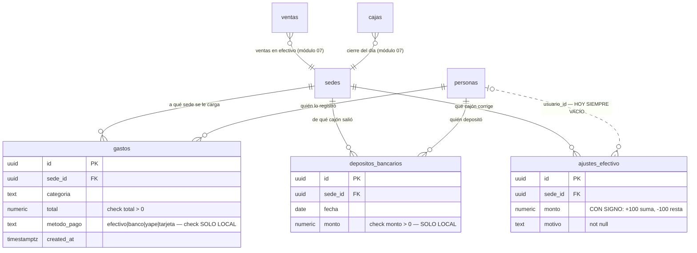
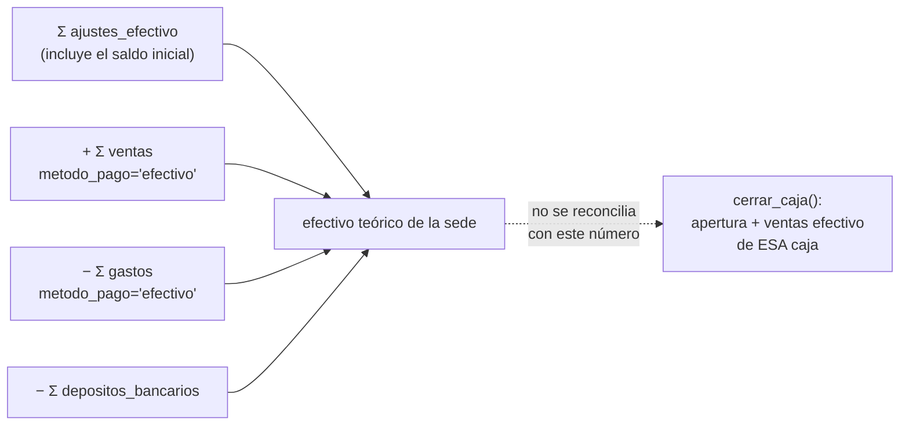

# 11 · Finanzas operativas
> **Pájaro:** GARZA · **Lo lleva:** _(libre — apúntate en `07-GOBIERNO.md`)_ · **Última revisión:** 2026-09-12

## Para qué existe

En una tienda el cajón físico no cuadra por magia: entra plata por las ventas en
efectivo, sale plata cuando alguien paga el agua o el flete con billetes de ahí mismo,
y sale plata cuando el efectivo se lleva al banco. Este módulo es el que anota esas
tres salidas y entradas para que el sistema pueda responder, en cualquier momento del
día, **cuánto efectivo debería haber en cada tienda ahora mismo**.

Encima de eso carga la otra mitad: los gastos son el renglón que convierte "vendí
S/40,000" en "gané X". Sin `gastos` cargados a la sede correcta no hay estado de
resultados por sede (D-30), y sin estado de resultados por sede Felipe decide a ciegas
cuál tienda sostiene a cuál.

## El mapa



Cómo se arma el efectivo teórico de una sede (`lib/finanzas-nucleo.ts:121`):



La flecha punteada es un hueco, no un flujo: son dos cuentas distintas del mismo
cajón que nunca se encuentran. Ver hueco 5.

## Las tablas

### `gastos` — cada salida de plata que no es compra de mercadería

**Existe en:** local y producción (0 filas en producción al 2026-09-12 —
`generado/DICCIONARIO-RETAIL.md`)
**Quién escribe:** solo la RPC `registrar_gasto`, llamada desde
`RegistrarGastoModal.tsx:57`. Ninguna pantalla inserta directo.

| Columna | Tipo | Vacío | Por defecto | Para qué sirve |
|---|---|---|---|---|
| `id` | uuid | no | `gen_random_uuid()` | La identidad de este gasto. |
| `sede_id` | uuid | no | — | A qué sede se le carga la plata. Es la columna de la que sale el estado de resultados por sede (D-30) y la que recibe los gastos comunes en `CCO` (D-32). Apunta a `sedes` — en producción esa `sedes` es una **vista** sobre `public.sedes` de Dynamic. |
| `categoria` | text | no | — | En qué se gastó. Texto libre a nivel de base; la pantalla solo ofrece las 8 de `GASTO_CATEGORIAS` (`packages/shared/src/enums.ts:60`). La base acepta cualquier cosa. |
| `subtotal` | numeric(12,2) | no | `0` | El monto sin IGV. La pantalla lo calcula al revés desde el total (`RegistrarGastoModal.tsx:42`), porque el comprobante muestra el total pagado. |
| `igv` | numeric(12,2) | no | `0` | El IGV del comprobante. Hoy nadie lo usa para crédito fiscal — es el dato guardado esperando a D-46. |
| `total` | numeric(12,2) | no | — | Lo que realmente salió. Es el único de los tres que la app lee para sumar (`lib/egresos.ts:50`, `lib/finanzas-nucleo.ts:61`). |
| `especificacion` | text | sí | — | La frase que escribe quien registra: "Alquiler julio", "luz". Lo único que después permite reconocer el gasto en la tabla de Egresos. |
| `usuario_id` | uuid | sí | — | Quién lo registró. Lo llena la RPC desde `auth.uid()`, nunca el cliente. |
| `created_at` | timestamptz | no | `now()` | Cuándo se registró. **Es la fecha que define a qué mes pertenece el gasto** — no hay columna `fecha` propia, así que un gasto de junio anotado en julio cae en julio. |
| `metodo_pago` | text | sí | — | Con qué se pagó: `efectivo`, `banco`, `yape`, `tarjeta`. Solo `efectivo` baja el cuadre de la sede. **En producción esta columna es MUERTA** (ver abajo). |

**Candados** (lo que la base impide que pase):

- `gastos_total_check` — `check (total > 0)`. Un gasto de S/0 o negativo es imposible. **En las dos bases** (0007:51, y verificado en producción en `generado/DICCIONARIO-RETAIL.md`).
- `gastos_metodo_pago_check` — `check (metodo_pago in ('efectivo','banco','yape','tarjeta'))`. **Solo local** (`0013_finanzas_nucleo.sql:35`). En producción `metodo_pago` es `text` a secas (`unificacion/05_operacion.sql:94`): acepta `"efctivo"`, `"tarjeta visa"` o cualquier cosa, y ese gasto deja de contarse en el cuadre sin que nada avise.
- FK a `sedes(id)` y a `personas(id)` — en las dos bases. En producción cruzan de schema: `retail.gastos` referencia `public.sedes` y `public.personas`, que son de Dynamic.
- **No hay** índice único de ningún tipo: dos gastos idénticos el mismo segundo son dos filas legítimas. Ver hueco 10.

**`gastos.metodo_pago` en producción — ⚰️ MUERTA.** La columna existe y está vacía en
todas las filas, porque la única función que la llenaría (`registrar_gasto` de 7
argumentos) **nunca se pegó en producción**. Sigue viva porque la migración local
`0014` la usa y porque el día que se pegue el gemelo en `unificacion/` vuelve a
funcionar sin tocar datos. Ver hueco 1.

**Diferencias local vs producción:**

| | Local | Producción |
|---|---|---|
| `check` de `metodo_pago` | sí (`0013:35`) | **no** |
| índice `gastos_sede_id_idx` | sí (`0007:55`) | **no** — `unificacion/05_operacion.sql` no crea ninguno. Filtrar Egresos por sede recorre la tabla entera |
| policy | `gastos_all_lider` sobre `fn_es_lider()` | `gastos_all_lider` sobre `retail.es_lider()` = `fn_rol_actual() = 'admin'` |

---

### `depositos_bancarios` — el efectivo que sale del cajón y se lleva al banco

**Existe en:** local y producción (0 filas en producción —
`generado/DICCIONARIO-RETAIL.md`)
**Quién escribe:** la RPC `registrar_deposito`, llamada desde `EfectivoPanel.tsx:35`.

| Columna | Tipo | Vacío | Por defecto | Para qué sirve |
|---|---|---|---|---|
| `id` | uuid | no | `gen_random_uuid()` | La identidad del depósito. |
| `sede_id` | uuid | no | — | De qué cajón salió esa plata. |
| `fecha` | date | no | `current_date` | El día del depósito. **La app nunca la usa para filtrar** — el cuadre suma todos los depósitos de la historia (`lib/finanzas-nucleo.ts:130`). Solo se muestra en el listado de la pantalla. |
| `monto` | numeric(12,2) | no | — | Cuánto se llevó al banco. Siempre positivo: resta del teórico. |
| `nota` | text | sí | — | "Depósito BCP", el número de voucher, lo que sirva para encontrarlo después en el extracto. |
| `usuario_id` | uuid | sí | — | Quién lo registró. Lo llena la RPC desde `auth.uid()`. |
| `created_at` | timestamptz | no | `now()` | Cuándo se anotó (distinto de `fecha`, que es cuándo se depositó). |

**Candados:**

- `depositos_bancarios_monto_check` — `check (monto > 0)`. **Solo local**
  (`0013_finanzas_nucleo.sql:43`). En producción la tabla no tiene ningún `check`
  (`generado/DICCIONARIO-RETAIL.md`-834`): la única defensa es el `if p_monto <= 0` de la
  RPC, y la policy `depositos_insert` deja insertar por API sin pasar por ella. Ver hueco 8.
- FK a `sedes(id)` y `personas(id)` — en las dos bases.

**Diferencias local vs producción:**

| | Local | Producción |
|---|---|---|
| `check (monto > 0)` | sí | **no** |
| índice `depositos_bancarios_sede_idx` | sí (`0013:48`) | **no** |
| policies de SELECT | dos: `depositos_select_lider` (`fn_es_lider()`) y `depositos_select_propia_sede` (`sede_id = fn_sede_actual_persona()`) | una: `depositos_select` (`retail.puede_operar_sede(sede_id)`) |
| policy de INSERT | `depositos_insert` con `fn_puede_operar_sede(sede_id)` — que **también acepta el almacén asociado a tu tienda** (`0012:16`) | `depositos_insert` con `retail.puede_operar_sede(sede_id)` = admin **o** tu propia sede, sin la rama del almacén (`unificacion/03_candados.sql:76`) |

---

### `ajustes_efectivo` — la corrección manual del efectivo teórico de una sede

**Existe en:** local y producción (0 filas en producción —
`generado/DICCIONARIO-RETAIL.md`)
**Quién escribe:** **NADIE por RPC.** `EfectivoPanel.tsx:43` hace
`supabase.from("ajustes_efectivo").insert({...})` directo contra la tabla. Es la
única escritura de plata del sistema que no pasa por una función del servidor.

| Columna | Tipo | Vacío | Por defecto | Para qué sirve |
|---|---|---|---|---|
| `id` | uuid | no | `gen_random_uuid()` | La identidad del ajuste. |
| `sede_id` | uuid | no | — | Qué cajón se está corrigiendo. |
| `fecha` | date | no | `current_date` | El día del ajuste. **La pantalla no la manda** y la app no la lee: queda siempre en la fecha en que se apretó el botón. |
| `monto` | numeric(12,2) | no | — | **Va con signo**: `+100` sube el teórico, `-100` lo baja (`0013:56`). Es el único campo de plata con signo en todo el módulo. Sin `check`: un ajuste de `0` entra sin quejarse. |
| `motivo` | text | no | — | Por qué se corrige. Obligatorio en la base — pero la pantalla rellena `"Ajuste sin motivo"` si el campo viene vacío (`EfectivoPanel.tsx:46`), así que el candado no obliga a nadie a explicar nada. |
| `usuario_id` | uuid | sí | — | Quién lo hizo. **Hoy siempre vacío**: el insert de `EfectivoPanel.tsx:43-47` manda solo `sede_id`, `monto` y `motivo`. Ver hueco 2. |
| `created_at` | timestamptz | no | `now()` | Cuándo se hizo. |

**Candados:**

- `ajustes_efectivo_pkey` y las dos FK. **Y nada más, en ninguna de las dos bases.**
  No hay `check` sobre `monto`, ni sobre `motivo` no-vacío, ni tope de magnitud. Una
  fila de `+999999` con motivo `"a"` es una escritura perfectamente válida que sube el
  patrimonio declarado de CAYLA en un millón de soles.

**Diferencias local vs producción:** ninguna en la forma de la tabla. La policy se
llama `ajustes_efectivo_all_lider` en local (`0013:110`) y `ajustes_all_lider` en
producción (`unificacion/05_operacion.sql:128`); las dos son `FOR ALL` y las dos
apuntan a su respectivo "es líder".

## Cómo se escribe (la única puerta)

Las dos RPC del módulo son `security definer` con `search_path` fijo. La tercera
operación —el ajuste— no tiene puerta: entra por la ventana.

### `registrar_gasto(...) → uuid` — **LAS DOS BASES TIENEN FIRMAS DISTINTAS**

```sql
-- LOCAL (0014_gasto_metodo_pago.sql:7) — 7 argumentos
registrar_gasto(p_sede_id uuid, p_categoria text, p_subtotal numeric, p_igv numeric,
                p_total numeric, p_especificacion text default null,
                p_metodo_pago text default null) → uuid

-- PRODUCCIÓN (unificacion/07_funciones_operacion.sql:175) — 6 argumentos
retail.registrar_gasto(p_sede_id uuid, p_categoria text, p_subtotal numeric,
                       p_igv numeric, p_total numeric,
                       p_especificacion text default null) → uuid
```

La firma de producción está confirmada contra la base real, no contra el archivo:
`generado/RPCS.md:151` la leyó del catálogo de Postgres el 2026-09-12 y devuelve 6
argumentos. **Y el modal manda 7** (`RegistrarGastoModal.tsx:57-65`, con
`p_metodo_pago: metodoPago`). En producción esa llamada no resuelve contra ninguna
función: PostgREST responde `PGRST202` y `traducirError` cae al último renglón
(`lib/error-escritura.ts:194`), así que el Líder de equipo lee *"No se pudo registrar
el gasto. Vuelve a intentar; si sigue igual, avisa a Felipe. Código: …"*. **Registrar
un gasto está roto en producción.** Ver hueco 1.

- **Candado de permiso: rol, no sede.** `if not fn_es_lider()` (local, `0014:25`) /
  `if not retail.es_lider()` (producción, `unificacion/07:183`). Un Líder de equipo
  puede cargarle un gasto a **cualquier** sede, incluida `CCO`. Eso es lo que hace
  posible D-32, y no está escrito en ninguna parte del SQL: se deduce de la ausencia
  de `fn_puede_operar_sede`.
- En producción `retail.es_lider()` es `coalesce(public.fn_rol_actual() = 'admin', false)`
  (`unificacion/03_candados.sql:64`). El `coalesce` importa: sin él, un usuario sin rol
  devolvía `NULL`, `if not NULL` no dispara, y el permiso se abría solo. Está corregido
  en las dos bases.
- **Idempotente: no.** Dos clics en "Guardar gasto" son dos gastos. No hay token, no
  hay índice único, no hay nada. Contrasta con `registrar_venta`, que sí lo tiene
  (ADR-0032, ADR-0033).
- La versión local valida el método de pago con un `if` propio
  (`0014:28`) **además** del `check` de la columna. La de producción no valida nada
  porque no recibe el parámetro.

### `registrar_deposito(p_sede_id uuid, p_monto numeric, p_nota text default null, p_fecha date default current_date) → uuid`

- **Local:** `0013_finanzas_nucleo.sql:118`. **Producción:**
  `unificacion/08_funciones_finanzas.sql:70`. **Misma firma en las dos**, confirmada
  contra la base real en `generado/RPCS.md:143`.
- **Candado de permiso: sede.** `if not fn_puede_operar_sede(p_sede_id)` /
  `if not retail.puede_operar_sede(p_sede_id)`. **No son la misma función:** la local
  acepta además el almacén asociado a tu tienda (`0012_rpc_valida_sede.sql:16`); la de
  producción es solo `admin` o tu propia sede (`unificacion/03_candados.sql:76`).
- Valida `p_monto > 0` en las dos bases, con mensaje en idioma CAYLA («El monto del
  depósito debe ser mayor a 0»), que `traducirError` deja pasar tal cual por venir con
  código `P0001`.
- **Idempotente: no.** Doble clic = dos depósitos = el teórico baja el doble.
- Quién la llama: `EfectivoPanel.tsx:35`, sin `p_fecha` (usa el default del servidor).

### El ajuste de efectivo — la superficie de riesgo del módulo

**`apps/web/components/EfectivoPanel.tsx:41-48`:**

```ts
// Ajuste: inserta directo — RLS solo permite Líder, y el motivo es obligatorio.
const { error } = await supabase.from("ajustes_efectivo").insert({
  sede_id: sedeId,
  monto,
  motivo: nota || "Ajuste sin motivo",
});
```

Es un `INSERT` directo por PostgREST sobre una tabla que **mueve el efectivo teórico de
una sede**. Lo que eso significa en concreto:

1. **No hay `usuario_id`.** El insert no lo manda y la base no tiene default ni
   trigger, así que queda `NULL`. Nadie sabe quién corrigió el cajón.
2. **La policy es `FOR ALL`.** `ajustes_all_lider` cubre INSERT, SELECT, **UPDATE y
   DELETE**. Un `PATCH /rest/v1/ajustes_efectivo?id=eq.…` cambia el monto de un ajuste
   viejo, y un `DELETE` lo borra. No queda rastro.
3. **La validación vive solo en el navegador.** El `required` del campo de motivo
   (`EfectivoPanel.tsx:146`) y el `|| "Ajuste sin motivo"` son HTML y JavaScript. Una
   llamada directa a la API se los salta enteros.
4. **El `grant` lo permite.** `0004_grants.sql:12` da `insert, update, delete` sobre
   todas las tablas a `authenticated`; RLS es lo único que filtra.

`gastos` tiene el mismo problema de fondo por su policy `FOR ALL`, con la diferencia de
que ahí al menos la escritura normal pasa por una RPC.

## Quién ve y quién toca

Los cuatro niveles de D-12 **todavía no existen en la base**. Lo que hay hoy:

- **Admin** — `personas.rol = 'lider'` en local (`0001_init.sql:30`);
  `fn_rol_actual() = 'admin'` en producción (`unificacion/03_candados.sql:64`).
- **Líder de equipo** — **no tiene nivel propio.** Producción define
  `retail.es_supervisor()` sobre `fn_rol_actual() = 'supervisor_sede'`
  (`unificacion/03_candados.sql:66`), pero **cero policies la usan** — verificado en
  `generado/retail_policies.json`. Un supervisor de sede se comporta igual que un
  Integrante.
- **Integrante** — `rol = 'integrante'` en local; cualquier rol que no sea `admin` en
  producción.
- **Solo lectura** — no existe. El contador externo entraría como Integrante o como Admin.

En este módulo el efecto es brutal: **todo lo de finanzas está detrás de "es líder"**,
que hoy significa Admin. Las pantallas lo repiten por su cuenta
(`if (persona.rol !== "lider") redirect("/")` en `finanzas/egresos/page.tsx:31` y
`finanzas/efectivo/page.tsx:17`).

| Operación | Admin | Líder de equipo | Integrante | Solo lectura |
|---|---|---|---|---|
| Ver los gastos de cualquier sede | sí | **no** | no | — (no existe) |
| Registrar un gasto | sí | **no** | no | — |
| Editar o borrar un gasto por API | **sí** (policy `FOR ALL`) | no | no | — |
| Ver los depósitos de su sede | sí | sí | sí | — |
| Registrar un depósito de su sede | sí | sí | sí | — |
| Registrar un depósito de otra sede | sí | no | no | — |
| Ver / registrar un ajuste de efectivo | sí | **no** | no | — |
| Editar o borrar un ajuste por API | **sí** (policy `FOR ALL`) | no | no | — |
| Ver el cuadre de efectivo | sí (las 3 tiendas) | **no** (la pantalla redirige) | no | — |

Nota: `depositos_bancarios` es la **única** tabla del módulo que un Integrante puede
ver y escribir, y es coherente con D-13 solo a medias — D-13 dice que registrar
depósitos es cosa del Líder de equipo, y aquí cualquier Integrante de la sede puede.

## Qué se rompe sin esto

Sin este módulo el cajón de cada tienda vuelve a cuadrarse a mano en un cuaderno: nadie
sabe cuánto efectivo debería haber hasta que alguien lo cuenta, y un faltante de S/300
aparece recién a fin de mes sin fecha de origen — que es exactamente el estado del que
se salió al jubilar SINATRA. El estado de resultados por sede (D-30) pierde el renglón
de gastos y queda como un reporte de ventas: la utilidad de cada tienda se vuelve una
opinión. El patrimonio declarado (`lib/finanzas-nucleo.ts:263`) pierde su componente de
efectivo y baja al valor del inventario más lo que alguien haya tipeado a mano. Y el
tercer número que Felipe mira primero (D-52, "Efectivo y caja") deja de tener de dónde
salir.

## Huecos conocidos

1. **`registrar_gasto` está roto en producción: el modal manda 7 argumentos y allá la
   función tiene 6.** Producción: `unificacion/07_funciones_operacion.sql:175` (6 args,
   sin `p_metodo_pago`), confirmado contra la base real en `generado/RPCS.md:151`. El
   modal: `apps/web/components/RegistrarGastoModal.tsx:57-65` manda
   `p_metodo_pago: metodoPago`. Nunca se escribió el gemelo de
   `supabase/migrations/0014_gasto_metodo_pago.sql` en `supabase/unificacion/`.
   **Consecuencia:** hoy, en las tiendas, **no se puede registrar ni un solo gasto**.
   PostgREST responde `PGRST202` y la pantalla muestra el mensaje genérico de
   `lib/error-escritura.ts:194` con el error crudo detrás de "Código:". La tabla
   `retail.gastos` tiene 0 filas (`generado/DICCIONARIO-RETAIL.md`), que es coherente con
   que nunca haya entrado uno. Sin gastos no hay D-30 ni D-32: el EERR por sede muestra
   `gastos: 0` para las cuatro sedes y la utilidad sale igual a la venta menos el costo.
   Rompe además la regla que ADR-0026 dejó escrita el 2026-09-09 — *"toda migración que
   le agregue o quite un argumento a una función existente lleva su `drop function`"* —
   no porque falte el `drop` (la `0014:5` sí lo tiene) sino porque el archivo entero
   nunca cruzó a producción.

2. **`ajustes_efectivo` se escribe directo, sin RPC, y pierde al autor.**
   `apps/web/components/EfectivoPanel.tsx:43` inserta `sede_id`, `monto` y `motivo` y
   nada más; `usuario_id` queda `NULL` en todas las filas. Es la única escritura de
   plata del sistema sin función de servidor detrás. **Consecuencia:** si el teórico de
   AQP aparece S/2,000 arriba, no hay forma de saber quién lo subió. Y como la policy
   es `FOR ALL`, tampoco hay forma de saber si alguien editó o borró el ajuste después.

3. **`gastos` y `ajustes_efectivo` se pueden editar y borrar por API.** Las policies
   `gastos_all_lider` (`0007:76` / `unificacion/05_operacion.sql:98`) y
   `ajustes_all_lider` (`0013:110` / `unificacion/05_operacion.sql:128`) son `FOR ALL`,
   y `0004_grants.sql:12` ya dio `update, delete` a `authenticated`. **Consecuencia:**
   un `DELETE /rest/v1/gastos?id=eq.…` borra el alquiler del mes y el EERR cambia sin
   dejar huella. D-22 puso el candado de inmutabilidad sobre `movimientos`; la plata
   quedó fuera de ese candado.

4. **En producción `gastos.metodo_pago` no tiene `check` y siempre está vacía.** El
   `check` existe solo en local (`0013:35`); en producción la columna es `text` libre
   (`unificacion/05_operacion.sql:94`). Y como la RPC de allá no la llena, hoy es
   `NULL` en todas las filas. **Consecuencia doble:** (a) ningún gasto cuenta como
   efectivo en el cuadre (`lib/finanzas-nucleo.ts:129` filtra
   `.eq("metodo_pago", "efectivo")`), así que el teórico de cada tienda sale **más alto
   que la plata real**; (b) la tabla de Egresos renderiza
   `ETIQUETA_METODO_PAGO_GASTO[g.metodoPago]` con la clave `null`
   (`finanzas/egresos/page.tsx:157`, tipado como no-nulo en `lib/egresos.ts:71`) y
   dibuja una celda vacía.

5. **`cerrar_caja` no descuenta los gastos en efectivo ni los depósitos del día.** El
   esperado del cierre es `monto_apertura + Σ ventas en efectivo de esa caja`
   (`0007_finanzas.sql:188`, `unificacion/07_funciones_operacion.sql:122`), y nada más.
   **Promesa incumplida:** `RegistrarGastoModal.tsx:131` dice, con esas palabras,
   *"Si fue en efectivo, el sistema lo descuenta del cuadre de la sede."* Es cierto
   para el teórico continuo y **falso para el cierre del día**.
   **Consecuencia:** una tienda que pagó S/200 de flete con plata del cajón cierra con
   un faltante de S/200 que no existe. Alguien lo va a buscar, y la siguiente vez va a
   dejar de registrar el gasto para que "cuadre".

6. **El cuadre no filtra por fecha y no se reinicia nunca.**
   `lib/finanzas-nucleo.ts:127-135` suma **todas** las filas de la historia, sin `gte`
   ni `lt`. El teórico es un acumulado desde el corte de SINATRA hasta hoy.
   **Consecuencia:** no hay forma de preguntar "cuánto efectivo debía haber el martes
   pasado", ni de cerrar el efectivo de un mes (D-23). Un error de hace seis meses
   sigue distorsionando el número de hoy, y la única forma de corregirlo es otro
   `ajustes_efectivo` — que es el hueco 2.

7. **El cuadre solo mira las tiendas: `CCO` y el Taller no tienen cajón.**
   `lib/finanzas-nucleo.ts:147` filtra `s.tipo === "tienda"`. Pero el modal de gasto
   ofrece todas las sedes menos los almacenes (`finanzas/egresos/page.tsx:45`), así que
   **se puede registrar un gasto en efectivo cargado a `CCO` o al Taller**.
   **Consecuencia:** esa plata sale del sistema sin restarse de ningún teórico y sin
   aparecer en ningún cuadre. Y `getPatrimonio` (`lib/finanzas-nucleo.ts:263`) suma
   solo los teóricos de las tiendas, así que el patrimonio tampoco la ve.

8. **En producción se puede insertar un depósito negativo por API.** La tabla no tiene
   `check (monto > 0)` allá (`generado/DICCIONARIO-RETAIL.md`) y la policy
   `depositos_insert` permite el `INSERT` directo a cualquiera que pueda operar la sede.
   **Consecuencia:** un `POST /rest/v1/depositos_bancarios` con `monto: -5000` **sube**
   el efectivo teórico de esa tienda en S/5,000, porque el cuadre lo resta
   (`lib/finanzas-nucleo.ts:157`). En local el `check` lo bloquea; en producción no.

9. **Faltan los dos índices por sede en producción.** `gastos_sede_id_idx` (`0007:55`)
   y `depositos_bancarios_sede_idx` (`0013:48`) existen solo en local; ningún archivo de
   `supabase/unificacion/` los crea. **Consecuencia:** hoy con 0 filas no se nota; con
   dos años de gastos, cada carga de `/finanzas/egresos` recorre la tabla entera.

10. **Ninguna de las dos RPC es idempotente.** Ni `registrar_gasto` ni
    `registrar_deposito` tienen token ni índice único. **Consecuencia:** con el internet
    lento de una tienda, el doble clic en "Guardar" registra el gasto dos veces —
    justo el escenario que ADR-0033 resolvió para la venta y que acá quedó sin resolver.

11. **D-33 está sin construir: los sueldos no se leen del sistema de personal.**
    Dynamic tiene `planilla_pagada_detalle`, con `sede_codigo` y una columna calculada
    `costo_total` = *"Lo que le cuesta a CAYLA (total + provisiones)"*
    (`generado/DICCIONARIO-DYNAMIC.md:1596`). Retail no la lee: el cliente Supabase está
    fijado al schema `retail` (`apps/web/lib/supabase/server.ts:7` y
    `client.ts:5`), así que hoy **literalmente no puede** verla. Lo único que existe es
    la categoría `planilla` de `GASTO_CATEGORIAS`
    (`packages/shared/src/enums.ts:63`): un número tecleado a mano.
    **Consecuencia:** el renglón más grande del costo de una tienda o se olvida (y la
    utilidad por sede sale inflada) o se tipea dos veces (y no cuadra con lo que el
    sistema de personal pagó de verdad). Como dice el acta: *"Sin eso, el resultado por
    sede es fantasía."*

12. **`registrar_gasto` no valida la sede, y eso no está escrito en ninguna parte.** El
    candado es de rol (`if not es_lider()`), no de sede, para que un Líder de equipo
    pueda cargar el sueldo del contador a `CCO` (D-32). Pero el SQL no lo dice: quien
    lea la función va a pensar que es un olvido y "arreglarlo" agregando
    `fn_puede_operar_sede`, rompiendo D-32 en silencio.

13. **El código de la sede corporativa no coincide entre bases.** Local la llama `CORP`
    (`0020_contabilidad_cimientos.sql:23` y `:26`), producción la llama `CCO`
    (`unificacion/01_sedes.sql:36`). D-20 ya dictó que `CCO` es el bueno y `CORP` el
    error a corregir. **Consecuencia para este módulo:** cualquier consulta o script que
    busque los gastos comunes por código (D-32) funciona en una base y devuelve vacío
    en la otra.

14. **Cero pruebas.** `apps/web/lib/` tiene 15 archivos `.test.ts` y ninguno toca
    `finanzas-nucleo.ts` ni `egresos.ts`. La fórmula del efectivo teórico —el número
    del que sale un faltante que alguien va a tener que explicar— no tiene ni un caso
    de prueba. Mismo espíritu que D-25, aplicado a la plata en vez del stock.

15. **Nada engancha a las cuentas por pagar ni al crédito fiscal (D-46, prioridad 1).**
    `gastos` no tiene `proveedor_id`, ni `comprobante_id`, ni fecha de vencimiento, ni
    estado de pago. El `igv` se guarda y nadie lo lee. **Consecuencia:** con CAYLA al
    72% del umbral de 300 UIT, el módulo que debería alimentar el registro de compras
    hoy no tiene ni el número de la factura del proveedor.

16. **Promesas incumplidas del propio código, con la cita:**
    - `supabase/migrations/0013_finanzas_nucleo.sql:50-51` — *"Ajustes de efectivo: el
      saldo inicial del día del corte y correcciones puntuales (con motivo, con autor —
      lo que el Excel nunca registró)."* El autor no se registra (hueco 2).
    - `supabase/migrations/0014_gasto_metodo_pago.sql:3` — *"Se elimina la firma vieja
      para no dejar dos versiones conviviendo."* En producción la única que vive **es**
      la vieja (hueco 1).
    - `apps/web/lib/finanzas-nucleo.ts:8-9` — *"los números salen de las transacciones
      registradas, nunca de un contador editable."* `gastos` y `ajustes_efectivo` son
      editables y borrables por API (hueco 3).
    - `apps/web/components/EfectivoPanel.tsx:42` — *"inserta directo — RLS solo permite
      Líder, y el motivo es obligatorio."* El motivo es obligatorio para la base, pero
      el propio componente lo rellena con `"Ajuste sin motivo"` dos líneas más abajo.
    - `docs/ARQUITECTURA.md:156-157` — *"`RegistrarGastoModal.tsx` (accesible desde
      varias pantallas) → RPC `registrar_gasto`."* Describe un camino que en producción
      no existe (hueco 1).

## Decisiones que lo gobiernan

- **D-30** — Estado de resultados por sede: `gastos.sede_id` es la columna que lo hace
  posible; `getEERRMensual` (`lib/finanzas-nucleo.ts:44`) lo arma. Hoy incompleto por
  los huecos 1 y 11.
- **D-32** — Los gastos que no son de ninguna sede van a `CCO`. La RPC no valida sede
  justamente para permitirlo (hueco 12); el código de esa sede difiere entre bases
  (hueco 13).
- **D-33** — Los sueldos se leen del sistema de personal. Sin construir: hueco 11.
- **D-12** — Cuatro niveles de permiso. En este módulo hay dos, y todo finanzas está
  detrás del nivel Admin.
- **D-13** — El Líder de equipo registra gastos y depósitos. Hoy los gastos exigen
  Admin y los depósitos los puede hacer cualquier Integrante de la sede.
- **D-16** — Cada tabla marca en qué base existe; las tres existen en las dos, con las
  diferencias de candado e índice listadas en cada ficha.
- **D-07** — `gastos.metodo_pago` queda marcada MUERTA en producción, con el motivo por
  el que sigue viva.
- **D-20** — `CCO` es el código correcto de la sede corporativa; `CORP` de local es un
  error a corregir.
- **D-22** — El candado de inmutabilidad se puso sobre `movimientos`. Este módulo quedó
  fuera: hueco 3.
- **D-23** — Cierre de mes con llave. El efectivo teórico no tiene forma de cerrarse:
  hueco 6.
- **D-25** — Pruebas antes del censo. Este módulo no tiene ninguna: hueco 14.
- **D-46** — Cuentas por pagar e IGV como prioridad 1. `gastos` todavía no tiene de
  dónde agarrarse: hueco 15.
- **D-52** — "Efectivo y caja" es uno de los tres números que Felipe mira primero. Sale
  de `getCuadreEfectivo`, y los huecos 4, 5, 6 y 7 lo afectan directamente.
- **ADR-0026** — La firma vieja se borra siempre, y la presencia de una función no dice
  qué versión está viva. El hueco 1 es el caso que ese ADR predijo.
- **ADR-0022** — Los errores de escritura hablan idioma CAYLA. `traducirError` no tiene
  huella para `PGRST202`, así que el fallo del hueco 1 sale en jerga.
- **ADR-0029** — Retail no mira el flag `activa` de Dynamic; por eso el selector de sede
  del modal de gasto filtra por `tipo`, no por actividad.
- **ADR-0032 / ADR-0033** — Idempotencia y reintento seguro, resueltos para la venta.
  Ninguna RPC de este módulo los tiene: hueco 10.
- **ADR-0010** — El schema es `retail` también en local, por eso las dos bases se pueden
  comparar tabla contra tabla.
