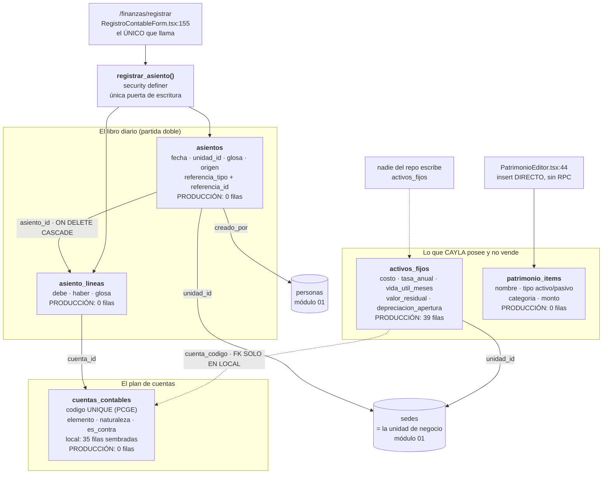
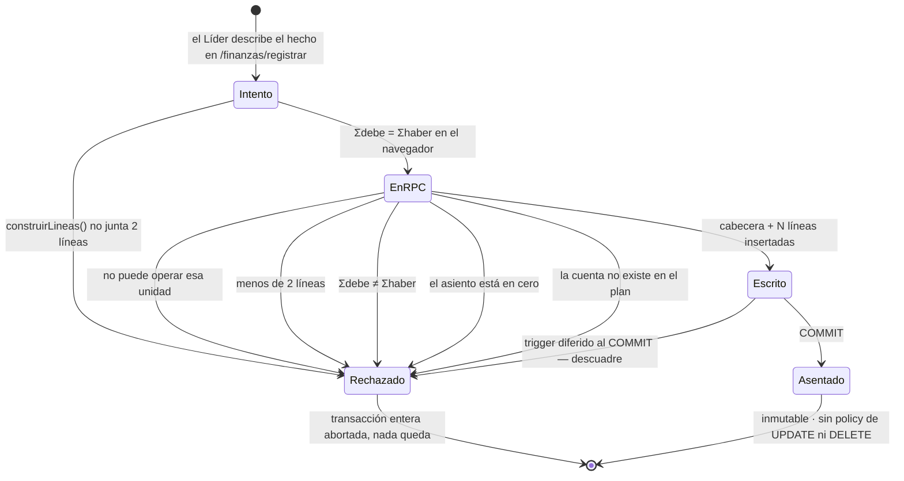

# 12 · Contabilidad de partida doble
> **Pájaro:** URRACA · **Lo lleva:** _(libre — apúntate en `07-GOBIERNO.md`)_ · **Última revisión:** 2026-09-12

## Para qué existe

CAYLA vende en tres tiendas, fabrica en el Taller y paga sueldos y alquileres desde la
sede corporativa. Al final del mes alguien tiene que poder decir, con un número y no con
una sensación, cuánto ganó cada sede y cuánto vale la empresa. Este módulo es el
**libro contable formal**: el plan de cuentas del PCGE que el contador espera ver, y un
libro diario donde cada hecho de plata entra dos veces —de dónde salió y a dónde fue—
para que el Balance cuadre porque cada asiento cuadró, no porque alguien lo forzó.

Guarda además el registro de **lo que CAYLA posee y no vende**: las máquinas de coser,
las remalladoras, los muebles de tienda, los equipos. Eso no es `stock` —no se vende, se
desgasta— y por eso vive en su propia tabla.

**Advertencia de entrada, y es grande:** este módulo está **construido pero apagado**.
En producción el plan de cuentas tiene 0 filas, el libro diario tiene 0 asientos, y
ninguna operación real del negocio (venta, gasto, merma, depósito, producción) escribe
en él. Lo que se ve en `/finanzas/balances` sale por otro camino completamente distinto.
Todo eso está documentado abajo, tabla por tabla y hueco por hueco.

## El mapa



Ciclo de vida de un asiento — corto, porque no tiene estados: nace cuadrado o no nace.



## Las tablas

### `cuentas_contables` — el plan de cuentas del PCGE, una sola lista para todas las sedes
**Existe en:** local y producción
**Quién escribe:** en local, la semilla de `0020_contabilidad_cimientos.sql` (35 filas).
En producción, **nadie**: ningún archivo de `supabase/unificacion/` inserta una sola
cuenta, y `retail.cuentas_contables` tiene 0 filas (diccionario generado contra el
proyecto de producción, leído 2026-09-12). La policy `cuentas_write_lider` permitiría
que un Líder de equipo las cargue desde el navegador; ninguna pantalla lo hace.

| Columna | Tipo | Vacío | Por defecto | Para qué sirve |
|---|---|---|---|---|
| `id` | uuid | no | `gen_random_uuid()` | Identidad de la cuenta. Es lo que guarda cada línea del diario, no el código. |
| `codigo` | text | no | — | El número que el contador espera ver: `101` Caja, `701` Ventas. Único. Es la llave con que la RPC busca la cuenta. |
| `nombre` | text | no | — | Cómo se llama la cuenta en pantalla. |
| `elemento` | text | no | — | En qué mitad del Balance cae: activo, pasivo, patrimonio, ingreso, gasto. **El `check` que limita a esos cinco valores existe solo en local.** |
| `naturaleza` | text | no | — | Saldo normal de la cuenta: deudora o acreedora. Es lo que deja traducir un debe/haber a "sube"/"baja" en pantalla. **El `check` existe solo en local.** |
| `es_contra` | boolean | no | `false` | Marca la cuenta que RESTA de su grupo en vez de sumar (hoy solo `391` Depreciación acumulada). |
| `explicacion` | text | no | — | Una frase en criollo de qué es esa cuenta en CAYLA ("Máquinas de coser, remalladoras, cortadora"). No es decorado: es lo que evita que alguien cargue el alquiler en la cuenta equivocada. |
| `orden` | integer | no | `0` | Orden en el desplegable de `/finanzas/registrar`. |
| `activo` | boolean | no | `true` | Cuenta retirada sin borrarla. `/finanzas/registrar` filtra por `activo = true`. |
| `created_at` | timestamptz | no | `now()` | Cuándo se creó la cuenta. |
| `updated_at` | timestamptz | no | `now()` | Lo pisa el trigger `cuentas_contables_set_updated_at` en cada edición. |

**Candados** (lo que la base impide que pase):
- `cuentas_contables_pkey` — PRIMARY KEY (id). **Las dos bases.**
- `cuentas_contables_codigo_key` — UNIQUE (codigo). Imposible tener dos cuentas `101`, o sea imposible que un mismo código signifique dos cosas. **Las dos bases.**
- `cuentas_contables_elemento_check` — `elemento in ('activo','pasivo','patrimonio','ingreso','gasto')`. **Solo local.**
- `cuentas_contables_naturaleza_check` — `naturaleza in ('deudora','acreedora')`. **Solo local.**

**Diferencias local vs producción:** los dos `check` de arriba no se escribieron en
`supabase/unificacion/06_contabilidad_produccion.sql` (líneas 10-21). En producción una
cuenta puede nacer con `elemento = 'banana'` y la base no dice nada. Y sobre todo: en
local hay 35 cuentas sembradas; en producción **hay cero**.

---

### `asientos` — la cabecera de cada hecho contable: cuándo, en qué sede, por qué
**Existe en:** local y producción
**Quién escribe:** solo `registrar_asiento()` (security definer). No hay policy de
INSERT, UPDATE ni DELETE en ninguna de las dos bases — para un cliente con sesión, el
libro diario es de solo lectura. En producción: 0 filas.

| Columna | Tipo | Vacío | Por defecto | Para qué sirve |
|---|---|---|---|---|
| `id` | uuid | no | `gen_random_uuid()` | Identidad del asiento. Es lo que amarra sus líneas. |
| `fecha` | date | no | `current_date` | El día al que pertenece el hecho. La RPC la acepta como parámetro, así que se puede asentar con fecha de un mes ya cerrado (ver huecos). |
| `unidad_id` | uuid | no | — | La sede a la que se carga el resultado: TRU, AQP, Tienda Lima, Taller o CCO. Es la etiqueta que permite un estado de resultados por sede (D-30) sin multiplicar las cuentas. |
| `glosa` | text | no | — | La explicación en lenguaje humano ("Alquiler de setiembre · factura"). |
| `origen` | text | no | `'manual'` | De qué evento nació el asiento: `apertura`, `manual`, `venta`, `compra`, `gasto`, `deposito`, `despacho`, `depreciacion`, `cierre`, `ajuste`. **El `check` que limita a esa lista existe solo en local.** Hoy solo se usan cuatro (`apertura`, `gasto`, `compra`, `manual`), los que emite la única pantalla que escribe. |
| `referencia_tipo` | text | sí | — | Qué tipo de documento originó el asiento ("venta", "gasto"). Diseñado para el día que las RPC del negocio posteen; hoy siempre viene vacío. |
| `referencia_id` | uuid | sí | — | El id de ese documento. Es el amarre que permitiría ir de un asiento a la venta que lo causó, y detectar un asiento duplicado. Hoy siempre vacío. |
| `creado_por` | uuid | sí | — | La persona que registró. La RPC lo resuelve sola por `auth.uid()`; no se puede falsear desde el cliente. |
| `created_at` | timestamptz | no | `now()` | Cuándo entró de verdad al sistema, que no es lo mismo que `fecha`. |

**Candados** (lo que la base impide que pase):
- `asientos_pkey` — PRIMARY KEY (id). **Las dos bases.**
- FK `unidad_id → sedes(id)` — no existe un asiento colgado de una sede inventada. **Las dos bases** (en producción apunta a `public.sedes`, la tabla de Dynamic).
- FK `creado_por → personas(id)`. **Las dos bases** (en producción, `public.personas` de Dynamic).
- `asientos_origen_check` — la lista cerrada de orígenes. **Solo local.**
- Índices `asientos_unidad_fecha_idx (unidad_id, fecha)` y `asientos_referencia_idx (referencia_tipo, referencia_id)`. **Solo local** — en producción el diccionario generado no lista ningún índice fuera de la PK.

**Diferencias local vs producción:** falta el `check` de `origen` y faltan los dos
índices. Con 0 filas no se nota; con un año de asientos posteados automáticamente, el
reporte por sede y mes pasa a leer la tabla entera.

---

### `asiento_lineas` — cada línea del debe y del haber; **aquí está el hueco más grave del módulo**
**Existe en:** local y producción
**Quién escribe:** solo `registrar_asiento()`. Sin policy de INSERT/UPDATE/DELETE en
ninguna de las dos bases. En producción: 0 filas.

| Columna | Tipo | Vacío | Por defecto | Para qué sirve |
|---|---|---|---|---|
| `id` | uuid | no | `gen_random_uuid()` | Identidad de la línea. |
| `asiento_id` | uuid | no | — | A qué asiento pertenece. Borrar el asiento borra sus líneas (`on delete cascade`) — pero nadie puede borrar un asiento, porque no hay policy de DELETE. |
| `cuenta_id` | uuid | no | — | Qué cuenta del plan se mueve. |
| `debe` | numeric(14,2) | no | `0` | Lo que ENTRA a esa cuenta. Sube un activo o un gasto; baja un pasivo o un ingreso. |
| `haber` | numeric(14,2) | no | `0` | Lo que SALE de esa cuenta. Lo contrario de arriba. |
| `glosa` | text | sí | — | Detalle de la línea suelta, cuando la glosa de la cabecera no alcanza. |

**Candados** (lo que la base impide que pase):
- `asiento_lineas_pkey` — PRIMARY KEY (id). **Las dos bases.**
- FK `asiento_id → asientos(id) ON DELETE CASCADE`. **Las dos bases.**
- FK `cuenta_id → cuentas_contables(id)` — imposible mover una cuenta que no está en el plan. **Las dos bases.**
- `linea_debe_xor_haber` — `((debe > 0 and haber = 0) or (haber > 0 and debe = 0))`. Garantiza que una línea diga una sola cosa: o entró plata a esa cuenta, o salió. Nunca las dos, nunca ninguna. **SOLO LOCAL** (`supabase/migrations/0020_contabilidad_cimientos.sql:119`).
- `check (debe >= 0)` y `check (haber >= 0)` — imposible una línea en negativo, que es la forma sigilosa de invertir un asiento sin que se note. **SOLO LOCAL** (`0020:115-116`).
- Índices `asiento_lineas_asiento_idx` y `asiento_lineas_cuenta_idx`. **Solo local.**
- Trigger de restricción `asiento_lineas_cuadra` (`deferrable initially deferred`, ejecuta `fn_asiento_cuadra`): al confirmar la transacción suma todas las líneas del asiento y revienta si `Σdebe ≠ Σhaber`. Es diferido a propósito: la cabecera y las N líneas entran juntas y el cuadre se juzga al final, no línea por línea. **Existe en las dos bases** — local `0020:151-154`, producción `supabase/unificacion/08_funciones_finanzas.sql:22-26`.

**Diferencias local vs producción — la crítica:**
`supabase/unificacion/06_contabilidad_produccion.sql:105-112` crea la tabla con las seis
columnas y **ninguno de los tres `check`**. El diccionario generado contra el proyecto de
producción lo confirma: `retail.asiento_lineas` lista únicamente
`asiento_lineas_pkey — PRIMARY KEY (id)`.

Qué significa en la práctica. En producción se puede grabar hoy una línea con
`debe = 50` **y** `haber = 50` a la vez. El trigger de cuadre la deja pasar tranquilo:
suma 50 al debe, suma 50 al haber, los totales coinciden, el asiento "cuadra". Dos líneas
así producen un asiento perfectamente cuadrado que **no significa nada**: ninguna cuenta
se movió de verdad, pero el libro dice que sí. El mayor de esa cuenta queda inflado por
los dos lados y el error no se ve en ningún total. El `check` que lo impide se escribió,
se probó en local y nunca llegó a producción.

`docs/ARQUITECTURA.md:318` promete lo contrario. Está en la sección "Estados imposibles
por diseño", con estas palabras: `asiento_lineas`: `check(debe>0 xor haber>0)` + trigger
*deferred* que exige Σdebe=Σhaber al confirmar — un asiento descuadrado es literalmente
imposible en la base de datos. La segunda mitad de la frase es cierta en las dos bases.
**La primera mitad es falsa en producción.**

---

### `activos_fijos` — la ficha de cada máquina, mueble y equipo de CAYLA
**Existe en:** local y producción
**Quién escribe:** **nadie desde el repo.** Grep de `activos_fijos` en `apps/`,
`packages/` y `scripts/` devuelve un solo uso real: un `select` en
`apps/web/app/(app)/finanzas/activos/page.tsx:57`. Las 39 filas que hay en producción
entraron por el SQL Editor (D-11). La policy `activos_all_lider` sí permitiría escribir
desde el navegador; ninguna pantalla lo hace. Está anotado en `docs/BACKLOG.md:1017`.

| Columna | Tipo | Vacío | Por defecto | Para qué sirve |
|---|---|---|---|---|
| `id` | uuid | no | `gen_random_uuid()` | Identidad del bien. |
| `unidad_id` | uuid | no | — | En qué sede está el bien. Es lo que permitiría cargar su desgaste al resultado de esa sede (D-30). |
| `nombre` | text | no | — | Cómo se le dice ("Remalladora Siruba", "Mesa de corte grande"). |
| `serie` | text | sí | — | El número de serie del fabricante. Sirve para el seguro y para reclamar un robo: un activo sin serie es un activo que no se puede probar. |
| `descripcion` | text | sí | — | Detalle libre del bien. |
| `cuenta_codigo` | text | no | — | A qué cuenta del plan pertenece (`333` maquinaria, `336` cómputo, `335` muebles). **La FK contra `cuentas_contables(codigo)` existe solo en local.** |
| `costo` | numeric(14,2) local / **numeric(12,2) producción** | no | — | Lo que costó el bien el día que se compró. |
| `valor_residual` | numeric(14,2) local / **numeric(12,2) producción** | no | `0` | Lo que se supone que valdrá al final de su vida útil (10% en máquinas y muebles, 5% en cómputo). Es el piso de la depreciación. **Nadie lo lee.** |
| `vida_util_meses` | integer | no | — | Cuántos meses dura el bien (120 para máquinas y muebles, 48 para cómputo). **Nadie lo lee.** |
| `tasa_anual` | numeric(5,4) local / **numeric(6,4) producción** | no | — | La tasa SUNAT de depreciación anual: `0.1000` = 10%. **Nadie lo lee.** |
| `fecha_adquisicion` | date | no | — | Desde cuándo se deprecia. Se muestra como "Desde" en pantalla. |
| `depreciacion_apertura` | numeric(14,2) local / **numeric(12,2) producción** | no | `0` | El desgaste ya acumulado al momento de cargar el bien al sistema. Es un número congelado que alguien escribió a mano: **no crece nunca.** |
| `estado` | text | no | `'activo'` | `activo`, `baja` o `vendido`. La pantalla filtra `estado = 'activo'`. **El `check` de esos tres valores existe solo en local.** |
| `nota` | text | sí | — | Comentario libre. |
| `created_at` | timestamptz | no | `now()` | Cuándo entró la ficha. |
| `updated_at` | timestamptz | no | `now()` | Lo pisa el trigger `activos_fijos_set_updated_at`. |

**Candados** (lo que la base impide que pase):
- `activos_fijos_pkey` — PRIMARY KEY (id). **Las dos bases.**
- FK `unidad_id → sedes(id)` — no hay una máquina en una sede que no existe. **Las dos bases** (en producción apunta a `public.sedes` de Dynamic).
- FK `cuenta_codigo → cuentas_contables(codigo)` — imposible clasificar un bien en una cuenta que no está en el plan. **SOLO LOCAL.**
- `activos_fijos_estado_check` — `estado in ('activo','baja','vendido')`. **SOLO LOCAL.**
- Índice `activos_fijos_unidad_idx (unidad_id)`. **Solo local.**

**Diferencias local vs producción:** producción no tiene la FK de `cuenta_codigo` ni el
`check` de `estado` ni el índice; y los cuatro campos de plata son `numeric(12,2)` en vez
de `numeric(14,2)`. Con 39 activos de máquinas de coser el techo de 12 dígitos no molesta,
pero es una divergencia de tipo real que hay que anotar antes de que alguien escriba un
`insert` asumiendo el tipo de local. La falta de FK en `cuenta_codigo` importa **hoy**:
como `retail.cuentas_contables` está en 0 filas, las 39 fichas de producción apuntan a
códigos contables que **no existen en ninguna parte**, y nada lo impide.

---

### `patrimonio_items` — las partidas del Balance que se cargan a mano: bienes, deudas, aportes
**Existe en:** local y producción
**Quién escribe:** `apps/web/components/PatrimonioEditor.tsx:44` — un `insert` **directo
desde el navegador**, sin RPC. Es la superficie de riesgo del módulo. En producción: 0
filas.

| Columna | Tipo | Vacío | Por defecto | Para qué sirve |
|---|---|---|---|---|
| `id` | uuid | no | `gen_random_uuid()` | Identidad de la partida. |
| `nombre` | text | no | — | Cómo se llama ("Estantería de la tienda de Trujillo", "Préstamo Interbank"). |
| `tipo` | text | no | — | `activo` (suma al patrimonio) o `pasivo` (resta). **El `check` de esos dos valores existe solo en local.** |
| `monto` | numeric(14,2) | no | `0` | Cuánto vale o cuánto se debe. **No hay columna de fecha en toda la tabla**: cambiar este número cambia el Balance de todos los meses, pasados incluidos. |
| `nota` | text | sí | — | Detalle libre. |
| `created_at` | timestamptz | no | `now()` | Cuándo se cargó. |
| `updated_at` | timestamptz | no | `now()` | Lo pisa el trigger `patrimonio_items_set_updated_at`. |
| `categoria` | text | sí | — | La clasificación fina que pidió Felipe: `muebles`, `equipos`, `intangible`, `banco`, `otro_activo` / `deuda_proveedor`, `prestamo`, `impuesto`, `otro_pasivo`. Las etiquetas viven en `PatrimonioEditor.tsx:13-25`, no en la base: **ningún `check` las limita en ninguna de las dos bases.** |

**Candados** (lo que la base impide que pase):
- `patrimonio_items_pkey` — PRIMARY KEY (id). **Las dos bases.**
- `patrimonio_items_tipo_check` — `tipo in ('activo','pasivo')`. **SOLO LOCAL.**

**Diferencias local vs producción:** falta el `check` de `tipo`. La columna `categoria`
(migración local `0019`) **sí llegó a producción**: el diccionario generado contra el
proyecto real la lista. Es el cierre del ADR-0006, que la reportaba ausente el 2026-09-04
y se resolvió con `supabase/unificacion/15_patrimonio_categoria.sql`. Ojo: la copia local
del stack de Dynamic (`docs/datos/generado/DICCIONARIO-RETAIL.md`) todavía muestra la
tabla con 7 columnas, sin `categoria` — esa foto es de un replay local de
`supabase/unificacion/`, no de producción, y le falta pegar la `15`.

## Cómo se escribe (la única puerta)

```sql
registrar_asiento(
  p_unidad_id       uuid,
  p_glosa           text,
  p_origen          text,
  p_lineas          jsonb,                      -- [{"cuenta":"104","debe":5000,"haber":0}, ...]
  p_fecha           date default current_date,
  p_referencia_tipo text default null,
  p_referencia_id   uuid default null
) returns uuid
```
`security definer`, `set search_path = public` en local / `= retail, public` en producción.
Local: `supabase/migrations/0021_rpc_registrar_asiento.sql`. Producción:
`supabase/unificacion/08_funciones_finanzas.sql:29`.

**Candado de permiso: sede.** Primera línea del cuerpo: `if not fn_puede_operar_sede(p_unidad_id)`
(en producción, `retail.puede_operar_sede`) → *"No tienes permiso para registrar en esa
unidad"*. Es un candado de **sede, no de rol**: un Integrante de TRU podría asentar en TRU
según la RPC. Lo que hoy lo frena es la pantalla, no la base:
`apps/web/app/(app)/finanzas/registrar/page.tsx:12` hace `if (persona.rol !== "lider") redirect("/")`.

**Qué más valida antes de tocar nada:**
1. Al menos dos líneas — *"Un asiento necesita al menos dos líneas (debe y haber)"*.
2. `Σdebe = Σhaber` redondeado a 2 decimales — *"El asiento no cuadra: debe X ≠ haber Y"*. Es la primera red; el trigger diferido es la segunda.
3. `Σdebe ≠ 0` — *"El asiento está en cero"*.
4. Cada `cuenta` del JSON existe en `cuentas_contables.codigo` — *"La cuenta X no existe en el plan de cuentas"*. **En producción esto falla siempre**, porque el plan tiene 0 filas.
5. Las líneas con `debe = 0 and haber = 0` se saltan (`continue`), no crean fila. Es lo que deja mandar la línea de IGV siempre y que desaparezca sola cuando el IGV es cero.

**¿Es idempotente? No.** Llamarla dos veces con los mismos datos crea **dos asientos
distintos**, cada uno con su `id` nuevo. No hay token, no hay `unique`, y el par
`(referencia_tipo, referencia_id)` —que sería el amarre natural contra el duplicado— no
tiene índice único ni en local ni en producción, y hoy siempre llega nulo. Compárese con
`registrar_venta`, que sí es idempotente por `p_token` (ADR-0033). El día que
`registrar_venta` postee su asiento, un reintento de red duplicaría el ingreso en el libro.

**Escrituras directas sin pasar por RPC — la superficie de riesgo:**

| Archivo:línea | Qué hace | Por qué importa |
|---|---|---|
| `apps/web/components/PatrimonioEditor.tsx:44` | `from("patrimonio_items").insert({nombre, tipo, categoria, monto, nota})` | El navegador escribe una partida del Balance sin ninguna validación de servidor. La policy `patrimonio_all_lider` es lo único que lo limita. `monto` no tiene `check` de rango: un cero de más entra sin chistar, y como la tabla no tiene fecha, corrige el Balance de todos los meses a la vez. |
| SQL Editor de producción | Las 39 filas de `activos_fijos` | No hay pantalla de alta. Es la vía documentada (D-11) pero sin rastro estructurado: nadie sabe quién cargó cada máquina ni cuándo. |

`cuentas_contables` tiene `cuentas_insert_lider` / `cuentas_update_lider` (local) y
`cuentas_write_lider` (producción), así que un Líder de equipo **podría** editar el plan de
cuentas desde el navegador. Ninguna pantalla lo hace, y no debería: renombrar o desactivar
una cuenta con asientos encima cambia el significado de lo ya escrito.

## Quién ve y quién toca

Leído de las policies reales, no de la intención. En producción `retail.es_lider()` es
`coalesce(public.fn_rol_actual() = 'admin', false)` (`supabase/unificacion/03_candados.sql:62`):
el **Admin** de Dynamic y el **Líder de equipo** de retail son el mismo candado, y no hay
ninguno intermedio para `supervisor_sede`.

| Operación | Admin | Líder de equipo | Integrante | Solo lectura |
|---|---|---|---|---|
| Ver el plan de cuentas | sí | sí | **sí** (`auth.role() = 'authenticated'`) | **sí** |
| Editar el plan de cuentas | sí | sí | no | no |
| Ver los asientos de cualquier sede | sí | sí | no | no |
| Ver los asientos de SU sede | sí | sí | **sí** (`unidad_id = fn_sede_actual_persona()`) | **sí, los de su sede** |
| Escribir un asiento (RPC) | sí | sí | **la RPC lo dejaría** si es su sede; la pantalla lo bloquea por rol | no |
| Ver `activos_fijos` de cualquier sede | sí | sí | no | no |
| Ver `activos_fijos` de SU sede | sí | sí | **sí** | **sí, los de su sede** |
| Escribir `activos_fijos` | sí (por SQL) | sí (policy lo permite, sin pantalla) | no | no |
| Ver / escribir `patrimonio_items` | sí | sí | no | no |

Tres cosas que hay que decir en voz alta:
- **"Solo lectura" no existe como rol en la base.** Los cuatro niveles de D-12 son
  vocabulario de CAYLA; en `personas.rol` solo hay `lider` e `integrante` (local) y
  `admin`, `supervisor_sede`, `integrante` (producción). El contador externo hoy entraría
  como Integrante de alguna sede y vería lo mismo que un Integrante.
- Costos y márgenes visibles para cualquiera con cuenta es decisión consciente de Felipe
  (D-27): el plan de cuentas con su `explicacion` lo lee todo autenticado, a propósito.
- El `for all` de `activos_fijos` y `patrimonio_items` es más ancho de lo que la pantalla
  usa. Hoy la única defensa contra un Líder de equipo que edite un activo desde la consola
  del navegador es que no se le ocurra.

## Qué se rompe sin esto

Poco, y eso es exactamente el problema. Si `asientos`, `asiento_lineas` y
`cuentas_contables` desaparecieran mañana de producción, **no se rompería ni una pantalla**:
están en 0 filas, nadie las lee y los estados financieros de `/finanzas/balances` salen
por otro camino (`apps/web/lib/contabilidad.ts`). Lo único que dejaría de cargar es
`/finanzas/registrar`, que hoy ya muestra su estado vacío porque no hay plan de cuentas.

Lo que sí se rompe es hacia adelante. Sin este módulo encendido, CAYLA no tiene libro
contable formal: cuando SUNAT pida el Registro de Ventas y Compras en formato PLE al
cruzar las 300 UIT (CAYLA va al 72% del umbral, D-46), no hay de dónde sacarlo — el
contador tendría que rearmarlo a mano desde `ventas` y `gastos`. El estado de resultados
por sede que Felipe pide como requisito central (D-30) se calcula hoy ignorando el
`sede_id` que ya lee. Y el costo de lo vendido se recalcula con el costo de HOY: si mañana
sube el costo de una blusa, cambia retroactivamente lo que ganaste en enero — un libro
diario sella ese número el día de la venta y no se mueve nunca más.

Si `activos_fijos` se perdiera sí dolería de inmediato: son las 39 máquinas, mesas de
corte y equipos reales de CAYLA, y no están en ningún otro lado del sistema.

## Huecos conocidos

1. **El `check` que impide una línea con debe Y haber no existe en producción.**
   `supabase/unificacion/06_contabilidad_produccion.sql:105-112` crea `retail.asiento_lineas`
   sin `linea_debe_xor_haber`, sin `check (debe >= 0)` y sin `check (haber >= 0)`; el
   diccionario generado contra producción lista solo la PRIMARY KEY. Dos líneas con
   `debe = 50` y `haber = 50` producen un asiento que cuadra y no mueve nada: el mayor de
   esa cuenta infla por los dos lados y ningún total lo delata. **Promesa incumplida:**
   `docs/ARQUITECTURA.md:318` dice textualmente *"`asiento_lineas`: `check(debe>0 xor
   haber>0)` + trigger deferred que exige Σdebe=Σhaber al confirmar — un asiento
   descuadrado es literalmente imposible en la base de datos"*. El trigger sí está en
   producción (`unificacion/08_funciones_finanzas.sql:22-26`); el `check` no.

2. **Ninguna RPC del negocio postea un asiento.** `registrar_asiento` tiene exactamente un
   consumidor en todo el repo: `apps/web/components/RegistroContableForm.tsx:155`.
   `registrar_venta`, `registrar_gasto`, `registrar_deposito`, `cerrar_produccion`,
   `registrar_movimiento` y las de merma no mencionan la palabra "asiento" ni una vez —
   verificado por grep sobre `supabase/migrations/*.sql` y `supabase/unificacion/*.sql`.
   El libro diario solo se llena si un Líder de equipo se sienta a escribir a mano lo que
   ya registró en otra pantalla. **Promesa incumplida:** `docs/MANUAL-CONTABLE-CAYLA.md:254`
   dice *"Nadie en CAYLA escribirá jamás un asiento contable. Si algún día alguien tiene
   que hacerlo, el diseño falló."* Hoy es la única forma de que exista un asiento.

3. **Las 14 reglas de posteo del manual existen solo como prosa.**
   `docs/MANUAL-CONTABLE-CAYLA.md` §2 lista las 14 operaciones de CAYLA con su debe y su
   haber ("Venta en efectivo → Debe 101 Caja, Haber 7011 + 4011") y encabeza con *"Estas
   son **todas** las operaciones del negocio. No hay una décimo-quinta escondida."*
   **Ninguna de las 14 existe en código.** Están escritas en presente, como si funcionaran.
   Además usan cuentas que el plan sembrado no tiene: la regla 2 y la 3 necesitan `105`
   Medios de pago en tránsito, y la 12 necesita `711` Variación de productos terminados —
   ninguna de las dos está en las 35 cuentas de `0020`.

4. **El plan de cuentas está vacío en producción.** `retail.cuentas_contables`: 0 filas
   (diccionario generado contra el proyecto de producción, 2026-09-12). Ningún archivo de
   `supabase/unificacion/` inserta una sola cuenta. Consecuencia inmediata:
   `registrar_asiento` en producción **siempre** falla con *"La cuenta X no existe en el
   plan de cuentas"*, y `/finanzas/registrar` muestra su estado vacío. Peor: el texto de
   ese estado vacío
   (`apps/web/app/(app)/finanzas/registrar/page.tsx:52`) dice *"Corre la migración 0020 en
   Supabase para crear las cuentas"*, y eso **no se puede hacer**: `0020` es una migración
   local; en producción hay que pegar la semilla con prefijo `retail.` en el SQL Editor.
   El mensaje manda a una puerta que no abre.

5. **El plan sembrado (35) no es el plan del manual (26).** El manual anuncia "25 cuentas,
   no 500" (`docs/MANUAL-CONTABLE-CAYLA.md:21`) y lista 26. `0020` siembra 35. Comparten
   solo 15 códigos. El detalle completo está en la sección de abajo. Consecuencia: el
   contador que lea el manual y el que mire la base no están hablando del mismo plan, y
   dos de las 14 reglas de posteo son literalmente inejecutables.

6. **`activos_fijos` guarda todo para depreciar y nada deprecia.** La tabla tiene
   `tasa_anual`, `vida_util_meses`, `valor_residual` y `depreciacion_apertura`; hay una
   cuenta `681` "Depreciación del mes", una cuenta contra `391` "Depreciación acumulada" y
   un `origen = 'depreciacion'` reservado en `asientos`. **No existe ninguna función, RPC,
   trigger ni job que calcule un solo sol de depreciación** — grep de "deprecia" en
   `supabase/migrations/` y `supabase/unificacion/` devuelve 8 líneas: definiciones de
   columna, el valor `'depreciacion'` de la lista de orígenes, y comentarios. Ni una línea
   de cálculo. **Tres promesas incumplidas:**
   (a) `apps/web/app/(app)/finanzas/activos/page.tsx:139` le dice al Líder de equipo en
   pantalla: *"El desgaste (depreciación) se calculó desde la fecha de compra de cada bien,
   con tasas SUNAT y valor residual, según NIIF."* La columna "Desgaste" que está viendo es
   `depreciacion_apertura` tal cual: un número escrito a mano que no se movió nunca.
   (b) `docs/BACKLOG.md:1579` da por cerrado *"activos fijos con depreciación NIIF/SUNAT
   automática"*. No hay nada automático.
   (c) La cabecera de la propia migración,
   `supabase/migrations/0022_activos_fijos.sql:4`, dice que la ficha sirve *"para la
   depreciación automática mensual"*; treinta líneas más abajo (`0022:33`) el mismo archivo
   se desmiente solo: *"(La depreciación mensual continua se posteará en la Fase 4.)"*.
   La Fase 4 no se construyó.

7. **Las 39 máquinas no están en el Balance.** `apps/web/lib/contabilidad.ts:200` calcula
   `activosFijos` filtrando `patrimonio_items` por `tipo = 'activo'`, y **nunca lee
   `activos_fijos`** (la tabla no aparece ni una vez en ese archivo). En producción
   `patrimonio_items` tiene 0 filas y `activos_fijos` tiene 39. Resultado concreto: el
   Balance General de `/finanzas/balances` reporta **S/0 en activos fijos** mientras
   `/finanzas/activos` lista 39 bienes con su costo. Dos pantallas del mismo sistema, el
   mismo día, dicen cosas distintas sobre lo que CAYLA posee, y el patrimonio que Felipe
   mira está subvaluado por el valor de todo el Taller.

8. **No hay pantalla para dar de alta un activo fijo.** Verificado por grep: el único uso
   de `activos_fijos` en `apps/` es el `select` de
   `apps/web/app/(app)/finanzas/activos/page.tsx:57`. Comprar una remalladora nueva exige
   que Felipe pegue un `insert` en el SQL Editor. Está anotado en `docs/BACKLOG.md:1017`, y
   el patrón para resolverlo ya existe (`PatrimonioEditor`).

9. **`registrar_asiento` acepta cualquier fecha y nada cierra el mes (D-23).** `p_fecha`
   es un parámetro libre: en septiembre se puede asentar con fecha de enero. No existe
   tabla `periodos_contables` ni función `cerrar_periodo` / `cerrar_mes` en ninguno de los
   dos rieles. Un estado financiero que Felipe ya miró y dio por bueno cambia después sin
   dejar rastro.

10. **El libro diario es solo de escritura: ninguna pantalla lo muestra.** Grep de
    `asiento` en `apps/web` devuelve el formulario que escribe
    (`RegistroContableForm.tsx`), la librería que arma las líneas
    (`lib/registro-contable.ts`), su test, y tres comentarios. **Ni un solo `select` sobre
    `asientos` o `asiento_lineas` en todo el repo: no hay mayor, no hay libro diario, no
    hay balance de comprobación.** Lo que se asienta entra y no se vuelve a ver. `/finanzas/balances`
    lo admite en su pie (`apps/web/app/(app)/finanzas/balances/page.tsx:312`): *"Estos
    estados se calculan sobre lo que ya registras — nadie escribe asientos contables."*

11. **`registrar_asiento` no es idempotente y no tiene cómo serlo.** Sin token, sin
    `unique` sobre `(referencia_tipo, referencia_id)`, y con esos dos campos siempre nulos.
    Doble clic en "Registrar" = dos asientos iguales en el libro, indistinguibles de dos
    hechos reales. Es el hueco que hay que tapar **antes** de que las RPC del negocio
    posteen, no después: ADR-0033 ya resolvió el mismo problema para `registrar_venta`.

12. **`patrimonio_items` se escribe directo desde el navegador y no tiene fecha.**
    `PatrimonioEditor.tsx:44`. Sin RPC, sin validación de servidor, sin `check` de rango en
    `monto`, y en producción sin el `check` de `tipo`. Como la tabla no tiene columna de
    fecha, corregir un monto reescribe el Balance de todos los meses pasados a la vez.

13. **Faltan candados enteros en producción, no solo el del punto 1.** Comparado fila por
    fila contra el diccionario generado: no existen en producción el `check` de
    `asientos.origen`, los de `cuentas_contables.elemento` y `.naturaleza`, el de
    `activos_fijos.estado`, el de `patrimonio_items.tipo`, la FK
    `activos_fijos.cuenta_codigo → cuentas_contables(codigo)`, ni los cinco índices del
    módulo. Todos están escritos en `migrations/0020` y `0022`; ninguno se copió a
    `unificacion/06`.

14. **El costo de lo vendido se recalcula con el costo de hoy (D-45 abierta).** Es el
    argumento más fuerte a favor de encender el libro diario: un asiento sella el costo el
    día de la venta. Mientras tanto, `lib/contabilidad.ts` lee `variantes.costo` vigente,
    así que subir el costo de una prenda cambia hacia atrás el margen de todos los meses en
    que se vendió. El manual lo reconoce (§4②) y lo llama simplificación; con libro diario
    deja de serlo.

### El plan de 25 del manual contra las 35 que siembra `0020`

Coinciden **15 códigos**: `101`, `104`, `201`, `211`, `335`, `336`, `4011`, `4017`, `421`,
`591`, `609`, `635`, `636`, `659`, `691`. De esos, uno significa dos cosas distintas.

**En el manual y NO en `0020`** (11 códigos — las reglas de posteo que los usan son inejecutables):

| Código | Nombre en el manual | Qué se pierde |
|---|---|---|
| `105` | Medios de pago en tránsito | Las reglas 2 y 3 (venta con POS/Yape y su abono posterior) no se pueden asentar. `0020` manda POS y Yape directo a `104` Bancos, como si el banco abonara el mismo día. |
| `41` | Remuneraciones por pagar | `0020` usa `411` "Sueldos por pagar": mismo concepto, código distinto. |
| `50` | Capital | `0020` usa `501`. |
| `7011` / `7012` | Ventas de mercadería / de producción propia | `0020` usa `701` / `702`. |
| `711` | Variación de productos terminados | La regla 12 (el Taller entrega producción) no se puede asentar: no hay contrapartida. |
| `62` | Gastos de personal | `0020` usa `621` "Sueldos y cargas". |
| `631` | Transporte (envíos que NO son de compra) | No existe en `0020`. Todo transporte cae en `609` o en `659`. |
| `634` | Mantenimiento | No existe en `0020`. |
| `637` | Publicidad | No existe en `0020`. Marketing no tiene cuenta propia. |
| `656` | Suministros (bolsas, empaques, útiles) | No existe en `0020` como gasto. Ojo con la trampa: `0020` sí tiene `252` "Suministros", pero es un **activo** (hilos, botones, avíos en almacén), no el empaque que se consume. |

**Choque de significado en el mismo código:** `659`. El manual lo llama *"Desmedros y
otros"* y la regla 11 manda ahí las mermas. `0020` lo sembró como *"Otros gastos de
gestión — lo que no cae en las categorías de arriba"*. Si alguien postea una merma
siguiendo el manual, la mete en el cajón de sobras. Hay que decidir cuál gana antes del
primer asiento automático.

**En `0020` y NO en el manual** (20 códigos). Tres contradicen simplificaciones que el
manual declara por escrito en §6:

| Código | Nombre en `0020` | Nota |
|---|---|---|
| `121` | Clientes por cobrar | El manual §6.3 dice *"Sin cuentas por cobrar. CAYLA vende al contado."* |
| `231` | Productos en proceso | El manual §6.1 dice *"Sin productos en proceso (WIP) en el Taller."* |
| `391` | Depreciación acumulada | El manual §6.2 dice *"Sin depreciación."* |
| `681` | Depreciación del mes | Igual que arriba. |
| `168` | Depósitos en garantía | |
| `241` | Materias primas | Telas. Necesaria para D-47 (inventario de insumos del Taller). |
| `252` | Suministros (activo) | Hilos, botones, avíos. |
| `333` | Maquinaria y equipo | El manual mete todo en `336`; `0020` separa máquinas de cómputo. |
| `411` | Sueldos por pagar | Variante de `41`. |
| `451` | Préstamos bancarios | |
| `442` | Cuentas por pagar a socios | |
| `501` | Capital | Variante de `50`. |
| `891` | Resultado del ejercicio | |
| `701` / `702` | Ventas de mercadería / del Taller | Variantes de `7011` / `7012`. |
| `759` | Otros ingresos | |
| `601` | Compras | |
| `621` | Sueldos y cargas | Variante de `62`. |
| `632` | Confección tercerizada | Costureros externos. |
| `639` | Comisiones POS / Yape | |

Hay además un choque de doctrina con D-31, que no es un detalle de códigos: `0020`
siembra `702` *"Ventas del Taller — lo que el Taller 'vende' a las tiendas, a su precio"*,
y D-31 descarta explícitamente el precio de transferencia interno. El Taller **no le vende
a las tiendas**: el costo real viaja pegado a la prenda. La cuenta `702` sembrada describe
un modelo que Felipe ya rechazó.

## Decisiones que lo gobiernan

- **D-07** · Lo muerto se marca muerto, con el motivo por el que sigue vivo. Este módulo
  no está muerto: está **construido y apagado**. `asientos`, `asiento_lineas` y
  `cuentas_contables` siguen vacías a propósito, esperando D-35.
- **D-12** · Los cuatro niveles de permiso. En este módulo solo dos existen de verdad en la
  base: Líder de equipo (por `fn_es_lider` / `retail.es_lider`) e Integrante (por sede).
  "Solo lectura" no tiene rol propio todavía.
- **D-16** · Cada tabla marca en qué base existe. Las cinco existen en las dos; lo que
  difiere son los candados, y esa diferencia es el hueco 1.
- **D-17** · `supabase/unificacion/` es deuda a extinguir. Este módulo es la prueba más
  cara de esa deuda: cinco `check`, una FK y cinco índices que se escribieron en local y
  nunca cruzaron.
- **D-23** · Cierre de mes con llave. No existe. `registrar_asiento` acepta cualquier
  fecha (hueco 9).
- **D-27** · Costos y márgenes visibles para todos. Por eso `cuentas_select` deja leer el
  plan a cualquier autenticado.
- **D-30** · Estado de resultados por sede. `asientos.unidad_id` es la pieza que lo hace
  posible; hoy no se usa porque no hay asientos.
- **D-31** · El Taller se mide por costo absorbido, no por precio de transferencia. La
  cuenta `702` sembrada en `0020` contradice esto y hay que revisarla.
- **D-32** · Los gastos que no son de ninguna sede van a `CCO`. `asientos.unidad_id` lo
  soporta: local llama a esa sede `CORP` y producción `CCO` (D-20).
- **D-35** · El libro contable se llena solo, por etapas, empezando por venta y gasto.
  Es la decisión que da sentido a todo este módulo y la que hoy no está cumplida (huecos 2
  y 3). Cada regla se decide con el contador, no se inventa.
- **D-36** · Los libros electrónicos PLE los arma el contador; el sistema le entrega un
  reporte limpio. Ese reporte sale del libro diario — con 0 asientos, no hay de dónde.
- **D-45** ⏳ · Método de costeo abierto (promedio ponderado / PEPS / por lote). El libro
  diario sella el costo en el asiento y resuelve solo el problema del costo retroactivo
  (hueco 14). **No se toca el núcleo hoy.**
- **D-46** · Cuentas por pagar e IGV son la prioridad 1: CAYLA va al 72% de las 300 UIT.
  `421` y `4011` ya están en el plan sembrado, esperando que alguien postee.
- **ADR-0006** (`docs/adr/0006-patrimonio-items-categoria-drift.md`) · `patrimonio_items.categoria`
  no llegó a producción con la unificación; se resolvió con `unificacion/15_patrimonio_categoria.sql`.
  El diccionario de producción ya la muestra. Mismo patrón de drift que el hueco 1, que
  sigue abierto.
- **ADR-0029** · Retail no mira el flag `activa` de Dynamic. Por eso
  `/finanzas/registrar` filtra las unidades por `tipo` (`tienda`, `fabrica`,
  `corporativo`) y no por `activo`: con ese flag, la tienda de Lima podía vender pero no
  recibir un asiento.
- **ADR-0033** · El reintento no cobra dos veces (idempotencia de `registrar_venta` por
  token). Es el patrón que le falta a `registrar_asiento` (hueco 11).
