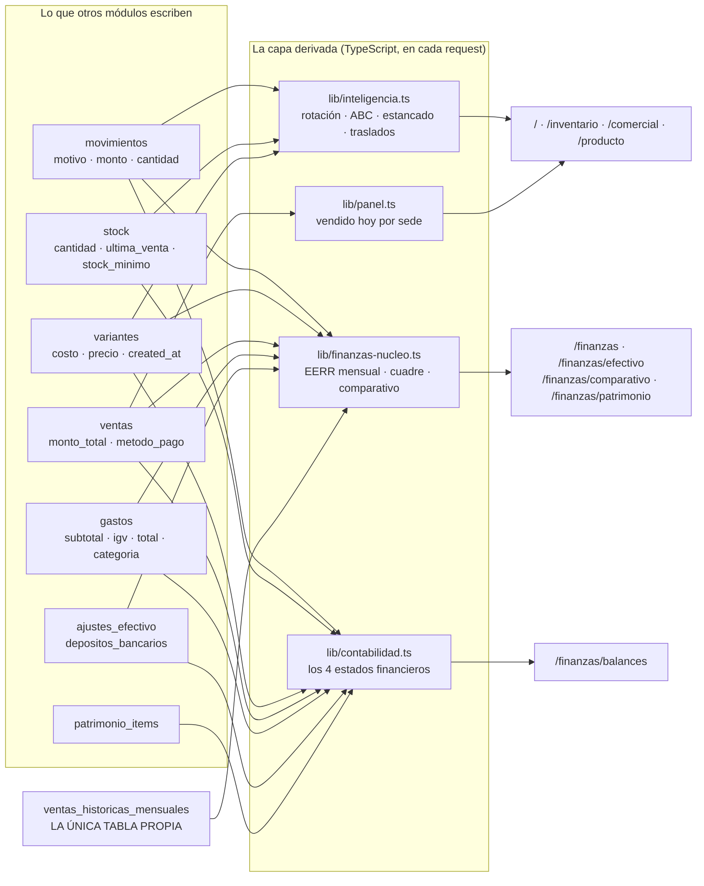
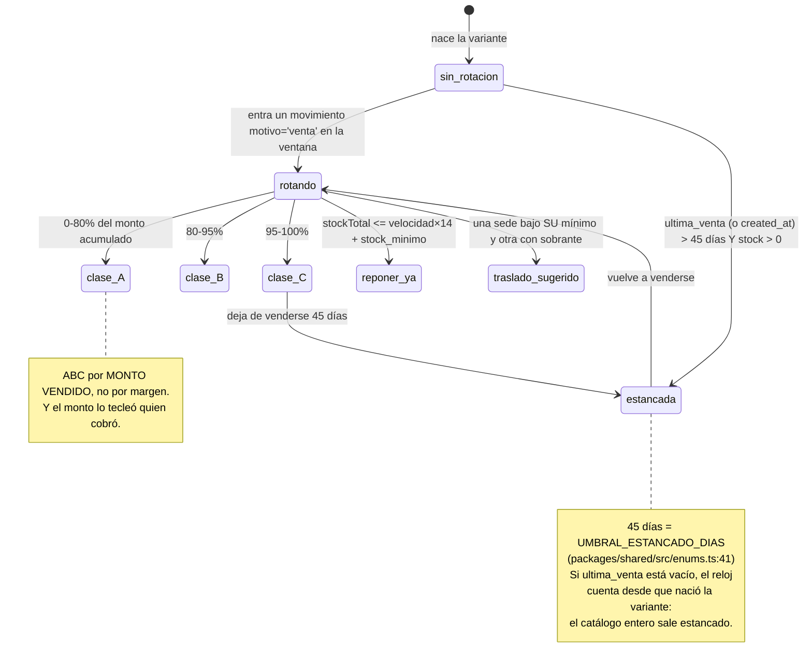

# 13 · Inteligencia y reportes
> **Pájaro:** ÁGUILA · **Lo lleva:** _(libre — apúntate en `07-GOBIERNO.md`)_ · **Última revisión:** 2026-09-25 (aviso de abajo); el cuerpo sigue siendo el del 2026-09-12

> **⚠️ Actualización 2026-09-24: el cuerpo de este documento describe V1.** `lib/inteligencia.ts` ya no existe: V2 lo
> borró el 2026-09-12. Se puede ver en el tag `pre-v2-cutover`. Donde vive hoy cada cálculo:
> - **Velocidad de venta, plan de reposición y sugerencia de traslado** están en `apps/web/lib/resumen-reglas.ts`
>   (`calcularVelocidad`, `planDeReposicion`, `cedibleDe`). La velocidad divide por los días con stock en el piso, por
>   sede.
> - **La sugerencia de traslado ya suma piso más almacén del destino** (`calcularUtilizable`) y del origen cede solo
>   desde su almacén. El hueco 6 y el incumplimiento de D-39 eran de V1 y **están cerrados**.
> - **Demanda diaria y punto de reorden** están en SQL, en `fn_productos` y `fn_productos_resumen`
>   (`20260916100000_punto_reorden.sql`). Es global por producto, con 30 días calendario, y la usa Compras. Convive a
>   propósito con la velocidad por sede del Resumen, porque responden preguntas distintas. Detalle en ADR-0208.
> - **Rotación de inventario** (COGS ÷ inventario promedio a costo) está en `apps/web/lib/rotacion.ts` (ADR-0138).
> - **«Estancada» (45 días) no existe en V2.** `UMBRAL_ESTANCADO_DIAS` (`packages/shared/src/enums.ts:41`) no la importa
>   nadie. La señal viva de «esto se quedó» es `posible_sobrestock`, en `resumen-reglas.ts:842-850`.
> - **«Frescura del piso»** (ADR-0208): diseño aprobado. Mide cuánto lleva cada modelo+color en el piso frente a su
>   categoría en la sede. Se construye por bloques. **Los bloques 1 y 2 están construidos y fusionados, y su web está
>   publicada** (2026-09-25). Bloque 1: registrar la bajada al piso escaneando (`bajar_al_piso`), cerrar «Reposición»
>   en el piso y leer qué bajadas fueron tardías (`fn_bajadas_del_piso`, solo líder, sin pantalla, encima de
>   `fn_ledger_puntos`, ADR-0202). En producción, según Felipe: `bajar_al_piso` (`0200`) y el candado de «Reposición»
>   (`0400`) pegados; `fn_bajadas_del_piso` (`0300`) y el módulo (`0000`) sin confirmar. Bloque 2: «Retirar del piso»,
>   sin función nueva: `mover_interno` en sentido contrario, desde el menú «⋯» de Existencias. Del bloque 3 en adelante
>   no existe nada todavía.
> - **Análisis lee mal un retiro (hallado en la revisión del bloque 2, se arregla en el bloque 3).** Un retiro pausa la
>   tanda FIFO en el almacén (ADR-0200). Si la tanda llevaba menos de 7 días en el piso, la lectura `reposicion_reciente`
>   (`apps/web/lib/resumen-lectura.ts`) dice que esas unidades «entraron al piso hace poco» y la ficha las cuenta como
>   «nuevas pendientes»; si se retira la talla entera, `problema_reposicion` lo lee como falta de reposición. La marca de
>   «retirada de la venta» que Felipe decidirá en el bloque 3 tiene que apagar también estas lecturas (ADR-0208,
>   «Actualización 2026-09-25 — revisión del bloque 2»). Por decisión de ese PR, la lógica de Análisis no se tocó.
> - **Regla para la pantalla de Frescura (bloque 3):** se construye encima del dominio de Inventario que ya existe
>   —el libro de `fn_ledger_puntos`, la venta de `fn_es_venta_de_stock` y las cohortes FIFO de
>   `apps/web/lib/inventario-exposicion.ts` (ADR-0199 de main, 0200 y 0202)—, no con una reconstrucción propia del
>   libro ni con un segundo FIFO (ADR-0208, (d)).

## Para qué existe

CAYLA ya escribe todo: cada venta deja su fila, cada prenda que sale del piso deja
su movimiento, cada gasto deja su monto. El problema nunca fue registrar — fue que
nadie podía responder "¿qué compro el mes que viene?" sin abrir un Excel y mirar de
memoria. Este módulo es la capa que lee lo que los otros doce escriben y lo convierte
en respuestas: qué rota, qué está muerto en la percha, qué conviene mover de TRU a
AQP, cuánto ganó el negocio en agosto.

Tiene **una sola tabla propia** (`ventas_historicas_mensuales`: los 12 números por
sede y año que vinieron del Excel viejo). Todo lo demás **se calcula al vuelo, en
cada carga de pantalla**. No hay tabla de reportes, ni proceso nocturno, ni foto
guardada. Eso tiene una ventaja y un precio, y los dos hay que conocerlos: la ventaja
es que ningún número puede quedar desincronizado de la realidad; el precio es que
cualquier columna que se ensucie río arriba ensucia el indicador río abajo **sin que
nadie se entere**, porque no hay ningún paso intermedio donde alguien mire.

## El mapa



La vida comercial de una prenda, tal como este módulo la ve (todo se decide en
`lib/inteligencia.ts`, ningún estado se guarda en la base):



## Las tablas

### `ventas_historicas_mensuales` — los 12 números por sede y año que venían del Excel, para que el comparativo año-contra-año no empiece en cero

**Existe en:** local y producción (producción: **12 filas** hoy,
`generado/retail_filas.json`; local: 0, no hay seed que la llene).
**Quién escribe:** `components/HistoricosEditor.tsx:48-49`, con un `upsert` **directo
desde el navegador**. No hay RPC. Es la única escritura del módulo y no pasa por
ninguna puerta — ver "Cómo se escribe".

| Columna | Tipo | Vacío | Por defecto | Para qué sirve |
|---|---|---|---|---|
| `id` | uuid | no | `gen_random_uuid()` | Identifica la fila. No lo usa nadie: el comparativo cruza por `(sede_id, anio, mes)`, no por id. |
| `sede_id` | uuid | no | — | De qué tienda es ese total mensual. FK a `sedes` en local; a `public.sedes` (las de Dynamic) en producción. |
| `anio` | integer | no | — | Año calendario del total. Es lo que arma las columnas de la tabla año-contra-año. |
| `mes` | integer | no | — | Mes calendario, 1 a 12. Es lo que arma las filas. |
| `monto` | numeric(14,2) | no | `0` | Cuánto vendió esa sede ese mes, según el Excel viejo. Se **suma** al total que el sistema calcula solo para el mismo mes; no lo pisa. |

**Candados** (lo que la base impide que pase):

- `ventas_historicas_mensuales_pkey` — PRIMARY KEY (id). Verificado en producción
  (`generado/retail_constraints.json`); en local viene de `id uuid primary key`
  (`0013_finanzas_nucleo.sql:66`).
- `ventas_historicas_mensuales_sede_id_anio_mes_key` — `UNIQUE (sede_id, anio, mes)`.
  **Es el candado que hace que el editor funcione.** El `upsert(..., { onConflict:
  "sede_id,anio,mes" })` de `HistoricosEditor.tsx:49` depende de él: sin ese único,
  cada vez que alguien diera "Guardar" se agregarían 12 filas nuevas y el año pasado
  crecería solo, mes a mes, cada vez que alguien abre el editor. En las dos bases.
- `ventas_historicas_mensuales_anio_check` — `anio between 2020 and 2100`. Un 202 o un
  20255 tecleado de más no entra. En las dos bases.
- `ventas_historicas_mensuales_mes_check` — `mes between 1 and 12`. Un mes 0 o 13 no
  entra. En las dos bases.
- `sede_id` FK — el total pertenece a una sede real.
- **No hay check sobre `monto`.** Un monto negativo entra sin chistar, y el comparativo
  lo resta del año. El `type="number"` del formulario no pone `min`
  (`HistoricosEditor.tsx:92-99`): eso es el navegador, no la base.
- **No hay índice** sobre `sede_id` ni sobre `(anio, mes)` más allá del único. Con 12
  filas da igual; con 5 años × 5 sedes = 300 filas también.
- **La policy es `FOR ALL`**: quien puede escribir puede **borrar**. No hay policy de
  DELETE separada que se pueda quitar. Un `DELETE /rest/v1/ventas_historicas_mensuales`
  desde la API borra el histórico entero, y ese dato **no se puede recalcular**: el
  Excel de donde salió no se migró (decisión de corte limpio,
  `0013_finanzas_nucleo.sql:4`).

**Diferencias local vs producción:**

| | Local | Producción |
|---|---|---|
| Dónde vive | schema `public` (`0013_finanzas_nucleo.sql:65`) | schema `retail` (`unificacion/06_contabilidad_produccion.sql:47`) |
| A qué `sedes` apunta | `sedes` de retail | `public.sedes`, que son las de **Dynamic** (`unificacion/06:49`) |
| Cómo se llama la policy | `ventas_historicas_all_lider` | `ventas_hist_all_lider` |
| Qué evalúa la policy | `fn_es_lider()` = `personas.rol = 'lider'` (`0023_rls_helpers_security_definer.sql:22`) | `retail.es_lider()` = `public.fn_rol_actual() = 'admin'` (`unificacion/36_candados_no_null.sql:43`) |
| Filas | 0 | 12 |

No son la misma condición. En local, "Líder de equipo" y "Admin" son la misma persona
(`rol = 'lider'`). En producción, un `supervisor_sede` —que es el equivalente real al
Líder de equipo de D-12— **no pasa** `retail.es_lider()`: no ve ni edita los históricos.

### De qué columna cuelga cada indicador (y qué lo rompe)

Ninguna de estas tablas es de este módulo: las escribe otro y este las lee. Lo que sí
es de este módulo es **la dependencia**, y por eso va escrita acá.

| Indicador | Dónde se calcula | De qué columna exacta cuelga | Qué lo rompe |
|---|---|---|---|
| **Días sin venta** | `inteligencia.ts:116` | `stock.ultima_venta` → `catalogo.ts:80-82` → `catalogo.ts:130` | Que `ultima_venta` esté vacío. Cae al respaldo `variantes.created_at` (`inteligencia.ts:115`) y el indicador pasa a medir **la edad de la prenda**, no días sin vender. Ver huecos 1 y 2. |
| **Estancado** | `inteligencia.ts:117` | lo mismo, contra `UMBRAL_ESTANCADO_DIAS = 45` (`packages/shared/src/enums.ts:41`) | Lo mismo. Con `ultima_venta` vacío, **todo el catálogo con stock sale estancado para siempre**. |
| **Velocidad diaria / días de inventario** | `inteligencia.ts:112-113` | `movimientos.cantidad` filtrado por `tipo='salida'` **y** `motivo = 'venta'` exacto (`inteligencia.ts:77`) | Un `motivo` escrito distinto ('Venta', 'venta online'). `movimientos.motivo` **no tiene check** en ninguna de las dos bases (verificado en `generado/retail_constraints.json`). Ver hueco 3. |
| **Reponer ya / punto de reorden** | `inteligencia.ts:119-125` | velocidad × `LEAD_TIME_DIAS = 14` + `variantes.stock_minimo`, más `stock.stock_minimo` por sede | Si la velocidad está subvaluada, el punto de reorden baja y la prenda que más vuela deja de aparecer en "qué reponer". |
| **Clase ABC** | `inteligencia.ts:88-104` | `movimientos.monto` (el total de la línea que **tecleó quien cobró**) | Ordena por ingreso, no por margen. Una prenda vendida con descuento grande puede ser clase A y estar perdiendo plata. Ver hueco 5. |
| **Sugerencia de traslado** | `inteligencia.ts:133-167` | `stock.cantidad` por sede + `stock.stock_minimo` por sede (o `variantes.stock_minimo` como general) | Solo mira el **piso**, nunca `stock_almacen`. Sugiere traer una prenda de AQP cuando TRU tiene 20 guardadas en su propio almacén. Ver hueco 6. **(V1; cerrado en V2: `resumen-reglas.ts` suma piso+almacén.)** |
| **Vendido hoy por sede** (D-52 ①) | `panel.ts:75-85` | `ventas.monto_total` + `ventas.created_at`, por `ventas.sede_id` | Una venta atrapada en la cola offline (`lib/ventas-offline.ts`) no existe todavía: el número de hoy sale corto y se corrige solo cuando sube. |
| **Vendido en el mes por sede** (D-52 ①) | `finanzas-nucleo.ts:85` | lo mismo, acotado por `mesLimaUTC(anio, mes)` (`finanzas-nucleo.ts:14`) | El mes es **calendario de Lima (UTC−5)**, no "últimos 30 días". Eso está bien hecho acá y mal hecho en `lib/finanzas.ts:145`, que sigue siendo rodante. |
| **Qué se está quedando** (D-52 ②) | `inteligencia.ts:117` + `app/(app)/page.tsx:38` | `stock.ultima_venta` | Es el más frágil de los tres números de D-52: hoy cuelga entero de una columna que producción empezó a escribir recién el 2026-09-09. |
| **Efectivo y caja** (D-52 ③) | `finanzas-nucleo.ts:121-171` | `ajustes_efectivo.monto` + `ventas.monto_total` con `metodo_pago='efectivo'` − `gastos.total` con `metodo_pago='efectivo'` − `depositos_bancarios.monto` | En producción `ajustes_efectivo`, `gastos` y `depositos_bancarios` tienen **0 filas**: el teórico es hoy la suma de 2 ventas y nada más. |
| **Costo de lo vendido (COGS)** | `finanzas-nucleo.ts:88` y `contabilidad.ts:138` | `variantes.costo` **de hoy** × cantidad vendida en el mes | Un solo costo por variante, el nuevo pisa al viejo. Cerrar marzo hoy da otro número que el que dio en abril. Ver hueco 4 y D-45. |
| **Margen bruto** | `finanzas-nucleo.ts:98` y `contabilidad.ts:153` | ventas − costo − mermas | Dos fórmulas distintas en dos pantallas: `/finanzas` compara ventas **con IGV** contra costos; `/finanzas/balances` divide las ventas entre 1.18 antes. Ver hueco 7. |
| **Comparativo año contra año** | `finanzas-nucleo.ts:185-231` | `ventas_historicas_mensuales.monto` **+** `ventas.monto_total` del mismo mes | Se **suman**, no se pisan (`finanzas-nucleo.ts:174-177`). Sembrar a mano un mes que el sistema ya registró lo duplica en silencio. Ver hueco 8. |
| **Patrimonio neto** | `finanzas-nucleo.ts:248-286` | efectivo teórico + `stock.cantidad × variantes.costo` + `patrimonio_items` | `activos_fijos` (39 filas reales en producción) **no entra**. Ver hueco 9. |
| **Balance General** | `contabilidad.ts:196-213` | 8 consultas **sin filtro de fecha ni límite** | Techo de 1.000 filas por consulta. Ver hueco 10, el más grave del módulo. |

## Cómo se escribe (la única puerta)

**Este módulo no tiene ni una sola RPC.** No hay `security definer`, no hay validación
de permiso en la base más allá de las policies, no hay idempotencia que discutir. Es el
único módulo del sistema del que se puede decir eso.

La única escritura es esta, y va directa:

```
apps/web/components/HistoricosEditor.tsx:48-49
  await supabase
    .from("ventas_historicas_mensuales")
    .upsert(filas, { onConflict: "sede_id,anio,mes" });
```

**Esa es la superficie de riesgo del módulo, y es toda.** Qué la protege y qué no:

- **Lo que la protege:** la policy `ventas_hist_all_lider` (producción) /
  `ventas_historicas_all_lider` (local) exige `es_lider()`. El `UNIQUE (sede_id, anio,
  mes)` convierte un "Guardar" repetido en una corrección, no en una fila nueva. Los
  dos `CHECK` impiden un año o un mes imposibles.
- **Lo que NO la protege:** nada valida que el monto sea positivo, nada impide borrar,
  nada avisa si ya existe una venta del sistema para ese mismo mes, y nada distingue
  "sembré 0 a propósito" de "dejé el campo vacío". El filtro de
  `HistoricosEditor.tsx:44` descarta los campos vacíos **antes** de mandar, así que
  **vaciar un mes no lo borra: deja el valor viejo vivo**. Quien corrige un año creyendo
  que borró marzo, no borró marzo.

Las otras cuatro funciones del módulo son de **lectura pura** y todas cortan por rol en
TypeScript antes de consultar:

| Función | Archivo | Candado | Devuelve si no pasa |
|---|---|---|---|
| `getCatalogoInteligente(persona, ventanaDias = 30)` | `lib/inteligencia.ts:50` | ninguno de rol para entrar; `verMonto = persona.rol === "lider"` (línea 55) apaga monto, ABC, sell-through y sugerencia de traslado | el resumen con esos cuatro campos en `null` |
| `getEERRMensual(persona, anio, mes)` | `lib/finanzas-nucleo.ts:44` | `if (persona.rol !== "lider") return null` | `null` |
| `getComparativoAnual(persona, sedeCodigo?)` | `lib/finanzas-nucleo.ts:185` | `if (persona.rol !== "lider") return null` | `null` |
| `getCuadreEfectivo()` | `lib/finanzas-nucleo.ts:121` | **ninguno** — el alcance lo pone RLS sola | lo que RLS deje ver |
| `getPatrimonio(persona)` | `lib/finanzas-nucleo.ts:248` | `if (persona.rol !== "lider") return null` | `null` |
| `getEstadosContables(persona, anio, mes)` | `lib/contabilidad.ts:88` | `if (persona.rol !== "lider") return null` | `null` |

Las ocho consultas de `getEstadosContables` y las tres de `getComparativoAnual` usan
`exigir()` (`lib/resultado.ts`), no `?? []`: si una falla, **la pantalla no se dibuja**.
Está decidido así a propósito — un Balance que cuadra en cero parece correcto y no lo
es (`lib/contabilidad.ts:105-107`). La única excepción es el botón de sembrar
históricos, que usa `tolerar()` y se esconde si falla
(`app/(app)/finanzas/comparativo/page.tsx:78-84`): sembrar es una tarea ocasional y no
tiene por qué tumbar el comparativo.

## Quién ve y quién toca

Los cuatro niveles de D-12 **todavía no existen en la base**. Hoy hay dos, con nombres
distintos en cada entorno: local mira `personas.rol = 'lider'`; producción mira
`public.fn_rol_actual() = 'admin'`. El `supervisor_sede` de producción —que es el Líder
de equipo real— **no está en ninguna policy de este módulo**.

| Operación | Admin | Líder de equipo | Integrante | Solo lectura |
|---|---|---|---|---|
| Ver rotación, días sin venta y estancados | sí | sí, **solo de su sede** | sí, **solo de su sede** | — (no existe) |
| Ver monto vendido, clase ABC y sell-through | sí | **no** | no | — |
| Ver sugerencias de traslado | sí | **no** | no | — |
| Entrar a `/comercial` | sí | no (`redirect("/")`) | no | — |
| Ver el EERR mensual y el detalle de gastos | sí | no | no | — |
| Ver los 4 estados financieros (`/finanzas/balances`) | sí | no | no | — |
| Ver el cuadre de efectivo | sí | no (`redirect` en `efectivo/page.tsx:17`) | no | — |
| Ver el comparativo año contra año | sí | no | no | — |
| **Sembrar / editar los históricos** | sí | no | no | — |
| **Borrar los históricos** (policy `FOR ALL`, por la API) | sí | no | no | — |

Dos cosas que hay que leer despacio en esa tabla:

1. **La fila de rotación dice "solo de su sede" y la pantalla no lo dice.** Un
   Integrante entra a `/inventario` y ve "días de inventario" y "estancado" calculados
   con lo que RLS le deja leer: `movimientos_select` y `stock_select` de producción
   filtran por `retail.puede_operar_sede(sede_id)` (verificado en
   `generado/retail_policies.json`). Su `stockTotal` es el de su tienda, no el de la
   red, pero el campo se llama igual y la pantalla también. Ver hueco 11.
2. **"Solo lectura" no existe.** El contador externo de D-12, si entra, entra como
   Admin (y ve y edita todo) o como Integrante (y no ve ni un estado financiero). No
   hay término medio, y los estados financieros son justo lo que él necesitaría.

## Qué se rompe sin esto

Se vuelve a comprar por intuición. Las decisiones de compra de temporada —qué reponer,
cuánto, de qué talla y color— dejan de tener un número detrás y vuelven a ser lo que
alguien recuerde que se vendió; `/comercial` existe exactamente para matar eso.

Se deja de ver la mercadería muerta. Sin "estancado" nadie sabe qué lleva 45 días en la
percha sin moverse, y la plata que ya se gastó sigue dormida hasta que a alguien le
llama la atención un rack lleno.

Se pierde el traslado entre tiendas. AQP se queda sin una talla que en TRU sobra, y no
hay nada que lo avise: la sugerencia es lo único que cruza el stock de las tres sedes
al mismo tiempo.

Se apaga todo `/finanzas`. El EERR del mes, el cuadre de efectivo, los cuatro estados
financieros y el comparativo año-contra-año **no son tablas**: si esta capa no corre,
no existen. No hay un respaldo guardado del que sacarlos.

Y se pierden los históricos del Excel. `ventas_historicas_mensuales` es el único dato
del módulo que **no se puede recalcular**: se sembró una vez y las transacciones que lo
originaron nunca se migraron (corte limpio, `0013_finanzas_nucleo.sql:4`). Si se borra,
el comparativo empieza en el mes en que arrancó el ERP y ya no hay con qué comparar.

## Huecos conocidos

1. **`stock.ultima_venta` estuvo sin escribirse en producción hasta el 2026-09-09, y
   nadie rellenó lo anterior.** La columna existe en producción desde
   `unificacion/05_operacion.sql:191`, pero `12_almacen_interno.sql` reescribió
   `retail.fn_aplicar_movimiento` partiendo de un cuerpo anterior a
   `0011_stock_ultima_venta.sql` y perdió la línea que la sella —el propio archivo que
   lo corrige lo documenta: *"`retail.stock.ultima_venta` existe como columna desde
   `05_operacion.sql:191` pero NADIE la escribe"*
   (`unificacion/26_ultima_venta_en_aplicar_movimiento.sql:13-15`). La línea volvió con
   `unificacion/27_ajuste_con_signo.sql:197`, registrada como aplicada el 2026-09-10
   (`unificacion/38_migraciones_aplicadas.sql:87`). **Pero `27` no trae backfill**: el
   relleno vive dentro de `recalcular_stock` (`unificacion/25:89`,
   `unificacion/35:123`), que solo corre si alguien lo llama a mano. Consecuencia en
   tienda: toda prenda vendida en producción antes de esa fecha sigue con
   `ultima_venta` vacío, cae al respaldo `variantes.created_at`
   (`inteligencia.ts:115`), y aparece como estancada aunque se haya vendido ayer. El
   número ② de D-52 —"qué se está quedando"— es hoy el menos confiable de los tres.

2. **El respaldo miente en silencio y no hay forma de saber cuál de los dos números
   estás mirando.** `inteligencia.ts:115` hace `v.ultimaVenta ?? v.creadaEn`, y a
   partir de ahí "días sin venta" es un número sin etiqueta: puede ser días sin vender
   o días desde que la variante nació, y la pantalla muestra los dos igual. Un dato que
   no se puede distinguir de un dato falso es un dato falso (ADR-0021: *datos viejos,
   nunca datos distintos*). Falta el tercer estado — "nunca se vendió" — que hoy se
   disfraza de "se vendió hace mucho". Y el comentario que define el umbral describe
   algo que dejó de ser cierto: `packages/shared/src/enums.ts:41` dice
   `// días sin ninguna Salida para considerar estancado`, cuando desde
   `0011_stock_ultima_venta.sql` la constante se compara contra `ultima_venta`, que
   solo se sella con `motivo = 'venta'` — bajar del almacén al piso es una salida y no
   cuenta. Ese comentario se corrige (mismo caso que el de `0003_rls.sql` en D-27).

3. **`movimientos.motivo` es texto libre y todo el módulo depende de compararlo letra
   por letra contra `'venta'`.** Verificado: `movimientos` tiene check en `tipo` y en
   `canal`, **ninguno en `motivo`** (`generado/retail_constraints.json`; en local,
   `0001_init.sql:85` lo declara `motivo text` a secas). Los valores que el SQL del
   repo escribe hoy son diez y algunos llevan tilde: `venta`, `merma`, `conteo`,
   `ingreso`, `ingreso de lote`, `bajada a piso`, `bajada de almacén`, `devolución a
   almacén`, `produccion`, `traslado`, `ajuste`. (V1; hoy: bajar y retirar del piso escriben
   una sola fila `traslado` con motivo `movimiento_interno`: «Bajada al piso» (almacén → piso) o «Retiro del piso» (piso → almacén) en Movimientos, según el par de sububicaciones; otro par sale como «Movimiento interno», que es también el nombre del filtro.) Quien escriba una RPC nueva con
   `'Venta'` o `'venta online'` no rompe nada visible: simplemente esa venta deja de
   contar para la rotación (`inteligencia.ts:77`), para el COGS
   (`finanzas-nucleo.ts:57`) y para el sello de `ultima_venta`
   (`unificacion/27:197`), y la prenda empieza a verse muerta mientras se vende bien.

4. **Un solo costo por variante, y el nuevo pisa al viejo — el margen del pasado
   cambia solo (D-45).** `variantes.costo` es un `numeric(12,2)` único
   (`0001_init.sql:57`). Lo sobreescriben `cerrar_produccion`
   (`unificacion/09_funciones_produccion.sql:157`,
   `unificacion/11_produccion_material_etapas.sql:93`), `registrar_orden_produccion`
   (`0029_orden_produccion.sql:253-257`) y una pantalla, directo y sin RPC:
   `components/RecetaCosto.tsx:77` → `.from("variantes").update({ costo: sugerido })`.
   Como el COGS se calcula multiplicando **el costo de hoy** por la cantidad vendida en
   el mes que estés mirando (`finanzas-nucleo.ts:88`, `contabilidad.ts:138`), cerrar
   marzo hoy da un número distinto del que dio en abril. El estado de resultados de un
   mes cerrado no es estable. D-45 quedó **abierta** a propósito: el método (promedio
   ponderado, PEPS, costo por lote) lo decide el contador. Mientras tanto, **ningún
   margen histórico de este módulo es reproducible.**

5. **Los descuentos no se registran, así que el margen no se puede interpretar
   (D-44).** Quien cobra puede teclear cualquier precio sobre la línea del carrito:
   `components/RegistrarVentaModal.tsx:162-165` (`actualizar(varianteId, "monto",
   valor)`), y ese número viaja tal cual a `p_items[].monto` (línea 238), se guarda en
   `movimientos.monto` y suma `ventas.monto_total`
   (`0054_venta_idempotente.sql:165-172`). El precio de lista (`variantes.precio`) **no
   se guarda junto a la venta**, y no hay columna de motivo. Consecuencia: un descuento
   autorizado del 30% y un error de tipeo se ven idénticos en la base. Todo margen que
   este módulo calcula —`margenBrutoPct` en `finanzas-nucleo.ts:98` y en
   `contabilidad.ts:153`— compara un ingreso que ya absorbió un descuento desconocido
   contra un costo, así que **un margen bajo no distingue "vendimos barato" de
   "compramos caro"**. Y la clase ABC (`inteligencia.ts:88-104`), que ordena por monto
   vendido, puede coronar como clase A una prenda que se vendió toda con descuento.
   Junto con el hueco 4, esto es lo que hace que **hoy el margen esté sucio por los dos
   lados a la vez**: numerador contaminado por descuentos invisibles, denominador
   contaminado por un costo que se reescribe.

6. **La sugerencia de traslado ignora el almacén de la sede.**
   `inteligencia.ts:137-165` solo recorre `v.stockPorSede`, que es el **piso** de venta.
   `stockAlmacenPorSede` existe en la misma estructura (`catalogo.ts:24`) y no se mira.
   Consecuencia concreta: el sistema propone traer prendas de AQP a TRU mientras TRU
   tiene 20 unidades de esa misma talla en su propio almacén sin bajar. Contradice D-39
   ("las alertas cuentan las dos cosas") y D-42 ("la mercadería nueva entra al almacén").
   Alguien maneja un traslado entre ciudades para resolver algo que se resolvía con una
   escalera.

7. **Dos márgenes distintos del mismo mes, en dos pantallas del mismo menú.**
   `/finanzas` muestra `getEERRMensual`, que suma `ventas.monto_total` **con IGV
   adentro** y lo compara contra `variantes.costo` (`finanzas-nucleo.ts:85-98`).
   `/finanzas/balances` muestra `getEstadosContables`, que divide cada venta entre 1.18
   antes de nada (`contabilidad.ts:22` y `contabilidad.ts:132-136`). Las dos pantallas
   cuelgan del mismo `FinanzasNav` y dan porcentajes distintos del mismo mes sin
   advertirlo. Además, `lib/finanzas.ts:145` (`getEstadoResultados`) sigue siendo un
   **tercer** camino, con ventana rodante de 30 días en vez de mes calendario. Tres
   caminos, tres números.

8. **Sembrar un histórico de un mes que el sistema ya registró lo duplica, sin aviso.**
   `getComparativoAnual` **suma** las dos fuentes a propósito
   (`finanzas-nucleo.ts:174-177` y `208-216`), porque en el mes del corte conviven la
   parte Excel y la parte sistema. Pero el editor ofrece los años **2023, 2024, 2025 y
   2026** (`HistoricosEditor.tsx:84`), no marca cuál mes ya tiene ventas del sistema, y
   no avisa nada al guardar. Consecuencia: sembrar agosto 2026 "para completar" duplica
   agosto, el año aparece creciendo y la decisión de compra del mes siguiente se toma
   sobre el doble de lo real.

9. **Los 39 activos fijos reales de producción no llegan a ningún estado financiero.**
   `contabilidad.ts:200` calcula `activosFijos` filtrando `patrimonio_items` por
   `tipo = 'activo'` — **no** lee la tabla `activos_fijos`, que tiene 39 filas en
   producción (`generado/retail_filas.json`) mientras `patrimonio_items` tiene 0. El
   campo del Balance se llama "Activos fijos" y siempre vale S/0. Es la promesa
   incumplida más literal del módulo: el nombre del renglón dice una tabla y el código
   lee otra. Y no hay depreciación: el manual la declara simplificación explícita
   (`contabilidad.ts:16-18`), pero `activos_fijos` sí guarda `vida_util_meses`,
   `tasa_anual` y `depreciacion_apertura` (`unificacion/06_contabilidad_produccion.sql:69-72`) — el dato existe y
   nadie lo usa.

10. **Techo de 1.000 filas por consulta, sin orden y sin error. El hueco más grave.**
    Ninguna de las ocho consultas de `getEstadosContables` (`contabilidad.ts:97-106`)
    lleva filtro de fecha ni `.limit()`: se piden `ventas`, `gastos`, `movimientos`,
    `variantes`, `ajustes_efectivo`, `depositos_bancarios`, `stock` y `patrimonio_items`
    **enteras**, y el filtro de mes se aplica después, en JavaScript. Lo mismo hacen
    `getComparativoAnual` (`finanzas-nucleo.ts:191-192`) y `getCuadreEfectivo`
    (`finanzas-nucleo.ts:126-133`). En local el techo está escrito: `max_rows = 1000`
    en `supabase/config.toml:21`. Como ninguna consulta lleva `order by`, **no se sabe
    cuáles 1.000 filas llegan**. Consecuencia en plata: pasadas las 1.000 ventas
    —tres tiendas a 12 ventas diarias llegan ahí en menos de un mes— el Balance General
    empieza a perder ventas **en silencio**, sigue diciendo `cuadra: true`
    (`contabilidad.ts:241`, porque el patrimonio se define como Activo − Pasivo y cuadra
    por construcción aunque los insumos estén truncados) y el comparativo año-contra-año
    empieza a mostrar años que se achican solos. En producción el techo lo fija la
    configuración de API del proyecto de Dynamic y **nadie lo verificó**. Esto es lo
    primero que hay que medir antes de que el catálogo real entre a producción.

11. **Un Integrante ve indicadores de red calculados con datos de una sola sede, y
    nada se lo dice.** Las policies de producción `movimientos_select` y `stock_select`
    filtran por `retail.puede_operar_sede(sede_id)` (`generado/retail_policies.json`),
    así que para un Integrante `getCatalogoInteligente` construye `stockTotal`,
    `velocidadDiaria`, `diasInventario` y `reorderPoint`
    (`inteligencia.ts:107-125`) sobre lo que RLS le dejó leer: su tienda. Los campos se
    llaman igual que para el Admin y `/inventario` los pinta igual. Consecuencia: quien
    está en TRU ve "quedan 3, repón ya" de algo que en la red tiene 40.

12. **La contabilidad no se desglosa por sede — D-30 se cumple a medias.** D-30 dice
    "cada sede tiene su estado de resultados, y se consolidan". `getEERRMensual` sí lo
    hace (`finanzas-nucleo.ts:101-104`, campo `porSede`). `getEstadosContables` **no
    tiene ni un desglose por sede**: los cuatro estados financieros son de CAYLA entera,
    y ni siquiera reciben `sede_id` en las consultas (`contabilidad.ts:97-106` pide
    `sede_id` en `ventas` y nunca lo usa). El gasto corporativo de D-32, que va a `CCO`,
    no se puede separar de los gastos de tienda en el Balance.

13. **La eficiencia del Taller (D-31) no está medida en ninguna parte.** D-31 define
    cómo se mide el Taller: costo absorbido contra una referencia de maquila externa.
    En `lib/taller.ts` solo existe `getPanelTaller` (línea 34), que cuenta órdenes en
    proceso y órdenes sin inventariar. No hay ningún cálculo de eficiencia ni ninguna
    columna donde viva la cotización de maquila. El Taller hoy se mira por volumen, no
    por resultado.

14. **El acta promete un capítulo de indicadores que no existe.** D-52 cierra con la
    referencia `(`11-KPIS.md`)`. En `docs/datos/` el archivo 11 es
    `08-OPERACION.md`; **no hay ningún `11-KPIS.md`**. Los tres
    números que Felipe mira primero quedaron documentados acá, en el módulo del Águila,
    y no en el capítulo que el acta nombra. O se crea ese archivo, o se corrige la
    referencia de D-52 — pero no se deja apuntando al vacío (D-24).

15. **La única escritura del módulo no pasa por RPC.** `HistoricosEditor.tsx:48-49`
    hace `upsert` directo contra la tabla desde el navegador. Todo el resto del sistema
    escribe por `security definer` con `search_path` fijo. Acá la única defensa es la
    policy, que es `FOR ALL` — o sea que también autoriza `DELETE` por la API sobre el
    único dato del módulo que no se puede recalcular. Y `HistoricosEditor.tsx:44`
    descarta los campos vacíos antes de mandar: **vaciar un mes no lo borra**, deja el
    valor viejo vivo y quien corrigió cree que corrigió.

## Decisiones que lo gobiernan

- **D-52** — los tres números que Felipe mira primero (vendido por sede hoy y mes · qué
  se está quedando · efectivo y caja). Los tres viven en este módulo; el ② es hoy el
  más frágil (huecos 1 y 2) y el ③ está vacío en producción por falta de datos.
- **D-44** — los descuentos no se registran. Hueco 5: es la mitad de por qué el margen
  está sucio.
- **D-45** (⏳ abierta) — un solo costo por prenda, el nuevo pisa al viejo. Hueco 4: la
  otra mitad. Mientras no se decida el método de costeo con el contador, ningún margen
  histórico de este módulo es reproducible.
- **D-16** — cada tabla lleva marcado en qué base existe. `ventas_historicas_mensuales`
  existe en las dos, con FK, policy y motor de rol distintos.
- **D-12** — los cuatro niveles de permiso. En este módulo hoy solo hay dos, y el Líder
  de equipo de producción (`supervisor_sede`) no está en ninguna policy.
- **D-30** — estado de resultados por sede, consolidable. Cumplido en `getEERRMensual`,
  incumplido en `getEstadosContables` (hueco 12).
- **D-31** — el Taller se mide por eficiencia y contra maquila externa. No construido
  (hueco 13).
- **D-32** — los gastos que no son de ninguna sede van a `CCO`. El EERR mensual los
  muestra como una fila más; el Balance no los separa.
- **D-39** — las alertas de stock cuentan piso y almacén. La sugerencia de traslado no
  lo hace (hueco 6). *(Era V1. En V2 `planDeReposicion` ya lo cumple: ver el aviso del 2026-09-24 al inicio.)*
- **D-20** — la sede corporativa se llama `CCO`. Local todavía la llama `CORP`
  (`0020_contabilidad_cimientos.sql:23-26`): cualquier reporte que agrupe por código de
  sede no cuadra entre los dos entornos.
- **D-24** — las promesas incumplidas se documentan con nombre y apellido. Las de este
  módulo son los huecos 9 ("Activos fijos" que lee otra tabla), 12 (D-30 a medias) y 14
  (`11-KPIS.md` que no existe).
- **D-07** — lo muerto se marca. Este módulo no tiene tablas muertas: su única tabla se
  usa y tiene 12 filas reales.
- **ADR-0021** — *datos viejos, nunca datos distintos*. Es el principio que el hueco 2
  incumple: el respaldo de "días sin venta" no da un dato viejo, da un dato distinto.
- **ADR-0039** — Bklit UI y la rampa de tinta para charts. El único chart real del
  sistema (`components/ComparativoChart.tsx`) se monta sobre `getComparativoAnual()` de
  este módulo.
- **ADR-0034** — la pantalla abre antes que el dato. Aplica al censo, no a estas
  pantallas: todas las de este módulo son dinámicas y necesitan red.
- **ADR-0026** — saber qué corrió en producción. Es lo que permite afirmar con fecha
  que `ultima_venta` se restauró el 2026-09-10 (hueco 1) en vez de suponerlo.
