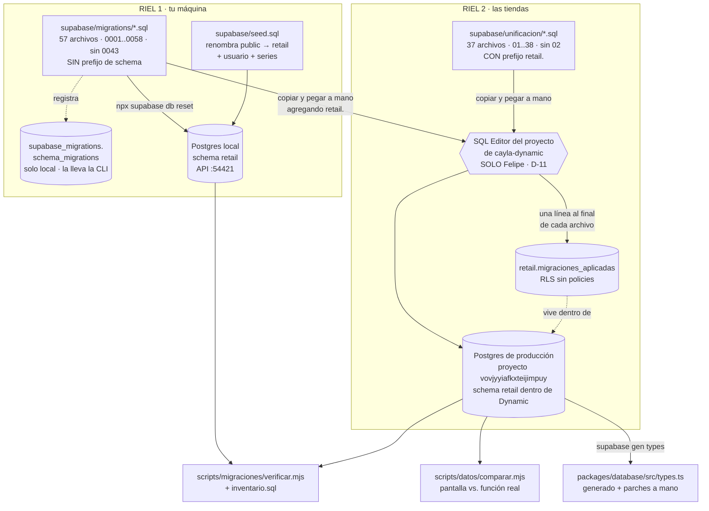
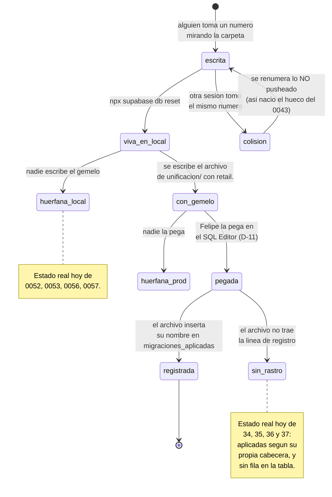

# 14 · Plataforma y esquema
> **Pájaro:** GORRIÓN · **Lo lleva:** _(libre — apúntate en `07-GOBIERNO.md`)_ · **Última revisión:** 2026-09-12

## Para qué existe

Los otros trece módulos describen lo que la base guarda. Este describe **cómo la base
llega a ser lo que es**: quién puede cambiarla, por qué camino, y cómo se sabe después
qué se cambió. El problema real: CAYLA no tiene un botón de "desplegar la base". Tiene
dos carpetas de SQL con reglas distintas, una máquina que corre una y unas tiendas que
corren la otra a mano, y hasta septiembre de 2026 ninguna forma de saber cuál de los 94
archivos había llegado allá. Eso ya se cobró tres veces: una pantalla que se rompió con
la clienta esperando, un ajuste de stock que fallaba solo en local, y una función
arreglada a mano en producción que no existe en ningún archivo del repo.

Este módulo es el inventario honesto de ese desorden, y la tabla que lo empieza a cerrar.

## El mapa

Ciclo de vida de una migración, con los tres sitios donde se queda trabada:

## Las tablas

### `migraciones_aplicadas` — qué SQL se pegó de verdad en las tiendas, y cuándo
**Existe en:** local y producción — pero no son la misma tabla en la práctica.
En local la crea `supabase/migrations/0058_migraciones_aplicadas.sql:30-36` **sin
ninguna fila**; en producción la crea `supabase/unificacion/38_migraciones_aplicadas.sql:67-73`
y la llena con 17 filas de arranque (`:75-95`).
**Quién escribe:** nadie desde la app. **No hay RPC y no hay pantalla.** La escribe una
persona —Felipe— pegando SQL en el SQL Editor del proyecto de cayla-dynamic. La
convención que declara `38_migraciones_aplicadas.sql:40-43` es que cada archivo nuevo de
`supabase/unificacion/` termine con su propia línea de registro.

| Columna | Tipo | Vacío | Por defecto | Para qué sirve |
|---|---|---|---|---|
| `archivo` | text | no (PK) | — | El nombre exacto del archivo que se pegó, tal como se llamaba **el día que corrió**. Es la llave primaria: pegar dos veces el mismo archivo no duplica la fila. |
| `aplicada_at` | timestamptz | no | `now()` | Cuándo corrió. Con `on conflict do nothing`, si alguien vuelve a pegar el archivo la fecha que queda es la **primera** vez, no la última — que es lo que hace útil a la columna (`38_…sql:45-46`). |
| `nota` | text | sí | — | Con qué nivel de certeza se sabe esa fecha. En producción distingue dos cosas distintas: `"verificado en vivo 2026-09-10"` (se midió contra la base ese día) y `"según BACKLOG.md, no re-verificado hoy"` (lo dice un documento, no una medición). |

**Candados** (lo que la base impide que pase):
- `migraciones_aplicadas_pkey` — PRIMARY KEY sobre `archivo`. Garantiza que el historial
  no diga dos veces que el mismo archivo corrió, y hace que el `on conflict do nothing`
  de cada script sea seguro de re-pegar.
- **RLS activado, cero policies** (`0058:36` en local, `38_…sql:73` en producción). Ese
  es el candado fuerte: una tabla con RLS y sin ninguna política es **invisible por la
  API** para `anon` y para `authenticated`, hagan lo que hagan. El comentario de
  `0058_migraciones_aplicadas.sql:24-27` lo dice a propósito: más simple que escribir una
  policy que solo el Líder de equipo pudiera leer y después acordarse de mantenerla.
- **Lo que NO hay candado:** nada obliga a que la fila exista. Un archivo se puede pegar
  perfectamente sin dejar rastro — y es lo que pasa hoy (ver Huecos 3).

**Diferencias local vs producción:**
| | Local | Producción |
|---|---|---|
| Archivo que la crea | `migrations/0058` | `unificacion/38` |
| Prefijo de schema | ninguno (cae en `public`, el seed lo renombra a `retail`) | `retail.` explícito |
| Filas | **0, siempre.** El archivo local no tiene ni un `insert` | 17 que inserta el script; el diccionario generado contra producción el 2026-09-12 reporta **18** (`generado/retail_filas.json`) |
| Para qué sirve ahí | para nada: local ya tiene el registro nativo de la CLI | es el único registro que existe |

### `supabase_migrations.schema_migrations` — el registro nativo, **solo local**
**Existe en:** solo local. La crea y la mantiene la CLI de Supabase, no este repo.
**Quién escribe:** `npx supabase db reset` / `supabase start`, sola.

**No se escribe aquí su ficha campo por campo a propósito:** ningún archivo del repo
declara sus columnas, así que enumerarlas sería inventarlas. Lo que sí consta: su llave
primaria se llama `schema_migrations_pkey` y su choque es lo que dejó el local bloqueado
para todo el equipo el 2026-09-09, cuando dos sesiones escribieron el número `0042` a la
vez (`docs/BITACORA.md:1948-1952`, error `duplicate key … schema_migrations_pkey`).

Lo importante es la asimetría: **el riel de producción no tiene equivalente**. Eso es
exactamente lo que `0058_migraciones_aplicadas.sql:5-7` dice y por lo que la tabla de
arriba existe.

### `public.migraciones_aplicadas` (de Dynamic) — **solo producción**, y no es nuestra
**Existe en:** solo producción, en el schema `public` del proyecto de cayla-dynamic —
o sea, en el mismo Postgres, en el cajón de al lado. Es del sistema de personal, no de
retail. Se documenta acá por una sola razón: **se llama igual**.

| Columna | Tipo | Vacío | Por defecto | Para qué sirve |
|---|---|---|---|---|
| `numero` | integer | no | — | El número de la migración de Dynamic. |
| `nombre` | text | no | — | Su nombre. |
| `aplicada_at` | timestamptz | no | `now()` | Cuándo corrió. |

(Fuente: `docs/datos/generado/DICCIONARIO-DYNAMIC.md:1321-1329`, leído de la base real.)

**Por qué importa:** si alguien pega `insert into migraciones_aplicadas (archivo) …` en
el SQL Editor **sin** el prefijo `retail.`, no escribe en la tabla de retail: apunta a
ésta. Acá el accidente sale barato —falla con "la columna `archivo` no existe", porque
las columnas no calzan— pero es la misma trampa del prefijo que costó un round-trip con
la `0030` (`CLAUDE.md`, §"Cómo aplicar SQL a producción").

## Cómo se escribe (la única puerta)

**Este módulo no tiene ni una función RPC.** Es su rasgo principal, no un olvido: no
existe ninguna forma de cambiar el esquema desde la aplicación, y eso es correcto. La
única puerta es un ser humano con el SQL Editor abierto.

### El procedimiento real, paso a paso (D-11)

> **Actualización (2026-09-26):** los pasos 1 a 3 describen el procedimiento de antes del
> corte V1→V2. Desde el 2026-09-12 el Postgres local vive en `retail`: la migración se
> escribe **una sola vez**, con `retail.` en cada tabla (o `set search_path` al inicio) y
> nombre de timestamp (ADR-0034), y ese mismo archivo es el que se pega. No hay gemelo en
> `supabase/unificacion/`, que no recibe archivos desde el 2026-09-11 (ver `CLAUDE.md`,
> §"Cómo aplicar SQL a producción", y `08-OPERACION.md` §3). El texto de abajo se conserva
> como registro.

1. **La migración se escribe en `supabase/migrations/NNNN_nombre.sql`, sin prefijo de
   schema.** Corre limpia contra el Postgres local, que sí usa `public`.
2. **Se prueba en local** con `npx supabase db reset`. El seed la deja en `retail`
   después de migrar.
3. **Se escribe el gemelo en `supabase/unificacion/NN_nombre.sql`, con `retail.` en cada
   tabla** — o con `set search_path to retail, public;` al principio. Sin eso, el SQL
   Editor busca en el `public` del proyecto de Dynamic y el síntoma es
   `relation "…" does not exist` (42P01): parece que la tabla no existiera cuando en
   realidad se está mirando el cajón equivocado.
4. **Felipe, y solo Felipe, lo pega en el SQL Editor** del proyecto
   `vovjyyiafkxteijimpuy` (cayla-dynamic). Nadie más toca la base de las tiendas.
5. **El archivo termina registrándose solo**:
   `insert into retail.migraciones_aplicadas (archivo) values ('NN_nombre.sql') on conflict (archivo) do nothing;`
6. **La cabecera del archivo trae su propia verificación**, para correr a mano después de
   pegar. El SQL Editor no siempre muestra los `raise notice`, así que la verificación se
   escribe como un `select` que devuelve una tabla — que no se puede perder de vista
   (patrón visible en `unificacion/36_candados_no_null.sql:56-65` y
   `38_migraciones_aplicadas.sql:98-106`).

### El entorno local: por qué el schema se renombra en el seed (ADR-0010)

Hasta el 2026-09-05 **la app nunca había corrido contra el Supabase local**, y nadie lo
sabía. La causa: producción vive dentro del proyecto de cayla-dynamic, en un schema
llamado `retail`, así que la app pide `db: { schema: "retail" }`
(`apps/web/lib/supabase/server.ts:11` y `client.ts:8`). Pero las migraciones se escriben
sin prefijo para correr limpias en local — y eso las deja en `public`. La app pedía un
cajón que en local no existía. Consecuencia real acumulada: cada pantalla nueva se
verificaba contra producción, o no se verificaba.

La solución de ADR-0010 es **renombrar el schema después de migrar, no antes**:

| Paso | Dónde | Qué pasa |
|---|---|---|
| `alter schema public rename to retail` | `seed.sql:24` | El cajón entero pasa a llamarse como en producción. |
| `create schema public` | `seed.sql:25` | Se vuelve a crear un `public` vacío, porque Supabase lo espera. |
| Reescritura de `search_path` en bloque | `seed.sql:28-43` | Las funciones llevan `set search_path = public` escrito en su definición y el renombrado **no** reescribe ese texto. Sin este bloque, toda RPC fallaría con "relation does not exist". Se hace en bloque para no depender de que alguien lo recuerde función por función. |
| `grant usage/all` sobre `retail` | `seed.sql:48-51` | Supabase solo auto-expone lo que se crea en `public`; un schema propio necesita los permisos explícitos. |
| Usuario y series de arranque | `seed.sql:55-110` | `felipe@cayla.local` / `cayla-local`, y las series B001/F001 de AQP, para que Facturación sea probable de punta a punta. El catálogo **no** se siembra: 300-900 SKUs reales entran por la pantalla de Recibir mercadería, y un catálogo de juguete haría que Inteligencia mienta. |

Lo que el entorno local **no** tiene, a propósito (`supabase/config.toml`): `storage`
(`:122-132` — no se pueden probar las fotos), `realtime`, `analytics` y `edge_runtime`.
Los tres últimos la app no los usa; `storage` sí, y apagarlo fue una pérdida consciente
porque era el último contenedor que impedía que el entorno existiera. El API local
responde en `:54421` y el Postgres en `:54422` — **no** en el `:54321` por defecto, que
es el stack de cayla-dynamic en la misma máquina. Apuntar al equivocado no explota: la
copia local de Dynamic también tiene un schema `retail`, así que catálogo y ventas
responden bien y solo fallan las pantallas nuevas. Pasó cuatro veces; para eso está
`pnpm local:donde`.

### Los permisos de tabla: `0004_grants.sql`

RLS decide **qué filas** ve cada quien. Los grants deciden si la puerta del schema está
abierta siquiera. Hacen falta los dos, y `supabase/migrations/0004_grants.sql` es todo lo
que el repo dice del segundo:

| Línea | Qué hace | Consecuencia |
|---|---|---|
| `:5` | `grant usage on schema public to authenticated, service_role` | La API puede entrar al schema. `anon` **no** está. |
| `:7-9` | `grant all` de tablas, secuencias y funciones a `service_role` | La llave de servidor puede todo. Hoy la app **no la usa**: `packages/database/src/client.ts:4-9` dice que la Fase 1 solo usa la llave publishable. |
| `:11-13` | `grant select, insert, update, delete on all tables` + `execute on all functions` a `authenticated` | **Ésta es la superficie de riesgo del sistema entero.** Cualquier sesión con cuenta puede escribir directo a cualquier tabla; lo único que lo frena es que esa tabla tenga una policy de escritura restrictiva. Donde la policy es permisiva, la RPC deja de ser "la única puerta". |
| `:15-17` | `alter default privileges in schema public …` | Las tablas y funciones que creen las migraciones siguientes heredan lo mismo sin repetirlo. |

Tres cosas que hay que saber leer de ese archivo:

- **`grant … on ALL tables` es una foto, no una regla.** Vale para las tablas que existían
  cuando corrió `0004` (o sea, las de `0001`). Lo que sostiene a las 50 migraciones
  siguientes es el `alter default privileges` de `:15-17`, no el `grant` de `:11`.
- **No hay grants por columna, y no puede haberlos con esta forma.** El comentario de
  `0003_rls.sql:1-2` promete que el Integrante "no ve costo/margen": `0004` da
  `select` sobre la tabla entera, así que esa promesa nunca fue cierta. D-27 la resuelve
  por la vía honesta —los costos se dejan visibles a propósito, por transparencia— y
  manda corregir el comentario.
- **`0004` no tiene gemelo en `supabase/unificacion/`.** Los grants que hacen funcionar
  producción —el `grant usage on schema retail`, sin el cual la app no vería nada— no
  están escritos en ningún archivo de este repo. Funcionan; no constan.

### Lo que escribe directo, sin pasar por RPC

Todo. El schema no se cambia por RPC, se cambia pegando DDL. Los puntos donde eso deja
huella en el repo:

- `supabase/seed.sql:24-53` — el único archivo que **crea y renombra schemas**. Solo corre
  en local (`config.toml:74`, `sql_paths = ["./seed.sql"]`).
- `supabase/unificacion/34_idempotencia_registrar_venta.sql:194-195` y
  `35_recalcular_stock_almacen.sql:178-179` — los dos únicos sitios de producción que
  ajustan permisos de una función (`revoke all … from public`, `grant execute` a
  `authenticated, service_role`).
- `supabase/migrations/0055_recalcular_stock_almacen.sql:103-104` — el mismo par en local.
  **`0054_venta_idempotente.sql` no lo trae**, así que en local el rol `public` conserva
  el `execute` por defecto sobre `registrar_venta` y en producción no. Diferencia real de
  permisos entre las dos bases, en la función que cobra.

## Quién ve y quién toca

| Operación | Admin | Líder de equipo | Integrante | Solo lectura |
|---|---|---|---|---|
| Leer `migraciones_aplicadas` desde la app | **no** | no | no | no |
| Escribir `migraciones_aplicadas` desde la app | **no** | no | no | no |
| Pegar SQL en la base de las tiendas | **solo Felipe** (D-11) | no | no | no |
| Correr `npx supabase db reset` en su máquina | sí | sí | sí | sí |
| Correr `pnpm migraciones:verificar` | sí | sí | sí | sí |

Las dos primeras filas dicen "no" para los cuatro niveles y no es un error: la tabla tiene
RLS activado y **ninguna** policy (`0058:36`, `38_…sql:73`), así que ni `anon` ni
`authenticated` la ven. `service_role` la vería, pero la app no tiene cliente de
`service_role` (`packages/database/src/client.ts:4-9`). El único camino es el SQL Editor.

**Ojo con local:** `supabase/seed.sql:48-49` hace
`grant usage on schema retail to anon, authenticated, service_role` y
`grant all on all tables in schema retail to anon, …`. Le da a `anon` permisos de tabla
que `0004` nunca le dio. Las filas siguen protegidas por RLS —las policies del repo piden
`auth.role() = 'authenticated'`— pero es una diferencia local↔producción en la capa de
grants, y el verificador no la mira (ver Huecos 6).

## Qué se rompe sin esto

Sin este módulo la base no deja de funcionar: deja de ser **conocible**. Nadie puede
responder "¿qué versión de `registrar_venta` está viva en las tiendas?" sin abrir el SQL
Editor y mirar, y eso convierte cada despliegue en una apuesta. Ya pasó: `recibir_lote`
corrió meses con una copia más vieja que la local, sin validar sede (ADR-0004), y
`retail.recalcular_stock` apareció en producción con un arreglo que no existe en ningún
archivo del repositorio (ADR-0026, ampliación 2026-09-10). Si además se pierde el registro
de quién pegó qué, `npx supabase db reset` más `supabase/unificacion/` dejan de reproducir
el sistema — y ese día el repo ya no es la fuente, es una aproximación. La tienda sigue
vendiendo; lo que se pierde es la capacidad de arreglarla con confianza.

## Huecos conocidos

1. **El hueco de numeración `0042 → 0044`: no falta nada, sobró un choque.** No existe
   `0043` y no debe existir. El 2026-09-09 dos sesiones escribieron a la vez una migración
   de almacén interno: una tomó `0042_almacen_interno.sql` (nombre ya ocupado por
   `0042_recalcular_stock_neto.sql`, pusheado horas antes) y la otra
   `0043_almacen_interno_local.sql`. `npx supabase db reset` falló con
   `duplicate key … schema_migrations_pkey` y **el local quedó bloqueado para todos**
   (`docs/BITACORA.md:1946-1958`). Se resolvió por asimetría: lo pusheado no se renumera,
   lo no commiteado sí. La versión `0043` se borró y la otra pasó a `0044`. *Consecuencia:*
   ninguna hoy — pero la causa sigue viva, el número de migración se sigue tomando mirando
   la carpeta local en vez de `origin`, y el mismo choque ya ocurrió **cinco veces más**:
   tres renumeraciones del archivo de `migraciones_aplicadas`
   (`unificacion/38_migraciones_aplicadas.sql:8-30`) y dos de ADR
   (`git log`: `renumera 0037 a 0038`, `renumera 0038 a 0039`).

2. **`unificacion/02_*.sql` no existe: el archivo que crea el schema `retail` nunca quedó
   en el repo.** La carpeta va `01`, `03`, `04`… y `03_candados.sql:3` dice "después del
   paso 2 (schema retail + sede_meta)". *Dónde se ve:* `docs/BACKLOG.md:1365-1369` —
   *"falta el ADR que debió escribirse en julio … y el `02_*.sql` que crea el schema en sí
   nunca quedó en el repo (se infiere solo de la cabecera de `03_candados.sql`)"*.
   *Consecuencia concreta:* el paso que crea el cajón donde vive TODO retail no se puede
   reproducir desde el repo. Se ve además en la costura que dejó: `01_sedes.sql:19` crea
   `retail_sede_meta` (un nombre plano, en el `public` de Dynamic) y `03_candados.sql:18`
   ya hace join contra `retail.sede_meta` — el renombrado ocurrió en el archivo que falta.
   Si mañana hay que levantar una segunda base (D-18, D-50), ese paso se improvisa.

3. **La tabla que existe para que no haya suposiciones está llena de suposiciones.**
   De las 17 filas que inserta `unificacion/38_migraciones_aplicadas.sql:75-95`, **11
   dicen `"según BACKLOG.md, no re-verificado hoy"`**: la fecha viene de lo que escribió
   otra sesión, no de una medición. Y las cuatro últimas migraciones de producción —`34`,
   `35`, `36`, `37`— **no tienen fila**, aunque sus propias cabeceras afirman que
   corrieron (`34:3` "este archivo CORRIÓ en producción", `35:3` "Aplicado en producción
   … el 2026-09-10", `36:5` "PRODUCCIÓN YA LO TIENE. Verificado contra la base el
   2026-09-10"). *Consecuencia:* hoy mismo, la única consulta que debía contestar "qué
   corrió" contesta mal para los cuatro archivos más recientes.

4. **Hay una fila en producción que ningún archivo del repo explica.** El script inserta
   16 + 1 = 17 filas; el diccionario generado contra producción el 2026-09-12 reporta
   **18** (`docs/datos/generado/retail_filas.json`, campo `migraciones_aplicadas`). El
   conteo viene de `pg_stat_user_tables` y es aproximado, así que no es prueba — pero es
   exactamente el tipo de diferencia que esta tabla existe para eliminar, y no hay forma
   de resolverla sin mirar la base. *Consecuencia:* alguien pegó algo que no consta, o el
   conteo miente. No se sabe cuál.

5. **Dos archivos distintos se llaman ADR-0003.**
   `docs/adr/0003-taxonomia-captura-real.md` (2026-09-03, categorías del catálogo) y
   `docs/adr/0003-modal-compartido-radix-sin-kit-visual.md` (2026-09-04, modales de la
   interfaz). No tienen nada que ver entre sí. *Dónde duele ya:* `docs/ARQUITECTURA.md:344`
   cita "ADR-0003" queriendo decir el de taxonomía; `docs/BACKLOG.md:1518`,
   `docs/adr/0011-campos-y-capa-de-movimiento.md:20`,
   `docs/adr/0014-riel-del-lateral-y-navegacion-como-instrumento.md:90`,
   `docs/adr/0019-el-panel-nuevo-es-un-menu-no-un-dialogo.md:13` y
   `apps/web/components/AppShell.tsx:175` citan "ADR-0003" queriendo decir el de modales.
   *Consecuencia:* toda referencia a ADR-0003 obliga a abrir los dos archivos para saber
   de cuál habla. Ya está anotado en `docs/datos/07-GOBIERNO.md:141-144`; falta renumerar.

6. **El verificador no mira permisos. Ni uno.** `scripts/migraciones/inventario.sql` lista
   tablas, columnas, funciones, índices y policies de `retail`, `public` y `storage`, y
   `verificar.mjs` los cruza contra lo que prometen los archivos — pero **ninguno de los
   dos contiene la palabra `grant`**. ADR-0026 lo dice de las otras cosas
   (*"tablas, columnas, restricciones, índices y políticas se siguen comparando solo por
   existencia"*); de los grants ni eso. *Consecuencia:* un `revoke` de más o de menos en
   producción es indetectable por herramienta, y ya hay una asimetría viva
   (`0054` local sin el `revoke`/`grant` que sí trae `unificacion/34:194-195`).

7. **Promesa incumplida: el conteo de archivos está mal en dos documentos.** El último
   número de cada riel **no** es la cantidad de archivos, justo porque falta el `0043` en
   uno y el `02` en el otro. Los números reales son **57** y **37**. Dicen otra cosa:
   `docs/datos/00-MAPA.md:217` (*"Migraciones locales | 58 archivos (falta el 0043, ver
   módulo 14)"* — cuenta mal en la misma línea en que avisa del hueco), `:218`
   (*"Migraciones de producción | 38 archivos"*), y
   `docs/datos/`DECISIONES-2026-09-12.md`:370`, `:375` y `:385` (*"los 38 archivos"*,
   *"los 58 archivos"*, *"hay que reescribir 38 archivos"*). La propia acta arrastra el
   número alto en D-17 (*"38 archivos, el riel real de producción"*).
   *Consecuencia:* menor en sí misma, grave por lo que enseña — quien planifique el
   trabajo de extinguir el riel doble (D-17) presupuesta dos archivos de más.
   `docs/datos/`08-OPERACION.md` y `00-MAPA.md`:408-411` ya
   dicen 57 y 37: la corrección va en los otros dos.

8. **Los tipos de TypeScript no salen correctos de ninguna base, y llevan parches a mano
   con fecha.** `packages/database/src/types.ts:1-34` lo declara sin adornos: *"Ningún
   entorno tiene hoy el esquema completo, así que ninguna regeneración sale correcta
   sola"*. Producción no tiene la taxonomía universal (`0052` nunca se pegó allá); local
   no tiene `catalogo_con_stock`, `configuracion_empresa`, `sede_meta`,
   `sede_datos_fiscales`, `persona_actual` ni `puede_operar_sede` (vienen de
   `unificacion/`, que local nunca corre). Por eso `gen-types`
   (`packages/database/package.json:8`) **ya no escribe sobre el archivo**: deja la salida
   cruda en `src/types.produccion.ts` (gitignored, `.gitignore:33`) para compararla a mano.
   Hay cuatro parches con fecha anotados en la cabecera, y reponerlos después de cada
   regeneración es trabajo manual que nadie verifica. *Consecuencia en la plata:*
   `pnpm typecheck` compara el código contra estos tipos, no contra la base — así que
   aprueba llamadas imposibles. Es literalmente lo que pasa hoy con dos pantallas:
   `RecibirLoteForm.tsx:431` manda `p_orden_produccion_id` y `RegistrarGastoModal.tsx:57`
   manda `p_metodo_pago`, y producción no acepta ninguno de los dos
   (`docs/datos/generado/DRIFT.md:9-25`). Recibir mercadería y registrar un gasto fallan
   **siempre** en las tiendas, y el typecheck está en verde.

9. **Cuatro migraciones locales no tienen gemelo de producción.** `0052`
    (taxonomía universal), `0053` (el mínimo de stock sobrevive a `recalcular_stock`),
    `0056` y `0057` (importar catálogo) existen solo en el riel local. *Consecuencia:*
    la importación masiva de catálogo —la herramienta para meter las 900 prendas— no
    existe en las tiendas, y el arreglo de `0053` tampoco: allá, `recalcular_stock` sigue
    borrando el mínimo de una prenda que aún no se ha movido en esa sede.

10. **Y dos de producción no tienen gemelo local.** `unificacion/36_candados_no_null.sql`
    y `37_registrar_venta_p_nota.sql` arreglan cosas que en local ya estaban bien, así que
    nunca subieron al riel numerado. *Consecuencia:* `npx supabase db reset` no reproduce
    producción, y nunca lo hará mientras esa carpeta sea el único sitio donde viven esos
    pasos. Es el caso concreto que ADR-0026 llama *"la base local no es una réplica fiel
    de producción"*.

11. **Una cabecera apunta a un archivo que ya no existe.**
    `unificacion/26_ultima_venta_en_aplicar_movimiento.sql:5` dice *"Gemelo de
    `supabase/migrations/0042_almacen_interno.sql`"*. Ese archivo se renombró a `0044` en
    la colisión del hueco 1 y el gemelo no se actualizó. *Consecuencia:* quien siga esa
    referencia buscando el archivo local no lo encuentra, y el camino más corto a
    concluir "esto no existe en local" es equivocado.

12. **El código de la sede corporativa no coincide entre las dos bases (D-20).** Local usa
    `'CORP'` (`0020_contabilidad_cimientos.sql:23` y `:26`), producción usa `'CCO'`
    (`unificacion/01_sedes.sql:36` y `:40`). *Consecuencia:* cualquier consulta o prueba
    escrita contra el código de la sede corporativa funciona en una base y devuelve vacío
    en la otra — sin error, solo cero filas. D-20 lo resuelve: `CCO` manda, `CORP` es un
    error de local que se corrige.

13. **No hay entorno intermedio (D-18).** Solo existen "tu máquina" y "las tiendas". Todo
    cambio que pasa de una a otra lo ve una clienta ese mismo día. Y no se puede tapar con
    local, porque local no es fiel (huecos 9 y 10). *Consecuencia:* la única prueba real
    de una migración es pegarla en producción.

14. **En local no se pueden probar las fotos.** `supabase/config.toml:122-132` apaga
    `storage` a propósito, porque era el contenedor que impedía que el entorno local
    existiera (ADR-0010). *Consecuencia:* subir fotos de producto no se puede verificar
    sin apagar el stack de cayla-dynamic. Del mismo orden: `config.toml:74` solo carga
    `./seed.sql`, así que `supabase/seed-demo.sql` y `supabase/seed-pruebas/` **nunca
    corren** en un `db reset` — están ahí y no hacen nada.

## Decisiones que lo gobiernan

- **D-11** — Solo Felipe pega SQL en producción, y queda anotado. Es la razón de ser de
  `migraciones_aplicadas`.
- **D-16** — Cada tabla lleva marca de en qué base existe. Acá se aplica hasta a la propia
  tabla de registro, que es distinta en cada riel.
- **D-17** — `supabase/unificacion/` es deuda a extinguir, con fecha. Se documenta
  honestamente por qué nació y queda escrito el plan de volver a un solo camino.
- **D-18** — Hace falta un entorno intermedio. Hueco 14.
- **D-19** — La comparación local↔producción debe ser automática y avisar solo cuando
  difieren. Hoy es manual: `pnpm migraciones:verificar` y `node scripts/datos/comparar.mjs`
  se corren a mano.
- **D-20** — La sede corporativa se llama `CCO`; `CORP` de local es un error a corregir.
  Hueco 13.
- **D-07** — Lo muerto se marca muerto. Acá: `unificacion/13_recibir_lote_valida_sede.sql`
  (superado por el `14`) y `unificacion/34` (supersedido por el `37`, y su propia cabecera
  dice **NO volver a pegarlo**) siguen en la carpeta porque son el registro de lo que
  corrió, no instrucciones vigentes.
- **D-10** — Antes de cambiar el esquema se escribe el porqué en un ADR. Son 40 archivos y
  funcionan; el defecto está en el hueco 5.
- **D-24** — Las promesas incumplidas se documentan con cita exacta. Huecos 7, 8 y 9.
- **ADR-0010** — El entorno local existe: el schema se renombra en `seed.sql`, después de
  migrar, no en las migraciones. Es lo que permite que las migraciones se escriban de una
  sola forma y que local y producción tengan la misma forma de schema.
- **ADR-0026** — Cómo sabemos qué corrió en producción, y por qué la firma vieja se borra.
  Gobierna `scripts/migraciones/` y la regla de que toda migración que cambie la firma de
  una función lleve su `drop function` con los tipos explícitos.
- **ADR-0004** — `recibir_lote`: el primer caso documentado de que la unificación migró una
  copia más vieja que la local. El origen del riel dual como problema y no como detalle.
- **ADR-0006** — `patrimonio_items.categoria`: el segundo caso del mismo agujero.
- **ADR-0009** — `create or replace` con un argumento nuevo no reemplaza: bifurca. La
  trampa que ADR-0026 convirtió en regla.
