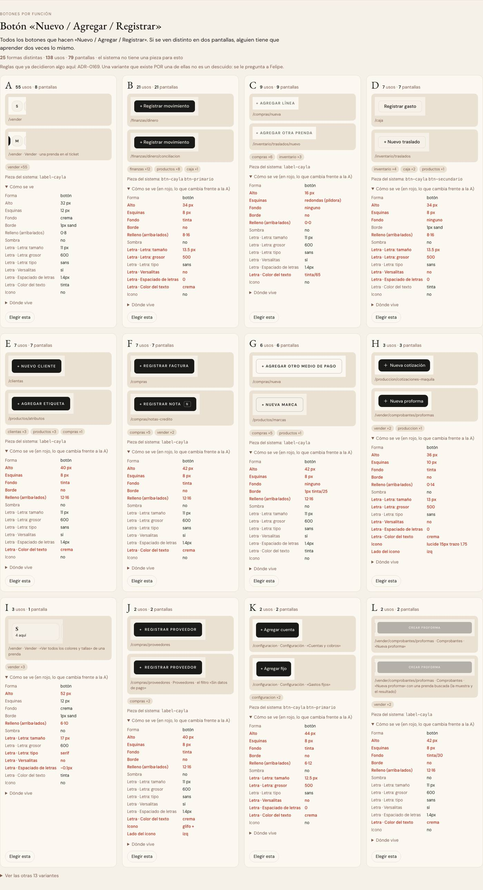

# Botón «Nuevo / Agregar / Registrar» — una sola pieza (ADR-0358)

**Decidido:** 2026-10-07, Felipe, **mirando** (página de elegir de la ronda 2). **Elegida:** B, versalitas de 11 px y 40 px de alto (la de
`label-cayla`). **Pieza:** `<Boton>` y, para lo que navega, `<BotonEnlace>` (`components/ui/campos.tsx`).

La acción principal de una pantalla («+ Registrar factura», «+ Registrar gasto», «+ Nuevo cliente», «+ Nueva orden») y el botón que le hace
pareja al lado (Exportar, Ver órdenes, Actividad) se ven igual en todo el ERP: `peso="primario"` (tinta) para la acción, `peso="fantasma"` (borde)
para su pareja.

## Qué se comparó

| Forma | Dónde vivía | Cómo se veía | Movimiento |
|---|---|---|---|
| A · `btn-cayla` | 21 pantallas: Finanzas, Productos, Caja, Colaboradores | 34 px, letra normal de 13,5 px | solo cambia de color (150 ms) |
| **B · `label-cayla`** | ~24 usos en 21 pantallas: Compras, Clientes, Producción, formularios | 40 px, VERSALITAS de 11 px | en `<Boton>`: barrido de luz, se encoge al presionar, hilo al guardar; copiada a mano: solo color |
| C · propuesta | — | letra normal, 40 px, «+» dibujado | — |

Las tres se mostraron en las mismas tres pantallas (Compras, Finanzas ▸ Gastos, Clientes). Los botones de Vender (`BotonCompacto`) **no entraron**:
se deciden con la pasada de la cuenta `terminal-ventas`.

## Por qué esta

Es la que ya tenían la mitad de las cabeceras y los formularios, y es la única con movimiento propio. Se pierde la letra normal de `btn-cayla`
en esos botones; la jerarquía completa de botones (Cancelar, Guardar en las hojas…) es otra ronda (`boton`).

## El movimiento de la pieza (Felipe 2026-10-07: conservarlo y unificarlo)

- **Al pasar el mouse:** cruza un barrido de luz (`cayla-brillo`, 650 ms, una vez) y el primario pasa a rojo profundo; la pareja (fantasma)
  pasa el borde y la letra a rojo.
- **Al presionar:** se encoge un 3 % (`active:scale-[0.97]`); deshabilitado, no.
- **Mientras guarda** (`cargando`): un hilo corre por el borde de abajo y el botón no se puede volver a tocar.
- **Con el teclado:** el anillo único del ERP (ADR-0351).
- Todo se apaga con `prefers-reduced-motion`.

Lo que se ganó al migrar: los botones B copiados a mano (Compras, Producción, Proveedores, Notas de crédito, Familias) solo cambiaban de color
y su hover era el rojo de marca; ahora tienen el barrido, el encogerse y el hover de la guía (rojo profundo). Los de `btn-cayla` pasan de 150 ms
de color a todo el movimiento.

## Lo que queda distinto a propósito

- **El «Registrar N» del anillo de Análisis** (`components/analisis/TodaviaNo.tsx`): tiene su propio diseño y movimiento (ADR-0357). Felipe dice
  si se unifica.
- **Vender** (`BotonCompacto`: Nueva cotización, Nueva serie): espera la pasada de `terminal-ventas`.

## Deuda al decidir

20 archivos (`pnpm --filter web unificar:deuda accion.nuevo`), migrados módulo por módulo el mismo día: Compras, Producción, Catálogo,
Inventario, Caja, Colaboradores, Configuración y Finanzas.
