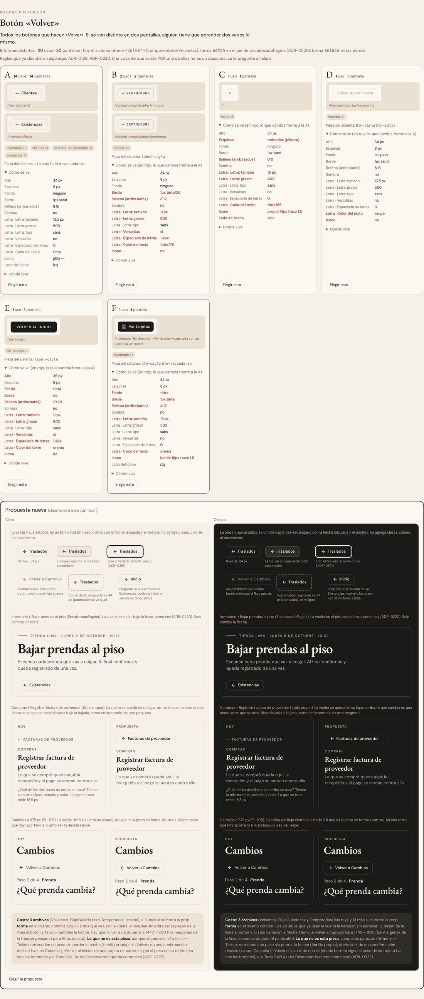

# Botón «Volver» — una sola pieza (ADR-0358)

**Decidido:** 2026-10-06, Felipe, **mirando** (página de `/unificar`, `unificar/elegir.mjs`). **Elegida:** la flecha redonda que ya estaba en
Nuevo producto, junto a la línea «sede · fecha» de `EncabezadoPagina` (nació el 2026-10-06 en `main`, ADR-0220 act.). **Pieza:**
`apps/web/components/ui/Volver.tsx`.

La vuelta de una pantalla interna a la pantalla de su menú es **un botón redondo de 34 px, solo con la flecha**. Adónde vuelve lo dicen su
nombre accesible y su `title` («Volver a Existencias»). El LUGAR lo pone cada cabecera: en `EncabezadoPagina`, su prop `volver` (a la izquierda
de la sede); en las demás (Compras, Caja, Recibir, el resto de Catálogo), donde ya estaba la vuelta, arriba del título.

## Cómo se llegó aquí

1. **2026-10-06, ronda 1.** El censo contó 6 formas en 20 pantallas y la depuración, 9 reales. Felipe eligió la recomendación por su
   descripción («un solo botón con flecha»: el `btn-secundario` con el destino escrito) y se aplicó.
2. **Ese mismo día, más tarde.** Al verla aplicada, no le gustó. En la página de elegir pidió: «analiza la flecha que está actualmente en Nuevo producto
   para volver y quiero quedarme con esa». Esa flecha había entrado a `main` el día anterior como tercera forma (`forma="flecha"`); ahora es
   la única.

| Forma | Qué era | Dónde vivía | Hoy |
|---|---|---|---|
| Flecha redonda | botón de 34 px solo con la flecha, junto a la sede | Inventario, Productos ▸ Nuevo, Pedidos (desde el 2026-10-06) | **la pieza** |
| Botón con destino | `btn-secundario` «← Clientes» | el cartel del club; antes, el pie de `EncabezadoPagina` | pasa a la flecha |
| Línea de 11 px | «← FACTURAS DE PROVEEDOR» en versalitas | Compras, Caja, Recibir, Productos ▸ editar e historial | pasa a la flecha |
| Fantasma del flujo | «← Volver a Cambios», botón sin borde | Cambios y Devoluciones | pasa a la flecha (forma `<button>`) |
| Copia a mano | «← Las nueve temporadas» | Temporadas del club | pasa a la flecha (forma `<button>`) |

## Qué es la pieza

- Una sola forma: fuera la prop `forma` (todas las pantallas dejaron de pasarla).
- Con `href` es un enlace (`useSalidaSinGuardar` solo intercepta enlaces); con `onClick`, un `<button>` (la salida del flujo de Cambios y
  Devoluciones, la vuelta de Temporadas, que cierran un estado de la misma pantalla).
- Nombre accesible «Volver a <destino>»; si el texto ya empieza con «Volver» (el flujo), no se repite.
- Con el dedo (`pointer: coarse`) la zona que responde llega a 44 px con un `::after` invisible, sin que el círculo crezca.

## Lo que queda distinto a propósito

El Observatorio («‹ Toda CAYLA» y su ×, ADR-0322), la página pública del club (ADR-0288 act. i) y la salida de las tarjetas de barrera (elegir
sede, sin acceso, 404), que es la única acción de su tarjeta y va con los botones. No son la vuelta: el **paso atrás** de un paso a paso («←
Atrás» de Nuevo producto, «← Ticket»), el «Volver» que desiste de una confirmación (`accion.cancelar`) y la página o el mes anterior
(`accion.anterior`).

## Ronda 3 (2026-10-07): el «Atrás» de un paso también es la flecha

En el censo del mostrador aparecieron dos caras del «Atrás» de un paso a paso (el «VOLVER» de la hoja de cobro y el «ATRÁS» de Cambios y
Devoluciones). Felipe no eligió ninguna de las propuestas: **«volver solo es una flecha», la de `<Volver>`**. Pasaron a `<Volver onClick a>`
(o `href`) todos los retrocesos de un paso: la hoja de cobro y el «← Ticket» de Vender, Cambios y Devoluciones (también «← Otra venta», el
paso 1, y «Volver a la actividad» al terminar), Nuevo producto, el cierre de caja, la talla de Existencias, Confirmar cambios del producto, el
resumen al recibir, el conteo («Volver a revisar»), el reverso de los pases de Traslados («← Volver», que conserva su `data-foco-reverso` con
la prop nueva `datos`) y las dos vueltas a mano de la página de un pase. Lo que dice adónde va está en su `aria-label` y su `title`.

**No son un paso atrás** y se quedan: el «Volver» de una confirmación («¿Seguro? [Volver] [Sí]», hace de Cancelar), «Volver a intentar»,
«Volver a lo predeterminado», «Volver al inicio» de una pantalla de error, «← Anterior / Volver al inicio» de una paginación, el enlace
«Volver al período» dentro de una frase, y «Volver a contar» de Revisar conteo, que es la acción principal de esa pantalla (excepción
registrada). Las firmas nuevas vigilan el «Atrás» suelto, la flecha dibujada con texto y el «Volver a …» de un botón.

Verificado a 1440 y a 375 px (Vender ▸ cobro, Cambios): con el dedo la flecha responde en 44 px.

## Preguntas resueltas (Felipe, 2026-10-07)

1. **La cuenta que no ve la pantalla de arriba.** No había nada que decidir: Bajar prendas al piso y Por regularizar están detrás del módulo
   «Existencias» (su `layout.tsx`), así que quien no lo ve cae en «Sin acceso» antes de ver la cabecera. Se quitó el chequeo sobrante y la
   flecha sale siempre.
2. **Las pantallas sin `EncabezadoPagina`** (Compras, Caja, Recibir, el resto de Catálogo): sigue abierta, es decidir la cabecera de esos módulos.

## Deuda

**0.** Las firmas (`apps/web/unificar/familias.mjs`) vigilan que no vuelva la línea de 11 px copiada a mano, una `forma=` en `<Volver>` ni una
vuelta escrita con el glifo («← Volver a …»). Un comentario que nombra la forma vieja no cuenta.
