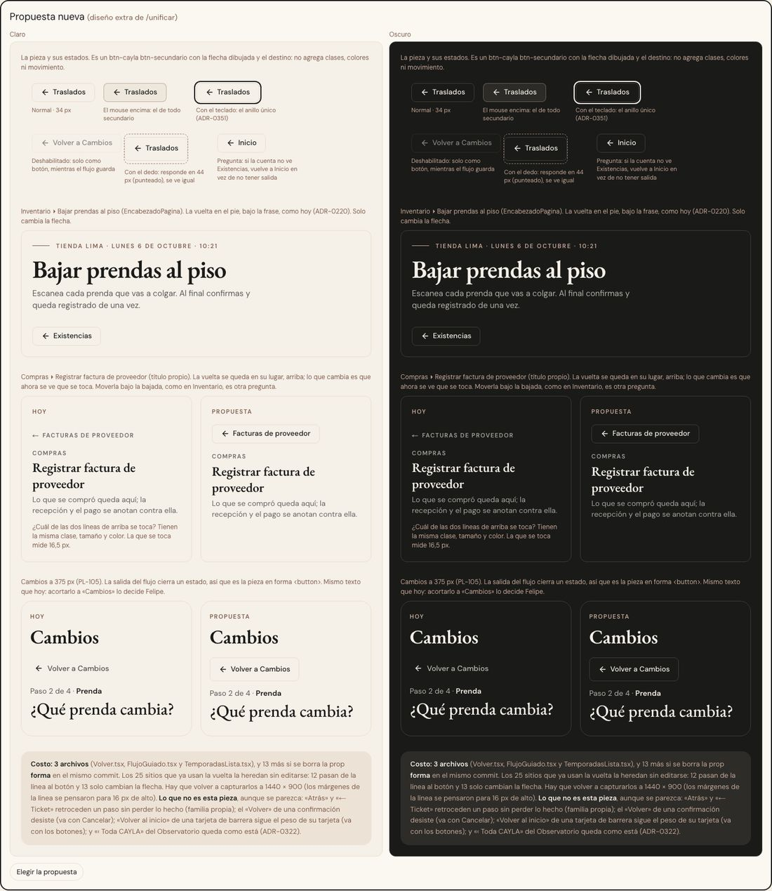

# Botón «Volver» — una sola pieza (ADR-0357)

**Decidido:** 2026-10-06, Felipe, con `/unificar` (ronda 1). **Elegida:** la propuesta, «Un solo botón con flecha». **Pieza:**
`apps/web/components/ui/Volver.tsx`. **Migrado:** el mismo día, commit `refactor(ui): «Volver» tiene una sola cara en todo el ERP`.

La vuelta de una pantalla interna a la pantalla de su menú es **el botón secundario del sistema con la flecha delante y el destino escrito**
(«← Existencias», «← Facturas de proveedor»). Una sola cara en todo el ERP; el lugar lo sigue poniendo cada cabecera (en `EncabezadoPagina`, en
el pie bajo la frase, ADR-0220; en las demás, donde ya estaba).

## Qué se comparó

El censo contó 6 formas en 20 pantallas; la depuración (cartógrafo, dos escépticos y consolidación) encontró **9 formas reales** de «volver a la
pantalla de arriba», y separó lo que parece una vuelta pero hace otra cosa.

| Forma | Qué es | Pieza | Archivos | Veredicto |
|---|---|---|---:|---|
| A | botón con borde «← destino» en el pie de `EncabezadoPagina` | `<Volver forma="boton">` | 13 | la elegida (con la flecha dibujada) |
| B | línea de 11 px en versalitas, sin borde | `<Volver>` (forma `enlace`) | 12 | se va: pasa a la A |
| Flujo | «Volver a Cambios / Devoluciones», botón fantasma de 40 px | `EncabezadoFlujo` (FlujoGuiado.tsx) | 3 | se va: pasa a la pieza (forma botón) |
| Copia | «← Las nueve temporadas», copia a mano de la B | TemporadasLista.tsx | 1 | se va: pasa a la pieza (forma botón) |
| Observatorio | «‹ Toda CAYLA» y su × | observatorio/Mapa.tsx, PanelTienda.tsx | 2 | queda: ADR-0322 |
| Club | «‹ Club CAYLA» de la página pública | clientas/RegistroClub.tsx | 1 | queda: ADR-0288 act. i |
| Barreras | la salida de «sin acceso», 404, error y elegir sede | sin-acceso, PantallaNoEncontrada, elige-sede | 4 | otra familia (botones de una tarjeta de barrera) |

No son la vuelta, aunque digan «Volver» o lleven una flecha: el **paso atrás** dentro de un trabajo abierto («Atrás», «← Ticket», «← Otra
venta», «Volver a revisar» en Confirmar conteo: familia propia), el «Volver» que **desiste de una confirmación** (va con `accion.cancelar`), «←
Septiembre» o «Volver al inicio» de la paginación (`accion.anterior`) y «Volver a como está» (`accion.limpiar`).

## Por qué esta

Es la única que deja **una sola respuesta a «¿cómo salgo de aquí?»** (leyes 1 y 2 de ADR-0350) y arregla el único caso donde no se sabía qué
tocar: en Registrar factura, la línea de 11 px tenía la misma clase, tamaño y color que el sobretítulo «COMPRAS» de abajo, y medía 16 px de alto
(bajo los 24 de ADR-0350). Es un `btn-secundario` del sistema, sin estilo propio: hereda lo que cambie mañana en los botones, el foco
(ADR-0351) o el modo oscuro (ADR-0336), y no se vuelve a separar.

## Qué cambió en la pieza

- Una sola forma: fuera la prop `forma` (las 13 pantallas que pasaban `forma="boton"` ya no lo hacen; las 12 de la línea heredan el botón solas).
- La flecha es `ArrowLeft` de lucide (16 px, trazo 2, el mismo de Cambios y Devoluciones), no el glifo «←»: el subconjunto de DM Sans que sirve el
  ERP no trae U+2190 y el glifo lo dibujaba la fuente del aparato.
- «Volver a » para el lector de pantalla (nombre accesible «Volver a Existencias»); se omite si el texto ya empieza con «Volver».
- Con el dedo (`pointer: coarse`) la zona que responde llega a 44 px con un `::after` invisible, sin que el botón crezca.
- Con `onClick` (sin `href`) es un `<button>`: la salida del flujo de Cambios y Devoluciones y la vuelta de Temporadas, que cierran un estado.
- Se van el corrimiento de 2 px y el rojo al pasar el mouse (ADR-0169 guarda el rojo).

## Lo que queda distinto a propósito

- El Observatorio (ADR-0322) y la página pública del club (ADR-0288 act. i).
- La salida de las tarjetas de barrera (elegir sede, sin acceso, 404, error): es la única acción de esa tarjeta y va con los botones; en la decisión,
  `elige-sede/page.tsx` es una excepción porque su texto dice «← Volver a Salud del negocio».

## Preguntas abiertas para Felipe

1. **La cuenta que no ve la pantalla de arriba.** En Bajar prendas al piso y en Por regularizar, la vuelta solo aparece si la cuenta ve
   Existencias: quien no la ve se queda sin salida. ¿Que diga «← Inicio» en ese caso? (Es comportamiento con permisos: no se tocó.)
2. **El texto del flujo.** «Volver a Cambios» / «Volver a Devoluciones» se dejó igual; ¿acortarlo a «Cambios» / «Devoluciones» como las demás vueltas?
3. **El lugar.** Fuera de Ventas, Inventario y Catálogo ▸ Productos la vuelta sigue arriba del título. Ponerla bajo la frase en todas es decidir la
   cabecera de esos módulos (CLAUDE.md la deja sin decidir).

## Deuda al decidir

| Módulo | Archivos | Estado |
|---|---:|---|
| Pieza (`ui/Volver.tsx`) y sus 25 usos | 1 + 13 | migrado el 2026-10-06 |
| Ventas (flujo de Cambios y Devoluciones) | 1 (`FlujoGuiado.tsx`) | migrado el 2026-10-06 (375 px) |
| Clientes (Temporadas) | 1 (`TemporadasLista.tsx`) | migrado el 2026-10-06 |

Deuda hoy: **0**. Las firmas de la decisión (`apps/web/unificar/familias.mjs`) vigilan que no vuelva: la línea de 11 px copiada a mano, una
`forma=` en `<Volver>` y una vuelta escrita con el glifo («← Volver a …»).
