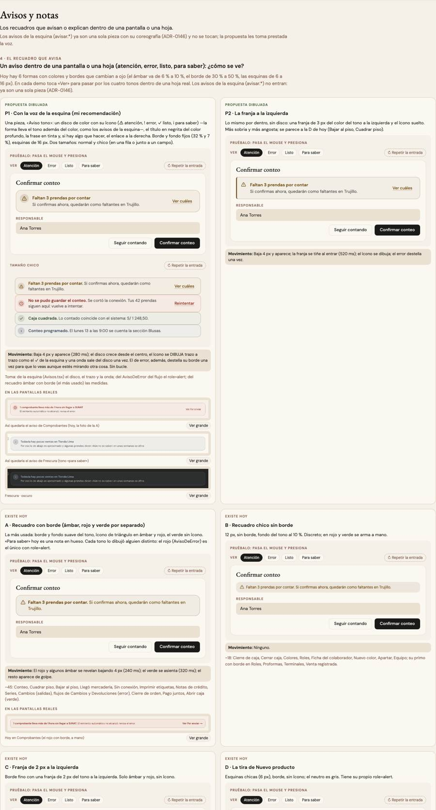

# Avisos y notas — una sola pieza (ADR-0358, ronda 5)

**Decidido:** 2026-10-08, Felipe, **tocándolas** (página de elegir con demos vivas, `apps/web/unificar/.salida/elegir-ronda5/`).
**Elegida:** P2 (la franja) · P1 (la nota con su «i») · P1 (el error, en su lugar). **Pieza:** `<Aviso>` (`components/ui/Aviso.tsx`),
la «i» de `nota-cayla` y el ícono del pie de error de `<Campo>` (CSS en `app/estilos/vacio-aviso-buscador.css`).

## Qué se comparó

6 recuadros que cambiaban a ojo (el ámbar de 6 % a 10 %, el borde de 30 % a 50 %, las esquinas de 6 a 16 px) y ~68 párrafos rojos sueltos:

| Forma | Usos | Cómo se veía |
|---|---:|---|
| A · recuadro con borde (ámbar, rojo y verde por separado) | ~45 | borde y fondo suave del tono, triángulo en ámbar y rojo; el rojo `AvisoDeError` era el único con role=alert |
| B · recuadro chico sin borde | ~18 | 12 px, fondo al 10 % |
| C · franja de 2 px | 7 | solo ámbar y rojo, sin ícono |
| D · la tira de Nuevo producto (`AvisoInline`) | 8 | esquinas de 6 px, sin ícono |
| el párrafo rojo suelto | ~68 | 12 o 14 px, donde quedó |
| `nota-cayla` | ~125 | ya era una sola clase |
| Análisis (`aviso-datos`), Finanzas (`fin-nota-bloque`) | — | decididos a propósito |

## Lo que eligió

1. **El recuadro que avisa: la franja a la izquierda (P2).** `<Aviso tono="atencion | error | exito | info" titulo accion chico>`: una franja de
   3 px del color del tono, borde fino y fondo al 6 %, el ícono suelto cuya FORMA lleva el tono (⚠ ! ✓ i), título en negrita del color
   profundo, la frase en tinta y el enlace a la derecha. Normal y `chico` (una línea).
2. **La nota que explica: `nota-cayla` con su «i» (P1).** La «i» la pone la clase (una máscara del color del texto): ninguna de las ~125
   notas cambia de código. Una nota que ya trae su propio ícono, o que en realidad era un vacío, lleva `sin-i` o pasa a `<Vacio>` al migrar.
3. **El error de un formulario (P1):** el de UN dato va bajo su campo (`<Campo tono="error" pie>`, ahora con su «!» que se dibuja y en rojo
   profundo); el de toda la hoja (se cortó la red, la base dijo que no), en `<Aviso tono="error">` sobre los botones. **Nunca un párrafo
   rojo suelto.**

## El movimiento de la pieza

Baja 4 px y aparece (280 ms); la franja se tiñe al entrar (520 ms); el ícono se **dibuja** trazo a trazo. El de error, además, destella su
borde una vez (900 ms) para que se vea aunque se esté mirando otra cosa, y tiene role=alert. El enlace se tiñe al pasar el mouse. El pie de
error de un campo se revela (240 ms) y su «!» se dibuja. Sin bucle. Qué traían las que reemplaza: el revelar de 240 ms (A rojo, C) y el
asentarse del verde: ninguno se pierde (la entrada nueva los incluye).

## Lo que queda distinto a propósito

Los avisos de la esquina (`avisar.*`, ADR-0146), que son otra pieza. El aviso de datos de Análisis y la nota sin caja de Finanzas se sumaron (Felipe 2026-10-08).

## Deuda al decidir

55 archivos (`node apps/web/unificar/deuda.mjs aviso`): recuadros de tono pintados a mano, la franja copiada, `AvisoInline` y
`AvisoDeError`, y los párrafos rojos sueltos.

## Migración (2026-10-08, el mismo día)

Felipe respondió las cuatro preguntas de cierre (con lo que se gana y lo que se pierde): **el mostrador primero**; **Finanzas y Análisis se
suman** (ya no son excepción: el kit de Finanzas dejó `GuiaVacia`, `.fin-guia`, `.fin-buscar` y `.fin-nota-bloque`; Análisis dejó
`.vacio-vista`, `.aviso-datos` y `.buscar`); **el colibrí de Comprobantes de compra no vuelve** (el isotipo es la marca, ADR-0333); y
**todo vacío de búsqueda o de filtros suma lo que lo deshace ahí mismo** («Borrar la búsqueda», «Limpiar filtros», las píldoras).
Migrado entero en un commit por módulo (mostrador, Inventario y Caja, Compras y Producción, Catálogo/Colaboradores/Clientes, Finanzas y
Análisis). Deuda: **0**. Lo que las firmas no veían y se migró igual: el vacío de Existencias (ahora con su lista de «no recibido» en
el `detalle` de la pieza), los buscadores y vacíos de Apartados (Apartar, Entregar, Todos) y el «Nada coincide» de los combos.
