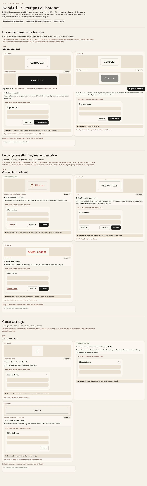

# Los botones del ERP — dos voces, una pieza (ADR-0358, ronda 4)

**Decidido:** 2026-10-07, Felipe, **mirando y tocando** (página de elegir con hojas vivas, `apps/web/unificar/.salida/elegir-ronda4/`).
**Pieza:** `btn-cayla` (`app/globals.css`) y `<Boton>` / `<BotonEnlace>` / `<BotonAncla>` (`components/ui/campos.tsx`), que la dibujan.

El censo de la tarde (242 vistas, Admin) contó 198 formas de botón en 1.568 usos: el ERP hablaba con dos voces repartidas al azar
(~1.100 botones en letra normal, ~470 en versalitas), el mismo «Cancelar» cambiaba de cara de una hoja a otra, lo peligroso tenía 10
formas y cerrar una hoja, 6.

## Lo que eligió

1. **Dos voces a propósito (B), con más animación al hacer clic.** La voz la pone el LUGAR, no cada pantalla:
   - dentro de la **cabecera de una pantalla** (`data-voz="cabecera"`: `EncabezadoPagina`, `CabeceraPantalla` y las cabeceras propias de
     Compras, Producción, Recibir, Proveedores y Por pagar) los botones hablan en **VERSALITAS de 11 px y 40 px**, como la acción principal;
   - en **hojas, tarjetas y filas**, en **letra normal de 13,5 px**, que se lee como una frase.
   Los pesos: `btn-primario` (la acción), `btn-secundario` (su pareja, «Cancelar»), `btn-sutil` y `btn-peligro`; `<Boton>` los dibuja con
   `peso="primario | fantasma | discreto | peligro"`.
2. **Lo peligroso, rojo desde el principio (A):** borrar, anular, desactivar, quitar acceso o una foto van en `btn-peligro` (borde y letra
   rojos, se tiñe de rojo suave al pasar el mouse); en la barra de vidrio de Comprobantes, `BotonCompacto variante="fila-alerta"`. Cuenta
   dentro del máximo de 2 rojos por pantalla.
3. **Cerrar una hoja que no guarda nada: la × sola, arriba a la derecha (A).** `<Modal conCerrar>`; `ModalRuta` la usa por defecto.
   El botón «Cerrar» del pie desaparece (y el pie, si quedaba vacío). Escape y tocar fuera siguen cerrando.

## El movimiento

Todo botón (`btn-cayla` menos el enlace de texto, y `.mov-boton`) se mueve igual: al pasar el mouse sube 2 px con su sombra y cruza una
luz (650 ms), el «+» da un cuarto de vuelta y la flecha que va adelante avanza; al presionar se encoge un 3 % y **una onda de su propio
color nace donde tocaste y se apaga en 450 ms** (`<OndaBotones>`, montado una vez en `app/layout.tsx`: lo que Felipe pidió, «más
animaciones para que sea más interactivo cuando haces clic»). Sin rebote ni bucle; con «reducir movimiento» queda solo el color.
Verificado en el ERP: la onda corre en las hojas de Clientes y Caja y el botón baja al 97 %.

## Lo que se migró

- Las piezas: `btn-cayla` toma el movimiento y la onda; `<Boton>` pasa a dibujarse con `btn-cayla`; las cabeceras dicen su voz.
- 41 versalitas copiadas a mano en 26 archivos (Compras, Recibir, Producción, Catálogo, las constantes `botonCancelar`/`botonPrimario` de
  `<Modal>`, el menú «Más», las pantallas de error y el login).
- 15 botones peligrosos en 12 archivos.
- 17 hojas a la ×.

## Lo que queda distinto a propósito

- **El mostrador** (Vender, Apartados y el botón «Buscar» de Cambios y Devoluciones): 14 archivos con botones compactos de 28–32 px y de
  cobro de 48–56 px, pensados para el dedo. Son la **deuda** de esta familia y van en su propia pasada, con prueba a 375 px (PL-105).
- **El selector de mes** de Comprobantes (`SelectorMesFacturacion`): es un filtro de período, familia de pestañas.
- **«Cerrar caja»** con su candado: es una operación, no cerrar una hoja.
- **«Aplicar todos completos» y «Completar todo»** de Conteo conservan su letra rojiza: no borran nada, es un énfasis.
- Los botones grandes de los pasos de Cambios y Devoluciones (`FlujoGuiado`, 48 px con el monto) conservan su cara: ya tienen el
  movimiento único.

## Deuda al decidir

`boton`: 14 archivos del mostrador. `accion.eliminar` y `accion.cerrar`: 0. Las firmas (`apps/web/unificar/familias.mjs`) atrapan la
versalita copiada a mano, un enlace o un botón sutil teñido de rojo para borrar, y un «Cerrar» escrito al pie de una hoja.
