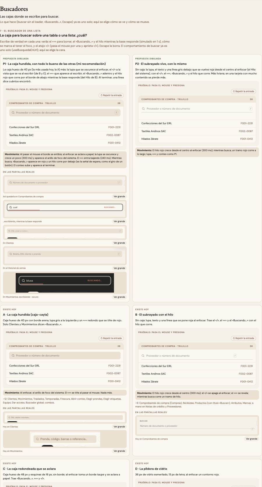

# Buscadores — una sola pieza (ADR-0358, ronda 5)

**Decidido:** 2026-10-08, Felipe, **escribiendo en ellos** (página de elegir con demos vivas, `apps/web/unificar/.salida/elegir-ronda5/`).
**Elegida:** P1 (lista) y P1 (mostrador). **Pieza:** `<Buscador>` (`components/ui/Buscador.tsx`), CSS en `app/estilos/vacio-aviso-buscador.css`.

## Qué se comparó

8 formas (el censo sin depurar contó 23 en 111 pantallas, porque mide el input y no su caja):

| Forma | Usos | Cómo se veía |
|---|---:|---|
| A · la caja hundida (`caja-cayla`) | ~12 | hueso 40 px, lupa gris, «×» redondo; solo Clientes y Movimientos decían «Buscando…» |
| B · el subrayado con el hilo | ~9 | sin caja, línea roja al enfocar, «/», «×», «Buscando…» con hilo |
| C · la caja redondeada que se aclara | ~6 | 48 px, se aclara y toma borde taupe al enfocar |
| D · la píldora de vidrio | 2 | Facturación |
| E · las antiguas con borde | ~6 | |
| Mostrador: Vender, Cambios/Devoluciones, Apartados | 4 | 56–64 px, cada una con su foco |
| Finanzas (kit), Análisis | — | decididos a propósito |

## Lo que eligió

1. **El buscador de una lista (P1):** la caja hundida de 40 px (la más usada) con todo lo bueno de las otras: la lupa que se oscurece y
   crece al enfocar, el «/» a la vista que se va al escribir, el «×» que aparece al escribir, «Buscando…» con el hilo rojo que corre por el
   borde de abajo, y una línea de conteo al terminar (`conteo`).
   **Y lo que pidió al elegir:** «que no salga buscando cuando no sea necesario, y que siempre se priorice que se vaya actualizando conforme
   se vaya escribiendo». Por eso: «Buscando…» y el hilo salen SOLO si la espera dura más de 350 ms (`ESPERA_SENAL_MS`): lo que se filtra
   en el navegador y una respuesta rápida no lo muestran. Y la lista se actualiza MIENTRAS se escribe (`onCambio` en cada tecla; lo que
   filtra en la base, con la pausa corta de siempre): **al migrar, un buscador que hoy espera Enter o un botón pasa a buscar mientras se
   escribe** (en el mostrador, Cambios y Devoluciones conservan su «Buscar», que también busca al tocarlo).
2. **El buscador grande del mostrador (P1):** `<Buscador tamano="mostrador">`, la píldora de Cambios que se despega al enfocar, con el
   ícono que se enciende en rojo de Vender (`icono="barras"` en Vender: «aquí se escanea»; lupa en Cambios), el giro mientras busca y el
   botón de la derecha (`accion`) donde hoy existe. Sin «/» en celular.

Teclado: `atajo` → «/» lleva el cursor aquí (uno por pantalla; no si se está escribiendo en otra caja o hay una hoja abierta). Escape borra
lo escrito sin cerrar la hoja de alrededor (ADR-0136 act. 2026-09-26).

## El movimiento de la pieza

Lista: al pasar el mouse el borde se entibia; al enfocar se aclara a papel, la lupa se oscurece y crece (300 ms) y aparece el anillo de
foco del sistema; el «×» entra con `anim-revelar` (240 ms); «Buscando…» aparece en rojo y el hilo corre mientras la base responde (el único
bucle: es señal de espera, como el giro de un botón); el conteo sube al aparecer. Mostrador: sube 1 px, la sombra crece y toma un anillo de
2 px (300 ms), el ícono se enciende en rojo y crece; giro mientras busca. Qué traían las que reemplaza: el hilo de B (se queda), el
despegarse de Cambios (se queda), el rojo de Vender (se queda), el aclararse de C (se queda): no se pierde ninguno.

## Lo que queda distinto a propósito

El buscador del kit de Finanzas (ADR-0195) y el de Análisis (ADR-0357): excepciones en `familias.mjs` hasta que Felipe diga.

## Deuda al decidir

25 archivos (`node apps/web/unificar/deuda.mjs buscador`). Ya migrado como piloto: Comprobantes de compra y Por pagar (`FiltrosCompras`).
