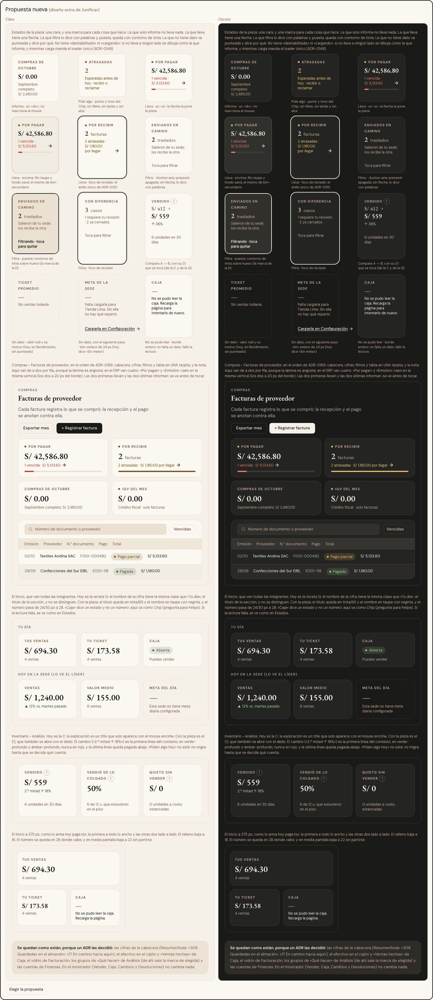

# Tarjetas de cifra — una sola tarjeta, una marca por lo que hace (ADR-0357)

**Decidido:** 2026-10-06, Felipe, con `/unificar` (ronda 1). **Elegida:** la propuesta, «La de Compras, una marca por función». **Pieza:**
`components/ui/TarjetaCifra.tsx`. **Migrado:** el mismo día, commit `refactor(ui): pestañas en tres piezas y una sola tarjeta de cifra`,
pendiente de que Felipe lo apruebe mirando las pantallas.

La tarjeta de cifra es **la de Compras de siempre** (la cara no cambia), con **una marca por cada cosa que hace el número**:

| Si la cifra… | Qué se ve |
|---|---|
| solo informa | nada más: no reacciona al mouse |
| lleva a otra pantalla, pestaña u hoja | la flecha → al final del último renglón (la pone la pieza, nunca la pantalla) |
| filtra la lista (se prende y se apaga) | «Toca para filtrar»; puesta, contorno de tinta y «Filtrando · toca para quitar» |
| todavía no tiene dato | borde punteado, «—» y el motivo (obligatorio) |
| no se pudo leer | borde entero, «—» y la frase en tinta |

## Qué se comparó

El censo contó 17 formas en 46 pantallas, pero contaba como «cifra» cualquier número grande con su caja. La depuración encontró **7 formas
reales**, y 5 ya las había decidido Felipe: el vidrio de Facturación (ADR-0124), las cifras de la cabecera (`ResumenSede`, ADR-0123/0220/0331),
los grupos de Análisis (ADR-0245), el efectivo y «Ventas hechas» de Caja (ADR-0226/0319) y las de Finanzas (ADR-0195). Las otras dos hacían lo
mismo con distinta letra: la de Compras (`TarjetaCifra`) y la «receta G» del Inicio, Comercial y Calidad (nombre en gris sin negrita, número de 24 a
30 px), con sus copias a mano.

Lo que de verdad confundía: no se veía qué número se puede tocar, cuál filtra y cuál solo informa; había cuatro formas de decir «no hay dato», dos
con contraste insuficiente; y un lector de pantalla anunciaba como interruptor lo que no lo era (`aria-pressed="false"` en cifras que no filtran).

## Por qué esta

Parte de la forma que la gente ya conoce y que ya estaba decidida (ADR-0169, ADR-0111), así que la cara no cambia. Cada marca sale de una pieza que
ya existe en el ERP. Arregla lo que confundía casi entero dentro de una sola pieza, y es la que mejor puntuó en comprensión y oficio.

## Qué cambió en la pieza

- Decide sola qué es: sin `href` ni `onClick`, informa (un `
`); con `href`, u `onClick` sin `activa`, lleva (enlace o botón, con flecha); con
  `onClick` y `activa`, filtra (`<button aria-pressed>`, el único con esa marca).
- `valor={null}` es «sin dato», y los tipos exigen el motivo; `noSePudoLeer` lo separa de «no se pudo leer».
- Contraste: la unidad pasa de tinta/55 a taupe y el «—» a tinta/65.
- Gana `ayuda` (el «(!)» pegado a la última palabra del nombre: se toca, no solo con el mouse), `antes` («A → B»), `pie` e `id`.
- Se van las opciones `compacta`, `fila`, `icono` y `vacia`, la «receta G», `TarjetaCifraAnalisis`, `TarjetaAvance`, las copias a mano, los «→»
  escritos a mano y el alza al pasar el mouse en cifras que no se tocan. Se borraron, sin importadores, `TarjetaIndicador` (dos archivos) y
  `TarjetaSenal`.
- No se tocaron (son de Felipe): `viva`, `acento`, `acentoTrazo`, `puntoPulsa` y `vivo`.

## Lo que queda distinto a propósito

Las cinco decididas de arriba, los botones de tipo de Movimientos (ADR-0353), el Observatorio (ADR-0322), el Kpi de Inicio de almacén (ADR-0292), la
cifra grande de la vista rápida (ADR-0136), el panel de la talla en Existencias (ADR-0344), la píldora «Hoy» de Vender (ADR-0221) y las pestañas
por tienda de Rendimiento (ADR-0325). **El mostrador (Vender, Caja, Cambios, Devoluciones) no cambió.**

## Preguntas abiertas para Felipe

1. **«Piden algo hoy»** (Análisis) quedó como «lleva» y no como «filtra», porque tocarla otra vez no quita el filtro; su ayuda por `title` se perdió
   (una tarjeta que se toca entera no puede llevar el «(!)» adentro). Lo que cuenta no cuadra con lo que filtra: va en otra tarea.
2. **«La más atrasada»** (Recibir) marca un comprobante y quedó dibujada como «lleva». ¿Pasa a un enlace con verbo?
3. **La Caja del Inicio** dice «Abierta / Cerrada» donde va el número. ¿Pasa a una insignia?
4. **Textos:** «Sin meta» pasa a «—» con su motivo en Rendimiento, y «Sin lotes todavía» igual en la ficha del proveedor. Un cero es un dato:
   «0 unidades» y el saldo a favor en cero ya no se ven apagados.
5. **Producción** muestra «—» donde hay cero (capital en insumos, por pagar, vencido): ¿debería decir «S/ 0.00»?
6. **El total de Activos** («CAYLA · todas las sedes») perdió el fondo que lo resaltaba. ¿Otra forma de distinguirlo?
7. **Motivos que faltan escribir:** en Gastos, «IGV que puedes descontar» y «Por pagar de gastos» cuando falla la lectura; la «Diferencia» de un
   traslado que nadie contó todavía.

## Deuda al decidir

| Módulo | Estado |
|---|---|
| Inventario (Traslados, Análisis, Pérdidas, Por regularizar, Cuadre) | migrado el 2026-10-06 |
| Compras y Recibir (Facturas, Por pagar, Proveedores, Notas de crédito, Recibir) | migrado el 2026-10-06 |
| Inicio, Comercial, Calidad, Rendimiento | migrado el 2026-10-06 |
| Finanzas (Gastos, Impuestos, Balance, Resumen, Activos) | migrado el 2026-10-06 |
| Producción (ocho paneles) | migrado el 2026-10-06 |

Deuda hoy: **0**. Las firmas de la decisión (`apps/web/unificar/familias.mjs`) atrapan las piezas que se fueron (`TarjetaCifraAnalisis`,
`TarjetaIndicador`, `TarjetaSenal`, `TarjetaAvance`) y una tarjeta de cifra dibujada a mano (`function Tarjeta({ etiqueta …`).
