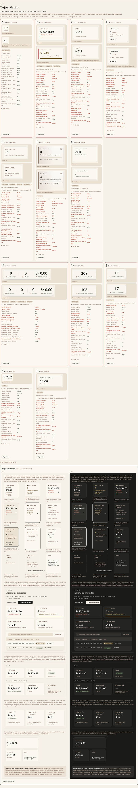

# Tarjetas de cifra — la tarjeta de Compras, en todo el ERP (ADR-0358)

**Decidido:** 2026-10-07, Felipe, **mirando** (página de `/unificar`). **Elegida:** **B**, la tarjeta de Compras tal cual era. **Pieza:**
`components/ui/TarjetaCifra.tsx`.

Un número grande con su nombre se dibuja siempre con la tarjeta de Compras: caja clara con borde, el nombre arriba en versalitas y el número
en letra serif. Si lleva a otro lado, una flecha al final de su último renglón (como ya tenía en Compras); si filtra la lista, la que está
filtrando se rellena de arena; si no hay dato, borde punteado, «—» y su motivo (como ya era la B).

## Cómo se llegó aquí

1. **2026-10-06, ronda 1.** El censo contó 17 formas; la depuración, 7 reales (5 decididas por ADR). Felipe eligió la recomendación por su
   descripción: la de Compras con «una marca por función» («Toca para filtrar», contorno de tinta en la que filtra). Se migraron ~23 archivos a la
   pieza: la «receta G» del Inicio, Comercial y Calidad, `TarjetaCifraAnalisis`, `TarjetaAvance` y las copias a mano.
2. **2026-10-07.** Al verla aplicada, eligió mirando la **B** tal cual. Se quitaron las marcas nuevas («Toca para filtrar», «Filtrando · toca
   para quitar», el contorno de tinta) y la que filtra volvió al fondo arena; la unificación se queda: todas las pantallas usan la misma pieza.

## Qué es la pieza

- Informa (sin `href` ni `onClick`): un `
`. Lleva (`href`, u `onClick` sin `activa`): enlace o botón, con la flecha. Filtra (`onClick` +
  `activa`): `<button aria-pressed>` y, puesta, fondo arena al 40 %; `aria-pressed` solo aquí (antes se anunciaban como interruptor cifras
  que no lo eran).
- `valor={null}` es «sin dato» y exige su motivo; `noSePudoLeer` lo separa de «no se pudo leer».
- Se quedan dos arreglos de contraste que casi no se ven: la unidad en taupe y el «—» en tinta al 65 %.
- No se tocaron (son de Felipe): `viva`, `acento`, `acentoTrazo`, `puntoPulsa` y `vivo`.

## Lo que queda distinto a propósito

El vidrio de Facturación (ADR-0124), las cifras de la cabecera (`ResumenSede`, ADR-0123/0220/0331), los grupos de «Qué hacer» de Análisis
(ADR-0245), el efectivo y «Ventas hechas» de Caja (ADR-0226/0319), las de Finanzas (ADR-0195), los tipos de Movimientos (ADR-0353), el
Observatorio (ADR-0322), Inicio de almacén (ADR-0292), la vista rápida (ADR-0136), el panel de la talla (ADR-0344), «Hoy» de Vender
(ADR-0221) y Rendimiento por tienda (ADR-0325). **El mostrador no cambió.**

## Preguntas abiertas para Felipe

1. **«Piden algo hoy»** (Análisis) cuenta tres grupos y al tocarla filtra uno: va en su propia tarea.
2. **Producción** muestra «—» donde hay cero (capital en insumos, por pagar, vencido). ¿Debería decir «S/ 0.00»?
3. **La Caja del Inicio** dice «Abierta / Cerrada» donde va el número. ¿Pasa a una insignia?

## Deuda

**0.** Las firmas atrapan las piezas que se fueron (`TarjetaCifraAnalisis`, `TarjetaIndicador`, `TarjetaSenal`, `TarjetaAvance`) y una tarjeta
de número dibujada a mano (`function Tarjeta({ etiqueta …`).
