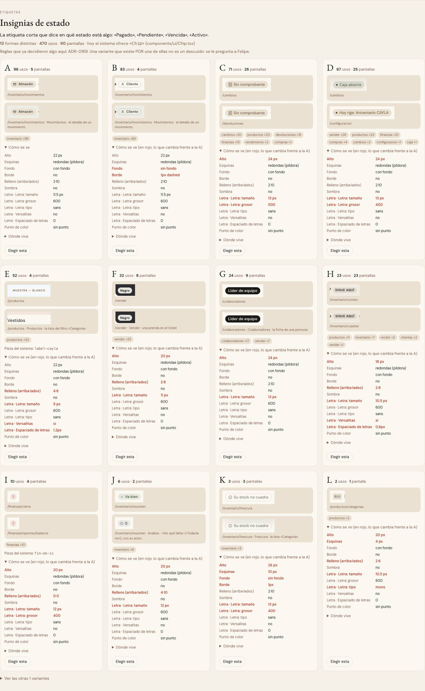

# Insignias de estado — la pieza ya era una (ADR-0358)

**Decidido:** 2026-10-07, Felipe, **mirando** (página de elegir de la ronda 2). **Pieza:** `<Chip>` (`components/ui/Chip.tsx`), como ya era.

El censo del 2026-10-07 contó 13 formas, pero depuradas son pocas: casi todo el ERP ya dibuja sus estados con `<Chip>` (con punto, o con
ícono si `versalitas={false}`; contorno de tinta para «Crítica»). Las demás no eran estados (el nombre de la categoría, el color de la prenda,
los códigos «BLU») o están decididas por un ADR («Almacén / Piso» de Movimientos, ADR-0353; «SIGUE AQUÍ» de la guía de foco, ADR-0284).

## Lo que Felipe eligió dejar como está

- **Análisis** («Va bien», «Para saber», «Datos incompletos»): con su palomita y su «i», no con el punto de `<Chip>`.
- **El rol en Colaboradores:** «Líder de equipo» en píldora negra, los demás roles en arena. El líder se ve de lejos.

## El movimiento

`<Chip vivo>` es lo único que se mueve solo: el punto que late en «Vencida» (ADR-0136). Lo demás no se mueve.

## Sin candado del CI (por ahora)

Quedan 7 archivos con una píldora de color escrita a mano (`ExistenciasChips`, `ConfirmarCambios`, `RolesPanel`, `DevolucionesPanel`,
`atributos/kit`, `ModalesApartado`, `FichaColaborador`), pero son contadores, etiquetas o círculos de ícono, no estados: se miran en la ronda
de `contador` y `etiqueta`, y entonces esta familia tendrá su firma.
