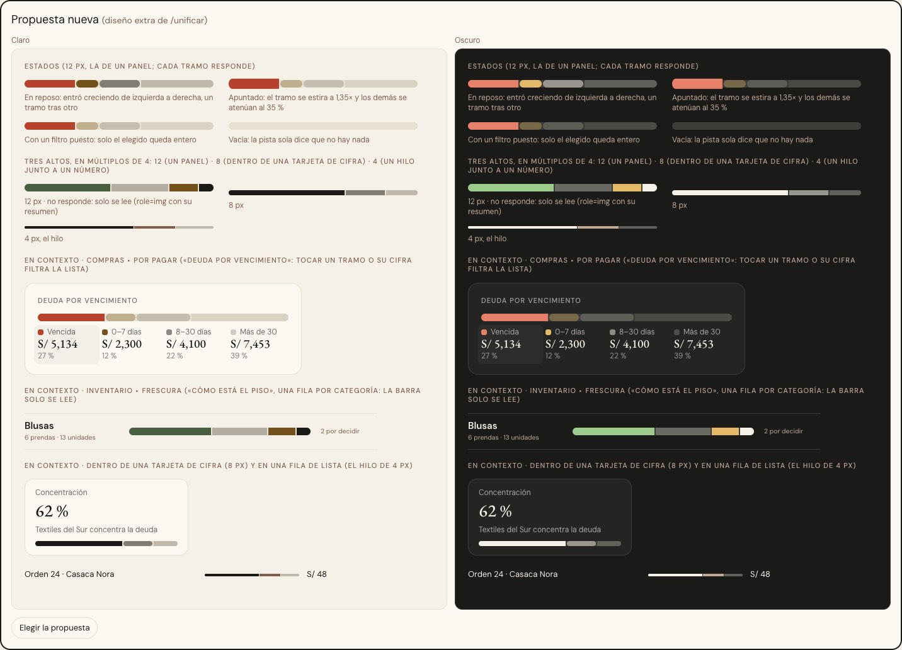

# La barra apilada — una sola pieza (ADR-0358, ronda 5b)

**Decidido:** 2026-10-09, Felipe, **tocando** las demos (página de elegir con demos vivas en claro y oscuro,
`apps/web/unificar/.salida/elegir-grafico/`). **Elegida:** P. **Pieza:** `<BarraApilada>` (`components/ui/BarraApilada.tsx`) y
`<MuestraTramo>` (el cuadrito de una leyenda), CSS en `app/estilos/barra-apilada.css`. Es la **barra que reparte un total en partes**
(la familia `grafico.barra`); la línea, las barras mensuales y la dona siguen en «Por analizar» (`grafico`).

Nació de la deuda que dejó Frescura (la actualización 2026-10-07 de ADR-0208, que vive en su rama): `claude/frescura-vara-cayla-dos-niveles`
creó `ui/BarraApilada` con la forma de la barra que «Deuda por vencimiento» (Compras) dibujaba a mano, y su bitácora lo dejó como pendiente
de `/unificar`.

## Qué se comparó

El censo (Admin y Admin-Taller, 180 vistas, más uno aparte contra el worktree de Frescura) y el código contaron **quince archivos** que
dibujan esta barra a mano, con casi diez caras. El censo no ve las barras que el seed no muestra (Facturación, Historial, Notas de crédito,
Producción, Caja, cierre de caja y Eficiencia del Taller quedan sin filas): esas se contaron leyendo el código.

| Forma | Dónde | Cómo se veía | Se mueve / responde |
|---|---|---|---|
| Compras, tramos sueltos sin pista | Por pagar (Deuda por vencimiento 14 px, Deuda por proveedor 8 px), Proveedores (Concentración 8 px), Notas de crédito (8 px) | tramos de esquinas redondas separados 3 px | entran creciendo tramo a tramo, el tramo apuntado se estira, los demás bajan (en Concentración y Notas de crédito), se reacomodan y filtran |
| Compras, las chicas | la mezcla de lo marcado (Por pagar) y el reparto de un pago (hoja Pagar), 5 px | tramos sueltos | solo se reacomodan al cambiar la cifra |
| Píldora con pista, quieta | Facturación (8 px, 2 px de aire; crecen todos a la vez), Historial «Cómo se pagó» (6 px; crece la barra entera), cobrado en el turno de Caja (10 px), cierre de caja (10 px), Por pagar de Producción (10 px), Eficiencia del Taller (12 px), la nota de crédito (8 px) | pista de arena o de hueso, tramos pegados y recortados | los de Caja y la nota de crédito se reacomodan; ninguna responde |
| Píldora con pista de tinta, Producción | costo de una orden: la tarjeta (4 px) y la ficha (12 px) | pista de tinta al 10 % | entran creciendo tramo a tramo; no responden |
| Frescura (rama en curso) | Inventario ▸ Frescura, «Cómo está el piso» (12 px) | píldora con pista, tramos pegados | ninguno; solo se lee |

## Lo que eligió (P)

La **pista de arena** de Frescura y Facturación (dice «esto es el 100 %» y, vacía, «no hay nada») con **el movimiento de Compras**, y
tres cosas que ninguna tenía:

1. **El área que siente el mouse mide 24 px o más** aunque la barra pinte 12, 8 o 4 (hoy un tramo de 8 px es difícil de apuntar).
2. **Una sola voz para el lector de pantalla:** si solo se lee, es una imagen con su resumen; si responde, un grupo con su resumen y cada
   tramo es un botón con su nombre y lo que hace («Vencida: S/ 5,133.60. Filtrar la lista»).
3. **Tres altos en múltiplos de 4:** 12 (un panel), 8 (dentro de una tarjeta de cifra), 4 (un hilo junto a un número). Las barras de 10 px
   (Caja, cierre, Por pagar de Producción) y de 5 y 6 px pasan al alto que corresponda al lugar al migrarlas.

## El movimiento de la pieza

- **Entra** creciendo de izquierda a derecha, un tramo tras otro (`anim-crece-x`: 620 ms, 38 ms entre tramos).
- **Se reacomoda** en 700 ms cuando cambia una cifra (se pagó algo): `flex-grow` con transición.
- **Si responde:** el tramo apuntado se estira a 1,35× (200 ms) y los demás bajan al 35 % (el ya elegido sigue entero); con un filtro
  puesto, solo el elegido queda entero. Con el foco del teclado pasa lo mismo y el anillo es el del sistema (ADR-0351). El «encima» solo
  corre donde hay mouse (`@media (hover: hover)`): en un celular se quedaría pegado tras un toque.
- Sin rebote ni bucle (ADR-0136); quieta con «reducir movimiento».
- **Lo que traían las que reemplaza:** Compras (todo lo de arriba, salvo que en «Deuda por vencimiento» los demás tramos no bajaban al
  apuntar: ya lo hacían «Concentración» y las Notas de crédito, y a «Deuda por vencimiento» se le **suma**); Facturación e Historial, el
  crecer de golpe (se reemplaza por el crecer tramo a tramo); Producción ya crecía tramo a tramo; Frescura, nada (gana el movimiento).
  Ninguna pierde nada.

## Decisiones que tomó Claude donde la demo no alcanzaba (Felipe puede deshacerlas)

- **Los tramos de en medio son rectos**, tanto si responde como si solo se lee. En la demo, los botones salían con esquinas redondas por el
  estilo del navegador y los `` rectos: una barra con dos caras según si responde. Los extremos siguen la píldora.
- **Cada tramo lleva su propia base de arena y el color va en una capa interna.** Sin eso, un color translúcido (`bg-tinta/50`, el gris
  grande de «8–30 días») se partía en tres franjas al estirarse: se veía distinto sobre la arena y sobre la tarjeta. Las leyendas dibujan
  su cuadrito con `<MuestraTramo>`, para que el cuadrito y el tramo tengan el mismo tono.
- **Cada tramo crece por su parte del total** (suma 100) y no por su valor: así la barra llena la pista aunque las cifras sumen menos de 1.
- **El blanco táctil de un tramo no llega a 44 px** (ADR-0350, con dedo): la leyenda de al lado, que hace lo mismo, es el blanco de 44 px.

## Contraste (medido, 2026-10-09)

Los tonos de tinta por debajo de `/50` no llegan a 3:1 contra el hilo de arena (WCAG 1.4.11): `/50` mide 3,1 en claro y 3,7 en oscuro,
`/25` 1,7 y 2,0, `/20` 1,5 y 1,8. **No es una regresión de esta migración** (antes iban sobre la tarjeta, con medidas parecidas) y la
información no depende del color: la leyenda y el resumen para el lector la repiten en texto. Quien use la pieza con un tinta pálido
debe poner el dato también en texto. Si Felipe quiere un piso, es `bg-tinta/50`.

## Lo que queda distinto a propósito

Lo siguiente existe por una decisión, o no es esta función, y **no se corrigió: Felipe dice si se unifica**.

- **Análisis** (ADR-0357): la barra por tiempo sin venderse (`PestanaQuieta`), la de «Dónde está lo que tienes» (`PestanaPiso`, pestaña
  «Nunca salió al piso») y la de modelos de «Todavía no» (`TodaviaNo`) usan `flex` con su cascada propia («los gráficos de Análisis tienen su
  excepción de movimiento»).
- **Aviso de cierre de Caja** (ADR-0359): la barra de turno y horas extra (`rcc-seg`) de `RecordatorioCierreCaja`.
- **Marcas de un conteo** (una por día o paso, todas iguales): la «Racha» de 14 días del Motor de demanda (`PreparacionMotor`) y las de
  Análisis (`analisis/piezas`). No reparten un total; el censo las salta si son seis o más del mismo ancho.
- **Barras de avance de UN solo relleno** (el plazo de pago real de un proveedor contra el pactado, `ui/PistaPlazo`; lo recibido de una
  compra y lo aplicado de una nota de crédito, `ComprobanteAvance.BarraAvance`; la meta de Rendimiento, `ui/BarraAvance`): miden un avance,
  no reparten un total. Son otra función y van en otra ronda.
- **Barras de largo a escala** (el «saldo a escala» de una fila de Proveedores y el piso y almacén de `ResumenStockOverlay`): el largo
  compara con el mayor de la lista y, dentro, se parten en dos. El censo puede contar la de Proveedores cuando hay una parte vencida.

## Deuda al decidir

**14 archivos** (`pnpm --filter web unificar:deuda grafico.barra`); «Deuda por vencimiento» se migró el mismo día (Compras ▸ Por pagar).
El resto se migra módulo por módulo, con el OK de Felipe:

| Módulo | Archivos | Estado |
|---|---|---|
| Compras ▸ Por pagar | `DeudaPorVencimiento.tsx` | **migrado** (2026-10-09) |
| Compras ▸ Por pagar | `PorPagarControles.tsx` (Deuda por proveedor), `PorPagarLista.tsx` (mezcla de lo marcado), `PagoPiezas.tsx` (reparto de un pago), `PorPagarProduccionPanel.tsx` (Producción contra Compras) | por migrar |
| Compras ▸ Proveedores y Notas de crédito | `ProveedoresIndicadores.tsx`, `NotasCreditoPanel.tsx` (la barra vive en `nc-conc`, `app/estilos/notas-credito.css`: se borra con la migración), `RegistrarNotaCreditoModal.tsx` (`nc-barra`, en el mismo archivo de estilos) | por migrar |
| Vender ▸ Comprobantes y Proformas | `ComprobantesGraficos.tsx` (una pieza homónima con `partes` y leyenda propia, `kpi-apilada` en `globals.css`) | por migrar |
| Vender ▸ Historial | `HistorialVentasPulso.tsx` («Cómo se pagó»): su color sale de un token por método de pago puesto en un `style` inline (`var(--color-metodo-<método>)`), no de una clase de Tailwind. **La pieza hoy solo recibe `clase`:** al migrarlo hay que sumarle un color por token (decidir ahí si es una prop `color` o clases `bg-metodo-*` declaradas) | por migrar |
| Caja | `CajaTablero.tsx` (cobrado en el turno: también un color por método), `CierreCajaDetalle.tsx` (a dónde fue el efectivo) | por migrar |
| Producción ▸ Órdenes y Eficiencia | `OrdenTarjeta.tsx`, `OrdenPanel.tsx` (pista de tinta al 10 %), `EficienciaTallerPanel.tsx` | por migrar |
| Inventario ▸ Frescura | su rama ya usa `ui/BarraApilada`: hereda la decisión al entrar | en su rama |

## Lo que la revisión adversaria encontró y se corrigió (2026-10-09)

Seis revisores de solo lectura (comportamiento, pieza, candado, motor, contraste, documentos) y dos escépticos por hallazgo. Confirmados y
corregidos: las firmas dejaban pasar cinco archivos que reparten un total (ahora están en la deuda y las firmas aceptan las clases en
cualquier orden); el censo contaba como barra la «Racha» de 14 días; el tramo translúcido se partía en franjas al estirarse (base de arena
por tramo); el elegido bajaba al apuntar otro tramo; y varias afirmaciones de este registro y de CONTINUAR eran falsas o viejas. La
migración de «Deuda por vencimiento» **no cambió qué hace nada** (mismo resumen para el lector, mismas etiquetas de tramo, mismo filtro,
mismo `apuntar`), probado en el navegador.

## Al fusionar con la rama de Frescura

`claude/frescura-vara-cayla-dos-niveles` creó `ui/BarraApilada.tsx` por su cuenta (sin PR todavía): al fusionarse las dos ramas el archivo
choca (se agregó en las dos). **Se queda la versión de esta rama**: es un superconjunto compatible (mismas props `segmentos`, `unidad`
y `className`; suma `etiqueta`, `formato`, `alto` y `respuesta`, y exporta `MuestraTramo`). Lo que cambia para el tablero de Frescura es solo
su cara: pista de arena con hilo de 2 px, tramos que entran creciendo y se reacomodan, en vez de tramos pegados y recortados que aparecen
quietos. Su leyenda puede dibujar el cuadrito con `<MuestraTramo>` para que coincida con el tono del tramo.
