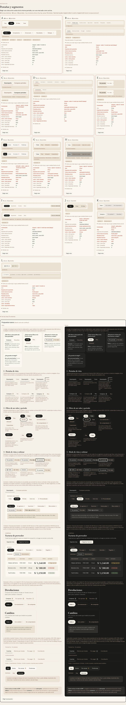

# Pestañas y segmentos — tres piezas, una por pregunta (ADR-0358)

**Decidido:** 2026-10-07, Felipe, **mirando** (página de `/unificar`). **Piezas:** `components/ui/Pestanas.tsx` (vista), `pildora-cayla`
(filtro y período) y `SegmentoEnlaces` / `SegmentoDeslizante forma="modo"` (modo y orden), con su piel en `app/estilos/pestanas-y-segmentos.css`.

**La regla está en la pregunta que se hace la colaboradora: «¿qué cambia si toco esto?».**

| Si al tocar… | La pieza | Cómo se ve (elegida por Felipe) |
|---|---|---|
| cambia de sección (otro contenido, otras acciones) | **pestaña de vista** (`<Pestanas>`) | **F**: el vidrio de Comprobantes con la píldora oscura que se desliza bajo la elegida, **en mayúsculas** («la que elegí pero con mayúsculas») |
| deja menos filas en la misma lista (un estado, una zona, un período) | **píldora de filtro** (`pildora-cayla`, `BotonFiltro`) | **A**: la píldora rellena negra, la más usada |
| muestra lo mismo de otra forma o en otro orden | **segmento de modo** (`SegmentoEnlaces`, `SegmentoDeslizante forma="modo"`) | **L**: la caja arena de «GRILLA / TABLA», con la elegida en papel, en mayúsculas |

**También Finanzas y Configuración** (Felipe 2026-10-07: «sí, también Finanzas»): `PestanasFin` dibuja ahora con `<Pestanas>`; la regla de
Finanzas de `CLAUDE.md` lo dice. Y las pestañas de Comprobantes (`FacturacionPestanas`, de donde salió el vidrio) y de la billetera de
Traslados («Te llegan / Envías / Terminadas», ADR-0355) pasan a la misma pieza. Y las cuatro preguntas de **Análisis v4** (Hoy · Se está
acabando · No se vende · Qué pedir, ADR-0357), que llegaron de `main` con su subrayado propio (Felipe 2026-10-07: «incluye lo de Análisis»):
mismos conteos —«Se está acabando» en rojo si hay prendas—, el chip de confianza sigue a la derecha y sus gráficos se arman igual al cambiar.

## Cómo se llegó aquí

1. **2026-10-06, ronda 1.** El censo contó 25 formas en 54 pantallas; la depuración, 18 reales para cinco cosas distintas. Felipe eligió la
   recomendación por su descripción (subrayado en tinta, píldora, segmento con contorno) y se migraron ~45 archivos a las tres piezas.
2. **2026-10-07.** Al verlas aplicadas, no le gustaron. En la página de elegir escogió F (con mayúsculas), A y L. Como las ~45 pantallas ya
   pasaban por las tres piezas, el cambio fue solo de piel (la hoja de estilos y el indicador que viaja) más las tres pestañas que seguían a mano.

## Qué es cada pieza

- **`Pestanas`**: contenedor de vidrio (`vidrio-cayla`) con 4 px de aire y radio 14; la píldora en tinta de radio 10 viaja bajo la elegida
  (`IndicadorDeslizante` «pildora-tinta», 450 ms, ADR-0136). Palabra en versalitas de 12 px; la elegida, en crema. Conteo en su píldora chica:
  `pide` lo pone en ámbar con su texto para lector, `tono="rojo"` avisa un problema, `tono="neutro"` solo informa. Con `href`, enlaces con
  `aria-current`; con `onCambio`, `tablist` con flechas. Si la fila no cabe (celular), se centra la elegida; en una columna angosta,
  `pestanas-cayla--llenar` reparte el ancho.
- **Píldora**: `pildora-cayla` sin cambio; `.pildora-cayla__n` es su conteo.
- **Segmento de modo**: fondo sand con 2 px de aire, opciones en versalitas de 10,5 px en tinta al 60 %, la elegida en papel y tinta; 36 px.

## Lo que queda distinto a propósito

El cierre por unidad de Finanzas (`fin-matriz`, ADR-0195), el segmento del Observatorio (ADR-0322), la tarjeta-pestaña de Colaboradores
(ADR-0172), las pestañas por tienda de Rendimiento (ADR-0325), los siete tipos de Movimientos (ADR-0353), la barra de Apartados en el celular
(ADR-0223) y la barra de Comprobantes en el celular (ADR-0124). Sus líneas llevan `// unificar-fijo:` con el ADR.

## Preguntas abiertas para Felipe

1. **Apartados en escritorio** tiene sus propias pestañas de 64 px (ADR-0223), con la letra ya ajustada. ¿Pasan también al vidrio?
2. **Más de tres opciones.** Los cierres de Caja y la matriz de la ficha tienen 4 opciones y siguen como segmento; ¿pasan a un combo?
3. **Avisar a Dany** de los cambios en Rendimiento y Clientes (`PanelRendimiento`, `GraficoVentasMeta`, `ClientaFichaModal`, `AvisosClubPanel`).

## Deuda

**0.** Las firmas atrapan una pestaña dibujada a mano (`role="tab"` fuera de la pieza), un subrayado a mano (`-mb-px border-b-2`,
`after:h-0.5 after:bg-…`) y una «elegida» escrita a mano con fondo y sombra. La primera fusión con `main` las probó: atraparon la billetera de
Traslados, que nació con sus pestañas a mano, y se migró; la segunda, las de Análisis v4, que también se migraron.
