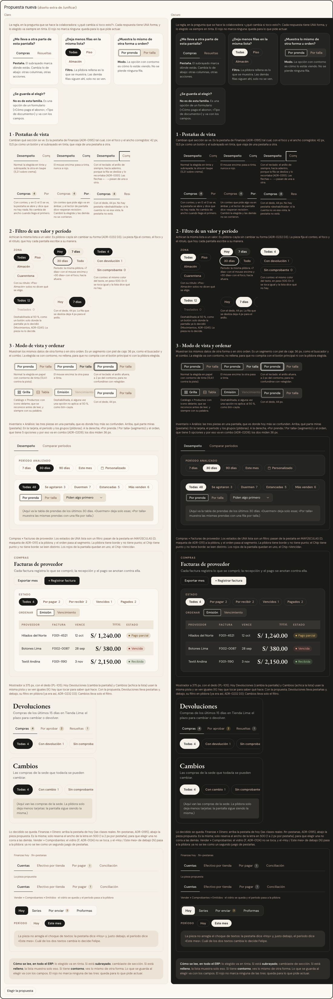

# Pestañas y segmentos — tres piezas, una por pregunta (ADR-0354)

**Decidido:** 2026-10-06, Felipe, con `/unificar` (ronda 1). **Elegida:** la propuesta, «Tres piezas, lo elegido en tinta». **Piezas:**
`components/ui/Pestanas.tsx` (vista), `pildora-cayla` (filtro y período) y `SegmentoEnlaces` / `SegmentoDeslizante forma="modo"` (modo y
ordenar), con su piel en `app/estilos/pestanas-y-segmentos.css`. **Migrado:** el mismo día, commit `refactor(ui): pestañas en tres piezas y una
sola tarjeta de cifra`, pendiente de que Felipe lo apruebe mirando las pantallas.

**La regla está en la pregunta que se hace la colaboradora: «¿qué cambia si toco esto?».**

| Si al tocar… | La pieza | Cómo se ve |
|---|---|---|
| cambia de sección (otro contenido, otras acciones) | **pestaña de vista** (`<Pestanas>`) | subrayado de 2 px en tinta que viaja, 42 px, letra 13,5 px; la elegida en tinta 500 |
| deja menos filas en la misma lista (un estado, una zona, un período) | **píldora de filtro** (`pildora-cayla`, `BotonFiltro`) | píldora rellena en tinta la elegida; el conteo del color del texto |
| muestra lo mismo de otra forma o en otro orden | **segmento de modo** (`SegmentoEnlaces`, `SegmentoDeslizante forma="modo"`) | 36 px en caja hueso; la elegida en papel con contorno de tinta |

Lo elegido va siempre en tinta. El rojo no marca ninguna elección: queda para lo que pide actuar (ADR-0169).

## Qué se comparó

El censo contó 25 formas en 54 pantallas. La depuración encontró **18 formas reales para cinco cosas distintas**: pestañas de vista (B, C, D, F,
J, K, L, Q, V), período (A, W, J, N, R), filtro de un valor (A, I, M, W, G, H, P, K, D, Y), elegir la tienda o la unidad (U, S, J) y modo de vista
u ordenar (E, L, O, R, T). La sexta, «opción de un formulario» (`Segmentado`, `SegmentoDeslizante` como campo), no es de esta familia: elegir un
valor que se guarda no es elegir una vista.

Lo que más confundía estaba en el mostrador: en Devoluciones la misma cara cambiaba la pantalla y en Cambios solo achicaba la lista.

## Por qué esta

Cada función queda con una sola forma que se distingue sin tocarla: subrayado es otra sección, píldora rellena es que la lista muestra solo eso,
contorno es lo mismo de otra forma. Usa las dos formas más usadas y ya decididas: la píldora (ADR-0232 D3, «para no confundirse con las
pestañas») y la pestaña de Finanzas (ADR-0195). No crea ninguna pieza nueva y no gasta rojo.

## Qué cambió en las piezas

- `Pestanas.tsx` toma la piel de `.fin-pestana` y el subrayado en tinta que viaja (`IndicadorDeslizante`). La semántica depende de cómo cambia:
  con `href`, enlaces con `aria-current`; con `onCambio`, `tablist` con `aria-selected` y flechas ← → / Inicio / Fin. Gana `icono`, `conteo`,
  `pide` (texto para el lector cuando el conteo pide algo, en ámbar) y `ayuda`. Reserva el ancho de la letra en 500 para que elegir no corra a las
  vecinas. Foco hacia adentro (ADR-0351). 44 px con el dedo.
- `pildora-cayla` no cambia de cara; gana `.pildora-cayla__n` (el conteo) y `.pildoras-desliza` (la fila que se desliza en el celular).
  `BotonFiltro` pasa a ser la píldora con su conteo.
- `SegmentoEnlaces` y `SegmentoDeslizante forma="modo"`: la piel de caja con contorno. La forma por defecto de `SegmentoDeslizante` (campo de
  formulario) no cambió.
- Se borraron, sin importadores: `TabsSubrayado`, `PestanasResumenProduccion`, `FinanzasNav` y la `Pestanas` local de `ResumenCabecera`.
- Se van: el subrayado rojo, el rojo al pasar el mouse, las MAYÚSCULAS de 10–11 px, los conteos a opacity-75, las pistas tinta/5, hueso y sand
  usadas para filtrar, los anillos de foco rojos escritos a mano y unos 25 dibujos a mano.

## Lo que queda distinto a propósito

Las pestañas de Finanzas y Configuración (`PestanasFin`, ADR-0195: ya tienen la cara elegida), el cierre por unidad (ADR-0195), el vidrio de
Comprobantes (ADR-0124), el segmento del Observatorio (ADR-0322), la tarjeta-pestaña de Colaboradores (ADR-0172), las pestañas por tienda de
Rendimiento (ADR-0325), los siete tipos de Movimientos (ADR-0353) y la barra de Apartados en el celular (ADR-0223). Sus líneas llevan
`// unificar-fijo:` con el ADR.

## Preguntas abiertas para Felipe

1. **Finanzas y Configuración.** Se ven iguales a la pieza, pero sin el subrayado que viaja ni el foco hacia adentro. ¿Pasan a `<Pestanas>`?
2. **Maquetas que ya habías aprobado y se apartan:** los estados de Compras pasan de pestaña a píldora (ADR-0111); Devoluciones pasa de la pista al
   subrayado con las pestañas bajo el título (ADR-0232); en Caja, el filtro de movimientos y el modo de cierres (ADR-0226); Zona de Movimientos
   (ADR-0170) y Dirección de Traslados (ADR-0175), a píldora; «Hoy / Este mes» de Comprobantes (ADR-0238); «Por prenda / Por talla» (ADR-0245); la
   letra de Apartados (ADR-0223); Inicio de almacén; Recibir (ADR-0129); el gráfico de Rendimiento (ADR-0325, de Dany).
3. **Más de tres opciones.** Los cierres de Caja y la matriz de la ficha tienen 4 opciones y siguen como segmento; ¿pasan a un combo?
4. **Rojos y puntos que se conservaron:** la insignia roja de «Todos» en Apartados, el punto rojo de «predeterminada» en Cierres y el punto de color
   de los grupos de Análisis. ¿Se quedan?
5. **Textos.** Se agregó «espera / esperan revisión» solo para el lector de pantalla en Devoluciones; no se agregaron rótulos visibles nuevos
   («Estado», «Ordenar»). El choque «Hoy» (pestaña) contra «Este mes» (período) en Comprobantes emitidos sigue igual.
6. **Avisar a Dany** de los cambios en Rendimiento y Clientes (`PanelRendimiento`, `GraficoVentasMeta`, `ClientaFichaModal`, `AvisosClubPanel`).

## Deuda al decidir

| Módulo | Estado |
|---|---|
| Ventas (Apartados, Comprobantes, Historial), Caja, Cambios y Devoluciones | migrado el 2026-10-06 (Cambios y Devoluciones a 375 px) |
| Inventario (Existencias, Análisis, Movimientos, Traslados, Conteos, Inicio de almacén) | migrado el 2026-10-06 |
| Compras y Recibir | migrado el 2026-10-06 |
| Catálogo (Productos, Atributos, ficha y alta) | migrado el 2026-10-06 |
| Producción, Rendimiento, Clientes, Colaboradores, Roles, Guía de impresión | migrado el 2026-10-06 |

Deuda hoy: **0**. Las firmas de la decisión (`apps/web/unificar/familias.mjs`) atrapan una pestaña dibujada a mano (`role="tab"` fuera de la
pieza), un subrayado a mano (`-mb-px border-b-2`, `after:h-0.5 after:bg-…`) y una «elegida» escrita a mano con fondo y sombra.

El censo de la familia bajó de 23 a 12 formas: las tres piezas, un accidente de contenedor (la píldora de Por regularizar) y ocho excepciones con
ADR. El censo todavía no ve los segmentos `forma="modo"` (su detector no lee `aria-checked`): se revisaron con fotos.
