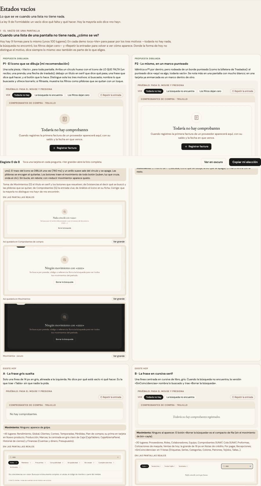

# Estados vacíos — una sola pieza (ADR-0358, ronda 5)

**Decidido:** 2026-10-08, Felipe, **tocándolas** (página de elegir con demos vivas en claro y oscuro, `apps/web/unificar/.salida/elegir-ronda5/`).
**Elegida:** P1 en las tres preguntas. **Pieza:** `<Vacio>` (`components/ui/Vacio.tsx`), CSS en `app/estilos/vacio-aviso-buscador.css`.

## Qué se comparó

El censo (Admin, 242 vistas, y el mostrador) y el código contaron 9 formas para lo mismo en ~100 lugares, y casi ninguna decía qué hacer:

| Forma | Usos | Cómo se veía | Dónde |
|---|---:|---|---|
| A · la frase gris suelta | ~45 | una línea de 14 px gris, sin motivo ni acción (la de `<Tabla>`; su prima centrada gris clara de Caja) | Rendimiento, Global, Clientes, Conteo, Temporadas, Caja, Finanzas… |
| B · la cursiva serif | ~30 | una línea centrada en cursiva de libro; `SinCoincidencias` nombra lo buscado y trae «Borrar la búsqueda» | Proveedores, Roles, Colaboradores, Comprobantes SUNAT, Notas de crédito, Por pagar, 11 listas de Catálogo |
| C · título en negrita sobre panel claro | 6 | `EstadoVacio` / `SinResultadosVentas` | Cambios, Devoluciones, Historial de ventas |
| D · título serif + botones que resuelven | 3 | el más útil, sin ícono | Movimientos, Pérdidas (y Existencias, la más rica al buscar) |
| F · recuadro punteado | ~12 | borde punteado, título serif | Traslados, Apartados, Órdenes, Nueva proforma |
| G · el colibrí que flota | 1 | el isotipo de la marca sube y se asienta | Comprobantes de compra |
| Finanzas (`GuiaVacia`), Análisis (`vacio-vista`) | 8 / 4 | decididos a propósito (ADR-0195, ADR-0357) | — |

## Lo que eligió

1. **El vacío de una pantalla (P1):** círculo hueso con el ícono de LO QUE FALTA, título en serif que dice qué pasa, frase en taupe que
   dice qué hacer (con el dato que ayuda en negrita) y el botón que lo hace.
2. **El vacío chico (P1):** dentro de una tabla, una hoja o una lista desplegable, una línea con el ícono de 15 px, la frase y, si hay algo
   que hacer, un enlace al lado (`<Vacio tamano="chico" accion={…}>`; `alinear="izquierda"` en una lista desplegable).
3. **Cuando buscas y no aparece (P1):** el título nombra lo buscado (`<SearchX />`); los filtros puestos salen como píldoras que se quitan
   con un toque (`filtros`, `<FunnelX />`); «Borrar la búsqueda» y «Limpiar filtros» a la mano; «¿Quisiste decir…?» donde la pantalla lo
   sabe (Existencias). **Ojo al migrar:** sumar «Borrar la búsqueda» o las píldoras donde hoy no están agrega una acción que ya existe más
   arriba (no cambia datos); se confirma con Felipe pantalla por pantalla.

## El movimiento de la pieza

Entra en cascada como un modal (círculo → título → frase → píldoras → botones, 55 ms entre cada uno, 460 ms). El trazo del ícono se
**dibuja** una vez (900 ms) y un anillo suave sale del círculo y se apaga. Las píldoras se oscurecen a rojo profundo al pasar el mouse y
se encogen al presionarlas. Los botones traen el movimiento de todo botón (suben, luz que cruza, onda al clic). El chico sube 4 px y su
ícono se dibuja. Sin bucle ni rebote; con «reducir movimiento» aparece quieto. Qué traían las que reemplaza: G, el colibrí que flotaba
(se reemplaza por el trazo que se dibuja, elegido por Felipe); Análisis, la cascada de la pestaña (la pieza entra en cascada igual); las demás,
nada.

## Lo que queda distinto a propósito

Nada: Finanzas y Análisis se sumaron (Felipe 2026-10-08).

## Deuda al decidir

50 archivos (`node apps/web/unificar/deuda.mjs vacio`). Ya migrado como piloto: Comprobantes de compra (`ComprobantesListaVacia`).

## Migración (2026-10-08, el mismo día)

Felipe respondió las cuatro preguntas de cierre (con lo que se gana y lo que se pierde): **el mostrador primero**; **Finanzas y Análisis se
suman** (ya no son excepción: el kit de Finanzas dejó `GuiaVacia`, `.fin-guia`, `.fin-buscar` y `.fin-nota-bloque`; Análisis dejó
`.vacio-vista`, `.aviso-datos` y `.buscar`); **el colibrí de Comprobantes de compra no vuelve** (el isotipo es la marca, ADR-0333); y
**todo vacío de búsqueda o de filtros suma lo que lo deshace ahí mismo** («Borrar la búsqueda», «Limpiar filtros», las píldoras).
Migrado entero en un commit por módulo (mostrador, Inventario y Caja, Compras y Producción, Catálogo/Colaboradores/Clientes, Finanzas y
Análisis). Deuda: **0**. Lo que las firmas no veían y se migró igual: el vacío de Existencias (ahora con su lista de «no recibido» en
el `detalle` de la pieza), los buscadores y vacíos de Apartados (Apartar, Entregar, Todos) y el «Nada coincide» de los combos.
